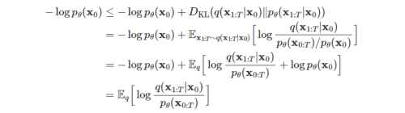

---
layout: post   
title: High-Resolution Image Synthesis with Latent Diffusion Models      
subtitle: AI Paper Review       
tags: [ai, ml, computer vision, GAN, Image Generation, Latent Diffusion, Stable Diffusion, Image Synthesis]          
comments: true  
---  

Diffusion Model은 Denoising auto encoder의 일련의 과정을 image formation의 과정으로 분해함으로써, 이미지 합성분야에서 SOTA를 달성했다.
게다가 이러한 모델들의 공식화는 재학습 없이 이미지 생성 프로세스를 제어하는 안내 메커니즘을 가능하게 한다. 
하지만, 이러한 모델들은 직접적으로 pixel space에서 작동하기 때문에, 강력한 DM들을 최적화 하는 것은 종종 수많은 GPU days를 요하거나, inference 에 많은 비용이 들어간다,
DM의 학습을 제한된 계산 자원에서 퀄리티와 유연성을 해치지 않으면서 학습시키기 위해, 저자는 강력한 사전에 학습한 autoencoder의 latent space에 적용하였다. 
이전의 작업들과 다르게 이러한 representation 에서 DM을 학습시키는 것은 처음으로 복잡성과 디테일 보존간의 근접 최적화 포인트에 도달하게 하여 시각적 충실도를 크게 향상시켰다. 
모델 구조 내에 cross-attention layer를 도입함으로써, DM을 더욱 강력하고 유연한 조건부 generator, (예를들어 text, bbox등을 조건으로 넣는) 로 변형시켰다.
또한 이는 conv 방식으로 고화질 이미지 생성을 가능하게 하였다.
저자의 latent diffusion model(LDMs)은 image inpainting, class-conditional images synthesis, text-to-image, unconditional image generation, super-resolution
등의 다양한 테스크에서 새로운 SOTA를 달성하였다. 이와 동시에 pixel-based DM에 비해서 계산 비용을 크게 줄였다. 

[Paper Link](https://arxiv.org/pdf/2112.10752.pdf)  
[Stable Diffusion Code Link](https://github.com/CompVis/stable-diffusion)  
[Latent Diffusion Code Link](https://github.com/CompVis/latent-diffusion)  

## Preknowledge

### Diffusion Model 이란

[Reference Blog](https://process-mining.tistory.com/182)  

  

Diffusion model은 Data에 노이즈를 조금씩 더해 완전한 노이즈 데이터로 만드는 Forward process (Diffusion Process)와 
이 노이즈 데이터에서 노이즈를 조금씩 없애면서 복원해 Data를 만들어 내는 reverse process가 있다. 

즉, 이 Reverse process를 통해서 data를 생성하는 모델이다. 이를 위해서 우리는 실제 데이터 분포인 p(x_0)를 찾아내는 것이 목표이다.

#### Reverse Process 

p를 직접적으로 모델링 하는 것은 불가능 하기 때문에 Markov Chain 형태를 이용하여 approximation한다. 

  

위에서 정규분포의 평균과 표준편차는 학습되어야 하는 파라미터이다.
시작 지점의 노이즈만 있는 데이터의 분포는 간단하게 표준정규분포로 정의한다

 

#### Forward Process

forward process도 비슷하게 Markov chain을 사용하지만, data에 가우시안 노이즈를 더해가는 형태를 가진다.
이 forward process의 정보를 알아야 reverse process를 학습할 수 있다. 

 

forward process의 장점은 어떤 데이터가 주어졌을 때 특정 시점의 noised data를 자유롭게 sampling 할 수 있다는 것이다. 

  
  
  

#### Training

목적 함수는 실제 데이터 분포 p(x_0)를 찾아내는 것이기 때문에 maximum log likelihood 사용한다.

  
  

위 식을 풀이하면 최종적으로 아래식을 얻을 수 있고 이를 최소화 하는 것이 목적함수가 된다.

  

위 식을 좀더 쉽게 계산하기 위해서 Gaussian 분포간의 KL divergence 형태로 식을 변환한다.

  
  

최종 변환된 식은 아래와 같다. 

  

* L_T: reverse process p가 생성하는 최종 노이즈 x_T와 forward process q가 x_0 데이터가 주여졌을 때, 최종 생성하는 노이즈 x_T 간의 분포 차 
* L_t-1: reverse, forward process의 분포 차이 
* L_0: x_1으로부터 x_0를 추정하는 likelihood로 이를 최대화 하는 방향으로 학습한다.

## Method

고화질 이미지 합성이 가능하면서 학습 과정에서 계산 비용을 줄이기 위해, 저자는 비록 diffusion model이 지각적으로는 이에 상응하는 loss term 에서 undersampling을 통하여 관련없는 디테일은 무시하도록 
하였지만, 여전히 pixel space에서 값비싼 기능 평가를 필요로 한다는 것을 발견하였다. 

  

저자는 생성 학습 단계에서 압축의 명시적인 분리를 도입함으로써 이 단점을 회피할 것을 제안한다. 
이를 달성하기위해 저자는 직관적으로 이미지 space와 같은 space를 학습하는 autoencoding model을 활용하여, 계산 복잡도를 확연히 줄였다. 

이런 접근 방식은 몇가지 장점을 가져온다. 
* 고차원 이미지 공간을 떠나면, 샘플링이 저차원 공간에서 수행되기 때문에 계산적으로 훨씬 효율적인 DM을 얻는다
* UNet 아키텍처에 상속된 DM의 귀납적 편향 (공간적 구조를 가진 데이터에 특히 효과적)을 사용하여 공격적이면서 품질을 낮추는 압축의 필요성을 완화한다. 
* latent space가 다양한 generative model을 학습하는데 사용할 수 있는 일반화된 목적의 압축 모델을 얻는다. 

### 1. Perceptual Image Compression

저자의 perceptual 압축 모델은 이전의 연구에 기반하였으며, perceptual loss와 patch-based adversarial objective의 조합으로 학습된 autoencoder로 구성되어 있다. 

이는 local realism을 적용하여 reconstruction이 이미지 manifold로 제한되도록 하고, L2 또는 L1 목표와 같은 픽셀 공간 손실에만 의존하여 발생하는 흐릿함을 방지한다. 

인코더는 image를 factor f = H/h = W/w 로 다운 샘플링하는데, 저자는 다양한 다운 샘플링 factor를 조사하였다. 

* x: H x W x 3
* z = E(x) : h x w x c
* x^ = D(z) = D(E(x))  

latent space의 임의의 고분산을 피하기 위해, 저자는 두가지 종류의 regularization을 실험하였다. 

* KL-reg: 학습된 latent가 standard normal을 향하도록 약간의 KL-패널티를 주는 것 (VAE와 비슷)
* VQ-reg: Decoder에 vector quantization layer를 넣는 것 (VQGAN) 

저자의 후속 DM은 학습된 잠재 공간의 2차원 구조 (z=E(x)) 와 함께 작동하도록 설계 되었기 때문에 상대적으로 가벼운 압축율을 사용하여 좋은 reconstruction을 달성하였다. 
이는 학습돤 공간 z가 임의의 1D 순서에 의존하여 분포를 자동 회귀 모델링하여 z의 고유 구조를 상당 부분 무시한 이전의 연구와 대조적이다. 

따라서 저자의 압축 모델은 x의 디테일을 더 잘 보존할 수 있었다. 

### 2. Latent Diffusion Models

#### Diffusion Models

DM은 정규 분포 변수를 점진적으로 노이즈를 제거하여 데이터 분포 p(x)를 학습하도록 설계된 확률론적 모델로, 길이 T의 고정 마르코프 체인의 reverse process를 학습하는 것에 해당한다.
이미지 합성을 위해서, 대부분의 성공적인 모델은 노이즈 제거 점수 일치를 반영하는 p(x)의 변동 하한의 가중치 변현에 의존한다. 

이런 모델은 노이즈 제거 autoencoder E(x_t, t)의 동일한 가중치 시퀀스로 해석될 수 있으며, 이는 아래와 같이 압축하여 표현할 수 있다. 

  

#### Generative Modeling of Latent Representations
E와 D로 구성된 저자의 학습된 perceptual compression model로 
인지 할 수 없는 높은 디테일을 가진 고주파수는 추상화 된 low-dimensional latent space에 효율적으로 접근이 가능하다. 
고차원의 pixel 공간과 비교하여, 이 space는 likelihood 기반 generative model이 더욱 적합하다. 

* 중요하고 의미가 있는 bit에 더 집중할 수 있다.
* 저차원에서 학습하면 계산적으로 훨씬 효율적이다. 

이전 연구들이 고도로 압축된 discrete latent space에서의 autoregressive, attention 기반 transformer model에 의존했던 것과 달리 
저자의 모델은 이미지 특화 귀납적 bias의 장점을 취할 수 있다. 
이는 UNet을 주된 2D conv 레이어로 구축하는 능력을 포함하며, 추가적으로 재가중된 bound를 사용하여 지각적으로 가장 관련성이 높은 bit에 목표를 집중시킨다. 

  

여기서 E(z, t)는 time-conditional UNet 이다. 
forward pass는 고정되어 있기 떄문에 z_t는 학습과정에서 효과적으로 E를 통해 얻을 수 있고, p(z)의 샘플은 D를 통해 image space로 decode 된다. 

### 3. Conditioning Mechanism

다른 생성모델과 비슷하게 diffusion model은 conditional distribution p(z|y)를 모델링 할 수 있다. 
이는 conditional denoising autoencoder E(z_t, t, y)와 text, semantic map, 또는 image-to-image translation 과 같은 입력 y를 통해 합성 프로세스를 제어한다.

그러나 이미지 합성의 맥락에서 DM의 생성력을 class-label 또는 input image의 흐릿한 변형을 넘어서는 다른 유형의 조건과 결합하는 것은 지금까지 충분히 탐구되지 않은 연구 영역이다.

저자는 UNet backbone을 cross-attention 매커니즘으로 증강시켜 DM을 더 유연한 conditional image generator로 변화시켰다. 

언어 prompt 같은 다양한 양식으로부터 pre-process 하기 위해, 저자는 domain specific encoder를 사용하여 input y를 intermediate representation에 project하였다. 
이는 아래 식과 같이 cross-attention layer이 적용되는 UNet의 중간계층에 맵핑된다.  

  

* 휘가 의미하는 바는 UNet을 적용한 (flattened) intermediate representation 이다
* 타우가 의미하는 바는 y를 project 하기 위한 domain specific encoder 이다.

이해가 쉽도록 그림으로 보면 아래와 같다.

  

이런 image-conditioning pair에 기본하여 아래와 같이 conditional LDM을 학습한다.

  

## Experiments
  
  
  
  