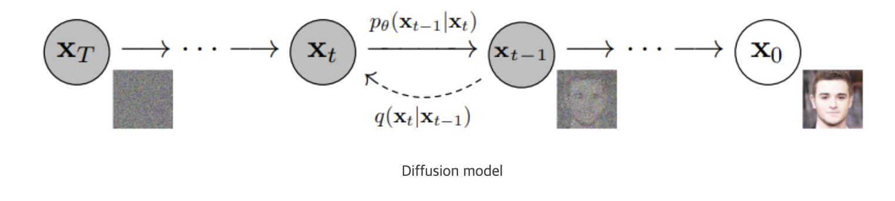
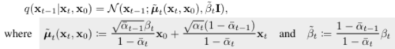
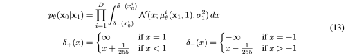

---
layout: post   
title: High-Resolution Image Synthesis with Latent Diffusion Models      
subtitle: AI Paper Review       
tags: [ai, ml, computer vision, GAN, Image Generation, Diffusion Model, Latent Diffusion, Stable Diffusion, Image Synthesis]          
comments: true  
---  

Diffusion Model은 Denoising auto encoder의 일련의 과정을 image formation의 과정으로 분해함으로써, 이미지 합성분야에서 SOTA를 달성했다.
게다가 이러한 모델들의 공식화는 재학습 없이 이미지 생성 프로세스를 제어하는 안내 메커니즘을 가능하게 한다. 
하지만, 이러한 모델들은 직접적으로 pixel space에서 작동하기 때문에, 강력한 DM들을 최적화 하는 것은 종종 수많은 GPU days를 요하거나, inference 에 많은 비용이 들어간다,
DM의 학습을 제한된 계산 자원에서 퀄리티와 유연성을 해치지 않으면서 학습시키기 위해, 저자는 강력한 사전에 학습한 autoencoder의 latent space에 적용하였다. 
이전의 작업들과 다르게 이러한 representation 에서 DM을 학습시키는 것은 처음으로 복잡성과 디테일 보존간의 근접 최적화 포인트에 도달하게 하여 시각적 충실도를 크게 향상시켰다. 
모델 구조 내에 cross-attention layer를 도입함으로써, DM을 더욱 강력하고 유연한 조건부 generator, (예를들어 text, bbox등을 조건으로 넣는) 로 변형시켰다.
또한 이는 conv 방식으로 고화질 이미지 생성을 가능하게 하였다.
저자의 latent diffusion model(LDMs)은 image inpainting, class-conditional images synthesis, text-to-image, unconditional image generation, super-resolution
등의 다양한 테스크에서 새로운 SOTA를 달성하였다. 이와 동시에 pixel-based DM에 비해서 계산 비용을 크게 줄였다. 


[Paper Link](https://arxiv.org/pdf/2112.10752.pdf)  
[Stable Diffusion Code Link](https://github.com/CompVis/stable-diffusion)  
[Latent Diffusion Code Link](https://github.com/CompVis/latent-diffusion)  

## Prior Knowledge

### Diffusion Model 이란?

[Reference Blog 1](https://process-mining.tistory.com/182)  
[Reference Blog 2](https://happy-jihye.github.io/diffusion/diffusion-1/)    

  

Diffusion model은 Data에 노이즈를 조금씩 더해 완전한 노이즈 데이터로 만드는 Forward process (Diffusion Process)와 
이 노이즈 데이터에서 노이즈를 조금씩 없애면서 복원해 Data를 만들어 내는 reverse process가 있다. 

즉, 이 Reverse process를 통해서 data를 생성하는 모델이다. 이를 위해서 우리는 실제 데이터 분포인 p(x_0)를 찾아내는 것이 목표이다.

딥러닝에서 복잡한 dataset을 확률분포로 표현하는 것이 중요한데, 이때 tractability와 flexibility라는 개념이 중요하다. 
* tractability: Gaussian이나 Laplace distribution 같이 분석하기 쉬운 분포에 data가 쉽게 fit
* flexibility: 임의의 복잡한 data에 적용 가능한 분포  

하지만, 이 둘의 개념은 trade-off 관계이기 때문에 동시에 만족하는 분포를 찾긴 힘들었다. 
그래서 Diffusion Probability Model은 Diffusion 과정을 통해서 Gaussian 같은 쉬운 분포를 이용하여 Markov chain을 학습시켜 target data distribution으로 
변환 가능한 tractability 하면서, flexibility 한 분포를 구하게 하는 것이 목표이다.

VAE 같은 모델들은 이미지를 Encoding 하는 네트워크와 Decoding 하는 네트워크 모두를 학습시켜야 하는 반면, 
Diffusion Model은 이미지를 encoding 하는 forward process는 고정한채, 이미지를 decoding 하는 reverse process 만을 학습한다. 

### Denoising diffusion probabilistic models (DDPM)  

DDPM은 Diffusion model을 활용한 image generative model을 제시한 논문이다. 
기존 Diffusion 모델에서 loss와 parameter estimation 과정을 학습이 더 잘되게 발전시켰다는 데서 의미가 있다. 

#### Reverse Process 

```text
우리가 알고 싶은 것은 Forward process의 반대인 q(x_t-1 | x_t) 이나, 이를 알기에는 어렵다.  
그래서 이와 유시한 p(x_t-1 | x_t)의 parameter를 예측하는 것이다. 
```

p를 직접적으로 모델링 하는 것은 불가능 하기 때문에 Markov Chain 형태를 이용하여 approximation한다. 
* 여기서 Markov Chain의 성질
  * 특정 상태에서의 확률은 오직 과거 상태에 의존한다. 
  * 즉, 과거와 현재 상태가 주어졌을 때, 미래 상태의 조건부 확률분포는 과거 상태와 독립적으로 현재 상태에 의해서만 결정된다.

```text
P( x_t+1 | x_t ) = P ( x_t+1 | x1, x2, ..., x_t )  
```

  

위에서 정규분포의 평균과 표준편차는 학습되어야 하는 파라미터이다.
시작 지점의 노이즈만 있는 데이터의 분포는 간단하게 표준정규분포로 정의한다.   

 

```text
q(x_t-1 | x_t)를 구할 순 없지만, q(x_t-1 | x_t, x_0)는 구할 수 있다.  
Bayes' Rule: p(x|y,z) = p(y|x,z)*p(x|z)/p(y|z)    
q(x_t-1 | x_t, x_0) = q(x_t | x_t-1, x_0 ) * q(x_t-1|x_0) / q(x_t|x_0)
```

  

#### Forward Process

forward process도 비슷하게 Markov chain을 사용하지만, data에 가우시안 노이즈를 더해가는 형태를 가진다.
이 forward process의 정보를 알아야 reverse process를 학습할 수 있다.   

노이즈를 추가할 때, variance schedule b를 이용하여 scaling 한 후 더해준다.  

* 이때, root(1-b)로 하는 이유는 variance가 발산하는 것을 막기 위함이다. (일정 수준으로 유지)

```text
x_t = root(1 - b_t) * x_t-1 + b_t * e  
x_t를 x_t_1과 e 벡터의 합이라고 생각했을때 벡터 크기는 아래와 같다.  
root(1 - b_t)^2 + b_t = 1
```

* 이 값을 학습 가능한 파라미터로 둘 수 있지만, 실험 결과 상수로 두어도 차이가 없어 상수를 사용한다 
* 매 step 마다 gaussian distribution에서 reparameterize를 통해 sampling
* 데이터가 이미지와 비슷할 때에는 이 값을 매우 작게 설정하다가, gaussian distribution에 가까워 질수록 이 값을 크게 설정한다. 


forward process의 장점은 어떤 데이터가 주어졌을 때 특정 시점의 noised data를 자유롭게 sampling 할 수 있다는 것이다. 
* Reparameterizing

  
  
  

#### Training
우리의 목적은 실제 분포 p(x_0)을 찾는 것이므로 VAE 처럼 Data likelihood p(x_0)를 maximize 하는 것이 목적이다.  
DDPM 에서는 negative log-likelihood를 사용하여 Minimize 하는 것을 목적으로 한다 (= -log(p(x_0))) 

  

이제 위에서 구한 training objective를 다시 살펴보겠다. 

   

##### L_T: Forward Process Posterior 

```text
사후 확률 p(x_T|x_0)와 비슷한 tractable한 분포 q(x_T | x_0)  
```

VAE 에서는 사후 확률이 사전 확률 (Gaussian Dist.)를 따르도록 강제하는 loss로 사용된다. 

DDPM 에서는 forward process는 x_T를 항상 gaussian noise로 만들기 때문에, L_T는 항상 0에 가까운 상수로써, 학습 과정에서 무시할 수 있다. 

##### L_t-1: Reverse Process 
학습에서 중요한 loss term 으로 풀이하면 아래와 같다. 

   

위의 전개식에서 predict m에 대해서는 위에서 Bayes' Rule로 푼 M(x_t, x_) 에 대한 식을 적용하여 아래와 같이 증명할 수 있다. 

    

##### L_0: Data Scaling, Reverse Process Decoder



VAE 입장에서는 reconstruction loss와 동일하다. 
실제로는 VAE는 Z~N(0,I) 에서 원본이미지를 재현해야 하는 반면, DDPM은 아주 미세한 noisy image에서 원본이미지를 재현하는 것이므로,
더 쉬운 task 이다.

이미지 데이터는 (0,1,...,255) 정수로 구성되어 있지만, 이를 (-1, 1)로 선형적으로 스케일링 하였다. 
이를 통해 reverse process가 표준 정규 분포에서 시작하여 일관되게 스케일링 된 입력에서 작동하도록 보장한다. 
여기서 D는 데이터 차원이고, i는 하나의 좌표 추출을 나타낸다.

수식은 어려워 보이지만, 실제로는 x_1으로 예측한 x_0와 실제 x_0 간의 MSE로 구하는 것과 같다. 

##### Simplication

  
Loss function은 epsilon을 예측하는 것이 성능이 더 좋았고, 복잡한 coefficient를 뺴고 fixed variance를 사용하는 것이 성능이 더 좋았다.
학습 알고리즘과 샘플링(Generation) 알고리즘을 간소화 하면 아래와 같다. 

  
학습이 끝난 후에는 완전한 Gaussian을 따르는 x_T에서 시작하여 순차적 sampling을 통해서 실제 같은 이미지 x_0을 생성할 수 있다. 

## Method

고화질 이미지 합성이 가능하면서 학습 과정에서 계산 비용을 줄이기 위해,
저자는 비록 diffusion model이 지각적으로는 이에 상응하는 loss term 에서 undersampling을 통하여 관련없는 디테일은 무시하도록 
하였지만, 
여전히 pixel space에서 값비싼 기능 평가를 필요로 한다는 것을 발견하였다. 

저자는 생성 학습 단계에서 압축의 명시적인 분리를 도입함으로써 이 단점을 회피할 것을 제안한다. 

이를 달성하기위해 저자는 직관적으로 이미지 space를 학습하는 autoencoding model을 활용하여, 계산 복잡도를 확연히 줄였다.

Stable Diffusion Model의 keypoints는 아래와 같다. 
- Denising 과정에서 Auto Encoder를 사용한다. 
- Pixel 공간이  아닌 Latent Space에서 Denoising을 진행하여, 수많은 GPU days를 줄일 수 있다. 
- 모델의 복잡성이 감소하고, 세부 표현 능력이 증가한다.
- 모델 구조에 cross-attention을 사용함으로써, text, audio 등과 같은 다른 도메인을 함께 사용 가능하다. 

  
  

Stable Diffusion model은 간략히 표현하면 VAE와 Diffusion의 과정을 섞은 구조이다.  

### 1. Perceptual Image Compression

저자는 perceptual loss와 patch-based adversarial objective 를 사용하여 AutoEncoder 모델을 학습하엿다.

여기서 paatch-based adversarial loss는 이미지 전체를 이용해서 판별하지 않고, 패치 단위로 잘라서 판별하는 방식이다.
이는 local realism을 살릴 수 있고, reconstruction이 이미지 manifold로 제한되도록 하고,
L2 또는 L1 목표와 같은 픽셀 공간 손실에만 의존하여 발생하는 흐릿함을 방지할 수 있다. 

인코더는 image를 factor f = H/h = W/w 로 다운 샘플링하는데, 저자는 다양한 다운 샘플링 factor를 조사하였다. 

* x: H x W x 3
* z = E(x) : h x w x c
* x^ = D(z) = D(E(x))  

latent space의 임의의 고분산을 피하기 위해, 저자는 두가지 종류의 regularization을 실험하였다. 

* KL-reg: 학습된 latent가 standard normal을 향하도록 약간의 KL-패널티를 주는 것 (VAE와 비슷)
* VQ-reg: Decoder에 vector quantization layer를 넣는 것 (VQGAN) 

결론적으로는 VQ-reg가 성능이 더 좋아서 이를 선택하였다. 

저자의 후속 DM은 학습된 잠재 공간의 2차원 구조 (z=E(x)) 와 함께 작동하도록 설계 되었기 때문에 상대적으로 가벼운 압축율을 사용하여 좋은 reconstruction을 달성하였다. 
이는 학습돤 공간 z가 임의의 1D 순서에 의존하여 분포를 자동 회귀 모델링하여 z의 고유 구조를 상당 부분 무시한 이전의 연구와 대조적이다. 

따라서 저자의 압축 모델은 x의 디테일을 더 잘 보존할 수 있었다. 

### 2. Latent Diffusion Models

#### Diffusion Models

DM은 정규 분포 변수를 점진적으로 노이즈를 제거하여 데이터 분포 p(x)를 학습하도록 설계된 확률론적 모델로, 길이 T의 고정 마르코프 체인의 reverse process를 학습하는 것에 해당한다.
이미지 합성을 위해서, 대부분의 성공적인 모델은 노이즈 제거 점수 일치를 반영하는 p(x)의 변동 하한의 가중치 변형에 의존한다. 

이런 모델은 노이즈 제거 autoencoder E(x_t, t)의 동일한 가중치 시퀀스로 해석될 수 있으며, 이는 아래와 같이 압축하여 표현할 수 있다. 

  

#### Generative Modeling of Latent Representations

인지 할 수 없는 높은 디테일을 가진 고주파수는 추상화 된 low-dimensional latent space에서 효율적으로 접근이 가능하다. 
고차원의 pixel 공간과 비교하여, 이 space는 likelihood 기반 generative model이 더욱 적합하다. 

* 중요하고 의미가 있는 bit에 더 집중할 수 있다.
* 저차원에서 학습하면 계산적으로 훨씬 효율적이다. 

이전 연구들이 고도로 압축된 discrete latent space에서의 autoregressive, attention 기반 transformer model에 의존했던 것과 달리 
저자의 모델은 이미지 특화 귀납적 bias의 장점을 취할 수 있다. 
이는 UNet을 주된 2D conv 레이어로 구축하는 능력을 포함하며, 추가적으로 재가중된 bound를 사용하여 지각적으로 가장 관련성이 높은 bit에 목표를 집중시킨다. 

  

여기서 E(z, t)는 time-conditional UNet 이다. 
forward pass는 고정되어 있기 떄문에 z_t는 학습과정에서 효과적으로 E를 통해 얻을 수 있고, p(z)의 샘플은 D를 통해 image space로 decode 된다. 

### 3. Conditioning Mechanism

다른 생성모델과 비슷하게 diffusion model은 conditional distribution p(z|y)를 모델링 할 수 있다. 
이는 conditional denoising autoencoder E(z_t, t, y)와 text, semantic map, 또는 image-to-image translation 과 같은 입력 y를 통해 합성 프로세스를 제어한다.

그러나 이미지 합성의 맥락에서 DM의 생성력을 class-label 또는 input image의 흐릿한 변형을 넘어서는 다른 유형의 조건과 결합하는 것은 지금까지 충분히 탐구되지 않은 연구 영역이다.

저자는 UNet backbone을 cross-attention 매커니즘으로 증강시켜 DM을 더 유연한 conditional image generator로 변화시켰다. 

언어 prompt 같은 다양한 양식으로부터 pre-process 하기 위해, 저자는 domain specific encoder를 사용하여 input y를 intermediate representation에 project하였다. 
이는 아래 식과 같이 cross-attention layer이 적용되는 UNet의 중간계층에 맵핑된다.  

  

* 휘가 의미하는 바는 UNet을 적용한 (flattened) intermediate representation 이다
* 타우가 의미하는 바는 y를 project 하기 위한 domain specific encoder 이다.

이해가 쉽도록 그림으로 보면 아래와 같다.

  

이런 image-conditioning pair에 기본하여 아래와 같이 conditional LDM을 학습한다.

  

## Experiments
  
  
  
  