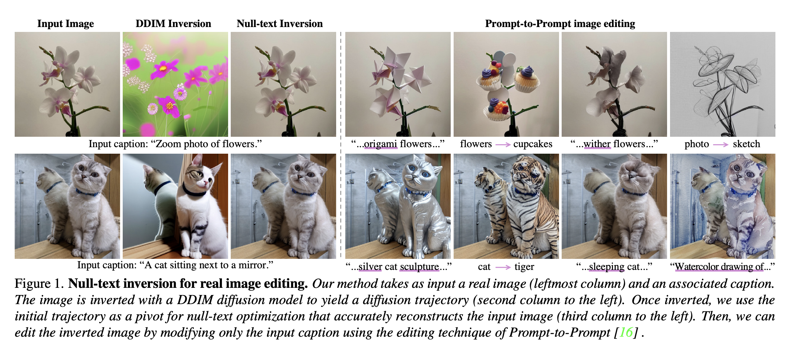
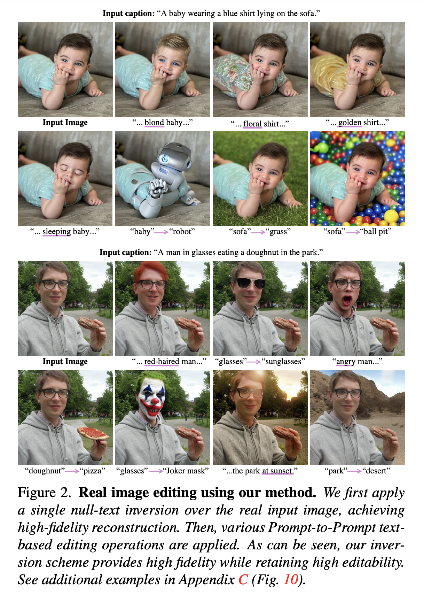

---
layout: post   
title: Null-text Inversion for Editing Real Images using Guided Diffusion Models        
subtitle: AI Paper Review       
tags: [ai, ml, computer vision, GAN, Image Generation, Stable Diffusion, Text-guided Diffusion model, Image Editing]          
comments: true  
---  

최근 text-guided diffusion 모델은 아주 강력한 이미지 생성 능력을 가지고 있다. 
최근 많은 노력들로 인해서 이미지를 오직 텍스트로 수정할 수 있게 직관적이고 다재다능한 editing을 재공하게 되었다. 
이런 SOTA tool들을 이용해서 이미지를 수정하기 위해서는 이미지를 의미있는 text prompt와 함께 pretrained model의 domain으로 바꾸어야 한다. 
이 논문에서 저자는 정확한 inversion 테크닉을 소개한다. 이는 직관적인 text 기반 이미지 수정이 가능하게 한다. 
저자가 제안하는 inversion 은 두개의 새로운 key 요소들로 구성되어 있다. (1) Pivotal inversion for Diffusion Model. 
현재 방법들은 무작위 노이즈 샘플을 단일입력 이미지에 맙핑하는 것을 목표로하지만, 
저자의 방법은 각 timestamp에 단일 pivotal noise vector를 사용하고 그 주변을 최적화 한다. 
저자는 직접적인 반전 자체가 부적절하지만, 최적화를 위해 좋은 anchor를 제공한다는 것을 보여준다.
(2) Null-text optimization, 저자는 input text embedding을 수정하는 것이 아니라 
classifier-free guidance에 사용되는 unconditional textual embedding만을 수정한다. 
이는 모델 weights와 condition embedding이 손상되지 않게 유지하여, 모델 가중치의 번거로운 조정을 피하면서 prompt 기반의 수정이 가능하게 한다. 
저자의 Null-text inversion은 대중적으로 접근 가능한 Stable Diffusion 모델을 기반으로 하여, 다양한 이미지에서 평가하였을 때 높은 충실도를 보였다.

[Paper Link](https://arxiv.org/pdf/2211.09794v1.pdf)  
[Code Link](https://github.com/google/prompt-to-prompt)  

  

## Prior Knowledge
### DDIM ([Denoising Diffusion Implicit Models](https://arxiv.org/abs/2010.02502))

[Reference Blog](https://kimjy99.github.io/%EB%85%BC%EB%AC%B8%EB%A6%AC%EB%B7%B0/ddim/)  

## Methods
우리의 목표는 오직 text 가이드만을 이용해서 이미지를 수정하는 것이다. 
저자는 이를 위해 source prompt P와 edited prompt P* 로 editing 가이드를 수행하는 Prompt-to-Prompt 셋팅을 사용한다. 
이를 위해서 사용자는 source prompt를 제공해야한다.
하지만, off-the-shelf captioning model을 사용하여 이러한 source prompt를 자동으로 생성할 수 있음을 밝혔다. 

  

위 이미지에서 source prompt "A baby wearing..." 을 "A robot wearing..." prompt로 변경 함으로써 baby를 robot으로 교체하는 예시를 보여준다. 

이런 editing operation들은 먼저 input 이미지를 모델의 output domain으로 뒤집는게 필요하다.
즉, 주요과제는 직관적인 텍스트 기반 편집 능력을 유지하면서 source prompt P를 모델에 공급하여 이미지 I를 충실하게 재구성하는 것이다. 

저자의 접근 방식은 두가지 주요 관찰점이 있다.

