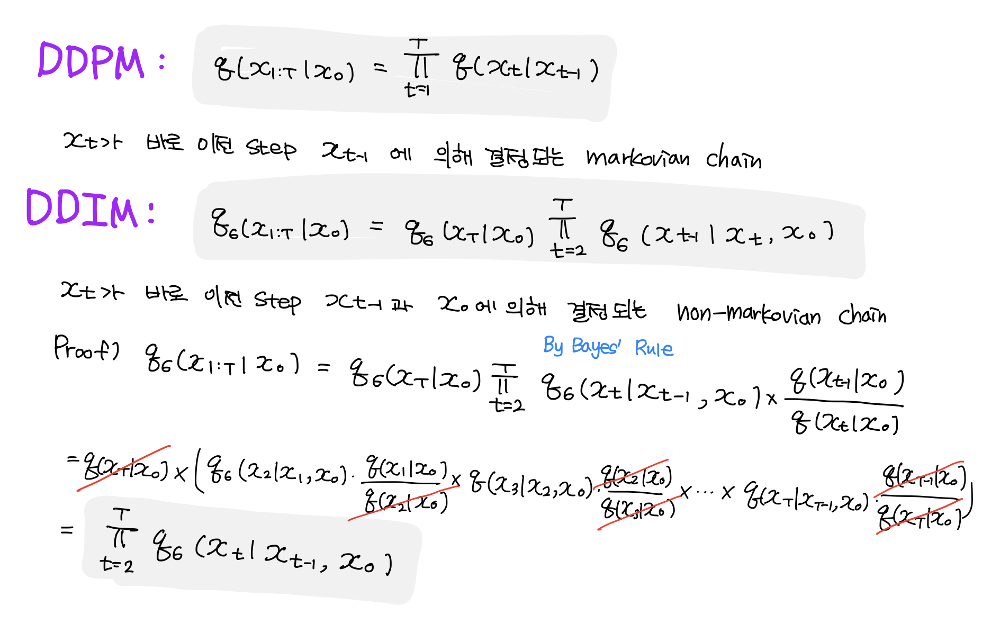
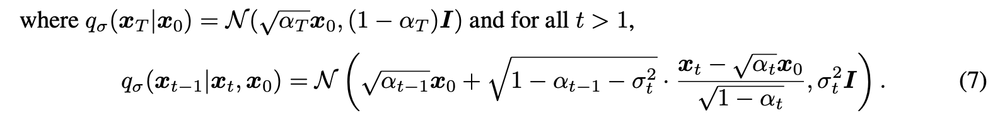
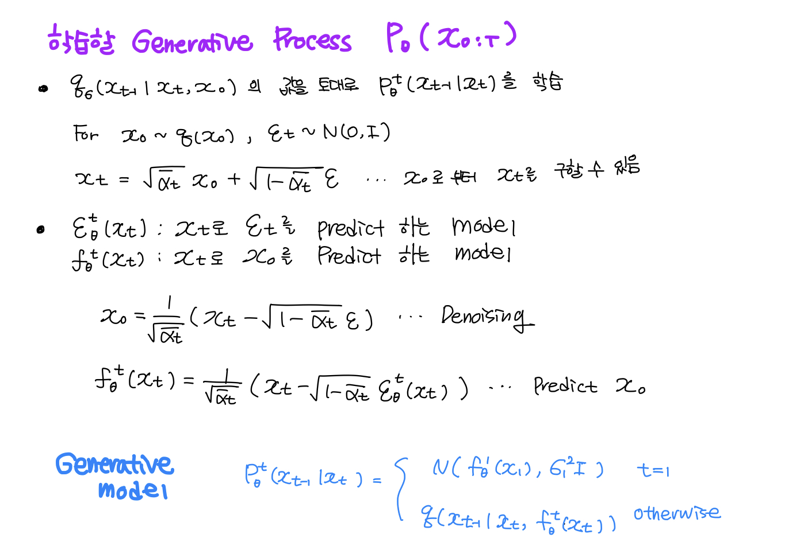
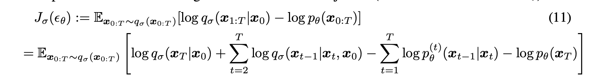

---
layout: post   
title: Null-text Inversion for Editing Real Images using Guided Diffusion Models        
subtitle: AI Paper Review       
tags: [ai, ml, computer vision, GAN, Image Generation, Stable Diffusion, Text-guided Diffusion model, Image Editing]          
comments: true  
---  

최근 text-guided diffusion 모델은 아주 강력한 이미지 생성 능력을 가지고 있다. 
최근 많은 노력들로 인해서 이미지를 오직 텍스트로 수정할 수 있게 직관적이고 다재다능한 editing을 재공하게 되었다. 
이런 SOTA tool들을 이용해서 이미지를 수정하기 위해서는 이미지를 의미있는 text prompt와 함께 pretrained model의 domain으로 바꾸어야 한다. 
이 논문에서 저자는 정확한 inversion 테크닉을 소개한다. 이는 직관적인 text 기반 이미지 수정이 가능하게 한다. 
저자가 제안하는 inversion 은 두개의 새로운 key 요소들로 구성되어 있다. (1) Pivotal inversion for Diffusion Model. 
현재 방법들은 무작위 노이즈 샘플을 단일입력 이미지에 맙핑하는 것을 목표로하지만, 
저자의 방법은 각 timestamp에 단일 pivotal noise vector를 사용하고 그 주변을 최적화 한다. 
저자는 직접적인 반전 자체가 부적절하지만, 최적화를 위해 좋은 anchor를 제공한다는 것을 보여준다.
(2) Null-text optimization, 저자는 input text embedding을 수정하는 것이 아니라 
classifier-free guidance에 사용되는 unconditional textual embedding만을 수정한다. 
이는 모델 weights와 condition embedding이 손상되지 않게 유지하여, 모델 가중치의 번거로운 조정을 피하면서 prompt 기반의 수정이 가능하게 한다. 
저자의 Null-text inversion은 대중적으로 접근 가능한 Stable Diffusion 모델을 기반으로 하여, 다양한 이미지에서 평가하였을 때 높은 충실도를 보였다.

[Paper Link](https://arxiv.org/pdf/2211.09794v1.pdf)  
[Code Link](https://github.com/google/prompt-to-prompt)  

## Prior-Knowledge

### Denoising Diffusion Implicit Models ([DDIM](https://arxiv.org/abs/2010.02502))

[Reference Blog](https://happy-jihye.github.io/diffusion/diffusion-2/)  

DDPM은 adversarial training 없이 image generation이 잘됨을 증명하였다. 
하지만 Markov Chain을 이용하여 모델을 학습, 생성하기 때문에, 샘플을 생성하려면 수많은 step을 거쳐야 하는 문제가 있다. 

DDIM은 더 빠르게 샘플을 생성하기 위해 non-markovian Diffusion Process인 implicit probabilistic model을 거쳐서 DDPM을 일반화 한다. 
이를 통해 좀더 Deterministic한 generative process를 학습할 수 있으며, 더 좋은 성능의 샘플을 생성할 수 있게 되었다. 

#### Variational Inference For Non-Markovian Forward Processes

##### Non-Markovian Forward Process

  

##### Generative Process and Unified Variational Inference Objective

우선 forward process와 reverse process는 아래와 같은 분포를 가진다. 

  

여기서 시그마의 크기는 forward process의 확률을 제어한다. 
만약 극단적으로 sigma -> 0 이 된다면, x_0과 x_t를 관찰한다면, 어떠한 t에 대해서도 x_t-1이  알려지고, 고정되는 극단적인 경우에 도달한다. 

* Variational Inference Objective

  

위 식 J에서 시그마를 어떠한 값으로 두고 학습 하냐에 따라 다른 모델이 된다. 
하지만 J는 특정한 weight 감마에 대한 L과 같다. 

  

variational objective L 은 위에서 정의한 x_t로 앱실론_t를 평가하는 모델 파라미터를 서로다른 t에 대해서 공유하지 않으면, optimal solution은 
감마 값에 대해 의지하지 않는다. 
L의 이러한 특징은 두가지 시사하는 바가 있다.
한편으로, 이것은 DDPM variational objective 하한에 대한 대리 목적함수로 L1을 사용하는 것을 정당화 한다. 
다른 한편으로 J는 Theorem의 일부 L과 같기 때문에, J의 최적 솔루션도 L1의 것과 같다. 

따라서, 앱실론_t를 평가하는 모델이 스텝 t마다 공유되지 않을 경우, L1 objective를 J에 대한 대리 목표로도 사용할 수 있다. 

#### Sampling from Generalized Generative Processes

Theorem 1에 따르면, 감마를 1로 두었을 때 optimal solution을 구할 수 있다. 따라서 L1을 objective function으로써 사용한다. 
시그마를 어떻게 설정하냐에 따라서 forward process를 markovian process로 학습시킬 수도 있고, non-markovian process로 학습시킬 수도 있다. 

즉, markovian process로 학습시킨 학습된 DDPM 모델의 파라미터를 DDIM의 generative process에서도 이용할 수 있다. 
DDIM은 새로운 훈련 방법을 제시했다기 보다는, non-markovian chain을 통해서 더 빠르게 generation이 가능한 sampling 방법을 제시했다는 것이 중요하다. 
그래서 DDPM으로 학습시킨 모델을 DDIM의 generation 방식으로 샘플링하여 좋은 성능의 모델(DDPM)을 사용하며, 더 빠르게 생성(DDIM) 할 수 있다. 

## Methods
우리의 목표는 오직 text 가이드만을 이용해서 이미지를 수정하는 것이다. 
저자는 이를 위해 source prompt P와 edited prompt P* 로 editing 가이드를 수행하는 Prompt-to-Prompt 셋팅을 사용한다. 
이를 위해서 사용자는 source prompt를 제공해야한다.
하지만, off-the-shelf captioning model을 사용하여 이러한 source prompt를 자동으로 생성할 수 있음을 밝혔다. 

  

위 이미지에서 source prompt "A baby wearing..." 을 "A robot wearing..." prompt로 변경 함으로써 baby를 robot으로 교체하는 예시를 보여준다. 

이런 editing operation들은 먼저 input 이미지를 모델의 output domain으로 뒤집는게 필요하다.
즉, 주요과제는 직관적인 텍스트 기반 편집 능력을 유지하면서 source prompt P를 모델에 공급하여 이미지 I를 충실하게 재구성하는 것이다. 

저자의 접근 방식은 두가지 주요 관찰점이 있다.

