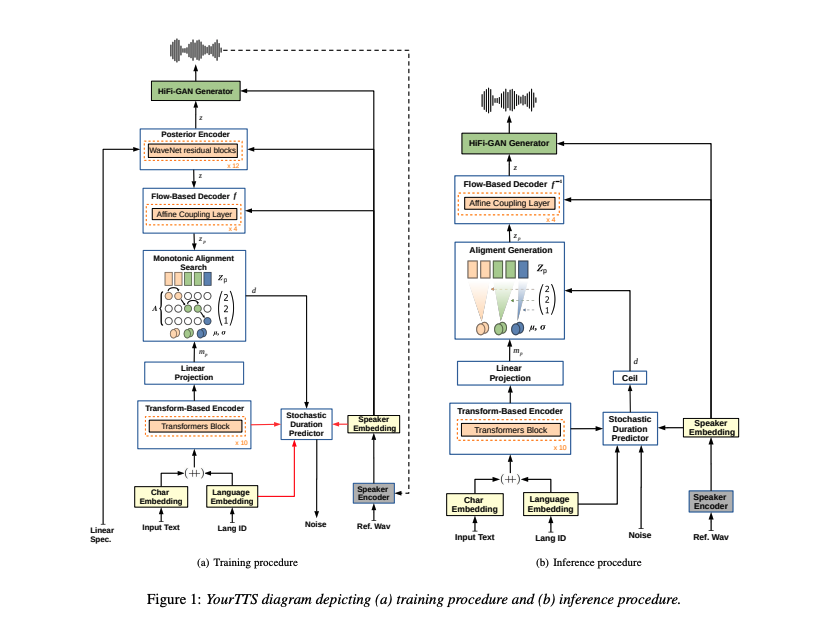
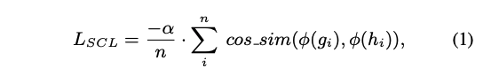
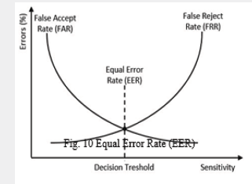
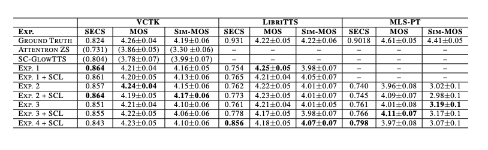

---
layout: post   
title: (YourTTS) Towards Zero-Shot Multi-Speaker TTS and Zero-Shot Voice Conversion for everyone           
subtitle: AI Paper Review       
tags: [ai, ml, tts, Text-to-Speech, Voice Conversion, Language Model]          
comments: true  
---  

yourTTS는 zero-shot multi-speaker TTS를 위한 강력한 다국어 접근 방식을 가져왔다. 
저자의 방법은 VITS 모델을 기반으로 개발되었으며, zero-shot multi-speaker 과 다국어 학습이 가능하도록 몇가지 새로운 수정을 더하였다. 
이 방법은 zero-shot multi-speaker TTS에서 SOTA 성능을 내었으며, VCTK 데이터셋에서 zero-shot voice conversion 또한 SOTA와 견줄만한 성능을 내었다.
게다가 저자의 접근 방식은 single-speaker 데이터셋으로 target language를 학습 시키는데 아주 뛰어나며, 
low resource 언어로 된 zero-shot multi-speaker TTS 및 zero-shot voice conversion 시스템에 대한 가능성을 연 방법이다.
더욱이, 1분 미만의 speech 데이터로 YourTTS 모델을 fine-tune하여 목소리 유사성에서 SOTA 성능을 내었으며, 결과 또한 합리적인 퀄리티를 생성해 내었다.
이것은 훈련 중에 보이는 것과 매우 다른 음성 또는 녹음 특성을 가진 화자에 대한 합성을 허용한다는 것에서 중요하다.

[Paper Link](https://arxiv.org/pdf/2112.02418.pdf)  
[Code Link](https://github.com/Edresson/YourTTS)  

## Introduction 
TTS 시스텝은 최근에 딥러닝 접근 방식으로 큰 발전을 이루어 왔으며, speech 기반의 virtual assistance 와 같은 어플리케이션을 성공적으로 만들어 주었다.
대부분의 TTS 시스템은 단일 화자의 목소리에 맞추어 제작되었지만, 최근에는 오직 몇초만의 짧은 스피치를 통해 새로운 화자의 목소리를 합성하는데 관심이 생겨나고 있다. (학습과정에서 본적 없는 화자) 
이런 접근 방식을 zero-shot multi-speaker TTS (ZS-TTS)라고 한다.

딥러닝을 사용한 ZS-TTS는 DeepVoice 3 에서 먼저 제안되었다.
한편 Tacotron 2는 일반화된 end-to-end loss를 사용하여 학습된 speaker encoder에서 추출된 외부 speaker embedding을 사용하여, 대상 스피커와 유사한 음성 생성을 가능하게 하였다. 
Tacotron 2는 unseen 스피커의 음성 유사성과 자연스러움을 개선하기 위해 LDE 임베딩과 함꼐 다른 스피커 임베딩 방법을 함께 사용하였다. 
또한 위의 저자는 gener-dependent 모델이 unseen speaker에 대한 유사성 성능을 더 증진 시킬 수 있음을 보였다. 
이러한 맥락에서, Attentron은 attention 매커니즘과 함께 fine-graned encoder을 제안하여 다양한 reference sample로 부터 디테일한 스타일을 추출가능하게 하였다.
몇몇의 reference sample을 사용한 결과 unseen speaker에서 더 음성 유사도를 높일 수 있었다. 

ZSM-SS는 Transformer 기반의 구조와 정규화 구조, Wav2Vec 2.0에서의 external speaker encoder 구조를 가지고 있다.
이 저자는 speaker embedding, pitch, energy로 normalization 구조에 조건을 적용하였다.
그러나 놀라운 성능을 보였음에도 불구하고 저자는 다른 관련된 모델들과 비교를 하지 않았다. 

SC-GlowTTS는 ZS-TTS에서 처음으로 flow 기반을 적용한 모델이다. 
이또한 매우 좋은 성능을 내었다.

이러한 발전에도 불구하고, 훈련 중에 관찰된 화자와 관찰되지 않은 화자 사이의 유사성 격차는 여전히 미해결 질문이다.
ZS-TTS 모델은 여전히 헉습을 위해 수많은 speaker 데이터를 필요로 하기 때문에, low-resource language 에서는 여전히 개발을 어렵게 한다.
게다가 현재의 ZS-TTS의 품질은 특히 훈련에서 보이는 것과 다른 음성 특성을 가진 대상 스피커에 대해 충분히 좋지 않다.

ZS-TTS와 병행하여 다국어 TTS는 동시에 여러 언어에 대한 모델을 학습시키는 것을 목표로 발전했다. 
이러한 모델 중 일부는 동일한 음성을 유지하면서 문장의 일부에 대한 대상 언어 변경과 같은 코드 전환을 허용하기 때문에 특히 흥미롭다.
이는 ZS-TTS에서 한 언어에서의 speaker들을 다른 언어에서의 합성을 하는 데 사용할 수 있게 하여 유용하다. 

이 논문에서 저자는 zero-shot multi-speaker와 multilingual 학습에 포커스한 YourTTS를 제안한다. 
yourTTS는 아래와 같은 contribution을 달성하였다.
- 
- English 에서 SOTA 결과
- zero-shot multi-speaker TTS 범위에서 multilingual 접근 방식을 처음으로 제안
- 학습 중 대상 언어의 스피커 하나만을 사용하여 유망한 품질과 유사성을 가진 대상 언어로 제로샷 멀티스피커 TTS 및 제로샷 음성 변환을 수행할 수 있는 기능
- 학습 데이터와 매우 다른 unseen speaker의 1분 미만의 speech 만으로도 fine-tune 하여 좋은 성능을 낼 수 있음

## Methods

yourTTS는 VITS를 기반하여 개발되었으며 zero-shot multi-speaker와 multilingual 학습이 가능하도록 몇가지 새로운 수정을 가미하였다.
먼저, 이전의 방법들과 다르게 저자는 phoneme를 사용하는 대신 raw text를 사용한다.
이를 통해 오픈 소스 grapheme-to-phoneme converts 없는 언어에 대해 보다 현실적인 결과를 얻을 수 있다.

이전의 방법들 처럼 저자는 transformer 기반의 text encoder를 사용하였다.
하지만 multiligual 학습을 위해서 4차원의 학습 가능한 language embedding을 concatenate하여 각 입력 문자의 embedding에 연결하였다. 
또한 저자는 transformer block을 10개로, hidden channel을 196으로 늘렸다.
Decoder로 Affine coupling layer를 4개 쌓았으며, 각 layer는 또 WaveNet residual block이 4개 쌓인 구조이다. 이는 VITS 모델에서 사용한 구조이다.
Vocoder로는 HiFi-GAN Version 1과 수정한 Discrimintor를 함께 사용하였다. 
효율적인 end2end 학습을 위해서 VAE를 사용하여 TTS model과 vocoder를 연결하였다.
이를 위해 Posterior Encoder를 사용하였다.
Posterior Encoder는 16 non-causal WaveNet Residual Block으로 구성되어 있다.
Posterior Encoder은 linear spectrogram을 input으로 받고, latent variable을 예측한다.
이 latent variable은 vocoder와 flow-based decoder의 input으로 사용된다. 
그래서 mel-spectrogram과 같은 intermediate representation이 필요하지 않다.
이는 모델이 intermediate representation을 학습하게 만들기 때문에, Vocoder와 TTS 모델로 이루어진 이런 2-stage 접근 방식 시스템에서 뛰어난 결과를 만들 수 있게 도와준다.
또한 저자의 모델은 input text로부터 다양한 리듬의 speech를 학습할 수 있게 하기 위해 stochastic duration predictor을 제안한다. 

  

* 빨간 선은 gradient가 전달되지 않음을 표현
* dash 선은 optional
* +는 concat을 표현
* HiFi-GAN의 Discriminator는 생략하여 표현

제로샷 다중 스피커 생성 기능을 제공하기 위해 외부 speaker embedding으로 flow 기반 decoder의 모든 affine coupling layer과 posterior encoder, vocoder를 모두 조건화한다. 
Posterior Encoder 뿐만 아니라 coupling layer의 residual block에 global conditioning을 사용한다. 

또한, Duration predictor과 vocoder를 통과 하기 전에 External speaker embedding을 각각 text encoder output와 decoder output에 더한다. 
이때 element-wise summation을 수행하기 전에 linear projection layer를 사용하여 dimension을 매칭한다. 

저자는 또한 Speaker Consistency Loss (SCL)를 조사하였다. 
이 시나리오에서는 사전 학습된 speaker encoder를 사용하여 생성된 오디오로 부터 추출한 speaker embedding과 GT speaker embedding 간의 
cosine similarity를 최대화하는데 사용한다. 

  
* pi: function ouitputting the embedding of a speaker
* a: positive real number that control the influence of the SCL
* n: batch size
* g: GT speaker audio
* h: generated speaker audio 

학습하는 동안 Posterior Encoder는 linear spectrogram과 speaker embedding을 input으로 받고 latent variable z를 예측한다.
latent variable과 speaker embedding은 GAN 기반의 vocoder generator의 input으로 사용되며 waveform을 생성한다.
효율적인 end-to-end vocoder 학습을 위해서 저자는 z로부터 고정된 길이의 부분 시퀀스를 무작위로 샘플링한다.

Flow 기반의 decoder는 사전분포 P(z) 와 관련하여 latent variable z및 speaker embedding을 조정하는 것을 목표로한다.

P(z) 분포를 text encoder의 output에 맞게 조정하기 위해 저자는 Monotonic Alignment Search (MAS)를 사용하였다.
Stochastic duration predictor는 input으로 speaker embedding, language embedding, MAS를 통한 duration을 받는다. 
사람같은 리듬의 speech를 생성하기 위해 stochastic duration predictor의 목적은 음소 duration의 log-likelihood(pseudo-phoneme in YourTTS)의 variational lower bound 이다.

Inference에서 MAS는 사용되지 않는다. 
그대신 P(z)는 text encoder를 통해 예측되고 duration은 stochastic duration predictor의 역변환을 통해 무작위 노이즈에서 샘플링되어 정수로 변환된다.
이러한 방법을 통해서 z_p는 p(z)에서 샘플링 될 수 있다.
inverted Flow-based decoder는 input으로 z_p, speaker embedding을 받고 latent variable z를 얘측한다.
이는 vocoder의 input으로 사용되어 waveform을 생성할 수 있다.

## Experiments

### 1. Speaker Encoder
H/ASP model을 사용하였다.
이는 VoxCeleb 2 Dataset에서 Prototypical Angular Plus Softmax loss function을 사용하여 학습되었다.
이 모델은 VoxCeleb 1 Test Dataset에서 SOTA를 달성하였다.
추가적으로 저자는 Multilingual LibriSpeech 데이터셋에서 이를 평가하였다.
Equal Error Rate (EER)은 1.967로 SC-GlowTTS 에서 사용한 speaker encoder 의 EER이 5.244 였던 것에 비해 훌륭하다.

* EER 이란 ?
  * 생체 인식 기술에서 성능을 나타내는 지표로 자주 이용
  * 오인식율 (False Acceptance Rate: FAR)과 오거부율 (False Rejection Rate: FRR)이 같아지는 비울 
  * 일반적으로 EER 값이 낮을 수록 성능이 우수하다. 
  *   

### 2. Audio Datasets
저자는 3개의 언어를 조사하였는데, 언어당 하나의 데이터셋을 사용하였다.
모든 데이터셋이 비슷한 loudness를 가지고 긴 침묵을 가지지 않도록 조정하였다.
모든 오디오는 16Khz로 샘플링하고 Voice Activity Detection (Webrtcvad toolkit)을 사용하여 침묵을 제거하였다.
또한 Python 패키지인 ffmpeg-normalize에 있는 RMS 기반의 정규화 기법을 사용하여 모든 오디오를 -27dB로 정규화하였다. 

### 3. Experimental Setup

• **Experiment 1**: using VCTK dataset (monolingual)

• **Experiment 2**: using both VCTK and TTS-Portuguese datasets (bilingual)

• **Experiment 3**: using VCTK, TTS-Portuguese and MAILABS french datasets (trilingual)

• **Experiment 4**: starting with the model obtained in experiment 3 we continue training with 1151 additional
English speakers from both LibriTTS partitions trainclean-100 and train-clean-360.

학습을 가속화 하기 위해서 모든 실험은 transfer learning을 사용하였다.
실험 1에서 저자는 LJSpeech로 1M step으로 학습하고 나서 VCTK dataset에서 200K step 학습하였다.

각 실험은 SCL (Speaker Consistency Loss)을 사용하여 50k step으로 finetuneing 하였다.
이때 알파는 9 를 사용하였다.

학습은 NVIDIA TESLA V100 32GB를 사용하여 Batch size 64로 학습하였다.
AdamW optimizer (beta 0.8, 0.99), weight decay 0.01, initial learning rate 0.0002, decaying exponentially 0.9998 로 학습하였다.

또한 multilingual 학습시에는 weighted random sampling을 사용하여 batch에서의 언어 balance를 보장하였다. 

## Results
평가를 위해 MOS, Sim-MOS, SECS를 사용한다.

* Mean Opinion Score (MOS): 전화통화 성능평가에 주로 사용되는 통계에 의한 주관적 평가 기법
  * 등급 구분 (1, 2, 3, 4, 5)

* Speaker Encoder Cosine Similarity (SECS)
  * Resemblyzer의 Speaker encoder 사용  
  * 점수 (-1 ~ 1)

* Similarity MOS (Sim-MOS)

