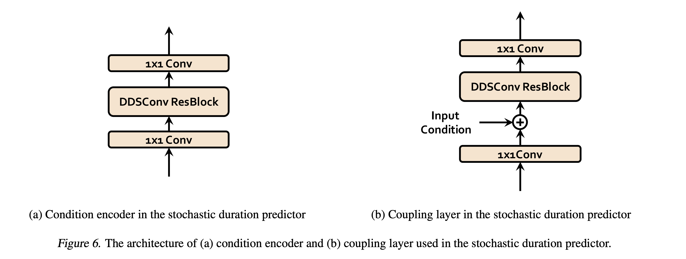

---
layout: post   
title: (VITS) Conditional Variational Autoencoder with Adversarial Learning for End-to-End Text-to-Speech          
subtitle: AI Paper Review       
tags: [ai, ml, tts, Text-to-Speech, Voice Conversion, Language Model]          
comments: true  
---  

최근 end-to-end TTS 모델은 single-stage 학습과 병렬 샘플링을 가능하게 하는 방법들을 제안해 왔다.
하지만 샘플들의 퀄리티는 two-stage 시스템을 이길 수 없었다.
이 논문에서는 현재의 two-stage 모델보다 더 자연스러운 오디오를 생성해내는 병렬적 end-to-end 방법을 제안한다. 
저자의 방법은 흐름을 정규화 하고 adversarial 학습 과정으로 증강된 variational inference를 채택한다. 
이를 통해 생성 모델의 파워를 크게 증강시킬 수 있었다. 
또한 stochastic duration predictor 을 사용하여 speech를 다양한 리듬으로 합성해낸다. 

latent variable에 대한 불확실성 모델링과 확률적 duration predictor 변수를 사용하여 저자의 방법은 one-to-many 관계에서도 다양한 높낮이와 리듬으로 
text input 에 대해서 자연스러운 소리를 표현할 수 있다. 

single speaker dataset인 LJ Speech 데이터셋에 대해 주관적인 인간 평가에서 (Mean opinion score) 공개적으로 이용가능한 TTS 시스템들 중 가장 뛰어난 성능을 보였다. 

[Paper Link](https://arxiv.org/pdf/2106.06103.pdf)   
[Code Link](https://github.com/jaywalnut310/vits)  

## Introduction

Text-to-speech (TTS) 시스템은 주어진 텍스트에서 몇가지 componets를 사용하여 raw speech wave form을 생성해낸다. 
딥러닝 네트워크가 빠르게 발전하면서 TTS 시스템의 파이프라인은 text preprocessing (text normalization, phonemization)와는 별도로 
two-stage 생성 모델링으로 간소화 되었다.

- first stage: preprocessed text로 부터 intermediate speech representation (mel spectrogram, linguistic feature)을 생성
- second stage: intermediate representation에 조건화된 raw waveform을 생성 

이 two-stage 파이프라인은 각각 개별적으로 개발되어왔다.

NN기반 autoregressive TTS 시스템은 실제와 같은 speech를 생성할 수 있음을 보여줬지만, sequential한 생성 프로세스는 현대의 병렬 프로세스를 활용할 수 없었다.
이러한 한계를 극복하고, 합성 스피트를 증가시키기 위해서 몇가지 non-autoregressive한 방법들이 제안되었다. 

text-to-spectrogram 생성 단계에서, 사전에 학습된 autoregressive teacher network를 사용하여 attention map을 추출함으로써, text와 spectrogram 간의 alignment 학습의 어려움을 감소시키는 시도가 이루어졌다.
더 최근에는, likelihood 기반 방법을 사용하여 예측하거나 target mel-spectrogram에 likelihood를 최대화 하는 방식을 사용하여 추가적인 aligner에 대한 의존성을 줄였다. 

한편, GAN 모델은 두번째 단계에서 탐색되어져 왔다.
여러 discriminator를 사용한 GAN 기반의 feed-forward 네트워크는 다른 scale또는 period에 대해서 각각 샘플을 구분함으로써 높은 퀄리티의 waveform을 생성할 수 있게 하였다. 

병렬 TTS 시스템의 발전에도 불구하고 two-stage 파이프라인은 초기 단계 모델의 생성된 샘플로 후반 단계 모델이 훈련되는 순차적인 교육 또는 미세조정이 필요하기 때문에 여전히 문제가 있다. 

게다가 미리 정의된 intermediate feature에 대한 의존성으로인해 학습된 hidden representation을 적용하여 성능을 추가로 개선할 수 없다.
최근 FastSpeech2, EAST 등과 같은 몇몇 작업들이 효율적인 end-to-end 학습 방법을 제안했다.
이들은 학습에 전체 waveform을 사용하는 대신 짧은 audio clip을 사용하여, mel-spectrogram decoder가 텍스트 표현 학습을 지원하도록 지렛대로 활용하고, 
특화된 spectrogram loss를 사용하여 target과 generated speech 간의 길이 mismatch를 완화흐는 효과를 내었다.

하지만 이러한 학습된 representation을 효율화하는 방법에도 불구하고 여전히 two-stage 방식보다는 성능이 뒤떨어 졌다.

저자는 이 논문에서 병렬 end-to-end TTS 방법을 제안한다. 
VAE를 사용하여, TTS 시스템의 두 모듈을 latent variable을 통해 연결하여, 효율적인 end-to-end 학습이 가능하도록 한다.

높은 퀄리티의 speech waveform을 생성할 수 있도록 하기 위해, 저자는 normalizing flow를 조건부 사전 분포에 적용하고, waveform 도메인에 adversarial 학습을 적용하였다.
또한 fine-grained 소리를 생성하기 위해, TTS는 주어진 텍스트에 대해 다양한 방식으로 말할 수 있는 one-to-many 관계를 표현할 수 있어야 한다. 
이를 위해 stochastic duration predictor를 사용하여 input text에 대해서 다양한 리듬의 speech를 생성할 수 있게 제안한다.
latent variable을 통한 불확실성 모델링과 stochastic duration predictor을 통해서 저자의 방법은 텍스트로 표현할 수 없는 음성 변화를 포착할 수 있다. 

## Metohd

 

### 1. Variational Inference
#### Overview

VAE는 input과 output을 같게 만드는 것을 통해 의미있는 latent space를 만드는 autoencoder와 비슷하다. 
이때 encoder를 통해서 input으로 부터 latent space를 도출하고, decoder를 통해 latent space로부터 output을 생성한다. 

* Encoder: input x가 주어졌을 때 latent vector z의 분포, 즉 q(z\|x)를 approximate 하는 것을 목적으로 한다.
    * q(z\|x)를 가장 잘 나타내는 분포로 정규분포를 선택한다면 이 정규분포를 나타내는 평균과 표준편차를 찾는 것이 목적이 된다.
* Decoder: latent vector z가 주어졌을 때 x의 분포 p(x\|z)를 approximation 하는 것이 목적 
* Latent Space: autoencoder 처럼 input과 output을 똑같이 만드는 것을 목적으로 하면 latent space는 항상 input과 같은 모양의 데이터만을 생성할 것이다
    * 이를 방지하기 위해 noise를 sampling 하여 이로부터 latent space를 생성한다.
    * z = Mean + Variance * noise
* ELBO: p(x)를 maximize하는 것이 목적이다. maximum loglikelihood 접근법을 택하여 전개하면 아래와 같다.  

 

* line 1->2: 베이즈룰
* line 2->3: *q(z\|x)/q(z\|x)
* line 3->4: KL Divergence KL(p\|q) = p ln p/q  

위에서 첫번쨰 항은 encoder로 부터 x->z를 샘플링하고 decoder로부터 z->x를 계산하는 reconstruction error를 계산할 수 있다.
두번째 항은 p와 q가 모두 정규분포이기 떄문에 계산할 수 있다. 이는 사후확률 q(z\|x)와 사전확률 q(z) 간의 KLD와 같다. 
사후확률과 사전확률을 최대한 비슷하게 만들어 주는 역할로 Regularization Error로 표현할 수 있다.
세번째 항은 p(z\|x)를 알 수 없기 떄문에 계산이 불가능하다. 하지만 우리는 KLD가 양수라는 것을 알기 떄문에 
아래와 같은 부등식으로 표현할 수 있다. 
 
이 마지막 부딩식을 Evidence Lower Bound 라고 부른다. 이를 maximize 함으로써 likelihood 또한 maximize 할 수 있다. 

VITS는 conditional VAE로써 variational lower bound를 maximize하는 것으로,
데이터의 다루기 어려운 주변 로그 확률 log(x\|c)의 evidence lower bound (ELBO)를 maximize 하는 것과 같다. 

 

#### Reconstruction Loss

recostruction loss에서 target data point는 raw waveform을 사용하는대신 mel-spectrogram을 사용한다.
Decoder를 사용하여 latent variable z를 waveform domain y로 upsampling 한다. 그리고 y를 mel-spectrogram domain으로 변형한다.
그다음 predicted와 target mel-spectrogramm 간에 L1 recostruction loss를 계산한다.

 

mel-spectrogram domain에서 loss를 계산하여 인간의 오디오 시스템의 반응에 근접한 mel-scale을 사용함으로써 인지적 퀄리티 향상을 가져올 수 있었다. 
mel-spectrogram 예측은 학습가능한 파라미터를 요구하지 않는다. 오직 STFT와 linear projection을 사용하면된다. 
또한 이 estimation은 오직 학습과정에서만 사용된다. 

실제로 저자는 latent variable z 의 전체를 upsample 하는게 아니라 오직 부분 sequence 만을 decoder의 input으로 사용한다.
이는 효율적인 end-to-end 학습에 사용되는 windowed generator 학습이다.

#### KL-Divergence

prior encoder의 input condition c는 text의 음소 c_text 와 이 음소와 latent variable 간의 alignment A로 구성되어 있다.
alignment는 hard monotonic attention matrix이다. |c_text|x|z| 차원 매트릭스로 각 음소가 target speech에 얼마나 길게 나타나는지를 표현한다.
하지만, alignment에 대한 GT-label은 없기 때문에 각 학습 iteration에 alignment를 예측해야만 한다.
저자의 문제 셋팅에서, 저자는 posterior encoder를 위한 더 high-resolution information 제공을 주장한다.
그래서 mel-spectrogram을 사용하는 대신 target speech 에 대한 linear-scale spectrogram x_lin을 input으로 사용한다. 
여기서 input에 대한 변형은 variational inference의 특성을 침해하지 않는다.

그래서 KL divergence는 아래와 같다.  
  

factorized normal distribution을 사전, 사후 encoder의 parameter로 사용한다. 
저자는 사전 분포에 대한 표현력을 늘리는 것이 더 진짜같은 샘플을 생성할 수 있는 중요한 요소임을 알아냈다.
그래서 simple distribution을 아래의 change-of-variagle 룰에 따라서 더 복잡한 분포로 변환할 수 있는 가역 변환인 normalizing flow f를 적용하였다.

  

### 2. Alignment Estimation

#### Monotonic Alignment Search

input text와 target speech 간의 alignment A를 예측하기 위해 Monotonic Alignment Search (MAS)를 적용하였다.
이는 normalizing flow f에 의해 매개 변수화된 데이터의 likelihood를 최대화 한다.

  

이 alignment는 monotonic 하면서, 사람이 읽을떄 어떠한 단어도 skipping 하지 않는다는 것으로 제한한다.
최적의 alignment를 찾기위해 dinamic programming을 사용하였다. 

MAS를 직접적으로 바로 적용하는것은 매우 어렵다. 왜냐하면 저자의 모델의 목적은 ELBO로 정확한 log-likelihood가 아니기 때문이다.
그래서 MAS를 ELBO를 maximize 하는 방식을 찾았다. 

  

식 (5)와 식(6)의 유사성때문에 수정하지 않고 original MAS 적용을 해도 된다. 

#### Duration Prediction From Text

각 input token 에 대한 duration d_i는 estimated alignment (A_i1+A_i2+...+A_iz)의 합으로 계산할 수 있다. 
이 duration은 결정론적인 duration predictor을 학습하는데 사용하는데, 하지만 이는 서로 다른 사람의 발음 speaking rate을 표현하지 못한다.
그래서 저자는 확률론적인 duration predictor을 디자인하여 샘플이 주어진 음소의 duration 확률을 따르도록 한다.

확률적 duration predictor는 flow-based 생성 모델로, 일반적으로 maximum likelihood estimation을 통해 학습된다.
하지만 직접적으로 MLE을 적용하는 것은 아래의 이유때문에 어렵다.

- 각 input 음소는 discrete integer로 continuous normalizing flow를 위해 dequantize가 필요하다.
- 각 input 음소는 가역성으로 인한 고차원 변환을 방지하는 스칼라이다. 

그래서 저자는 variational dequantization과 variational data augmentation을 적용하여 이런 문제를 해결하였다. 
더 자세히 말하면, 두가지 랜덤  variable (mean, var) u,v를 도입하였는데, 둘다 duration sequence d 처럼 resolution과 dimension을 가지고 있다.
저자는 u를 [0,1)로 제한하여 d-u 가 항상 positive real number가 되게 하였고, v와 d를 chanel-wise concatenate 하여서 더 고차원의 latent representation으로 만들었다.
그리고 두 변수를 사후 확률분포 q(u, v|d, c_text) 근사를 통해 샘플링하였다. 
그래서 목적 함수의 lower bound log-likelihood는 아래와 같다.

  

여기서 lower bound의 negative가 Duration Loss이다.

저자는 stop gradient operator를 적용하여 duration predictor의 교육이 다른 모듈의 교육에 영향을 미치지 않도록 입력의 기울기에 대한 back-propagating을 방지하였다.

샘플링 과정은 상대적으로 심플하다.
음소 duration은 확률적 duration predictor의 역변환을 통해 무작위 노이즈에서 샘플링된 다음 정수로 변환된다.

### 3. Adversarial Training

적대적 학습을 위해서 discriminator D를 추가하였는데 이는 decoder G가 생성한 output과 gt waveform y를 구분한다.
저자는 두가지 타입의 loss를 음성 합성애 성공적으로 도입하였다.

- least squeare loss function for adversarial training
- feature matching loss function for training generator

  

### 4. Final Loss

  

### 5. Model Architecture

  
  

전체 모델은 사후 encoder, 사전 encoder, decoder, discriminator, stochastic duration predictor로 구성되어 있다. 
여기서 사후 encoder와 discriminator은 오직 학습에서만 사용된다. 

#### Posterior Encoder

WaveGlow에 사용되었던 non-casual WaveNet residual block을 사용한다. 
dilated convolution과 gated activation unit, skip connection으로 구성되어 있는데, block의 마지막에 있는 linear projection layer에서
최종적으로 normal posterior distribution의 mean, variance를 생성한다. 
multi-speaker 케이스에서는 residual block에서 global conditioning 방법을 사용하기 위해 speaker embedding 을 더한다.

#### Prior Encoder 

Prior encoder는 input 음소 c_text를 처리하는 text encoder와 사전 확률에 유연성을 증가시켜주는 normalizing flow f로 구성되어 있다. 
text encoder는 transformer encoder로 절대적 positinal encoding을 사용하는 대신 상대적인 positional representation을 사용한다.
text encoder를 통해서 hidden representation h_text를 얻고, text eocoder의 마지막에 있는 linear projection layer를 통해서 
사전 확률을 세우기 위한 mean, variance를 생성한다.

normalizing flow는 waveNet의 residual block으로 구성된 affine coupling layer의 stack이다. 
단순화를 위해 야코비안 결정자가 1인 볼륨 보존 변환이 되도록 정규화 흐름을 설계하였다.

multi-speaker setting 을 위해서 normalizing flow 내의 residual block에서 global conditioning의 일환으로 speaker embedding을 더하였다.

#### Decoder

디코더는 본질적으로 HiFi-GAN V1 generator를 사용하였다.
이는 transposed convolution의 stack으로 구성되어 있고, 각각은 multi-receptive field fusion module (MRF)를 따르고 있다. 
MRF는 서로다른 receptive field size를 가진 residual block의 output을 더한 값이다.

multi-speaker setting을 위해서 speaker embedding을 변형하기 위해 linear layer를 추가하고 이를 input latent variable z에 더하였다.

#### Discriminator

HiFi-GAN에 사용되었던 multi-preiod discriminator의 구조를 따랐다.
이는 Mixture of Markovian window-based sub-discriminator이다.
각각은 input waveform에서 서로 다른 주기의 pattern에서 동작한다.

#### Stochastic Duration Predictor

h_text로 부터 음소의 duration을 예측한다.
효율적 파라미터화를 위해, dilated와 depth-separable conv layer를 residual block으로 쌓았다.
또한 monotonic rational-quadratic spline을 사용하는 가역적 비선형 변환의 형태를 취하는 neural spline flow를 적용하여, layer를 coupling 하였다.
Neural spline flow는 일반적으로 사용되는 affine coupling layer와 비교하여 유사한 수의 매개변수로 변환 표현력을 향상시킨다.

multi-speaker setting에서는 speaker embedding을 변환하기 위해 linear layer를 추가하고, input h_text에 더하였다.

## Results

### Single Speaker Dataset
  

### Multi speaker Dataset
  