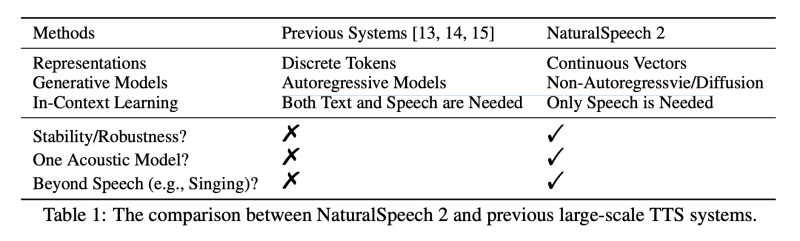
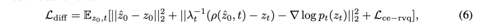

---
layout: post   
title: (Natural Speech 2) Latent Diffusion Models are Natural and Zero-Shot Speech and Singing Synthesizers         
subtitle: AI Paper Review       
tags: [ai, ml, tts, Text-to-Speech, Voice Conversion, Language Model, Singing Synthesizers, Zero-shot speech]          
comments: true  
---  

TTS를 대규모 다중 스피커 및 야생 데이터 세트로 확장하려면 화자의 신원, 발음 및 스타일(예: 노래)과 같은 인간 음성의 다양성을 포착할 수 있어야 한다. 
현재의 large TTS 시스템은 보통 speech를 discrete한 토큰으로 양자화하고, language model을 사용하여 하나하나 토큰을 생성한다. 
하지만 이런 방법은 안정적이지 않은 발음이나, 단어의 skipping/repeating 이슈, 나쁜 음질 등에 의해서 해를 입는다. 
이 논문에서는 residual vector quantizer를 사용하여 양자화된 latenet vector를 생성하는데 사용하고, Diffusion Model을 사용하여 
텍스트 입력에 조건화된 latent vector를 생성한다. 
zero-shot 합성을 강화하기 위해서는 음성합성에 다양성을 확보하는 것이 중요한데, 이를 위해서 저자는 speech prompting 매커니즘을 디자인하여, 
Diffusion model과 duration/pitch predictor에서 내부학습을 촉진하였다. 
44K hours 의 스피치 데이터셋과 노래 데이터셋으로 학습하고 unseen speaker에서 음질을 평가하였다. 
NaturalSpeech 2 는 zero-shot 셋팅에서 이전의 TTS시스템 대비 발음 유사성, 강인성, 음질 등에서 SOTA를 달성하였다. 
또한 새로운 노래부르는 음성 합성에서 오직 speech prompt만을 이용한 zero-shot 셋팅을 수행할 수 있다.

[Paper Link](https://arxiv.org/pdf/2304.09116.pdf)  
[Project Link](https://speechresearch.github.io/naturalspeech2/)  

## Introduction

인간의 Speech는 화자의 identity (성별, 악센트), 발음, 스타일 (스피킹, 노래) 등에 따라서 매우 다양하다. 
TTS는 인간과 비슷하게 자연스러운 음성을 합성해야한다. 
딥러닝이 발전함에 따라서 TTS 시스템은 매우 좋은 음성 퀄리티와 자연스러움은 달성하였고, 심지어 single-speaker recoding-studio benchmarking dataset에서는 거의 
human-level을 달성하기도 하였다. (Natural Speech)
이제 우리는 자연스러운 음성과 인간과 같은 음성을 합성하기 위해 음성 다양성이 점점 더 중요해지는 새로운 TTS 시대에 접어들었습니다.  
이전의 화자 제한적인 녹음 스튜디오 베이스 데이터셋으로는 다양한 화자들의 identity와 발음, 스타일등을 캡쳐하는데 역부족이다.
대신 우리는 다양성을 학습하기 위해 대규모 말뭉치에서 TTS 모델을 훈련시킬 수 있으며, 부수적으로 이렇게 훈련된 모델은 few-shot 또는 zero-shot 기술로 무제한의 보이지 않는 시나리오에 일반화 할 수 있다.
현재의 large-scale TTS 시스템은 보통 continuous speech waveform을 discrete token으로 양자화하고, autoregressive language model을 사용하여 이 토큰을 모델링한다. 
이러한 파이프라인은 몇가지 제약사항으로 악영향을 받을 수 있다.

1. discrete token 시퀀스는 일반적으로 매우 길며 (10초의 음성은 수천개의 discrete token을 가지고 있음), autoregressive 모델은 오류 전파로 인해 불안정한 음성 출력을 가져올 수 있다.
2. Codec과 언어모델 사이에 딜레마가 있다. 토큰 양자화를 사용하는 코덱 (VQ-VAE, VQ-GAN)은 일반적으로 낮은 비트 전송률의 토큰 시퀀스를 가지며, 이는 언어 모델 생성을 용이하게 하지만, 고주파 세부 음향 정보의 손실을 초래한다.
반면, 일부 개선방법은 하나의 음성 프레임을 나타내기 위해 여러개의 residual discrete token을 사용하며, 이 경우 펼친 후 토큰 시퀀스가 여러배 증가하고 결국 언어 모델링에 어려움을 초래한다.

 

본 논문에서는 표현적인 운율, 좋은 견고성 및 가장 중요한 것으로 음성 합성의 강력한 제로샷 능력을 달성하기 위한 Latent Diffusion Model을 사용한 TTS 시스템인 NaturalSpeech 2를 제안한다. 

그림 1에 나와 있는 것처럼, 먼저 음성 파형을 잠재 벡터 시퀀스로 변환하고 이를 코덱 디코더를 사용하여 음성 파형으로 재구성하는 신경 오디오 코덱을 훈련한다.
오디오 코덱을 훈련한 후, 우리는 코덱 인코더를 사용하여 훈련 세트의 음성에서 잠재 벡터를 추출하고, 이를 Phoneme 인코더, 지속 시간 예측기 및 음높이 예측기에서 얻은 사전 벡터로 조건화하여 Latent Diffusion Model의 목표로 사용합니다.
추론 중에, 먼저 Latent Diffusion Model을 사용하여 텍스트/Phoneme 시퀀스에서 잠재 벡터를 생성하고, 이후에 코덱 디코더를 사용하여 이러한 잠재 벡터에서 음성 파형을 생성합니다.

  

Natural Speech 2의 디자인은 아래와 같다. 

- Continuous vectors instead of discrete tokens: 신경 오디오 코덱의 음성 재구성 품질을 보장하기 위해 이전 연구에서는 보통 다중 잔여 양자화기를 사용하여 음성을 양자화한다.
결과적으로 얻어진 이산형 토큰 시퀀스는 매우 길어진다. (예를 들어, 각 음성 프레임에 8개의 잔여 양자화기를 사용하는 경우, 결과적으로 평탄화된 토큰 시퀀스의 길이는 8배가 됨).
이는 음성 모델(자기회귀 언어 모델)에 많은 압력을 가한다. 따라서 저자는 이산형 토큰 대신 연속 벡터를 사용하였다.
연속 벡터를 사용하면 시퀀스 길이를 줄일 수 있으며 미세한 음성 재구성을 위한 정보의 양을 증가시킬 수 있다.

- Diffusion models instead of autoregressive models: 비자기회귀 방식으로 연속 벡터의 복잡한 분포를 학습하고, 자기회귀 모델에서의 오류 전파를 피한다. 

- Speech prompting mechanisms for in-context learning: 확산 모델이 음성 프롬프트의 특성을 따르도록 유도하고 제로샷 능력을 향상시키기 위해, 
저자는 확산 모델과 음높이/음성 길이 예측기에서 인컨텍스트 학습을 촉진하기 위한 음성 프롬프팅 메커니즘을 설계하였다.

- 위의 디자인을 토대로, NaturalSpeech 2는 이전의 자기회귀 모델보다 더 안정적이고 견고하며, 두 단계의 토큰 예측 대신 확산 모델만이 필요하며,
길이/음높이 예측 및 비자기회귀 생성으로 스타일을 매우 세분화하여 연주나 노래 등의 스타일도 확장할 수 있다.

위와 같은 디자인으로 강화된 NaturalSpeech 2는 400M 모델 파라미터 및 44K 시간의 음성 데이터로 스케일을 확장하여 다양한 화자 아이덴티티, 억양 및 스타일(예: 노래)로 제로샷 시나리오에서 음성을 생성한다.
실험 결과, NaturalSpeech 2는 제로샷 시나리오에서 자연스러운 음성을 생성하며 이전 강력한 TTS 시스템보다 우수한 성능을 보였다.

1) 음성 프롬프트와 실제 음성 모두와 더 비슷한 억양을 달성합니다.  
2) LibriSpeech 및 VCTK 테스트 세트에서 대조군 음성에 비해 자연스러움( CMOS 기준)을 유지하거나 더 우수한 결과를 보입니다.  
3) 짧은 노래 프롬프트만 주어져도 새로운 timbre 노래 부르는 목소리를 생성할 수 있습니다. 
또한 흥미로운 점으로는 노래 프롬프트가 아니라 음성 프롬프트만으로도 진정한 제로샷 노래 합성을 가능하게 합니다.  

## Background

### 1. TTS for Natural Voice: Quality and Diversity
TTS 시스템은 고품질과 다양성을 모두 갖춘 자연스러운 음성을 생성하는 것을 목표로 한다. 이전의 신경망 기반 TTS 시스템은 단일 화자 녹음 스튜디오 데이터셋에서 고품질의 음성을 합성할 수 있으며,
인간 수준의 품질을 달성 할 수 도 있다. 
그러나 다양한 화자의 신원, 억양, 스타일을 가진 다양한 음성을 생성하는 것은 이전에는 어려웠다.
최근 몇몇 연구에서는 다양성을 추구하기 위해 대규모 다중화자 데이터셋으로 TTS 시스템의 규모를 확장하는 방법으로 노력하고 있다. 

이러한 시스템들은 보통 음성 웨이브폼을 이산 토큰 시퀀스로 변환하는 신경 코덱과, 텍스트에서 이산 토큰을 생성하기 위한 autoregressive 언어모델을 활용한다.

그러나 이런 방식은  딜레마에 직면하게 된다. 
  

1) 오디오 코덱이 각 음성 프레임을 단일 토큰으로 양자화하는 벡터 양자화(VQ)를 활용하면,
토큰 시퀀스 길이가 짧아져 언어 모델에서 토큰 생성이 용이해질 수 있지만, 대량 압축률이 높아져 웨이브폼 복원 품질이 저하된다.

2) 오디오 코덱이 각 음성 프레임을 잔차 벡터 양자화(RVQ)로 여러 개의 토큰으로 양자화하면, 고품질의 웨이브폼 복원이 가능하지만, 
토큰 시퀀스 길이가 증가하므로 자기 회귀 모델 생성(에러 전파 및 강건성 문제)이 어려워진다.
따라서 이전 작업인 AudioLM과 같은 작업들은 각 프레임에서 일부 코어 토큰을 먼저 생성한 다음, 나머지 세부 토큰을 생성하기 위해 두 단계의 언어 모델을 활용하는 복잡한 방식을 채택한다.
이러한 방식은 복잡하며 연쇄적인 오류가 발생할 수 있다. 위 딜레마를 해결하기 위해, 저자는 연속 벡터를 가진 Neural 코덱과 비자기 회귀 생성을 위한 latent Diffusion 모델을 활용한다.  

### 2. Neural Audio Codec

신경망 오디오 코덱(Neural audio codec)은 오디오 웨이브폼을 코덱 인코더(codec encoder)로 압축된 표현으로 변환하고 이를 코덱 디코더(codec decoder)로 오디오 웨이브폼으로 재생성하는 신경망 모델이다.
오디오 코덱은 기존에 오디오 압축 및 전송에 사용되어 왔기 때문에 압축률은 중요한 지표 중 하나이다.
이에 따라 low bitrate 이산 토큰들이 일반적으로 압축된 표현으로 선택되었다. 예를 들어, SoundStream와 Encodec는 다중 residual 벡터-양자화(VQ) variational 오토인코더(VQ-VAE)를 활용하여 음성을 다중 토큰으로 압축하며, 
이들은 음성/오디오 생성을 위한 중간 표현으로 사용되었다.

residual 벡터 양자화를 통해 좋은 재구성 품질과 낮은 비트율을 달성할 수 있지만, 
이들은 주로 압축 및 전송 목적으로 설계되었으며, 음성 / 오디오 생성의 중간 표현으로 사용하기에는 적합하지 않을 수 있다.
residual 양자화기에 의해 생성된 이산 토큰 시퀀스는 보통 매우 길며 (R 개의 잔여 양자화기가 사용될 경우 R 배 더 길어짐), 언어 모델이 예측하기 어려울 수 있다. 
이산 토큰의 부정확한 예측은 말 건너뛰기, 단어 반복 또는 말 무너짐 문제를 초래할 수 있습니다.

본 논문에서는 연속 벡터 대신에 음성 파형을 변환하는 신경 음성 코덱을 설계하여, 일련의 길이를 증가시키지 않고도 정확한 파형 재구성에 충분한 미세한 세부 정보를 유지할 수 있다.

### 3. Generative Models for Speech Synthesis

두 Autoregressive model과 Diffusion model 모두 반복 계산에 기반하고 있지만 (왼쪽에서 오른쪽으로 진행되는 과정 또는 노이즈 제거 과정을 따름), 
자기회귀 모델은 시퀀스 길이와 오류 전파에 민감하기 때문에 불안정한 운율과 견고성 문제 (예: 단어 건너뛰기, 반복 및 붕괴)가 발생한다.
텍스트에서 음성으로의 변환은 엄격한 단조적 정렬과 강한 소스-타겟 의존성을 가지므로, 저자는 확산 모델을 지속적인 길이 예측과 확장으로 강화하여 견고성 문제에서 자유로운 모델을 활용한다.

## NaturalSpeech 2

### 1. Neural Audio Codec with Continuous Vectors

waveform을 continuous vector로 변형하는데 neural codec을 사용하는데 이에 따른 이점은 아래와 같다.  
1. 연속 벡터는 이산적인 토큰보다 압축률이 낮고 비트율이 높아 고품질의 오디오 재구성을 보장할 수 있습니다.  
2. 이산 양자화에서처럼 각 오디오 프레임마다 여러 개의 토큰이 아닌 하나의 벡터만 존재하기 때문에 숨겨진 시퀀스의 길이를 늘리지 않는다.

  

그림 2와 같이, 우리의 신경 오디오 코덱은 오디오 인코더, 잔여 벡터 양자화기(RVQ), 그리고 오디오 디코더로 구성된다.
1) 오디오 인코더는 총 다운샘플링률이 200인 여러 합성곱 블록으로 구성된다. 16KHz의 오디오에 대해 각 프레임은 12.5ms 음성 세그먼트에 해당한다.
2) 잔여 벡터 양자화기는 오디오 인코더의 출력을 여러 잔여 벡터로 변환한다. 이러한 잔여 벡터의 합계는 양자화된 벡터로 취하여 확산 모델의 훈련 대상으로 사용된다. 
3) 오디오 디코더는 오디오 인코더의 구조를 반영하며, 양자화된 벡터에서 오디오 웨이브폼을 생성한다.

신경 오디오 코덱의 작동 흐름은 다음과 같다.

  

사실, 연속 벡터를 얻기 위해서는 벡터 양자화기 대신 오토인코더나 변이형 오토인코더만 있으면 된다.
그러나 정규화와 효율성 목적으로 매우 많은 양의 양자화기(R in Figure 2)와 코드북 토큰(V in Figure 2)을 사용하여 연속 벡터를 근사화하는 잔차 벡터 양자화기를 사용한다.
이를 통해 두 가지 이점을 얻을 수 있습니다.

1) Latent Diffusion Model을 훈련할 때 연속 벡터를 저장할 필요가 없습니다. 
대신 코드북 임베딩과 양자화된 토큰 ID만 저장하면 Equation 1을 사용하여 연속 벡터를 유도할 수 있습니다. 

2) 연속 벡터를 예측할 때, 우리는 이러한 양자화된 토큰 ID를 기반으로 이산적 분류에 대한 추가적인 regularization loss를 추가할 수 있습니다.

### 2. Latent Diffusion Model with Non-Autoregressive Generation  

#### Diffusion Formulation

저자는 diffusion (forward) 프로세스와 denoising (backward) 프로세스를 확률적 미분 방적식 (SDF)로 정의한다.
순방향 SDE는 neural codec으로부터 얻은 잠재 벡터 z를 가우시안 노이즈로 변환한다.

  

역방향 SDE는 가우시안 노이즈를 데이터 z로 다시 아래와 같은 과정을 통해 변환한다.

  

저자는 레디언트 logp(z)를 추정하기 위해서 신경망 s를 훈련시킬 수 있으며, 그후에는 시작점으로부터 가우시안 노이즈 z를 샘플링하고 SDE를 수치적으로 해결함으로써 데이터 z_0를 샘플링할 수 있다.
여기서 신경망은 WaveNet을 기반으로 히얐다. 
현재 노이즈 벡터 z_t, 시간 단계 t 및 조건 정보 c를 입력으로 받아 점진적으로 개선된 음질을 얻을 수 있는 데이터 z_0을 예측한다.

  

첫번째 term은 data loss, 두번쨰 term은 score loss이다.
세번째 term은 새로운 cross-entropy loss로 RVQ에 기반하였다.

#### Prior Model: Phoneme Encoder and Duration/Pitch Predictor

음소 인코더는 여러 개의 Transformer 인코더 레이어로 구성되며, 표준 피드포워드 네트워크를 수정하여 음소 시퀀스의 지역 의존성을 캡처하기 위해 convolutional 네트워크로 변환한다.
음절 길이 및 피치 예측기는 모두 conv 블록 몇 개를 가진 동일한 모델 구조를 공유하지만 다른 모델 매개변수를 사용합니다.
지도 학습을 위해 실제 음절 길이와 피치 정보를 학습 대상으로 사용하며, L1 음절 길이 손실과 피치 손실을 계산한다.
학습 중에는 실제 음절 길이를 사용하여 음소 인코더에서 숨겨진 시퀀스를 확장하여 프레임 수준의 숨겨진 시퀀스를 얻은 다음,
실제 피치 정보를 프레임 수준의 숨겨진 시퀀스에 추가하여 최종 조건 정보 c를 얻습니다. 추론 중에는 해당 예측 음절 길이와 피치를 사용합니다.

Diffusion Model 의 total loss는 아래와 같다.
  

#### Speech Prompting for In-Context Learning

제로샷 생성을 위한 인컨텍스트 학습을 용이하게 하기 위해, 우리는 스피치 프롬프팅 메커니즘을 디자인하여,
길이/음높이 예측기와 확산 모델이 스피치 프롬프트의 다양한 정보(예: 화자 식별)를 따르도록 유도한다.

speech latent z에대해 저자는 랜덤하게 z를 u:v index로 세그먼트 하여 speech prompt로써 사용하고,
남은 sequence 1:u와 u:n을 concat하여 시퀀스 u:v를 Diffusion model이 학습할 learning target으로 삼는다 

  

위의 그림에서 처럼, Transformer 기반 prompt encoder를 사용하여 speech prompt를 처리하여 hidden sequence를 얻는다.
이러한 숨겨진 시퀀스를 프롬프트로 활용하기 위해 저자는 duration/pitch predictor와 diffusion model에 대한 두 가지 다른 전략을 사용한다.

1) duration과 pitch predictors의 경우, 쿼리는 합성곱 레이어의 숨겨진 시퀀스이며, 키와 값은 프롬프트 인코더의 숨겨진 시퀀스이다. 

2) diffusion model의 경우, 너무 많은 세부 정보를 노출시켜 generation을 해칠 수 있는 프롬프트 인코더의 숨겨진 시퀀스에 직접 attention하는 대신, 우리는 두 개의 attention 블록을 디자인한다.

첫번째 attention 블록에서는, m개의 임의로 초기화된 임베딩을 쿼리 시퀀스로 사용하여 프롬프트 숨겨진 시퀀스에 attention을 적용하고, m 길이의 hidden sequence를 얻는다.

두번째 attention 블록에서는, WaveNet 레이어의 hidden sequence를 query로 사용하고, m 길이의 attention 결과를 key와 value로 사용한다.
이 두번째 attention 블록의 attention 결과를 FiLM 레이어의 조건부 정보로 사용하여 diffusion model의 WaveNet의 hidden sequence에 affine transform을 수행한다.

## Results

  
  

