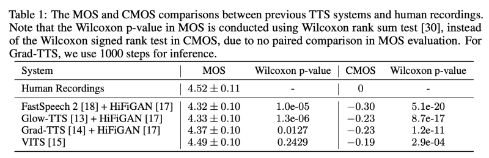
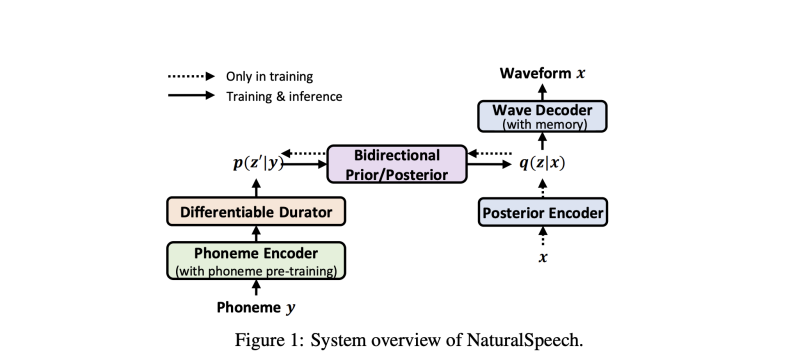
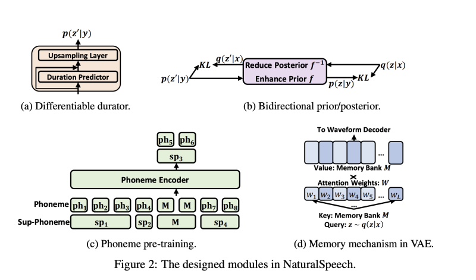
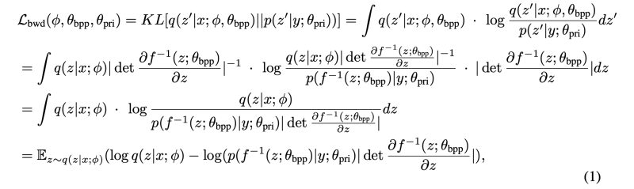
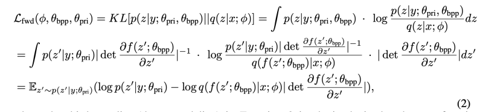
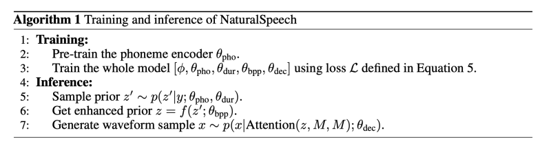
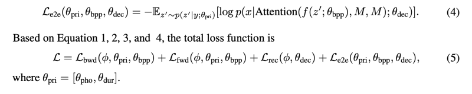
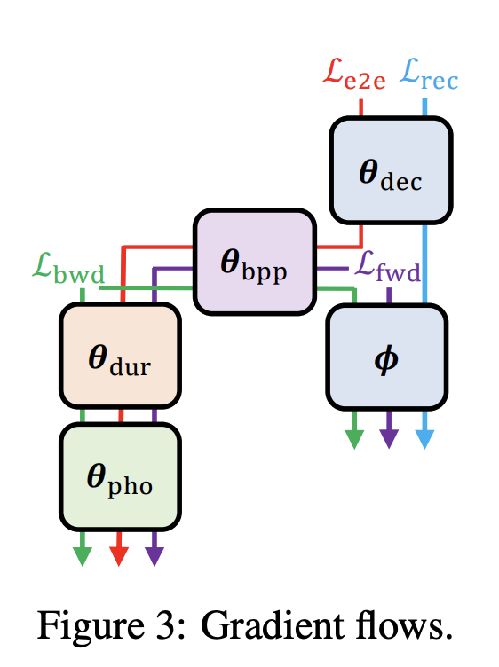
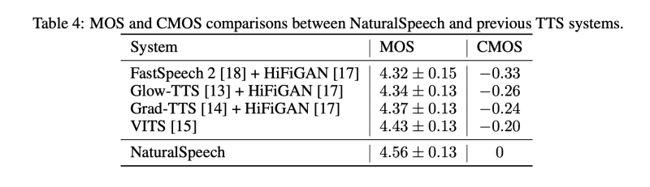
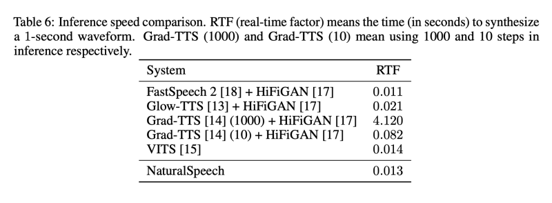

---
layout: post   
title: (NaturalSpeech) End-to-End Text to Speech Synthesis with Human-Level Quality        
subtitle: AI Paper Review       
tags: [ai, ml, tts, Text-to-Speech, Voice Conversion, Language Model]          
comments: true  
---  

최근 몇년동안 TTS 기술은 학계와 산업에서 빠르게 발전해왔다,
자연스러운 인간 수준의 품질을 달성할 수 있는지, 어떻게 그 품질을 정의하고 판단할 수 있는지, 그리고 어떻게 품질을 달성할 수 있는지라는 질문들이 자연스럽게 제기된다.
이 논문에서는 주관적인 측정의 통계적 유의성을 기반으로 인간 수준의 품질을 정의하고 판단하기 위한 적절한 지침을 먼저 소개함으로써 이러한 질문에 대답한다.
그다음, Natural Speech 라는 TTS 시스템을 개발하여 벤치마크 데이터셋에서 인간수준의 품질을 달성한다.
구체적으로 저자는 텍스트에서 파형으로 end-to-end 생성을 위해 VAE 를 활용하며, 음성에서의 사전 복잡성을 줄이고 사후 분포의 복잡성을 줄이기 위한 몇가지 핵심 모듈을 포함시켰다.
이 모듈에는 음운 사전 훈련, 미분 가능한 지속시간 모델링, 양방향 사전/사후 모델링, 그리고 VAE 내의 메모리 메커니즘이 포함된다.
인기있는 LJSpeech 데이터셋에서 실험적 평가 결과, NaturalSpeech는 문장 수준에서 인간의 녹음과 -0.01 (CMOS: 비교적 평균 의견점수)의 차이를 보이며
p-level p 0.05에서 통계적으로 유의한 차이가 없음을 보여준다.
이는 이 데이터셋에서 인간의 녹음과 통계적으로 유의한 차이가 처음으로 보이지 않음을 시연한 것이다.

[Paper Link](https://arxiv.org/pdf/2205.04421.pdf)  
[Code Link](https://github.com/heatz123/naturalspeech)  

## Definition and Judgement of Human-Level Quality in TTS

### Definition of Human-Level Quality

만약 TTS 시스템이 테스트 세트에서 생성된 음성의 품질 점수와 해당 인간 녹음의 품질 점수 사이에 통계적으로 유의한 차이가 없다면, 
이 TTS 시스템은 해당 테스트 세트에서 인간 수준의 품질을 달성한 것으로 볼 수 있습니다.

테스트 세트에서 TTS 시스템이 인간 수준의 품질을 달성한다고 주장하는 것은 TTS 시스템이 인간을 능가하거나 대체할 수 있다는 의미가 아니라, 
이 TTS 시스템의 품질이 해당 테스트 세트에서 인간 녹음과 통계적으로 구별할 수 없을 정도로 유사하다는 것을 의미합니다.

### Judgement of Human-Level Quality
#### Judgement Guideline

생성된 음성과 인간 녹음 간의 품질 차이를 측정하기 위해 PESQ, STOI, SI-SDR와 같은 몇 가지 객관적인 메트릭이 있지만,
이러한 메트릭은 TTS에서 인지적 품질을 측정하는 데 신뢰할 수 없습니다. 
따라서 우리는 주관적인 평가를 사용하여 음성 품질을 측정합니다. 이전 연구들은 일반적으로 녹음과 생성된 음성을 비교하기 위해 5점 척도의 평균 의견 점수 (MOS)를 사용합니다 
(1에서 5까지의 범위). 
그러나 MOS는 음성 품질의 차이에 대해 충분히 민감하지 않습니다. 
왜냐하면 판사는 각 문장의 품질을 두 시스템에서 독립적으로 평가하기 때문입니다. 따라서 우리는 각 판사가 두 시스템에서 가져온 샘플을 직접 비교하여 음성 품질을 측정하는 7점 척도
(-3에서 3까지)의 "비교적인 평균 의견 점수" (CMOS)를 평가 지표로 선택합니다. 또한 Wilcoxon 부호 순위 검정을 수행하여 CMOS 평가에서 두 시스템이 유의하게 다른지 여부를 측정합니다.

따라서 인간 수준의 품질에 대한 판단 지침은 다음과 같습니다:
TTS 시스템과 인간 녹음의 각 발화문은 20명 이상의 원어민 판사들이 옆으로 두고 듣고 비교해야 합니다. 
판사들은 해당 언어를 모국어로 하는 사람이어야 합니다. 판단에는 각 시스템에서 최소 50개의 테스트 발화문이 사용되어야 합니다.
TTS 시스템이 생성한 음성이 인간 녹음과 통계적으로 유의미한 차이가 없다는 것은, 평균 CMOS가 0에 가깝고 Wilcoxon 부호 순위 검정의 p-수준이 p > 0.05를 만족할 때만 성립합니다.

#### Judgement of Previous TTS Systems

이러한 지침에 따라, LJSpeech 데이터셋에서 현재의 TTS 시스템이 인간 수준의 품질을 달성할 수 있는지 여부를 테스트합니다. 
우리가 연구한 시스템은 다음과 같습니다: 
1) FastSpeech 2 + HiFiGAN, 2) Glow-TTS + HiFiGAN, 3) GradTTS + HiFiGAN, 4) VITS 
우리는 이러한 모든 시스템의 결과를 직접 재현했으며, 원래 논문에서의 품질을 맞추거나 심지어 능가할 수 있습니다
(HiFiGAN 보코더는 예측된 멜-스펙트로그램에 대해 세밀한 조정을 거쳐 더 나은 합성 품질을 위해 사용됩니다). 
우리는 각각 20명의 판사가 참여하는 MOS 및 CMOS 평가를 위해 50개의 테스트 발화문을 사용합니다. 
표 1에서 보듯이, 현재의 TTS 시스템은 녹음과 유사한 MOS를 달성할 수 있지만, 녹음과의 CMOS 간격이 크며, p-level p 0.05에서 윌콕슨 부호 순위 검정을 통해 인간 녹음과 통계적으로 유의한 차이가 있다는 것을 보여줍니다. 
우리는 또한 부록 A에서 위의 TTS 시스템 중 하나의 각 구성 요소를 분석하여 품질 차이가 어디에서 발생하는지 연구합니다.

 

## Description of NaturalSpeech System
저자는 품질 차이를 인간 녹음과 좁히기 위해 NaturalSpeech라는 완전한 end-to-end 텍스트에서 파형으로의 생성 모델을 개발했습니다. 
먼저 시스템의 설계 원칙에 대해 설명하고 (3.1절), 그 다음 이 시스템의 각 모듈을 소개하고 (3.2-3.5절) 훈련/추론 파이프라인을 설명합니다 (3.6절). 
마지막으로, 왜 저자의 시스템이 인간 녹음과의 품질 차이를 좁힐 수 있는지 설명합니다.

 

### 1. Design Principle
이미지/비디오 생성을 위해 VQ-VAE를 사용하여 고차원 이미지를 저차원 표현으로 압축하여 생성을 용이하게 하는 것에서 영감을 받아, 우리는 VAE를 사용하여 고차원 음성 x를 프레임 수준의 표현 z (즉, z는 사후 분포 q(z\|x)에서 샘플링됨)로 압축합니다. 
이러한 표현은 웨이브폼을 재구성하는 데 사용됩니다 (p(x\|z)로 표시됨). 일반적인 VAE의 수식에서, 사전 p(z)은 표준 이성질적 다변량 가우시안을 선택합니다. 
TTS에서 입력 텍스트로부터 조건부 웨이브폼 생성을 가능하게 하기 위해 우리는 음소 시퀀스 y로부터 z를 예측합니다.
즉, z는 예측된 사전 분포 p(z\|y)에서 샘플링됩니다. VAE와 사전 예측을 동시에 최적화하며, 그래디언트는 q(z\|x)와 p(z\|y) 양쪽으로 전파됩니다. 
증명된 증거 하한에서 파생된 손실 함수는 웨이브폼 재구성 손실인 -log p(x\|z)와 사후 분포 q(z\|x)와 사전 분포 p(z\|y) 사이의 쿨백-라이블러 발산 손실인 KL[q(z\|x)||p(z\|y)]로 구성됩니다.

음성으로부터의 사후 분포는 텍스트로부터의 사전과 비교해 더 복잡하기 때문에, 텍스트에서 웨이브폼 생성을 가능하도록 사전과 최대한 근사하게 일치시키기 위해 우리는 몇 가지 모듈을 설계했습니다. 
이를 Figure 1에서 보여줍니다. 첫째, 더 나은 사전 예측을 위해 음소 시퀀스의 좋은 표현을 학습하기 위해, 우리는 대규모 텍스트 말뭉치에서 음소 시퀀스에 대한 마스크 언어 모델링을 사용하여 음소 인코더를 사전 훈련합니다 (3.2절). 
둘째, 사후 분포는 프레임 수준이고 음소 사전은 음소 수준이기 때문에, 길이 차이를 줄이기 위해 음소 사전을 음소의 지속 시간에 따라 확장해야 합니다. 우리는 차별화 가능한 지속 시간 모델을 활용하여 지속 시간 모델링을 개선합니다 (3.3절). 
셋째, 사전/사후 모듈을 설계하여 사전을 강화하거나 사후를 단순화합니다 (3.4절). 넷째, 웨이브폼을 재구성하는 데 필요한 복잡성을 줄이기 위해 Q-K-V 어텐션 [37]을 통해 메모리 뱅크를 활용하는 메모리 기반 VAE를 제안합니다 (3.5절).

### 2. Phoneme Encoder

음소 인코더는 음소 시퀀스 y를 입력으로 받아 음소 숨은 시퀀스를 출력합니다. 
음소 인코더의 표현 능력을 향상시키기 위해 우리는 대규모 음소 사전 훈련을 진행합니다.
이전 연구에서는 문자/단어 수준에서 사전 훈련을 수행하고, 그 훈련된 모델을 음소 인코더에 적용하는데 이는 일관성 문제를 일으킬 수 있습니다.
또한, 음소 사전 훈련만 직접적으로 사용하는데 음소 어휘 크기가 너무 작아서 용량 한계가 있을 수 있습니다. 
이러한 문제를 피하기 위해 우리는 혼합 음소 사전 훈련을 활용합니다. 혼합 음소 사전 훈련은 음소와 상위 음소 (인접한 음소들이 함께 병합된 것)를 모델의 입력으로 사용하는 것을 보여준 것입니다 (Figure 2c 참조).
마스크 언어 모델링을 사용할 때, 우리는 일부 상위 음소 토큰과 그에 해당하는 음소 토큰을 무작위로 마스크 처리하고, 마스크된 음소와 상위 음소를 동시에 예측합니다.
혼합 음소 사전 훈련 이후, 우리는 TTS 시스템의 음소 인코더를 초기화하기 위해 사전 훈련된 모델을 사용합니다.

  

### 3. Differentiable Durator

미분 가능한 지속시간 모델은 음소 숨은 시퀀스를 입력으로 받아 프레임 수준의 사전 분포 시퀀스를 출력합니다 (Figure 2a 참조).
우리는 사전 분포를 p(z'\|y; pho, dur) = p(z'\|y; pri)로 표기합니다. 여기서 pri = [pho, dur]입니다. 미분 가능한 지속시간 모델은 여러 모듈로 구성됩니다
1) 음소 인코더를 기반으로 하는 지속시간 예측기로, 각 음소의 지속시간을 예측합니다. 
2) 학습 가능한 업샘플링 레이어로, 예측된 지속시간을 활용하여 음소 숨은 시퀀스를 음소 수준에서 프레임 수준으로 확장하는 데 사용되는 투영 행렬을 학습합니다 (미분 가능한 방식으로) 
3) 확장된 숨은 시퀀스에 대한 평균과 분산을 계산하기 위해 추가적인 선형 레이어 두 개를 사용하여 사전 분포 p(z'\|y; pri)를 계산합니다.
미분 가능한 지속시간 모델의 자세한 수식은 부록 B에 있습니다. 우리는 지속시간 예측, 학습 가능한 업샘플링 레이어,
평균/분산 선형 레이어를 TTS 모델과 함께 완전히 미분 가능한 방식으로 최적화합니다. 이는 이전의 지속시간 예측에서 훈련 시 실제 지속시간을 사용하고 추론 시 예측된 지속시간을 사용하는 훈련-추론 불일치를 줄이고, 
정확하지 않은 지속시간 예측의 부작용을 완화함으로써 지속시간을 부드럽고 유연한 방식으로 사용할 수 있습니다.

### 4.  Bidirectional Prior/Posterior

Figure 2b를 통해, 우리는 언어적인 정보와 연결된 사후 분포와 음소 시퀀스로부터 얻은 사전 분포의 용량을 강화하거나 사후 인코더에 대한 복잡성을 줄이기 위해 양방향 사전/사후 모듈을 설계했습니다. 
음성 시퀀스와 음소 시퀀스 사이에 정보 격차가 있기 때문입니다.
우리는 이러한 양방향 사전/사후 모듈에 대해 플로우 모델을 선택했습니다.
이 모델은 최적화하기 쉽고 가역적인 좋은 특성을 가지고 있기 때문입니다.

#### Reduce Posterior q(z\|x) with Backward Mapping f^(-1)
양방향 사전/사후 모듈은 역 매핑인 f^(-1)(z)을 통해 사후 분포 q(z\|x)의 복잡성을 q(z_0\|x)로 간소화할 수 있습니다.
즉, z ∼ q(z\|x)일 때, z_0 = f^(-1)(z) ∼ q(z_0|x)입니다. 이를 위해 목표는 KLD 손실을 사용하여 간소화된 사후 분포 q(z_0|x)와 사전 분포 p(z_0|y)를 일치시키는 것입니다.

  

#### Enhance Prior p(z'\|y) with Forward Mapping f

양방향 사전/사후 모듈은 순방향 매핑인 f(z_0;bpp)을 통해 사전 분포 p(z_0\|y;pri)의 용량을 p(z\|y; pri, bpp)로 향상시킬 수 있습니다. 
즉, z_0 ∼ p(z_0\|y; pri)일 때, z = f(z_0; bpp) ∼ p(z\|y; pri, bpp)입니다.
이를 위해 목표는 KL 다이버전스 손실을 사용하여 향상된 사전 분포 p(z\|y; pri, bpp)를 사후 분포 q(z\|x)와 일치시키는 것입니다.

  

### 5. VAE with Memory

원래 VAE(Variational Autoencoder) 모델에서는 사후 분포인 q(z\|x)를 사용하여 음성 웨이브폼을 재구성하기 때문에 음소 시퀀스로부터 얻은 사전보다 더 복잡합니다. 
사전 예측의 부담을 더 줄이기 위해 우리는 메모리 기반 VAE 모델을 설계함으로써 사후를 단순화합니다.
이 디자인의 고수준 아이디어는, waveform 재구성을 위해 직접적으로 z ∼ q(z|x)를 사용하는 대신, z를 쿼리로 사용하여 메모리 뱅크에 어텐션을 적용하고, 어텐션 결과를 waveform 재구성에 사용하는 것입니다. 
이는 Figure 2d에서 보여지듯이 이루어집니다. 이 방법으로, 사후인 z는 메모리 뱅크에서 어텐션 가중치를 결정하는 데에만 사용되므로 크게 단순화됩니다.

  

### 6. Training and Inference Pipeline

  
  
  

### 7. Advantage of NaturalSpeech

#### Reduce training-inference mismatch
우리는 텍스트로부터 직접적으로 웨이브폼을 생성하고, 미분 가능한 durator를 활용하여 완전한 엔드 투 엔드 최적화를 보장함으로써, 연쇄된 음향 모델/보코더 및 명시적인 지속 시간 예측에서의 훈련-추론 불일치를 감소시킬 수 있습니다.
앞서 언급한 VAE와 플로우는 훈련-추론 불일치를 내재적으로 가질 수 있지만(훈련에서는 사후로부터 웨이브폼을 재구성하고, 추론에서는 사전에서 예측합니다), 
우리는 Equation 1과 2에서 역방향/순방향 손실 및 Equation 4에서 엔드 투 엔드 손실을 설계하여 이 문제를 완화시키기 위해 노력했습니다.

#### Alleviate one-to-many mapping problem
기존의 참조 인코더 또는 음높이/에너지 추출을 사용하여 변동성 정보 모델링을 수행하는 이전 방법과 비교하여, VAE의 사후 인코더는 모든 필요한 분산 정보를 추출할 수 있는 참조 인코더와 유사한 역할을 합니다.
음높이는 명시적으로 예측하지 않으며, 대신 VAE의 사후 인코더와 메모리 뱅크에서 암묵적으로 학습할 수 있습니다.
사전과 사후가 서로 일치하도록 보장하기 위해, 우리는 양방향 사전/사후 모듈에서 메모리 VAE 및 역방향 매핑을 통해 사후를 단순화하고, 음소 사전 훈련, 미분 가능한 durator, 및 순방향 매핑을 통해 사전을 강화합니다.
이를 통해 일대다 매핑 문제를 큰 폭으로 완화할 수 있습니다.

####  Increase representation capacity
우리는 대규모 음소 사전 훈련을 활용하여 음소 시퀀스로부터 더 나은 표현을 추출하고, 고급 생성 모델(플로우, VAE, GAN)을 활용하여 음성 데이터 분포를 더 잘 포착함으로써 TTS 모델의 표현 용량을 향상시킵니다.
이는 더 나은 음성 품질을 위해 TTS 모델의 표현력을 향상시킬 수 있습니다.

## Results

  
  