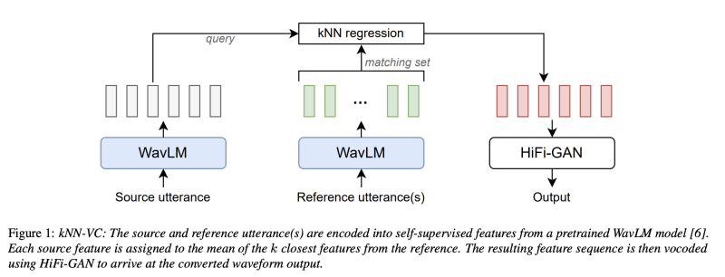
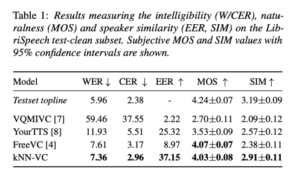

---
layout: post   
title: Voice Conversion With Just Nearest Neighbors     
subtitle: AI Paper Review       
tags: [ai, ml, Voice Conversion, Speech Synthesis]          
comments: true  
---  

kNN-VC (k-nearest neighbors voice conversion)은 목표로 하는 음성 변환을 달성하기 위해 목표 화자의 몇 가지 예시만을 참고로 사용합니다. 
최근의 방법들은 납득할 만한 변환 결과를 제공하지만, 그만큼 복잡성이 증가하여 결과물을 재현하고 확장하기 어렵게 만듭니다. 
대조적으로, kNN-VC는 간단하면서도 효과적인 방법을 제안합니다.

kNN-VC의 접근 방법은 다음과 같습니다:
1. Representation Extraction: 먼저, 소스 음성과 참고 음성으로부터 self-supervised representation을 추출합니다.
2. Target Speaker Conversion: 타겟 화자로 변환하기 위해, 소스 representation 각 프레임을 참고 representation의 가장 가까운 이웃으로 대체합니다.
3. Speech Synthesis with Pretrained Vocoder: 변환된 Representation으로부터 사전 학습된 보코더(pretrained vocoder)를 사용하여 음성을 합성합니다.

객관적이고 주관적인 평가에서 kNN-VC의 성능은 목표로 하는 화자와의 유사성을 향상시키면서도 기존 방법과 유사한 이해 가능성(intelligibility) 점수를 가지고 있다는 것을 밝혔다.

[Paper Link](https://arxiv.org/pdf/2305.18975.pdf)  
[Code Link](https://github.com/bshall/knn-vc)  

## Related Work
전통적인 음성 변환 시스템은 화자의 신원과 콘텐츠를 분리하려고 한다.
그런 다음, 화자 정보를 대체하여 목표 음성으로 변환할 수 있다.
그러나 분리된 표현을 학습하는 것은 어려운 과제이다. 
최근의 시스템은 complex information bottlenecks, normalization methods, data augmentation 등을 필요로 하지만, 여전히 화자 유사성에 어려움을 겪고 있다.

또다른 방법으로는 중간 정보 bottleneck으로서 텍스트 주석을 사용하여 분리를 개선하는 것이 있다.
그러나 큰 음성 말뭉치를 transcrib 하는 것은 비용과 시간이 많이 든다.
게다가 텍스트로 인해 가해지는 bottleneck은 음성 변환 응용프로그램에서 유익한 억양 정보를 제거할 수 있다.
따라서 본 논문에서는 텍스트가 없는 방법에 초점을 맞추고 있다. 

## kNN-VC

개선된 음성 표현을 고려할 때, 고품질의 Voice Conversion을 수행하기 위해 여전히 우리는 복잡한 방법이 필요할까? 
이 문제에 대한 답으로 저자는 k-nearest neighbors voice conversion (kNN-VC)를 제안한다.

Figure1 은 해당 방법의 개요를 보여주며, 이는 Encoder-Converter-Vocoder 구조를 따른다.
먼저, 인코더는 소스 음성(원하는 말)과 참고 음성(원하는 목소리)의 Self-supervised representation을 추출한다.
다음으로 컨버터는 각 소스 프레임을 참고 음성에서 가장 가까운 이웃으로 매핑한다.
마지막으로, 보코더는 변환된 representation에서 오디오 파형을 생성한다.
각 구성요소에 대한 설명은 아래와 같다. 

  

### 1. Encoder

kNN-VC는 먼저 source 발화의 feature sequence를 추출한다.
이를 "쿼리 시퀀스"라고 한다. 또한 타겟 화자의 한 개 이상의 발화에 대한 feature sequence를 추출하고, 이를 섞어서 self-supervised feature vector의 큰 풀로 구성한다.
이를 "매칭 세트"라고 한다.
이 인코더의 목표는 근접한 특성이 유사한 음성적 내용을 가지도록 표현을 추출하는 것이다. 
최근 자기지도 학습모델은 전화 구별 테스트에서 좋은 성과를 보이기 떄문에 좋은 후보이다. 
(같은 전화 인스턴스를 다른 전화보다 가깝게 인코딩한다.)
인코더 모델은 kNN-VC를 위해 절대로 fine-tuneing 되거나 추가로 훈련되지 않는다.
이것은 단지 특성을 추출하는데 사용된다. 

### 2. k-nearest neighbors matching
타겟 화자로 변환하기 위해, 쿼리 시퀀스의 각 벡터에 k-NN 회귀를 적용한다. 
구체적으로, 매칭 세트에서 각 쿼리 프레임을 k-NN 평균으로 대체한다.
비슷한 self-supervised 음성 특성은 음성적 정보를 공유하기 때문에, kNN을 수행함으로써 소스 음성의 내용을 보존하면서, 화자의 신원을 변환할 수 있다.
Concatenative 방법과 마찬가지로, 변환된 쿼리는 대상 특성을 직접 사용하여 구성되며, 이는 좋은 화자 유사성을 보장한다.
kNN 회귀 알고리즘은 non-parametric 하며, 훈련이 필요하지 않으므로, 구현이 쉽다.

### 3. Vocoder

보코더는 변환된 특성을 오디오 파형으로 변환한다.
스펙트로그램을 조건으로 하는 대신, 저자는 전통적인 보코더를 self-supervised feature 입력으로 사용하도록 적응시켰다.
그라나 훈련 중과 추론 중 입력 사이 불일치가 있다.
추론 시에는 보코더를 kNN 출력에 조건을 걸어 사용한다.
즉, 매칭 세트에서 선택된 특성들의 평균이다. 
이러한 특성들은 다양한 시점에서 서로 다른 음성적 맥락을 가진 것들을 선택하여 사용하므로, 인접한 프레임 사이에 일관성이 없어진다.
이러한 불일치가 artifact를 일으켜 변환된 음성의 명확성을 감소시킨다.

### 4. Prematched Vocoder Training

이 문제를 해결하기 위해, 저자는 pre-matched training을 제안한다.
구체적으로 저자는 k-NN 을 사용하여 보코더 훈련 세트를 재구성한다.
각 훈련 발화를 쿼리로 사용하여, 동일한 화자의 나머지 발화를 사용하여 매칭 세트를 구축한다.
그런다음 매칭세트를 사용하여 쿼리 시퀀스를 재구성하기 위해 kNN 회귀를 적용한다.
저자는 보코더를 이 pre-matched 특성으로부터 원래의 파형을 예측하도록 훈련시킨다. 
이 아이디어는 추론 중 보코더가 마주칠 데이터와 유사한 데이터로 보코더를 훈련하여 강건성을 향상시키는 것이다.
이러한 사전 일치 보코더 훈련이 명료성과 화자의 유사성을 향상시킨다는 것을 보여준다.

## Experimental Setup

새로운 non-parametric voice conversion 방법이 최근의 신경망 기반 변환 모델과 경쟁할 수 있는 지 확인하기 위해, LibriSpeech 세트에서 두 가지 실험을 수행하였다.
첫번째 실험은 kNN-VC를 최촘단 음성 변환 시스템과 비교한다.
두번째 실험은 target data 사이즈에 대한 효과와 prematched vocoder training 효과를 조사한다.
두 실험 모두에서 소스와 대상 화자는 훈련 중 보지 않은 화자이다.

LibriSpeech development 와 test clean 세트는 각 40 명의 화자로 구성되어 있으며, 각각 약 8분씩  16kHZ 영어 발화를 제공한다.
이 데이터셋의 다양성과 오디오 품질은 any-to-any voice conversion에 대한 도전적 기준으로 작용한다.

### 1. kNN-VC implementation
#### Encoder
사전 훈련된 WavLM-Large 인코더를 사용하여 소스와 참조 발화의 특성을 추출한다.
예비 실험에서는 후반 레이어 (22, 24 및 마지막 몇개 레이어의 평균)에서 특성을 사용했다.
이 레이어들은 선형 전화 인식작업에서 우수한 성능을 보였다.
이 아이디어는 더 많은 콘텐츠 정보를 포함하여 kNN 맵핑을 개선하는 것이었다. 
그러나 이는 pitch와 에너지 재구성을 악화시켰다.
최근연구는 후반 레이어들이 음높이 억양(prosody) 및 화자의 신원을 예측하는데 있어서 더 좋지 않은 성능을 보인다는 것을 확인하였다.
이러한 관찰을 바탕으로, 저자는 화자 식별과 더 높은 상관관계를 가지는 레이어 6를 사용하는 것이 좋은 화자 유사성과 소스 발화의 억양 정보를 보존하는데 필요하다는 것을 발견하였다.
따라서 모든 후속 실험에서는 WavLM-Large 레이어 6에서 추출된 특성을 사용하며, 이는 16kHZ 오디오의 매 20ms 마다 하나의 벡터를 생성한다.

#### kNN regression

저자는 모든 실험에서 균일한 가중치를 가지고 k=4로 설정하고 특성을 비교하기 위한 코사인 거리를 사용하였다.
예비 실험에서 저자는 kNN-VC가 k=4 주변의 값 범위에 대해 매우 강건하다는 것을 발견하였다.
즉 더 많은 참조 오디오가 있는 경우 (10분 이상) k 값을 더 큰 값(k=20)으로 사용함으로써 변환 품질을 향상시킬 수도 있다.

#### Vocoder

저자는 HiFi-GAN V1 아키텍처를 훈련시킨다.
이 아키텍처를 수정하여 WavLM의 1024 차원의 입력 벡터를 받아들이고 16kHz 오디오를 10ms hop 길이와 64ms의 Hann 창을 사용하여 128 차원 mel-spectrogram으로 변환한다.
저자는 LibriSpeech train-cean100 데이터셋에서 HiFi-GAN V1과 같은 옵티마이저 및 하이퍼파라미터를 사용하여 모델을 훈련 시켰다.
여기서 두가지 변형을 훈련시킨다. 하나는 순수한 WavLM-Large 레이어 6특성으로 훈련시킨 것이고, 다른 하나는 pre-matched 레이어 6 특성으로 훈련시킨 것이다. 
이러한 설계로 8GB VRAM GPU에서 8분의 참조 오디오에 대한 추론이 실시간 보다 빠르다.

### 2. Baseline
kNN-VC를 세가지 any-to-any voice conversion 시스템과 비교한다.
(VQMIVC, FreeVC, YourTTS)
VQMIVC는 상호 정보 최소화를 통해 발화자 식별 정보와 콘텐츠를 분리하기 위해 벡터 양자화를 사용한다.
FreeVC는 VAE와 데이터 augmentation을 결합하여 발화자 정보를 제거한다.
YourTTS는 훈련 중간에 텍스트 전사를 사용하여 중간 정보 bottleneck 형성에 활용한다.
대상 발화자로의 변환을 위해 세 모델은 모두 발화자 인코더를 사용하여 참조 발화로부터 추출된 발화자 임베딩으로 조건을 둔다.
추론 중에는 대상 발화자의 모든 발화로부터 발화자 임베딩을 평균화 하여 성능을 극대화 한다.
저자는 각각의 저자들이 제공한 사전 훈련 모델을 베이스라인으로 사용한다.

### 3. Evaluation metrics

#### 객관적 평가
평가 세트를 구성하기 위해 LibriSpeech test-clean 세트에서 200개의 발화문(각 발화자 당 5개)를 샘플링합니다. 
각 발화문을 39명의 다른 발화자로 변환하여 총 7800개의 출력을 얻습니다. 이전 연구들을 따라, 우리는 변환된 음성에 대해 ASR 시스템을 적용하여 단어/문자 오류율 (W/CER)을 계산하여 명확성을 평가합니다. 
오류율이 낮을수록 명확성이 더 좋습니다. 변환된 발화문을 전사하기 위해 학습된 Whisper-base ASR 모델을 기본 디코딩 매개변수로 사용합니다.

발화자 유사성을 측정하기 위해 훈련된 발화자 검증 시스템을 사용하여 동일 오류율 (EER)을 계산합니다. 
입력 발화문에 대해 검증 시스템은 발화자 식별을 나타내는 x-vector를 출력합니다.
우리는 x-vector 간의 코사인 유사도를 계산하여 두 발화문이 동일한 발화자인지를 판별합니다.
먼저, 변환된 샘플 각각에 대해 대상 발화자의 등록 발화문과의 유사도 점수를 기록합니다. 
그런 다음, 대상 발화자 발화문을 샘플링하고 다른 등록 대상 발화자 발화문과의 유사도를 계산하여 'ground-truth' 유사도 점수와 동일한 수를 얻습니다. 
마지막으로, 점수의 결합된 집합을 사용하여 EER을 계산하며, ground-truth 쌍에 레이블 1을 할당하고 변환된 음성을 포함하는 쌍에는 레이블 0을 할당합니다.
더 높은 EER은 변환된 음성을 대상 발화자의 실제 예제와 구별하기가 더 어렵다는 것을 나타내며, 즉, 더 높은 EER은 더 좋은 발화자 유사성을 의미하며 최대 50%입니다.

#### 주관적 평가

Amazon Mechanical Turk을 사용하여 주관적 평가를 수행하여 자연성과 발화자 유사성을 측정합니다.
자연성에 대해서는 1에서 5까지의 척도를 사용하여 평균 의견 점수 (MOS)를 보고합니다.
각 모델에 대해 60개의 발화문을 샘플링하고 평가하며, LibriSpeech test-clean 세트에서 동일한 수의 정답 예제를 추가합니다. 
정답 예제를 매우 자연스럽지 않다고 판단하는 평가자의 평가를 제외하고 61명의 평가자로부터 총 2144개의 평가를 얻습니다.

발화자 유사성에 대해서는 Voice Conversion Challenge 2020의 프로토콜을 따릅니다.
발화문 쌍이 주어지면, 평가자들에게 발화자 간 유사성을 1에서 4까지의 척도로 평가하도록 요청합니다. 
평가를 위해 LibriSpeech test-clean 세트에서 20개의 소스 발화문을 샘플링합니다.
각 모델마다 각 발화문을 세 개의 대상 발화자로 변환하여 총 60개의 예제를 생성합니다. 
평가자들에게 변환된 출력과 대상 발화자의 실제 예제 사이의 유사성을 평가하도록 요청합니다.
다시 한 번, 대상 발화자 쌍을 매우 다르다고 판단하는 평가자의 평가를 제외하고 208명의 평가자로부터 총 1636개의 평가를 얻습니다. 
이러한 평가를 기반으로 각 모델에 대한 평균 유사성 (SIM) 점수를 보고합니다.

## Results
   