이 논문은 복잡한 장면의 새로운 시점을 합성하기 위해 희소한 입력 시점 집합을 사용하여 기저 연속 volumetric sence 함수를 최적화하는 방법을 제시한다.
저자의 알고리즘은 시점 (x, y, z)와 시선의 방향 (theta, phi) 으로 구성된 연속적인 5차원 좌표 (공간 위치와 시점)를 입력으로 사용하고,
해당 공간 위치에서의 volume density와 시점에 의존하는 방출된 광도를 출력으로 하는
fully connected non-convolutional deep network를 사용하여 장면을 표현한다.
우리는 카메라 광선을 따라 5차원 좌표를 쿼리하여 새로운 시점을 합성하고, 전통적인 volumetiric rendering 기법을 통해 출력 색상과 밀도를 이미지로 투영한다.
volumetric 랜더링은 자연스럽게 미분가능하므로, 표현을 최적화 하기 위해 필요한 유일한 입력은 알려진 카메라 포즈를 가진 이미지 집합이다.
저자는 복잡한 기하학적 형태와 외관을 가진 장면을 사실적으로 렌더링하는데 neural radiance fileds를 효과적으로 최적화 하는 방법을 설명하고, neural rendering과 view synthesis 이전 연구보다 우수한 결과를 보여준다.
시점 합성 결과는 비디오 형태로 확인하는 것이 가장 좋기 떄문에, 저자가 제공한 보충 비디오를 확인할 것을 권장한다.

[Paper Link](https://arxiv.org/pdf/2003.08934.pdf)  
[Code Link](https://github.com/bmild/nerf)  
[Code Link2](https://github.com/yenchenlin/nerf-pytorch)  

(논문 이해를 위해 글 맨 뒤에 있는 Background Knowledge를 먼저 읽을 것을 권장한다)

## Intruduction

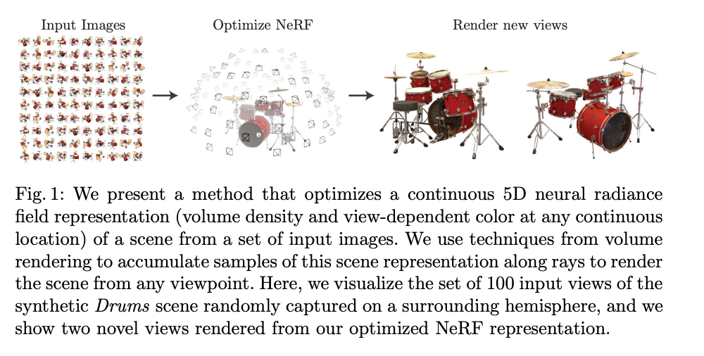

본 연구에서는, 캡처된 이미지의 렌더링 오차를 최소화하기 위해 연속적인 5차원 장면 표현의 매개변수를 직접 최적화함으로써 시점 합성 문제를 새로운 방식으로 해결합니다.
저자는 정적인 장면을 공간의 각 점 (x, y, z)에서 각 방향 (theta, phi)으로 방출되는 광도와 (x, y, z)를 통과하는 광선이 누적하는 광도의 양을 제어하는 차분 투명도처럼 작동하는 밀도로 표현하는 연속적인 5차원 함수로 나타냅니다.
이 방법은 학습을 통해 신경 네트워크를 최적화하여 이 함수를 표현합니다. 이 신경 네트워크는 합성하려는 한 점의 5차원 좌표 (x, y, z, theta, phi)를 입력으로 받아 해당 점의 체적 밀도와 시점에 따라 다른 RGB 색상을 출력하도록 학습됩니다.

Neural Radiance Field를 특정한 view point로부터 render 하기 위해서

1. 장면을 통과하는 카메라 광선을 따라 3D 점의 샘플 집합을 생성합니다.
2. 해당 점과 그에 해당하는 2D 시점 방향을 신경망의 입력으로 사용하여 출력 색상과 밀도의 집합을 생성합니다.
3. 전통적인 체적 렌더링 기법을 사용하여 해당 색상과 밀도를 2D 이미지로 누적합니다.

이 과정은 자연스럽게 미분 가능하기 때문에, 우리는 경사 하강법을 사용하여 이 모델을 최적화할 수 있습니다.
이때 최적화는 각 관측 이미지와 우리의 표현으로부터 렌더링된 해당 시점 사이의 오차를 최소화하는 것입니다.
여러 시점에서 이 오차를 최소화하는 것은 네트워크가 실제 장면 내용을 포함하는 위치에 높은 체적 밀도와 정확한 색상을 할당하여 일관된 장면 모델을 예측하도록 장려합니다.
Figure 2는 이 전체 파이프라인을 시각화합니다.

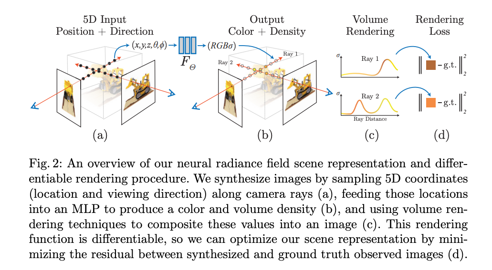

저자는 복잡한 장면을 위한 Neural Radiance Field 표현의 기본 구현이 출분이 고해상도 표현으로 수렴하지 않고, 카메라 광선당 필요한 샘플 수에 비효율적이라는 문제를 발견하였습니다.
저자는 이러한 문제를 해결하기 위해 positional encoding을 사용하여 입력 5차원 좌표를 변환하였습니다.
이는 MLP가 더 높은 주파수 함수를 표현할 수 있도록 합니다.
또한 계층적인 샘플링 절차를 제안하여 고주파수 장면 표현을 적절하게 샘플링 하기 위해 필요한 쿼리수를 줄였습니다.

저자의 접근 방식은 Volumetric 표현의 장점을 상속합니다.
이러한 방법은 복잡한 실제 세계의 기하학적 형태와 외관을 표현할 수 있으며, 투사된 이미지를 사용하여 기울기 기반 최적화에 적합합니다.
저자의 방법은 특히 고해상도에서 복잡한 장면을 모델링할 때 이산화된 Voxel grid의 저장 비용을 극복합니다.

요약하면 저자의 기술적 기여도는 아래와 같습니다.

- 복잡한 기하학적 형태와 재료를 가진 연속적인 장면을 5차원 neural radience filed로 표현하기 위한 접근 방식, 이는 기본 MLP 네트워크로 매개변수화 됩니다.
- 표준 RGB 이미지에서 이런 표현을 최적화 하기 위해 전통적인 Volumetric rendering 기법을 기반으로 한 미분 가능한 렌더링 정차. 이는 MLP 역량을 가시적인 scene content 공간으로 할당하기 위한 계층적 샘플링 전략이 포함됩니다.
- 각 입력 5차원 좌표를 고차원 공간으로 매핑하는 positional encoding을 사용하여 neural radical filed를 최적화하여 고주파수 장면 콘텐츠를 효과적으로 표현할 수 있게 되었습니다.

결과적으로 저자의 NeRF 방법이 최첨단 시점 합성 방법을 수량적, 질적으로 능가한다는 것을 보여준다.
이는 첫번째 연속적인 neural 장면 표현으로, 실제 객체와 장면을 자연환경에서 캡쳐한 RGB 이미지로부터 고해상도의 사실적인 새로운 시점을 랜더링할 수 있게 한다.

## Neural Radiance Field Scene Representation

연속적인 장면을 5차원 벡터 값 함수로 표현합니다. 이 함수의 입력은 3차원 위치 x = (x, y, z)와 2차원 시점 방향 (theta, phi)이며, 출력은 방출된 색상 c = (r, g, b)과 부피 밀도 sigma입니다.
실제로는 방향을 3차원 직교 단위 벡터 d로 표현합니다. 우리는 MLP 네트워크 FΘ : (x, d) → (c, sigma)를 사용하여 이 연속적인 5차원 장면 표현을 근사화하고, 가중치를 최적화하여 각 입력 5차원 좌표에 해당하는 부피 밀도와 방향에 따른 방출 색상을 매핑합니다.

또한 표현이 다중 뷰에서 일관성을 가지도록 하기 위해 네트워크가 부피 밀도 sigma를 위치 x의 함수로만 예측하도록 제한하고, RGB 색상 c를 위치와 시점 방향 함수로 예측할 수 있도록 한다.
이를 위해 MLP F는 먼저 입력 3D 좌표 x를 8개의 완전 연결 계층을 통해 처리합니다. (ReLU 활성화 함수와 각 계층당 256 channel을 사용)
그리고 sigma와 256 특징 벡터를 출력한다. 이 특징 벡터는 카메라 광선의 시점 방향과 연결되어 하나의 추가적인 완전한 연결 계층 (ReLU 활성화 함수와 128 channel을 사용)을 통과하여 시점 방향에 따른 RGB 색상을 출력한다.

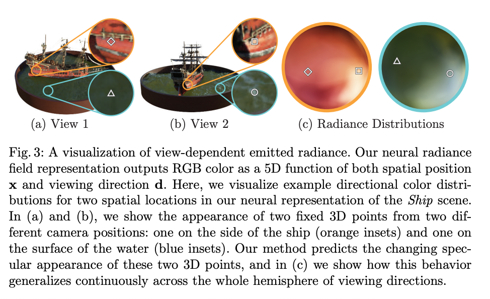

저자의 방법이 입력 시점의 방향을 사용하여 non-Lambertainㅇ 효과를 표현하는 방법의 예는 위와 같습니다. 입력으로 시점의 방향을 사용하지 않고 훈련한 모델은 반사광을 표현하는데 어려움을 겪습니다.

## Volume Rendering with Radiance Fields

저자의 5D neural radiance field는 장면을 공간의 임의의 점에서 부피밀도와 방향에 따른 방출된 광도로 표현합니다.

고전적인 볼륨 렌더링의 원리를 사용하여 장면을 통과하는 어떤 광선의 색상을 렌더링합니다.

---

### (참고) [Volume Ray Casting](https://nuguziii.github.io/cg/CG-001/)

이미지 기반의 볼륨 랜더링 기술이다. 볼륨 랜더링이란 3차원 샘플링 데이터를 2차원 투시로 보여주는 것이다.

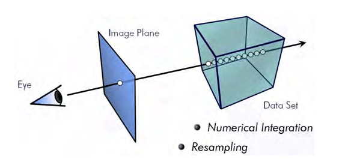

Eye는 카메라로 현재의 Volume을 바라보는 위치와 ray의 방향이 정해진다.

Image Plane은 3차원의 볼륨 데이터가 2차원에 투영된 이미지이다.

image의 각 픽셀에서 하나의 광선이 volume으로 투사된다. 이때 이 광선이 물체 표면에 닿았을 때 정지시키지 않고 계속 뚫고 나가도록 광선을 통해 물체를 샘플링하도록 한다.

#### Pipeline

##### 1. Ray Casting

Ray를 쏘는 카메라의 위치와 방향을 먼저 정의해야 한다.

우리는 360도 어느 방향에서든지 이 볼륨을 바라봐야 하기 때문에 구면 좌표계를 고려한다.

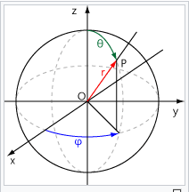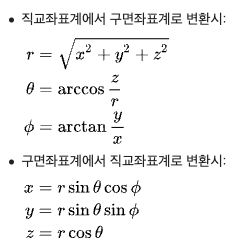

원점 O 위치에 볼륨이 위치하고 P를 카메라 위치로 잡는다면 카메라의 위치를 쉽게 정의할 수 있다.

- r: 원점 O로 부터 P까지의 거리
- theta: z축의 양의 방향으로부터 O-P가 이루는 각
- Phi: x축의 양의 방향으로부터 O-P를 xy 평면에 투영시킨 직선까지의 각

  이때 구면 좌표계가 좌표값에 따라 한점을 여러 좌표가 가르키는 경우가 있으므로 각 변수의 범위를 아래와 같이 제한한다
- r >= 0
- 0 <= theta <= pi
- 0 <= Phi <= 2*pi

카메라에서 쏘는 ray의 방향을 정의하기 위해서는 벡터 개념을 사용한다.

##### 2. Sampling

각 픽셀에서 광선을 내보내는데, 이때 광선은 볼륨을 통과하면서 일정한 간격으로 복셀 데이터를 샘플링한다.

샘플링시 고려해야 할 점은 아래와 같다

- Nyquist Sampling Theorem
  - sampling 주파수가 샘플링 하려는 데이터 주파수의 두배 이상이 되어야 재구성 할 수 있다.
- Interpolation
  - 샘플링 하는 위치와 복셀의 위치가 완벽하게 일치하지 않는다.
  - 이때 주변 복셀값으로부터 interpolation (trilinear interpolation, 3차원) 해주어야 한다.
    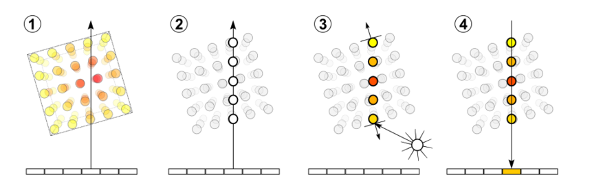

##### 3. Compositioning

위에서 샘플링을 통해 복셀 값을 얻었다면, 이를 합성하여 광선을 내보낸 픽셀의 RGBA 값을 정의해 주어야 한다.

- Transfer Function
  - 샘플링된 각 값의 범위를 우리가 원하는 RGBA 값으로 매핑
- Shading and illumination
  - 각 매핑된 샘플링 값은 RGB(Emission) + A(Absorption) 이다.
  - 여기에 Scattering term을 고려해줌으로써 illumination 효과를 얻을 수 있다. (물체의 성질에 따라서 빛 반사 효과를 모델링 해주는 것)
  - 예시로 Phong Reflection Model을 통해 구현될 수 있다.
- Front-to-back compositioning
  - 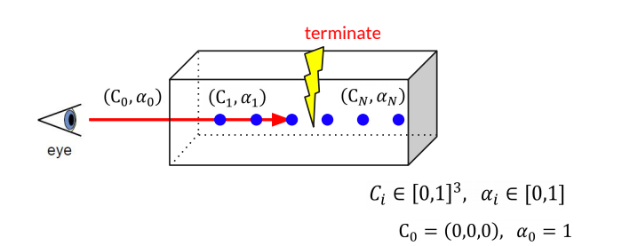
  - 카메라의 가까운 방향부터 샘플링된 값을 합성해 나가는 방법
  - C: color (RGB)
  - T: transparency (1-T)
  - 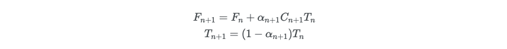

---

부피밀도 sigma(x)는 위치 x에서 무한소입자에서 광선이 종료될 확률의 미분 가능성으로 해석될 수 있습니다.

카메라 광선 r(t) = o + td 가 근처 경계 t_n과 먼 경계 t_f를 가지는 경우 예상 색상 C(r)은 다음과 같습니다.

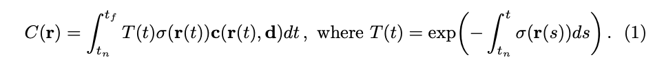

- o: origin (시작 포인트)
- d: ray direction (normalized vector)
- t: distance
- T(t): t_n 부터 t 까지의 광선을 따라 누적된 투과도를 나타냄. 즉, 광선이 다른 입자에 충돌하지 않고 t_n부터 t까지 이동할 확률

연속적인 NeRF 에서 뷰를 랜더링하기 위해서는 원하는 가상 카메라의 각 픽셀을 통과하는 카메라 광선을 추적하여 이 적분 C(r)을 추정하여야 합니다.

우리는 사분법을 사용하여 이 연속적인 적분을 수치적으로 추정합니다. 일반적으로 이산화된 복셀 그리드를 렌더링하는 데 사용되는 결정론적 사분법은 MLP가 고정된 이산 위치 집합에서만 쿼리될 수 있어 효과적으로 표현의 해상도를 제한합니다.

대신에, 저자는 Stratified Sampling 접근 방식을 사용합니다. 여기서 [t_n, t_f]를 N개의 균일하게 간격 나눈 구간으로 나누고 각 구간 내에서 균일한 확률로 하나의 샘플을 무작위로 추출합니다.

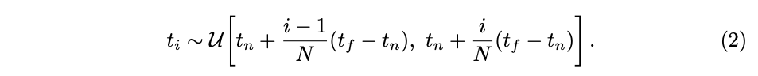

적분을 추정하기 위해 이산적인 샘플 집합을 사용하지만, Stratified Sampling 을 통해 연속적인 장면을 표현할 수 있습니다.

이는 MLP 가 최적화 과정에서 연속적인 위치에서 평가되기 떄문입니다.

저자는 이러한 샘플을 사용하여 Max의 볼륨 랜더링 리뷰에서 설명된 사분법 규칙을 사용하여 C(r)을 추정합니다.

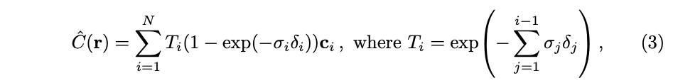

- delta_i = t_(i+1) - t_i (인점한 샘플간의 거리)

위 함수는 단순하게 미분 가능하며, a_i = 1 -  exp(-sigma_i * delta_i) 를 사용한 전톨적인 알파compositing으로 축소됩니다.

## Optimizing a Neural Radiance Field

고해상도 복잡한 장면을 표현하기 위해 두가지 개선사항을 도입하였습니다.

첫번째는 입력 좌표의 위치 인코딩으로 MLP 가 고주파 함수를 잘 표현할 수 있도록 돕습니다.

두번째는 고주파 표현을 효율적으로 샘플링 할 수 있는 계층적 샘플링 절차입니다.

### 1. Positional encoding

신경망이 범용 함수 근사기로 알려져 있음에도 불구하고, 저자는 네트워크 F가 직접 x, y, z, theta, phi 입력 좌표에 작용하는 경우, 고주파수 색상 및 기하학적 변동을 잘 표현하지 못하는 렌더링 결과가 나타남을 발견했습니다.

심층 신경망은 보통 낮은 주파수 함수를 학습하는 것에 편향되어 있음을 밝힌 Rahaman의 연구와 일치하는 내용입니다.

또한 입력을 고주파수 함수를 사용하여 더 높은 차원의 공간으로 매핑한 후 신경망에 전달함으로써 고주파수 변동을 포함하는 데이터의 적합성을 향상시킬 수 있음을 보였습니다.

저자는 이러한 결과를 neural scene representation의 맥락에서 활용하고 F를 두 개의 함수 F = F' * gamma 의 합성으로 다시 정의함으로써 성능을 크게 향상시켰습니다.

여기서 gamma는 R을 더 고차원 공간 R^2L 로 매핑하는 함수이고, F'는 여전히 일반적인 MLP 입니다.

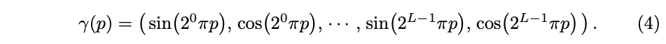

위의 gamma 함수는 x의 각각의 세 좌표값 (-1 ~ 1 사이에 정규화) 과 구성요소로 이루어진 Cartesian viewing direction unit vector d(-1 ~ 1로 구성되어 있음)에 별도로 적용됩니다.

실험에서는 gamma(x)에 대해 L=10, gamma(d)에 대해 L=4를 설정하였습니다.

이와 유사한 매핑은 인기있는 Transformer 아키텍처에서 사용되며, 이는 순서 개념을 포함하지 않는 아키텍처에 시퀀스 내 토큰의 이산 위치를 입력으로 제공하는 다른 목적으로 사용됩니다.

반면 저자는 이러한 함수들을 사용하여 연속적인 입력 좌표를 고차원 공간으로 매핑하여 MLP가 더 높은 주파수 함수를 더 쉽게 근사화 할수 있게 합니다.

관련 문제인 3D 단백질 구조 모델링에 대한 동시 연구도 유사한 입력좌표 매핑을 사용합니다.

### 2. Hierarchical volume sampling

카메라 광선을 따라 N개의 쿼리 지점에서 신경 방사형 밀도장 네트워크를 밀도있게 평가하는 랜더링 전략은 비효율적입니다.

랜더링에 기여하지 않는 빈 공간과 가려진 영역이 여전히 반복적으로 샘플링 되기 때문입니다.

그래서 저자는 볼륨 랜더링 초기작업에서 영감을 받아 랜더링 효율성을 높이기 위한 계층적 표현을 제안합니다.

저자는 장면을 나타내기 위해 단일 네트워크를 사용하는 대신 두 개의 네트워크를 동시에 최적화합니다.

하나는 coarse, 다른 하나는 fine 네트워크 입니다.

저자는 먼저 계층화된 샘플링을 사용하여 N_c 개의 위치를 샘플링하고, 방정식 (2), (3) 에서 설명한대로 course 네트워크에서 이러한 위치를 평가합니다.

이 coarse 네트워크의 출력을 통해, 우리는 각 광선을 따라 포인트의 더많은 정보를 갖는 샘플링을 생성합니다.

이 샘플링에서는 샘플들이 볼륨의 관련 부분을 중심으로 편향되도록 조정됩니다.

이를 위해 저자는 먼저 방정식 (3)의 coarse 네트워크로부터 alpha composited color 를 광선을 따라 모든 샘플된 컬러 c_i의 가중합으로 다시 작성합니다..

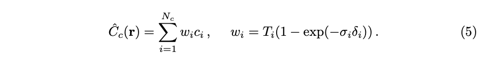

이러한 가중치를 정규화 (w_i' = w_i/sum(w)) 하여 광선을 따라 piecewise-constant PDF(확률 밀도 함수)를 생성 합니다. (대부분이 중앙부분에 위치)

정규화를 통해 적분 값이 1이 되도록 한다. 이 PDF 에서 CDF(누적분포함수)를 만들고, inverse transform sampling을 사용하여 두번째 N_f 개의 위치를 샘플링한다.

- y = [0, 1]
- 랜덤하게 y값을 고른 후, x로 inverse transform을 시키면 대부분 객체 중앙에 위치한 z 좌표들이 sampling 된다.
- 이를 통해 객체의 중심부를 더 잘 표현할 수 있도록 함

첫번째와 두번째 샘플 집합의 합집합에서 방정식 (3)을 사용하여 fine 네트워크를 평가하고, 광선의 최종 렌더링된 컬러를 계산합니다.

이때 모든 N_c + N_f 개의 샘플을 사용합니다.

이 절차는 가시적인 콘텐츠가 있는 지역에 더 많은 샘플을 할당합니다.

이는 중요도 샘플링과 유사한 목표를 다루지만, 각 샘플을 전체 적분의 독립적인 확률 추정치로 처리하는 대신 샘플링된 값을 전체 적분 영역의 비등간격으로 사용합니다.

### 3. Implementation details

각 장면에 대해 별도의 신경망을 사용하여 neural continuous volume representation network의 표현을 최적화합니다.

이를 위해 각 장면의 캡쳐된 RGB 이미지 데이터셋, 해당하는 카메라의 포즈 및 내부 매개변수, 그리고 장면 경계정보가 필요합니다.

(합성 데이터의 경우에는 실제 카메라 포즈, 내부 매개변수 및 경계를 사용하며, 실제 데이터의 경우 COOLMAP structure-from-motion 패키지를 사용하여 이러한 매개변수를 추정합니다)

각 최적화 반복에서는 데이터셋의 모든 픽셀에서 일광에 대한 카메라 광선 배치를 무작위로 샘플링 한다음, 계층적 샘플링을 따라서 coarse network에서 N_c 개의 샘플, fine 네트워크에서 N_c+N_f 개의 샘플을 쿼리합니다.

그런다음 volume 랜더링 절차를 사용하여 각 광선의 색상을 두개의 샘플 세트에서 랜더링합니다.

손실은 단순히 corase, fine 랜더링의 랜더링된 픽셀의 색상과 실제 픽셀 색상간의 총 제곱오차입니다.

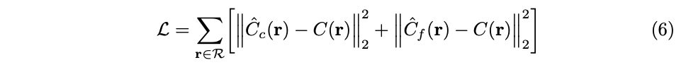

- R: set of rays in each batch

최종 랜더링은 C_f(r) 에서 나오지만, 저자는 C_c(r)의 손실도 최소화하여 fine 네트워크에서 샘플을 할당하는데 coarse 네트워크의 가중치 분포를 사용할 수 있습니다.

저자의 실험에서는 N_c = 64개의 좌표로 coarse volume 에서 샘플링하고 N_f = 128개의 추가적인 좌표로 fine 볼륨에서 샘플링하여 4096 개의 광선을 배치크기로 사용합니다.

Adam optimizer를 사용하며, learning rate = 0.0005에서 시작하여 최적화 과정동안 지수적으로 0.00005로 감소합니다.

단일 장면의 최적화는 일반적으로 NVIDIA V100 GPU 에서 100-300k 번 반복하여 수렴하는데 약 1-2일 소요됩니다.

## Additional Implementation Details

### Network Architecture

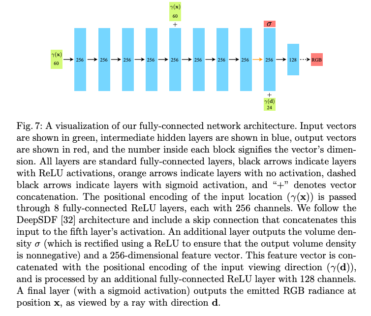

#### Overview

- Architecture: MLP
- Input: (x, y, z, theta, phi) -> (x, y, z)

  - 위의 input 값이 그대로 네트워크 학습에 사용되는 것이 아니다.
  - (theta, phi)는 camera extrinsic parameter로 Camera to World Coordinate를 만들때 사용하는 parameter
  - C2W 매트릭스를 통해 Image Coordinate -> Normalize Coordinate -> Real World Coordinate 변환 하여 만들어진 각 (x, y)의 Ray와 Ray 위에서 sampling 된 z가 input (x, y, z)로 들어간다
  - 추가로 모델 마지막에 view direction이 들어간다.
- Output: (r, g, b, density)
- 훈련: predicted RGB 값과 GT RGB 간의 MSE loss 최소화

#### Positional Embedding

input (x, y, z) 3차원이 gamma(positional embedding)를 통해 60차원, 24차원으로 들어간다.

논문에서 L=10 이면 각 x, y, z 마다 sin, cos 두 개가 10번 적용되므로 3 x 2 x 10 = 60 차원이 된다.
input (x, y, z)를 같이 활용하면 63차원이 된다.


#### View Direction

density prediction을 먼저 output 한 후, view direction이 input으로 들어간다

view direction은 real word에 해당하는 ray direction에 따라 sampling된 좌표들에서 각 좌표마다 방향에 대한 크기가 다르지 않고, 방향만 고려될 수 있도록 normalize 해준 것이다.

```python
# rays_d: [H, W, 3] 
view_direction = rays_d / torch.norm(rays_d, dim=-1, keepdim=True)

```


### Volume Bounds

저자의 방법은 카메라 광선을 따라 연속적인 5D 좌표에서 Neural Radiance Field 표현을 쿼리함으로써 뷰를 랜더링 합니다.

합성 이미지를 사용한 실험에서는 장면을 원점을 중심으로 한 변의 길이가 2인 정육면체 내에 위치하도록 조정하고, 이 경계 볼륨 내에서 표현을 쿼리합니다.

실제 이미지 데이터셋은 가장 가까운 점부터 무한대까지 존재할 수 있는 콘텐츠를 포함하고 있으므로, 정규화 장치 좌표를 사용하여 이러한 점들의 깊이 범위를 [-1, 1]로 매핑합니다.

이를 통해 모든 광선 원점이 장면의 가까운 평문으로 이동되고, 카메라의 원군 광선이 변환된 볼륨에서 평행광선으로 매핑되며, 거리의 역수인 변위가 메트릭의 깊이 대신 사용되므로 모든 좌표가 이제 경계로 제한됩니다.


### Training Details

실제 장면 데이터에 대해서는, 새로운 뷰를 렌더링할 때 시각적인 성능을 약간 향상시키기 위해 최적화 과정에서 출력 sigma 값에 대해 평균이 0이고 분산이 1인 가우시안 노이즈를 추가하여 네트워크를 정규화합니다.


### Rendering Details

테스트 시간에 새로운 뷰를 렌더링 하기 위해, 저자는 각 ray 마다 64개의 점이 coarse network를 64+128 개의 점이 fine network를 통과하는 경우로 샘플링하였습니다.

현실적인 합성 데이터 세트는 이미지당 640k 개의 ray를 요구하며, 실제 장면은 이미지당 762k ray를 요구하며, 랜더링된 이미지당 150~200 million 회의 네트워크 쿼리가 수행됩니다.

이는 NVIDIA V100 에서 약 30초가 걸립니다.


### Dataset

- Blender Dataset
  - 배경이 흰색
  - 가상 환경에서 만들어진 데이터
  - Camera Parameter를 별도의 연산 과정 없이 바로 얻을 수 있으며, 자유로운 각도의 view direction 에서 이미지를 얻을 수 있다.
- LLFF Dataset
  - Real Scene 데이터
  - 각도가 한정되어 있는 forward facing scene (대부분이 앞쪽에서 찍힘)
  - Camara Parameter 정보가 없어 직접 구해야 함


## Background Knowledge [참조 블로그](https://kyujinpy.tistory.com/16#ndc)

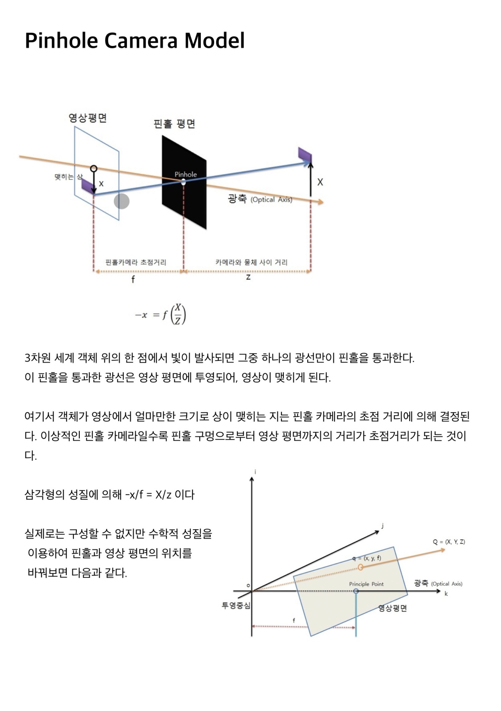
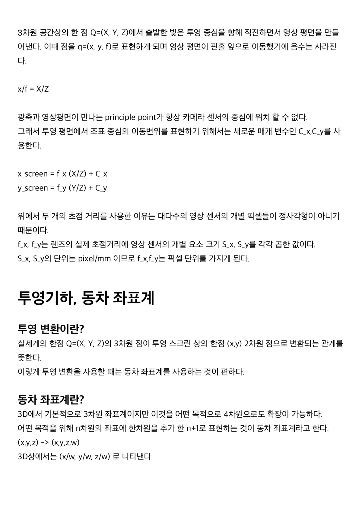
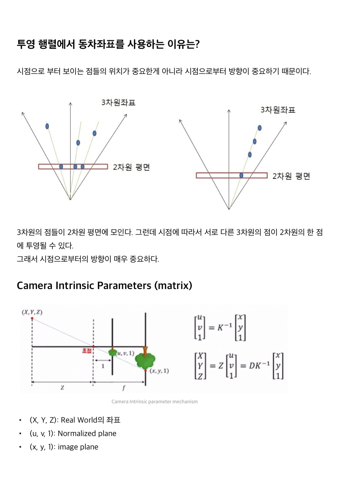
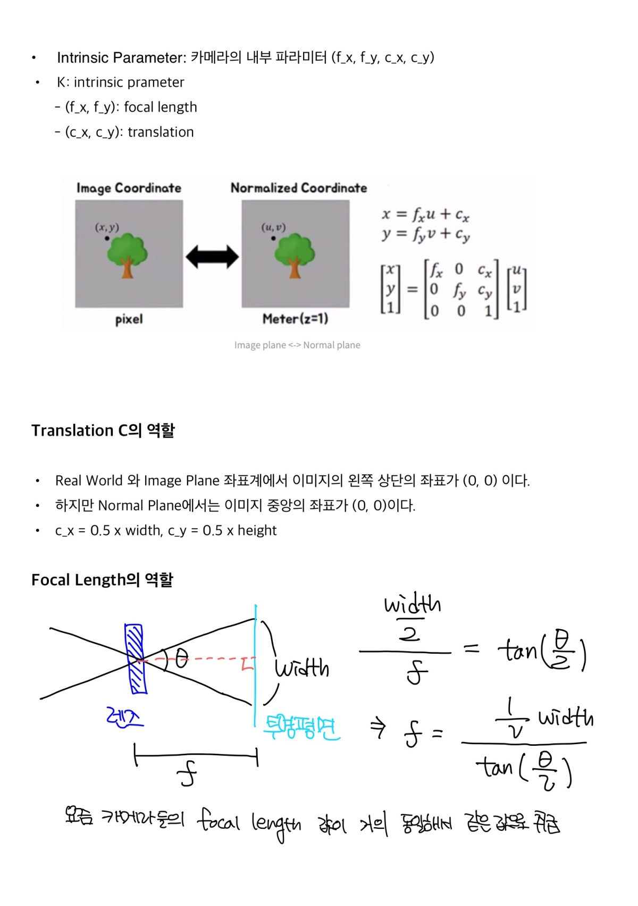
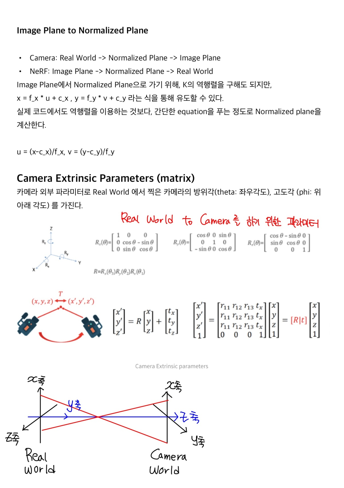
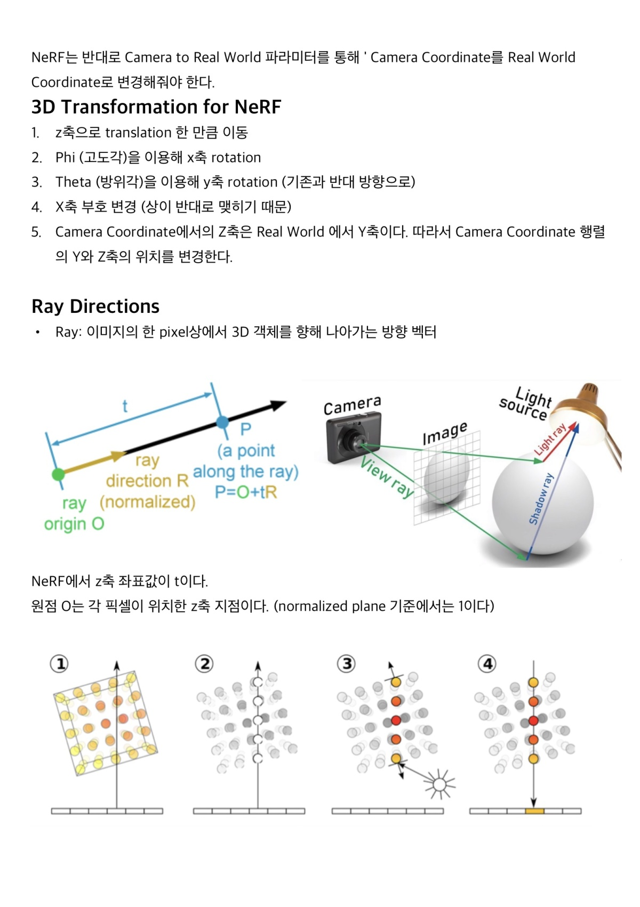
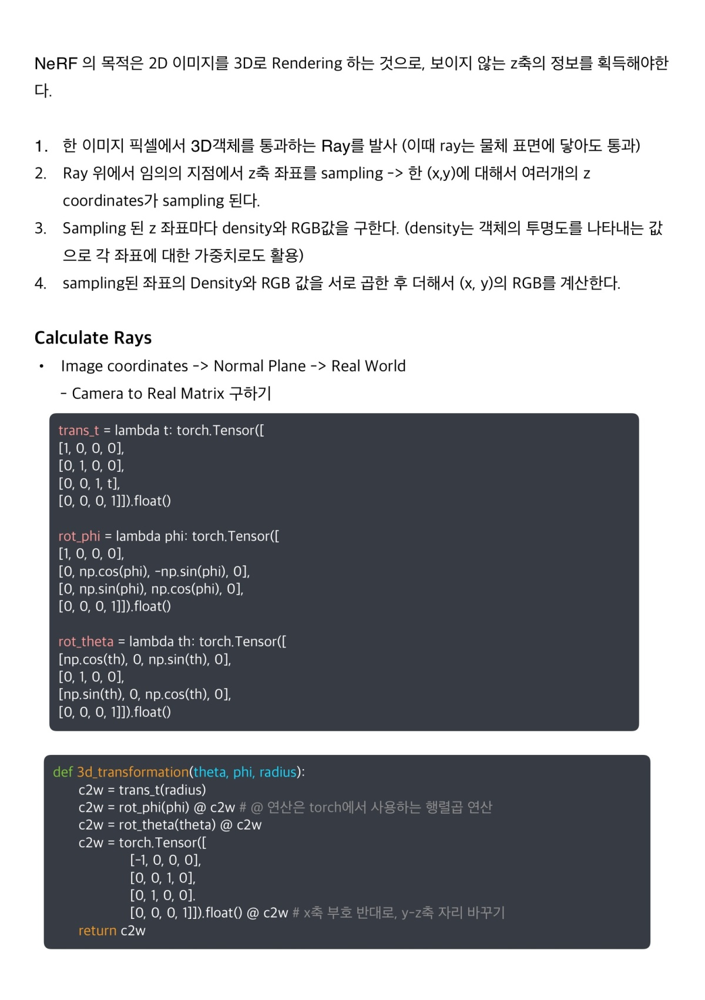
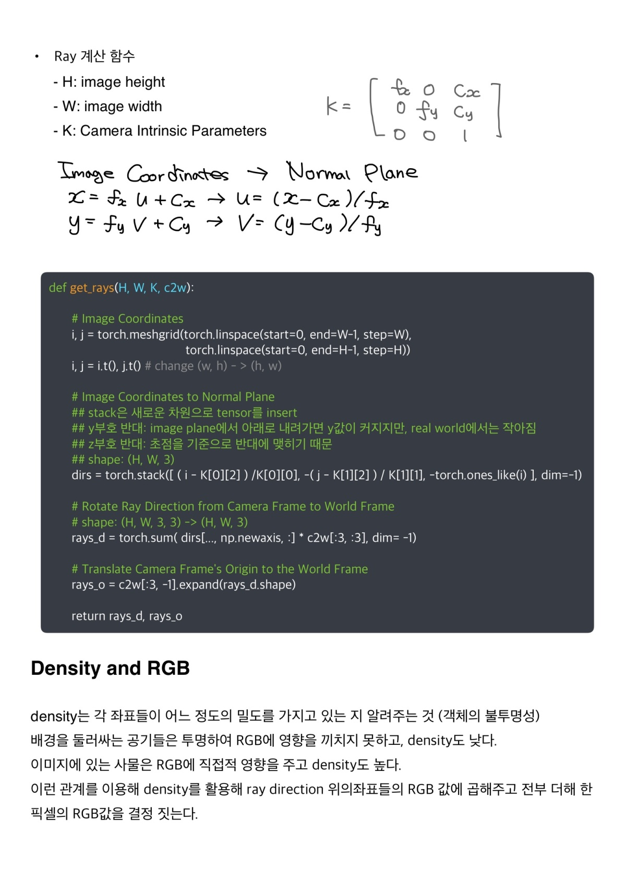
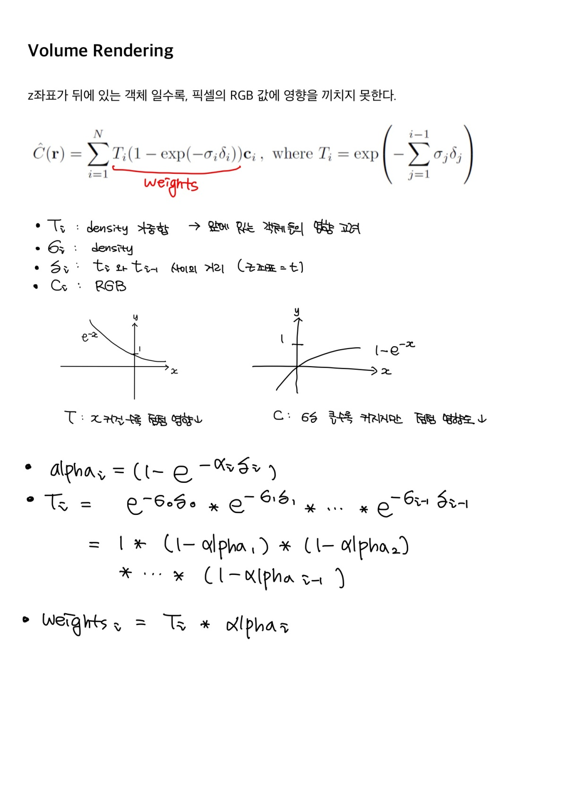
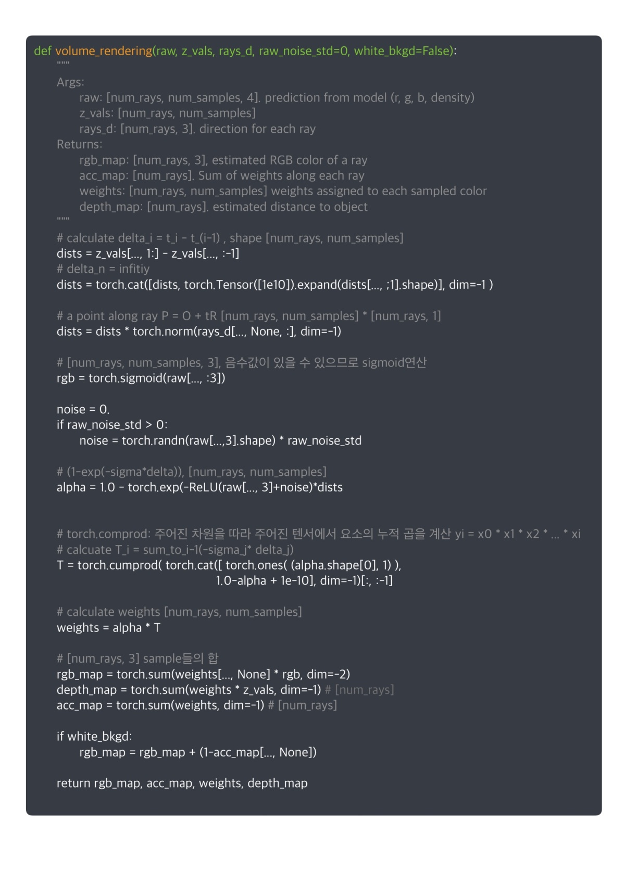
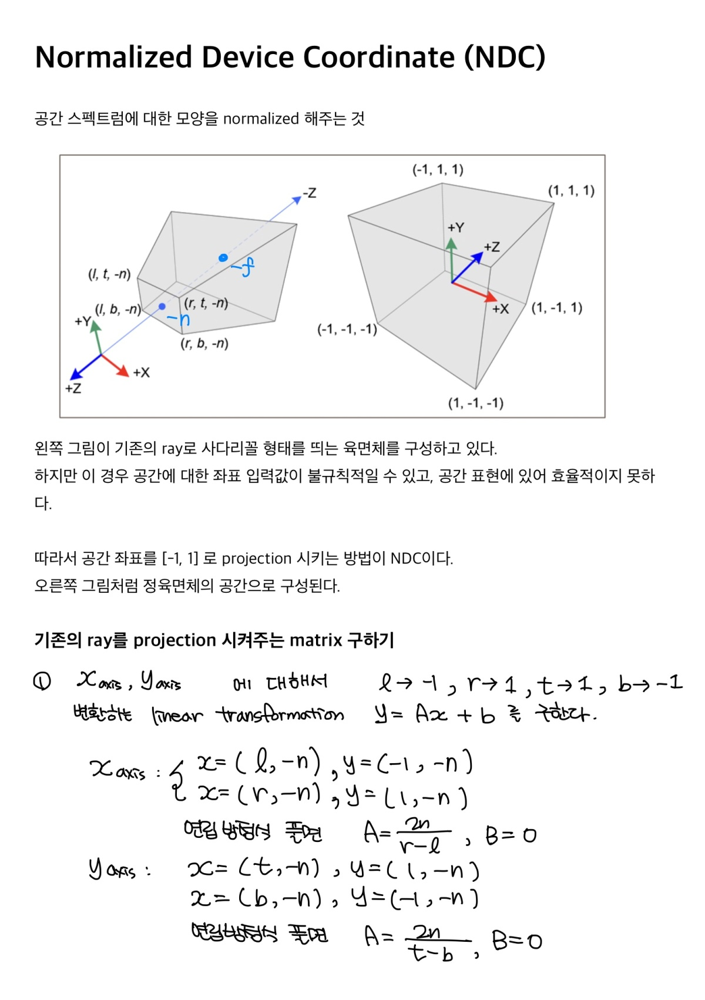
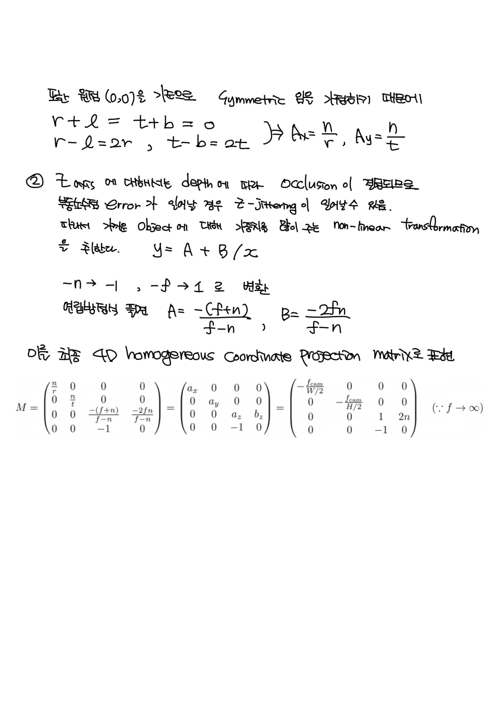
