최근 연구에서는 Neural Radiance Field (NeRF)에 대한 폭발적인 연구로 복잡한 장면을 신경망으로 효과적으로 표현할 수 있는 잠재력을 보여주고 있습니다.
그러나 NeRF의 주요 단점 중 하나는 그것의 신축적인 추론시간입니다.
단일 픽셀을 랜더링하기 위해서는 NeRF 네트워크를 수백번 쿼리해야합니다. 이를 해결하기 위해 기존의 노력들은 주로 필요한 샘플 포인트 수를 줄이는 방향으로 진행되고 있습니다.
그러나 반복적인 샘플링의 문제는 여전히 존재합니다.
반면 Neural Light Field (NeLF)는 NeRF에 비해 신규 뷰 합성에서 더 직관적인 표현을 제공합니다.
픽셀의 렌더링은 ray-marching 없이 단일 전방향 패스로 수행됩니다.
이 연구에서는 Deep Residual MLP 네트워크 (88 layers)를 제안하여 light field 를 효과적으로 학습하는 방법을 제시합니다.
이런 깊은 NeLF 네트워크를 성공적으로 학습하기 위해서는 충분한 데이터가 필요합니다.
이를 위해 사전에 학습된 NeRF 모델의 지식을 Data Distillation을 통해 전이합니다.
합성 및 실제 장면에 대한 광범위한 실험을 통해 저자의 방법이 다른 유사 알고리즘에 비해 장점을 가진다는 것을 보여줍니다.
장면 합성에서 26 ~ 35x FLOPs 감소 (per camera ray), 28 ~ 31x runtime 속도 증가를 보여주면서 어떠한 사용자 정의 병렬화 요구 없이 NeRF 보다 훨씬 우수한 (1.4 ~ 2.8 dB average PSNR improvement) 랜더링 품질을 제공합니다.

[Paper Link](https://arxiv.org/pdf/2203.17261.pdf)  
[Code Link](https://github.com/snap-research/R2L)  

## Introduction

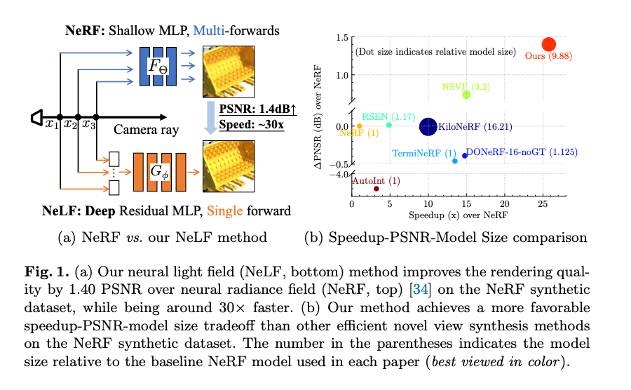

2D 관찰로부터 3D 장면의 표현을 추론하는 것은 컴퓨터 그래픽스와 컴퓨터 비전에서 기본적인 문제입니다.
최근의 연구 혁신인 암묵적 neural representation과 미분 neural renders는 이 문제에 대한 해결책을 현저히 발전시켰습니다.
단순한 MLP 네트워크에 의해 학습된 Neural Radiance Field(NeRF)는 복잡한 장면을 간결한 신경망에 저장하는 큰 잠재력을 보여주었으며, 이로 인해 많은 후속 연구들에 영감을 주었습니다.

NeRF와 그 확장 모델들의 성공에도 불구하고, 여전히 그 단점이 뚜렷합니다.
NeRF 프레임워크는 알파 포지선을 통해 수백 개의 샘플 포인트의 방사도를 집계하기 때문에, 심지어 단일 픽셀의 렌더링 시간도 지연됩니다.
수백번의 네트워크 전파가 필요하므로 자원이 제한되는 장치에서 사용하기가 매우 느립니다.
이 문제에 대한 직관적인 해결책은 NeRF MLP 모델의 크기를 줄이는 것입니다.
그러나 랜더링된 이미지의 명확한 품질 저하가 관찰되며 (네트워크 너비를 반으로 줄이면 약 0.01 SSIM 하락 발생), 추론 시간의 감소는 제한적입니다.
다른 연구 노력은 샘플 포인트 수를 줄이는데 초점을 맞추고 있습니다.
그러나 이는 샘플링 문제를 근본적으로 해결하지 않습니다.
일부 연구는 훈련을 위해 추가적인 깊이 정보를 요구하는데, 이는 대부분의 실제 상황에서 일반적으로 사용할 수 없습니다.
따라서 2D 이미지만 입력으로 필요로 하면서도 장면을 간결하게 표현하고 빠른 렌더링 속도와 높은 이미지 품질을 제공하는 방법이 매우 바람직합니다.
이 논문은 NeRF 대신 Neural Light Field (NeLF)로 장면을 표현함으로써 이러한 모든 네가지 목표를 동시에 달성할 수 있는 방법을 제시하는 것을 목표로합니다.
NeLF에서는 광선의 출발점과 방향이 관련된 RGB 값으로 직접 맵핑 되므로 카메라 광선을 따라 여러 점을 샘플링 할 필요가 없습니다.
따라서 픽셀의 렌더링은 하나의 단일 쿼리만 필요하며, Radiance 장면 표현보다 훨씬 빠릅니다.

NeLF 아이디어는 매력적이지만, NeRF 보다 우수한 품질로 복잡한 실제 장면을 효과적으로 표현하는 것은 여전히 도전적입니다.
이를 가능하게 하는 첫번째 주요 기술적 혁신은 Neural Light Field 네트워크를 위한 새로운 네트워크 아키텍처를 설계하는 것입니다.
특히, 광범위한 Residual MLP 블록을 가진 깊은 (88개의 layer) residual MLP 네트워크를 제안합니다.
이 깊은 네트워크는 얖은 네트워크와 비교하여 훨씬 더 큰 표현력을 갖기 떄문에 광학 필드를 정확하게 표현할 수 있습니다.
특히, NeRF의 등장 이후로 그 MLP 기반의 네트워크 아키텍처는 몇가지 실질적인 변경 없이 계승되었습니다. 따라서 이는 네트워크 디자인 관점에서 NeRF의 랜더링 효율 문제에 대한 첫번째 시도입니다.
이 논문의 네트워크는 원래 NeRF 보다 많은 파라미터를 포함하고 있지만, 픽셀의 색상을 랜더링 하기 위해 하나의 단일 네트워크 전파만을 필요로 하므로 NeRF 보다 훨씬 더 빠른 추론 속도를 제공합니다.

제안된 Deep Residual MLP 네트워크를 훈련하는 것이 주요 기술적 문제입니다.
대규모 네트워크는 오버피팅을 억제하기 위해서는 큰 샘플 크기를 필요로 한다는 것이 잘 알려져 있습니다.
일반적으로 실제 응용프로그램에서는 원본 2D 이미지만 사용하여 이런 큰 네트워크를 거의 훈련할 수 없습니다. (일반적으로 100개 미만)
이 문제를 해결하기 위해 이 논문은 두 번째 주요 기술적 혁신으로 사전에 학습된 NeRF 모델에서 지식을 추출하여 이 네트워크에 전달하는 방법을 제안합니다.
이를 위해 사전에 학습된 NeRF 모델을 사용하여 임의의 시점에서 가상 데이터를 랜더링합니다.
저자는 이 방법을 R2L 이라고 이름을 붙였으며, Neural Radiance Field 를 Neural Light Field 로 추출하는 것이 효과적인 방법임을 보여줍니다.
저자는 합성 및 실제 데이터셋에서 이 방법을 평가합니다. 합성 장면에서 원본 NeRF에 비해 26 ~ 35 배의 FLOPs 절감과 매우 높은 랜더링 품질을 달성합니다. (28 ~ 31 배의 실행시간 향상)

이에 대한 비교는 아래 표와 같습니다.

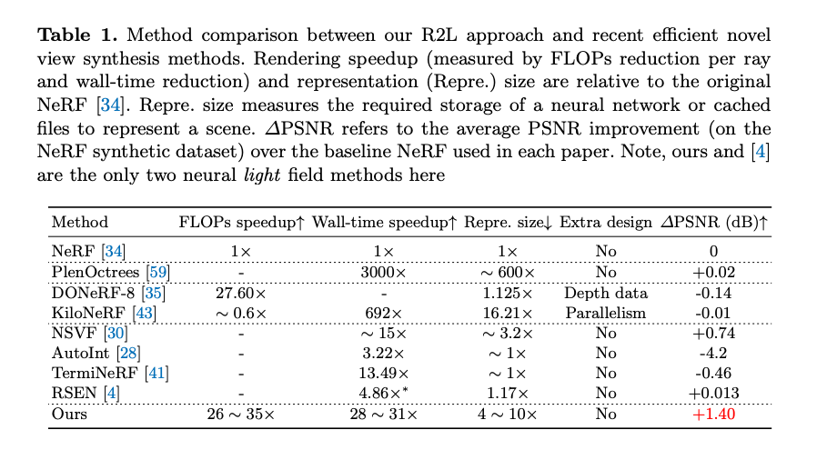

---

### (참고) 이미지 품질 측정: PSNR, SSIM

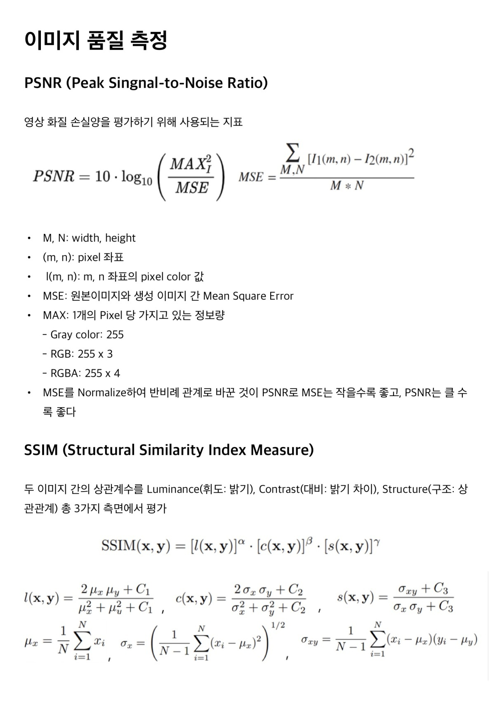
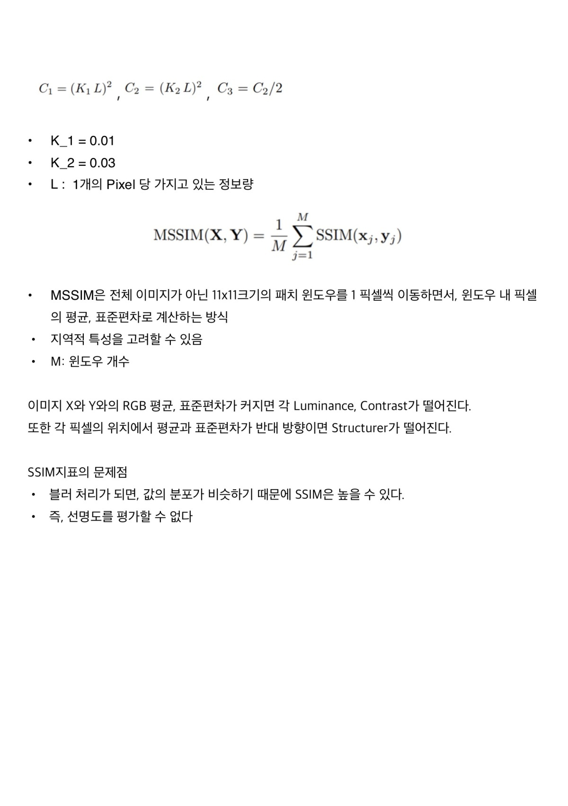

---

## Methodology

### 1. Background: Neural Radiance Field (NeRF)

NeRF에서는 3D 장면이 MLP 네트워크에 의해 Implicit 하게 표현됩니다.
이 네트워크는 5차원 좌표공간 ( 공간 위치 (x, y, z), 보는 방향 (theta, phi))를 해당 공간 위치에서 1차원 체적 밀도 (volume density)와 3차원 시점에 따른 방출 광도 (rgb)로 매핑하는 것을 학습합니다.
랜더링을 위해 NeRF에서는 전통적인 volume rendering 기법을 사용하여 방향이 지정된 광선에 대한 원하는 색상을 얻습니다.
volume rendering 은 미분 가능하므로, 캡쳐된 2D 이미지를 감독 신호로 사용하여 NeRF를 end-to-end로 학습할 수 있습니다.
신규 뷰 합성을 위해 방향이 지정된 광선이 주어지면, NeRF는 먼저 카메라 광선을 따라 몇개의 위치를 샘플링하고, MLP 네트워크를 쿼리하여 해당 위치에서의 방출 광도를 예측한 다음,
이를 알파 합성을 통해 결합하여 최종 색상을 출력합니다.
공기 중 샘플링은 최종 색상에 아무 기여를 하지 않으므로, 샘플링된 지정의 충분한 수가 NeRF 성능에 매우 중요합니다.
이는 객체 표면 근처와 같은 중요한 위치를 포함해야하기 때문입니다. 그러나 추가적인 샘플링은 MLP 네트워크의 쿼리 비용을 선형적으로 증가시킵니다.

### 2. R2L: Distilling NeRF to NeLF

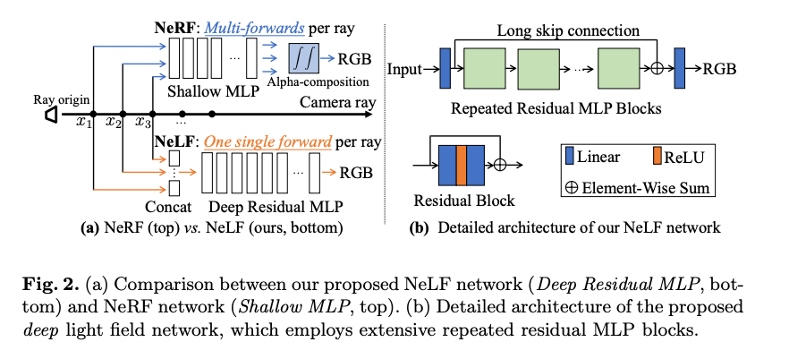

다른 한편으로, 장면은 Radiance Field 대신 Light Field로 표현될 수도 있습니다.
이는 신경망으로 매개변수화된 네트워크에 의해 특정화됩니다.
네트워크 G는 4차원 방향이 지정된 광선을 해당하는 3차원 RGB로 직접 매핑하는 함수를 학습하기 때문에, NeLF 네트워크는 NeRF에 비해 여러가지 매력적인 장점이 있습니다.

1. 방법론적으로, NeRF 네트워크의 출력은 샘플링된 점의 방사도로 원하는 색상은 추가적은 ray marching 단계를 통해 얻어져야하지만, NeLF 네트워크의 출력은 이미 원하는 색상으로 새로운 뷰 합성에 대해 훨씬 직관적입니다.
2. 실용적으로, 동일한 입력 광선(출발 좌표와 방향)이 주어진 경우, 라이트 필드에서의 렌더링은 단순히 라이트 필드 함수의 한 번의 쿼리에 해당합니다. 이는 광선을 따라 점 샘플링이 필요하지 않으므로(NeRF에서의 속도 병목점), NeRF보다 몇 배 빠를 수 있습니다.

이러한 흥미로운 특성에도 불구하고, NeLF는 NeRF 와 유사한 품질로 성공적으로 구현한 사례는 많지 않습니다. 최근에는 NeLF 방법 중 하나만 NeRF와 비교할 수 있는 품질을 달성했지만, 그 속도 향상은 상대적으로 제한적입니다. (약 5배 실행시간 향상) 이 논문에서는 NeLF를 통해 NeRF 만큼 효과적으로 만들기 위해 새로운 네트워크 아키텍처를 제안합니다. (동시에 훨씬 더 빠릅니다)

직관적으로 Radiance 필드에 비해 Light 필드를 학습하는 것은 더 어렵습니다. 물리적으로 Radiance 필드는 일반적으로 연속적이므로 이웃 공간 위치의 Radiance는 크게 변하지 않습니다. 그러나 가림막 때문에 두 개의 이웃 광선은 극명하게 다른 색상을 가리킬 수 있습니다. 즉, Light 필드는 본질적으로 Radiance 필드보다 덜 부드럽습니다. (급격하게 변화) 따라서 본질적으로 더 복잡한 Light 필드를 포착하기 위해 더 강력한 네트워크가 필요합니다.

이 아이디어에 따라 NeRF에서 사용된 11개 layer의 MLP 네트워크는 경험적 관찰에 따르면 복잡한 Light 필드를 표현하기 어렵습니다. 따라서 저자는 위에서 제시한 G 함수를 매개변수화 하기 위해 깊은 MLP 네트워크를 사용하기로 결정했습니다. 그럼으로써 가장 중요한 기술적 질문은 깊은 네트워크를 어떻게 설계할 것인가 입니다.

#### Network design

NeRF와는 다른 네크워크에서는 강력한 Residual Block을 사용하기로 제안합니다. 그 결과로 얻어지는 네트워크 아키텍처는 Fig.2 (b)애 설명되어 있습니다. Residual 연결은 매우 큰 네트워크의 깊이를 가능하게 하는데 중요하다고 입증되었으며, 이는 Light 필드 학습에도 적용됩니다. 깊은 네트워크의 장점은 실험을 통해 정당화 되었습니다. (깊은 MLP 네트워크에서 Residual connection이 사용되지 않는 경우 성능 저하) 특히 Neural Radiance/Light 필드의 매개변수화를 위해 깊은 네트워크를 활성화 하는 것은 쉽지 않습니다. DeRF 에서도 "더 큰 네트워크를 사용하는 것에는 감소하는 성과가 있다"는 말을 언급하였습니다. 따라서 주목할만한 점은 실제로 랜더링 효율성을 향상시키기 위해 대부분의 NeRF 후속 연구들은 NeRF의 MLP 아키텍처를 상속하고 있습니다. 그래서 이 논문이 중요한 것은 네트워크의 아키텍처 최적화 관점에서 처음으로 다루고 있다는 점입니다. Residual 구조 자체는 새로운 것이 아니지만, 그 필요성과 잠재력은 NVS 작업에서 완전히 인식되고 활용되지 않았습니다. 그래서 이 논문은 이 방향으로 한 걸음 나아가기 위한 것입니다.

### 3. Synthesize Pseudo Data

깊은 신경망을 강력하게 하기 위해 많은 양의 데이터를 필요로 합니다. 하지만, 소위 새로운 시점 합성에서는 사용자가 일반적으로 100장 미만의 이미지를 캡쳐하는 경우가 많습니다. 이 문제를 극복하기 위해 저자는 사전에 훈련된 NeRF 모델을 사용하여 추가적인 데이터를 합성하는 방법을 제안합니다. 이로써 저자의 방법은 Neural Radiance field로의 연결 역할을 합니다.

의사결정을 해야하는 부분은 가짜 데이터를 합성하기 위해 어디를 샘플링할지 입니다. 특히 원본 훈련 데이터 (이미지와 해당하는 카메라 포즈)로부터 카메라 위치의 bounding box와 orientation을 알 수 있습니다. training data로부터 알 수 있는 viewing bounding box 내에서 균등 분포 U를 따르는 방식으로 랜덤하게 광선 원점 (x_o, y_o, z_o)과 정규화된 방향 (x_d, y_d, z_d)을 샘플링하여 6차원 입력을 만듭니다.

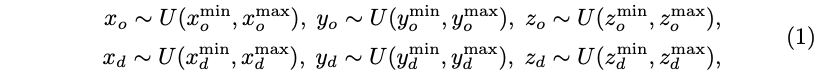

예시 설명은 부록 자료에서 확인할 수 있습니다. 주의할 점은 생성된 데이터를 제어할 수 있기 때문에, 가짜 데이터가 원래의 훈련데이터를 완전 포괄하도록 해야합니다. 이는 두 데이터가 동일한 도메인에 속한다는 것을 의미하며, 이는 성능에 매우 중요합니다.

학습된 NeRF 모델 F를 통해 RGB value를 얻습니다. 그런 다음 훈련데이터의 slice 는 이러한 9개의 숫자 벡터로 구성됩니다. (x_o, y_o, z_o, x_d, y_d, z_d, r, g, b)

효과적인 NeLF G를 얻기위해 우리는 풍부한 가짜 데이터를 제안된 깊은 R2L 네트워크에 주입하고 MSE 손실 함수로 훈련시킵니다.

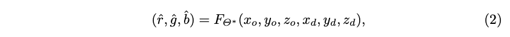

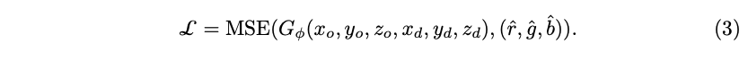

### 4. Ray Representation and Point Sampling

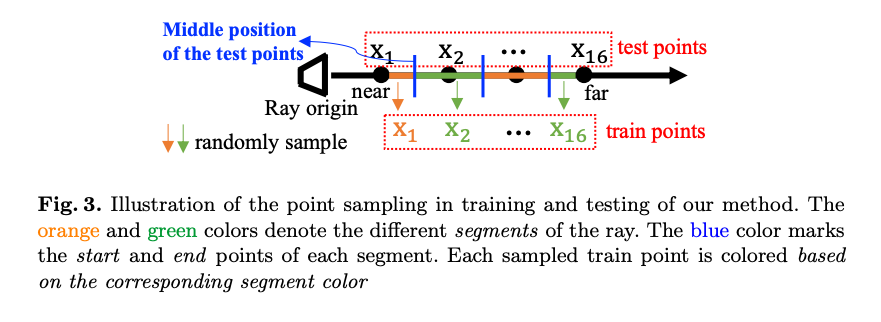

NeLF에서 Ray의 적절한 표현이 중요합니다. 이 논문에서는 새로운 간단하고 효과적인 표현 방법을 제안합니다. Ray에 따라 K개의 샘플된 점들의 공간 좌표르 ㄹ연결하여 입력 벡터 (3K-d)를 형성하고 NeLF 신경망에 주입합니다.

수학적으로는 Ray를 정의하기 위해 최소한 두개의 점이 필요합니다. 더 많은 점은 표현을 더 정밀하게 만듭니다. 본 논문에서는 레이에 따라 K=16개의 점을 선택합니다. 여기서 중요한 설계 요소는 네트워크가 K개의 점에 과적합 되지 않고 기저에 있는 Ray 정보를 포착할 수 있도록 하는 것입니다. 따라서 훈련 중 K개의 점은 Ray에 따라 NeRF에서 사용된 방식과 동일하게 Fig 3.와 같은 계층적 샘플링을 사용하여 무작위로 샘플링 됩니다.

이 설계는 일반화에 중요합니다. 테스트 중에는 K개의 점이 균등하게 분포되도록 합니다. 또한, Plucker 좌표를 사용하여 R2L 네트워크의 입력을 변경하는 실험도 진행했습니다.

이 논문의 표현은 Plucker 보다 더 나은 테스트 품질을 달성하였습니다.

### 5. Training with Hard Examples

카메라 위치와 방향을 무작위로 샘플링 하기 때문에 Ray는 장면의 사소한 부분을 가리킬 가능성이 있습니다. (예: 합성 장면의 흰 배경)

또한 훈련 중에는 쉽게 회귀할 수 있는 색상이 일찍 잘 학습됩니다. 이러한 픽셀을 다시 네트워크에 주입해도 네트워크의 지식은 거의 증가하지 않습니다. 따라서 저자는 어려운 예제의 개념을 활용하기로 제안합니다.

즉, 학습 중 회귀하기 어려운 Ray에 네트워크가 더 많은 주의를 기울이기를 원합니다 (일반적으로 고주파영역). 어려운 예제 풀을 유지하면서 어려운 예제에는 더 큰 손실을 주는 것으로 정의 합니다. 각 반복에서 batch 내 각 샘플의 손실을 오름자순으로 정렬하고 상위 r개 (사전에 정의된 비율 상수)를 어려운 예제 풀에 추가합니다. 동시에 각 반복에서 풀에서 r개의 어려운 예제가 무작위로 선택되어 훈련 batch를 보강합니다. 이러한 설계는 네트워크 수렴을 크게 가속시킬 수 있음을 실험에서 밝혔습니다.

### 6. Implementation Details

R2L을 사용하면 서로 다른 FLOPs 예산에서 서로 다른 네트워크를 얻을 수 있습니다. 본 논문에서는 주로 두가지 예산을 다루었습니다.

6M FLOPs와 12 FLOPs (per ray) 입니다. 이를 통해 여러개의 네트워크를 얻을 수 있습니다. 12M: W256D88, 6M: W181D88, W256D44, W363D22 (W는 너비를, D는 깊이를 나타냅니다)

분명히 더 큰 네트워크가 더 나은 성능을 발휘할 것으로 기대됩니다. 따라서 W256D88은 더 좋은 품질을 얻기위해 사용되었으며, 6M 예산 네트워크는 훈련속도가 더 빠르기 때문에 이 네트워크들로 실험을 하였습니다.

NeRF를 따라서 Positional Encoding이 입력정보를 보강하는 데 사용되었습니다.

## Experiments

### Datasets

- NeRF datasets

  - Realistic Synthetic 360
    - 8 objects(scene) 들에 대한 path-traced image들로 구성
    - 복잡한 기하학적 형태와 non-lambertian 재질을 갖음
      - Lambertian이란? lambertian surface는 모든 방향에서 보아도 똑같은 밝기로 보이는 표면을 뜻힌다. (표면 처리를 하지 않은 원목 등)
    - resolution: 800 x 800
    - train: 100 views of each scene, test: 200 views of each scene
  - Real Forward-Facing
    - 손으로 든 핸드폰으로 찍은 8 objects
    - 각 object 별로 20~62 image들이 있음
    - resolution: 1008 x 756
    - test: 1/8
- DONeRF datasets
  - 합성한 이미지
  - Blender과 Cycles path tracer를 이용하여 각 scene 마다 300 image 생성
  - train: 70%, val: 10%, test: 20%

### Training Settings
실제 데이터셋의 모든 이미지는 훈련 및 테스트 중에 2배로 다운샘플링 되었습니다.
제한된 공간 때문에 전체 해상도 (800x800) 결과는 부록자료에 넣었습니다.
원래의 NeRF 모델은 batch 사이즈를 1024로 설정하여 훈련되었으며 초기 학습률은 0.0005로 설정되었습니다. (훈련 중 감소)
사전 훈련된 NeRF 모델을 사용하여 10,000개의 이미지를 합성했습니다.
제안된 R2L 모델은 동일한 학습률 스케쥴로, 1,000,000번 반복 훈련되었습니다.
배치내의 Ray는 서로 다른 이미지에서 무작위로 샘플링 되어 원점을 공유하지 않도록 조정되었습니다.
이는 우수한 성능을 달성하기 위한 중요한 요소로 확인되었습니다.
모든 훈련에는 Adam 옵티마이저가 사용되었으며 Pytorch 1.9로 구현하였습니다.
실험은 8개의 NVIDIA V100 GPU로 수행되었습니다.

## Results

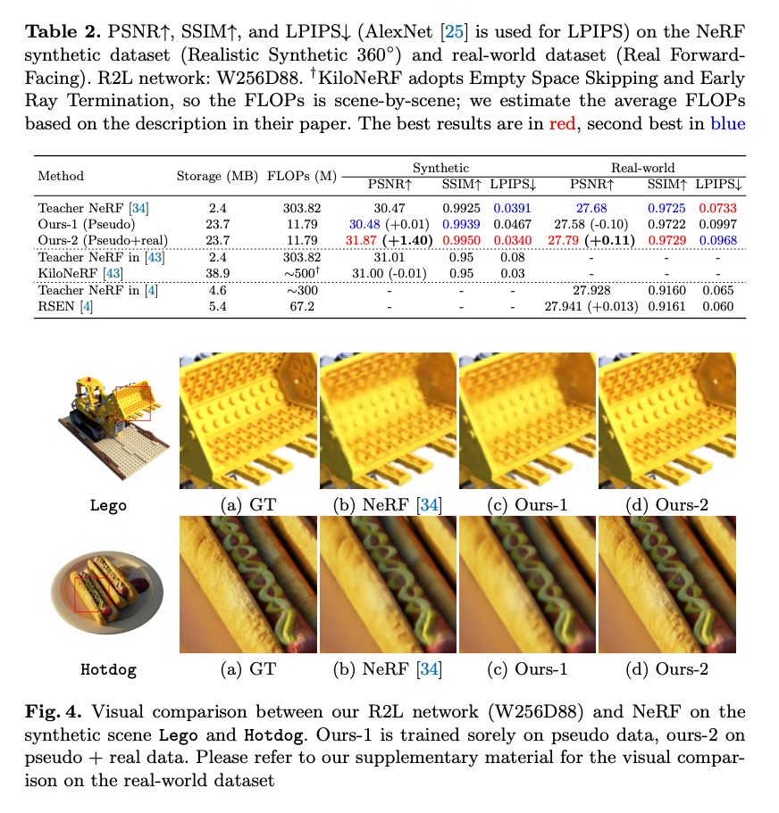  
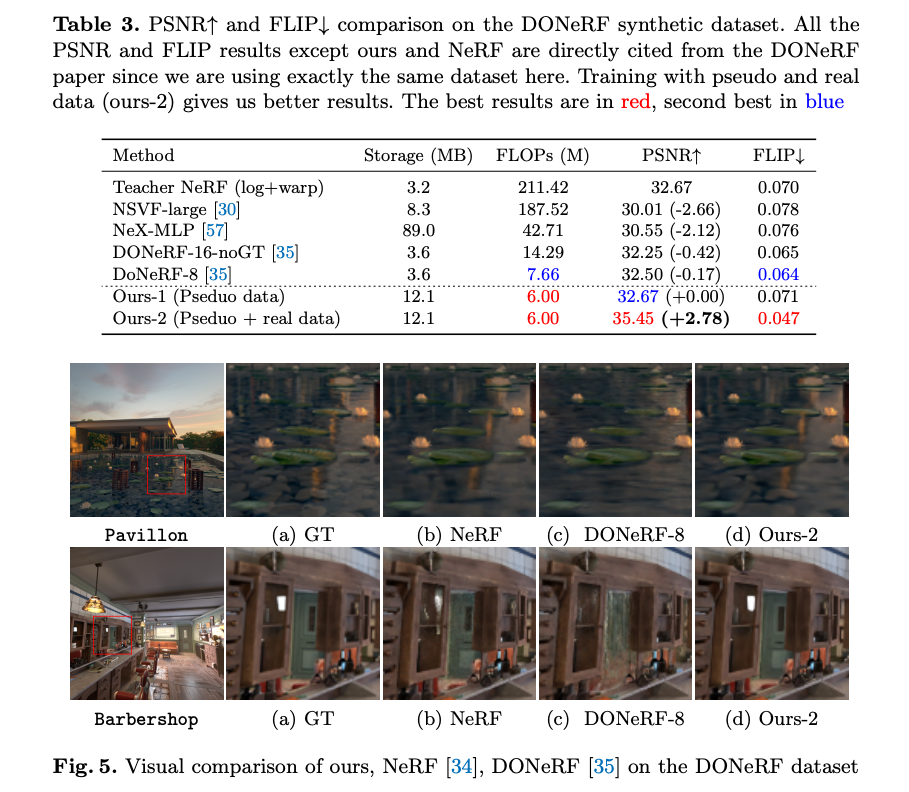  
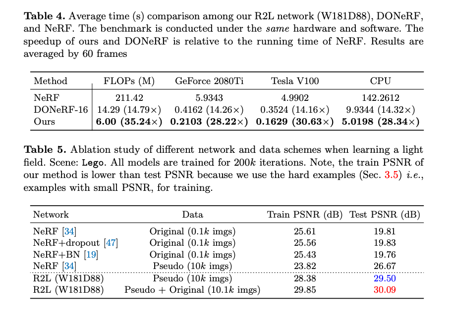  