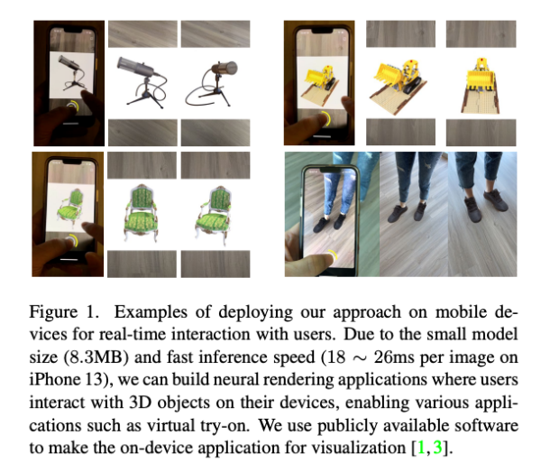
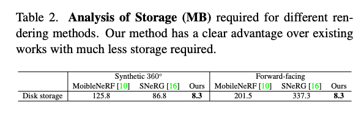

최근에는 NeRF 에 대한 연구들이 인상적인 결과를 보여주며, 암묵적인 Neural 표현을 활용하여 3D 장면을 표현함으로써 새로운 시점 합성에서 탁월한 성과를 보이고 있습니다.
그러나 NeRF의 volume rendering 과정으로 인해 추론 속도가 매우 느려져 모바일 기기와 같은 자원이 제한돈 하드웨어에서 NeRF를 활용하는 응용 시나리오가 제한됩니다.
NeRF 모델의 실행시간을 줄이기 위한 다양한 연구가 진행되어 왔지만, 대부분은 가속을 위해 고급 GPU나 추가 저장 메모리가 필요하며, 이는 모바일 기기에서 사용할 수 없습니다.
또 다른 새로운 방향으로는 NeLF를 활용하여 속도를 높이는 것인데, 여기서는 Layer당 단일 forward pass 만을 사용하여 픽셀 색상을 예측합니다.
그러나 NeRF와 유사한 랜더링 품질을 얻기 위해 NeLF의 네트워크는 계산이 많은 구조로 설계되어 모바일에 친화적이지 않습니다.
본 연구에서는 모바일 기기에서 실시간으로 작동하는 효율적인 Neural Rendering 네트워크를 제안합니다.
이 논문은 NeLF의 설정을 따라 네트워크를 훈련시켰습니다. 기존 연구와 달리, 모바일 기기에서 효율적으로 실행되는 새로운 네트워크 아키텍처를 소개하며, MobileNeRF와 비교하여
저장공간을 15배에서 24배 정도 절약합니다. 모델은 모바일 기기에서 실시간으로 합성 및 실제 세계 장면에 대한 추론을 유지하면서 고해상도 생성을 달성합니다.
예를들어 실제 3D 창면의 1008 x 756 이미지를 랜더링 하는데 Iphone 13 에서 18.04 ms가 소요됩니다.
추가적으로 NeRF와 유사한 이미지 품질을 달성하며, Realworld forward-facing dataset 에서 MobileNeRF 보다 더 우수한 품질을 보입니다. (PSNR: 26.15 vs 25.91)

[Paper Link](https://arxiv.org/pdf/2212.08057.pdf)
[Code Link](https://github.com/snap-research/MobileR2L)

## Introduction

Neural Rendering 분야에서 주목할만한 진전은 mesh, 질감 또는 재료가 필요하지 않고 다중 시점 관측으로부터 객체나 장면의 표현을 학습하는 신경망만을 필요로 한다는 것입니다. 훈련된 모델은 임의의 시점에서 쿼리 될 수 있어 새로운 시점을 생성할 수 있습니다. 이러한 흥미로운 응용프로그램이 보급되기 위해서 이런 방법들이 모바일 디바이스 같은 자원이 제한된 장치에서 실행되야 하며, 계산, 무선 연결 및 하드 드라이브 용량의 제한에 부합해야합니다.

유감스럽게도, NeRF의 인상적인 이미지 품질과 그 기능은 느린 렌더링 속도라는 대가와 함께 제공됩니다. 쿼리된 픽셀의 색상을 반환하기 위해 해당 픽셀에 도ㅓ달하는 광선을 따라 수백개의 점이 샘플링 되어 이를 통합해야합니다. 실시간 응용 프로그램을 가능하게 하기 위해 많은 연구가 제안되었지만 여전히 고성능 GPU가 필요하며, 모바일이나 엣지 장치와 같은 자원이 제한된 응용 프로그램에서는 사용할 수 없습니다. MobileNeRF 에서는 랜더링 속도와 저장 용량을 교환하는 시도가 이루어졌습니다. 약속된 가속화 결과를 보여주었지만, 해당 방법은 텍스처 저장을 위한 저장 용량을 필요로 합니다. 예를 들어, NeRF의 Real world forward facing 데이터셋에서 단일 실제 세계 장면의 경우 MobileNeRF는 201.5 MB의 저장용량을 필요로 합니다. 분명히 MobileNeRF 형식으로 수십 ~ 수천개의 장면을 디바이스에 다운로드 하고 저정하는 것은 막대한 비용이 들게됩니다.

Neural Light Fields (NeLF)는 다은 접근 방식을 취하여 한 광선을 RGB 픽셀 색상에 직접 매핑합으로써 한 번의 순방향 패스 만으로도 신속한 렌더링 속도를 구현합니다. NeLF를 훈련시키는 것은 도전적이며, 따라서, 높은 네트워크 용량을 필요로 합니다. 예를 들어, 사전 훈련된 Raadiance model을 효과적으로 요약하기 위해 Residual 연결을 가진 88-layer의 FC network를 제안하였습니다. 그들의 방법은 30배의 가속화로 일반 NeRF 보다 더 좋은 렌더링 결과를 얻었지만, iPhone 13 에서 200x200 이미지를 랜더링 하는데 3초가 갈리므로 모바일 장치에서 실행하는 것은 여전히 불가능합니다.

이 연구에서는 모바일 장치를 고려하여 개발된 실시간 Neural Rendering 모델인 Mobile R2L 을 제안합니다. 훈련은 R2L 에서 도입된 유사한 Distillation 절차를 따릅니다. 그러나 대부분의 Neural representation 에서 사용되는 MLP 백본 네트워크 대신 Convolution 네트워크를 사용하여 MLP와 유사한 렌더링 품질을 가진 실시간 속도를 달성할 수 있다는 것을 보여줍니다. 특히, R2L 에서 이루어진 네트워크 설계 선택하항을 재검토하고, 백본에서 1x1 conv 레이어를 사용하는 것을 제안합니다.

NeRF나 NeLF 를 모바일 장치에서 실행하는 또 다른 과제는 과도한 RAM 요구입니다. 예를들어 800x800 이미지를 렌더링 하기 위해 640,000개의 광선을 샘플링해야하며, 이는 메모리 부족 문제를 일으킵니다. 3D-aware 생성모델 에서는 이문제를 해결하기 위해 방사도 특성 볼륨을 랜더링하고 합성곱 네트워크를 사용하여 더 높은 해상도를 얻는 방식을 채택합니다. 저자는 이를 착안하여 필요한 해다상도로 업샘플링되는 light field 볼륨을 랜더링합니다. MobileR2L 은 기존 작업들과 비교하여 몇 가지 주요한 장점을 가지고 있습니다.

- MobileR2L은 모바일 장치에서 실시간 추론 속도를 달성하며, MobileNeRF에 비해 더 나은 랜더링 품질을 가지고 있습니다.
- MobileR2L은 저장 공간 요구를 한 차원 낮추어 모델 크기를 8.3MB로 줄였습니다. 이는 MobileNeRF 보다 15.2 ~ 24.3배 작은 크기입니다.

이러한 기여로 인해 MobileR2L은 실시간 상호작용이 가능한 모바일 장치에서의 virtual try-on 과 같은 실제 응용프로그램에서 Neural Rendering의 광범위한 채택을 가능하게 할 수 있습니다.

## Methodology

### Prerequisites: NeRF and R2L

#### NeRF

장면을 암묵적으로 표현하기 위해 MLP 네트워크 F를 사용합니다. 이 네트워크는 5차원 좌표인 공간위치 (x, y, z)와 시점방향 (theta, phi)를 1차원 볼륨 밀도 (불투명도, sigma)와 3차원 광도 (컬러, c) 로 매핑합니다. 따라서 F: R^5 -> R^4 입니다. 이미지의 각 픽셀은 카메라 광선과 관련있습니다. 픽셀의 색상 C를 예측하기 위해 NeRF 방법은 카메라 광선 상에 많은 점 (N개)을 샘플링하고, 이러한 점들의 광도 c를 알파 compositing을 통해 누적합니다.

여기서 r은 camera ray로 r(t_i) = o + t_i * d 를 나타내며, o는 origin, d는 direction, t_i는 point와 origin간의 Euclidean 거리를 뜻힌다. delta_i는 t_(i+1)과 t_i간의 거리를 뜻한다.

NeRF는 Eqn (1) 에서 t_i를 샘플링하기 위해 계층 샘플링 접근 방식을 사용합니다. 입력 정보를 보강하기 위해 위치와 방향좌표는 Positional Encoding을 통해 인코딩됩니다. 이는 sin, cos 함수를 통해 스칼라 R을 고차원 공간 R^(2L+1)으로 매핑합니다. L은 미리 정의된 상수로 위치 좌표에 대해서는 L=10, 방향 좌표에 대해서는 L=4를 사용하였습니다.

NeRF의 전체 공식 및 훈련은 직관적입니다. NeRF에서 빠른 추론을 방해하는 중요한 문제 중 하나는 Eqn (1)에서 샘플링된 점의 수 N가 매우 크다는 점입니다. (원래 NeRF 논문에서 두 단계의 coarse-to-fine 설계로 인해 256) 따라서 심지어 하나의 픽셀에 대한 랜더링 계산은 매우 무거워집니다. R2L 에서 제안한 해결책은 NeRF 표현을 NeLF로 압축하는 것입니다.

#### R2L

NeLF 함수는 기본적으로 방향이 지정된 광선을 RGB로 맵핑합니다. 입력 정보를 보강하기 위해, R2L은 새로운 광선 표현 방법을 제안합니다. NeRF와 마찬가지로 광선을 따라 점들을 샘플링 하지만, 이러한 점들을 하나의 벡터로 연결하여 광선표현으로 사용하고, RGB를 학습하기 위해 신경망에 입력합니다. NeRF와 마찬가지로 R2L 에서도 각 스칼라 좌표를 고차원 공간에 매핑하기 위해 Positional 인코딩이 채택됩니다. 훈련 중에는 점들이 Uniform Distribution을 따라 무작위로 샘플링되고, 테스트 중에는 점들이 고정됩니다.

R2L 모델의 출력은 직접적으로 RGB이며 학습된 밀도는 없으며, 추가적인 알파 compositing 단계도 없으므로 NeRF 보다 훨씬 빠른 랜더링 속도를 제공합니다. NeLF 프레임워크의 단점은 R2L 에서 보여주듯이 NeRF 보다 학습이 훨씬 어렵다는 것입니다. 따라서, R2L은 매핑 함수로 사용하기 위해 NeRF 보다 훨씬 깊은 88-layer의 ResMLP 아키텍처를 제안합니다.

R2L 훈련은 두 단계로 이루어집니다. 첫번째 단계에서는 사전 훈련된 NeRF 모델을 선생님으로 사용하여 (원점, 방향, RGB) 쌍을 가진 가상 데이터를 합성합니다. 그런 다음 이 가상 데이터를 사용하여 깊은 ResMLP를 훈련시킵니다. 이 단계를 통해 R2L 모델은 Teacher NeRF 모델과 유사한 성능을 달성할 수 있습니다. 두번째 단계에서는 첫번째 단계에서 얻은 R2L 네트워크를 원본 데이터에 대해 세밀하게 조정합니다. 이 단계는 R2L 작업에서 보여주듯 랜더링 품질을 더욱 향상시킬 수 있습니다.

### MobileR2L

#### Overview

이 논문은 R2L 학습 과정을 따라 MobileR2L을 훈련시킵니다. 즉, 사전 훈련된 NeRF와 같은 선생님 모델을 사용하여 훈련에 필요한 Pseudo 데이터를 생성합니다. 추론 속도를 줄이기 위해 이미지 랜더링 시에는 네트워크를 한번만 통과시키기를 목표로합니다. 그러나 R2L 의 디자인에 따르면 한 픽셀은 한번의 네트워크 전파만을 필요로 하지만 800x800과 같이 큰 공간 크기의 빛선을 네트워크에 직접 입력 하면 메모리 문제가 발생합니다. 따라서 R2L은 매번 일부의 빛선만 전달하여ㅓ 속도 부하를 증가시킵니다. 이 문제를 해결하기 위해 저자는 super-resolution module을 도입했는데, 이 모듈은 저해상도 입력, 예를들어 100x100를 고해상도 이미지로 업샘플링합니다. 따라서 추론 시에는 네트워크를 한번만 통과하여 고해상도 이미지를 얻을 수 있습니다. 훈련 및 추론 파이프라인은 Fig (2)에 나와있으며, 네트워크 아키텍처에 대한 자세한 내용은 아래에서 소개합니다.

#### Network Architectures

input ray x는 (B, 6, H, W) dimension 을 가지고 있다. B는 batch size, H는 height, W는 width, ray의 origin과 direction은 x의 두번째 차원에 연결됩니다. x에 대해서 positional encoding gamma를 적용하여 ray의 origin과 direction을 더 높은 차원으로 맵핑합니다. 따라서 저자의 신경망 입력은 gamma(x) 입니다.

이 신경망은 두 가지 주요부분으로 구성되어 있습니다. 효율적인 백본과 고해상도 랜더링을 위해 Super resolution 모듈로 구성되어 있으며, 그 아키텍처는 Fig (3)에 제공됩니다. 기존 연구들에서 사용되는 Fully connected 또는 Linear layer 대신에, 백본과 SR 모듈에서 Convolution layer 만을 적용합니다.

.

FC 레이어를 CONV 레이어로 대체하는 이유는 두가지 입니다.

첫째, 컴파일러에 의해 CONV 레이어가 FC 레이어보다 더 잘 최적화되기 떄문입니다. 동일한 파라미터 수로 CONV 1x1 모델은 FC 레이어를 사용하는 모델보다 약 27% 정도 더 빠르게 실행됩니다.

둘째, 백본에서 FC를 사용하는 경우 FC의 출력 feature 의 차원을 CONV 레이어와 호환되도록 수정하기 위해 추가적은 ReShape 및 Permute 연산이 필요합니다. 왜냐면 FC와 CONV는 다린 텐서 차원을 계산하기 떄문입니다. 그러나 이러한 Reshape, Permute 연산은 일부 모바일 기기에서 하드웨어 친화적이지 않을 수 있습니다. 네트워크에서 연산자로 CONV를 사용함으로써 저자는 백본과 SR에 대해 더 자세한 내용을 제시할 수 있습니다.

##### Efficient Backbone

백본의 아키텍처는 R2L의 Residual Block 디자인을 따릅니다. R2L 과는 달리 각 Residual Block 에서 FC 레이어 대신 Conv 레이어를 채택합니다. Conv 레이어는 kernel size와 stride를 1로 가지고 있습니다. 또한, 각 Residual block에 정규화 및 활성화 함수를 사용하여 네트워크 성능을 향상시킬 수 있습니다. 이를 통해 latency overhead 를 도입하지 않고도 네트워크 성능을 향상시킬 수 있습니다. 정규화 및 활성 함수로는 Batch Normalization과 GeLU를 선택했습니다. 백본은 총 60개의 CONV 레이어로 구성되어 있습니다.

##### Super-Resolution Modules

모바일 장치에서 Neural Rendering 을 실행할 때 Latency를 줄이기 위해 저자는 합성 이미지를 얻기위해 신경망을 한번만 전파하는 것을 목표로 합니다. 그러나 기존의 Neural light field 네트워크 디자인은 고해상도 이미지를 랜더링하기 위해 큰 메모리를 요구하여 모바일 장치의 메모리 제약을 초과합니다. 예를들어 800x800 이미지를 랜더링 하기 위해서는 640,000개의 광선을 예측해야합니다. R2L 의 네트워크를 사용하여 이러한 광선을 한번에 전파하면 Nvidia Tesla A100 GPU (40G memory) 에서도 메모리 부족 문제가 발생합니다.

고해상도 생성을 위한 메모리 및 지연시간 비용을 줄이기 위해, 픽셀 수와 같은 광선 수를 전파하는 대신 일부 광선만 전파하고 Super Resolution을 통해 모든 픽셀을 학습합니다. 구체적으로 효율적인 백본에 이어 SR 모듈을 사용하여 출력을 고해상도 이미지로 업샘플링합니다.

예를들어 800x800 이미지를 생성하기 위해 공간 크기가 100x100 인 4D 텐서 x를 네트워크에 전달하고 출력은 백본에서 3번의 upsampling을 (각각 2배로)합니다. SR 모듈에는 두 개의 stacked residual block이 포함되어 있습니다. 첫번째 블록에는 2D transpose conv layer 하나와 conv 1x1 레이어 두 개가 포함되어 있으며, 두번째 블록에는 Conv 1x1 레이어 두개가 포함되어 있습니다. SR 모듈 이후에는 또 다른 CONV 레이어와 Sigmoid 활성 함수를 적용하여 최종 RGB 컬러를 예측합니다.

저자의 모델은 D60-SR3로 표기되며, 효율적인 백본에 60개의 CONV 레이어와 3개의 SR 모듈이 포함되어 있습니다.

## Experiments

### Datasets

주로 realistic synthetic 360과 real-world forward - facing 데이터셋에서 비교를 수행합니다. synthetic 360 데이터셋은 8개의 path-traced 장면을 포함하며, 각 장면에는 훈련을 위한 100개의 이미지와 테스트를 위한 200개의 이미지가 포함됩니다. forward-facing 데이터셋은 휴대폰으로 촬영된 8개의 현실 세계 장면을 포함하며, 각 장면의 이미지 수는 20 ~ 60 장 까지 다양하며, 1/8 이미지가 테스트에 사용됩니다.

synthetic 360 의 경우 800x800 의 해상도에서 실험을 진행하며, forward - facing 데이터셋의 경우 원래 해상도에서 4배로 축소된 1008 x 756 에서 진행합니다.

### Implementation Details.

R2L의 훈련방법을 따르며, teacher model을 사용하여 MobileR2L 네트워크의 훈련을 위한 가짜 이미지를 렌더링합니다. 구체적으로, 각 장면에서 사전 훈련된 teacher model로부터, 10,000개의 가짜 이미지를 합성합니다. 저자는 먼저 생성된 가짜 데이터로 MobileR2L을 훈련시키고, 그 다음 실제 데이터로 세밀하게 조정하였습니다. 이는 Fig (2)에 나와있습니다. 모든 실험에서 저자는 학습률이 0.0005에서 점차 감소하는 방법과 Adam 옵티마이저를 사용하였습니다. 실험은 Nvidia V100 및 A100 GPU 클러스터에서 진행되었으며, synthetic 360 데이터셋에서는 batch 크기를 54로, forward - facing 데이터셋에서는 36으로 조정하였습니다.

R2L 과는 달리, 저자의 접근 방식에서 입력 광선과 출력된 이미지의 공간 크기는 다릅니다. teacher model에 의해 생성된 고해상도 이미지마다, 카메라 원점과 방향은 고해상도 이미지와 동일하지만, 초점길이는 상응하는 대로 축소된 낮은 해상도 이미지에 해당가는 입력 광선을 저장합니다. 또한 R2L과는 달리 이미지 별로 광선을 샘플링하지 않습니다. 대신 각 훈련 샘플의 광선은 동일한 원점을 공유하며, 공간적 위치를 보존합니다.

synthetic 360 과 forward - facing 데이터의 해상도가 다르기 떄문에, 두 데이터셋의 입력 공간 크기는 약간 다릅니다. synthetic 360 데이터셋에서는 네트워크가 100x100 공간의 크기를 가진 입력을 사용하며, 8배로 업샘플링하여 800x800 RGB 이미지를 랜더링합니다. 반면 forward - facing 데이터셋에서는 84x63 의 공간 크기를 사용하며, 12배 업샘플링하여 1008x756 이미지를 랜더링합니다. 마지막 transposed conv 레이어에서 커널 크기와 패딩을 조정하여 8배와 12배의 업샘플링을 달성합니다.

모든 모델들은 200K 번 iteration 하여 학습하였다.

R2L은 레이에 따라 K개의 3D 점을 샘플링하고, 각 점은 L개의 위치 좌표로 위치 인코딩을 통해 더 높은 차원으로 매핑됩니다. R2L은 K = 16 및 L = 10을 설정하여 1,008 차원의 벡터를 생성합니다. MobileR2L에서는 모델의 크기와 지연시간을 고려하여 K=8, L=6을 선택하였습니다. 따라서 각 레이 당 차원은 312가 됩니다. 이 모델은 100 × 100으로 표시됩니다.

### Comparison

