신경 그래픽 기본 요소는 완전히 연결된 신경망에 의해 매개변수화되며 이를 훈련하고 평가하는 데에는 비용이 많이 들 수 있습니다. 저자는 이 비용을 줄이기 위해 다양한 새로운 입력 인코딩을 사용합니다. 이 인코딩은 작은 네트워크를 사용하면서도 품질을 희생하지 않도록 허용하므로, 부동 소수점 연산과 메모리 액세스 작업의 수를 크게 줄일 수 있습니다. 작은 신경망은 학습 가능한 피처 벡터의 다중 해상도 해시 테이블로 보강됩니다. 이 피처 벡터의 값은 확률적 경사 하강법을 통해 최적화됩니다. 다중 해상도 구조를 사용하여 네트워크는 해시 충돌을 해소할 수 있어 간단한 아키텍처가 되며, 이는 현대적인 GPU에서 쉽게 병렬화할 수 있습니다. 우리는 이 병렬성을 활용하기 위해 완전히 퓨즈된 CUDA 커널을 사용하여 전체 시스템을 구현하였습니다. 이때 낭비되는 대역폭과 계산 작업을 최소화하는 데 중점을 두었습니다. 이를 통해 몇 가지 수준의 성능 향상을 달성하여, 고품질 신경 그래픽 기본 요소의 훈련을 몇 초 안에 수행하고, 1920×1080 해상도에서 몇 십 ms 안에 렌더링할 수 있게 되었습니다.

[Paper Link](https://arxiv.org/pdf/2201.05989.pdf)  
[Code Link](https://github.com/NVlabs/instant-ngp)  

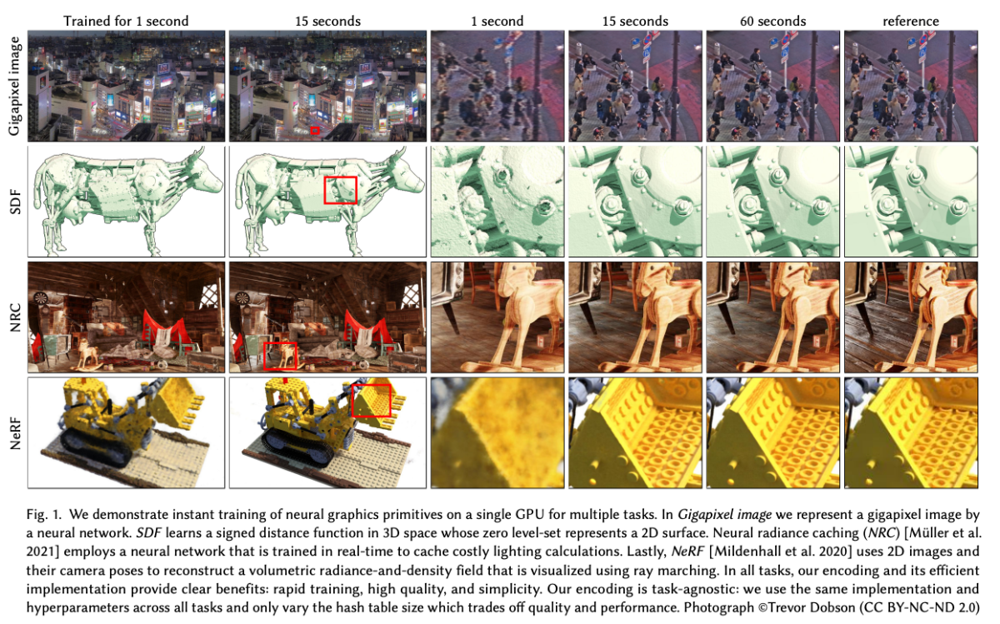

## BACKGROUND AND RELATED WORK

머신 러닝 모델의 입력을 고차원 공간에 인코딩하는 초기 예시로는 One-Hot 인코딩과 Kernel Trick이 포함됩니다. 이를 통해 데이터의 복잡한 배열을 선형으로 분리할 수 있습니다. 신경망의 경우 입력 인코딩은 Recurrent 아키텍처의 Attention 구성 요소 및 이후 Transformers 에서 유용하게 사용되었습니다. 이들은 신경망이 현재 처리 중인 위치를 식별하는 데 도움이 됩니다.

컴퓨터 그래픽스 분야에 채택된 스칼라 위치 x를 L Sine 및 Cosine 함수의 multi-resolution 시퀀스로 인코딩하는 방법이 있습니다.

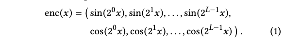

이 개념은 NeRF 알고리즘에서 시공간 방향적으로 다양한 라이트 필드와 부피 밀도를 인코딩하는 데 채택되었습니다. 이 라이트 필드의 다섯 차원(x, y, z, theta, phi)은 위의 공식을 독립적으로 사용하여 인코딩되었습니다. 이를 통해 좌표의 미세한 변화에도 많은 차이를 갖는 input 값으로 변환하여 Network가 더 정밀하고 복잡한 정보를 표현할 수 있게 할 수 있습니다. 이후에는 randomly oriented parallel wavefronts와 level-of-detail filtering으로 확장되었습니다.

우리는 이러한 인코딩 패밀리를 Frequency Encoding이라고 부를 것입니다.

### Parametric encodings

최근에는 고전적인 데이터 구조와 신경 접근 사이의 경계를 흐린 Parametric Encoding에 의해 최첨단 결과가 달성되었습니다. 이 아이디어는 추가 훈련 가능한 매개변수를 보조 데이터 구조에 배치하는 것입니다. 이러한 보조 데이터 구조로는 Grid나 Tree가 포함됩니다. 그리고 입력 벡터 x에 따라 이러한 Parameter를 조회하고 (선택적으로) 보간할 수 있습니다. 이러한 배치는 더 큰 메모리 사용을 더 작은 계산 비용으로 교환합니다.

네트워크를 통해 역전파되는 각 기울기에 대해 완전 연결 MLP 네트워크의 모든 가중치를 업데이트해야 하는 반면, 훈련 가능한 입력 인코딩 parameter("feature vector")의 경우에는 아주 적은 수만 영향을 받습니다.

예를 들어, 선형으로 보간된 3D 그리드의 Feature vector의 경우, 인코딩에 역전파된 각 샘플에 대해 업데이트해야 할 그리드 포인트는 단 8개뿐입니다.

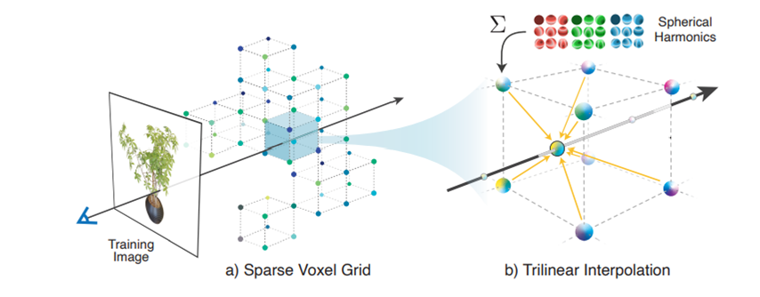

이 방식으로 매개변수 인코딩의 전체 매개변수 수는 고정된 입력 인코딩보다 훨씬 높지만, 훈련 중 업데이트에 필요한 FLOP 및 메모리 액세스 수는 크게 증가하지 않습니다. MLP의 크기를 줄이면 이러한 매개변수 모델을 일반적으로 근사 품질을 희생하지 않고 훨씬 빠르게 수렴시킬 수 있습니다. 이러한 이유는 Parametric Encoding 에서는 딥러닝 네트워크와 다르게 각 파라미터들이 공간적 상관관계를 내포하기 있기 때문입니다.

### Sparse parametric encodings

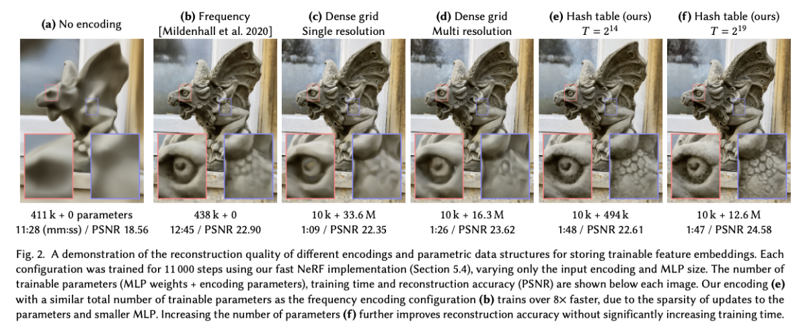

기존의 매개변수 인코딩은 비매개변수 모델보다 훨씬 더 높은 정확도를 제공하는 경향이 있지만, 효율성과 다양성 측면에서도 단점이 있습니다. 훈련 가능한 피처의 밀집 그리드는 신경망 가중치보다 훨씬 더 많은 메모리를 소비합니다. 이러한 트레이드오프를 설명하고 저자의 방법을 독려하기 위해 Figure 2는 여러 다른 인코딩에 대한 신경 방사형 필드의 재구성 품질에 미치는 영향을 보여줍니다.

입력 인코딩이 전혀 없는 경우 (a)에는 네트워크가 위치의 꽤 부드러운 함수만 학습할 수 있으며 결과적으로 라이트 필드의 부정확한 근사값을 생성합니다. 주파수 인코딩 (b)은 동일한 크기의 네트워크 (8개의 은닉 계층, 각각 256개의 노드)로 장면을 더 정확하게 나타낼 수 있게 해줍니다. 중간 이미지 (c)는 작은 네트워크와 128^3개의 조밀한 그리드를 짝지어 사용하는데, 이 그리드는 선형 보간된 16차원 피처 벡터를 가지며 총 3360만개의 훈련 가능한 매개변수가 있습니다. 많은 훈련 가능한 매개변수는 각 샘플이 8개의 그리드 포인트에만 영향을 주므로 효율적으로 업데이트될 수 있습니다. 그러나 밀집한 그리드는 두 가지 측면에서 낭비적입니다.

첫째, 그리드는 빈 공간 영역과 표면 근처 영역 모두에 동일한 수의 피처를 할당합니다. 매개변수의 수는 O(N^3)으로 증가하는 반면, 관심 대상인 가시적 표면의 표면적은 O(N^2)로만 증가합니다. 이 예에서 그리드의 해상도는 128^3이지만 그 중 보이는 표면에 닿는 셀은 53,807개 (2.57%) 뿐입니다.

두 번째로, 자연 장면은 부드러움을 보이며, 이는 다중 해상도 Decomposition 사용을 권장합니다. Figure 2 (d)는 보간된 피처가 16^3부터 173^3까지의 해상도를 가진 여덟 개의 동일한 위치의 그리드에 저장되어 있는 인코딩을 사용한 결과를 보여줍니다. 각 그리드에는 2차원 피처 벡터가 들어 있습니다. 이러한 벡터들은 연결되어 16차원 (c와 동일) 입력으로 네트워크에 공급됩니다. (c)와 비교해 매개변수 수가 절반 미만이더라도 재구성 품질은 유사합니다.

만약 관심 표면이 사전에 알려져 있다면, octree나 sparse grid와 같은 데이터 구조를 사용하여 밀집 그리드에서 사용하지 않는 피처를 제거할 수 있습니다. 그러나 NeRF 환경에서는 표면이 훈련 중에만 나타납니다. 아래 그림과 같은 NSVF [Liu 등 2020] 작업은 특성 그리드의 영역을 점진적으로 세밀하게 개선하고 필요한 경우 제거하는 다단계 과정의 전략을 채택합니다. 이는 효과적이지만 희소한 데이터 구조가 주기적으로 업데이트되어야 하는 더 복잡한 훈련 과정을 이끌어내게 됩니다.

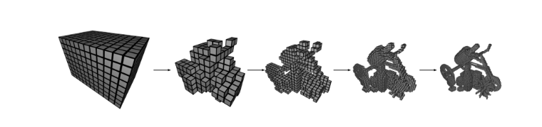

저자의 방법 Figure 2 (e, f)은 두 가지 아이디어를 결합하여 낭비를 줄입니다. 훈련 가능한 피처 벡터를 조밀한 공간 해시 테이블에 저장합니다. 특정 좌표의 위치 정보를 종합하여 하나의 해시 테이블 인덱스로 매핑합니다. 이 해시 테이블의 크기는 매개변수 T로, 매개변수의 수를 재구성 품질과 교환하는 데 사용할 수 있는 하이퍼파라미터입니다. 이는 훈련 중에 점진적으로 가지치기하거나 장면의 기하학적 지식에 의존하지 않습니다. (d)의 다중 해상도 그리드와 유사하게, 우리는 서로 다른 해상도에서 인덱싱된 여러 개의 별도 해시 테이블을 사용하며, 이들의 보간된 출력은 MLP를 통과하기 전에 연결됩니다. 재구성 품질은 밀집 그리드 인코딩과 비슷하며, 매개변수 수는 20배 적습니다.

3D 재구성을 위해 공간 해싱을 사용한 이전 연구와 달리, 저자는 탐사, 버킷화 또는 체이닝과 같은 전형적인 방법으로 해시 함수의 충돌을 명시적으로 처리하지 않습니다. 대신 신경망이 해시 충돌을 스스로 해소하는 것을 학습하도록 의존하며, 이는 제어 흐름 분기를 피하고 구현 복잡성을 줄이며 성능을 향상시킵니다. 다른 성능 이점은 데이터를 나타내는 데 독립적인 예측 가능한 메모리 레이아웃입니다. 좋은 캐싱 동작은 종종 트리 형태의 데이터 구조로는 어렵지만, 저자의 해시 테이블은 캐시 크기와 같은 저수준 아키텍처 세부 정보에 맞게 조정될 수 있습니다.

## MULTIRESOLUTION HASH ENCODING

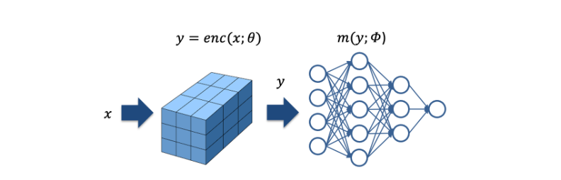

완전 연결된 신경망 m(y; phi)가 주어졌을 때, 저자는 입력의 parametric 인코딩인 y = enc(x; theta)에 관심이 있습니다. 이는 다양한 응용 프로그램에서 광범위하게 개선된 근사 품질과 훈련 속도를 제공하면서 주요한 성능 부하를 발생시키지 않습니다. 저자의 신경망은 훈련 가능한 가중치 매개변수 phi뿐만 아니라 훈련 가능한 인코딩 매개변수 theta도 가지고 있습니다. 이들은 L 수준으로 배열되며, 각 수준은 최대 T 차원의 F 피처 벡터를 포함합니다.

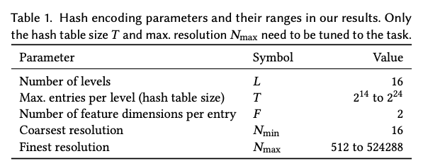

이러한 하이퍼파라미터의 일반적인 값은 표 1에 나와 있습니다.

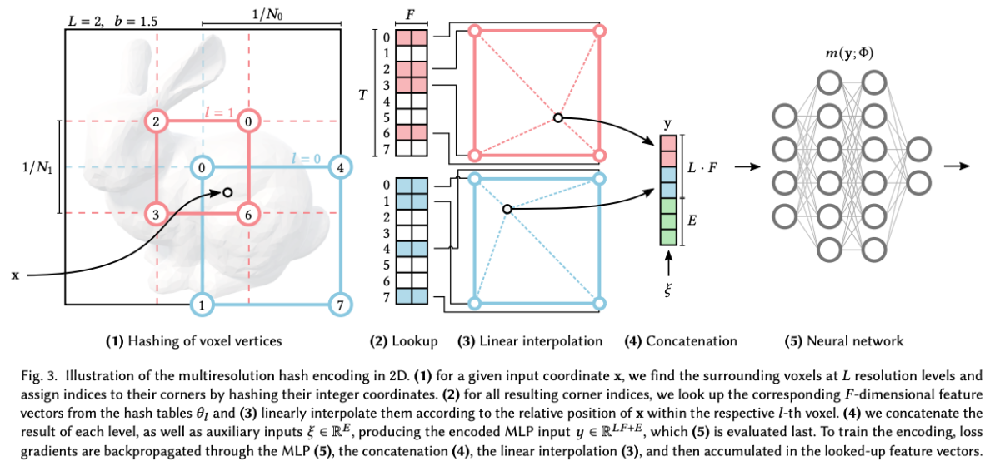

Figure 3은 저자의 다중 해상도 해시 인코딩에서 수행되는 단계를 설명합니다.

1. Grid 정의

학습하고자 하는 장면 상의 좌표를 Grid로 생각하고, 이 Grid를 L개 (Level 수) 정의합니다. 그리고 각 Grid는 고유의 Resolution을 갖고 있습니다. 여기서 할당되는 좌표인 x는 3D (d=3) 벡터이지만 편의상 2D (d=2)로 표현하였다.

위 예시에서는 Grid를 L=2로 2개 정의하였습니다. 파란색 Grid는 2x2로 정의한 더 낮은 level (l=0) 이며, 2등분 되어 있으므로 N_0 = 2 입니다. 빨간색 Grid는 3x3로 정의한 더 높은 level (l=1) 이며, 3등분 되어 있으므로 N_1 = 3 입니다.

N_min, N_max는 Grid의 Resolution 최대, 최소를 나타냅니다. 이를 통해 l번째 레벨의 resolution N_l을 지정합니다.

예시에서 N_min = 2, N_max = 3 이고, b=1.5 입니다.

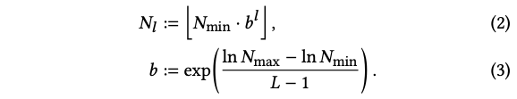

2. Hash Table 할당

각 level에는 Hash Table이 하나씩 할당됩니다. 해시 테이블의 각 인덱스에는 feature vector가 할당되고, feature vector는 Encoding의 parameter로 back-propagation으로 학습됩니다. 위 그림 예시에서 Hash table size T = 7이고, 각 테이블 칸에 위치하는 feature vector의 크기가 2이므로 F=2 입니다.

3. Scene 좌표를 해시 테이블의 index로 맵핑

input으로 주어지는 점 x가 있습니다. 먼저 이 x는 해당 grid level의 resolution으로 scaled 됩니다. 각 level별로 점 x를 둘러싸는 격자상의 좌표로 치환됩니다. 2D scene 이면 4개의 좌표를, 3D scene 이면 8개의 좌표를 얻게 됩니다. 여기서 격자상의 좌표는 해시 함수에 통과된 이후 얻을 수 있는 해시 테이블의 인덱스 입니다. 위의 예시에서 점 x는 파란색 level=0 에서 점 x는 둘러싸는 (0, 4, 1, 7)번 좌표로 치환됩니다. 빨간색 level=1에서 점 x는 둘러싸는 (0, 2, 3, 6)으로 치환됩니다. 이때 사용된 Spatial Hash Function은 아래와 같습니다.

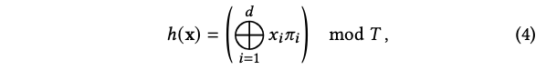

+ +연산: bitwise XOR
+ d: dimension
+ pi: dimension 마다 임의로 정해둔 실수 값
+ T: Hash table size

4. Feature Vector Interpolation

점 x의 각 level 별로 격자 상의 4개의 좌표와의 거리를 기반으로 Feature vector를 weighted sum하여, 단계 (4)의 Feature vector를 구합니다 (Linear Interpolation). 이 과정을 통해서 각 level 별로 F 크기의 feature vector 하나를 얻을 수 있습니다.

5. 모든 Level의 feature vector를 연결하여 MLP 입력값으로 만들기

여러 Level의 interpolated 된 feature vector를 연결하고, Viewing direction 정보도 함께 연결하여 MLP의 input으로 사용합니다.

학습시에는 MLP weight가 업데이트 되며, 추가로 Hash Table의 Value가 업데이트 됩니다.

- Hyperparameter 값 설정

해시테이블 사이즈 T는 경험적인 방법으로 실험을 통해 가장 적절한 값을 찾았습니다. T 값을 증가시키면, NeRF 에서 중간 뷰 합성 시 PSNR값이 올라가지만, 2^19 기점으로 얻는 이득 대비 지나치게 학습시간이 늘어나는 문제를 보입니다.

F와 L 또한 실험적인 방법으로 적절한 값을 찾았는데 L=16, F=2 일때 가장 좋았습니다.

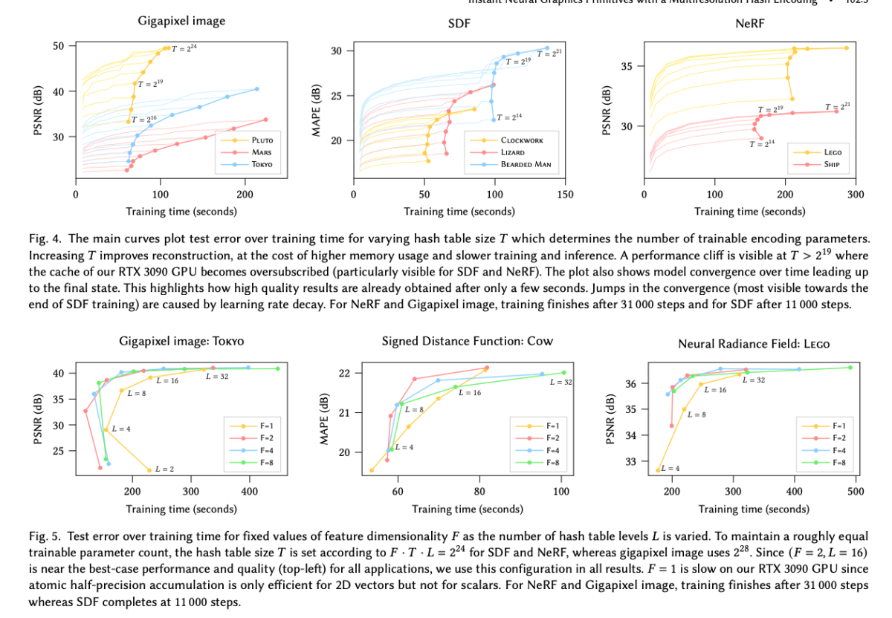

### Implicit hash collision resolution.

가까이 있는 좌표간에는 Collision이 발생하지 않습니다. 전체 공간에 걸쳐 랜덤하게 Collision이 발생하고, 통계적으로 같은 Level 에서 Collision이 발생할 확률은 낮습니다.

학습 단계에서 Collision이 발생할때, 중요한 Point들은 Gradient 기여량이 많아지면서, Collision이 발생한 경우 중요한 point들의 기울기가 collision 평균을 지배하며, 자연스럽게 더 높은 가중치를 가진 점의 요구사항을 반영하도록 최적화 됩니다. 즉, surface 영역의 Entry는 많은 변화를 만들고, empty 영역의 Entry는 적은 변화를 만들어 냅니다.

추가로 Coarse level의 경우 Hash Table 보다 크기가 적을 경우 1:1 mapping 이 되면서 충돌이 발생하지 않습니다.

### Online adaptivity.

입력 x의 분포가 훈련 중에 시간에 따라 변화한다면, 예를 들어 입력이 작은 영역에 집중되면 더 미세한 그리드 수준에서는 충돌이 적게 발생하며 더 정확한 함수를 학습할 수 있습니다. 다시말해 Fine grid level (높은 해상도)에서도 적은 Collision이 발생하고 더 정확한 함수가 학습됩니다.

### d-linear interpolation

queried 해시 테이블 항목을 보간함으로써 인코딩 enc(x; theta) 및 연쇄 법칙을 통해 신경망 m(enc(x; theta); phi)의 합성이 연속적임을 보장합니다. 보간하지 않으면, 그리드에 맞춰지지 않은 불연속성이 네트워크 출력에 존재하게 되며, 이는 원하지 않는 블록 형태의 외관을 초래할 수 있습니다.

## IMPLEMENTATION

### Architecture

NeRF를 제외한 모든 작업에서, 저자는 두 개의 은닉층을 가진 MLP를 사용합니다. 각 은닉층의 너비는 64개의 뉴런이며, 은닉층에서는 정류된 선형 활성화 함수(ReLU)를 사용하며, 선형 출력층이 있습니다. 최대 해상도 N_max는 NeRF와 거리 함수에 대해 2048 × 장면 크기로 설정되며, 반기가 픽셀 이미지 너비의 절반, 그리고 광선 캐싱에 대해서는 2^19입니다 (넓은 영역의 가까운 객체를 지원하기 위한 큰 값).

### Initialization

저자는 신경망 가중치를 Glorot와 Bengio [2010]에 따라 초기화하여 신경망의 모든 층에서 활성화 및 그래디언트의 합리적인 스케일링을 제공합니다. 해시 테이블 항목을 균일 분포 U(-10^-4, 10^-4)를 사용하여 초기 예측이 0에 가까워지도록 동시에 약간의 무작위성을 제공합니다. 또한 초기 수렴 속도가 아주 약간 더 나쁜 결과를 가져온 다양한 분포, 예를 들어 제로 초기화도 시도해 보았습니다. 초기화 방식에 대한 해시 테이블은 견고한 것으로 보입니다.

### Training

저자는 Adam [Kingma and Ba 2014]을 적용하여 신경망 가중치와 해시 테이블 항목을 공동으로 훈련합니다. 오랜 훈련 기간 후 발산을 방지하기 위해 신경망 가중치에 약한 L2 정규화(인자 10^-6)를 적용하지만 해시 테이블 항목에는 적용하지 않습니다.

기가픽셀 이미지나 NeRF에 적합할 때는 L2 손실을 사용합니다. 거리 함수에 대해서는 평균 절대 백분율 오차 (MAPE)를 사용하며, 이는 (예측 - 목표) / (목표 + 0.01) 로 정의됩니다. 신경 방사율 캐싱에 대해서는 광도 상대적인 L2 손실을 사용합니다.

거리 함수에 대해서는 학습률을 10^-4로, 그 외의 경우에는 10^-2로 설정하여 가장 빠른 수렴을 관찰했으며, 신경 방사율 캐싱에는 배치 크기를 2^14로, 다른 경우에는 2^18로 설정했습니다.

마지막으로, 그래디언트가 정확히 0인 해시 테이블 항목에 대해서는 Adam 단계를 건너뛰었습니다. 이렇게 하면 그래디언트가 희소한 경우, 즉 T >> BatchSize인 경우에 약 10%의 성능을 절약할 수 있습니다. 비록 이 휴리스틱이 Adam의 일부 가정을 위반하지만, 수렴에 저하를 관찰하지 않았습니다.

### Non-spatial input dimensions

다중 해상도 해시 인코딩은 비교적 낮은 차원의 공간 좌표를 대상으로 합니다. 모든 실험은 2D 또는 3D에서 진행됩니다. 그러나 빈번히 신경망에 보조 차원을 입력으로 제공하는 것이 유용합니다. 이는 예를 들어 라이트 필드를 학습할 때 보기 방향 및 재료 매개변수와 같은 경우입니다. 이러한 경우에 보조 차원은 차원에 따라 초선형적으로 확장되지 않는 기존 기술로 인코딩될 수 있습니다. 저자는 뉴럴 라디언스 캐싱에서 하나의 블롭 인코딩을 사용하고 NeRF에서는 동시 작업과 유사한 방식으로 구 혼합계수 기반을 사용합니다.

## Results

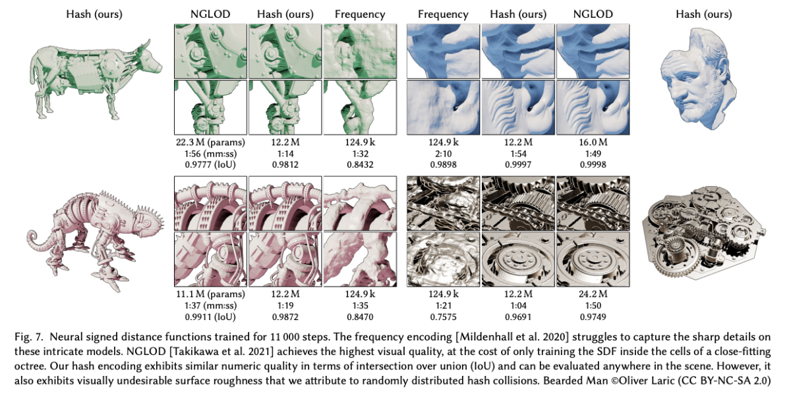

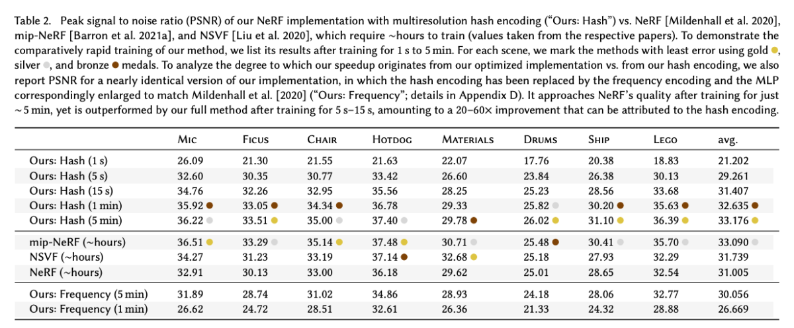