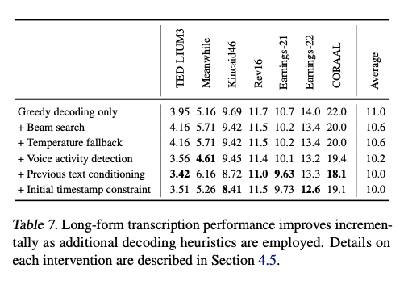

---
br
---
저자는 인터넷에 있는 수많은 오디오 transcripts를 예측하게끔 단순히 학습한 음성 처리 시스템의 capability를 연구했습니다. 68만 시간에 달하는 다국어 및 다작업 감독을 통해 확장된 결과 모델은 표준 벤치마크에 잘 일반화되며 종종 이전의 완전히 supvervised 한 결과와 경쟁력을 가지지만 어떠한 미세 조정도 필요하지 않은 제로샷 전이 환경에서 작동합니다. 인간과 비교했을 때, 이 모델들은 인간의 정확도와 견고성에 가깝습니다. 저자는 이러한 모델과 추론 코드를 공개하여 견고한 음성 처리에 대한 추가 연구의 기반으로 제공하였습니다.

[Paper Link](https://arxiv.org/abs/2212.04356)
[Code Link](https://github.com/openai/whisper)

## Approach

### 1. Data Processing

인터넷에서 대량의 텍스트를 활용하여 기계 학습 시스템을 훈련시키는 최근 연구 동향을 따라 저자는 데이터 전처리에 대한 최소한의 접근을 취합니다. 음성 인식에 대한 많은 연구와 대조적으로, 저자는 Whisper 모델을 훈련시켜 표준화된 작업 없이 transcripts의 raw text를 예측하도록 합니다. 이는 sequence-to-sequence 모델의 표현력을 의존하여 발화와 그들의 transcribed form 간의 매핑을 학습함으로써 음성 인식 파이프라인을 단순화합니다. 이것은 자연스러운 transcriptions을 생성하기 위해 별도의 역 텍스트 normalization 단계가 필요하지 않게 합니다.

저자는 인터넷에서 전사와 쌍을 이루는 오디오로 데이터 세트를 구성합니다. 이로 인해 매우 다양한 데이터 세트가 생성되며 많은 다양한 환경, 녹음 설정, 화자 및 언어에서의 오디오 분포를 포괄합니다. 오디오 품질의 다양성은 모델을 견고하게 훈련시키는 데 도움이 될 수 있지만, transcription 품질의 다양성에는 유사한 도움을 주지 않습니다. 초기 조사 결과, raw 데이터 세트에는 많은 평균 이하 transcription이 있음을 보여주었습니다. 이를 해결하기 위해 transcription 품질을 향상시키기 위한 여러 자동 필터링 방법을 개발했습니다.

인터넷 상의 많은 transcription은 실제로는 인간이 생성한 것이 아니라 기존 ASR(Automatic Speech Recognition) 시스템의 출력물입니다. 최근 연구에서는 인간과 기계 생성 데이터가 혼합된 데이터셋에서 훈련하는 것이 번역 시스템의 성능을 현저하게 저하시킬 수 있다는 것을 보여주었습니다 (Ghorbani 등, 2021). "transcript-ese"를 학습하지 않기 위해, 저자는 훈련 데이터셋에서 기계 생성 transcription을 감지하고 제거하기 위한 여러 가지 휴리스틱을 개발했습니다. 많은 기존 ASR 시스템은 written 언어의 한정된 하위 집합만 출력하며, 이로써 오디오 신호만으로 예측하기 어려운 측면들을 제거하거나 정규화합니다. 이러한 측면에는 복잡한 구두점(느낌표, 쉼표 및 물음표)과 같은 것, 단락과 같은 형식적인 공백, 대문자와 같은 스타일적인 측면이 포함됩니다. 모두 대문자 또는 모두 소문자로 된 전사물은 매우 인간이 생성하지 않은 것으로 생각됩니다. 많은 ASR 시스템은 역 텍스트 정규화의 어느 정도 수준을 포함하지만, 이것은 종종 간단하거나 규칙 기반으로 이루어지며, 쉼표를 포함하지 않는 등 다른 처리되지 않은 측면에서 여전히 감지됩니다.

또한 VoxLingua107 데이터셋의 프로토타입 버전을 사용하여 fine-tuning한 프로토타입 모델을 사용하여 생성한 오디오 언어 감지기를 사용합니다 (Valk & Alumae, 2021). 이를 통해 음성 언어가 CLD2에 따라 transcription 언어와 일치하는지 확인하여, 두 언어가 일치하지 않는 경우 (오디오, transcription) 쌍을 데이터셋의 음성 인식 훈련 예제로 포함하지 않습니다. 그러나 transcription 언어가 영어인 경우 예외적으로 이러한 쌍을 데이터셋에 X->en 음성 번역 훈련 예제로 추가합니다. 또한 훈련 데이터셋에서 중복과 자동 생성된 콘텐츠의 양을 줄이기 위해 transcription 텍스트의 fuzzy de-duping를 사용합니다.

저자는 오디오 파일을 30초 단위 세그먼트로 나누고 해당 시간 세그먼트 내에 발생하는 transcription 일부분과 쌍을 이룹니다. 저자는 발화가 없는 세그먼트를 포함하여 모든 오디오에서 훈련을 진행합니다 (다만 하위 샘플링 확률과 함께). 이러한 세그먼트들을 음성 활동 감지의 훈련 데이터로 사용합니다.

초기 모델을 훈련한 후 추가적인 필터링 작업으로 훈련 데이터 소스에서의 오류율 정보를 종합하고, 이러한 데이터 소스들을 고 오류율과 데이터 소스 크기의 결합으로 정렬하여 낮은 품질의 데이터를 효율적으로 식별하고 제거했습니다. 이 검사에서는 부분적으로만 transcription된 것이나 정렬이 잘못되거나 정렬이 되지 않은 transcription 뿐만 아니라 필터링 휴리스틱이 감지하지 못한 저품질의 기계 생성 자막이 많이 나타났습니다.

오염을 방지하기 위해 높은 중첩 위험이 있는 것으로 생각되는 학습-평가 데이터셋 간에 transcription 수준에서 중복 제거를 수행합니다. 구체적으로는 TED-LIUM 3을 언급합니다.

### 2. Model

저자 연구의 초점은 음성 인식을 위한 대규모 지도 사전 훈련의 능력을 연구하는 것이므로, 모델 개선 사항과 혼동되지 않도록 오프더셸프(기존에 사용된) 아키텍처를 사용합니다. 저자는 Vaswani 등(2017)의 Transformer 인코더-디코더를 선택했습니다. 이 아키텍처는 신뢰할 수 있게 확장되는 것으로 잘 검증되었습니다. 모든 오디오는 16,000 Hz로 재샘플링되며, 25ms 윈도우에서 10ms의 스트라이드로 80채널의 로그-크기 Mel 스펙트로그램 표현이 계산됩니다. 특성 정규화를 위해 전처리 데이터셋 전체를 대상으로 입력을 전역적으로 -1에서 1 사이로 스케일 조정하고 평균을 거의 제로로 맞춥니다. 인코더는 이 입력 표현을 3의 필터 폭을 갖는 두 개의 합성곱 레이어로 구성된 작은 스템으로 처리하며, 두 번째 합성곱 레이어는 스트라이드가 2입니다. 그 후에는 사인파 위치 임베딩이 스템의 출력에 추가되고 인코더 Transformer 블록이 적용됩니다. Transformer는 Child 등(2019)의 pre-activation residual 블록을 사용하며, 최종적으로 인코더 출력에 layer normalization가 적용됩니다. 디코더는 학습된 위치 임베딩과 입력-출력 토큰 표현을 공유합니다 (Press & Wolf, 2017). 인코더와 디코더는 동일한 너비와 Transformer 블록 수를 가지고 있습니다. 그림 1은 모델 아키텍처를 요약합니다.

영어 전용 모델에는 GPT-2에서 사용된 것과 동일한 바이트 수준 BPE 텍스트 토크나이저를 사용하고 (Sennrich et al., 2015; Radford et al., 2019), 다국어 모델에서는 언어 간 과도한 단편화를 피하기 위해 어휘를 다시 조정합니다 (하지만 동일한 크기를 유지합니다). 이는 GPT-2 BPE 어휘가 영어 전용이기 때문에 다른 언어에 대한 과도한 단편화를 피하기 위함입니다.

### 3. Multitask Format

특정 오디오 스니펫에서 어떤 단어들이 말씀되었는지 예측하는 것은 전체 음성 인식 문제의 핵심 부분이며 많은 연구에서 광범위하게 연구되었습니다. 그러나 이것만이 아닙니다. 완전한 기능을 갖춘 음성 인식 시스템은 음성 활동 감지, 화자 구분 및 역 텍스트 정규화와 같은 많은 추가 구성 요소를 포함할 수 있습니다. 이러한 구성 요소들은 종종 별도로 처리되어 핵심 음성 인식 모델 주변에 비교적 복잡한 시스템을 만들어냅니다. 이 복잡성을 줄이기 위해 저자는 단일 모델이 핵심 인식 부분뿐만 아니라 전체 음성 처리 파이프라인을 수행하도록 하려고 합니다. 여기서 중요한 고려 사항은 모델의 인터페이스입니다. 동일한 입력 오디오 신호에서 수행할 수 있는 다양한 작업들이 있습니다: transcription, 번역, 음성 활동 감지, 정렬 및 언어 식별은 그 중 일부입니다.

단일 모델에서 이러한 종류의 일대다 매핑이 작동하려면 어떤 형태의 작업 명세가 필요합니다. 저자는 모든 작업과 조건 정보를 디코더의 입력 토큰 순서로 지정하는 간단한 형식을 사용합니다. 저자의 디코더는 오디오 조건 언어 모델이기 때문에 transcription 텍스트 이력을 조건으로 사용하도록 훈련합니다. 이로써 음성과 관련된 모호한 오디오를 해결하기 위해 보다 긴 범위의 텍스트 문맥을 활용할 것을 기대합니다. 구체적으로 일정 확률로 현재 오디오 세그먼트 이전의 transcription 텍스트를 디코더의 문맥에 추가합니다. 저자는 예측의 시작을 나타내기 위해 <|startoftranscript|>토큰을 사용합니다.

먼저, 모델은 어떤 언어가 사용되고 있는지를 예측합니다. 각 언어에 대한 고유한 토큰으로 표현되며 이는 훈련 세트에서 총 99개의 언어를 나타냅니다. 이러한 언어 목표는 앞서 언급한 VoxLingua107 모델에서 가져옵니다.

만약 오디오 세그먼트에 발화가 없는 경우, 모델은 이를 나타내는 <|nospeech|> 토큰을 예측하도록 훈련됩니다. 그 다음 토큰은 작업을 지정합니다 (<|transcribe|> or <|translate|>). 그 다음으로 타임스탬프를 예측할 것인지 여부를 지정합니다. 이 경우 그에 해당하는 <|notimestamps|> 토큰을 포함하여 타임스탬프를 예측합니다.

이 시점에서 작업과 원하는 형식이 완전히 지정되며 출력이 시작됩니다. 타임스탬프 예측의 경우 현재 오디오 세그먼트에 상대적인 시간을 예측하며 모든 시간을 Whisper 모델의 기본 시간 해상도와 일치하도록 20ms로 양자화하고 이러한 각 시간에 대한 추가 토큰을 어휘에 추가합니다. 이들을 자막 토큰과 교차하여 예측합니다: 시작 시간 토큰은 각 자막 텍스트 앞에서 예측되고 끝 시간 토큰은 그 뒤에서 예측됩니다.

최종 transcription 세그먼트가 현재 30 seconds 오디오 chunk에 부분적으로만 포함된 경우 타임스탬프 모드에서는 해당 세그먼트의 시작 시간 토큰만 예측하여 이후 디코딩이 해당 시간과 일치하는 오디오 창에서 수행되어야 함을 나타냅니다. 그렇지 않으면 세그먼트를 포함하지 않도록 오디오를 자릅니다.

마지막으로 <|endoftranscript|> 토큰을 추가합니다. 이전 문맥 텍스트에 대한 훈련 손실만 마스킹하고 모델을 다른 모든 토큰을 예측하도록 훈련합니다. 형식과 훈련 설정의 개요는 그림 1을 참조하세요.

### 4. Training Details

Whisper의 스케일링 특성을 연구하기 위해 다양한 크기의 모델 모음을 훈련시켰습니다. 자세한 내용은 표 1을 참조하세요. FP16 및 동적 손실 스케일링과 활성화 체크포인팅 (Griewank & Walther, 2000; Chen 등, 2016)을 사용하여 가속기 간 데이터 병렬처리로 훈련합니다. 모델은 AdamW (Loshchilov & Hutter, 2017)와 그래디언트 norm clippinb (Pascanu 등, 2013)을 사용하여 훈련되었으며 처음 2048 업데이트 동안 웜업을 한 후 선형 학습률 감소를 통해 0까지 떨어졌습니다. 배치 크기는 256 세그먼트이며, 모델은 데이터셋을 두 번에서 세 번 통과하는 2^20번의 업데이트 동안 훈련되었습니다. 몇 에폭 동안만 훈련하므로 과적합은 큰 문제가 아니며 데이터 확대나 정규화를 사용하지 않고, 대신 이러한 큰 데이터셋에 포함된 다양성을 활용하여 일반화와 견고성을 촉진합니다.

초기 개발 및 평가 단계에서 Whisper 모델이 화자의 이름에 대한 그럴듯한 but 거의 항상 잘못된 추측을 하는 경향이 있다는 것을 관찰했습니다. 이는 사전 훈련 데이터셋에 많은 transcription이 말하는 사람의 이름을 포함하고 있기 때문에 모델이 이를 예측하려고 시도하기 때문입니다. 그러나 이 정보는 recent 30 seconds 오디오 컨텍스트만으로는 거의 추론할 수 없습니다. 이를 피하기 위해 화자 주석이 포함되지 않은 일부 transcription을 기반으로 Whisper 모델을 간단히 세부 조정합니다. 이를 통해 이러한 행동을 없앨 수 있습니다.

## Analysis and Ablations

### 1. Model Scaling

약한 지도 학습 접근법의 장점 중 많은 부분은 전통적인 감독 학습보다 훨씬 큰 규모의 데이터셋을 활용할 수 있는 잠재력입니다. 그러나 이는 가능성은 높지만 gold-standard 감독보다 훨씬 노이지하고 품질이 낮은 데이터를 사용하는 비용이 따릅니다. 이 방법의 우려점은 처음에 유망해 보일 수 있지만, 이러한 종류의 데이터로 훈련된 모델의 성능이 데이터셋의 본래 품질 수준에서 포화될 수 있으며 이 수준이 인간 수준 이하일 수 있다는 것입니다. 관련된 우려점은 데이터셋에 대한 훈련 중에 사용되는 용량과 컴퓨팅이 증가함에 따라 모델이 데이터셋의 독특한 특성을 이용하는 방법을 학습하고 그들의 일반화 능력이 분포에 벗어난 데이터로 심각하게 약화될 수 있다는 것입니다.

이것이 사실인지 확인하기 위해 모델 크기의 함수로 Whisper 모델의 제로샷 일반화를 연구했습니다. 분석 내용은 그림 8에 요약되어 있습니다. 다국어 음성 인식, 음성 번역 및 언어 식별에서 모델 크기가 커질수록 성능이 계속해서 증가하는 것을 볼 수 있습니다. 영어 음성 인식에서의 수익이 감소하는 것은 인간 수준의 성능에 접근함에 따른 포화 효과일 수 있습니다.

### 2. Dataset Scaling

라벨이 지정된 오디오가 680,000 시간으로 Whisper 데이터셋은 감독 음성 인식에서 만들어진 가장 큰 데이터셋 중 하나입니다. 그렇다면 Whisper의 성능에 대한 원시 데이터셋 크기는 얼마나 중요한가요? 이를 연구하기 위해 데이터셋의 하위 샘플 버전 (전체 데이터셋 크기의 0.5%, 1%, 2%, 4%, 및 8%)에서 중간 크기 모델의 시리즈를 훈련시켜서 이와 동일한 중간 크기 모델이 전체 데이터셋에서 훈련된 것과 비교하여 성능을 비교했습니다. 각 데이터셋 크기에 대한 모델 체크포인트를 선택하기 위해 검증 손실에 기반한 조기 중지를 사용했습니다. 평가는 지수 이동 평균 파라미터 추정치 (Polyak & Juditsky, 1992)를 사용하여 수행되었으며 조기 중지로 인해 서브샘플된 데이터셋에서 훈련된 모델에 대한 학습률이 완전히 0으로 감소하지 않는 영향을 줄이기 위해 0.9999의 스무딩 비율을 사용했습니다. 영어 및 다국어 음성 인식 및 X->en 번역의 성능은 표 6에 보고되었습니다.

- WER (Word Error Rate): 인식된 단어열과 정답 단어열 사이의 단어 오류 비율 (잘못된 단어 갯수 / 총 단어 개수) x 100
- BLEU (Bilingual Evaluation Understudy): 번역 모델에 주로 사용 하는 지표
  - n-gram(1~4)을 통한 순서쌍들이 얼마나 겹치는 지를 측정 (precision)
  - 같은 단어가 연속적으로 나올 때 과적합 되는 것을 보정 (clipping)
  - 문장 길이에 대한 과적합 보정 (Brevity Penalty)

데이터셋 크기의 모든 증가는 모든 작업에서 성능 향상으로 이어지지만 과제와 크기별로 성능 향상률에 상당한 변동성이 있습니다. 영어 음성 인식에서 성능은 3,000에서 13,000 시간까지 급격히 향상되고, 그 이후 13,000에서 54,000 시간 사이에는 뚜렷한 둔화가 나타납니다. 전체 데이터셋을 사용하면 크기가 12.5배 증가하며 WER에서 1포인트만 더 떨어집니다. 이는 영어 음성 인식에서 모델 크기 조정에 따른 수렴 효과를 반영하며, 이는 인간 수준의 성능에 접근할 때 포화 효과로 설명될 수 있습니다.

다국어 음성 인식의 WER 개선은 54,000 시간까지 거의 거듭제곱 법칙 경향을 따르며, 그 이후에는 이 경향에서 벗어나 전체 데이터셋 크기로 확장하여 추가로 7포인트만 더 개선됩니다. X->en 번역의 경우, 오디오가 7,000 시간 또는 그 이하로 훈련될 때 성능은 사실상 제로이며, 그 이후에는 대략 로그 선형 개선 경향을 따릅니다. 그러나 전체 데이터셋 크기로 확장할 때도 더 이상의 개선이 나타날 수 있음을 나타냅니다.

54,000 시간에서 680,000 시간의 전체 데이터셋 크기로 이동할 때 과제 전반에 걸쳐 나타나는 성능 수익의 일반적인 경향은 현재의 최고 Whisper 모델이 데이터셋 크기에 비해 미훈련되어 있을 수 있으며 더 긴 훈련과 더 큰 모델의 결합으로 성능을 더 개선할 수 있다는 것을 시사할 수 있습니다. 또한 음성 인식의 데이터셋 크기에 대한 성능 향상의 끝에 다다른 것일 수 있다는 것을 시사할 수 있습니다. 이러한 설명 사이에서 선택하기 위해 음성 인식의 "스케일링 법칙"을 특성화하기 위한 추가적인 분석이 필요합니다.

### 3. Multitask and Multilingual Transfer

다양한 작업 및 언어에 대한 단일 모델을 공동으로 훈련시키는 것의 잠재적인 우려 사항은 여러 작업의 학습 사이에서 간섭이 발생하여 단일 작업이나 언어만을 훈련시킬 때보다 성능이 떨어질 수 있다는 가능성입니다. 이러한 현상이 발생하는지 조사하기 위해 영어 음성 인식만을 훈련시킨 모델과 표준 다중 작업 및 다국어 훈련 설정을 사용하여 영어 음성 인식 벤치마크 모음에서 평균 성능을 측정했습니다. 저자는 영어 음성 인식 작업에 소비된 FLOP 양을 조정하였습니다. 단일 훈련 설정에서 이 작업에 투자된 계산의 65%만 이 작업에 사용되기 때문입니다. 그렇지 않으면 동일한 크기의 영어 전용 모델과 비교할 때 작업의 미훈련으로 인해 분석이 혼란스러울 수 있습니다.

Figure 9에 시각화된 결과는 중간 정도의 계산량으로 훈련된 작은 모델의 경우 실제로 작업 및 언어 간에 부정적인 전이가 발생한다는 것을 보여줍니다: 동일한 계산량으로 훈련된 영어 전용 모델보다 합동 모델의 성능이 떨어집니다. 그러나 다중 작업 및 다국어 모델은 더 나은 확장성을 갖으며 최대 규모의 실험에서는 영어 전용 모델을 능가하여 다른 작업으로부터 긍정적인 전이를 나타냅니다. 최대 규모의 실험에서도 작업당 사용된 계산을 조정하지 않아도 합동 모델이 영어 전용 모델보다 약간 우수한 성능을 보입니다.

### 4. Text Normalization

Whisper와 함께 텍스트 정규화를 개발함으로써 무해한 단어 오류를 수정할 수 있습니다. 그러나 이렇게 함으로써 normalizer가 transcription의 다양성을 해결하는 대신 Whisper의 독특한 특성을 수정하는 데 과적합될 수 있는 위험이 있습니다. 이를 확인하기 위해 저자의 normalizer와 FairSpeech 프로젝트에서 독립적으로 개발된 normalizer(Koenecke 등, 2020)를 비교했습니다. 그림 10에서 차이점을 시각적으로 나타냈습니다. 대부분의 데이터셋에서 두 normalizer는 유사한 성능을 보이며 Whisper와 비교된 오픈소스 모델 사이의 WER 감소에 큰 차이가 없습니다. 그러나 WSJ, CallHome 및 Switchboard와 같은 일부 데이터셋에서는 저자의 normalizer가 Whisper 모델의 WER을 상당히 더 줄입니다. 감소의 차이는 GT(ground truth)에서 사용하는 서식과 두 정규화기가 이를 어떻게 처벌하는지로 역추적될 수 있습니다. 예를 들어 CallHome 및 Switchboard에서 저자의 normalize 형태는 "you're" 대 "you are"와 같은 일반적인 영어 축약형의 차이를 처벌하지 않았으며 WSJ에서는 숫자 및 통화 표현의 쓰기 및 발음 형태를 표준화했습니다. 예를 들어 "sixty-eight million dollars" 대 "$68 million"과 같은 경우입니다.

### 5. Strategies for Reliable Long-form Transcription

Whisper를 사용하여 long-form 오디오를 transcription하려면 타임스탬프 토큰을 정확하게 예측하여 모델의 30초 오디오 컨텍스트 창을 얼마나 이동시킬지를 결정해야 합니다. 한 창에서의 부정확한 transcription은 이어지는 창에서의 transcription에 부정적인 영향을 미칠 수 있습니다.

저자는 long-form transcription 실패 사례를 피하기 위한 일련의 휴리스틱을 개발했습니다. 먼저, 탐색 반복을 줄이기 위해 로그 확률을 점수 함수로 사용하여 5개의 beam을 사용한 beam search를 사용합니다. 온도를 0으로 시작하여 항상 가장 높은 확률을 가진 토큰을 선택하고, 생성된 토큰 전체의 평균 로그 확률이 -1보다 낮거나 생성된 텍스트의 gzip 압축률이 2.4보다 높을 때 온도를 0.2씩 증가시킵니다. 적용된 온도가 0.5 미만인 경우 이전 창에서 전사된 텍스트를 이전 텍스트 조건으로 제공함으로써 성능을 더욱 향상시킵니다.

저자는 <|nospeech|> 토큰의 확률만으로는 음성이 없는 세그먼트를 구별하는 데 충분하지 않다는 것을 발견했지만, 음성 활동 감지를 더욱 신뢰할 수 있게 만들기 위해 0.6의 음성이 없는 확률 임계값과 -1의 평균 로그 확률 임계값을 결합했습니다. 마지막으로 입력에서 처음 몇 마디를 모델이 무시하는 오류 모드를 피하기 위해 초기 타임스탬프 토큰을 0.0과 1.0 초 사이로 제한했습니다. 표 7은 위의 각 개입 방식을 추가함으로써 전반적으로 WER을 감소시키지만 데이터셋 전반에 고르게 적용되지 않음을 보여줍니다. 이러한 휴리스틱은 모델의 노이지 예측에 대한 해결책으로 작용하며 long-from transcription의 신뢰성을 더욱 향상시키기 위해 더 많은 연구가 필요합니다.

#### Beam Search

Seq2Seq 모델의 디코딩은 해당 시점에서 가장 높은 확률의 후보를 선택하는 보통 Greedy Decoding 방식을 따릅니다. 이 방법은 시간 복잡도 면에서는 훌륭하지만, 최종 정확도 관점에서는 좋지 않습니다.

Bean Search는 Greedy Decoding의 단점을 극복하기 위해 나온 방법입니다. 가장 좋은 방법은 나올 수 있는 모든 경우의 수를 고려한 뒤 누적 확률이 가장 높은 하나의 경우를 선택하면 되지만, 이는 시간 복잡도 면에서 불가능한 방법입니다. Bean Search는 모든 경우의 수가 아니라 해당 시점에서 유망한 k개의 빔을 골라서 진행하는 방식입니다.

여기서 우리는 디코딩 문제를 휴리스틱 상태 공간 검색으로 보고 가능한 출력 공간을 체계적으로 탐색합니다. 이러한 검색 트리에서 분기는 작업(이 경우 토큰 생성 작업)이고 노드는 상태(이 경우 특정 접두사를 생성한 상태)입니다. 최고의 행동 순서, 즉 확률이 가장 높은 대상 문자열을 찾고 있습니다. 그림 10.8은 구성된 예를 사용하여 문제를 보여줍니다. 가장 가능성이 높은 시퀀스는 ok ok (.4∗.7∗1.0의 확률)이지만 탐욕적인 검색 알고리즘은 이를 찾지 못합니다. 로컬 확률이 가장 높기 때문에 첫 번째 단어로 yes를 선택합니다.

빔 검색에서는 각 단계에서 생성할 최상의 토큰을 선택하는 대신 각 단계에서 k 가능한 토큰을 유지합니다. 이 고정 크기 메모리 풋프린트 k는 더 넓거나 더 좁게 매개변수화할 수 있는 손전등 빔의 비유에서 빔 폭이라고 합니다. 따라서 디코딩의 첫 번째 단계에서 우리는 전체 어휘에 대해 소프트맥스를 계산하고 각 단어에 확률을 할당합니다. 그런 다음 이 softmax 출력에서 k-최고 옵션을 선택합니다. 이러한 초기 k 출력은 검색 프론티어이며 이러한 k 초기 단어를 가설이라고 합니다. 가설은 확률과 함께 출력 시퀀스, 변환 범위입니다.

후속 단계에서 각각의 k 최상의 가설은 별개의 디코더로 전달되어 점진적으로 확장되며, 각 디코더는 가설을 가능한 모든 다음 토큰으로 확장하기 위해 전체 어휘에 대해 소프트맥스를 생성합니다. 각 k * V 가설은 P(y|x,y<i)로 점수를 배기게됩니다. 즉, 현재 단어 선택 확률에 단어 선택에 이르는 경로 확률을 곱한 값입니다. 그런 다음 k * V 가설을 k 최상의 가설로 정리하므로 검색의 최전선에는 k 이상의 가설이 없고 k 이상의 디코더도 없습니다.

이 프로세스는 완전한 후보 출력이 발견되었음을 나타내는 `</s>`가 생성될 때까지 계속됩니다. 이 시점에서 완성된 가설은 프론티어에서 제거되고 빔의 크기는 하나 줄어듭니다. 검색은 빔이 0으로 줄어들 때까지 계속됩니다. 결과는 k 가설이 됩니다. 확률의 연쇄 법칙을 사용하여 p(y|x)를 이전 컨텍스트에서 주어진 각 단어의 확률 곱으로 분해할 수 있으며, 이를 로그 합계(출력 문자열의 경우 길이 t)로 변환할 수 있습니다. 여기서 로그 확률은 음수 또는 0 입니다. 

완성된 가설의 길이가 다를 수 있다는 사실에서 한 가지 문제가 발생합니다. 모델은 일반적으로 더 긴 문자열에 더 낮은 확률을 할당하기 때문에 순진한 알고리즘은 y에 대해 더 짧은 문자열을 선택합니다. 이것은 초기 디코딩 단계에서는 문제가 되지 않았습니다. 빔 검색의 폭 우선 특성으로 인해 비교되는 모든 가설의 길이는 동일했습니다. 이에 대한 일반적인 해결책은 각 가설에 어떤 형태의 길이 정규화를 적용하는 것입니다. 예를 들어 단순히 음의 로그 확률을 단어 수로 나누는 것입니다.
