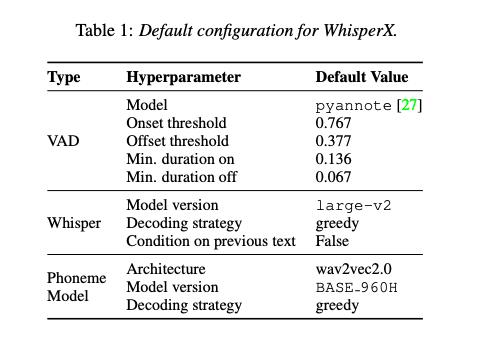
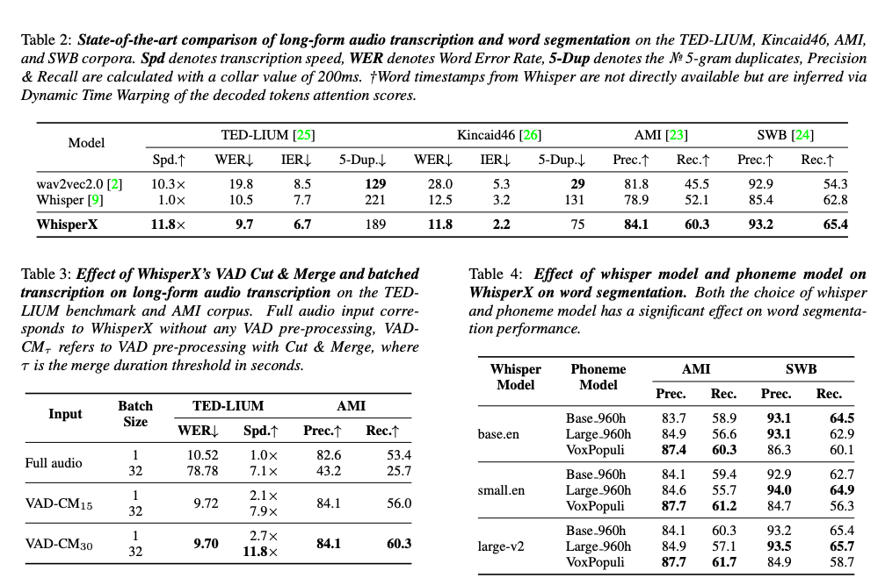

대규모로 약하게 지도 학습된 음성 인식 모델인 Whisper는 다양한 도메인과 언어에서 인상적인 결과를 보였습니다. 그러나 발화당 대응하는 예측 타임스탬프는 정확성에 취약하며 단어 수준의 타임스탬프는 기본적으로 제공되지 않습니다. 게다가 버퍼링된 transcription을 통한 장기 오디오의 적용은 순차적인 특성 때문에 일괄 추론을 제한합니다. 앞서 언급한 문제를 극복하기 위해 우리는 WhisperX를 제안합니다. 이는 음성 활동 감지 및 강제 음운 정렬을 활용한 단어 수준의 타임스탬프를 갖춘 시간 정확한 음성 인식 시스템입니다. 이를 통해 우리는 long-form transcription 및 단어 분할 벤치마크에서 최첨단 성능을 보여주었습니다. 더불어 우리가 제안한 VAD Cut & Merge 전략을 사용하여 오디오를 사전 분할하면 transcription 품질이 향상되고 일괄 추론을 통한 12배의 속도 향상이 가능합니다. 코드는 공개되어 있습니다.

[Paper Link](https://arxiv.org/pdf/2303.00747.pdf)
[Code Link](https://github.com/m-bain/whisperx)

## WhisperX

### 1. Voice Activity Detection

음성 활동 감지(Voice Activity Detection, VAD)는 음성이 포함된 오디오 스트림 내의 영역을 식별하는 과정을 말합니다. WhisperX의 경우, 먼저 입력 오디오를 VAD로 사전 분할합니다. 이로써 다음과 같은 세 가지 이점이 제공됩니다:

(1) VAD는 ASR보다 훨씬 저렴하며, 비활성화된 긴 음성 영역에서 후자의 불필요한 전진 패스를 피합니다.

(2) 오디오는 활성 음성 영역이 아닌 경계에 잘린 청크로 나뉠 수 있어 경계 효과로 인한 오류를 최소화하고 병렬 전사를 가능하게 합니다.

(3) VAD 모델이 제공하는 음성 경계를 사용하여 단어 수준의 정렬 작업을 더 지역적인 세그먼트로 제한하고 Whisper의 타임스탬프에 의존하지 않도록 할 수 있습니다 - 저자는 whisper의 타임스탬프가 너무 불안정하다고 보여줍니다.

일반적으로 VAD는 시퀀스 레이블링 작업으로 정의됩니다. 입력 오디오 파형은 시간 단계별로 추출된 음향 특성 벡터의 시퀀스로 표현되며 A = {a1, a2, ..., aT}이고, 출력은 이진 레이블의 시퀀스 y = {y1, y2, ..., yT}입니다. 여기서 yt = 1은 시간 단계 t에서 음성이 있을 경우이고, 그렇지 않으면 yt = 0입니다.

실제로 VAD 모델 V: A -> y 는 출력 예측 yt를 [0, 1] 바이너리화 단계로 후처리하며, 이는 smoothing 단계(onset/offset threshold)와 결정 단계(최소 지속 시간 on/off)로 구성됩니다.

이진 예측은 그런 다음 활성 음성 세그먼트 s = {s1, s2, ..., sN}의 시퀀스로 표현됩니다. 여기서 시작 및 종료 인덱스는 si = (ti0, ti1)입니다.

### 2. VAD Cut & Merge

활성 음성 세그먼트는 최대 입력 지속 시간인 ASR 모델의 경우 Whisper의 경우 30초로 제한된 것처럼 임의의 길이일 수 있습니다. 이러한 더 긴 세그먼트는 단일 전방향 패스로 전사할 수 없습니다. 이를 해결하기 위해 이진 후처리의 부드럽게 하는 단계에서 '최소 절단' 작업을 제안합니다. 이를 통해 활성 음성 세그먼트의 지속 시간 상한을 제공합니다.

구체적으로 활성 음성 세그먼트의 길이를 ASR 모델의 최대 입력 지속 시간 이상으로 제한합니다. 이를 위해 보다 긴 음성 세그먼트를 음성 활성화 점수의 최소값 지점에서 절단합니다 (최소 절단). 새롭게 분할된 음성 세그먼트가 지나치게 짧지 않고 충분한 문맥을 가지도록 하기 위해 절단은 `|A_train|`의 1/2와 `|A_train|` 사이로 제한됩니다. 여기서 `|A_train|` 은 훈련 중에 입력 오디오의 최대 지속 시간입니다 (Whisper의 경우 30초입니다).

제안된 최소 절단 작업에 대한 의사 코드는 아래와 같습니다

```python

def binarize_cut(scores, max_dur, onset_th, offset_th, TIMESTEP):
    """
    scores: array of VAD scores extracted at each TIMESTEP (0.02 sec)
    max_dur: Maximum duration of ASR model
    onset_th: threshold for speech onset
    offset_th: threshold for speech offset
  
    returns:
    segs: array of active speech start and end
    """
    segs = []
    start = 0
    is_active = scores[0] > offset_th 
    max_len = int(max_dur * TIMESTEP)
    for i in range(1, len(scores)):
        sc = scores[i]
        if is_active:
            if (i - start) >= max_len:
                pdx = i + max_len // 2
                qdx = i + max_len
                min_sp = argmin(scores[pdx:qdx])
                segs.append((start, pdx+min_sp))
                start = pdx + min_sq
            elif sc < offset_th: 
                segs.append((start, i))
                is_active = False
        else:
            if sc > onset_th:
                start = i
                is_active = True

    return segs
```

이제 입력 세그먼트의 지속 시간에 상한선이 설정되었으므로 다른 극단적인 상황을 고려해야 합니다. 이는 매우 짧은 세그먼트로, 독특한 일련의 어려움을 제시합니다. 간결한 음성 세그먼트를 transcription하면 도전적인 상황에서 음성 모델링에 도움이 되는 더 넓은 문맥이 제외됩니다. 게다가, 다수의 짧은 세그먼트를 transcription 하는 것은 필요한 전방향 패스의 증가로 인해 총 transcription 시간을 증가시킵니다.

따라서 저자는 'min-cut' 후에 수행되는 'merge' 작업을 제안합니다. 여기서 이 작업은 최대 지속 시간 임계값 t 이하의 총 시간 범위를 갖는 이웃 세그먼트를 병합합니다. 이 때 `t ≤ |A_train|`입니다. 실험적으로 우리는 이것이 `t = |A_train|`에서 최적이라고 찾았으며, 이는 transcription 중에 문맥을 최대화하고 훈련 중에 관찰된 것과 유사한 세그먼트 지속 시간 분포를 보장합니다.

### 3. Whisper Transcription

이제 결과적인 음성 세그먼트는 모델의 입력 크기와 거의 동일한 지속 시간을 갖습니다. 즉, `|s_i| = |A_train|` 이며, 활성 음성이 아닌 경계를 갖습니다. 이들은 Whisper와 함께 효율적으로 병렬로 전사될 수 있으며, 각 오디오 세그먼트 W : s -> T에 대한 텍스트를 출력합니다. 저자는 병렬 전사가 각 배치 샘플의 독립성 가정을 깨뜨릴 우려가 있기 때문에 이전 텍스트에 대한 조건부 없이 수행되어야 함을 언급합니다.

실제로 저자는 이 제한이 유리하다고 판단했는데, 이는 이전 텍스트에 대한 조건부가 환각과 반복에 민감하기 때문입니다. 또한 저자는 Whisper의 타임스탬프 없는 디코딩 방법을 사용합니다.

### 4. Forced Phoneme Alignment

각 오디오 세그먼트 si와 해당하는 텍스트 transcription Ti에 대해, Ti는 [w0, w1, ..., wm]의 단어 시퀀스로 구성되어 있습니다. 저자의 목표는 각 단어의 시작 및 끝 시간을 추정하는 것입니다. 이를 위해 음운 인식 (phoneme recognition) 모델을 활용합니다. 이 모델은 말의 가장 작은 단위를 분류하는 데 훈련되어 각각의 단어를 다른 것과 구별하는 요소인 예를 들어 "tap"에서의 'p'를 분류합니다. 모델 내의 음운 클래스의 집합을 C라고 할 때 C = {c1, c2, ..., cK}입니다. 주어진 입력 오디오 세그먼트에 대해 음운 분류기는 오디오 세그먼트 S를 입력으로 받아 logits 행렬 L을 출력합니다. 이 때 T는 음운 모델의 시간 해상도에 따라 다릅니다.

공식적으로 각 세그먼트 (for each) si 및 해당하는 텍스트 Ti에 대해 다음 단계를 수행합니다.

1. 세그먼트 텍스트 Ti에서 음운 모델에 공통인 고유한 음운 클래스 세트를 추출하고 C_Ti로 표시합니다.
2. 입력 세그먼트 si에 대해 C_Ti 클래스로 제한된 음운 분류를 수행합니다.
3. 결과 logits 행렬 Li, C_Ti × T에 대해 Dynamic Time Warping (DTW)을 적용하여 Ti 내의 음운의 최적 시간 경로를 얻습니다.
4. Ti 내의 각 단어 wi의 시작 및 끝 시간을 각각 첫 번째 음운과 마지막 음운의 시작 및 끝 시간으로 얻습니다.

음운 모델의 사전 C에 없는 transcription 음운에 대해서는 가장 가까운 다음 음운의 타임스탬프를 할당합니다. 위에서 설명한 for loop 배치로 병렬 처리될 수 있어서 긴 오디오의 빠른 transcription 단어 맞춤을 가능하게 합니다.

### 5. Multi-Lingual Transcription and Alignment

WhisperX는 다국어 transcription에도 적용할 수 있습니다. 다만 (1) 음성 활성 탐지 모델은 다양한 언어에 대해 견고해야 하고, (2) 음운 정렬 모델은 관심 있는 언어(들)로 훈련되어야 합니다. 다양한 언어를 대상으로 하는 음운 인식 모델 또한 적절한 옵션이며, 훈련 중에 볼 수 없는 언어로 일반화될 수 있습니다. 단, 이는 언어 독립적인 음운에서 대상 언어(들)의 음운으로의 추가적인 매핑이 필요할 것입니다.

### 6. Translation

Whisper는 여러 언어로부터 영어로의 번역된 transcription을 가능하게 하는 "번역(translate)" 모드를 제공합니다. 배치 기반 VAD 전사는 번역 설정에도 적용될 수 있지만, 음운 정렬은 더 이상 음성과 번역된 전사 간의 음성 언어학적 정렬이 없기 때문에 불가능합니다.

### 7. Word-level Timestamps without Phoneme Recognition

저자는 외부 음운 모델 없이도 Whisper에서 단어 수준의 타임스탬프를 직접 추출할 수 있는 가능성을 탐구했습니다. 이를 통해 음운 매핑의 필요성을 제거하고 추론 오버헤드를 줄일 수 있습니다 (실제로 정렬 오버헤드가 최소하되어 속도가 약 10% 이하라는 것을 확인했습니다). 교차 어텐션 점수에서 타임스탬프를 추론하는 시도가 있었지만, 이러한 방법들은 제안된 외부 음운 정렬 접근 방식과 비교했을 때 성능이 낮으며, 타임스탬프의 정확도가 떨어지는 경향이 있습니다.

## Evaluation

평가는 다음과 같은 질문들에 대한 답을 찾습니다: (1) WhisperX가 최첨단 ASR 모델인 Whisper와 wav2vec2.0과 비교하여 장문 transcription 및 단어 수준 분할에 대해 효과적인지; (2) VAD Cut & Merge 전처리의 transcription 품질과 속도 측면에서의 이점; 그리고 (3) 음운 모델과 Whisper 모델 선택이 단어 분할 성능에 미치는 영향입니다.

### Datasets

**The AMI Metting Corpus**. 저자는 AMI Metting Corpus의 테스트 세트를 사용했습니다. 이 세트에는 16개의 회의 오디오 녹음이 포함되어 있습니다. 단어 수준의 수동 검증된 정렬이 단어 분할 성능을 평가하는 데 사용된 테스트 세트에 제공됩니다.

**Switchboard-1 Telephone Cporpus (SWB)**. SWB는 전화 대화의 약 2,400 시간으로 구성되어 있습니다. 수동으로 수정된 단어 정렬이 함께 제공됩니다. w저자는 100개의 대화 세트를 무작위로 하위 샘플링했습니다.

장문 오디오 transcription을 평가하기 위해 **TEDLIUM-3**과 **Kincaid46**을 보고합니다. TEDLIUM-3에는 각각 20분씩의 11개의 TED 토크가 포함되어 있으며, Kincaid46에는 YouTube에서 가져온 다양한 비디오가 포함되어 있습니다.

### Metrics

long-form 오디오 transcription을 평가하기 위해 저자는 단어 오류율 (WER)과 transcription 속도 (Spd.)를 보고합니다. 반복 및 환각(hallucination)의 정도를 측정하기 위해 삽입 오류율 (IER)과 예측된 transcription에서 5-gram 단어 중복 수 (5-Dup.)를 각각 측정합니다. 이는 예측된 타임스탬프의 정확성을 평가하지 않으므로 단어 수준의 타임스탬프가 있는 데이터셋에 대해 단어 분할 메트릭을 평가하여 transcription 및 타임스탬프 품질을 함께 평가합니다. 저자는 정밀도 (Prec.)와 재현율 (Rec.)을 보고하는데, 여기서 실제 양성은 예측된 단어 세그먼트와 gt 단어 세그먼트가 정확한 문자열 일치인 경우입니다. 모든 평가에서 저자는 어노테이션과 모델 간의 차이를 고려하기 위해 collar 값으로 200ms를 사용합니다.

### Implementation Details



**WhisperX**: 별도로 명시하지 않는 한, 모든 실험에 대해 표 1의 기본 구성을 사용합니다. Whisper만을 사용한 transcription과 단어 정렬의 경우 표 1의 기본 구성을 계승하고 단어 타임스탬프를 추론하기 위해 공식 구현을 사용합니다. Wav2vec2.0 transcription 및 단어 정렬의 경우 별도로 명시하지 않는 한 표 1의 기본 설정을 사용합니다. 공식 torchaudio 저장소에서 다양한 모델 버전을 얻고 강제 정렬 튜토리얼을 기반으로 작성합니다. Base 960h 및 Large 960h 모델은 Librispeech 데이터에서 훈련되었으며, VoxPopuli 모델은 Voxpopuli 말뭉치에서 훈련되었습니다. 벤치마킹 추론 속도를 위해 모든 모델은 NVIDIA A40 gpu에서 Whisper의 속도의 배수로 측정됩니다.

### Results


