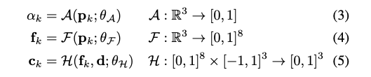
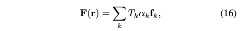

신경 방사형 필드 (NeRFs)는 새로운 시점에서 3D 장면의 이미지를 합성하는 놀라운 능력을 보여주었습니다. 그러나 이들은 "ray marching" 기반으로 한 특수 볼륨 렌더링 알고리즘에 의존하며, 이는 일반적으로 사용되는 그래픽 하드웨어의 기능과 일치하지 않습니다. 본 논문은 텍스처 폴리곤을 기반으로 한 새로운 NeRF 표현을 소개합니다. 이 표현은 표면 이외의 지표면 정보를 효과적으로 시각화할 수 있습니다. NeRF는 바이너리 불투명도와 특징 벡터를 나타내는 텍스처를 갖는 폴리곤 세트로 표현됩니다. 폴리곤을 z-버퍼로 전통적으로 렌더링하면 모든 픽셀에서 특징이 생성되며, 이러한 특징은 프래그먼트 쉐이더에서 실행되는 작은 시점 종속 MLP에 의해 해석되어 최종 픽셀 색상을 생성합니다. 이 접근법을 통해 NeRFs를 전통적인 폴리곤 래스터화 파이프라인으로 렌더링할 수 있으며, 이는 광범위한 컴퓨팅 플랫폼, 휴대폰을 포함한 다양한 플랫폼에서 대화형 프레임 속도를 달성할 수 있습니다.

* Ray Marching 이란?
  * 기존의 3D 렌더링 방식과 달리 거리 함수 (Signed Distance Function)를 통해 오브젝트 표면을 정의
  * 카메라로부터 스크린 픽셀을 향해 Ray를 전진 시키고, 해당 픽셀의 레이가 Object 표면에 닿으면, 그 픽셀에 오브젝트 표면을 렌더링 하는 방식
* Polygon rasterization pipeline 이란?
  * 그래픽스 프로그래밍에서 사용되는 과정으로 이 파이프라인은 3D 모델링 소프트웨어에서 생성된 3D 객체를 2D 화면에 렌더링 하기 위해 필요한 일련의 단계를 의미
  * 아래와 같은 단계로 구성
    * 모델링: 3D 모델링 소프트웨어를 사용하여 폴리곤(다각형) 등의 기본 도형을 조합하여 3D 객체를 생성
    * 변환(Transform): 3D 공간에 정의된 모델은 뷰어의 시점에 따라 위치, 회전 및 크기를 조절해야함. 이를 위해 변환 매트릭스를 사용하여 3D 객체의 좌표를 변경
    * 투영(Projection): 3D 공간에서의 객체를 2D 화면에 투영. 카메라의 특성에 따라 원근 투영을 수행
    * 클리핑(Clip): 투영된 객체의 일부가 화면 밖으로 나가는 경우 잘라내어 화면 안에 표시될 부분만 남김
    * 레스터화(Resterization): 2D 이미지로 변환된 객체를 픽셀 단위로 분해. 폴리곤을 작은 단위로 쪼개 픽셀에 할당
    * 쉐이딩(Shading): 각 픽셀에 색상을 할당하는 단계, 이 단계에서 광원, 재질 등의 정보를 사용하여 각 픽셀의 색상을 계산
    * 렌더링(Rendering): 최종적으로 색상이 채워진 2D 이미지를 화면에 표시

[Paper Link](https://arxiv.org/pdf/2208.00277v5.pdf)
[Code Link](https://github.com/google-research/jax3d/tree/main/jax3d/projects/mobilenerf)

## Method

주어진 (Calibrated) 이미지 모음을 기반으로 효율적으로 새로운 시점 합성을 위한 representation을 최적화하려 합니다. 저자의 representation은 다각형 메쉬로 구성되어 있습니다(그림 2a). 이 메쉬의 텍스처 맵(그림 2b)은 특징과 불투명도를 저장합니다. 렌더링 시간에는 카메라 포즈가 주어지면 다음과 같은 두 단계의 deferred 렌더링 프로세스를 채택합니다

- 렌더링 단계 1 - 메쉬를 화면 공간으로 래스터화하고 특징 이미지를 생성합니다(그림 2c). 즉, GPU 메모리에 deffered 렌더링 버퍼를 생성합니다.
- 렌더링 단계 2 - 이러한 특징을 색상 이미지로 변환하려면 (신경망 기반의) deffered 렌더러를 사용합니다. 이는 프래그먼트 셰이더에서 실행되는 작은 MLP로, 특징 벡터와 시점을 받아 픽셀 색상을 출력합니다(그림 2d).

저자의 표현은 세 단계의 훈련 과정에서 구축되며, 연속적인 NeRF와 유사한 표현에서 이산적인 표현으로 점진적으로 이동합니다.

• 훈련 단계 1 (1절) - 연속적인 불투명도를 갖는 NeRF와 유사한 모델을 훈련시킵니다. 여기서 볼륨 랜더링 적분점은 다각형 메쉬에서 파생됩니다.
• 훈련 단계 2 (2절) - 불투명도를 이산화시킵니다. 전통적인 래스터화는 단편을 쉽게 버릴 수 있지만, 반투명 단편을 깔끔하게 처리하기 어렵습니다.
• 훈련 단계 3 (3절) - 희소 다각형 메쉬를 추출하고 불투명도와 특징을 텍스처 맵에 결합하여 신경망 deffered 셰이더의 가중치를 저장합니다. 메쉬는 OBJ 파일로 저장되고, 텍스처 맵은 PNG 파일로 저장되며, 연기 셰이더의 가중치는 (작은) JSON 파일에 저장됩니다. 표준 GPU 래스터화 파이프라인을 사용하기 때문에 실시간 렌더러는 단순히 HTML 웹페이지입니다.

연속적인 신호를 이산적인 표현으로 나타내면 에일리어싱이 발생할 수 있으므로, 슈퍼 샘플링을 기반으로 한 간단하지만 계산적으로 효율적인 안티 앨리어싱 솔루션을 자세히 소개합니다 (4절).

* 에일리어싱(aliasing)은 디지털 이미지나 신호 처리에서 발생하는 현상으로, 연속적인 곡선이나 패턴을 이산적인 화소 또는 샘플로 표현할 때 발생하는 현상을 말합니다. 예를 들어, 고해상도의 이미지를 낮은 해상도로 표현하거나 고주파 신호를 낮은 샘플링 레이트로 디지털화할 때, 곡선이나 패턴이 갑자기 꺾이거나 끊어지는 현상이 발생할 수 있습니다. 이로 인해 이미지나 신호의 디테일이 손실되고 왜곡되는 경우가 있습니다.

### 1. Continuous Training (Training Stage 1)

Figure 3에서 보듯이, 저자의 훈련 설정은 다각형 메쉬 M=(T, V)와 세 개의 MLP로 구성됩니다. 메쉬의 위상 구조 T는 고정되어 있지만, 정점 위치 V와 MLP는 NeRF와 유사하게 자동 디코딩 방식으로 최적화됩니다. 이는 훈련 이미지의 픽셀에서 예측된 색상과 실제 색상 간의 평균 제곱 오차를 최소화함으로써 이루어집니다.

예측된 색상 `C(.)`은 광선 `r(t) = o + td`를 따라 (깊이로 정렬된) 적분점 `K = {t_k}`에서 `c_k`를 alpha compositing 하여 얻습니다.

불투명도 `alpha_k`와 시점에 따른 `c_k`는 위치 `p_k = r(t_k)`에서 MLP를 평가하여 얻습니다.

작은 네트워크 `H`는 deferred 신경 셰이더로, 조각의 특징과 시점을 고려하여 각 조각의 색상을 출력합니다. 마지막으로, 식 (2)는 부피 밀도와 결합(compositing)하지 않고 불투명도와 결합합니다.

#### Polygonal mesh

일반성을 잃지 않고, 저자는 합성 360도 장면에서 사용되는 다각형 메쉬를 설명하고, 전방을 향한(Foward-Facing) 구성 및 무한한 360도 장면에 대한 구성을 부록에서 제공합니다. 2D 그림은 그림 4에서 확인할 수 있습니다. 먼저 원점을 중심으로 하는 단위 큐브 내에 크기가 P×P×P인 정규 그리드 G를 정의합니다. 그림 4a를 참조하세요. 저자는 V를 인스턴스화하여 각 복셀당 하나의 정점을 생성하고, T를 생성하여 네 개의 인접한 복셀의 정점을 연결하는 그리드 엣지 당 하나의 사각형 (두 개의 삼각형)을 생성합니다. 이는 이중 윤곽화(Dual Contouring)와 유사합니다. 로컬하게 정점 위치를 복셀 중심 (및 크기)을 기준으로 매개변수화하여 V를 `[−.5, +.5]^(P × P × P × 3)`의 자유 변수로 만듭니다. 최적화 과정 중에는 정점 위치를 V=0으로 초기화하며, 이는 정규 유클리드 격자에 해당합니다. 또한 정점이 복셀을 벗어나는 것을 방지하고 최적화 문제가 미흡한 경우에는 정점이 중립 위치로 돌아가도록 정규화합니다.

여기서 지시 함수 `I(v)`는 `v`가 해당하는 복셀 바깥에 있을 때 항상 1입니다.

#### Quadrature

MLP를 계산하는 것은 계산 비용이 많이 듭니다. 그래서 저자는 사분면 점의 cardinality `|K|`를 제한하기 위해 가속 그리드 `G`를 의존합니다. 먼저, 사분면 점은 광선과 교차하는 복셀 집합에 대해서만 생성됩니다. 그림 5a를 참조하세요. 그런 다음 InstantNGP와 같이 기하학을 포함할 가능성이 낮은 복셀을 제거하기 위해 가속 그리드 G를 사용합니다. 그림 5b를 참조하세요. 마지막으로, 광선과 복셀의 정점에 속하는 메쉬의 면 사이의 교차점을 계산하여 최종 사분면 점 세트를 얻습니다. 그림 5c를 참조하세요. 삼각형과 교차하는 부분에서 교차점으로 그레디언트를 역전파하기 위해 삼중 중심 보간을 사용합니다. 교차점의 계산에 대한 기술적인 세부 사항은 부록을 참조합니다.

가속 그리드 `G`는 훈련 중에 시각점에서의 alpha-compositing 가시성 `T_k*a_k`를 상한선으로 설정하도록 감독됩니다.

여기서 가속 그리드가 이미지 재구성 품질에 (부정적으로) 영향을 미치는 것을 방지하는 중지 그레디언트 연산자를 사용하였습니다. 이는 NeRF 훈련 중에 surface field를 계산하는 방법으로 해석할 수 있습니다. 이는 nerf2nerf 처럼 훈련 후에 계산되는 것과 대조됩니다. Plenoxels와 유사하게 그리드 내용을 추가로 정규화하여 점별 희소성 (예: 라쏘)과 공간적 부드러움을 촉진합니다.

### 2. Binarized training (Training Stage 2)

전형적인 하드웨어에서 구현된 렌더링 파이프라인은 본질적으로 반투명 메쉬를 네이티브로 지원하지 않습니다. 반투명 메쉬를 렌더링하려면 불편한 (프레임당) 정렬이 필요하여 렌더링을 뒤에서 앞으로 실행하여 올바른 알파 합성을 보장해야 합니다. 저자는 이 문제를 해결하기 위해 부드러운 불투명도 `alpha_k in [0, 1]`를 이산/범주적 불투명도 ` hat_alpha_k {0, 1}`로 변환합니다. 이산 불투명도를 최적화하기 위해 광도학적 감독을 통해 straight-through estimator를 사용합니다.

훈련을 안정화하기 위해 이후에 연속 모델과 이산 모델을 공동으로 훈련시킵니다.

일단 식 (14)가 수렴하면, 다른 가중치들을 고정시키고 L_bin를 최소화하여 F와 H의 가중치를 미세 조정합니다.

### 3. Discretization (Training Stage 3)

이진화와 미세 조정을 마친 후에는 표현을 명시적 다각형 메쉬로 변환합니다(OBJ 형식으로). 훈련 카메라 포즈에서 적어도 부분적으로 가시적인 경우에만 (즉, 가시적이지 않은 다각형은 삭제됨) 쿼드를 저장합니다. 그런 다음 가시적인 쿼드 수에 비례하는 크기의 텍스처 이미지를 만들고, 각 쿼드마다 텍스처에서 K×K 패치를 할당합니다. 이는 디즈니의 Ptex와 유사하게 작동합니다. 저자는 실험에서 K=17을 사용하여 쿼드가 반 픽셀 경계 간격의 16×16 텍스처를 가지도록 합니다. 그런 다음 텍스처의 픽셀을 반복하여 픽셀 좌표를 3D 좌표로 변환하고, 이산 불투명도 ((3) 및 (12)) 및 특징 ((4))의 값을 텍스처 맵에 투영합니다. 저자는 [0, 1] 범위를 8비트 정수로 양자화하고, 텍스처를 (손실 없이 압축된) PNG 이미지에 저장합니다. 저자의 실험은 8비트 정밀도로 [0, 1] 범위를 양자화하는 것이 역전파 중에 고려되지 않았지만 렌더링 품질에 큰 영향을 미치지 않음을 보여줍니다.

### 4. Anti-aliasing

전통적인 래스터라이제이션 파이프라인에서 에일리어싱은 고려해야 할 문제입니다. 고전적인 NeRF는 반투명 볼륨을 통해 매끄러운 가장자리를 가상으로 만들지만, 앞에서 언급한대로 반투명성은 프레임별 다각형 정렬이 필요합니다. 저자는 슈퍼 샘플링에 의한 안티 에일리어싱을 사용하여 이 문제를 해결합니다. 간단히 (5)를 픽셀당 네 번 실행하고 결과 색상을 평균 내는 것이 가능하지만, deffered 신경 셰이더 H의 실행은 계산 병목입니다. 이 문제를 해결하기 위해 간단히 특징을 평균화할 수 있습니다. 즉, differed 신경 셰이더의 입력을 평균 내는 것이 아니라 출력을 평균 내는 것입니다. 먼저 특징을 (2배 해상도로) 래스터화합니다.

그런 다음 하위 픽셀 특징을 평균하여 신경망 differed 셰이더에 공급하는 안티에일리어싱된 표현을 생성합니다.

여기서 E은 하위 픽셀들 간의 평균을 계산하고 있습니다 (예: 저자의 구현에서는 네 개입니다). 그리고 `d_delta`는 광선 `r_delta`의 방향입니다. 이 변경으로 인해 출력 픽셀 당 H에 대한 조회가 한 번만 이루어집니다. 마지막으로, 동일한 프로세스가 이산적인 불투명도 alpha에 대해서도 유사하게 적용됩니다. 이러한 안티에일리어싱 변경 사항은 훈련 단계 2에서 적용됩니다.

### 5. Rendering

최적화 과정의 결과물은 텍스처가 입혀진 다각형 메쉬입니다 (텍스처 맵은 색상이 아닌 특징을 저장합니다) 그리고 작은 MLP입니다 (시점과 특징을 색상으로 변환합니다). 이 표현을 렌더링하는 과정은 differed 렌더링 파이프라인을 사용하여 두 단계로 이루어집니다:

1. 모든 텍스처가 입혀진 메쉬의 면들을 z-버퍼를 사용하여 래스터화하여 픽셀 당 12채널을 포함하는 2M×2N 크기의 feature 이미지를 생성합니다. 이 이미지는 학습된 특징의 8채널, 이진 불투명도, 그리고 3D 시점으로 구성되어 있습니다.
2. feature 이미지를 텍스처로 사용하는 텍스처가 입혀진 직사각형을 렌더링하여 M×N 크기의 출력 RGB 이미지를 합성합니다. 안티에일리어싱을 위해 feature를 평균화하기 위해 선형 필터링을 사용합니다. 알파가 0이 아닌 픽셀에 대해 작은 MLP를 적용하여 feature를 RGB 색상으로 변환합니다. 이 작은 MLP는 GLSL 프래그먼트 셰이더로 구현되어 있습니다. 이러한 렌더링 단계들은 전통적인 래스터라이제이션 파이프라인 내에서 구현됩니다. 바이너리 투명도와 함께의 z-버퍼링은 순서에 독립적이기 때문에 각 새로운 시점마다 다각형을 깊이 순서로 정렬할 필요가 없습니다. 따라서 GPU의 버퍼에 한 번 로드하면 실행이 시작될 때 한 번만 로딩될 수 있습니다. feature를 색상으로 변환하기 위한 MLP는 매우 작기 때문에 GLSL 프래그먼트 셰이더로 구현할 수 있습니다.

이는 모든 픽셀에 대해 병렬로 실행됩니다. 이러한 전통적인 렌더링 단계들은 GPU에서 매우 최적화되어 있으며, 따라서 렌더링 시스템은 다양한 디바이스에서 대화형 프레임 속도로 실행될 수 있습니다. 자세한 내용은 표 2를 참조하세요. 또한 표준 다각형 래스터라이제이션과 프래그먼트 셰이더가 필요하므로 구현이 간단합니다. 저자가 코드에 제공하는 대화형 뷰어는 WebGL을 통해 threejs 라이브러리를 사용하여 렌더링되는 HTML 웹페이지입니다.

## Experiments

