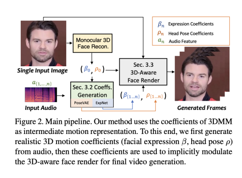
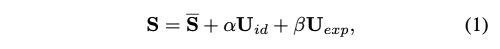
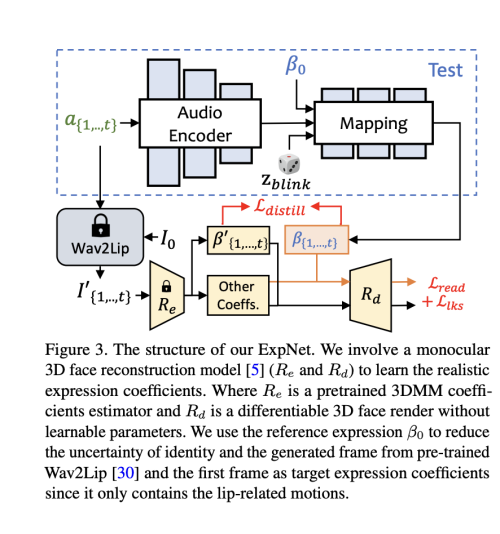
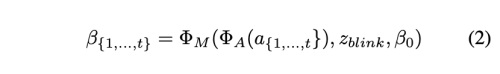
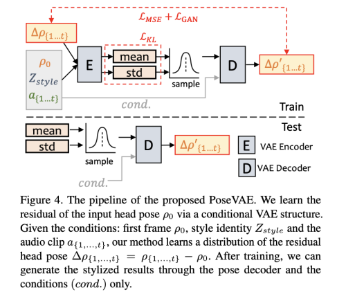
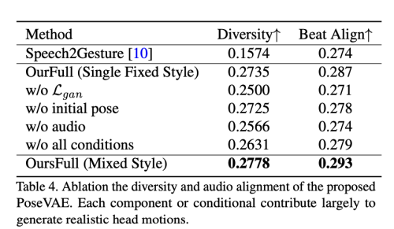
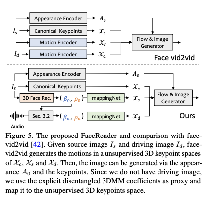
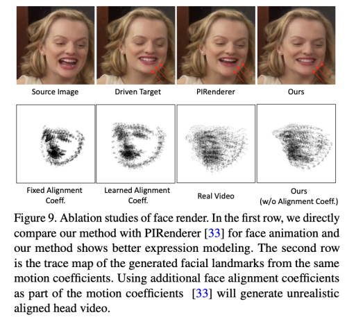
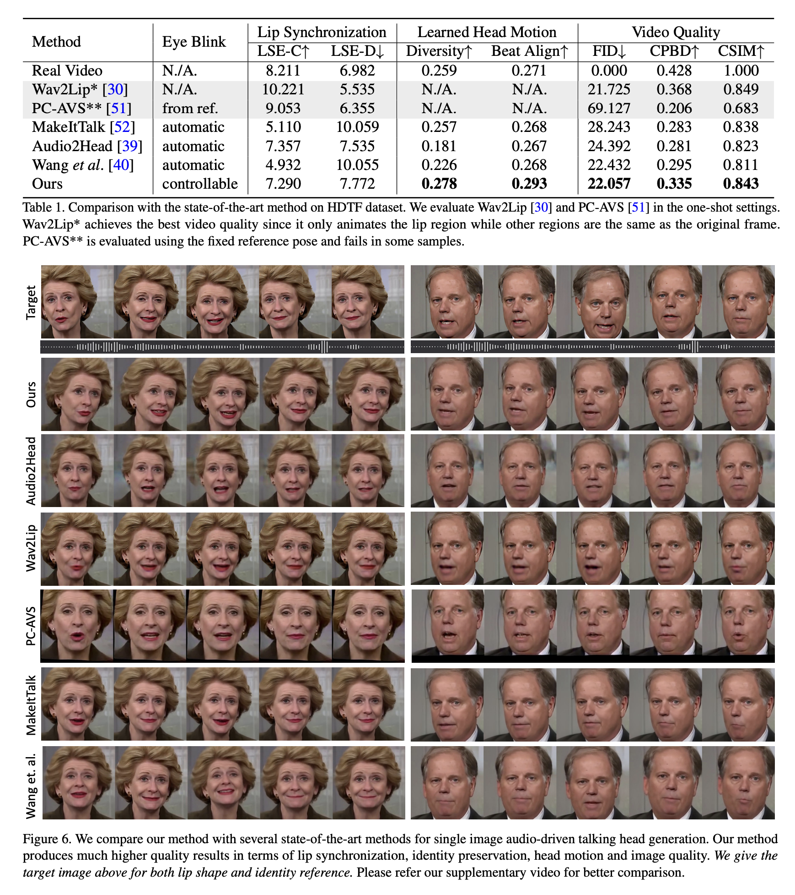

얼굴 이미지와 음성 오디오를 통해 말하는 머리 동영상을 생성하는 것은 여전히 많은 어려움을 포함하고 있습니다. 즉, 자연스럽지 않은 머리 움직임, 왜곡된 표정 및 정체성 수정 등의 문제가 있습니다. 이러한 문제들은 주로 결합된 2D 동작 필드에서 학습되는 것 때문이라고 주장합니다. 반면에 명시적으로 3D 정보를 사용하는 것도 표정이 뻣뻣하고 일관성 없는 비디오와 같은 문제점이 있습니다. 그래서 저자는 SadTalker를 제안합니다. 이는 음성에서 3DMM의 3D 동작 계수 (머리 자세, 표정)를 생성하고 새로운 3D 인식 얼굴 렌더링을 암시적으로 변조하여 말하는 머리를 생성합니다. 현실적인 동작 계수를 학습하기 위해 음성과 다양한 유형의 동작 계수 간의 연결을 명시적으로 모델링합니다. 정확한 얼굴 표정을 학습하기 위해 ExpNet을 제시하며 이는 계수와 3D로 렌더링된 얼굴을 모두 압축합니다. 머리 자세의 경우, 다양한 스타일로 머리 움직임을 합성하기 위한 조건부 VAE를 사용한 PoseVAE를 설계합니다. 마지막으로 생성된 3D 동작 계수는 제안된 얼굴 렌더의 비지도 학습 3D 키포인트 공간으로 매핑되어 최종 비디오를 합성합니다. 또한 저자의 방법이 동작 및 비디오 품질 측면에서 우수함을 입증하기 위해 포괄적인 실험을 실시했습니다.

이 논문의 주요 기여는 다음과 같이 요약될 수 있습니다:
• SadTalker를 제시합니다. 이는 생성된 현실적인 3D 동작 계수를 사용하여 스타일화된 오디오 기반 단일 이미지 애니메이션 시스템입니다.
• 음성에서 3DMM 모델의 현실적인 3D 동작 계수를 학습하기 위해 ExpNet 및 PoseVAE를 각각 제시합니다.
• 현실적인 말하는 머리 동영상을 생성하기 위해 신개념의 의미론적으로 분리된 3D 인식 얼굴 렌더링을 제안합니다.
• 실험 결과, 이 방법이 동작 동기화와 비디오 품질 측면에서 최고 수준의 성능을 달성함을 보여줍니다.

[Code Link](https://github.com/OpenTalker/SadTalker)
[Paper Link](https://arxiv.org/pdf/2211.12194.pdf)

## Related Works

### Audio-driven Single Image Talking Face Generation

이전 연구들은 주로 perception discriminator를 사용하여 정확한 입술 움직임을 생성하는 데 중점을 두었습니다. 실제 비디오에는 많은 다양한 움직임이 포함되어 있기 때문에 ATVGnet은 중간 표현으로 얼굴 랜드마크를 사용하여 비디오 프레임을 생성합니다. 비슷한 접근 방식은 MakeItTalk에서도 제안되었는데, 이는 입력 오디오 신호에서 내용과 스피커 정보를 분리합니다. 얼굴 랜드마크는 여전히 높은 상호 연관성을 가진 공간이기 때문에 분리된 공간에서 말하는 머리를 생성하는 것이 최근에도 인기가 있습니다. PC-AVS는 암묵적 잠재 코드를 사용하여 머리 자세와 표정을 분리합니다. 그러나 저해상도 이미지만 생성할 수 있으며 다른 비디오에서 제어 신호가 필요합니다. Audio2Head는 비디오 주도 방법에서 영감을 얻어 말하는 머리 얼굴을 생성합니다. 그러나 이러한 머리 동작은 여전히 생생하지 않으며 정확하지 않은 정체성으로 왜곡된 얼굴을 생성합니다. 이전 연구들은 중간 표현으로 3DMM을 사용하지만, 여전히 부정확한 표정과 뚜렷한 아티팩트 문제를 겪습니다.

### Audio-driven Video Portrait.

저자의 task는 비주얼 더빙과 관련이 있습니다. 이는 음성을 통해 portrait 영상을 편집하는 것을 목표로 합니다. 오디오 주도의 단일 이미지 talking face 생성과는 달리, 이 작업은 일반적으로 특정 비디오에서 훈련되고 편집되어야 합니다. 이러한 방법들은 일반적으로 딥 비디오 portrait 의 이전 작업을 따르며, 얼굴 재구성과 애니메이션에 3DMM 정보를 활용합니다. AudioDVP, NVP, AD-NeRF는 표현을 다시 연기하여 입 모양을 편집하는 것을 학습합니다. 입술 움직임 이상으로 머리 움직임, 감정적인 말하는 얼굴 또한 관심을 받습니다. 3DMM 기반의 방법은 비디오 클립에서 3DMM 매개 변수를 적합시키는 것이 실용적이기 때문에 이러한 작업에서 중요한 역할을 합니다. 이러한 방법들은 개인화된 비디오에서 만족스러운 결과를 얻지만, 임의의 사진 및 야외 환경의 오디오에 적용할 수 없습니다.

### Video-Driven Single Image Talking Face Generation

이 작업은 얼굴 재연 또는 얼굴 애니메이션으로도 알려져 있으며, 소스 이미지의 움직임을 대상 인물로 전달하는 것을 목표로 합니다. 이는 최근에 널리 연구되었습니다. 이전 연구들은 소스 이미지와 대상에서 공유 중간 움직임 표현을 학습합니다. 이는 대략적으로 랜드마크 및 비지도식 랜드마크 기반 방법, 3DMM 기반 방법 및 잠재적인 애니메이션으로 나눌 수 있습니다. 이 작업은 저자의 작업보다 훨씬 더 쉽습니다. 왜냐하면 동일한 도메인 내의 움직임을 포함하기 때문입니다. 저자의 얼굴 렌더링은 또한 비지도식 랜드마크 기반 방법 및 3DMM 기반 방법의 방법에서 영감을 받아 학습한 계수를 매핑하여 실제 비디오를 생성합니다. 그러나 이들은 현실적인 움직임 계수를 생성하는 데 중점을 두지 않습니다.

## Method

그림 2에 나와 있는 것처럼, 저자의 시스템은 Talking Face 생성을 위한 중간 표현으로 3D 동작 계수를 사용합니다. 먼저 원본 이미지에서 이 계수들을 추출합니다. 그런 다음 ExpNet과 PoseVAE를 통해 현실적인 3DMM 동작 계수를 개별적으로 생성합니다. 마지막으로 3D 인식 얼굴 렌더를 제안하여 Talking Face 비디오를 생성합니다. 아래에서는 3D 얼굴 모델에 대한 간단한 소개를 하고, 설계한 오디오 주도 동작 계수 생성과 계수 기반 이미지 애니메이터에 대해 간략하게 소개합니다.

### 1. Preliminary of 3D Face Model

실제 비디오는 3D 환경에서 촬영되기 때문에 생성된 비디오의 현실성을 향상시키기 위해 3D 정보가 중요합니다. 그러나 이전 연구들은 단일 이미지에서 정확한 3D 계수를 얻기 어려우며 고품질의 얼굴 렌더링을 설계하기도 어렵기 때문에 3D 공간에서의 고려가 거의 없었습니다. 최근의 단일 이미지 심층 3D 재구성 방법에서 영감을 받아 예측된 3D 모양 모델 (3DMMs)의 공간을 중간 표현으로 고려합니다. 3DMM에서 3D 얼굴 형태 S는 다음과 같이 분리될 수 있습니다:

여기서 S는 3D 얼굴의 평균 형태이며, U_id 와 U_exp는 LSFM 변형 모델의 identity와 표정의 orthonormal basis 입니다.

계수 alipa [dim=80]과 betal[dim=64]는 각각 개인의 정체성과 표정을 설명합니다. 자세 변동을 보존하기 위해 계수 r과 t[dim=3]는 머리의 회전과 이동을 나타냅니다. 정체성과 관련 없는 계수 생성을 달성하기 위해 저자는 운동 매개변수 (b, r, t)만을 모델링합니다. 앞에서 소개한 대로 driving audio에서 머리 자세 p= [r, t] 및 표정계수 b를 개별적으로 학습합니다. 그런 다음 이런 동작계수는 최종 비디오 합성을 위해 얼굴 랜더를 암묵적으로 변조하는 데 사용합니다.

### 2. Motion Coefficients Generation through Audio

위에서 소개한 대로, 3D 동작 계수에는 머리 자세와 표정이 모두 포함되어 있습니다. 여기서 머리 자세는 전역적인 움직임이며 표정은 상대적으로 지역적입니다. 따라서 모든 것을 동시에 학습하면 머리 자세는 오디오와 상대적으로 약한 관계를 가지지만 입술 움직임은 높은 연관성이 있기 때문에 네트워크에서 큰 불확실성을 일으킬 것입니다. 제안된 PoseVAE와 ExpNet을 사용하여 머리 자세와 표정의 동작을 생성합니다. 이에 대해 아래에서 간략히 소개합니다.

#### ExpNet

음성으로부터 정확한 표정 계수를 생성하는 일반적인 모델을 학습하는 것은 두 가지 이유로 매우 어렵습니다: 1) 다른 신원에 대해 오디오에서 표정으로의 매핑은 일대다 매핑이 아닙니다. 2) 표정 계수에는 오디오와 무관한 일부 움직임이 있어 예측 정확도에 영향을 미칩니다. 저자의 ExpNet은 이러한 불확실성을 줄이기 위해 설계되었습니다. 정체성 문제에 대해서는 첫 프레임의 표정 계수 `b0`를 통해 표정 움직임을 특정 인물에 연결합니다. 자연스러운 대화에서 다른 얼굴 구성 요소의 움직임 가중치를 줄이기 위해 입술 움직임만 계수 대상으로 사용하며, 이는 Wav2Lip 및 심층 3D 재구성의 사전 훈련된 네트워크를 통해 이루어집니다. 그런 다음 렌더링된 이미지에 대한 추가적인 랜드마크 손실을 통해 다른 미세한 얼굴 움직임 (예: 눈 깜빡임)을 활용할 수 있습니다.

그림 3에 나와 있는 것처럼, 우리는 t-프레임 표정 계수 b를 오디오 창 a{1,..,t}에서 생성합니다. 각 프레임의 오디오 특성은 0.2초의 멜 스펙트로그램입니다. 훈련을 위해 먼저 ResNet 기반의 오디오 인코더 A를 설계하여 오디오 특성을 잠재 공간에 포함시킵니다. 그런 다음 선형 레이어가 매핑 네트워크 M으로 추가되어 표정 계수를 디코딩합니다. 여기서 위에서 논의한대로 정체성 불확실성을 줄이기 위해 참조 이미지에서 참조 표정 `b0`을 추가합니다. 훈련에서는 입술 전용 계수를 실제 값으로 사용하기 때문에 눈 깜빡임을 조절할 수 있는 블링킹 제어 신호 zblink [0, 1]와 해당하는 눈 랜드마크 손실을 명시적으로 추가합니다. 형식적으로 네트워크는 다음과 같이 작성될 수 있습니다.

손실 함수로서, 먼저 입술 전용 표정 계수 `Re(Wav2Lip(I0, a{1,...,t}))`와 생성된 `b{1,...,t}` 간의 차이를 평가하는 L_distill을 사용합니다. 여기서 wav2lip의 첫 번째 프레임 I0만 사용하여 입술 싱크 비디오를 생성하며, 이로써 자세 변이 및 입술 이외의 다른 얼굴 표현의 영향을 줄입니다. 또한 미분 가능한 3D 얼굴 렌더 `Rd`를 사용하여 명시적 얼굴 동작 공간에서 추가적인 지각 손실을 계산합니다. 그림 3에 나와 있듯이 랜드마크 손실 L_lks를 계산하여 눈 깜빡임의 범위와 전체적인 표정 정확도를 측정합니다. 사전 훈련된 입술 판독 네트워크 reader도 시간적 입술 판독 손실 L_read로 사용되어 지각적 입술 품질을 유지합니다.

#### PoseVAE

그림 4에 나와 있는 것처럼, VAE 기반의 모델이 디자인되어 실제 말하는 비디오의 현실적이고 정체성을 고려한 스타일화된 머리 움직임 p [dim=6]을 학습합니다. 훈련에서 PoseVAE는 고정된 n 프레임에서 인코더-디코더 기반 구조를 사용하여 훈련됩니다. 인코더와 디코더는 모두 두 개의 레이어로 된 MLPs로, 입력에는 연속된 t-프레임의 head pose가 포함되어 있으며 이를 가우시안 분포로 임베딩합니다. 디코더에서는 네트워크가 샘플링된 분포에서 t-프레임 자세를 생성하도록 학습됩니다. 저자의 PoseVAE는 자세 조건 `p0` 의 첫 번째 프레임의 잔차를 학습함으로써 첫 번째 프레임의 조건 하에서 테스트에서 더 긴, 안정적이고 연속적인 머리 움직임을 생성할 수 있게 합니다. 또한 CVAE에 따라 리듬 인식 및 정체성 스타일을 위한 조건으로 해당 오디오 특성 `a{1,...,t}` 과 스타일 정체성 `Z_style` 을 추가합니다. KL-다이버전스 L_KL은 생성된 움직임의 분포를 측정하는 데 사용됩니다. 평균 제곱 손실 L_MSE 및 적대적 손실 L_GAN은 생성된 품질을 보장하기 위해 사용됩니다.

제안된 PoseVAE를 동작 다양성과 오디오 비트 정렬 측면에서 평가합니다. 표 4에 나와 있듯이 기준이 된 Speech2Gesture도 자세 평가에서 성능이 낮습니다. 여러 신원 스타일 레이블이 포함되어 있기 때문에 다른 구성 요소를 더 잘 평가하기 위해 먼저 평가를 위해 전체 방법의 고정된 원핫 스타일에서 속성 연구를 수행합니다 (OurFull, Single Fixed Style). 이 설정에서 각 조건은 다양성과 비트 정렬 측면에서 전반적인 동작 품질에 도움이 됩니다. 또한 무작위로 선택된 정체성 레이블을 스타일로 사용하고 더 나은 다양성 성능을 보이는 저자의 전체 방법의 혼합 스타일의 결과를 보고합니다.

### 3. 3D-aware Face Render

현실적인 3D 동작 계수를 생성한 후, 잘 설계된 3D 인식 이미지 애니메이터를 통해 최종 비디오를 렌더링합니다. 우리는 최근 이미지 애니메이션 방법 face-vid2vid에서 영감을 얻었습니다. 이 방법은 단일 이미지에서 3D 정보를 암묵적으로 학습합니다. 그러나 실제 비디오가 이 방법에서 동작 신호로 사용되어야 합니다. 저자의 얼굴 렌더는 3DMM 계수를 통해 동작 가능하게 만듭니다. 그림 5에 나와 있는 것처럼, mappingNet을 제안하여 명시적 3DMM 동작 계수 (머리 자세 및 표정)와 암묵적인 비지도 3D 키포인트 간의 관계를 학습합니다. mappingNet은 여러 개의 1D Conv 레이어로 구성됩니다. PIRenderer와 같이 평활화를 위해 시간 창에서의 시계열 계수를 사용합니다. 하지만 PIRenderer에서의 얼굴 정렬 동작 계수는 오디오 주도 비디오 생성의 동작 자연스러움에 크게 영향을 미침을 발견하고 섹션 4.4에서 실험을 제공합니다. 저자는 표정과 머리 자세의 계수만 사용합니다.

훈련 부분에서, 저자의 방법은 두 단계로 이루어져 있습니다. 먼저, 원래 논문에서와 같이 face-vid2vid를 self-supervised 방식으로 훈련합니다. 두 번째 단계에서는 모양 인코더, 정규화된 키포인트 추정기, 이미지 생성기의 모든 매개 변수를 동결하고 조정을 위해 사용합니다. 그런 다음 3DMM 계수를 사용하여 GT 비디오의 3DMM 계수를 기반으로 매핑 넷을 훈련합니다. 비지도 학습 키포인트 도메인에서 L1 손실을 사용하여 지도를 제공하고 최종 생성된 비디오는 원래 구현을 따릅니다.

저자는 제안된 얼굴 렌더링에 대한 속성 연구를 두 가지 측면에서 진행합니다. 한편으로는 PIRenderer를 사용하여 저자의 방법의 재구성 품질을 보여줍니다. 두 방법 모두 3DMM을 중간 표현으로 사용하기 때문입니다. 그림 9의 첫 번째 행에 나와 있는 것처럼, 제안된 얼굴 렌더링은 희소한 비지도 키포인트의 매핑 덕분에 더 나은 표현 재구성 품질을 보여줍니다. 정확한 표현 매핑은 입술 동기화를 달성하기 위한 핵심 요소입니다. 게다가 PIRenderer에서 사용된 추가 정렬 계수로 인한 자세의 불자연스러움을 평가합니다. 그림 9의 두 번째 행에 나와 있는 것처럼, 동일한 머리 자세와 표정 계수로 생성된 비디오의 랜드마크의 추적 맵을 그립니다. 고정 또는 학습 가능한 자르기 계수 (poseVAE의 일부로서의 자세 계수)를 사용하면 자연스러운 비디오로 이상하게 생성됩니다. 이를 제거하고 머리 자세와 표정을 직접 조절 매개 변수로 사용하여 더 현실적인 결과를 보여줍니다.

## Experiments

### 1. Implementation Details and Metrics

#### Datasets

훈련을 위해 VoxCeleb 데이터셋을 사용했는데, 이 데이터셋에는 1,251명의 주체에 대한 100,000개 이상의 비디오가 포함되어 있습니다. 이전 이미지 애니메이션 방법을 따라 원본 비디오를 잘라내고 비디오 크기를 256×256으로 조정했습니다. 전처리 후 데이터는 FaceRender를 훈련하는 데 사용됩니다. VoxCeleb에서 일부 비디오와 오디오가 정렬되어 있지 않기 때문에 46명의 주체의 1,890개의 정렬된 비디오와 오디오를 선택하여 PoseVAE와 ExpNet을 훈련했습니다. 입력 오디오는 16kHz로 다운샘플링되었으며 Wav2lip과 동일한 설정으로 멜 스펙트로그램으로 변환되었습니다. 테스트하기 위해 HDTF 데이터셋에서 346개의 비디오 중 처음 8초의 비디오 (총 70,000프레임)를 사용했습니다. 이 데이터셋은 고해상도이며 자연스러운 대화 머리 비디오를 포함하고 있습니다. 이 비디오들은 또한 평가를 위해 256×256으로 크기가 조정되었습니다. 여기서 각 비디오의 첫 프레임을 참조 이미지로 사용하여 비디오를 생성했습니다.

#### Implementation Details

ExpNet, PoseVAE 및 FaceRender는 모두 별도로 훈련되며 모든 실험에 Adam 옵티마이저를 사용합니다. 훈련 후 어떠한 수동적인 개입 없이 end-to-end 방식으로 추론될 수 있습니다. 모든 3DMM 매개 변수는 사전 훈련된 심층 3D 얼굴 재구성 방법을 통해 추출됩니다.  학습은 총 8대의 A100 GPU에서 수행했습니다. ExpNet, PoseVAE 및 FaceRender 각각의 learning rate은 2e-5, 1e-4, 2e-4 입니다. 시간적 고려에 대해서는 ExpNet은 연속된 5 프레임을 사용하여 학습합니다. PoseVAE는 연속된 32 프레임을 통해 학습됩니다. FaceRender의 프레임은 안정성을 위해 연속된 5개 프레임의 계수로 프레임 단위로 생성됩니다.

#### Evaluation Metrics

이전 연구에서 널리 사용된 여러 평가 메트릭을 사용하여 저자의 방법의 우수성을 입증합니다. Frechet Inception Distance (FID) 와 cumulative probability blur detection (CPBD)를 사용하여 이미지의 품질을 평가합니다. 여기서 FID는 생성된 프레임의 현실감을, CPBD는 생성된 프레임의 날카로움을 평가합니다. 정체성 보존을 평가하기 위해 소스 이미지와 생성된 프레임 간의 정체성 임베딩의 코사인 유사도 (CSIM)를 계산합니다. 여기서 이미지의 정체성 임베딩을 추출하기 위해 ArcFace를 사용합니다. 입술 동기화와 입 모양을 평가하기 위해 Wav2Lip의 입 모양의 지각적 차이인 거리 점수 (LSE-D)와 신뢰 점수 (LSE-C)를 계산합니다. 또한 생성된 프레임의 머리 움직임을 평가하기 위해 몇 가지 메트릭을 수행합니다. 생성된 머리 움직임의 다양성을 위해 생성된 프레임에서 Hopenet을 사용하여 추출한 머리 움직임 특성 임베딩의 표준 편차를 계산합니다. 오디오와 생성된 머리 움직임의 정렬을 평가하기 위해 Bailando에서와 같이 비트 정렬 점수를 계산합니다.

## 2. Compare with other state-of-the-art methods

