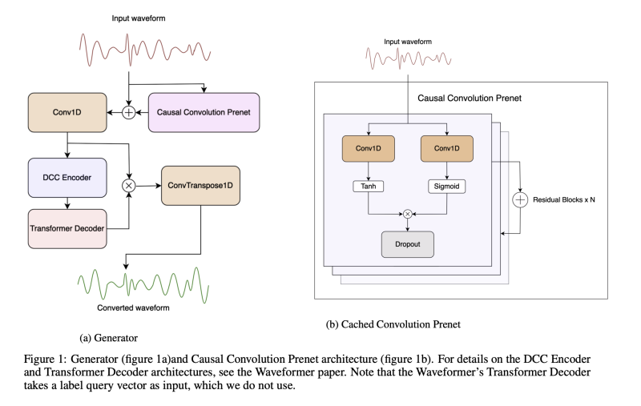

저자는 이전의 오디오 조작 및 생성 신경망 아키텍처를 실시간 음성 변환 작업에 적용하였습니다. 결과로 나온 LLVC (Low-latency Lowresource Voice Conversion) 모델은 16kHz의 비트레이트에서 20ms 미만의 지연 시간을 가지며 소비자용 CPU에서 거의 2.8배 빠르게 실행됩니다. LLVC는 생성적 적대 신경망 아키텍처와 Knowledge Distillation를 모두 사용하여 이러한 성능을 달성합니다. 저자의 주장을 따르면 LLVC가 오픈 소스 음성 변환 모델 중에서 가장 낮은 자원 사용량과 지연 시간을 달성한 것입니다.

[Paper Link](https://arxiv.org/pdf/2311.00873v1.pdf)
[Code Link](https://github.com/KoeAI/LLVC)

## Introduction

음성 변환의 핵심적인 어려움은 대상 화자와 유사성을 보장하고 자연스럽게 들리게 만드는 것입니다. 실시간 음성 변환은 기존의 고품질 음성 합성 네트워크에는 부적합한 추가적인 어려움을 제공합니다. 네트워크는 실제 시간보다 빠르게 작동할 뿐만 아니라 낮은 지연 시간으로 작동해야하며 미래의 오디오 내용에 최소한의 액세스로 작동해야합니다. 마지막으로, 대중적인 소비자 사용을 목적으로 하는 실시간 음성 변환 네트워크는 저자원 계산 환경에서도 작동할 수 있어야 합니다.

본 논문은 Waveformer 아키텍처를 기반으로 한 any-to-one 음성 변환 모델을 제안합니다. Waveformer는 실시간 음향 추출을 수행하도록 설계되었지만, LLVC는 여러 화자의 음성으로 구성된 인공 병렬 데이터셋에서 훈련되었으며, 이 데이터셋은 모두 하나의 목표 화자처럼 들리도록 변환되었습니다. 이는 모델 출력과 합성된 대상 음성 간의 인지 가능한 차이를 최소화하기 위한 목적입니다. LLVC는 소비자용 CPU에서 최대 20ms의 지연 시간으로 음성을 스트리밍 방식으로 변환할 수 있는 최초의 오픈 소스 모델로 제시됩니다.

## Related Work

### 1. Voice Conversion

음성 변환의 초기 접근 방식은 가우시안 혼합 모델을 사용했으며, 더 최근의 접근 방식은 인공 신경망을 사용하며 현대적인 아키텍처에는 일반적으로 변이형 오토인코더(VAE)와 생성적 적대 신경망(GANs)이 포함됩니다. 최근의 접근 방식은 일반적으로 병렬이 아닌 데이터셋에서 작동하도록 만들어졌는데, 이는 화자들이 동일한 발언을 수행할 필요가 없는 데이터셋을 의미합니다. 이는 주로 아키텍처 내의 병목 형태로 이루어지며, 예를 들어 VAE의 병목이나 적응형 인스턴스 정규화, k-최근접 이웃 또는 콘텐츠와 스타일을 분리하는 미리 훈련된 모델을 포함하여 이루어집니다. 이러한 모델에는 자동 음성 인식(ASR) 또는 음성 후방그램 (PPGs)과 같은 것들이 있습니다.

### 2. Real-time Voice Conversion

고객용 하드웨어에서 실시간 변환이 가능하도록 동작하는 여러 음성 변환 아키텍처가 존재합니다. MMVC1, so-vits-svc2, DDSP-SVC3 및 RVC4는 Github의 인기 있는 실시간 음성 변환 애플리케이션 저장소에 포함되어 있습니다.

그러나 이러한 아키텍처들은 모두 low-latency 스트리밍 오디오에서 작동하도록 훈련되지 않았습니다. 단순히 오디오의 짧은 순차 세그먼트를 변환하는 것은 지각적으로 저하된 출력물을 결과로 낳으므로, 네트워크는 대신 이전 오디오 콘텍스트를 접두사로 사용하여 스트리밍 작업에 적응되었으며, 계산 효율성을 희생하여 변환 품질을 향상시켰습니다.

QuickVC는 CPU에서 효율적으로 작동할 수 있으며 위에서 언급한 아키텍처와 동일한 프로세스를 사용하여 실시간 변환에 적응시킬 수 있습니다. 그럼에도 불구하고 스트리밍 전용 아키텍처의 부재로 인해 이 모델은 이전에 언급한 모델과 동일한 품질과 효율성의 트레이드오프의 대상이 됩니다.

상기 모델들은 VITS에서 영감을 받은 인코더-디코더 구조를 공유합니다. 인코더는 일반적으로 pitch 및 timbre와 같은 입력 화자 특성을 인코딩하지 않고 음성 콘텐츠를 인코딩하기 위해 설계된 contentvec 또는 hubert-soft와 같은 미리 훈련된 인코더로 구성됩니다. MMVC, so-vits-svc, DDSP-SVC 및 RVC의 디코더는 HiFi-GAN의 아키텍처를 기반으로 하며, QuickVC는 역 고속 푸리에 변환 작업을 기반으로 한 보코더를 사용합니다.

### 3. Streaming Audio Processing

LPCNet 및 EnCodec과 같은 신경망 오디오 코덱은 저자원 스트리밍 환경에서 작동하도록 설계되었으며, 위에서 설명한 실시간 음성 변환 시스템과 유사한 인코더-디코더 구조를 가지고 있습니다. 그러나 이러한 오디오 코덱 인코더는 재구성된 오디오의 충실도를 보장하기 위해 음성 콘텐츠와 함께 입력 화자 신원을 보존하려고 합니다. 따라서 음성 변환 작업에는 적합하지 않습니다.

Waveformer의 인코더-디코더 아키텍처는 입력 오디오를 수정하기 위해 마스크를 생성하여 입력 오디오 신호에 추가하여 훈련 세트에 있는 특정 유형의 소리를 분리하는 데 사용됩니다. 예를 들어 어쿠스틱 기타, 기침, 총소리 등이 있습니다. 인코더의 초기 convolution은 약간의 컨텍스트에 액세스할 수 있도록 하지만 인코더의 dilated casual convolution (DCC) 및 디코더에서 현재 및 과거 토큰에만 주의를 기울이는 마스크 트랜스포머를 통해 모델의 추론이 주로 과거 데이터에 기반함을 보장합니다. 이는 미래 컨텍스트를 필요로 하는 추가 지연을 도입하는 스트리밍 환경에 매우 적합하게 만듭니다. 또한 인코더와 디코더의 인과성 특성은 중간 계산을 미래 추론 단계에 캐시할 수 있게 해주어 네트워크가 전체 컨텍스트를 네트워크의 모든 부분을 통과시키지 않아도 과거 컨텍스트에 액세스할 수 있게 하며, 추론 속도를 높입니다.

### 4. Knowldege Distillation

딥 러닝 분야에서의 모델 증류는 더 크고 복잡한 "선생님" 모델을 활용하여 더 작고 간단한 "학생" 모델의 훈련을 보완하는 과정을 말합니다. 이 방법론은 복잡한 신경망 아키텍처의 예측 능력을 활용하면서 특히 계산 리소스가 부족한 상황이나 모바일이나 에지 장치와 같이 실시간 응답이 필요한 경우와 같이 계산 효율성을 보장하기 위한 것입니다. 최근에는 큰 소유 모델의 고품질 출력을 사용하여 작은 오픈 소스 언어 모델에 지시 튜닝을 수행하는 방법으로 큰 효과를 냈습니다.

전통적인 Distillation 과정은 일반적으로 큰 크기나 느슨한 훈련 제약조건으로 특징 지어지는 선생님 모델이 특정 작업을 수행하도록 주어진 데이터셋을 사용하여 훈련된 다음, 학생 모델을 훈련하여 선생님의 출력 분포를 모방하도록 합니다. 종종 소프트맥스 함수에서 high temperature를 사용하여 더 디테일 한 정보를 가질 수 있도록 강조됩니다. 이느 단순한 hard label 보다 미묘한 정보를 더 포함하기 위한 것입니다.

비병렬 데이터의 경우, 모델 distillation의 영역은 혁신적인 패러다임으로 확장됩니다. 선생님 모델은 비병렬 데이터에서 훈련되며, 그 크고 복잡한 아키텍처를 활용하여 본질적으로 구조화되지 않고 정렬되지 않은 데이터에서 표현을 쓸어 모읍니다. 이후에는 선생님의 습득한 지식을 기반으로 합성 병렬 데이터셋이 공학적으로 구성되며, 이 데이터셋이 다시 학생 모델의 훈련 데이터로 사용됩니다.

역사적으로 병렬 화자 데이터셋을 만드는 것은 발음을 시간에 맞추는 등의 추가적인 어려움을 동반하여 어려웠습니다. 그러나 현대 음성 변환 네트워크의 품질은 이제 높아져 인공적으로 만들 수 있습니다. 기존의 any-to-one 또는 any-to-many 음성 변환 네트워크를 사용하여 시간에 맞춘 병렬 음성 데이터셋을 생성함으로써 이를 수행할 수 있습니다. 이러한 인공 데이터셋은 입력과 출력 쌍을 증가시킴으로써 임의의 크기로 확장할 수 있습니다. 병렬 데이터셋을 획득한 후에는 이 데이터셋에서 더 적은 매개변수와 더 적은 아키텍처 복잡성이 필요한 더 작은 모델을 훈련시킬 수 있습니다.

## LLVC

### 1. Architecture

저자가 제안한 모델은 Generator과 Discriminator로 구성되어 있습니다.

#### Generator

저자의 생성자는 [Waveformer](https://arxiv.org/pdf/2211.02250.pdf)의 스트리밍 인코더-디코더 모델에서 파생되었습니다. Waveformer의 512-dim 인코더와 256-dim 디코더를 모델의 기본으로 채택했지만 인코더 깊이를 10에서 8로 줄이고, 추론 지연 시간과 계산 속도를 낮추기 위해 미리 볼 수 있는 양을 16 샘플로 줄였습니다. 음성 모델링 및 개선을 위한 U-Net의 성공을 기반으로하여 원래 모델을 casual Convolution으로 구성된 prenet을 prefix로 붙였습니다.

##### (reference) WaveFormer

이는 실시간 및 스트리밍 대상 소리 추출을 달성한 최초의 신경망 모델입니다. 이 아키텍처는 인코더로서 dilateds casual convolution layer의 스택을 사용하고 디코더로서 트랜스포머 디코더 레이어를 사용합니다. 이 하이브리드 아키텍처는 계산적으로 효율적인 방식으로 큰 수용 영역을 처리하기 위해 다시 dilated casual convolution을 사용하면서 트랜스포머 기반 아키텍처의 일반화 성능을 활용합니다. 평가 결과, 이 작업을 위한 이전 모델과 비교하여 SI-SNRi에서 최대 2.2-3.3 dB의 향상이 있었으며 모델 크기는 1.2-4배 작아지고 실행 시간은 1.5-2배 낮아졌습니다.

#### Discriminator

VITS의 multi-period discriminator의 구조를 체택하였습니다. 여기서 Discriminator의 period는 [2, 3, 5, 7, 11, 17, 23, 37]이며, 이는 RVC의 v2 discriminator에서 영감을 받았습니다.

### 2. Dataset

LibriSpeech 깨끗한 360시간 훈련 데이터를 모델의 입력으로 사용합니다. 이 데이터셋은 다양한 발음 특성을 가진 922명의 영어 화자가 독립적으로 녹음한 오디오로 구성되어 있으며, 따라서 any-to-one 음성 변환 시스템에 대한 합리적인 출발점입니다. 이 데이터셋에서 2%의 파일은 검증을 위해 훈련 세트에서 제외됩니다. 또한 360시간 분할에서 별개의 화자 집합을 포함하는 dev-clean 분할을 추가로 사용하여 미처 보지 못한 입력 화자에 대한 변환을 확인합니다.

LibriSpeech 파일을 변환하여 하나의 목표 화자 스타일로 병렬 문장을 생성합니다. 이를 위해 librivox.org 웹사이트에서 얻은 LibriSpeech 화자 8312의 오디오 39분을 사용하여 훈련된 RVC v2 모델을 사용합니다. 목표 화자 데이터에 대해 325 epoch 동안 32k RVC (Retrieval based Voice Conversion) v2 베이스 모델을 세밀하게 조정하며, 이 때 RMVPE 피치 추출 방법을 사용합니다. 전형적인 RVC 파이프라인에는 인코딩된 입력 화자 데이터가 인덱스된 참 값 데이터에서 검색한 인코딩된 목표 화자 데이터와 혼합되는 단계가 포함되어 있습니다. 그러나 이 단계를 생략하기로 선택했는데, 이로 인해 성능과 인식 가능성이 감소하지만 변환 품질이나 유사성이 향상되지 않았기 때문입니다. 또한 32kHz로 변환된 오디오를 16kHz로 다운샘플링하여 변환되지 않은 입력의 샘플 속도와 일치시킵니다.

### 3. Training

저자는 배치 크기 9로 단일 RTX 3090 GPU에서 3일 동안 500,000 단계 (53 epochs) 동안 모델을 훈련시켰습니다. AdamW 옵티마이저와 기울기 정규화를 1로 설정하여 지속적인 훈련을 안정화하기 위해 exponential 학습률 스케줄러를 사용했습니다. 학습률은 5e-4로 설정하고, 학습률 감소율을 0.999로, AdamW 모멘텀을 0.8로 0.999로 설정했으며, AdamW 엡실론을 1e-9로 설정했습니다.

#### Loss

저자의 판별자는 VITS의 판별자와 동일한 손실 함수를 사용합니다. 생성자는 VITS 생성자와 feature loss, mel spectrogram, 그리고 자기 지도 학습 기반의 음성 표현 손실들을 가중 평균으로 사용합니다. mel spectrogram loss은 VITS Mel Loss에서 파생되었지만, VITS 구현을 오디오 손실 라이브러리 auraloss의 다중 해상도 멜 스펙트로그램 손실로 대체했습니다. 자기 지도 학습 표현 손실은 Close 등(2023)의 연구에서 영감을 받았습니다. 이 연구에서는 미리 훈련된 fairseq HuBERT 기본 모델에 의해 인코딩된 특징 간의 L1 거리를 기반으로 한 손실이 음성 개선에 효과적임을 발견했습니다.

#### Inference

LLVC의 스트리밍 추론 절차는 Waveformer의 선조에 따르며 미래 예측을 위한 청크 기반 추론을 수행합니다. 하나의 청크는 dec_chunk_len * L 개의 샘플로 구성됩니다. 미래 예측을 위해 추가적으로 2L 개의 샘플을 필요로 하며, 이로 인해 총 대기 시간은 다음과 같이 계산됩니다:

`(dec_chunk_len * L + 2L)/F_s`

여기서 F_s는 오디오 샘플 속도를 나타냅니다(단위: Hz). 또한 N 개의 청크를 한 번에 실행하여 변환의 실시간 요소를 향상시키기 위해 대기 시간을 증가시킬 수도 있습니다.

## Experiments

위에서 설명한 아키텍처 외에도 저자는 모델의 두 가지 추가 변형을 훈련시켰습니다.

### 1. No Casual Convolution prenet

casual convolution prenet은 모델의 순방향 전달에 대한 지연을 추가하기 때문에 출력 품질에 미치는 영향을 테스트하기 위해 제거 실험을 수행했습니다. 하이퍼파라미터와 훈련 단계는 주 LLVC 모델과 동일합니다. 이 실험을 LLVC-NC로 레이블 지었습니다.

### 2. Hifi-GAN Discriminator

VITS 판별자와 비교하여 HiFi-GAN 판별자는 더 작은 주기 크기에서 더 적은 다기간 하부 판별자를 사용하고 더 큰 주기 크기에서는 더 많은 다중 스케일 하부 판별자를 사용합니다. 저자는 훈련 배치 크기를 7로 줄였지만 그 외에는 하이퍼파라미터와 훈련 단계 수를 LLVC와 동일하게 유지했습니다. 이 실험을 LLVC-HFG로 레이블 지정했습니다.

## Results

저자는 CPU에서 추론 대기 시간을 최소화하는 기준으로 LLVC와 비교하기 위해 두 가지 모델을 선택했습니다.
• No-F0 RVC: 음 높이 추정은 RVC에 대한 성능 병목을 생성하지만, RVC 개발자들은 음 높이를 입력으로 사용하지 않는 사전 훈련된 모델을 제공합니다. 저자는 RVC v2 32k no-f0 모델을 8312 화자 데이터의 39분에 대해 300 epoch 동안 세밀하게 조정했습니다.
• QuickVC: 공식 저장소에서 링크된 사전 훈련된 QuickVC 모델을 8312 화자 데이터의 39분을 16kHz로 다운샘플링하여 100 에폭 동안 세밀하게 조정했습니다.

- All models were evaluated on a Intel(R) Core(TM) i9-10850K CPU @ 3.60GHz
- RTF (Real-time factor): seconds of speech generated in 1 second of wall time

- We followed Guo et al. (2023) to obtain Mean Opinion Scores (MOS) for naturalness and similarity to the target speaker of the converted speech. We recruited subjects on Amazon Mechanical Turk. 15 subjects evaluated naturalness of 4 utterances from the dataset and 4 converted utterances per model. 15 subjects individually evaluated the similarity of 2 utterances from the ground-truth dataset and the similarity of 4 converted utterances to 2 clips from the ground-truth dataset.

- We use the Resemblyze and WVMOS10 libraries in order to obtain metrics for target-speaker similarity and quality for the entire test-clean dataset. We obtain a baseline for comparison by evaluating 10 different 10-second clips from the ground truth against each other.

