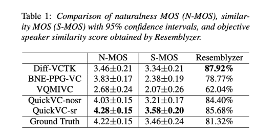

자동 음성 인식(ASR) 및 텍스트 음성 변환(TTS) 기술의 발전으로 원본 콘텐츠 정보와 대상 화자 정보를 추출하여 파형을 재구성함으로써 고품질 음성 변환(VC)이 가능해졌습니다. 그러나 현재의 방법들은 추론 속도 측면에서 여전히 개선이 필요합니다. 본 연구에서는 HuBERT-Soft 모델을 사용하여 화자 정보 없이 콘텐츠 정보 특성을 추출하는 가벼운 VITS 기반 VC 모델을 제안합니다. 합성 음성에 대한 주관적 및 객관적 실험을 통해 제안된 모델이 자연스럽고 유사성 측면에서 경쟁력 있는 결과를 보여줍니다. 중요한 점은 원래 VITS 모델과 달리 가장 계산 비용이 많이 드는 부분을 역 고속 푸리에 변환(iSTFT)으로 대체한다는 것입니다. 실험 결과 저자의 모델이 3090 GPU에서 5000 KHz 이상, i9-10900K CPU에서 250 KHz 이상의 샘플을 생성할 수 있음을 보여주며, 동일한 하드웨어 구성에서 경쟁력 있는 속도를 달성합니다.

[Paper Link](https://arxiv.org/abs/2302.08296)
[Code Link](https://github.com/quickvc/QuickVC-VoiceConversion)

## Introduction

음성 변환(VC)은 화자의 음성을 다른 화자의 음성으로 변환하면서 원본 의미와 내용을 보존하는 기술입니다. 본 논문에서는 특정 화자의 소스 음성 신호를 훈련 세트에 나타난 대상 화자의 음성으로 변환하는 어떠한-많은(Any-to-Many) 음성 변환을 목표로 합니다.

Any-to-Many VC의 전형적인 접근 방법은 특성 해체입니다. 음성의 내용 특성 정보와 화자 특성 정보를 따로 추출하여 음성을 재구성합니다. 이 방법의 결과는 얻은 내용 특성이 원래 화자의 특성 정보를 포함하지 않아야 하며 음성 내용에 대한 정보는 손실되지 않아야 합니다.

ASR 분야의 기술은 화자별 세부 정보를 무시하고 음성에서 언어적 내용을 추출하는 데 널리 사용됩니다. 음성학적 사후 확률 그램(PPGs)을 기반으로 한 VC는 많은 관심을 받고 있습니다. PPGs는 화자 독립적인 ASR 시스템의 중간 결과물로, 프레임 레벨에서 음운 클래스의 사후 확률을 나타냅니다. PPGs는 화자와 언어에 독립적이어서 VC에 적합합니다. 그러나 PPGs를 추출하는 데 사용되는 ASR 모델의 정밀도에 VC 모델의 정확도가 크게 의존합니다. ASR 외에도 TTS 방법에서의 전이 학습이 VC를 위한 언어적 표현을 얻기 위해 사용되었습니다. 그러나 이러한 방법들은 ASR이나 TTS 모델을 훈련시키기 위한 텍스트를 포함한 주석이 달린 대량의 데이터가 필요합니다.

또한 텍스트 주석이 필요 없는 데이터로서의 연구도 있습니다. 예를 들어, GAN 기반 모델인 Cyclegan-VC 및 StarGAN, 그리고 오토인코더인 AutoVC 등이 있습니다. 그러나 이러한 모델들이 생성하는 음성은 품질 면에서 비교적 부족한 편입니다.

최근에는 자기 지도 학습 (SSL) 모델을 사용하여 음성의 특성 벡터를 얻으려는 VC에 대한 많은 연구가 있었습니다. 이러한 특성 벡터에서 음성의 내용 표현을 얻음으로써 VC 또는 노래 음성 변환 (SVC)을 달성할 수 있습니다. 이러한 연구들은 품질 면에서 매우 우수한 결과를 얻으며 TTS 모델에 근접합니다.

TTS 모델의 발전은 내용 특성을 기반으로 한 고품질 음성 생성에 도움이 되었습니다. Tacotron2 및 Fastspeech와 같은 TTS 모델은 자연스러운 음성을 합성할 수 있는 능력을 갖고 있습니다. 이들은 VC 분야에도 적용되었습니다. 그러나 이러한 TTS 방법들은 두 단계로 이루어져 있으며 먼저 음향적 특성을 합성한 다음 예측된 음향적 특성에서 파형을 합성합니다. VITS는 적대적 훈련을 통해 재구성된 파형의 품질을 향상시키는 엔드투엔드 TTS 모델입니다. VITS를 VC에 적용함으로써 VC 모델과 보코더의 별도 훈련을 피할 수 있습니다.

고품질의 지각적 음성을 생성할 수 있는 VC 모델들이 있음에도 불구하고 고품질이면서 빠른 VC에 대한 연구가 아직 부족합니다. 실제로 실시간 VC를 달성하려면 입력 음성을 프레임 단위로 처리해야 하기 때문에 모델의 추론 속도가 실시간 VC에 중요합니다. 모델이 이를 빠르게 수행할수록 음성을 변환할 때 경험하는 지연이 적어집니다. 그러나 이전의 실시간 VC 연구는 합성된 음성의 자연스러움과 유사성 측면에서 충분히 좋지 않았습니다. 이제 고품질의 VC가 가능하다면 빠른 추론을 허용하면서도 고품질을 유지할 수 있는 VC 모델이 필요합니다.

## Method

### 1. Motivation and Strategy

QuickVC은 각각 VITS, Soft-VC, MSiSTFT-VITS에서 영감을 받았습니다. QuickVC의 기반은 VITS에서 유래했으며 variational 추론, normalizing flow, adverserial 훈련 과정을 채택한 것입니다. 빠른 추론을 위해 VITS를 VC 시스템의 기초로 선택한 이유는 탁월한 음성 합성을 생성할 수 있는 능력과 빠른 추론에 최적화된 비자기회귀적 설계 때문입니다. 그러나 VITS와 달리 QuickVC의 사전 인코더는 음운이 아닌 원시 파형을 입력으로 사용합니다. 사전 인코더는 HuBERT-Soft를 참조하여 화자 독립적인 내용 특성 정보를 얻습니다. 화자 임베딩은 화자 인코더에 의해 추출되어 다중 화자 VC를 수행합니다. 또한, QuickVC와 VITS의 디코더는 다릅니다. 더 빠른 추론을 위해 우리는 MS-iSTFT-VITS를 참조했는데, 이는 원래의 Hifigan 보코더 기반 디코더를 다중 스트림 iSTFTNet으로 대체한 단일 화자 TTS 모델입니다.

### 2. Model Architecture

QuickVC 모델은 화자 인코더, 사전 인코더, 사후 인코더, MS-iSTFT-디코더 및 판별자로 구성되어 있습니다. 여기서 사후 인코더와 판별자의 아키텍처는 VITS를 따릅니다. 이어지는 하위 섹션에서 사전 인코더, 화자 인코더 및 MS-iSTFT-디코더에 중점을 둘 것입니다.

#### Prior Encoder

사전 인코더는 [HuBERT-Soft](https://github.com/bshall/hubert), 콘텐츠 인코더 및 정규화 흐름으로 구성됩니다. 입력이 더 이상 텍스트가 아닌 음성이므로 VITS의 텍스트 인코더는 HuBERT-Soft 및 콘텐츠 인코더가 됩니다. HuBERT-Soft는 HuBERT-Base를 백본으로 사용하는 특성 추출기입니다. HuBERT-Soft는 원시 파형을 입력으로 받아 256차원의 콘텐츠 특성을 생성합니다. 콘텐츠 인코더는 VITS의 사후 인코더를 기반으로 합니다. 콘텐츠 인코더는 정규 사후 분포의 평균과 분산을 생성할 수 있습니다. 정규화 흐름은 VITS를 따르며 afine 결합 레이어의 스택입니다. 이 흐름은 화자 임베딩 `g`에 의존하여 사전 분포의 복잡성을 개선하여 any-to-many VC를 달성합니다.

#### Speaker encoder

화자 인코더는 발화에서 인코딩된 화자 표현을 생성합니다. 이는 모델의 나머지 부분과 함께 처음부터 훈련됩니다. 화자 인코더의 네트워크 구조에는 LSTM 구조의 한 레이어와 fully connected 레이어중 한 레이어가 포함되어 있습니다. 오디오 신호에서 멜 스펙트로그램을 추출하고 이를 화자 인코더의 입력으로 사용합니다. 이때 콘텐츠 인코더의 출력이 화자 정보를 포함하지 않는 것으로 가정합니다. 그런 다음 모델은 화자 인코더에서의 입력을 기반으로 누락된 화자 정보를 대체하여 음성을 합성합니다.

#### MS-iSTFT-Decoder

이전 연구에 따르면 VITS에서 디코더 모듈은 가장 큰 병목이라고 여겨집니다. VITS의 디코더 아키텍처는 HiFi-GAN 보코더를 기반으로 하며, 입력 음향 특성을 업샘플링하기 위해 반복 컨볼루션 기반 네트워크를 사용합니다. 저자는 MS-iSTFT-VITS에서의 디코더 아키텍처를 참조하는데, 디코더는 다음 단계를 순차적으로 수행합니다. 먼저 VAE 잠재 변수 z가 화자 임베딩 g에 의해 조건이 걸리고, 그런 다음 업샘플 컨볼루션 ResBlock의 시퀀스를 통해 업샘플링됩니다. 업샘플된 z는 각 서브밴드 신호의 크기와 위상 변수로 투사됩니다. 그런 다음 크기와 위상 변수를 사용하여 iSTFT 작업이 수행되어 각 서브밴드 신호가 생성됩니다. 마지막으로 이러한 서브밴드 신호들은 원본 신호의 샘플링 속도와 일치하도록 샘플 간에 제로를 삽입하여 업샘플링되며, 그런 다음 학습 가능한 합성 필터를 사용하여 전체 밴드의 파형으로 통합됩니다.

### 3. Training Strategy

#### Data Augmentation

원래의 Soft-VC에서는 HuBERT-Soft이 any-to-one VC 작업에 적용되었습니다. HuBERT-Soft으로 얻은 자기 지도 특성이 여전히 원래 화자의 특성을 포함하는지 조사하기 위해 저자는 훈련 데이터 세트에서 음성에 대한 스펙트로그램 크기 조정 (SR) 기반 데이터 증강을 수행했습니다. 데이터 증강 후에는 내용과 속도가 동일한 음성을 얻었지만 화자 톤이 다릅니다. 증강된 음성으로 훈련함으로써 모델의 콘텐츠 인코더가 변경되지 않은 내용 정보를 더 잘 추출하도록 학습할 것을 기대합니다.

#### Speaker encoder input

훈련 과정에서 먼저 화자 인코더에는 동일한 대상 화자의 다른 발화가 주어집니다. 이는 모델의 화자 인코더가 훈련 초기에 발화에서 화자 관련 정보를 따를 수 있도록 도와줍니다. 훈련의 마지막 단계에서는 대상 음성 입력을 사용하여 화자 인코더를 미세 조정하여 모델 출력이 참조 음성과 더 유사해지도록 합니다.

#### Training loss

VITS를 따라서 QuickVC 모델은 VAE와 Adversarial 학습을 합쳤습니다. 생성 부분 파트의 loss는 아래와 같이 표현될 수 있습니다.

L_recon은 reconstruction loss로 target mel-spectrogram 과 predicted mel-spectrogram 사이의 L1 loss 입니다.

L_kl 은 KL loss로 사전 확률 `p(z|c)`와 사후 확률 `p(z|x_lin)` 간의 KL divergence 입니다.

x_lin은 source speech의 linear spectrogram 입니다. f는 normalizing flow 입니다. condition c는 HuBERT-Soft로부터 추출된 source waveform의 content information 입니다.

L_adv는 adversarial loss, L_fm은 feature matching loss 로 이는 VITS와 동일합니다.

## Experiment

### Datasets

저자는 VCTK, LibriSpeech, 그리고 LJ Speech 데이터셋에서 실험을 수행합니다. 오직 VCTK 데이터셋만 훈련에 사용되며, 이 데이터셋은 다양한 억양을 가진 107명의 영어 화자로부터 44시간의 발화를 포함하고 있습니다. LibriSpeech와 LJ Speech 데이터셋을 소스 음성으로 사용하여 모델의 any-to-many VC 시나리오에서의 능력을 테스트합니다.

### Experimental Steps

저자의 실험에서는 16,000 Hz의 샘플링 속도를 사용했습니다. 화자의 발화를 무작위로 9:1 비율로 훈련 및 테스트 세트로 분할했습니다. 선형 스펙트로그램과 80 밴드 멜 스펙트로그램은 단기 푸리에 변환을 사용하여 계산되며, FFT, 창 크기 및 hop 크기는 각각 1280, 1280, 320으로 설정되었습니다. 모델은 단일 NVIDIA 3090 GPU에서 최대 600,000 단계까지 훈련되었으며 배치 크기는 64이고 최대 세그먼트 길이는 512 프레임입니다. MS-iSTFT-Decoder는 MS-iSTFT-VITS와 동일한 FFT 크기, hop 길이, 창 길이, 서브밴드 수 및 커널 크기를 사용합니다. 두 개의 residual 블록의 업샘플링 스케일은 [5,4]입니다. VITS와 동일한 가중치 감쇠 및 학습률로 AdamW 옵티마이저를 사용했습니다.

### Results

