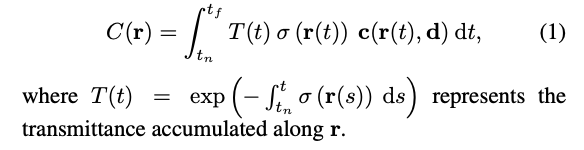
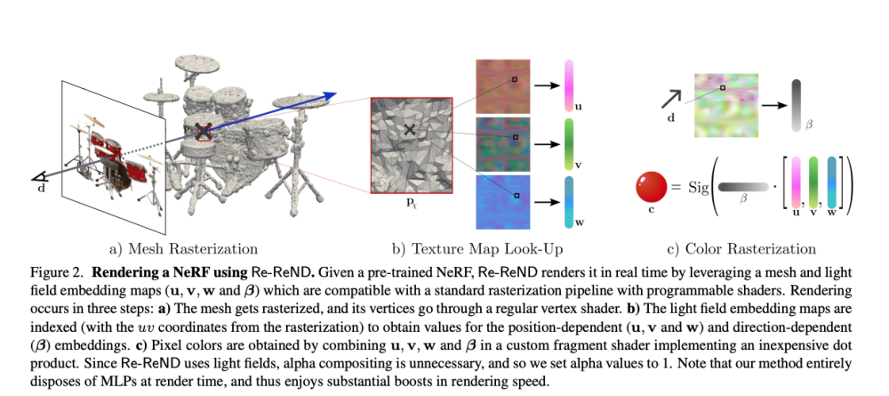
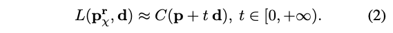
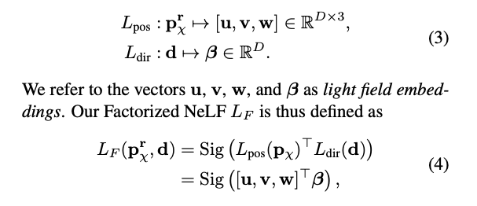
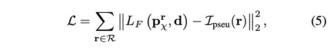
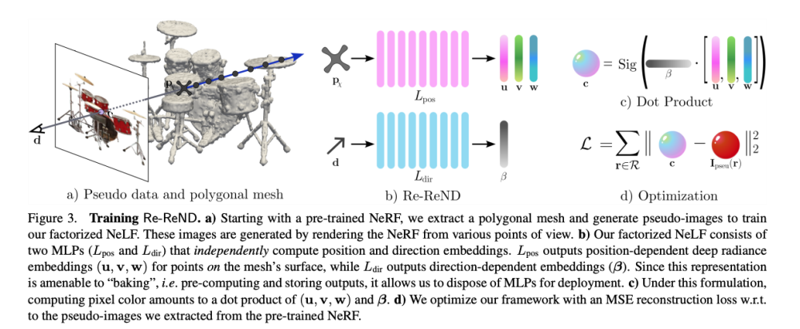
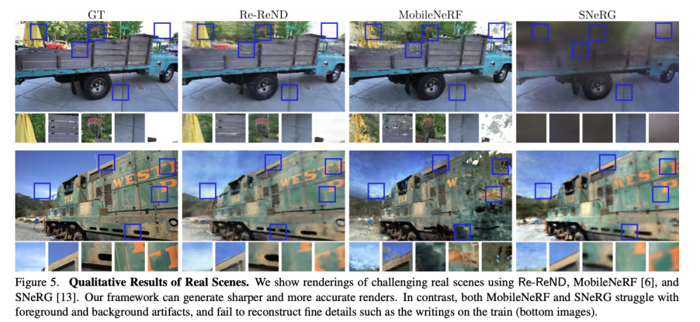
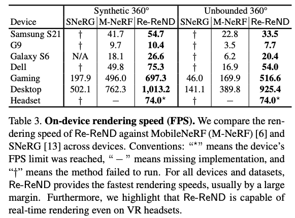

이 논문은 제한된 자원을 가진 기기에서 사전 훈련된 Neural Radiance Field (NeRF)을 실시간으로 렌더링하기 위한 새로운 접근 방식을 제안합니다. 우리는 Re-ReND를 소개합니다. 이는 여러 기기에서 NeRF를 실시간으로 렌더링할 수 있게 하는 방법입니다. Re-ReND는 표준 그래픽 파이프라인에서 효율적으로 처리될 수 있는 NeRF 표현으로 변환함으로써 실시간 성능을 달성하도록 설계되었습니다. 제안된 방법은 NeRF를 메시로 추출하여 학습된 밀도를 추출하는 동안, 학습된 색상 정보는 장면의 빛 필드를 나타내는 행렬 세트로 분해합니다. 분해는 비용이 적게 드는 MLP-free 행렬 곱셈을 통해 필드를 쿼리할 수 있게 하며, 빛 필드를 사용하면 픽셀을 렌더링하기 위해 필드를 여러 번 쿼리할 필요가 없습니다. 제안된 표현은 프래그먼트 셰이더를 사용하여 구현될 수 있으므로 표준 래스터화 프레임워크와 직접 통합될 수 있습니다. 이 논문의 유연한 구현은 낮은 메모리 요구사항에서 NeRF를 실시간으로 렌더링할 수 있으며, 이는 휴대폰 및 AR/VR 헤드셋을 포함한 다양한 자원 제한 기기에서 동작합니다. 특히, Re-ReND가 지각상의 손실 없이 최첨단 기술에 비해 2.6배 이상의 렌더링 속도 향상을 달성할 수 있다는 것을 발견했습니다.

[Paper Link](https://openaccess.thecvf.com/content/ICCV2023/papers/Rojas_Re-ReND_Real-Time_Rendering_of_NeRFs_across_Devices_ICCV_2023_paper.pdf)
[Code Link](https://github.com/sararoma95/Re-ReND)

## Introduction

신경 방사형 필드(Neural Radiance Fields, NeRFs)는 새로운 시점 합성 분야를 혁신적으로 바꾸어놓았습니다. 이들은 복잡한 객체와 장면을 놀라운 디테일로 재구성하는 놀라운 능력을 보여주어, NeRFs의 인상적인 성능은 3D 객체와 장면을 포착하고 표현하는 데 중대한 도구로 나타났습니다. 결과적으로 NeRFs는 비디오 게임, 영화, 증강 현실/가상 현실 (AR/VR)을 포함한 수많은 실용적인 응용 분야에서 큰 약속을 지니고 있습니다. 그러나 NeRFs의 인상적인 성능은 새로운 시점을 렌더링할 때 상당한 계산 비용이 발생합니다. 이 느린 렌더링은 주로 NeRFs의 두 가지 한계적인 특성으로 인해 발생하는데, 이는 그들의 계산 요구사항을 극적으로 증가시킵니다. 첫째로, NeRFs는 장면을 모델링하기 위해 부피 표현을 사용합니다. 이는 하나의 픽셀을 렌더링하는 데 공간에서 수백 번의 쿼리가 필요하다는 것을 의미합니다. 둘째로, NeRFs는 공간 전체에서 방사능과 밀도를 모델링하기 위해 다층 퍼셉트론(Multilayer Perceptron, MLP)을 활용하며, 이는 각 공간 쿼리가 비싼 MLP를 평가하는 것을 의미합니다. 이러한 특성들은 자원이 제한된 기기에서 NeRFs를 실시간으로 렌더링하는 것을 어렵게 만들어, 실제로 활용되기를 방해합니다.

다수의 연구 노력이 NeRF의 효율성을 목표로 하고 있습니다. 일부 연구는 훈련 시간을 단축하는 데 중점을 두었으며, 다른 연구는 렌더링 시간을 가속화하는 데 초점을 맞추었습니다. 특히 일부 방법은 NeRF의 출력을 희소 그리드에 미리 계산하고 강력한 GPU를 활용하여 실시간 렌더링을 달성합니다. 그러나 이러한 방법들은 여전히 WebGL 및 OpenGL ES와 같은 인기있는 프레임워크를 통해 리소스 제한 기기에서 렌더링을 가능케 하는 널리 사용되는 그래픽 파이프라인과 호환되지 않습니다. 이러한 비호환성은 NeRF에서 상속된 렌더링 접근 방식에서 비롯되며, 볼륨 렌더링은 레이 마칭을 필요로 하며 이는 메쉬 래스터화보다 훨씬 더 비용이 많이 듭니다.

본 논문에서는 Re-ReND를 소개합니다. 이는 리소스 제한 기기를 포함한 여러 기기에서 NeRF를 실시간으로 렌더링할 수 있는 방법입니다. 이 최종 목표를 달성하기 위해 세 가지 목표를 정의하고 달성합니다:

(i) 널리 사용되는 그래픽 파이프라인과의 호환성 활성화

(ii) 단일 쿼리로 레이 색상 얻기

(iii) 해당 쿼리에 대한 MLP 평가 피하기

입력으로 사전 훈련된 NeRF가 주어지면 Re-ReND는 NeRF가 학습한 지식을 대체 표현으로 변환하여 실시간으로 렌더링합니다. 특히 Re-ReND는 NeRF를 추출하여 학습된 밀도를 메시로 추출하고, 학습된 색상 정보를 효과적으로 장면의 빛 필드를 요소로 분해하는 행렬 세트로 변환합니다. 따라서 Re-ReND는 다양한 기기에 배포할 수 있는 NeRF를 실시간으로 렌더링할 수 있습니다. 어려운 무한한 실제 장면을 렌더링할 때, 저자의 방법은 최첨단 기술에 비해 2.6배 이상의 속도 향상을 달성하면서 비교 가능한 품질을 유지합니다. 더 나아가, MLP를 완전히 배제하기 때문에 다른 방법이 적응할 수 없는 VR 헤드셋과 같은 다른 제한된 기기에 쉽게 배포할 수 있습니다.

## Related Work

### Light Field Representations

라이트 필드는 장면을 광선을 따라 적분된 방사능으로 나타냅니다. 즉, 라이트 필드는 방사능 필드의 적분입니다. 방사능 필드와 달리 라이트 필드는 광선의 출발지와 방향을 직접 색상에 매핑하여 여러 번의 쿼리 대신 픽셀의 색상을 계산하기 위해 단일 쿼리를 허용합니다. 혁신적인 연구들은 신경망을 사용하여 라이트 필드를 매개변수화하는 데 중점을 두었습니다. 그러나 이러한 이상적인 특성에도 불구하고 라이트 필드 표현은 학습이 어렵다는 것이 밝혀졌습니다. 이 어려움은 주로 (i) 외모의 간소화된 정의로 인해 똑똑한 매개변수화 또는 큰 양의 데이터를 필요로 하는 아키텍처로 보상이 필요하다는 점에서 비롯되며, (ii) 기하학의 간접적인 사용으로 인해 파이프라인의 다른 위치에서 기하학적 사전지식을 주입해야 하는 필요성에서 비롯됩니다. 저자가 제안하는 Re-ReND는 사전 훈련된 NeRF의 색상 지식을 라이트 필드로 정제함으로써 NeRF를 실시간으로 렌더링합니다. 따라서 이러한 필드의 픽셀 당 단일 쿼리의 이점을 활용합니다. 이 때 필드는 카메라 광선과 장면 기하의 교차점에서 색상을 생성합니다. 라이트 필드를 행렬로 분해하여 렌더링을 더 가속화하고, 이러한 행렬을 텍스처 맵과 유사한 배열에 저장함으로써 그래픽 파이프라인과의 호환성을 활성화합니다.

### Factorizing Neural Fields.

NeRFs는 위치 p(x, y, z)와 시각 방향 d(theta, phi)를 색상과 밀도로 매핑하기 위해 MLP를 사용합니다. 다양한 연구들이 NeRFs 내에서 발생하는 위치와 시각 방향 간의 복잡한 상호 작용을 연구해 왔습니다. 특히, Garbin 등은 색상이 p와 d 둘 다에 의존하기 때문에 NeRF의 출력을 캐시하는 것이 방해된다는 점을 강조합니다. 따라서 저자들은 색상을 두 독립적인 함수로 분해하고 (p와 d 각각에 대해 별도로), 그들의 출력의 내적이 색상을 생성하도록 제안합니다. 이 분해를 통해 NeRF의 출력을 캐시할 수 있게 되며, 따라서 실제로는 MLP를 사용하지 않고 렌더링할 수 있게 됩니다. 저자의 작업은 이러한 분해 접근 방식을 라이트 필드의 색상 공식과 결합하여 실시간 렌더링을 가능케 합니다. 이 조합을 통해 Re-ReND는 분해의 MLP 없는 렌더링과 라이트 필드의 픽셀 당 단일 쿼리의 이점을 모두 누릴 수 있습니다.

### Rendering of Neural Fields

Neural Field는 높은 계산 비용에도 불구하고 인상적인 사진 현실적인 품질을 달성합니다. 여러 연구는 훈련 비용에 대응했으며, 다른 연구는 렌더링에 중점을 뒀습니다. 렌더링에서는 미분 가능하고 빠른 렌더링에 대한 발전이 혁신적인 발전과 응용 프로그램을 가능케 했습니다. 몇 가지 접근법은 파워 집약적인 설정에서 실시간 렌더링을 달성했지만, 이들은 GPU에 액세스할 수 있는 환경에서 진행되었습니다. 저자가 제안한 방법은 AR/VR 헤드셋 및 모바일과 같은 자원이 제한된 기기에서 실시간 렌더링을 가능케 하는 데 중점을 두고 있습니다. 그래픽 파이프라인을 활용하여 이러한 기기의 하드웨어가 제공하는 것처럼 렌더링을 가속화할 수 있습니다. SNeRG와 PlenOctrees는 브라우저에서 최적화된 그래픽 루틴을 활용하여 렌더링을 수행했지만, 효율적인 메쉬 지향 파이프라인을 활용하지 않았습니다. 이러한 파이프라인은 NeRF의 형태가 메쉬 래스터화의 다각형 중심 패러다임과 호환되지 않기 때문에 NeRF의 공식에서 활용하기 어렵습니다. 본 연구에서는 NeRF의 학습된 지식을 메쉬 친화적인 표현으로 변환하여 효율적인 메쉬 래스터화 파이프라인이 작동할 수 있도록 NeRF의 렌더링을 가속화합니다. 특히, 저자는 장면을 "라이트 필드 임베딩"으로 채운 메쉬로 표현합니다. 이는 장면의 라이트 필드를 분해하여 얻은 것입니다. 본 연구와 동시에 Chen 등은 MobileNeRF를 제안하였는데, 이는 장면의 표면에 대한 빠른 렌더링을 위해 메쉬 래스터화 파이프라인을 활용합니다. 그러나 MobileNeRF는 표면 기반의 neural field를 사용하고 있으며, Re-ReND는 객체 표면에서 라이트 필드를 사용합니다. 또한, 저자의 방법은 사전 훈련된 NeRF를 MLP 없이 렌더링에 적합한 표현으로 변환하는 프레임워크로 작용합니다.

## Problem Formulation

미리 훈련된 NeRF가 주어진 경우, 이 논문의 목표는 다양한 자원 제한 기기에서 실시간으로 렌더링하는 것입니다. 즉, NeRF를 표준 메쉬 래스터화 파이프라인에서 실행되는 표현으로 변환하는 것입니다. NeRF는 3D 위치 p와 2D 시각 방향 d를 RGB 방출 색상 c와 체적 밀도 a로 매핑하는 함수 R입니다(MLP로 매개변수화됨). 형식적으로 NeRF는 `R : (p, d) → (c, a)`를 구현합니다. 픽셀을 렌더링하려면 NeRF는 고전적인 체적 렌더링 공식을 따릅니다. 이 공식에서 픽셀에 할당된 색상은 연관된 카메라 광선 `r(t) = o + t d`로 주어집니다.

자원 제한 기기에서 NeRF를 실시간으로 렌더링하는 목표를 달성하기 위해 NeRF의 다음 세 가지 제한을 다뤄야 합니다: (i) NeRF의 암시적인 특성은 메쉬 래스터화 파이프라인에서 요구하는 명시적인 표현과 충돌합니다. 이 파이프라인은 메쉬 X와 텍스처 맵 M을 요청합니다. (ii) NeRF는 Eq. (1)을 통해 색상을 계산하므로 적분의 비용이 많이 드는 수치 적분이 필요하며, (iii) 이 추정을 위해 개별 적분 항을 계산하려면 R을 매개변수화하는 MLP를 평가해야 합니다.

저자는 R의 지식을 NeRF의 이 세 가지 제한을 우회하는 대안적인 표현으로 변환하는 방법을 찾고 있습니다. 즉, 이 방법이 래스터화에 적합한 표현을 출력하고, 단일 쿼리로 픽셀 색상을 계산하며, 시각 종속 효과를 모델링하기 위해 MLP를 완전히 배제해야 합니다. 또한, 이 방법이 다양한 NeRF에 효과적으로 작동해야 합니다.

## Method: Re-ReND

이제 Re-ReND를 소개합니다. 이는 자원이 제한된 기기에서 사전 훈련된 NeRF를 실시간으로 렌더링할 수 있게 하는 방법입니다. Re-ReND는 사전 훈련된 NeRF R을 입력으로 받아 이를 빠르고 비용 효율적으로 렌더링할 수 있는 대안적인 표현 S로 전환합니다. Re-ReND에 의해 생성된 표현은 (i) 학습된 장면을 메시로 표현하고 해당 텍스처 맵에 포함된 임베딩을 저장함으로써 빠른 렌더링을 달성하며, (ii) 높은 비용의 볼륨 렌더링에서 필요한 방사능 필드 대신 라이트 필드를 통해 광선 색상을 얻으며, (iii) MLP 없이 행렬 곱셈으로 라이트 필드 계산을 인수분해합니다. Re-ReND의 개요는 Figure 2를 참조하십시오.

본질적으로 Re-ReND는 사전 훈련된 NeRF R을 래스터화에 적합한 표현 S = {X, M}으로 변환합니다. 이 표현은 메시 X와 네 개의 텍스처 맵과 유사한 행렬 M = {Mu, Mv, Mw, Mb}로 구성됩니다. 각 행렬 Mi는 "라이트 필드 임베딩"이라고 명명하는 표현을 저장하며, 위치 종속 효과는 첫 세 행렬로 모델링되고 네 번째 행렬은 시각 종속 효과를 고려합니다. 메시 X를 얻는 것은 R에 의해 생성된 밀도에서 간단하지만, M을 구성하는 것은 어려운 과제입니다. 다음 두 섹션에서 M을 어떻게 얻는지에 대해 설명합니다. 특히, 섹션 1에서는 어떻게 인수분해된 신경 라이트 필드 (NeLF)로 R을 근사화하는지에 대해 설명하고, 섹션 2에서는 이 NeLF에서 M을 추출하는 방법을 설명합니다.

### 1. Representing R with Factorized NeLFs

M은 Radiance field R을 지도로 사용하여 Factorized 신경 라이트 필드 (NeLF)를 교육하여 구성됩니다. Factorized NeLF는 계산이 저렴한 행렬 곱셈으로 표현할 수 있는 라이트 필드입니다. 우선 NeLF를 구성하는 공식을 설명하고, 그 후에 그들을 인수분해하는 공식을 설명합니다.

#### NeLF

NeRF R이 학습한 색상 정보를 NeLF L로 추출합니다. 라이트 필드는 방사능 필드의 적분입니다. 방사능 필드는 광선을 따라 Eq. (1)의 개별 적분을 재구성하는 반면, 라이트 필드는 직접 적분의 값을 예측합니다, 즉 광선의 색상입니다. 따라서 라이트 필드는 Eq. (1)의 적분을 계산하는 대신 C(r)을 직접 생성하기 때문에 저자의 목적에 더 적합합니다.

형식적으로, 위치 p와 방향 d가 주어진 경우 라이트 필드는 출발지가 p이고 방향이 d인 광선을 따라 적분된 방사능을 모델링합니다, 즉 `C(p + t d), t in [0, inf)` 장면의 기하학이 알려져 있다면, 빈 공간은 광선이 충돌점과 장면의 기하학의 교차점인 광선을 고려함으로써 건너뛸 수 있습니다. 저자는 이 기하학의 추정치로써 메시 X를 사용하고, 광선 r과 메시 X의 첫 번째 교차점을  `p_r_X`로 정의합니다. 따라서 NeLF L은 C를 근사해야 합니다.

구체적으로 R을 사용하여 이 방정식의 우변을 계산하고, 이러한 값들을 L을 학습하기 위한 지도로 사용할 수 있습니다. 따라서 NeLF는 충돌 지점 `p_r_χ`에서 광선 r의 색상을 예측하는 작업을 수행합니다. 실제로는 카메라 뷰(및 그들과 연관된 광선 집합 R)를 샘플링하고 R을 사용하여 일련의 pseudo 이미지 I_pseu를 계산합니다. 더 나아가 X를 사용하여 R의 광선과 장면 간의 충돌 지점을 사전 계산합니다. 그런 다음 이러한 지점에서 L을 평가하고, 이 지점에서 주어진 색상을 예측하는 작업을 수행합니다.

#### Factorized NeLFs

주어진 카메라 광선에 대해 NeLF L은 카메라 광선과 장면의 충돌 지점에서 평가될 때 광선의 색상을 예측합니다. 라이트 필드 공식 때문에 이 방법은 단일 MLP 쿼리로 픽셀 색상을 계산할 수 있습니다. 그러나 여전히 L의 평가는 그의 MLP 매개변수화로 인해 비용이 많이 듭니다. 따라서 저자는 인수분해된 NeLF를 제안합니다. 인수분해된 NeLF의 아키텍처는 "baking"(미리 계산하고 네트워크 출력을 저장하여 렌더링 시 MLP를 배제)에 적합합니다. 다음으로 인수분해된 NeLF에 대해 자세히 설명하겠습니다.

먼저 NeLF가 MLP로 매개변수화된 함수 `L : (p_r_χ, d) → c` 임을 상기해보십시오. 이 함수는 점 `p_r_X (u,v,w)`과 광선 방향 `d (beta)`를 RGB 색상 `c (r,g,b)`으로 매핑합니다. 인수분해된 NeLF `L_F`는 L과 동일한 시그니처를 공유하지만 내부적으로 `p_r_X`와 `d`를 처리하기 위해 두 개의 독립적인 MLP를 사용합니다. 이 MLP의 출력은 저렴한 행렬 곱셈을 통해 색상을 생성합니다. 여기서 Sig는 Sigmoid function을 의미합니다.

위치 종속 임베딩 (u, v, w)은 방향 종속 임베딩 beta 에 의해 가중됩니다. 이 공식을 사용하면 베이킹을 통한 가속화가 가능합니다: L_pos 및 L_dir 출력은 사전 계산되어 저장되므로 L_F를 테스트 시에 저렴한 MLP 없는 작업으로 근사화할 수 있습니다.

#### Training Factorized NeLFs

L_F를 훈련하여 장면과의 충돌 지점에서 평가될 때 pseudo 이미지 세트 I_pseu에서 주어진 색상을 예측하도록 합니다. 형식적으로 L_F를 훈련시키기 위해 광도 손실을 최소화합니다.

### 2. Factorized NeLFs to Real-time Rendering

이제 Factorized NeLF를 사용하여 M을 구축하여 래스터화에 적합한 표현 `S = {X, M}`의 누락된 부분을 채우겠습니다. `M = {Mu, Mv, Mw, Mb}`는 세 개의 첫 번째 행렬이 위치 종속 효과를 모델링하고 네 번째 행렬이 시각 종속 효과를 모델링하는 네 개의 행렬로 구성되어 있습니다. 여기에서는 Factorized NeLF를 활용하여 M을 구축하는 방법과 이 표현을 메시 래스터화 파이프라인에 통합하는 방법에 대해 설명합니다.

#### Constructing M

Eq. (4)의 Factorized NeLF 공식은 베이킹(사전 계산 및 저장)에 적합합니다. 즉, L_pos와 L_dir의 출력이 베이킹된 경우 광선의 색상을 계산하는 것은 저렴한 MLP 없는 작업으로 줄어듭니다. 메시 래스터화 파이프라인을 사용하여 렌더링할 때 이 MLP 없는 속성을 즐기기 위해 저자는 M을 사용하여 베이크된 출력을 저장합니다. 구체적으로 다양한 입력에서 라이트 필드 임베딩을 사전 계산하고 이를 해당 행렬 Mu, Mv, Mw 및 Mb에 저장합니다. 위치 종속 임베딩의 경우 X의 면을 횡단하고 각 면의 정규화된 uv 좌표에서 N_pos 지점을 추출한 다음 해당 위치에서 L_pos를 평가합니다. 방향 종속 임베딩의 경우 독립적으로 샘플링된 N_dir 방위각과 고도 각도에서 L_dir를 평가합니다. M을 구성하면 이제 표현 S를 메시 래스터화 파이프라인과 통합할 준비가 되었습니다.

#### Integration with mesh rasterization.

표현 S = {X, M}을 표준 그래픽 파이프라인에서 렌더링하여 모바일부터 VR 헤드셋까지의 기기에서 실시간 렌더링이 가능합니다. 저자의 장면 표현은 표준 그래픽 파이프라인과 호환됩니다. 필요한 메시는 R에서 추출된 X 메시와 호환되며 텍스처는 M의 네 개의 행렬입니다. 특히 제작 렌더링에서 일반적으로 수행되는 대로 위치 종속 정보 (Mu, Mv 및 Mw)를 면당 텍스처로 저장하고 방향 종속 정보 (Mb)를 해당 샘플링 각도로 정렬된 텍스처 맵에 저장합니다. 그런 다음 모든 베이크된 출력을 양자화하고 PNG 파일로 내보냅니다. 마지막으로 표준 래스터화 프레임워크와의 호환성을 위해 단일 픽셀 셰이더 내에서 렌더링 파이프라인을 배포합니다(Figure 3을 참조하세요).

## Experiments

### Implementation details

#### Pre-trained NeRFs

사전 훈련된 NeRF 모델 R로는 MipNeRF(Synthetic 360° 데이터셋)와 NeRF++(T&T 데이터셋)를 사용합니다.

#### Meshing

사전 훈련된 NeRF로부터 메시 X를 얻으려면 학습된 기하학을 추출해야 합니다. Synthetic 360° 데이터셋에서는 밀도 그리드에서 Marching Cubes를 K = 256의 측면으로 실행합니다. 다만 ficus 객체의 경우 K = 512를 사용하여 미세한 기하학적 세부 사항을 캡처합니다. T&T 데이터셋에서는 K = 512인 그리드를 사용합니다. 노이지한 추정에서 발생한 작은 연결 구성 요소를 제거하고 메시를 약 400k면 정도로 감소시킵니다. 마지막으로 무한한 장면을 돔으로 감싸줍니다.

#### Pseudo-Image Generation

방정식 (5)를 통해 Factorized NeLF를 훈련하기 위해서는 pseudo 이미지 세트 I_pseu가 필요합니다. 이러한 이미지는 각 장면에 대해 무작위 카메라 포즈에서 NeRF를 사용하여 10,000개의 이미지를 렌더링하여 얻습니다.

#### Factorized NeLF Training

위치 및 방향 종속 MLP(L_pos 및 L_dir)를 구현하고, 따라서 강력한 잔여 블록과 88개 레이어의 깊은 아키텍처를 사용합니다. 이러한 MLP를 하드 레이 샘플링 및 학습률 웜업 전략과 함께 훈련합니다. 배치 크기는 200k 레이에서 2.5일 동안 하나의 NVIDIA A100 GPU에서 훈련합니다.

#### Baking Light Field Embeddings

베이킹(baking)을 위해 beta를 계산할 때, 각각 [0-180도]와 [0-360도]에서 고도 및 방위각을 균일하게 샘플링합니다. 합성 장면에 대해서는 1024개의 샘플을 사용하고, 실제 장면에 대해서는 2048개의 샘플을 사용합니다. u, v, w 및 b를 PNG 파일로 저장하기 위해 양자화할 때는 채널당 최소-최대 정규화를 수행합니다. 특별한 언급이 없는 한 삼각형 면 당 18 = ⌈6×6/2⌉ 텍셀을 사용합니다.

#### Rendering with Shaders

이 구현은 Re-ReND를 다양한 장치뿐만 아니라 다양한 그래픽 프레임워크에 배포할 수 있게 합니다. 특히 이 구현은 Unity 쉐이더를 실행하는 VR 헤드셋(Meta Quest Pro)에 배포할 수 있습니다. 쉐이더는 Eq. (4)에 따라 위치 및 방향 종속 임베딩을 조합하여 색상을 계산하며, 각 임베딩은 해당하는 텍스처 맵에서 쿼리됩니다. 각 텍스처 맵은 2 × 4 그리드로 이루어진 4채널 PNG 이미지에 저장되어 있으며, 이로써 기본 임베딩 차원 D = 32 = 2 × 4 × 4를 완전히 반영합니다. 위치 임베딩은 프래그먼트의 uv 좌표로 Mu, v, w를 인덱싱하여 얻고, 방향 임베딩은 방위각 및 고도 각도로 Mb를 인덱싱하여 얻습니다. 텍스처 값이 8비트 양자화되었으므로, 각 채널의 최소-최대 정규화를 되돌리면 원래 범위로 매핑됩니다.

### Main Results

