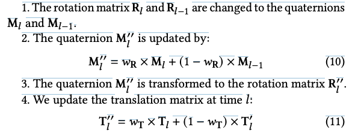

---
layout: post 
title: (ARShoe) Real-Time Augmented Reality Shoe Try-on System on Smartphones   
subtitle: AI Paper Review  
tags: [ai, ml, augmented reality, Image-based rendering, Virtual try-on]  
comments: true  
---  
 
가상 착용 기술은 증강 현실을 사용하여 사용자가 다양한 패션 아이템을 시도하고 편리한 온라인 쇼핑 경험을 제공할 수 있게 해줍니다. 그러나 대부분의 이전 연구는 옷을 위한 가상 착용에 중점을 두고 있어 신발에 대한 부분을 무시하고 있는데, 신발에 대한 가상 착용 또한 유망한 과제입니다. 따라서 본 연구는 스마트폰을 위한 실시간 증강 현실 가상 신발 착용 시스템인 ARShoe를 제안합니다.

구체적으로 ARShoe는 자세 추정과 동시에 세분화를 실현하기 위해 새로운 다중 브랜치 네트워크를 채택합니다. 시도 과정에서 현실적인 3D 신발 모델 가림이 생성되는 해결책이 제시됩니다. 부드럽고 안정적인 착용 효과를 얻기 위해 본 연구는 새로운 안정화 방법을 개발합니다. 더 나아가 교육과 평가를 위해 다양한 가상 신발 착용 작업 관련 레이블이 주석이 달린 최초의 대규모 풋 벤치마크를 구축합니다. 새롭게 구성된 벤치마크에서의 철저한 실험은 ARShoe의 우수한 성능을 보여줍니다. 일반적인 스마트폰에서의 실제 테스트는 제안된 방법의 실시간 성능과 안정성을 확인합니다.

[Paper Link](https://arxiv.org/pdf/2108.10515.pdf)

## RELATED WORK

### 2D Pose Estimation

인간 몸에 적용될 때, 2D 자세 추정은 관절 좌표의 지역화를 의미합니다. 예를 들어, MPII 데이터셋에서는 16개의 신체 관절, Human3.6M 데이터셋에서는 32개의 신체 관절이 있습니다. 최신 기술 (SOTA) 2D 자세 추정 접근 방법은 주로 heatmap 예측 기반 및 좌표 회귀 기반의 두 가지 유형으로 나뉩니다. heatmap 예측 기반의 대표적인 방법으로는 stacked hourglass networks가 있으며, 이는 대칭적인 hourglass 형태의 네트워크 구조를 사용하여 자세 추정의 정확도를 크게 향상시킵니다. 좌표 회귀 기반 방법은 관절 좌표를 직접 회귀하며, 최근 몇 년 동안 공간 및 맥락 정보가 부족하다는 이유로 연구가 덜 이루어졌습니다. 관련하여 손 자세 추정에 대한 연구도 있습니다. 예를 들어, 비모수 구조 규제 머신 (NSRM) 및 회전 불변 혼합 그래프 모델 네트워크 (R-MGMN)는 단일 RGB 카메라를 통해 2D 손 자세 추정을 수행합니다. OpenPose는 다중 사람을 위한 2D 자세 추정을 수행하고 각 발을 3개의 키포인트로 주석 단계가 된 인간 발 키포인트 데이터셋을 구축합니다.

### 6-DoF Pose Estimation

6 Degree of Freedom의 약어로 주로 물체의 운동이나 위치를 설명할때 사용하며, 여섯가지 독립적인 운동 또는 변환을 나타냅니다.

1. **Translation along X 축 (이동 - X):** 물체가 X 축을 따라 좌우로 이동할 수 있는 정도.
2. **Translation along Y 축 (이동 - Y):** 물체가 Y 축을 따라 상하로 이동할 수 있는 정도.
3. **Translation along Z 축 (이동 - Z):** 물체가 Z 축을 따라 전후로 이동할 수 있는 정도.
4. **Rotation about X 축 (회전 - X):** 물체가 X 축을 중심으로 회전할 수 있는 정도.
5. **Rotation about Y 축 (회전 - Y):** 물체가 Y 축을 중심으로 회전할 수 있는 정도.
6. **Rotation about Z 축 (회전 - Z):** 물체가 Z 축을 중심으로 회전할 수 있는 정도.

6-DoF 자세 추정의 일반적인 해결책은 두 단계로 이루어집니다. 먼저 2D 키포인트를 예측하고, 그런 다음 2D-3D 대응을 통해 6-DoF 자세를 추정합니다. 이를 위해 Perspective-n-Point (PnP) 알고리즘을 사용합니다. BB8은 부분 가림이 발생하는 어려운 객체의 3D 자세를 예측하기 위해 객체의 3D 바운딩 박스의 모서리의 2D 투영을 기반으로 3D 자세를 추정하기 위해 합성곱 신경망 (CNN)을 사용합니다. Pixel-wise voting network (PVNet)은 객체 키포인트를 가리키는 픽셀 단위 벡터를 예측하고 이러한 벡터를 사용하여 키포인트 위치에 투표합니다. 이 방법은 가려진 및 일부만 보이는 객체에 대해 잘 작동합니다. Dense pose object detector (DPOD)은 이미지와 해당 3D 모델 간의 2D-3D 대응을 사용하여 계산된 6-DOF 자세 후 초기 자세 추정을 개선합니다. PVN3D는 2D 키포인트 접근 방식을 확장하며 객체의 3D 키포인트를 감지하고 최소자승 적합을 사용하여 6D 자세 정보를 유도합니다. 저자의 경우, 네트워크의 하나의 브랜치는 발의 2D 키포인트를 예측하기 위해 잘 훈련되었으며, 그런 다음 PnP 알고리즘을 사용하여 6-DoF 자세를 얻을 수 있습니다.

### Virtual Try-On Techniques

최근 몇 년 동안, 가상 착용 커뮤니티는 옷을 위한 가상 착용을 개발하려는 노력을 기울이고 있으며 유망한 진전을 이루고 있습니다. 가상 착용의 주요 접근 방법은 이미지 기반 및 비디오 기반 두 가지 범주로 나눌 수 있습니다. 전자의 경우, VITON 및 VTNFP은 원하는 의류 아이템으로 합성된 이미지를 생성합니다. 후자의 경우, FW-GAN은 대상 이미지와 포즈를 기반으로 하는 가상 옷 착용 비디오를 합성합니다. 다른 패션 아이템에 대한 가상 착용은 의복에 비해 많은 연구 관심을 받지 못했습니다. 예를 들어 화장품, 안경 및 신발에 대한 가상 착용입니다.

안경 착용의 경우, X. Yuang et al.은 이미지에서 3D 안경을 재구성하고 사용자의 얼굴에 안경을 합성합니다. 머리 자세 추정에 따라 가상 안경 모델이 인간 얼굴 위에 겹쳐집니다. Chao-Te Chou et al.은 발과 신발을 인코딩하고 원하는 이미지로 디코딩하는 것을 제안합니다. 그러나 이 접근 방식은 간단한 배경이 있는 장면에서 잘 작동하며 실제 사용 조건으로 일반화하기 어렵습니다. 또한 거대한 계산 비용으로 모바일 장치에 적합하지 않습니다. 이와 대조적으로 이 작업은 가상 신발 착용에 중점을 두며, 실시간으로 스마트폰에서 실행되면서 매력적인 현실적 렌더링 효과를 실현하는 깔끔하고 새로운 프레임워크를 제안합니다.

## ARSHOE SYSTEM

그림 2에 나타난 것처럼, ARShoe 시스템은 세 가지 중요한 구성 요소를 갖추고 있습니다.

1) 키포인트 예측, 자세 추정 및 세그멘테이션을 위한 빠르고 정확한 네트워크
2) 현실적인 가림 생성 절차
3) 3D 모델 안정화 접근 방법

발 자세는 predicted part affinity fields (PAFs)에 의해 추정되며, 이는 추정된 키포인트를 올바른 발 인스턴스로 그룹화하기 위한 것입니다. 그 후 각 발의 2D 키포인트를 매핑하여 발의 6-DoF 자세를 얻습니다. 그런 다음 3D 신발 모델은 해당 자세에 맞게 렌더링될 수 있습니다. 세그멘테이션 결과는 다리에 의해 가려져야 하는 3D 신발 모델의 올바른 영역을 찾는 데 도움이 됩니다. 마지막으로, 3D 모델 안정화 모듈은 부드럽고 현실적인 가상 시착 효과를 보장합니다. 또한 효과적이고 정확한 주석을 위해 원점 6-DoF 발 자세 주석 방법도 이 섹션에서 제시됩니다.

- PAFs: 신체 부분간의 관계를 나타내는 예측된 필드로, 보통 신체 부분을 연결하는 벡터 필드로 표현됩니다.
  - 두 part의 연결선 상에 있는 point pixel에 vector field 할당
  - 할당되는 vector filed는 특정 part에서 다른 part로 향하는 방향성 정보 및 위치 정보를 가지고 있음

### 1. Network in ARShoe

#### Network Architecture

2D 발 키포인트의 로컬라이제이션 및 인간 다리와 발 세그멘테이션을 위해 인코더-디코더 네트워크를 고안했습니다. 인코더 네트워크는 고수준 및 저수준 피처를 융합하여 더 나은 표현을 얻습니다. 디코더 네트워크에는 키포인트 히트맵 예측을 위한 하나의 브랜치, PAFs 예측을 위한 다른 하나, 그리고 인간 다리와 발 세그멘테이션을 위한 하나의 브랜치가 포함되어 있습니다. 각 브랜치에는 최종 결과를 생성하기 위해 업샘플링 모듈이 적용됩니다.

그림 3에 나타난 것처럼 각 업샘플 모듈은 컨볼루션 블록, ResBlock 및 두 개의 픽셀 셔플 레이어로 구성되어 있습니다. 이 모듈은 비교적 낮은 계산 비용을 유지하면서 정확한 키포인트, PAF 및 세그멘테이션 결과를 생성할 수 있습니다. 업샘플 모듈의 효과를 검증하기 위해 일반적으로 사용되는 업샘플 작업, 즉 이중 선형 보간 작업과 비교합니다. 결과는 그림 4에 나타나 있습니다. 업샘플 모듈이 더 정확한 추정을 생성하는 것을 볼 수 있습니다.

우리의 구현에서는 그림 5에 나와 있는 것처럼 발의 8개의 키포인트를 설정했습니다. 따라서 키포인트 히트맵의 출력 형태는 각각 8 × 64 × 64이며, 각각 8개의 키포인트에 해당합니다. PAFs 히트맵은 14 × 64 × 64의 크기를 가지며, 그림 5의 7개의 선으로 표시됩니다. 각 선에는 x 및 y 축에서의 선의 투영을 나타내는 두 개의 PAFs가 있습니다. 세그멘테이션 결과의 크기는 2 × 64 × 64이며, 하나는 다리 세그멘테이션을 위한 채널이고 다른 하나는 발 세그멘테이션을 위한 채널입니다. 세 브랜치 모두에서 L2 손실을 채택하여 선호되는 성능을 얻기 위해 사용합니다.

#### Training Loss

네트워크에서는 세 하위 작업 모두에 대해 L2 손실을 사용합니다. 키포인트 예측 브랜치, PAFs 추정 브랜치 및 segmentation 브랜치의 GT는 각각 키포인트의 annotation, 키포인트 간의 연결 및 발과 다리의 segmentation 입니다. 각각 L_heatmap, L_pafsmap 및 L_segmap이라는 이 세 브랜치의 손실을 나타내면 네트워크의 전체 손실 L은 다음과 같이 정의됩니다.

Lambda 1, 2, 3은 각각 2, 1, 0.1로 설정하였습니다. 

#### Keypoints grouping

사용 시나리오에서는 항상 두 발이 있습니다. 따라서 키포인트 간의 연결을 나타내기 위해 PAFs를 예측합니다. 이는 동일한 발 인스턴스에 속하는 키포인트를 그룹화할 수 있습니다. 하나의 이미지에서 8개의 키포인트 히트맵 `[H1, ..., H8]` 및 8개의 키포인트 좌표 `[K1, ..., K8]`를 유도합니다. 해당 PAFs에는 `[F1, ..., F7]`로 표시되는 7개의 요소가 있습니다.

그림 5에 나타난 것처럼, K1과 K3은 연결되어 있습니다. 네트워크에 의해 예측된 키포인트 K1 및 K3의 히트맵은 그림 6에 각각 H1 및 H3으로 표시됩니다. F0 및 F1은 각각 키포인트 K1 및 K3의 연결 관계의 X-방향 및 Y-방향 값을 나타내며, 각 PAF에는 두 개의 연결 선이 있습니다.

각 연결 선에 가장 가까운 두 점을 찾아 이 두 점을 연결할 수 있습니다. 그림 6에 나타난 것처럼 키포인트 K1과 K3은 하나의 연결을 형성하고, 키포인트 K2와 K4는 다른 연결을 형성합니다. 즉, 키포인트 K1과 K3은 하나의 발에 속하고, 키포인트 K2와 K4는 다른 발에 속합니다. 이렇게하면 모든 키포인트가 해당 발 인스턴스에 그룹화됩니다. 그림 7에 나타난 것처럼 모든 키포인트를 두 그룹으로 나누었으며, 이는 두 발을 이렇게 구별할 수 있다는 것을 의미합니다.

#### 6-DoF pose estimation

키포인트를 그룹화한 후 각 그룹은 8개의 요소를 갖습니다. 하나의 요소는 하나의 키포인트의 좌표를 나타냅니다. 저자는 PnP 알고리즘을 사용하여 표준 인간 발의 3D 지점, 카메라 내부 매개 변수 및 예측된 2D 키포인트에 따라 인간 발의 R (rotation) 및 T (translation)을 생성합니다.

### 2. Occlusion Generation

리얼리스틱한 렌더링 효과를 생성하려면 3D 신발 모델은 입력의 정확한 위치에 적절한 스케일과 포즈로 오버레이되어야 합니다. 이전 방법들은 깊이 정보 또는 이미지 내 시착 대상의 좌표에 의존했습니다. 그러나 저자는 인간 다리의 세그멘테이션 정보를 활용하고 투명한 신발 개폐구와 3D 신발 모델의 실루엣을 결합하여 정확한 가상 가리기 영역을 지역화합니다.

리얼리스틱한 효과를 내기 위해 투명한 3D 객체를 신발 개폐구의 영역에 배치합니다. 객체의 위치는 신발 개폐구의 안쪽으로 적절하게 이동하여 신발 개폐구의 가장자리에 일정한 두께를 유지하고 더 현실적인 느낌을 가져올 수 있습니다. 신발 개폐구가 투명하기 때문에 렌더링 후 두 개의 실루엣이 나타납니다. 바깥 실루엣은 S0로 표현되고, 안쪽 실루엣은 S1로 표현됩니다. 가상 가리기 과정은 그림 8에 설명되어 있습니다. 먼저, 다리 마스크와 𝑆0의 교차점을 찾습니다. 두 점이 있다고 가정하고 이를 (𝑀0, 𝑀1)로 표시합니다. 그런 다음 𝑆1에서 (𝑀0, 𝑀1)에 대응하는 가장 가까운 점을 찾아 (𝑁0, 𝑁1)으로 나타냅니다. 마지막으로 (𝑀0, 𝑁0) 및 (𝑀1, 𝑁1)을 연결하여 마스크에서 2D 가림 영역으로 닫힌 영역을 형성하고 해당 영역을 투명하게 렌더링합니다.

### 3. 3D Model Stabilization

3D 신발 모델을 안정화하기 위한 방법으로, 코너 포인트의 이동과 추정된 6-DoF 발 자세를 결합하는 방법을 제안합니다. 이미지 시퀀스를 처리하고 있기 때문에 각 프레임을 `I_l`로 표시하며, 여기서 l은 {0, ..., 𝑘} 중 하나입니다. 현재 이미지인 `I_l`에 대해 이전 프레임은 `I_l−1`입니다.

먼저, 발 세그멘테이션을 기반으로 `I_l−1`과 `I_l`에서 FAST 코너 포인트를 추출합니다. 이러한 포인트는 각각 `P_l−1`과 `P_l`로 나타냅니다. 그런 다음 양방향 옵티컬 플로우를 사용하여 코너 포인트 쌍 `P'_l−1 = [p1_l-1, ..., pn_l-1]` 및 `P'_l = [p1_l, ..., pn_l]`을 얻습니다. 여기서 n은 일치하는 포인트의 수입니다.

발의 자세는 4 × 4 동차 행렬로 나타내며, 이는 발의 3D 모델 좌표 프레임에서 카메라 좌표 프레임으로의 변환입니다:

- R: rotation matrix
- t: translation matrix t=[t_x, t_y, t_z]T

현재 frame에서의 pose는 `T_l`, 이전 frame에서의 pose는 `T_l-1` 입니다. 3D shoe model의 point cloud는 C라고 하고, camera 내부 파라미터는 K입니다.

- f: focal length
- c: principal point offset

keypoint detection 노이즈 때문에, `T_l`을 사용하여 virtual shoe를 랜더링 할 경우, jitering을 피할 . 수없습니다. 그래서 저자는 `P'_l−1`과 `P'_l`을 사용하여 refined pose `T''_l`을 안정화 하였습니다.

먼저 픽셀 좌표 공간에서 corner point의 평균 displacement `V_pix = (vx_pix, vy_pix)`를 계산하였습니다.

두번째로 translation matrix를 계산하였습니다. 이를 위해 저자는 두개의 연속적인 프레임에서 발의 depth는 변화하지 않는다고 가정하였습니다. `(tz_l = tz_l-1)`

카메라 좌표공간에서 corner point의 평균 displacement V_cam은 아래와 같이 계산할 수 있습니다.

translation matrix는 아래와 같습니다.

3D point cloud C를 두개의 이미지 좌표 시스템으로 project 하기 위해 아래와 같이 계산합니다.

그 다음 `R''_l`과 `T''_l` 을 계산하기 위해 아래와 같은 스텝을 거칩니다.

연속된 두 프레임 간의 발 포즈 변경은 불규칙하고 중요한 잡음과 비교해 연속적이고 미묘합니다. 시퀀스 내에서 발 포즈의 안정성과 일관성을 보장하기 위해 먼저 Eq. (5)에 따라 3D 공간에서 인간 발의 근사 위치를 계산합니다. **T**가 업데이트될 때, 회전 행렬이 재투영 오차에 가장 기여합니다. 회전 행렬의 가중치 필터링을 거친 후 각도 변경은 이전 프레임과 일정한 순서를 유지합니다. 따라서 두 연속된 프레임 간 발 포즈 변경이 미미할 때 이전 프레임의 포즈가 현재 프레임보다 더 큰 가중치를 얻게되고 그 반대의 경우도 마찬가지입니다.

### 4. 6-DoF Pose Annotation

풋 포즈 정보는 포즈 추정 브랜치를 훈련하기 위해 필요합니다. 다중 카메라 라벨링 및 3D 바운딩 박스 라벨링은 일반적인 6-DoF 포즈 주석 방법 중 일부입니다. 전자는 여러 각도에서 촬영하는 여러 카메라를 사용합니다. 카메라 간의 관계에 따라 회복 지점의 3D 정보를 정확하게 주석 처리할 수 있지만 비용이 높고 작업이 복잡합니다. 후자는 2D 이미지에서 개체를 선택하고 주석 처리하기 위해 외부 바운딩 박스를 끌어당기는 방식입니다. 그러나 바운딩 박스로 높은 정확도로 주석 처리하는 것은 어려울 수 있습니다.

이러한 도전에 대처하기 위해 최종 3D 모델의 렌더링 프로세스를 모방하는 혁신적인 주석 방법을 개발했습니다. 3D 렌더링 엔진을 기반으로 신발의 3D 모델을 이미지 내의 신발 위치를 커버하도록 수동으로 회전, 이동 및 스케일을 조정합니다(그림 9 참조).

따라서 모델의 최종 포즈 변환 행렬 `R` 및 `T`을 얻어 정확한 주석 처리를 달성할 수 있습니다. 렌더링된 3D 모델에서 8개의 포인트를 선택했으며 이들의 위치는 그림 5에서 확인할 수 있습니다. 예를 들어, Keypoint 1은 발가락의 위치를 나타냅니다. Keypoint 7은 발의 중앙 위치를 나타냅니다. Keypoints 3, 4, 5 및 6은 발의 측면을 나타내는 포인트입니다. Keypoints 0 및 2는 발의 발뒤꿈치의 위치를 나타냅니다. 이러한 포인트를 연결하는 일곱 개의 선이 있습니다. 변환 행렬과 카메라 내재 파라미터를 사용하여 모델의 3D 포인트를 이미지의 2D 포인트 좌표로 투영하며, 이는 train에 사용되는 키포인트로 활용됩니다.

## EXPERIMENT

### 1. Experimental Settings

#### Benchmark

이 연구는 가상 신발 착용 작업의 학습과 평가를 위한 매우 처음이 되는 대규모 발 벤치마크를 구축했습니다. 이 벤치마크에는 인간 발에 대한 86,040개의 이미지가 포함되어 있습니다. annotation은 발의 키포인트 및 인간 다리와 발의 세그멘테이션 마스크를 포함하고 있습니다. 일부 주석이 달린 씬은 그림 10에 나와 있습니다. 오프라인 데이터 확장은 회전, 이동, 부분 가려짐 및 배경 변경을 사용하여 수행되었습니다. 증가시킨 데이터셋에는 3,012,000개의 이미지가 포함되어 있습니다. 우리는 3백만개의 이미지를 교육에 사용하고 12,000개의 이미지를 테스트에 사용합니다. 모든 이미지는 256 × 256으로 크기를 조정했습니다.

#### Implementation Details

다중 브랜치 네트워크를 교육하기 위해 우리는 Adam 옵티마이저를 사용하며 가중치 감소를 5 × 10^(-4)로 설정하고, 모멘텀 매개변수를 b1 = 0.9, b2 = 0.999로 설정했습니다. 초기 학습률은 1×10^(-4)로 설정되었습니다. 모델 교육을 가속화하기 위해 PyTorch 1.4에서 4개의 NVIDIA Tesla P40 GPU (24GB)에 분산 교육 방법을 사용하였으며, 총 배치 크기는 1024로 설정되었습니다. 교육 과정에서는 에포크 20, 30 및 60에서 학습률을 각각 10%씩 감소시켰습니다. 전체 네트워크는 총 120 에포크 동안 교육되었습니다.

#### Baselines

ARShoe의 성능을 다양한 하위 작업에서 평가하기 위해 포즈 추정 및 발 segmentation 성능을 다른 SOTA 방법과 비교합니다. virtual shoe on 파이프라인에서 키포인트 로컬라이제이션은 인간 포즈 추정과 유사합니다. 따라서 Lightweight OpenPose와 Fast Pose Distillation (FPD와 같은 SOTA 인간 포즈 추정 방법과 비교합니다. Segmentation 성능에 대해서는 YOLACT 및 SOLOv2와 비교합니다. 서로 다른 백본을 사용하는 네트워크, 즉 Darknet1, Resnet 및 FPN과 함께 DCN을 평가합니다.

#### Remark 1: There is no open-source project about virtual shoe tryon to our best knowledge, thus comparisons are performed among ARShoe and SOTA approaches of corresponding subtasks.

#### Evaluation metrics: For the foot keypoints localization, we use the mean average precision (mAP) at a number of object keypoint similarity (OKS) thresholds ranging from 0.5 to 0.95. For the segmentation evaluation, we report the average precision (AP) and mean intersection of union (mIoU).

### 2. Computation Cost and Speed Evaluation

