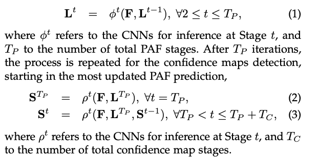

실시간 다중 인물 2D 포즈 추정은 기계가 이미지와 비디오에서 사람들을 이해하는 데 있어 핵심 요소입니다. 이 연구에서는 이미지에서 여러 사람의 2D 포즈를 감지하는 실시간 접근법을 제시합니다. 제안된 방법은 비모수 표현, 즉 Part Affinity Fields (PAFs)를 사용하여 이미지의 개인과 신체 부위를 연관시키는 방법을 배웁니다. 이 하향식 시스템은 이미지의 사람 수에 관계없이 높은 정확도와 실시간 성능을 달성합니다. 이전 연구에서는 PAFs와 신체 부위 위치 추정이 훈련 단계에서 동시에 개선되었습니다. 저자는 PAF만의 개선이 PAF와 신체 부위 위치 추정 모두의 개선보다 런타임 성능과 정확도가 크게 향상된다는 것을 보여줍니다. 또한, 저자는 내부적으로 주석이 달린 발 데이터셋을 기반으로 한 첫 번째 결합된 신체와 발 키포인트 탐지기를 제시합니다. 이 결합된 탐지기가 순차적으로 실행하는 것에 비해 추론 시간을 줄이는 것뿐만 아니라 각 구성 요소의 정확도를 유지한다는 것을 보여줍니다. 이 연구는 OpenPose의 출시로 정점을 찍었는데, 이는 첫 번째 오픈 소스 실시간 다중 인물 2D 포즈 감지 시스템으로, 신체, 발, 손, 얼굴 키포인트를 포함합니다.

[Paper Link](https://arxiv.org/pdf/1812.08008.pdf)
[Code Link](https://github.com/CMU-Perceptual-Computing-Lab/openpose)

## Introduction

이 논문에서는 이미지와 비디오에서 사람들을 자세히 이해하는 데 있어 핵심 요소인 인간 2D 포즈 추정을 고려합니다. 이는 해부학적 키포인트 또는 "부분"을 지역화하는 문제입니다. 인간 추정은 대체로 개인의 신체 부위를 찾는 데 초점을 맞추고 있습니다. 이미지에서 여러 사람의 포즈를 추론하는 것은 독특한 일련의 도전 과제를 제시합니다. 첫째, 각 이미지에는 어떤 위치나 크기에서든 나타날 수 있는 알 수 없는 수의 사람들이 포함될 수 있습니다. 둘째, 사람들 간의 상호 작용은 접촉, 가림, 또는 팔다리 관절로 인해 복잡한 공간적 간섭을 유발하며, 이로 인해 부분의 연관성을 찾는 것이 어렵습니다. 셋째, 런타임 복잡성은 이미지에 있는 사람 수와 함께 증가하는 경향이 있어 실시간 성능을 도전적으로 만듭니다.
일반적인 접근 방식은 사람 탐지기를 사용하고 각 탐지에 대해 단일 사람 포즈 추정을 수행하는 것입니다. 이러한 상위-하위 접근 방식은 단일 사람 포즈 추정을 위한 기존 기법을 직접 활용하지만, 초기 약속에 대한 취약성을 겪습니다: 사람 탐지기가 실패하면 (사람들이 가까이 있을 때 자주 발생합니다) 회복할 방법이 없습니다. 또한, 그들의 런타임은 이미지에 있는 사람 수에 비례하며, 각 사람 탐지에 대해 단일 사람 포즈 추정기가 실행됩니다. 반대로, 하위-상위 접근 방식은 초기 약속에 대한 견고성을 제공하고 이미지에 있는 사람 수에서 런타임 복잡성을 분리할 가능성을 제공하며 매력적입니다. 그러나 하위-상위 접근 방식은 다른 신체 부위와 다른 사람들로부터의 전역적 맥락 단서를 직접 사용하지 않습니다. 초기 하위-상위 방법은 최종 구문 분석에 비싼 전역 추론이 필요하므로 몇 분이 걸리는 효율성의 향상을 유지하지 못했습니다.

이 논문에서는 여러 공개 벤치마크에서 경쟁력 있는 성능을 보이는 효율적인 다중 인물 포즈 추정 방법을 제시합니다. Part Affinity Fields (PAFs)라는 2D 벡터 필드 세트를 통해 신체 부위의 위치와 방향을 인코딩하는 최초의 하향식 연관 점수 표현을 제시합니다. 이 하향식 감지와 연관 표현을 동시에 추론함으로써 탐욕스러운 구문 분석이 높은 품질의 결과를 달성할 수 있도록 충분한 전역 컨텍스트를 인코딩한다는 것을 보여줍니다.
이 버전은 여러 가지 새로운 기여를 합니다. 첫째, PAF 정제가 정확도를 극대화하는 데 중요하다는 것을 증명하고, 반면에 신체 부위 예측 정제는 그렇게 중요하지 않다는 것을 보여줍니다. 네트워크 깊이를 늘리지만 신체 부위 정제 단계를 제거합니다. 이 정제된 네트워크는 속도와 정확도를 각각 약 200%와 7% 증가시킵니다. 둘째, 15K의 인간 발 인스턴스가 포함된 주석이 달린 발 데이터셋을 공개적으로 공개하고, 신체와 발 키포인트가 결합된 모델이 신체 전용 모델의 속도를 유지하면서 그 정확도를 유지하는 방식으로 훈련될 수 있다는 것을 보여줍니다. 셋째, 차량 키포인트 추정 작업에 저자의 방법을 적용함으로써 그 일반성을 보여줍니다. 마지막으로, 이 작업은 OpenPose의 출시를 문서화합니다. 이 오픈 소스 라이브러리는 신체, 발, 손, 얼굴 키포인트를 포함한 다중 인물 2D 포즈 감지를 위한 첫 번째 실시간 시스템입니다. 또한 Mask R-CNN과 Alpha-Pose에 대한 런타임 비교를 포함하여, 저자의 하향식 접근법의 계산적 이점을 보여줍니다.

## Method

그림 2는 저자의 방법 전체 파이프라인을 보여줍니다. 시스템은 입력으로 크기가 w × h인 컬러 이미지를 받아 (그림 2a) 이미지의 각 사람에 대한 해부학적 키포인트의 2D 위치를 생성합니다 (그림 2e). 먼저, 피드포워드 네트워크가 신체 부위 위치의 2D 신뢰도 맵 S 집합 (그림 2b)과 부분 친화 필드(PAFs)의 2D 벡터 필드 L 집합을 예측합니다. 이것은 부분 간의 연관성 정도를 인코딩합니다 (그림 2c). 집합 S = (S1, S2, …, SJ)는 각 부분별로 J개의 신뢰도 맵을 가지며, 여기서 `Sj in R_wxh, j in {1 . . . J}`입니다. 집합 L = (L1,L2, …,LC)는 각 팔다리별로 C개의 벡터 필드를 가지며, 여기서 `Lc in R_wxhx2, c in {1 . . . C}`입니다. 명확성을 위해 부분 쌍을 팔다리로 참조하지만, 일부 쌍은 인간의 팔다리가 아닙니다 (예: 얼굴). Lc의 각 이미지 위치는 2D 벡터를 인코딩합니다. 마지막으로, 신뢰도 맵과 PAFs는 탐욕스러운 추론에 의해 파싱되어 (그림 2d) 이미지의 모든 사람에 대한 2D 키포인트를 출력합니다.

### 1. Network Architecture

그림 3에 표시된 저자의 아키텍처는 파트 간 연관성을 인코딩하는 Affinity Field와 detection 신뢰도 맵을 반복적으로 예측합니다. 이 반복적인 예측 아키텍처는 연속적인 단계에서 예측을 세밀화하며, 각 단계에서 중간 감독이 이루어집니다. 원래의 접근법에서는 네트워크 아키텍처가 여러 개의 7x7 합성곱 계층을 포함하였습니다. 현재의 모델에서는, 수용 필드는 유지되면서 각 7x7 합성곱 커널을 3개의 연속적인 3x3 커널로 대체함으로써 계산이 줄어듭니다. 전자의 연산 수는 2 × 7^2 - 1 = 97이지만, 후자는 51에 불과합니다. 또한, 각 3개의 합성곱 커널의 출력은 DenseNet과 유사한 접근법을 따라 연결되며, 비선형성 계층의 수는 3배로 증가하고, 네트워크는 낮은 수준과 높은 수준의 특징을 모두 유지할 수 있습니다.

### 2. Simultaneous Detection and Association

VGG-19의 CNN layer로 부터 분석되고 생성된 feature map F는 first stage의 input으로 사용됩니다. 이 stage에서 네트워크는 PAFs 집합을 생성합니다. 각 후속 단계에서는 이전 단계의 예측과 원래의 이미지 특징 F가 연결되어 세밀화된 예측을 생성하는 데 사용됩니다.

연속적으로 Tp 번 iteration이 끝나면, 가장 최신의 PAF 예측에서 시작하여 신뢰도 맵 감지를 위한 과정이 반복됩니다.

각 단계에서 PAF와 신뢰도 맵 분기 모두를 세밀화하지 않습니다. 따라서, 각 단계별 계산량이 절반으로 줄어듭니다. 저자는 세밀화된 친화 필드 예측이 신뢰도 맵 결과를 향상시키는 반면, 그 반대는 성립하지 않는다는 것을 경험적으로 관찰하였습니다. 직관적으로, PAF 채널 출력을 보면, 신체 부위의 위치를 추측할 수 있습니다. 그러나, 다른 정보 없이 신체 부위 덩어리만 보면, 그것들을 다른 사람들로 구분해내는 것은 불가능합니다.
그림 4는 단계별로 친화 필드의 세밀화를 보여줍니다.

신뢰도 맵 결과는 가장 최신이며 가장 세밀하게 예측된 PAF 예측 위에 예측되며, 이로 인해 신뢰도 맵 단계 간에 거의 차이를 느낄 수 없습니다.
네트워크가 첫 번째 분기에서 신체 부위의 PAF를 반복적으로 예측하고 두 번째 분기에서 신뢰도 맵을 예측하도록 유도하기 위해, 각 단계의 끝에서 손실 함수를 적용합니다. 추정된 예측과 실제 맵 및 필드 사이의 L2 손실을 사용합니다. 여기서, 저자는 일부 데이터셋이 모든 사람을 완전히 라벨링하지 않는 실제 문제를 해결하기 위해 공간적으로 손실 함수를 가중치 둡니다. 구체적으로, 단계 ti에서의 PAF 분기의 손실 함수와 단계 tk에서의 신뢰도 맵 분기의 손실 함수는 다음과 같습니다.

mask는 훈련 중에 참 TP 예측을 처벌하는 것을 피하기 위해 사용됩니다. 각 단계에서의 중간 감독은 기울기를 주기적으로 보충함으로써 소실 기울기 문제를 해결합니다.

### 3. Confidence Maps for Part Detection

훈련 중에 Eq. (6)의 fS를 평가하기 위해, 주석이 달린 2D 키포인트에서 기준 신뢰도 맵 `S*`을 생성합니다. 각 신뢰도 맵은 특정 신체 부위가 주어진 픽셀에서 위치할 수 있다는 믿음의 2D 표현입니다. 이상적으로, 이미지에 한 사람만 나타나면, 해당 부분이 보이는 경우 각 신뢰도 맵에 단일 피크가 있어야 합니다. 만약 이미지에 여러 사람이 있다면, 각 사람 k에 대한 각 보이는 부분 j에 해당하는 피크가 있어야 합니다.

저자는 먼저 각각 사람 k의 body part j에 대한 confidence map `S*_jk`를 생성했습니다. 여기서 sigma는 peak의 spread 정도를 조정합니다.
네트워크가 예측하는 기준 신뢰도 맵은 최대 연산자를 통한 individual k 신뢰도 맵의 집합입니다. 저자는 평균 대신 신뢰도 맵의 최대값을 취하여 근접한 피크의 정밀도가 뚜렷하게 유지되도록 합니다. 이는 오른쪽 그림에서 보여줍니다. 테스트 시간에는 신뢰도 맵을 예측하고, NMS를 통해 후보를 얻습니다.

### 4. Part Affinity Fields for Part Association

감지된 신체 부위 집합 (그림 5a의 빨간색과 파란색 점으로 표시됨)이 주어졌을 때, 우리는 어떻게 이들을 조립하여 알 수 없는 수의 사람들의 전체 신체 포즈를 형성할까요? 우리는 각 신체 부위 감지 쌍의 연관성, 즉 그들이 같은 사람에 속한다는 것에 대한 신뢰도 측정이 필요합니다. 연관성을 측정하는 한 가지 가능한 방법은 각 팔다리 부위 쌍 사이에 추가 중점을 감지하고 후보 부위 감지 사이의 발생을 확인하는 것입니다 (그림 5b 참조). 그러나, 사람들이 함께 모여 있을 때 이러한 중점은 거짓 연관성을 지원할 가능성이 있습니다 (그림 5b의 녹색 선으로 표시됨). 이러한 거짓 연관성은 표현의 두 가지 제한 때문에 발생합니다: (1) 각 팔다리의 위치만을 인코딩하고 방향은 인코딩하지 않음; (2) 팔다리의 limb 영역을 단일 점으로 줄임.

Part Affinity Fields (PAFs)는 이러한 제한을 해결합니다. 그들은 팔다리의 limb 영역 전체에서 위치와 방향 정보를 모두 보존합니다 (그림 5c 참조). 각 PAF는 각 팔다리에 대한 2D 벡터 필드로, 그림 1d에도 표시되어 있습니다. 특정 팔다리에 속하는 영역의 각 픽셀에 대해 2D 벡터는 팔다리의 한 부분에서 다른 부분을 가리키는 방향을 인코딩합니다. 각 유형의 팔다리는 두 개의 연관된 신체 부위를 연결하는 해당 PAF를 가지고 있습니다.

한사람 k의 신체 부위에서 keypoint j1과 j2를 연결하는 limb c가 있을 때, limb 상에 놓여있는 포인트 p의 `L*_c,k(p)` 는 j1으로 부터 j2를 향하는 unit vector이고, 나머지 영역의 포인트들은 모드 0 값을 가집니다.

학습 과정에서 (6)를 평가하기 위해 우리는 PAF의 ground truth 인 `L*_c,k(p)`를 구해야 합니다. 이는 식 (9)를 통해 구할 수 있습니다. 여기서 v는 limb의 방향을 나타내는 unit vector 이며, 여기에 속하는 포인트들의 집합은 line segment와의 distance threshold를 통해 결정됩니다. 거리는 벡터의 내적으로 구할 수 있습니다 (벡터의 내적: 두 벡터의 방향이 일치하는 정도의 크기를 구함). ground truth PAF는 이미지에 있는 모든 사람들의 PAF에 대해 평균하여 사용합니다.

테스트 중에는 후보 부분 감지 사이의 연관성을 측정하기 위해 후보 부분 위치를 연결하는 선분을 따라 해당 PAF에 대한 선 적분을 계산합니다. 다시 말해, 저자는 감지된 신체 부위를 연결하여 형성될 후보 팔다리와 예측된 PAF의 정렬을 측정합니다. 구체적으로, 두 후보 부분 위치 d_j1과 d_j2에 대해, 저자는 선분을 따라 예측된 PAFs L_c를 샘플링하여 그들의 연관성에 대한 신뢰도를 측정합니다.

하지만 실제 적분을 직접계산하는 것이 불가능하기 때문에, 실제로는, u의 균일하게 간격을 둔 값을 샘플링하고 합산합으로써 적분을 근사합니다 (수치적 적분)

### 5. Multi-Person Parsing using PAFs

저자는 detection 신뢰도 맵에서 Non-maximum Suppression을 수행하여 부분 후보 위치의 이산 집합을 얻습니다. 각 부분에 대해, 이미지에 여러 사람이 있거나 거짓 양성 때문에 여러 후보가 있을 수 있습니다 (그림 6b 참조). 이러한 부분 후보들은 가능한 팔다리의 큰 집합을 정의합니다. PAF에서 선 적분 계산을 사용하여 각 후보 팔다리를 점수화합니다. 이는 Eq. 11에서 정의됩니다. 최적의 구문을 찾는 문제는 NP-Hard로 알려진 K-차원 매칭 문제에 해당합니다 (그림 6c 참조). 이 논문에서는 일관되게 고품질의 매치를 생성하는 탐욕적인 완화를 제시합니다. 저자는 이유가 PAF 네트워크의 큰 수용 필드로 인해 쌍별 연관 점수가 암시적으로 전역 컨텍스트를 인코딩하기 때문이라고 추측합니다.

공식적으로, 먼저 여러 사람에 대한 신체 부위 감지 후보 D_J 집합을 얻습니다. 여기서 `D_J = {d_m_j : j in {1 . . . J}, m in {1 . . . Nj}}`이며, Nj는 part j의 후보 수이고, `d_m_j in R^2`는 신체 부위 j의 m번째 감지 후보의 위치입니다.

이러한 부분 감지 후보들은 여전히 같은 사람의 다른 부분과 연관되어야 합니다. 다시 말해, 실제로 연결된 팔다리인 부분 감지 쌍을 찾아야 합니다.

저자는 변수`z_m_j1 * z_n_j2 ∈ {0, 1}`를 정의하여 두 감지 후보 `d_m_j1`과 `d_n_j2`가 연결되어 있는지 여부를 나타내고, 목표는 모든 가능한 연결 집합, `Z = {z_m_j1 * z_n_j2 : j1, j2 in {1 . . . J}, m in {1 . . . Nj1}, n in {1 . . . Nj2}}`에 대한 최적의 할당을 찾는 것입니다.
만약 c번째 limb에 대해 부분 쌍 j1과 j2 (예: 목과 오른쪽 엉덩이)를 고려한다면, 최적의 연관성을 찾는 것은 maximum weight bipartite graph 매칭 문제로 축소됩니다.

- maximum weight bipartite graph: 간선의 가중치 합이 최대가 되는 매칭을 찾는 문제
  - Bipartite Graph: 인접한 정점끼리 서로 다른 색으로 칠해서 모든 정점을 두 가지 색으로만 칠할 수 있는 그래프를 의미합니다. 즉, 그래프의 모든 정점이 두 그룹으로 나눠지고 서로 다른 그룹의 정점이 간선으로 연결되어져 있는 그래프를 이분 그래프라고 합니다.
  - example problem: M명의 구직자와 N개의 직업이 있다. 각 구직자는 관심을 가지는 직업 부분집합을 가지고 있다. 각 직업은 한명의 구직자를 받아들일 수 있고, 각 구직자는 하나의 직업에만 배정된다. 가능한 많은 구직자들이 직업을 얻도록 직업을 배정하라.

이 경우는 그림 5b에 표시되어 있습니다. 이 그래프 매칭 문제에서, 그래프의 노드는 신체 부위 감지 후보 D_j1와 D_j2이며, 간선은 감지 후보 쌍 사이의 모든 가능한 연결입니다. 또한, 각 간선은 Eq. 11에 의해 가중치가 부여되며, 이는 part affinity aggregate 입니다. 이분 그래프에서의 매칭은 두 간선이 노드를 공유하지 않는 방식으로 선택된 간선의 부분 집합입니다. 여기서 목표는 선택된 간선에 대해 최대 가중치를 가진 매칭을 찾는 것입니다.

이를 해결하기 위해 저자는 Hungaruab Algorithm을 사용하였습니다.

여러 사람의 전체 신체 포즈를 찾는 것에 있어서, Z를 결정하는 것은 K-차원 매칭 문제입니다. 이 문제는 NP-하드 문제이며, 많은 완화 방법들이 존재합니다. 이 연구에서는, 저자는 도메인에 특화된 두 가지 완화를 최적화에 추가합니다. 첫째, 완전 그래프를 사용하는 대신 최소한의 간선 수를 선택하여 인간 포즈의 스패닝 트리 스켈레톤을 얻습니다. 이는 그림 6c에 나타나 있습니다. 둘째, 저자는 매칭 문제를 이분 매칭 부문제의 집합으로 더욱 분해하고, 인접한 트리 노드에서의 매칭을 독립적으로 결정합니다. 이는 그림 6d에 나타나 있습니다. 이는 최소한의 탐욕적 추론이 계산 비용의 일부에 대해 전역 해를 잘 근사화한다는 것을 보여줍니다. 이유는 인접한 트리 노드 간의 관계가 PAFs에 의해 명시적으로 모델링되지만, 내부적으로는 비인접 트리 노드 간의 관계가 CNN에 의해 암시적으로 모델링되기 때문입니다. 이 속성은 CNN이 큰 수용 필드로 훈련되기 때문에 나타나며, 비인접 트리 노드로부터의 PAFs도 예측된 PAF에 영향을 미칩니다.
이 두 가지 완화를 통해, 최적화는 간단하게 분해됩니다.

따라서 저자는 Eqns. 13-15를 사용하여 각 팔다리 유형에 대한 팔다리 연결 후보를 독립적으로 얻습니다. 모든 팔다리 연결 후보들이 있으면, 같은 부분 감지 후보를 공유하는 연결을 조립하여 여러 사람의 전체 신체 포즈를 만들 수 있습니다. 저자의 최적화 방식은 트리 구조를 따라서 완전히 연결된 그래프에 대한 최적화보다 수십 배 빠릅니다. 저자의 현재 모델은 또한 중복된 PAF 연결 (예: 귀와 어깨, 손목과 어깨 등)을 포함합니다. 이 중복성은 특히 그림 7에서 보여지는 것처럼 붐비는 이미지에서 정확도를 향상시킵니다. 이러한 중복 연결을 처리하기 위해, 저자는 다중 인물 파싱 알고리즘을 약간 수정합니다. 원래의 접근법은 루트 구성 요소에서 시작했지만, 저자의 알고리즘은 모든 쌍별 가능한 연결을 그들의 PAF 점수에 따라 정렬합니다. 만약 연결이 이미 다른 사람에게 할당된 2개의 신체 부위를 연결하려고 시도한다면, 알고리즘은 이것이 더 높은 신뢰도를 가진 PAF 연결과 모순될 것임을 인식하고, 현재의 연결은 그 후에 무시됩니다.
