이 글은 ACL 2023 Tutorial에서 Retrieval-based Languge Model에 대해 발표한 내용을 정리한 글입니다.

GPT-3 및 PaLM과 같은 언어 모델(LMs)은 자연어 처리(NLP) 작업의 다양한 범위에서 인상적인 능력을 보여주었습니다. 그러나 이들의 매개변수만을 사용하여 세상의 많은 지식을 인코딩하는 것은 과도하게 많은 매개변수와 따라서 엄청난 계산을 필요로 하며, 종종 장기간의 지식을 학습하는 데 어려움을 겪습니다. 더욱이, 이러한 매개변수화된 LMs는 기본적으로 시간에 따라 적응하는 능력이 없으며, 종종 환영을 일으키며, 훈련 말뭉치에서 개인 데이터를 유출할 수 있습니다. 이러한 한계를 극복하기 위해, 검색 기반 LMs에 대한 관심이 증가하고 있습니다. 이들은 비매개변수 데이터 저장소 (예: 외부 말뭉치의 텍스트 청크)를 그들의 매개변수화된 대응체와 함께 통합합니다. 검색 기반 LMs는 훨씬 적은 매개변수로 검색 없이 LMs를 크게 앞설 수 있으며, 검색 말뭉치를 교체함으로써 그들의 지식을 업데이트할 수 있으며, 사용자가 예측을 쉽게 검증하고 평가할 수 있도록 인용문을 제공합니다. 이전에는 검색과 LMs가 대부분 별도로 연구되었으며, 최근에는 연구자들이 그들을 통합하고 검색과 LMs가 더욱 유기적으로 상호 작용하는 시스템을 구축하였고, 관심이 증가함에 따라 여러 검색 기반 LMs가 제안되었습니다. 그들은 신경 아키텍처 (예: 검색 단위의 세분화, 검색된 정보를 통합하는 방법), 학습 알고리즘, 하류 응용 프로그램에서의 다양한 사용 방식에서 차이가 있습니다. 이 튜토리얼에서는 검색 기반 LMs의 최근 발전에 대한 포괄적이고 일관된 개요를 제공하려고 합니다. 먼저 LM과 검색 시스템의 기초를 다루는 예비 사항을 제공함으로써 시작할 것입니다. 그런 다음 검색 기반 LMs의 아키텍처, 학습 접근법, 응용 프로그램에 대한 최근의 진보에 초점을 맞출 것입니다.

[Official Link](https://acl2023-retrieval-lm.github.io/)
[Video Link](https://us06web.zoom.us/rec/play/6fqU9YDLoFtWqpk8w8I7oFrszHKW6JkbPVGgHsdPBxa69ecgCxbmfP33asLU3DJ74q5BXqDGR2ycOTFk.93teqylfi_uiViNK?canPlayFromShare=true&from=share_recording_detail&continueMode=true&componentName=rec-play&originRequestUrl=https%3A%2F%2Fus06web.zoom.us%2Frec%2Fshare%2FNrYheXPtE5zOlbogmdBg653RIu7RBO1uAsYH2CZt_hacD1jOHksRahGlERHc_Ybs.KGX1cRVtJBQtJf0o)

## Preliminaries

### 1. Language Model

### 2. What is Retrival-based Language Model

RLM은 test time에 외부의 datastore을 함께 사용하는 Language Model입니다.

이를 위해선 query를 통해서 거대한 database에서 연관성있는 text 들을 검색해야 합니다. 연관성 있는 text에 대한 정의는 모델에 따라 어떻게 정의하냐에 따라 다를 수 있습니다. 다양한 방법이 있지만 하나의 예시로는 encoder(text1)*encode(text2) 내적을 사용하여 similarity를 계산할 수 있습니다. 또한 이를 매우 빨리 수행해야하는데, 그 중 하나의 방법으로 fast nearest neightbor search를 사용할 수 있습니다.

그리고 prediction을 위해 위에서 retrival한 데이터를 Language model에 combine 합니다.

여기서 우리는 세가지 궁금증이 생김니다.
우리는 무엇을 datastore에서 retrieve 해야할까요? 그리고 어떻게 이를 language model과 결합할까요? 그리고 언제 retrieve를 사용해야할까요?
이에 대한 질문은 뒤에 정리하겠습니다.

## Architecture

RLM의 모델 구조 발전 과정은 다음과 같은 로드맵으로 요약할 수 있습니다.

### 1. REALM

REALM은 mask languaged 모델로 처음으로 retrieval을 Language model과 함께 사용한 모델입니다.

위 그림에서 볼 수 있듯이 두개의 stage로 이루어져있습니다.

일반적인 LM은 단순히 모델 파라미터로 [MASK]를 예측했지만, REALM은 input과 비슷한 text chunks를 datastore에서 검색하고 이를 input에 concat 하여 [MASK] 부분을 예측합니다.

retrieve stage에 대해 조금더 자세히 설명해보겠습니다. datastore는 Wikipedia를 기반으로 만들어졌습니다. 그리고 각각의 talk들은 Encoder로 입력되고, dense vector space로 투영합니다. 그래서 inference time에도 똑같은 Encoder를 사용하여, input을 같은 vector space 로 투영합니다. 그리고 fast nearest neightbor 알고리즘을 사용하여 top-k chuks를 검색합니다. 여기서 similarity를 계산하기 위해서 두개의 dense vector간의 내적을 사용합니다.

이 단계가 끝나면 이제 read stage에서 이를 통합하는 작업이 필요합니다. 이를 위해서 각 chunks들을 원래의 input에 concat 하고 language model에 입력합니다. 그러고 나면 우리는 alpha-distribution을 얻을 수 있고, weighted average를 통해서 이 결과를 통합합니다.

### 2. REALM and Subsequent work

- REALM
- DPR
- RAG
- Atlas

위의 모델들은 open-domain Question and Answering 같은 knowledge intensive task에서 finetuning 한 모델들입니다.

하지만 앞으로 나올 모델들은 더 LM Perplexity (더 복잡하고 혼란스러운 상황)에 더 포커스를 맞추고 있습니다.

### 3. Retrieval-in-context LM

input x가 다음과 같이 주어지고 다음에 올 문장을 생성해야할 때, 먼저 input x를 datastore에 검색하여 가장 similarity가 높은 문장을 가져옵니다. 그리고 이를 다시 input과 concat 하고 language model의 입력으로 사용하여 다음 문장을 예측할 수 있습니다.

아는 REALM과 매우 비슷합니다. 여기서 몇가지 궁금증이 생깁니다. query를 input x와 똑같이 가져가는 것이 맞을까요? 만약 x 가 매우 길다면, 실제로 관련없는 문장이 많이 포함되어 있을 가능성이 높습니다. 가장 높은 유사성의 문장 1개만 가져오기 때문에 이는 좋지 않은 결과를 가져올 수 있습니다. 실제로 Shorter prefix (more recent token)이 query로 좋다는 실험 결과가 있습니다.

다른 궁금증은 몇번의 retrieve가 더 좋을까 입니다. 예를들어 query를 하나 넣고 한번에 토큰 12개를 생성하길 바란다고 가정해봅시다. 앞의 6개의 토큰은 맞을 수 있지만, 뒤의 6개 토큰들의 정보는 관련 없는 것일 수 있습니다. 이를 고치기 위해서 생성된 6개의 토큰으로 검색한 결과를 가지고 생성한 결과를 다시 쿼리에 붙여 넣어 retrieve 하면 더 관련있는 정보를 검색할 수 있습니다.

실제로 여러번 retrieve 할수록 성능이 좋다는 것이 밝혀졌습니다. 하지만 inference time cost가 늘어나기 때문에 주의해야합니다. 그래서 각 token 별로 retrieve 하여 query가 더욱 정확한 정보를 가져올 수 있도록 하였습니다.

### 4. RETRO

이 모델은 retrival의 결과를 input layer 대신에 intermediate layer의 입력으로 사용하였습니다. 그리고 많은 chunks들이 더 자주 효율적으로 처리될 수 있게 디자인하였습니다. 그리고 datastore을 1.8 Tokens로 확장하였습니다.

이 모델은 casual language 모델로 토큰의 시퀀스에서 다음 토큰을 예측하며, 모델은 왼쪽의 토큰만 볼 수 있습니다. (미래의 토큰을 볼 수 없습니다.)
GPT-2도 이런 Calsual language 모델의 한 예입니다.

input을 여러개로 쪼갠 뒤 Encoder를 통해 Dense space로 projection시키고, top-k chunks를 얻습니다. 그리고 이를 다른 Encoder의 입력으로 넣어 tensor representation 형식의 retrieval 결과를 얻습니다. 여기서 각 E는 3D tensor이며 각 split text의 retrieval 결과 입니다. 이제 우리는 어떻게 이 결과를 LM에 결합시킬까요?

일반적인 decoder 모델은 embedded layer, attention layer와 feed forward network로 구성된 transformer, 그리고 head로 구성되어 있습니다. RETRO는 transformer에서 추가적인 Chunk Cross Attention 이라는 추가적인 block을 도입하였습니다. 그리고 이 block이 retrival 결과 E를 받아들입니다.

간단히 CCA에 대해서 설명하면 이전 layer의 결과 벡터를 나누어서 앞부분은 앞쪽 split E1로 Attention이 계산되고, 뒷쪽 부분은 그다음 split E2로 attention이 계산됩니다. 이런식으로 수행하면 각 연산은 이전 결과에 영향을 받지 않기 때문에 parallel하게 수행할 수 있습니다. 그래서 많은 block들을 더 자주 효율적으로 처리할 수 있습니다.

이 방법은 매우 효율적이지만 complexity가 증가했고 transformer의 architecture가 변했기 때문에 학습 없이 사용할 수는 없습니다.

### 5. kNN-LM

Casual Lanage model은 input x 가 주어지면 그 다음 토큰을 예측해야합니다. 이를 위해 target 이전에 오는 text (prefix)가 key값이 되고 target (token)이 value가 되도록 datastore를 구성합니다. 여기서 datastore의 사이즈는 vocabulary size가 아니라 corpus에 존재하는 token들의 갯수가 됩니다. 그래서 사이즈는 쉽게 1B을 초과합니다. 그리고 나서 모든 prefix의 representation (k=f(c))을 구합니다.

test time에서 하나의 질문이 생깁니다. datastore에 있는 어떤 토근이 예측할 문장에 올 token과 비슷할까?

만약 prefix가 비슷하다면, 다음에 올 token 또한 비슷할 것입니다. representation은 prefix의 vector이므로 이 값이 비슷하면 prefix가 비슷하다는 뜻일 것입니다. 그래서 현재 representation vector 값과 datasetore에 있는 vector 값과의 distance를 구하고 KNN, Normalization을 수행하여 후보들의 값을 확률 분포로 변경합니다. Aggregation을 수행하여 최종 후보를 얻습니다. 마지막으로 이 후보들을 language model의 softmax output 결과와 함께 hyperparameter lambda를 사용하여 interporate하여 최종 결과를 만들어 냅니다.

datastore의 key를 vocabuary로 구성하는 게 아니라 prefix로 구성하는 이유가 같은 단어라도 쓰임새에 따라 뉘앙스나 그 의미가 완전히 다른 경우가 많기 떄문입니다. 성능은 datastore의 크기가 클수록 증가합니다. 그리고 학습에 사용하지 않은 다른 domain의 datastore을 사용하여도 성능에 도움이 됩니다.

이 모델은 이전처럼 text chunk 대신 token을 이용하여 datastore를 retrieve하고, query 결과를 output layer에서 일반적인 language model의 output distribution과 단순히 섞는 작업을 통해 결과를 만들어 냅니다. 또한 retrieve는 모든 토큰마다 이루어집니다. 왜냐하면 오직 하나의 다음 토큰만을 예측할 수 있기 때문입니다.

이전 text chunk 대신 token을 통해 retrieve를 함으로써 더 rare pattern이나 out-of-domain에 대해서 더욱 잘 동작할 수 있습니다. 또한 KNN이 빠르게 동작한다는 가정하에서 input과 retrieve text 간에 cross attention이 없기 때문에 훨씬 계산 효율이 좋습니다.

하지만 공간효율이 좋지 않습니다. 왜냐하면 text chunks에 비해 token의 갯수가 훨씬 많기 때문입니다. 또한 input과 retrival result가 덜 상호작용하기 때문에 표현력이 조금 떨어질 수 있습니다.

### 6. Adaptive Retrieval of Chunks

retrival을 항상 사용해야 할까요? 상황에 따라 쉬운 task의 경우는 필요없는 경우도 있을 것입니다. 그래서 이런 상황은 retrival을 skip 한다면 inference speed를 향상시키는 데 도움을 줄것입니다.

#### 6-1. FLARE

이는 text chunks 단위로 retrieval 하는 모델로 Sentence level에서 retrieval을 할지 말지를 결정합니다. 먼저 retrieval 없이 LM으로 문장을 생성합니다. 생성한 모델이 해당 문장이 확실하다고 판단되면, 다음 문장을 생성합니다. 만약 다음 문장이 불확실하다고 판단되면, 그 문장을 retrieval system의 입력으로 넣고 top-1 text chunk를 받아 LM의 입력으로 사용하여 문장을 다시 생성합니다.

이 과정은 모든 문장을 생성할때 까지 반복적으로 수행됩니다.

### 7. Adaptive Retrieval of tokens

retrieval을 token 단위로 수행할 때도 adaptive하게 skip 할 수 있습니다. 위의 kNN-LM 의 식에서 lambda가 특정 값보다 작다면 lambda=0으로 만들어 오직 Langage Model의 결과만을 사용하여 결과를 생성하게 할 수 있습니다.

또다른 아이디어는 datastore의 local information을 사용하는 것입니다. 위와 같이 token value 별로 prefix key들이 datastore을 구성하고 있을 때, 매 토큰별로 다시 similarity를 구하는 것보다 첫번째 토큰의 위치 pointer를 기반으로 다음 위치로 pointer를 따라가기만 하면 한번의 retrieval로 문장을 생성할 수 있습니다.

이런 방식으로 speed를 향상시킬 수 있지만 retrieval을 skip 할지 말지 결정하는 것이 optimal이 아닐 수 있는 단점이 있습니다.

### 8. Entities as Experts

그렇다면 retrieval을 text나 token말고 다른 것으로는 할 수 없을까 의문이 생깁니다. 하나의 아이디어는 entity을 사용하는 것입니다. 여기서 entity는 무엇일까요? real world에는 고유의 이름을 가지고 있는 object들이 있습니다. (예를들어 나라, 장소, 사람, 책 등). entity는 서로 구별되는 하나하나의 대상을 의합니다. 이런 entity들은 dense vector space에서 표현될 수 있습니다. 이러한 vector들은 entity 들에 대한 background information을 가지고 있을 것입니다. 그래서 이런 entity를 전문가로서 LM과 함께 사용할 수 있습니다.

그래서 이런 아이디어를 사용한 paper가 있습니다.

entity별로 하나의 vector를 가지고 있는 entity memory가 있을 때, memory에서 input에 해당하는 단어 vector를 찾아 transformer의 중간 계층에 함께 사용할 수 있습니다. 이방법을 사용하면 datastore를 훨씬 더 공간을 효율적으로 사용할 수 있습니다. 예를 들어 chunks나 token을 저장하는 것에 비해서 매우 작은 용량만을 사용하기 때문입니다. 하지만 이방법을 사용하려먼 조금 복잡합니다. entity를 따로 학습해야하고, text와 entity를 연결짓는 entity detector가 필요하기 때문입니다.

### 9. Mention Memory

위의 방법을 더 일반화하기 위한 아이디어로 entity 별로 하나의 벡터를 가지는 것 대신, entity mention 별로 하나의 벡터를 가지는 것이 있습니다. 만약 entity들이 서로다른 context에서 여러번 언급되었다면, entity들은 다른 요소로 맵핑 됩니다. 이렇게 하면 표현력이 더 좋아질 수 있습니다. 예를들어 위에서 [Perseus] 라는 단어는 서로다른 context 에서 언급이 되었고, 그래서 이는 서로 다른 vector로 맵핑됩니다.

이방법은 token 별로 하나의 vector를 가지는 kNN-LM과 유사합니다. 하지만 여전히 kNN-LM 보다 공간 효율이 좋습니다. 왜냐하면 entity mention의 수가 token의 수보다 여전히 작기 때문입니다. (150M vs 4B in wikipedia)

### 10. Retrieval for long-range LM

지금까지 external한 data storage를 retrieval 하는 방식을 살펴봤지만, own input text를 data storage에 저장하여 long-range sequence를 처리하는 데도 이 방법을 사용할 수 있습니다.

#### 10-1. Memorizing Transformer

예를들어 전채 책 한권을 요약하는 task가 있다고 합시다. 일반적인 transformer는 입력 길이 제한이 있기 때문에 전체 input을 한번에 처리할 수 없습니다. 이를 해결하기 위해 책 내용 input을 기반으로 하는 data store를 생성하고, 이를 input으로 사용하면서, 현재의 token과 가장 관련있는 parts들을 retrieve하고 intermediate attention layer에 사용하는 방법이 있습니다. 이렇게 함으로써 전체 input을 처리하는 대신 오직 관련 있는 부분만을 처리 함으로써 효율성을 극대화 할 수 있습니다.

#### 10-2. Unlimiformer

위의 방법보다 더 진보한 구조가 있습니다. transformer의 intermediate layer에 chunked cross attention을 사용하는 것입니다. 이렇게 함으로써 더 많은 blocks들을 더 빈번하게 많이 처리할 수 있습니다.

먼저 datastore를 구성하기 위해 input text들을 chunk로 분리합니다. 그리고 각 chuncks들을 현재의 chunk와 비교하여 simlilarity score를 구합니다. 그리고 top-K nearest neighbor search를 수행하여 가장 관련있는 part를 찾고, Cross Attention Layer의 input으로 함께 사용합니다.

## Training

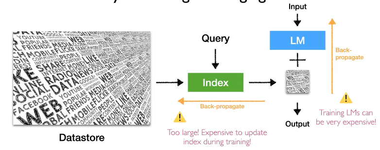

Retrieval Based 모델을 학습시키는 것은 매우 도전적인 과제입니다. 수십억개의 파라미터가 있는 Large Language Model을 학습시키는 것은 매우 expensive 합니다. 또한 학습과정에서 index를 업데이트 시키는 것 또한 매우 expensive 합니다. 이 과제들을 해결하기 위한 4가지 접근 방식에 대해 설명하겠습니다.

### 1. Independent Training

이 방법은 language model과 retrieval model을 독립적으로 학습시키는 것입니다.

독립적으로 학습하면 off-the-shelf model들과 사용하기 좋으며, LM과 retrieval model 각각을 독립적으로 개선시킬 수도 있습니다. 하지만 LM이 retrieval을 leverage하게 학습되진 않습니다. 또한 retrieval model이 LM의 테스크나 도메인에 최적화 되지 않는다는 단점이 있습니다.

large language model을 처음부터 학습시키는 것보다 이미 학습된 다른 모델들을 사용하는 것도 좋은 방법입니다. (GPT, PaLM, LLaMA, GPT-J, ...)

Retrieval model을 학습시키는 것은 사실 NLP나 information retrieval 분야에서 매우 기본적인 문제입니다. 그래서 사람들은 많은 세월동안 다양한 방법들을 제안해왔습니다. 그래서 여기서는 가장 널리 쓰이는 몇가지 시나리오를 사용할 것입니다.

#### 1-1. Sparse retrieval models: TF-IDF / BM25

text chunks들을 sparse vector representation으로 맵핑합니다. sparse vector는 많은 차원을 가지고 있기 때문에 매우 큽니다. 하지만 대부분의 차원 값은 0일 것입니다. 그다음은 text chunks 간의 어원의 overlap을 측정하기 위해서 similarity function을 정의합니다. 여기서 similarity function은 사람이 휴리스틱하게 결정하기 때문에 따로 학습할 필요가 없습니다.

#### 1-2. Dense retrieval models: DPR

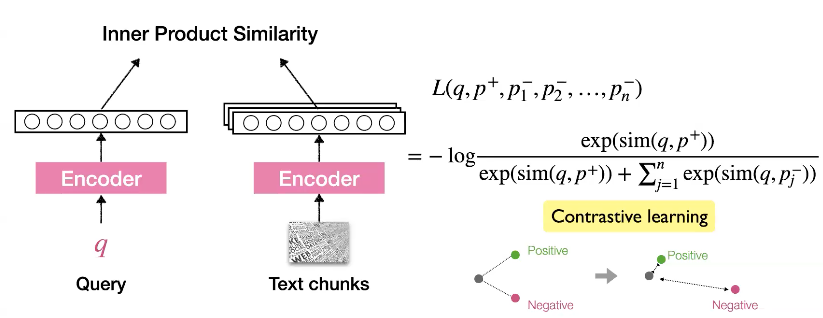

최근에는 사람들은 dense retrieval model을 사용합니다. 작은 사이즈의 encoder를 사용하여 text를 dense vector 표현으로 맵핍합니다. 두 벡터간의 similarity는 벡터의 내적으로 계산할 수 있습니다.

DPR을 학습시키는 방법은 무엇일까요? 우리는 contrastive learning 방식으로 학습시킬 수 있습니다. query와 각 text chunks에 대한 관계가 관련 있는 경우는 거리가 가깝게, 관련이 없는 경우는 거리가 멀게 만드는 식으로 학습하는 것입니다. 하지만 모든 negative passage들에 대해서 학습시키는 것은 매우 expensive 합니다. 그래서 여기서 사용할 수 있는 테크닉은 "in-batch" negative 입니다. 모든 corpus에서 오는 negative를 사용하는 대신 오직 현재의 training batch에 있는 negative 만을 고려하는 것입니다. 여기서 우리가 가정하는 것은 모든 학습 query들은 anntated 되어 있다는 것입니다.

#### 1-3. Contriever

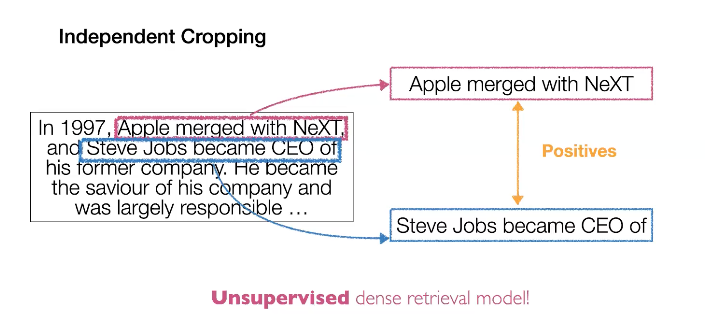

하지만 최근 연구에서는 unsupervised 한 방식으로 학습시키는 시도가 있습니다. 방법은 매우 간단합니다. 한 document가 있다면 해당 document에 대해서 두번 랜덤 크롭핑을 수행합니다. 그리고 이 두 pieces들을 positive 하다고 가정하는 것입니다.

#### 1-4. Retrieval-in-Context in LM

Indepentently 하게 학습시키는 대표적인 모델 중 하나입니다. 독립적으로 학습시켰기 때문에 우리는 Retrieval Model과 LM 모두 아무 조합으로 변경하여 사용할 수 있습니다. 또한 각 component의 개선도 독립적으로 수행될 수 있습니다.

#### 1-5. kNN-LM

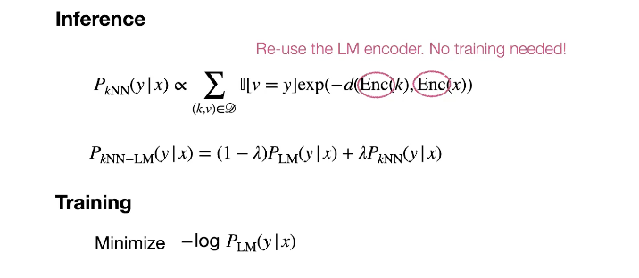

kNN-LM의 경우 여시서 사용된 dense retrieval model은 language model과 같은 것입니다. 그래서 따로 학습할 필요 없이 language model만 학습하면 됩니다.

### 2. Sequential Training

먼저 하나의 component를 독립적으로 학습시킨 뒤 고정을 시키고, 다른 component를 먼저 학습된 component에 맞게 학습시키는 것입니다.

- Retriever -> LM
- LM -> Retrieval

이를 통해 off-the-shelf componets를 사용할 수 있고, LM은 retrieval의 결과를 leverage 하여 효율적으로 학습될 수 있으며, Retrieval은 LM 모델애 도움이 되게끔 학습될 수 있습니다. 하지만 여전이 하나의 component는 fix되어 학습되지 않는다는 문제가 있습니다.

#### 2-1. RETRO

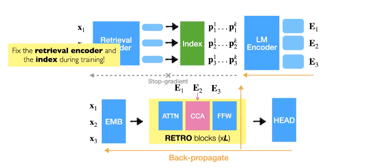

RETRO는 Transformer 의 구조를 변경했기 때문에 Language Model을 다시 학습시켜야 합니다. 그런데 retriever model의 index를 다시 학습시키는 것은 매우 값비싼 작업이기 때문에 retrieval encoder을 fix하고 오직 그 index 값만 사용하여 LM을 학습시킵니다.

#### 2-2. REPLUG

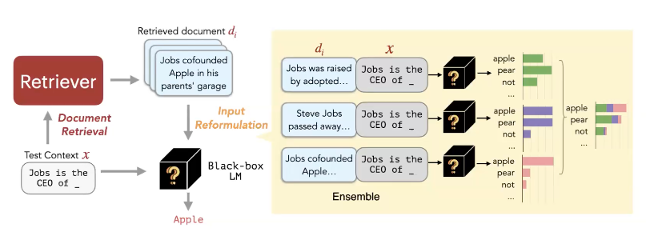

많은 LM들은 우리가 직접 학습할 수 없을 정도로 매우 큽니다. 이 말은 결국 LM은 업데이트 하기 위해 접근할 수 없는 black-box입니다. 그래서 REPLUG는 black-box LM을 이용하여 Retrieval 모델을 최적화하는 방법을 고안하였습니다. 먼저 text x에 대해서 document retriever을 통해서 관련있는 text chuncks를 얻습니다. 그리고 prediction을 refine 하기 위해 각 retrieved text에 대해서 LM의 input과 concat하고 ensemble prediction을 수행합니다.
이 방법은 어떠한 Retrieval Model, LM과도 함께 적용될 수 있습니다.

##### 2-2-1. REPLUG LSR (LM-Supervised Retrieval)

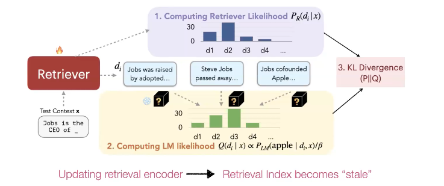

이 논문에서 제안한 또다른 중요한 접근 방식이 있습니다. 우리는 REPLUG 방식으로 어떠한 text chunk가 final prediction에 가장 기여했는 지 알 수 있습니다. 그래서 우리는 이 정보를 가지고 KL Divergence를 사용하여 Retriever을 학습시킬 수 있습니다.

이 방법은 LM을 supervision으로 사용하여 retrieval을 업데이트하는 것입니다. 하지만 여기서 문제는 index는 다루기 매우 크기 때문에 어떻게 다룰지가 관건입니다. 이 논문에서는 asynchronize update 테크닉을 사용하였습니다. 이는 뒤에서 자세히 다루겠습니다.

### Joint Training with asynchronous index update

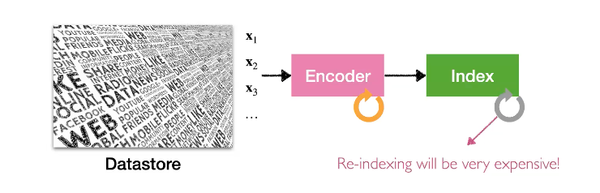

Retrieval 모델을 학습하기 위해서는 Encoder를 학습시켜야 하는데, 그렇게 되면 데이터의 index가 다시 모두 바뀌기 때문에 다시 모든 text에 대해서 re-encode를 해야하는 문제가 생깁니다.

이를 해결하기 위한 아이디어는 다음과 같습니다. 우선 학습 중에 Encoder는 계속해서 업데이트 되지만 index는 업데이트 하지 않고 그대로 사용하는 것을 허용합니다. 그리고 매 T step 마다 업데이트 된 Encoder로 다시 index를 rebuild 하는 것입니다.

#### 1. REALM

REALM이 이 방식을 사용하여 학습하는 모델입니다. 여기서 얼마나 retrieval index를 자주 업데이트 시킬 것인지는 중요한 디자인 요소입니다. REALM에서는 500 step 마다 업데이트를 수행하였습니다.

#### 2. Atlas

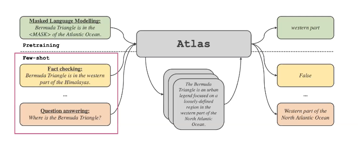

Atlas는 pretrained language model로 다양한 downstrem task를 적용할 수 있습니다. 이는 다음 Application 섹션에서 다루도록 하겠습니다.

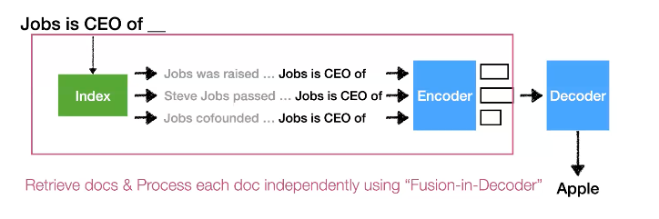

REALM의 Retrieval model은 encoder로만 이루어져있습니다. 이와 다르게 Atlas의 Retrieval model은 Encoder-Decoder 구조로 이루어져 있습니다. Atlas는 "Fusion-in-Decoder" 방식을 사용하는데, 이는 여러개의 input을 Encoder에서 동시에 처리하고나서, 이 정보들을 Decoder에서 joint prediction 하여 합산하는 방식입니다.

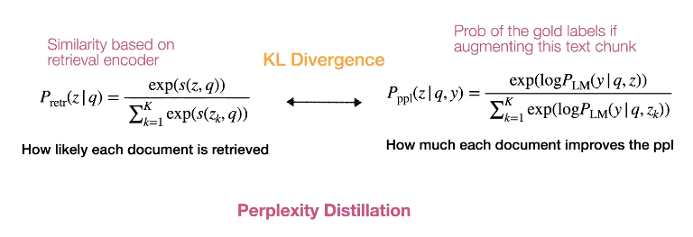

Atlas는 Language model을 retrieval model의 학습 가이드로 삼습니다. 먼저, 각 text chunk들이 retrieval 모델에 의해서 검색될 확률과 얼마나 각 text chunk들이 language model의 perplexity를 개선시킬지를 같은 선상에 놓습니다. 직관적으로 retrieved text는 LM의 encoder의 perplexity 개선에 도움을 줍니다. KL divergence를 사용하여 이 둘 사이의 거리를 좁히는 것이 학습의 objective입니다. 이때 index를 매번 업데이트 하는 것은 매우 비용이 많이 들기 때문에, 매 T step에서만 index를 업데이트 하는 방식을 사용하였습니다. 그럼에도 불구하고 여전히 wikipedia 데이터셋에서 30%의 학습 오버헤드가 있었습니다. 만약 더 큰 데이터셋으로 학습시킨다면, 이 오버헤드는 더욱 클 것입니다.

### Joint Training with in-batch approximation

모든 index (>100M)를 training 과정에서 업데이트 한다는 것은 매우 어렵습니다. 이를 해결하기 위한 아이디어는 모든 index 대신 현재 학습 배치의 index (~10k)만을 업데이트 하는 것입니다.

#### 1. TRIME: Training with in-batch memory

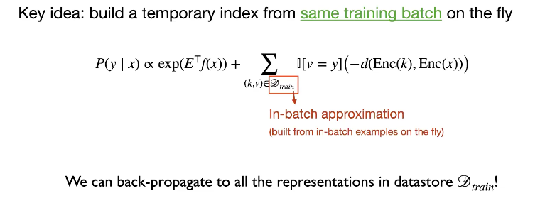

TRIME는 kNN-LM 모델 구조를 사용하는데, 다른 점은 학습 중 kNN retrieve를 전체 데이터에서 수행하는 것이 아니라 batch 내에서만 수행하여 loss를 계산한다는 것입니다. 수 step, epoch 동안 결국 전체 data store의 representation에 backpropagation을 수행할 수 있습니다.

하지만 우리는 in-batching 방식이 full index를 approximate 할 수 있다고 보장할 수 있을까요? 다른말로, 어떻게 in-batch 데이터를 샘플링해야 좋은 temporal index를 생성할 수 있을까요?

이를 위한 아이디어는 아래와 같습니다. text chunk들에 대해서 random batching을 수행하는 것이 아니라 비슷한 text chunks들이 포함되게 하는 것입니다. BM25 score를 사용하여 비슷한 text chunk들을 찾습니다. 비슷한 말뭉치들의 다음에 오는 text 들은 높은 확률로 겹칠 것입니다. 이 말은 결국 우리는 학습 중 많은 positive pair을 갖게 될것이고 더 높은 training signal을 만들 수 있습니다.

* BM25 Score: Bag-of-words 개념을 사용하여 쿼리에 있는 용어가 각각의 문서에 얼마나 자주 등장하는지를 평가.

#### 2. NPM: Nonparametric masked LMs

NPM은 TRIME과 다르게 masked language 모델 기반으로 더 많은 데이터에 의해 학습되었습니다. 또한, [MASK]는 token이 아니라 구 (phrase: 주어 또는 동사를 가지고 있지 않은 단어들의 집합)로 구성됩니다. 그리고 inference는 오직 순수한 retrieval result로만 구성됩니다.

학습 중 In-batch approximation을 수행하기 위해 NPM은 same-doc batching 방식을 사용합니다. 매우 큰 말뭉치에서 BM25 score을 계산하는 것은 매우 비 효율적입니다. 그래서 단순히 sampe document에서 샘플링을 수행하고, 공통적으로 등장하는 spans가  있으면 이를 positive라고 나머지 부분은 negative라고 처리합니다.

하지만 lexical (어휘) 말고 positive/negative를 정의할 다른 단서는 없을까요?

#### 3. RPT: Retrieval-pretrained transformer

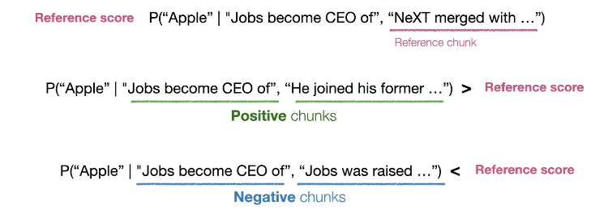

이 모델에서는 reference chunk를 가지고 next prediction을 만들기 위해 input에 join 했을 때 그 reference chunk가 prediction에 얼마나 기여했는지를 나타내는 score를 사용합니다.
만약에 다른 chunk가 prediction에 더 좋은 기여를 했을 경우 그 chunk를 positive라고, 반대는 negative라고 정의합니다.

#### Joint Training

Joint Training을 수행하면 end-to-end train으로 각 component가 최적화 될 수 있고 더 좋은 성능을 낼 수 있습니다.
하지만 여전히 학습은 복잡하고, 학습 과정에서 approximation을 수행하기 때문에 여전히 train-text discrepency가 존재합니다.

## Application (Downstream adaptation)

### 1. The range of tasks

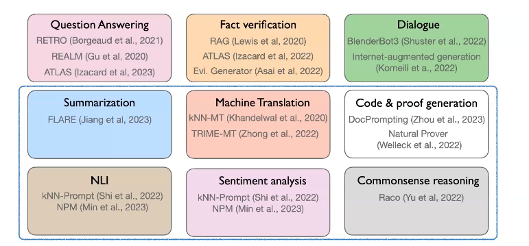

### 2. How to Adapt?

- Fine-tuning: LM과 Retriever를 task-data에 finetune
- Reinforcement learning
- Prompting: LM과 Retriever 모델을 frozen시키고 LM에 prompt만 task에 맞게 사용

### 3. Fine-tuning

#### 3-1. ATLAS

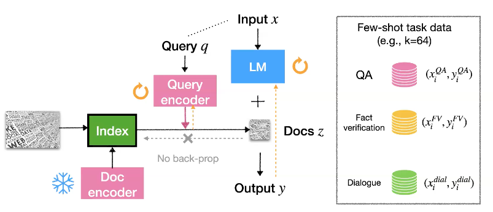

이 모델은 few-shot task data에 효율적으로 finetune하기 위해 Query Encoder를 사용하였습니다. 단지 query encoder와 LM의 모델만을 업데이트하며 학습하면 Retriever index는 변하지 않기 때문에 학습 비용을 크게 낮출 수 있습니다.

Finetune은 일반적으로 많은 데이터가 있을 수록 효과적이지만, 실험을 통해서 knowledge-inteisve task에서 query-side finetune이 few-shot 일지라도 좋은 성능을 보여줌을 확인하였습니다.

- knowledge-intensive task: 사람조차도 외부지식 (ex. 위키피디아 검색) 없이 해결하기 어려운 문제를 일컫습니다.

### 4. Reinforcement Learning

#### 4-1. GopherCite

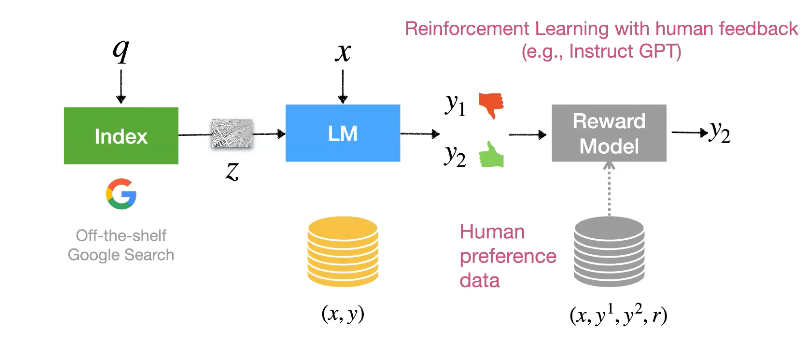 

Atlas와 다르게 GopherCite는 Google의 search system을 datastore로 삼습니다. 그래서 retreival component를 찾기 위한 노력이 필요없습니다(freeze index).

우리는 일반적으로 답변이 포함된 large 학습데이터가 없기 때문에 large language model에 prompting 하고, 사람이 직접 필터링 함으로써 training dataset를 생성합니다. 그리고 이 학습데이터를 가지고 supervised 방식으로 Language Model 만을 finetune 합니다. 그리고 같은 input x에 대해 두 개의 서로 다른 답변에 대한 human preference data를 가지고 Reward Model을 학습시킵니다. 그리고 이 모델을 사용하여 reinforcement learning 에 사용합니다.

그럼 human preference data는 어떻게 만들어야 할까요?

InstructGPT나 일반적인 NLP모델 학습에서 사람에게 어떤 답변이 더 좋나고 묻습니다. GopherCite에서 두가지 측면을 물어봤는데, 하나는 그럴싸함 (Plausible) 이고, 다른 하나는 동반된 증거로 뒷받침 되는 지 입니다. 이런 기준을 가지고 30k의 데이터를 수집하였습니다.

Finetune과 Reinforcement learning을 함께 사용하는 것이 더 좋은 성능을 보여줄 수 있습니다. 하지만 추가적인 학습 데이터 수집이 필요하다는 단점이 있습니다.

하지만 만약 우리가 Large 모델을 학습시킬 만한 여력이 없다면 어떻게 해야 할까요?

### 5. Prompting

prompting 은 어떠한 학습도 필요 없는 방식입니다.

앞에서 살펴 보았듯이 LM이 있으면 retrival 결과를 우리는 input space에 섞을 수도 있고, output space에 섞을 수도 있습니다.

#### 5-1. kNN-Prompt

우리는 여기서 kNN-LM 처럼 output space에서 섞는 시나리오를 보겠습니다.

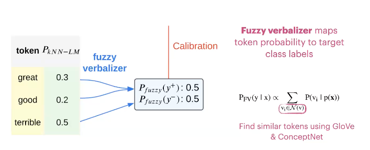

kNN classification을 수행한 뒤 output token의 분포는 매우 sparse 하기 때문에, 잘못된 답변을 내놓을 수 있습니다. 예를들어 위와 같이 great, good는 positive한 사실상 같은 의미로 negative 의미인 terrible 과 같이 다시 평가 되어야 하지만 확률이 분산되어 있어 무시될 수 있습니다. 이런 문제를 해결하기 위해 Fuzzy berbalizer를 사용하여 similar token을 찾아 같은 클래스로 맵핑하는 calibration 수행합니다. 이러한 방식으로 kNN-prompt는 kNN-LM 보다 더 월등한 성능을 보여주었습니다.

#### 5.2 REPLUG

input space에서 섞는 시나리오를 보겠습니다. 그 한 예시가 REPLUG 입니다. 위에서 살펴보았듯이 REPLUG는 먼저 text x에 대해서 document retriever을 통해서 관련있는 text chuncks를 얻습니다. 그리고 prediction을 refine 하기 위해 각 retrieved text에 대해서 LM의 input과 concat하고 ensemble prediction을 수행합니다.

이러한 방식은 데이터셋도 없고, 자원도 없을 경우 매우 쉽게 적용가능하지만, 하지만 여전히 FT 한 모델보다 성능이 좋지는 못합니다.

## Definition

#### A taxonomy of architectures

아키텍처의 분류 체계를 소개합니다. 검색 기반 언어 모델(LMs)의 아키텍처에 대한 다양한 차원을 기반으로 한 분류 체계입니다. 검색 기반 LMs는 데이터 저장소에 저장된 검색 단위의 세분화에 따라 분류될 수 있습니다:

1) chunk of text
2) token
3) entity mention

또한 데이터 저장소를 개선하고 유사성 검색을 개선하는 기술을 다루려고 계획하고 있습니다.
동시에, 검색 기반 LMs는 검색된 정보가 매개변수화된 인코더와 어떻게 통합되는지에 따라 분류될 수 있습니다

1) 검색된 구성 요소가 원래의 입력 텍스트와 연결되는지
2) 검색된 구성 요소가 잠재적이며 트랜스포머의 중간 계층에 통합되는지
3) 검색된 구성 요소에서 토큰의 분포와 LMs가 보간되는지.

#### Scalable learning algorithms

확장 가능한 학습 알고리즘 그런 다음, 검색 기반 LMs의 훈련 접근법에 대해 논의합니다. 검색 데이터 저장소는 일반적으로 매우 크기 때문에, 검색 기반 LMs를 효과적이고 효율적으로 훈련하는 방법은 여전히 도전적입니다. 먼저 대규모 사전 훈련 또는 다중 작업 지시 조정을 통해 검색 구성 요소와 LMs를 별도로 훈련하는 파이프라인 접근법에 대해 논의합니다. 여러 다른 작업들은 고정된 검색 모듈과 함께 검색 기반 LMs를 훈련합니다. 그런 다음, 합리적인 리소스 요구 사항 하에서 공동 훈련에 대해 논의합니다: 전체 데이터 저장소에 대한 배치 내 근사치를 통해, 또는 매개변수가 비동기적으로 업데이트된 데이터 저장소를 업데이트하는 것입니다. 전자는 공동 훈련 중에 신중하게 설계된 전체 말뭉치의 일부를 사용합니다. 반면에 후자는 비동기적인 인덱스 업데이트를 통해 훈련 중에 전체 말뭉치를 사용하는 것을 목표로 합니다.

#### Adaption to downstream tasks

검색 기반 언어 모델(LMs)의 기본 구성 요소에 대해 논의한 후, 검색 기반 LMs가 하류 응용 프로그램에 어떻게 적용되는지 보여줍니다. 먼저 모델을 새로운 작업에 적용하는 두 가지 접근법을 간략하게 요약합니다: 매개변수 업데이트 없이 제로샷 또는 퓨샷 프롬프팅, 그리고 대상 작업 데이터에 대한 세부 조정입니다. 그런 다음 대화, 의미론적 파싱, 기계 번역 등 특정 하류 작업을 위해 더 강력한 검색 기반 LMs를 구축하기 위해 설계된 방법들에 대해 논의합니다. 지금까지, 튜토리얼은 주로 영어 일반 텍스트를 검색하고 통합하는 데 초점을 맞추었습니다. 이 시점에서, 다국어, 다중 모달, 코드 검색을 포함하여 영어 텍스트를 넘어서 검색 기반 LMs의 최근 확장을 다룰 것입니다. 이러한 작업들은 종종 밀집 검색 모델을 확장하여 이질적인 입력 공간(예: 크로스 언어, 크로스 모달) 간의 검색을 가능하게 하며, 검색된 지식을 참조하는 것이 지식 집약적인 생성을 이끈다는 것을 보여주었습니다.

마지막으로, 연습을 사용하여 검색 기반 LMs의 효과성을 보여줄 것입니다. 그리고 튜토리얼을 몇 가지 중요한 질문과 미래의 방향에 대해 논의함으로써 마무리합니다.

(1) 우리는 어떻게 성능을 희생하지 않고 검색 기반 LMs의 확장성을 더욱 향상시킬 수 있는가

(2) 검색 기반 LMs가 빠르게 발전하는 LMs의 시대에 특히 유용한 경우는 언제인가

(3) 더 다양한 도메인에 대한 검색 기반 LMs의 응용을 가능하게 하는 것이 필요한 것은 무엇인가.
