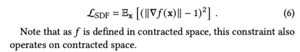

이 논문은 실사 이미지를 위한 고품질 메쉬를 재구성하는 방법을 제시합니다. 이 메쉬는 현실 세계의 큰 범위의 장면에 적합하며, 포토리얼리스틱한 새로운 시점 합성에 사용됩니다. 먼저 장면 내 표면에 해당하는 잘 동작하는 레벨셋을 가지도록 설계된 hybrid neural volume-surface scene representation을 최적화합니다. 그런 다음 이 표현을 고품질 삼각형 메쉬로 변환하고, 구면 가우시안을 기반으로 한 간단하고 빠른 시점 종속적인 외관 모델을 적용합니다. 마지막으로 캡처된 시점을 가장 잘 재현하기 위해 이 메쉬 표현을 최적화하며, 이는 상용 하드웨어에서 실시간 시점 합성을 위한 가속화된 다각형 래스터화 파이프라인을 활용할 수 있게 합니다. 이 접근 방식은 정확도, 속도 및 전력 소비 측면에서 기존 장면 표현을 능가하며, 외관 편집 및 물리 시뮬레이션과 같은 응용 프로그램을 가능하게 하는 고품질 메쉬를 생성합니다.

[Paper Link](https://arxiv.org/pdf/2302.14859.pdf)
[Code Link](https://github.com/hugoycj/torch-bakedsdf)

## Introduction

현재 신규 시점 통합(캡처된 이미지를 사용하여 관측되지 않은 시점에서 렌더링할 수 있는 3D 표현을 복구하는 작업)의 최고 수행 방법은 주로 Neural Radiance Fields (NeRF)에 기초하고 있습니다. NeRF는 연속적인 부피 함수로 장면을 표현하며, 다층 퍼셉트론(MLP)으로 매개 변수화됩니다. 이를 통해 NeRF는 세부적인 지오메트리와 시점에 따라 다르게 나타나는 효과를 보여주는 사실적인 렌더링을 생성할 수 있습니다. 그러나 NeRF의 MLP는 평가 비용이 많이들고 픽셀 당 수백 번 쿼리해야 하기 때문에 높은 해상도 이미지를 NeRF로부터 렌더링하는 것은 일반적으로 느립니다.

최근의 연구는 MLP 대신 볼륨 그리드와 같은 이산화된 부피 표현을 사용하여 NeRF 렌더링 성능을 향상시켰습니다. 그러나 이러한 방법은 상당한 GPU 메모리와 사용자 정의 부피 레이마칭 코드가 필요하며, 현대의 그래픽 하드웨어와 소프트웨어가 부피 필드가 아닌 폴리곤 표면을 렌더링하는 것에 중점을 두고 있기 때문에 일반적인 하드웨어에서 실시간 렌더링에 적합하지 않습니다.

현재 NeRF와 유사한 방법은 간단한 지오메트리를 가진 개별 객체의 고품질 실시간 렌더링 메쉬를 복구할 수 있습니다. 그러나 실제 세계의 무제한 장면을 캡처한 것에서 세부적이고 잘 행동하는 메쉬를 복원하는 것은 더 어려운 문제입니다. 최근에는 [MobileNeRF](https://jihyeonryu.github.io/2023-09-14-ai-pr-paper54/)가 이 문제를 해결하기 위해 NeRF를 훈련시켜 부피 내용이 폴리곤 메쉬의 면 위에 있는 제한된 NeRF를 구현한 후, 해당 NeRF를 텍스처 맵으로 빠르게 렌더링하는 방법을 도입하였습니다. 이 접근 방식은 합리적인 이미지 품질을 제공하지만 MobileNeRF는 장면 지오메트리를 최적화 후 텍스처 폴리곤 "수프"로 변환되는 axis-aligned 타일의 컬렉션으로 초기화합니다. 결과적으로 얻어진 지오메트리는 texture editing, relighting, physical simulation과 같은 일반적인 그래픽 응용 프로그램에 적합하지 않습니다.

이 논문의 주요 아이디어는 SDF를 수축된 좌표 공간에서 정의하는 것입니다.

- SDF는 **Signed Distance Function(부호 있는 거리 함수)** 의 약자로, 3D 공간에서 특정 지점까지의 거리를 나타내는 함수입니다. SDF는 어떤 지점이 표면에서 얼마나 떨어져 있는지와 방향(표면이 어느 쪽에 있는지)을 모두 고려합니다. 이 함수는 특정 지점이 표면 위에 있으면 양수의 값을, 표면 아래에 있으면 음수의 값을, 그리고 표면 상에 위치하면 0의 값을 갖습니다.

이는 다음과 같은 이점이 있습니다.

1. 먼 거리의 내용을 강력하게 규제할 수 있습니다.
2. 수축된 공간에서 메쉬를 추출할 수 있어 삼각형 예산을 더 잘 분배할 수 있습니다(중앙에 더 많이, 주변에는 더 적게).

그런 다음 이 메쉬에는 구형 가우시안을 기반으로 한 빠르고 효율적인 시점 종속 외관 모델이 장착됩니다. 이 모델은 입력 이미지를 재현하도록 세밀하게 조정되었습니다. 이 시스템의 출력은 일반적인 장치에서 실시간 프레임 속도로 렌더링될 수 있으며, 현실감, 속도, 및 전력 소모 측면에서 이전 작업을 능가한다는 것을 보여줍니다. 추가로 이 (유사한 이전 작업과는 달리) 모델이 생성한 메쉬가 정확하고 상세하여 외관 편집 및 물리 시뮬레이션과 같은 표준 그래픽 응용 프로그램이 가능하다는 것도 보여줍니다.

## Method

저자의 방법은 Figure 2에서 시각화된 것처럼 세 단계로 구성되어 있습니다. 먼저, NeRF와 유사한 부피 렌더링을 사용하여 장면의 지오메트리와 외관의 표면 기반 표현을 최적화합니다. 그런 다음, 해당 지오메트리를 메쉬로 "베이킹"하고, 이 메쉬가 충분히 정확하여 외관 편집 및 물리 시뮬레이션을 지원할 수 있음을 보여줍니다. 마지막으로, 메쉬의 각 정점에 포함된 구형 가우시안(SGs)을 사용하는 새로운 외관 모델을 훈련합니다. 이 모델은 첫 번째 단계의 비용이 많이 드는 NeRF와 유사한 외관 모델을 대체합니다. 이 방법으로 얻은 결과 3D 표현은 메쉬를 래스터화하고 소수의 구형 가우시안을 쿼리하는 것만으로도 실시간으로 렌더링될 수 있습니다.

### 1. Modeling density with an SDF

이 모델의 표현은 mip-NeRF 360의 이점과 VolSDF의 표면 속성을 결합합니다. mip-NeRF 360은 무한한 장면을 나타내는 데 사용되며, VolSDF는 표면 특성이 잘 정의된 하이브리드 볼륨-표면 표현을 제공합니다. VolSDF는 장면을 MLP-parameterized signed distance function (SDF) f를 사용하여 volumetric density로 모델링합니다. 저자의 포커스는 unbounded real world scene을 reconstructing 하는 것이기 때문에, function f를 world-space 대신 식(3)처럼 contracted-space로 파라미터화합니다.

이 contract function은 unbounded scene point를 bounded domain으로 맵필 시켜줌으로써 contracted coordinates를 생성합니다. 물체의 표면에 위치한 point들의 경우 f는 zero-level set 입니다. VolSDF에 따라 volume density 타우는 식 (5)와 같고, 여기서 프시는 scale parameter b를 가진 0-mean 라플라스 분포의 누적 분포 함수(CDF)를 나타냅니다.

- 라플라스 분포의 CDF
  

여기서 scale b가 0에 가까워 짐에 따라 volume density는 0을 반환하는 함수로 수렴합니다. f가 유요한 singed distance function이 되도록 장려하기 위해, f가 Eikonal 방정식을 만족하지 않는 정도를 벌점으로 부여합니다.

- Eikonal Equation: 주어진 점에서 스칼라 함수의 그레디언트 벡터의 크기가 항상 1이 되도록 하는 편미분 방정식

최근에 나온 Ref-NeRF는 시야 방향에 따라 변하는 외관을 개선하기 위해 표면 법선을 중심으로 반사된 시야 방향의 함수로 매개변수화했습니다. 저자는 SDF로 매개변수화된 밀도를 사용함으로써 이를 쉽게 채택할 수 있습니다. 왜냐하면 SDF는 잘 정의된 표면 법선을 가지기 때문입니다: `n(x) = grad{f(x)}/||grad{f(x)}||`.

따라서 모델의 이 단계를 훈련할 때 Ref-NeRF의 외형 모델을 채택하고 별도의 확산 및 반사 구성 요소를 사용하여 색상을 계산합니다. 여기서 반사 구성 요소는 표면 법선 방향에 대한 시야 방향의 반사, 표면 법선과 시야 방향 간의 내적, 그리고 f를 매개변수화하는 MLP에 의해 출력된 256 element bottleneck 벡터의 연결로 매개변수화됩니다.

저자는 모델로 mip-NeRF 360의 변형을 사용합니다.

VolSDF와 유사하게 밀도 스케일 계수를 방정식 5에서 `a=1/b`로 매개변수화합니다. 그러나 b를 최적화 가능한 매개변수로 남겨두는 대신 b를 스케줄링하는 것이 더 안정적인 훈련 결과를 얻게 되었습니다. b의 크기는 아래와 같은 방법으로 학습 중 증가시켰습니다.

SDF로 밀도를 매개변수화할 때 이미 Eikonal 정규화가 필요하며, floater 현상을 제거하고 잘 행동하는 법선을 얻게 됩니다. 따라서 저자는 Ref-NeRF의 방향 손실이나 예측된 법선, mip-NeRF 360의 왜곡 손실을 사용할 필요가 없다고 판단하였습니다.

### 2. Baking a High-Resolution Mesh

신경 기반 부피 표현을 최적화한 후, 복구된 MLP-매개변수화된 SDF로부터 삼각형 메시를 생성합니다. 이를 위해 정규 3D 그리드에서 쿼리하고 그 후 Marching Cubes를 실행합니다. VolSDF는 경계를 모델링할 때 SDF 영점 횡단을 넘어서는 밀도 감소를 사용하며(이는 b로 매개변수화됨), 메시를 추출할 때 이 확산을 고려합니다. 표면 교차점을 추출할 때 iso-value로 0.001을 선택합니다. 그렇지 않으면 장면 기하학이 약간 침식되는 것으로 나타납니다.

- Marching Cubes: 3차원 이산 스칼라필드 (voxcel)에서 iso 표면의 다각형 메시를 추출하기 위한 컴퓨터 그래픽스 알고리즘입니다. 입력 볼륨을 이산적인 큐브집합으로 나누는 것을 전제로합니다. 선형 재구성 필터링을 가정하면, 주어진 iso 표면의 일부를 포함하는 각 큐부는 쉽게 식별될 수 있습니다. iso 표면의 각 부분을 포함하는 각 큐브에 대해, 큐브 내부에서의 삼각형 메시를 생성합니다.

#### Visibility and free-space culling

Marching Cubes를 실행할 때 MLP-매개변수화된 SDF에는 관측된 시각에서 가려진 영역과 제안된 MLP가 "빈 공간"으로 표시한 영역에서 쓸데없는 표면 교차점이 포함될 수 있습니다. 이러한 두 종류의 영역에서 SDF MLP의 값은 훈련 중 감독되지 않으므로, 재구성된 메시에서 쓸데없는 내용으로 나타날 수 있는 표면 교차점을 제거해야 합니다. 이를 해결하기 위해 훈련 데이터에서 레이를 따라 샘플을 취합니다. 각 샘플에 대해 체적 렌더링 가중치를 계산합니다(즉, 이것이 훈련 픽셀 색상에 기여하는 정도). 그런 다음 충분히 큰 렌더링 가중치(> 0.005)를 가진 어떤 샘플이든 3D 그리드로 뿌리고 해당 셀을 표면 추출의 후보로 표시합니다.

#### Mesh Extraction

수축된 공간에서 균일 간격의 좌표에서 SDF 그리드를 샘플링하며, 이로 인해 세계 공간에서는 비균일 간격의 비축 축 정렬되지 않은 좌표를 얻습니다. 이는 원점에 가까운 전경 콘텐츠에 대해 작은 삼각형(세계 공간에서)과 먼 콘텐츠에 대해 큰 삼각형을 생성하는 유용한 특성을 갖습니다. 효과적으로 수축 연산자를 LOD(레벨 오브 디테일) 전략으로 활용하고 있습니다. 원하는 렌더링된 뷰가 장면 원점에 가깝기 때문에 그리고 수축의 형태가 원근 투영의 효과를 해제하기 위해 설계되었기 때문에, 모든 삼각형은 이미지 평면에 투영될 때 대략적으로 동일한 면적을 갖게 됩니다.

#### Region growing

삼각형 메시를 추출한 후에는 작은 구멍을 메우기 위해 영역 확장 절차를 사용합니다. 이 작은 구멍은 입력 시점에서 관찰되지 않았거나 베이킹 절차 중에 제안된 MLP에서 놓칠 수 있는 영역에 존재할 수 있습니다. 현재 메시 주변의 이웃 복셀을 반복적으로 표시하고 이러한 새로 활성화된 복셀에 존재하는 표면 교차점을 추출합니다. 이 영역 확장 전략은 SDF MLP에 표면이 존재하지만 부족한 훈련 뷰 커버리지나 제안 MLP의 오류로 인해 Marching Cubes에서 추출되지 않은 상황을 효과적으로 해결합니다. 그런 다음 메시를 월드 공간으로 변환하여 유클리드 공간에서 작동하는 전통적인 렌더링 엔진에 의해 래스터화될 수 있도록 준비합니다.

#### Implementation

가시성 및 빈 공간 제거 및 Marching Cubes에는 모두 20483 그리드를 사용합니다. 처음에는 Marching Cubes를 가시성이 있고 비어 있지 않은 복셀에만 실행합니다. 그런 다음 32개의 영역 확장 반복에서 현재 메시의 정점 주변의 8^3 복셀 이웃에서 Marching Cubes를 다시 실행하여 메시를 완성합니다. 마지막으로 정점 순서 최적화사용하여 메시를 후처리합니다. 이 최적화는 현대적인 하드웨어에서 정점 셰이더 출력을 캐시하고 인접한 삼각형 간에 재사용함으로써 렌더링 성능을 향상시킵니다.

### 3. Modeling view-dependent appearance

위에서 설명한 베이킹 절차는 MLP 기반의 장면 표현으로부터 고품질의 삼각형 메시 기하를 추출합니다. 장면의 외관을 모델링하기 위해 각 메시 정점에는 확산 색상 `c_d` 및 일련의 구 형태의 가우시안 봉을 제공합니다. 멀리 떨어진 영역은 제한된 시야 방향에서만 관찰되기 때문에 전체 장면에서 어디서든 동일한 충실도로 시야 의존성을 모델링할 필요가 없습니다. 실험에서는 중심 영역 `||x|| < 1`에는 세 개의 구 형태의 가우시안 봉을 사용하고, 주변에는 하나의 봉을 사용합니다. Figure 3에서 저자의 외관 분해를 시연하고 있습니다.

이 외형 표현은 계산 및 메모리의 효율성 목표를 충족하며 따라서 실시간으로 렌더링될 수 있습니다. 각 구 형태의 가우시안 봉은 일곱 개의 매개변수를 갖습니다: 봉 평균을 위한 3D 단위 벡터 m, 봉 색상을 위한 3D 벡터 c, 그리고 봉 너비를 위한 스칼라 lambda 입니다. 이러한 봉은 시야 방향 벡터 d에 의해 매개변수화되므로 어떤 주어진 정점을 교차하는 광선의 경우 렌더링된 색상 C은 다음과 같이 계산될 수 있습니다:

이 표현을 최적화하기 위해 먼저 메시를 모든 훈련 뷰로 래스터화하고 각 픽셀에 연관된 정점 인덱스 및 바리센트릭 좌표를 저장합니다. 이 전처리 후, 학습된 정점 매개변수에 바리센트릭 보간을 적용하고 시야 의존적 외형 모델을 실행하여 픽셀을 쉽게 렌더링할 수 있습니다(프래그먼트 셰이더의 작동을 시뮬레이션). 따라서 픽셀 당 색상 손실을 최소화함으로써 정점당 매개변수를 최적화할 수 있습니다. 메시 지오메트리로 잘 모델링되지 않는 픽셀(예: 부드러운 객체 경계와 반투명 객체의 픽셀)에 의해 최적화가 편향되지 않도록 하기 위해 VolSDF에서 최소화된 L2 손실 대신 robust loss `p(-, a, c)` 를 사용합니다. 훈련 중에는 하이퍼파라미터 `a = 0, c = 1/5)를 사용하여 이 손실을 사용하며, 이는 특이값에 강건하게 최적화할 수 있도록 합니다. 또한 최적화된 값이 8비트 정밀도로 잘 표현되도록 직접 추정을 통해 양자화를 모델링합니다.

이 정점당 표현을 직접 최적화하면 GPU 메모리가 포화되어 고해상도 메시로 확장할 수 없습니다. 대신 Instant NGP를 기반으로 한 압축된 신경 해시그리드 모델을 최적화합니다. 최적화 중에는 훈련 배치 내의 각 3D 정점 위치에서 이 모델을 쿼리하여 확산된 색상과 구 형태의 가우시안 매개변수를 생성합니다. 최적화가 완료되면 해시 그리드에 포함된 압축된 장면 표현을 쿼리하여 각 정점 위치에서 관련된 외형 매개변수를 얻습니다. 마지막으로, 결과 메시와 정점당 외형 매개변수를 gLTF 형식 [ISO/IEC 12113:2022 2022]을 사용하여 내보내고, 웹 프로토콜에서 기본적으로 지원하는 gzip으로 압축합니다.

## Experiments

