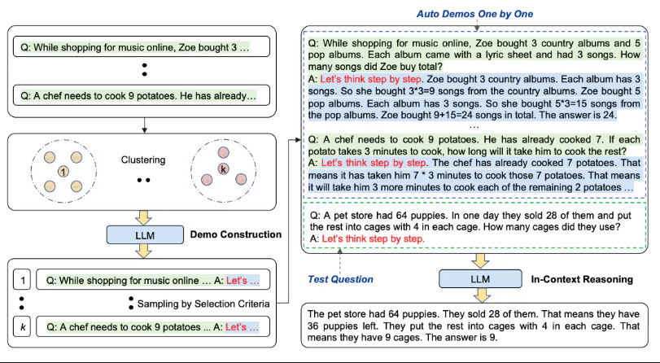
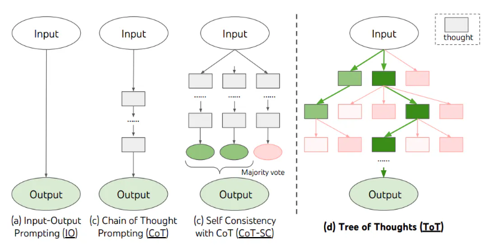
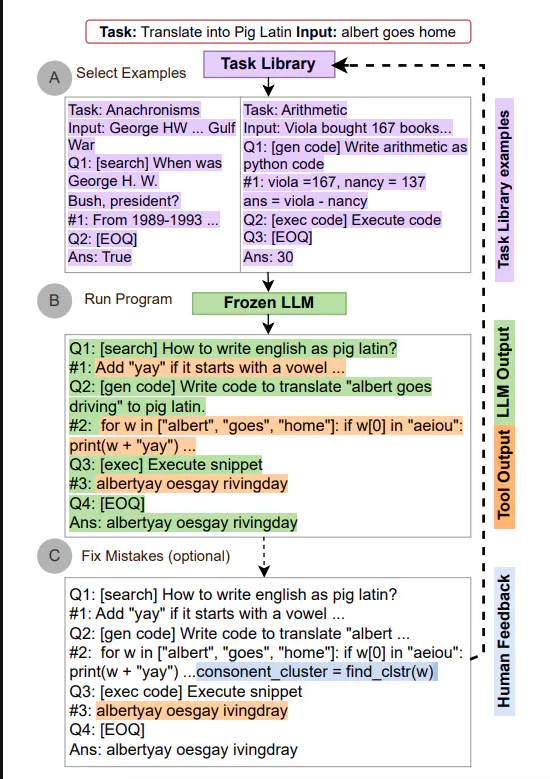
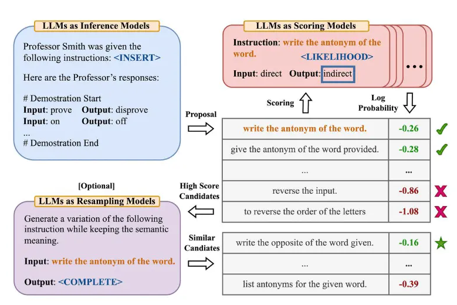
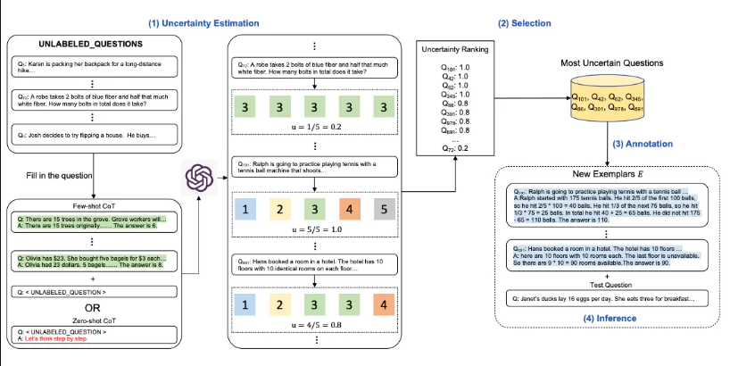
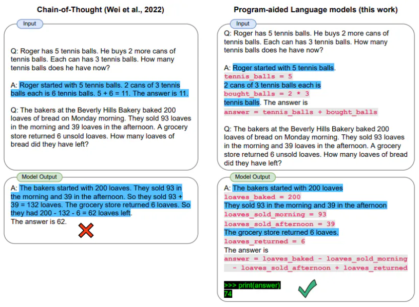

이 글은 [Prompt Engineering Guide](https://www.promptingguide.ai/kr/introduction)를 정리한 글입니다.

## Prompt 구성 요소

1. 지시: 모델이 수행할 특정 작업
2. 문맥: 더 나은 응답을 위해 모델을 조정할 수 있는 외부 정보나 추가 문맥
3. 입력 데이터: 응답 받고자 하는 질문
4. 출력 지시자: 출력의 유형이나 형식

Prompt
```text
지시: 아래 문맥을 고려해서 질문에 답변해 줘. 
출력 지시자: 답변은 짧고 간결하게 해 줘. 답변이 정확하지 않다면, 「확실치 않은 대답」이라고 응답해 줘.
문맥: Teplizumab은 Ortho Pharmaceutical이라는 뉴저지의 제약 회사에서 유래했다. 그곳에서, 과학자들은 OKT3라는 항체의 초기 버전을 만들어 냈다. 원래 쥐에서 유래된 이 분자는 T 세포의 표면에 결합하여 세포를 죽이는 잠재력을 제한할 수 있다. 1986년, 신장 이식 후 장기 거부 반응 예방을 위해 승인되어 인간이 사용할 수 있는 최초의 치료용 항체가 되었다.
입력 데이터: OKT3는 어디서 유래했는가?
답변:
```

## Techniques

### Zero-Shot Prompting

- 프롬프트에 예시를 제공하지 않고 명령어만 사용하는 경우
- 명령어 튜닝 (Instruction tuning) 또는 RLHF (사람의 피드백을 통한 강화학습)을 통해서 성능을 개선 할 수 있음

Prompt

```text
텍스트를 중립, 부정 또는 긍정으로 분류합니다.
텍스트: 휴가는 괜찮을 것 같아요.
감정:
```

Output

```text
중립
```

### Few-Shot Prompting

- 프롬프트에 예시를 제공하여 모델이 문맥 내 학습을 가능하게 하는 기술
- 충분히 큰 대규모 언어 모델에서 발생하는 특성
- 모델이 응답해야하는 후속 예제의 조건부 역할
- 1-shot, 3-shot, 5-shot, 10-shot 등 늘려가며 실험해 볼 수 있습니다.
- 사용하는 형식도 성능에 중요한 역할을 하며, 무작위 레이블만 사용 (정답 여부와 상관없이) 하더라도 레이블이 전혀 없는 것보다 훨씬 낫습니다.

Prompt

```text
정말 멋지네요! // 긍정
이건 나쁘다! // 부정
와우 그 영화 정말 멋졌어요! // 긍정
정말 끔찍한 쇼였어! //
```

Output

```text
부정
```

- Limitation: 복잡한 추론 작업을 처리할 때는 여전히 한계가 있음

### Chain-of-Thought Prompting

- 중간 추론 단계를 제공해 복잡한 추론을 가능하게 하는 기술
- 충분히 큰 대규모 언어모델에서 발생하는 특성

Prompt

```text
이 그룹의 홀수의 합은 짝수야: 4, 8, 9, 15, 12, 2, 1
A: 홀수(9, 15, 1)를 모두 더하면 25가 돼. 정답은 거짓이야.
이 그룹의 홀수의 합은 짝수야: 15, 32, 5, 13, 82, 7, 1
A:
```

Output

```text
홀수(15, 5, 13, 7, 1)를 모두 더하면 41이 돼. 답은 거짓이야.
```

#### 1. Zero-shot CoT Prompting

- 단순히 "단계별로 생각해 보자"를 프롬프트에 추가

Prompt

```text
나는 시장에 가서 사과 10개를 샀어. 나는 사과 2개를 이웃에게 주고, 2개를 수리공에게 주었어. 그리고 사과 5개를 더 사서 1개는 내가 먹었어. 사과가 몇 개나 남았니?
단계별로 생각해 보자.
```

Output

```text
사과 11개
```

#### 2. Automatic CoT Prompting

- 질문을 다양하게 샘플링하고 추론 체인을 생성하여 시연을 구성하는 방법을 제안
- Process

1. **질문 클러스터링**: 주어진 작업의 질문들을 의미적 유사성에 따라 클러스터링합니다
2. **다양한 질문 샘플링**: Auto-CoT은 다양한 클러스터를 커버하는 다양한 질문 세트를 샘플링합니다
3. **추론 체인 생성**: 각 샘플링된 질문에 대해, LLM 자체를 Zero-Shot CoT 모드에서 사용하여 질문에서 답변으로 이어지는 추론 체인을 생성합니다



### Self-Consistency

- few-shot CoT을 통해 여러 가지 다양한 추론 경로를 샘플링하고, 여러 번의 프롬프트 생성 과정을 거쳐 가장 일관된 답을 선택
- 모델에게 여러 번 프롬프트를 제공하여 다양한 출력을 생성하는 기법
- 이 방법은 모델이 자신의 응답을 자체 검증하는 것과 유사하며, 학생이 답안을 다시 확인하는 것처럼, AI 모델은 응답을 상호 참조하여 일관성을 유지
- 최종 출력 얻는 방법

1. 모델은 여러 번의 프롬프트에 대한 다양한 출력을 생성
2. 이렇게 생성된 개별 출력 중에서 가장 일반적으로 나타나는 출력 또는 응답이 최종 결과로 선택 (다수결의 원칙)

Prompt

```text
Q: 과수원에는 15그루의 나무가 있어. 과수원의 일꾼들이 오늘 과수원에 나무를 심을 거야. 나무 심기가 끝나면
21그루의 나무가 있을 거야. 오늘 과수원 일꾼들은 몇 그루의 나무를 심었을까?
A: 15그루로 시작합니다. 나중에 나무가 21그루가 됩니다. 그 차이가 그들이 심은 나무의 수일 것입니다.
따라서 그들은 21 - 15 = 6그루의 나무를 심었어야 합니다. 정답은 6입니다.
Q: 주차장에 3대의 차량이 있고 2대의 차량이 더 도착하면 주차장에 몇 대의 차량이 있을까?
A: 주차장에 이미 3대의 차량이 있습니다. 2대가 더 도착합니다. 이제 3 + 2 = 5대의 차량이 있습니다. 정답은 5입니다.
Q: 지호는 초콜릿을 32개, 여동생은 42개를 가지고 있었어. 둘이 35개를 먹었다면 총 몇 개가 남았을까?
A: 레아는 초콜릿 32개, 레아의 여동생은 42개를 가지고 있었습니다. 즉, 원래 32개 + 42개 = 74개의
초콜릿이 있었습니다. 35개를 먹었습니다. 따라서 총 74 - 35 = 39개의 초콜릿이 남아 있습니다. 정답은 39입니다.
Q: 내가 6살이었을 때 내 여동생은 내 나이의 절반인 나이였어. 지금 나는 70살이고 내 여동생은 몇 살일까?
A:
```

Output1:

```
제가 6살이었을 때 여동생은 제 나이의 절반이었으므로 3살이었어요. 이제 저는 70살이므로 여동생은 70 - 3 = 67살입니다. 정답은 67입니다.
```

Output2:

```
화자가 6살이었을 때 여동생은 화자의 절반 나이인 3살이었습니다. 이제 화자가 70살이 되었으므로 여동생은 70 - 3 = 67살이 됩니다. 정답은 67입니다.
```

Output3:

```
내가 6살이었을 때 여동생은 내 나이의 절반이었으므로 3살이고, 이제 나는 70살이므로 여동생은 70/2 = 35살입니다. 정답은 35입니다.
```

### Generated Knowledge Prompting

- 프롬프트의 일부로 사용할 지식을 생성하게 하고 이를 통합하게 함으로써 상식적 추론과 같은 작업의 성능을 높이는 기법

지식 생성 Prompt

```text
Input: 그리스는 멕시코보다 크다.
Knowledge: 그리스는 약 131,957 제곱 킬로미터이고, 멕시코는 약 1,964,375 제곱 킬로미터로 멕시코가 그리스보다 1,389% 더 크다.
Input: 안경은 항상 김이 서린다.
Knowledge: 안경 렌즈에는 땀, 호흡 및 주변 습도에서 나오는 수증기가 차가운 표면에 닿아 식은 다음 작은 액체 방울로 변하여 안개처럼 보이는 막을 형성할 때 응결이 발생한다. 특히 외부 공기가 차가울 때는 호흡에 비해 렌즈가 상대적으로 차가워진다.
Input: 물고기는 생각할 수 있다.
Knowledge: 물고기는 보기보다 훨씬 더 똑똑하다. 기억력과 같은 많은 영역에서 물고기의 인지 능력은 인간이 아닌 영장류를 포함한 '고등' 척추동물과 비슷하거나 그 이상이다. 물고기의 장기 기억력은 복잡한 사회적 관계를 추적하는 데 도움이 된다.
Input: 평생 담배를 피우는 것의 일반적인 결과는 폐암에 걸릴 확률이 정상보다 높다는 것입니다.
Knowledge: 평생 동안 하루 평균 담배를 한 개비 미만으로 꾸준히 피운 사람은 비흡연자보다 폐암으로 사망할 위험이 9배 높았다. 하루에 한 개비에서 열 개비 사이의 담배를 피운 사람들은 폐암으로 사망할 위험이 비흡연자보다 거의 12배 높았다.
Input: 돌은 조약돌과 같은 크기다.
Knowledge: 조약돌은 퇴적학의 우든-웬트워스 척도에 따라 입자 크기가 4~64밀리미터인 암석 덩어리다. 조약돌은 일반적으로 과립(직경 2~4밀리미터)보다는 크고 자갈(직경 64~256밀리미터)보다는 작은 것으로 간주된다.
Input: 골프의 목적 중 하나는 다른 사람보다 더 높은 점수를 얻기 위해 노력하는 것이다.
Knowledge:
```

Output Knowledge 1:

```text
골프의 목적은 최소의 스트로크로 한 세트의 홀을 플레이하는 것이다. 골프 라운드는 일반적으로 18홀로 구성된다. 각 홀은 표준 골프 코스에서 라운드 중 한 번씩 플레이된다. 각 스트로크는 1점으로 계산되며 총 스트로크 수를 사용하여 게임의 승자를 결정한다.
```

Output Knowledge 2:

```text
골프는 경쟁하는 선수(또는 골퍼)가 여러 종류의 클럽을 사용하여 가장 적은 수의 스트로크로 코스에 있는 한 세트의 홀에 공을 치는 정밀한 클럽 앤 볼 스포츠다. 각 홀에서 기록한 총 타수를 합산하여 계산하는 점수가 최저가 되도록 코스를 완주하는 것이 목표다. 가장 낮은 점수를 기록한 플레이어가 게임에서 승리한다.
```

지식 통합 및 예측 Prompt

```text
Question: 골프의 목적 중 하나는 다른 사람보다 더 높은 총점을 얻기 위해 노력하는 것이다. 예, 아니오?
Knowledge: {output_knowledge}
설명하고 답하십시오: 
```

Output1: (높은 확신)

```text
아니요, 골프의 목적은 다른 사람보다 더 높은 점수를 얻는 것이 아닙니다. 오히려 가장 적은 수의 스트로크로 한 세트의 홀을 플레이하는 것이 목표입니다. 게임의 승자를 결정하는 데에는 총 점수가 아니라 총 스트로크 수가 사용됩니다.
```

Output2: (낮은 확신)

```text
예, 골프의 목적 중 하나는 다른 사람보다 더 높은 점수를 얻기 위해 노력하는 것입니다. 각 플레이어는 각 홀에서 기록한 총 타수를 합산하여 계산되는 가장 낮은 점수로 코스를 완주하려고 합니다. 가장 낮은 점수를 얻은 플레이어가 게임에서 승리합니다.
```

### Three of Thoughts (ToT)

- CoT 프롬프팅 기법을 일반화하여, 문제 해결을 향한 중간 단계로서의 텍스트 단위에 대한 탐색을 가능하게 함
- 이러한 방식은 언어 모델이 문제 해결 시 여러 추론 경로를 탐색할 수 있게 하여, 그들의 생각 과정을 명확히 하고, 올바른 응답을 얻을 가능성을 높임
- 구성 요소
  - 생각 분해: 문제를 여러 하위 문제로 분해합니다.
  - 생각 탐색: 각 하위 문제에 대한 다양한 해결책을 탐색합니다.
  - 생각 선택: 가장 유망한 생각을 선택합니다.
  - 생각 결합: 선택된 생각들을 결합하여 최종 답변을 생성합니다.



- 깊이/너비 우선 탐색, 빔 탐색 등을 활용
- 강화학습을 통해 훈련된 ToT 컨트롤러 활용

너비 우선 탐색 ToT 예시

```text
"인간의 유전자를 수정하는 기술에 대한 장단점은 무엇인가?"
이 문제를 두 개의 하위 문제로 분해할 수 있습니다: "인간의 유전자를 수정하는 기술의 장점은 무엇인가?"와 “인간의 유전자를 수정하는 기술의 단점은 무엇인가?”.
이제 각 하위 문제에 대해 너비우선탐색을 수행하여 다양한 생각을 탐색합니다. 
예를 들어, "장점"에 대한 생각을 탐색할 때, “질병 치료”, “수명 연장”, “개선된 능력” 등의 생각을 생성할 수 있습니다. 
"단점"에 대한 생각을 탐색할 때는 “윤리적 문제”, “알 수 없는 장기적인 영향”, “사회적 불평등” 등의 생각을 생성할 수 있습니다.
이렇게 생성된 생각들 중에서 가장 유망한 생각을 선택하고, 이들을 결합하여 최종 답변을 생성합니다.
```

Prompt Sample

```text
세 명의 다른 전문가들이 이 질문에 답하고 있다고 상상해보도록 해.
모든 전문가들은 자신의 생각의 한 단계를 적어내고,
그것을 그룹과 공유할거야.
그런 다음 모든 전문가들은 다음 단계로 넘어가. 등등.
만약 어떤 전문가가 어떤 시점에서든 자신이 틀렸다는 것을 깨닫게 되면 그들은 떠나.
그렇다면 질문은...
```

### Retrieval Augmented Generation (RAG)

- 외부 지식 소스에 액세스 가능한 언어 모델
- 검색 기반 생성을 통해 신뢰할 수 있는 결과를 생성
- 더 자세한 내용은 [Retrieval-based Language Models and Applications](https://jihyeonryu.github.io/2023-12-13-survey-paper6/)를 참고 하세요.

### Automatic Reasoning and Tool-use (ART)

- 중간 추론 단계를 자동 생성하기 위한 방법으로 적절한 장소에 도구를 사용하도록 장려
- Process
  1. 새로운 작업이 주어지면 작업 라이브러리에서 다단계의 추론 및 도구 사용하는 시연을 선택
  2. Frozen LLM을 사용하여 시연처럼 중간 추론 단계를 자동 생성
  3. 단계 별로 실행
  4. 외부 도구가 호출될 때마다 생성을 일시 중단하고, 생성을 재개하기 전에 그 출력들을 통합하여 사용



- 사람들로 하여금 추론 단계에서 오류를 수정하거나, 단순히 작업 및 도구 라이브러리를 추가, 업데이트 함으로써 개선 가능

### Automatic Prompt Engineer (APE)

- 대형 언어 모델을 사용하여 자동으로 명령어를 생성하고 선택하는 프레임워크.
- 이 방법에서는 명령어를 "프로그램"으로 취급하며, 대형 언어 모델이 제안하는 명령어 후보군 중에서 선택된 점수 함수를 최대화하는 명령어를 찾아 최적화
- Process
  1. 명령어 생성: APE는 작업을 수행하는 데 필요한 명령어를 자동으로 생성합니다. 이는 출력 데모를 통해 지정된 작업에 대한 명령어를 생성합니다.
  2. 명령어 실행 및 평가: 생성된 명령어 후보들은 대상 모델을 사용하여 실행되며, 계산된 평가 점수에 따라 가장 적절한 명령어가 선택됩니다.
  3. 결과 반환: 선택된 명령어를 따르는 대형 언어 모델의 제로샷 성능을 평가하여 선택된 명령어의 품질을 평가합니다.



### Active-Prompt
- CoT 방법은 사람이 만든 고정된 규범에 의존하므로 가장 효과적인 방법은 아닐 수 있음 
- Active Prompt 기법은 대형 언어 모델을 사용하여 가장 유용한 질문을 적극적이고 신중하게 선택하는 방법.
- 이 기법은 주로 복잡한 추론 작업에서 사용되며, 특정 작업에 대한 가장 중요하고 도움이 되는 질문을 결정하는 문제를 해결하는 데 초점
- Process
  1. 몇가지 CoT 예제 (Few shot, zero shot)를 포함하거나, 포함하지 않은 질문 선택
  2. LLM으로부터 각 k개의 답변 생성 
  3. 각 k개의 답변을 기반으로 불확실성 메트릭 계산 (불일치 사용)
  4. 가장 불확실한 질문을 선택하여 주석을 담 
  5. 주석이 달린 질문을 바탕으로 추론 



### Directional Simulus Prompting
- 대형 언어 모델을 특정 원하는 출력 방향으로 안내하는 새로운 프레임워크
- 대형 언어 모델을 직접 조정하는 대신, 각 입력 인스턴스에 대해 보조적인 방향성 자극/힌트 프롬프트를 생성하는 작은 조정 가능한 정책 언어 모델을 사용
- 이 접근법은 정책 언어 모델을 최적화하여 대형 언어 모델이 원하는 행동과 일치하는 방향성 자극/힌트 프롬프트를 탐색함으로써 대형 언어 모델의 직접 조정에 대한 도전을 우회합니다.
- 정책 모델은 1) 레이블이 지정된 데이터를 사용한 감독 학습과 2) 대형 언어 모델의 출력에 기반한 오프라인 또는 온라인 보상에서 강화 학습을 통해 최적화될 수 있습니다.

예시
```text
예를 들어, 우리가 "뉴스 기사 요약"이라는 작업을 수행하려고 한다고 가정해봅시다. 
1. 정책 언어 모델이 보조적인 방향성 자극 프롬프트 생성: 정책 모델은 뉴스 기사 요약에 도움이 될 수 있는 보조적인 방향성 자극 프롬프트를 생성합니다. 예를 들어, “이 기사의 주요 포인트는 무엇인가요?”, “이 기사의 핵심 내용을 한 문장으로 요약해주세요.” 등의 프롬프트가 될 수 있습니다.
2. 대형 언어 모델 실행: 생성된 보조적 방향성 자극 프롬프트를 바탕으로 대형 언어 모델이 뉴스 기사를 요약하고 결과를 생성합니다.
```

### Program-aided language models (PAL)
- LLM을 이용하여 자연어 문제를 읽고 중간 추론 단계로서의 프로그램을 생성하는 방법을 제시
- 해답을 얻기 위해 자유 형식 텍스트를 사용하는 대신 Python 인터프리터와 같은 프로그래밍 방식의 런타임을 통해 단계적으로 해결해 나감 



### ReAct (Reason + Act)
- 추론 추적과 작업별 행동을 iterative 방식으로 생성 (생각 - 행동 - 관찰)
- 추론 추적을 생성하면 모델이 행동 계획을 유도, 추적, 업데이트하고 예외를 처리할 수 있습니다. 행동 단계(action step)에서는 지식 기반이나 환경과 같은 외부 소스와 상호 작용하고 정보를 수집할 수 있습니다.
- 한계: ReAct는 검색하는 정보에 크게 의존합니다. 정보가 없는 검색 결과는 모델 추론을 방해하고 생각을 복구하고 재구성하는데 어려움을 초래합니다.
- ReAct와 CoT+Self-Consistency 간의 전환을 결합하고 지원하는 프롬프팅 방법을 사용 하여 한계 극복

예시
```text
질문 콜로라도 조산 운동의 동쪽 구역이 확장되는 지역의 표고 범위는 얼마이니?
생각 1 콜로라도 조산 운동을 검색하여, 콜로라도 조산 운동의 동쪽 구역이 확장되는 지역을 찾은 다음, 그 지역의 표고 범위를 찾아야 해.
행동 1 SEARCH[콜로라도 조산 운동]
관찰 1 콜로라도 조산 운동은 콜로라도와 그 주변 지역에서 산이 형성되는 과정(조산 운동)을 말해.
생각 2 동부에 대한 언급이 없어. 그래서 동부 섹터를 찾아봐야겠어.
행동 2 SEARCH[동부 섹터]
관찰 2 (결과 1 / 1) 동쪽 섹터는 고원 지대까지 뻗어 있고 중앙 평원 조산 운동이라고 불려.
생각 3 콜로라도 조산 운동의 동쪽 섹터는 고원 지대까지 뻗어 있어. 따라서 고원 지대를 검색하여 해발 범위를 찾아야 해.
행동 3 SEARCH[고원 지대]
관찰 3 고원 지대는 두 개의 다른 지대 중 하나를 가르켜.
생각 4 대신 고원 지대(미국)를 검색해야해.
행동 4 SEARCH[고원 지대 (미국)]
관찰 4 고원 지대는 대평원\(the Great Plains\)의 일부 지역이야. 동쪽에서 서쪽으로, 고원 지대는 약 1,800피트에서 7,000피트(550~2,130m)까지 고도가 높아져.[3]
생각 5 고원 지대의 해발 고도는 약 1,800~7,000피트이므로, 정답은 1,800~7,000피트야.
행동 5 COMPLETE[1,800~7,000피트]
```

### Multimodal CoT Prompting
- 텍스트와 이미지를 2단계 프레임워크에 통합
- Process
  1. 멀티모달 정보를 기반으로 근거 생성(rationale generation)
  2. 생성된 정보적 근거들(informative generated rationales)을 활용하여 답변을 도출

### Graph Prompting
- 그래프 데이터를 활용하여 프롬프트를 생성하는 방법
- 그래프는 엔티티 간의 상호작용을 명시적으로 모델링함으로써 구조화된 지식 저장소 역할. 이러한 그래프 지식은 프롬프트 함수를 향상시키는 데 사용
