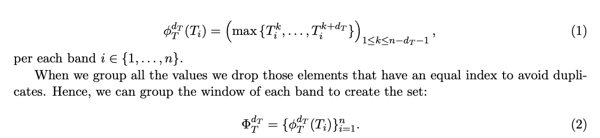

오디오 지문은 고유한 특성에 기반하여 오디오 녹음을 식별하고 매칭하는 기술입니다. 이는 오디오 신호의 압축된 표현을 생성하여 다른 오디오 녹음과 빠르게 비교하고 매칭하는 데 사용됩니다. 지문 생성 과정은 스펙트럼 내용, 템포, 리듬 등과 같은 특정 특징을 추출하기 위해 오디오 신호를 분석합니다. 이 논문에서는 Python 프로그래밍 언어로 작성된 오디오 지문을 위한 오픈 소스 GitHub 저장소인 SpectroMap을 소개합니다. 이는 스펙트로그램에서 시간-주파수 대역을 통해 토폴로지적 돌출을 추출하는 피크 검색 알고리즘으로 구성되어 있습니다. 이 논문에서는 고품질 도시 소리 데이터셋과 환경 오디오 녹음에서의 두 가지 실험적 응용을 통해 알고리즘이 어떻게 작동하는지 그리고 입력 데이터를 처리하는 데 얼마나 효과적인지를 설명합니다. 마지막으로, 제안된 사례 연구를 재현하기 위해 두 개의 Python 스크립트를 제시하여 오디오 지문 시스템의 재현성을 용이하게 합니다.

[Code Link](https://github.com/Aaron-AALG/spectromap)
[Paper Link](https://arxiv.org/pdf/2211.00982.pdf)

## Introduction

컴퓨터 과학에서, 지문은 입력 데이터를 훨씬 짧은 항목에 매핑하여 요약하는 절차입니다. 인간의 지문과 마찬가지로, 이러한 변환은 원래 데이터의 핵심 정보와 속성을 포함하므로, 다른 샘플들 사이에서 그것을 식별하는 데 사용될 수 있습니다.

음향 분야에서는, 오디오 지문은 오디오의 지각적 특성을 고려하여 주요 구성 요소를 추출하는 알고리즘으로 이해됩니다. 대부분의 경우, 이러한 기법은 신호의 스펙트로그램 표현에 적용됩니다. 그런 다음, 패턴 추출은 시간 도메인, 주파수 도메인, 또는 둘의 조합인 시간-주파수 도메인을 통해 수행됩니다. 구현에 관해서는, 이 목적을 위해 만들어진 몇 가지 기법이 있지만, 그들 각각은 자신만의 장점과 한계를 가지고 있습니다. 위상 기반 및 크로마 기반 및 지문 기법이 널리 사용되고 있습니다. 데이터 변환에 관해서는, 웨이블릿이 이 분야에서 매우 효과적이었습니다. 그러나 이것은 이 목적으로 사용되는 유일한 특징이 아닙니다.

* 크로마 기반 기법(Chroma-based technique): 오디오 분석에서 널리 사용되는 방법입니다. 크로마 기반 특징, 또는 "피치 클래스 프로파일"이라고도 불리는 이 기법은 음악의 피치를 의미있게 분류하고, 그 튜닝이 평균온음계에 근접한 음악을 분석하는 데 강력한 도구입니다. 크로마 특징의 주요 속성은 음악의 조화와 멜로디 특성을 포착하면서 탬버와 악기의 변화에 대해 강건하다는 것입니다. 이러한 특징은 음악의 피치 내용이 시간 창에 걸쳐 12개의 크로마 밴드에 어떻게 분포하는지를 각각 표현하는 크로마 특징의 시퀀스를 결과로 내놓습니다.
* 위상 기반 기법(Phase-based technique): 오디오 신호 재구성에서 중요한 역할을 합니다. 위상 검색은 짧은 시간 푸리에 변환(STFT)의 크기 스펙트럼만 주어진 상태에서 신호 재구성을 위한 효율적인 방법으로 이론적으로 증명되었습니다. 이 기법은 압축 감지, 음성 합성, 음성 향상, 소스 분리 등과 같은 여러 신호 처리 응용 프로그램에서 발생하는 문제입니다2. 이 기법은 STFT 크기와 위상 사이의 명시적인 관계에 기반한 오디오 신호 재구성 알고리즘을 제시합니다.

오디오 검색 알고리즘을 구현하기 위해 수년 동안 많은 다른 기법들이 개발되었습니다. 그들의 머신 러닝 작업에서의 구현은 훈련 비용을 줄이고, 따라서 더 빠른 구현을 가능하게 하는데 매우 유용하다는 것을 언급할 가치가 있습니다. 이 논문은 주어진 오디오 신호로부터 오디오 지문을 생성하기 위한 SpectroMap 알고리즘을 제시합니다. 이 방법은 원시 오디오 발췌부와 사전 처리된 스펙트로그램을 모두 처리하기 위해 설계되었습니다. 주요 목표는 오디오 매칭 작업을 다루는 것입니다. 왜냐하면 이것은 상당히 시간이 많이 소요될 수 있기 때문입니다.

## Methodology

이 논문에서 제시된 알고리즘은 주어진 오디오 신호에서 지문을 얻기 위해 필요한 전체 과정을 수행하도록 설계되었습니다. 이런 방식으로, 대규모 신호 처리를 생성할 수 있는 오픈 소스 소프트웨어를 제공합니다. 사용자의 목표에 따라, SpectroMap 객체를 초기화할 때 원시 신호나 이미 계산된 스펙트로그램을 입력으로 사용할 수 있습니다. 원시 신호를 사용하기로 결정한 경우, 신호 처리 단계에 필요한 매개변수도 포함할 수 있습니다. 그 후, 알고리즘은 주어진 스펙트로그램의 토폴로지적 돌출을 추출하기 위해 로컬 검색을 계산합니다. SpectroMap의 아키텍처는 그림 1에 나타나 있습니다.

### 1. Signal Processing

주어진 음악 신호 Xt에 대한 지문 추출을 구현하기 위해, 스펙트로그램에 연관된 전역 피크 검출을 계산하는 알고리즘을 설계했습니다. 이를 통해 별자리(constellation) 맵을 얻습니다. N_fft와 N_o를 각각 Fast Fourier Transform (FFT) 창의 길이와 세그먼트 사이에 겹치는 요소의 수라고 하면, 먼저 이 두 매개변수를 고려하여 (시간, 주파수, 진폭) 벡터를 얻기 위해 Hamming 창을 사용하여 신호의 스펙트로그램(S_tfa)을 계산합니다. 이러한 표현은 분석할 진폭 공간 정보를 포함합니다. 엔진 검색은 시간-주파수 점이 그 이웃에 따라 지역적으로 관련성이 있는지 여부를 결정합니다. 그런 다음, 검출은 필요한 대역에 대해 처리됩니다. {Ti_n}과 {Fj_m}을 각각 스펙트로그램의 시간 밴드와 주파수 밴드라고 하면, 이벤트의 진폭을 가진 스펙트로그램 S_tfa = (Ti_n) = (Fj_m)을 그것의 행과 열 표현으로 재구성할 수 있습니다. 엔진 검색의 일부로, 두 개의 창 Whi_dT와 Whi_dF 를 정의하여 각각 길이가 dT와 dF인 지역 쌍 비교를 처리합니다. 이들의 기능은 밴드의 요소 수를 추출하고 지역 최대값을 반환하는 것입니다.

이렇게 하면, 각 특징 벡터마다 토폴로지적으로 두드러진 요소들을 얻게 됩니다. 식(1)에 따르면, n − dT − 1개의 매치가 있음에도 불구하고, dT > 2일 때마다 창 whi_dT (Ti)는 더 적은 수의 요소를 포함할 수 있음을 쉽게 알 수 있습니다. 얼마나 제한적이어야 하는지에 따라, 단지 하나의 밴드로 진행하거나, 더 엄격한 검색을 생성하고 왜곡 저항을 만들기 위해 그것들을 결합할 수 있습니다. 왜냐하면 두 방향 모두에서 두드러진 피크만 반환되기 때문입니다. 마지막으로, 알고리즘은 식(2)에 나타난 것처럼 모든 밴드 종속적인 피크를 병합하여, 소위 말하는 오디오 지문을 결정하는 공간 점들의 총 수를 제공합니다. 그림 2에서, 오디오 지문의 그래픽 예를 볼 수 있습니다.

### 2. Algorithm

엔진 검색은 SpectroMap을 향상시키며, 오디오 신호를 처리하여 그것의 스펙트로그램 표현에서 감지된 (시간, 주파수, 진폭) 피크가 있는 출력 파일을 반환합니다. 따라서, 이것은 음악 발췌부간의 깊이 있는 비교를 완성하기 위해 Mercury 소프트웨어와 결합될 수 있습니다. 그림 3은 SpectroMap의 성능에 대한 대략적인 설명을 가지고 있습니다. 알고리즘은 기본적으로 다음 단계를 통해 파일을 배치합니다.

1. 사용할 창을 결정하고 N_fft와 N_o 매개변수를 설정합니다.
2. 오디오 파일을 읽어 그 진폭 벡터와 샘플 레이트를 얻습니다.
3. 관련 Fourier 변환을 통해 스펙트로그램을 계산합니다
4. 쌍별 비교를 위해 고정된 창 길이(dT, dF 또는 둘 다)를 설정합니다
5. 선택한 밴드나 둘 다의 조합에 대한 피크 검출을 진행하기 위한 설정을 선택합니다.
6. 강조된 돌출의 위치와 함께 스펙트로그램과 동일한 형태의 이진 행렬로 구성된 식별 행렬을 생성합니다.
7. 이러한 요소를 추출하고 (시간, 주파수, 진폭) 벡터가 있는 파일을 생성합니다.

단계 5에 대해, 저자들은 출력이 더 필터링되고 공간적으로 일관성 있기 때문에 피크 검출을 수행하기 위해 두 밴드를 모두 선택하는 것을 강력히 권장합니다. 나머지 단계에 대해서는, 선택은 연구의 범위에 따라 개인적인 결정입니다. 이 방법의 한계는 SciPy 라이브러리의 Signal 모듈의 기능에 따라 달라진다는 것을 언급할 가치가 있습니다. 설치와 사용 모두 우리의 GitHub 저장소에서 설명되어 있습니다.
