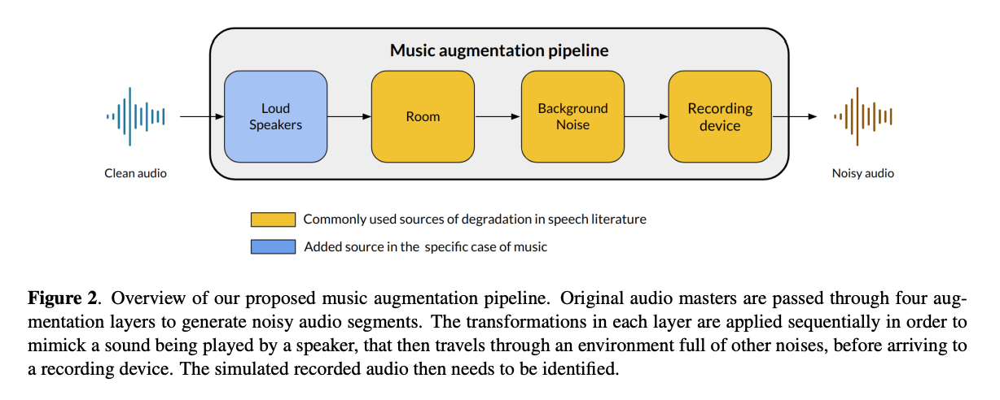
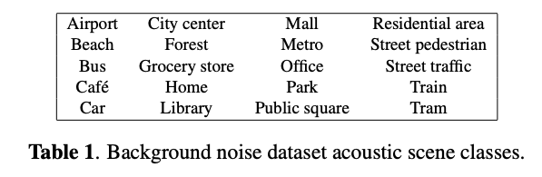
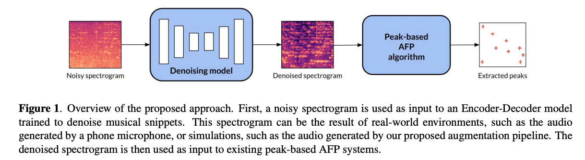
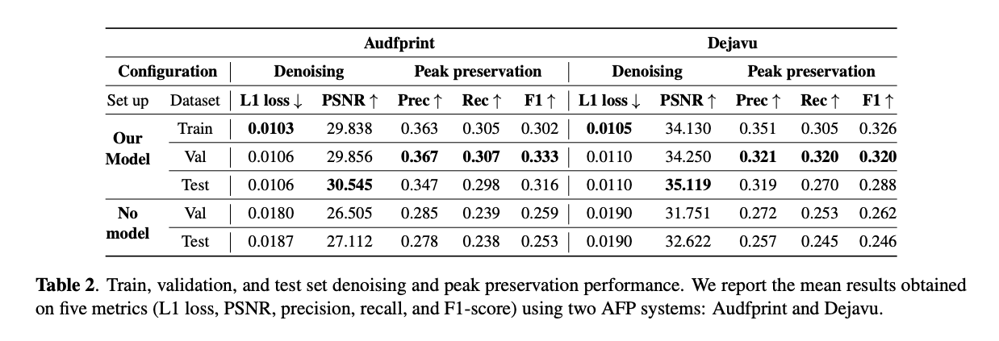
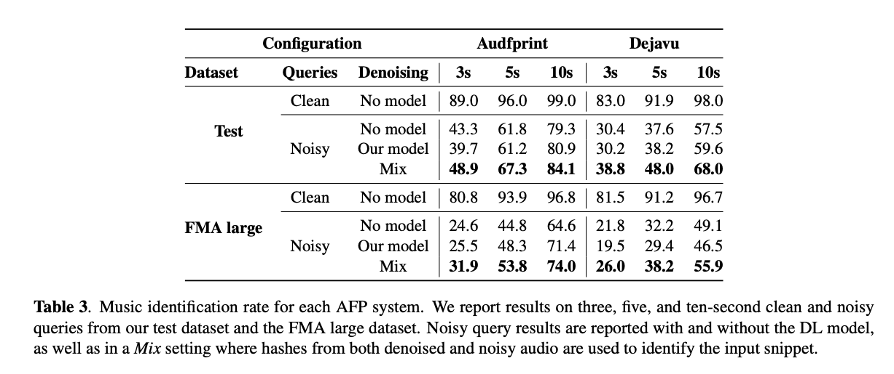

오디오 지문은 짧은 녹음 발췌부로부터 노래를 식별하는 데 있어서 잘 확립된 해결책입니다. 대중적인 방법들은 일반적으로 스펙트럼 피크와 같은 희소 표현의 추출에 의존하며, 이는 정확하고, 빠르며, 대규모 컬렉션에 확장 가능함을 입증하였습니다. 그러나, 오디오 식별의 실제 세계 응용은 종종 소음이 많은 환경에서 발생하며, 이는 이러한 시스템이 실패하게 할 수 있습니다. 이 연구에서, 이 문제를 해결하기 위해 실제 세계의 시나리오를 확률적으로 모방하여 음악 스니펫에 소음을 추가하는 새로운 오디오 증강 파이프라인을 소개하고 출시합니다. 그런 다음 스펙트로그램에서 소음 성분을 제거하여 피크 기반 지문 시스템의 정확도를 향상시키는 딥 러닝 모델을 제안하고 출시합니다. 저자의 모델은 추가가 소음이 많은 조건 하에서도 일반적으로 사용되는 오디오 지문 시스템의 식별 성능을 향상시킴을 보여줍니다.

[Paper Link](https://arxiv.org/pdf/2310.13388.pdf)
[Code Link](https://github.com/deezer/musicFPaugment)

## Related Work

### 1. Audio Fingerprinting

오디오 지문 시스템은 두 단계에 의존합니다: 오디오 녹음, 오디오 지문의 추출과 데이터베이스에서 일치하는 지문의 검색. 피크 기반 AFP는  오디오 신호의 짧은 시간 푸리에 변환(STFT) 표현을 계산한 후, 피크 picking 전략이 사용되어 주어진 이웃에서 가장 큰 크기를 가진 시간-주파수(TF) 점을 추출합니다. 높은 크기의 피크는 additive 노이즈와 녹음 장치 인코딩과 관련된 왜곡이 존재할 때 더욱 존재할 가능성이 높습니다. 그러나 이러한 접근법의 견고성은 신호에 상당량의 배경 소음이 존재할 때 제한됩니다. 2014년에는 시간 스트레칭, 피치 이동 및 신호의 시간 척도 수정을 처리할 수 있는 알고리즘을 설계하기 위해 피크의 triplet 상대 위치를 지문 해시로 저장하는 것을 제안했습니다. 비슷한 접근법은 스펙트럼 피크를 효율적으로 선택하고 네 개의 집합, 즉 쿼드로 그룹화하는 것을 제안합니다. 이를 통해 시스템은 시간 척도와 피치 수정을 처리하면서 해시 특이성을 증가시킬 수 있습니다.

최근에는 AFP 작업에서 DL 방법을 사용하는 경우가 점점 늘고 있습니다. 이러한 모델들은 보통 contrastive 또는 triplet 손실과 함께 self-supervised 학습 전략을 사용하여 훈련되며, 이는 유사한 오디오 입력, 즉 우리의 경우 동일한 오디오 세그먼트의 저하된 버전에 대해 유사한 임베딩을 생성합니다. 또다른 논문의 저자들은 데이터 증강 기법을 사용하여 모델을 훈련시킵니다. 이러한 모델들은 전통적인 AFP 방법보다 더 나은 성능을 보이지만, 대부분 상대적으로 작은 데이터셋(약 10k 트랙에 대한 , 약 100k 트랙에 대한 , 약 4500시간의 오디오에 대한 )에서 주로 연구되었습니다. 특히, 이러한 지문을 색인화하고 저장하는 방법은 거의 설명되지 않았으며, 상업 규모에서 이러한 데이터셋에서 효율적인 검색을 수행하는 방법은 아직 해결해야 할 문제입니다. 주목할 만한 예외는 Google Sound Search 시스템으로, 이 시스템은 공간 분할, 벡터 양자화, 효율적인 검색 전략을 통해 1000만 개 이상의 오디오 트랙을 포함하는 음악 라이브러리를 처리할 수 있습니다.

### 2. Audio Denoising

오디오 노이즈 제거 또는 향상은 원래 신호를 수정하지 않고 녹음된 오디오에 존재하는 노이즈를 감소시키는 것을 목표로 합니다. 전통적인 오디오 노이즈 제거 접근법은 스펙트럼 차감, 위너 필터링, 베이지안 추정자와 같은 신호 처리 기법에 기반하고 있습니다. 최근에는 DL 접근법이 파형 및 시간-주파수 도메인에서 전통적인 방법보다 상당한 개선을 보여주었습니다. 일반적으로, 오토인코더(AE) 아키텍처는 깨끗하고 노이즈가 있는 오디오 쌍을 사용하여 감독 방식으로 훈련됩니다. U-Net 아키텍처는 오디오 향상을 수행하는 강력한 AE 모델입니다. 이는 오디오 노이즈 제거, 음성 향상, 음악 소스 분리 분야에서 널리 연구되고 사용되었으며, 수많은 작업에서 최첨단 성능을 보여주었습니다. 다른 접근법들, 예를 들어 attention 기반 모델들이 음성 향상, 오디오 노이즈 제거 및 소스 분리 작업에서 U-Net 아키텍처를 능가했음에도 불구하고, U-Net 아키텍처는 그들의 가벼움과 효율성, 특히 실시간 처리를 포함하는 응용 프로그램 때문에 음악 분석에서 여전히 널리 사용되고 있습니다. 음악 노이즈 제거는 음성 향상만큼 철저하게 연구되지 않았습니다. 이전의 작업들은 오래된 아날로그 디스크의 복원을 연구했는데, 이는 신호의 휘파람, 클릭, 긁힘 등으로 인해 품질이 떨어질 수 있습니다. 더 최근에는 모바일 장치로 캡처된 것과 같은 저품질 음악 녹음이 DL을 사용하여 어떻게 향상될 수 있는지 연구합니다. 특히, 이는 이 작업에서 크게 영감을 받은 현실적인 데이터 저하 파이프라인을 제안합니다. 다른 음악 오디오 augmentation 프레임워크들은 이미 제안되었지만, 이들은 일반적으로 매우 다른 목표를 향해 있습니다, 예를 들어 그 경우에 annotation이 달린 음악 데이터셋에서 변동을 생성하는 것입니다.

## Music Augmentation

소음 환경에서 AFP를 위한 DL 모델을 훈련시키기 위해, 깨끗하고 노이즈가 있는 쌍을 생성하는 새롭고 현실적인 오디오 증강 파이프라인을 소개합니다. 이 증강 파이프라인은 오디오 입력에 적용된 여러 변환으로 구성되어 있습니다. 이들은 음악 식별 앱이 사용되는 장소에서 녹음이 겪을 수 있는 저하를 시뮬레이션하는 것을 목표로 합니다. 각 변환은 녹음된 오디오의 실제 세계 변형을 모델링하며, 이는 사운드를 생성하는 장치, 주변 환경, 또는 녹음 장치 자체에서 비롯됩니다. 특히, 우리의 증강 파이프라인은 일부 피크 기반 AFP 시스템이 이미 이러한 변환을 처리하기 때문에 피치, 속도, 또는 템포 변환을 포함하지 않습니다. 오디오 증강 시스템을 만들 때, 방 응답, 배경 소음, 녹음 장치, 그리고 큰 스피커에 의해 발생하는 저하를 재현하는 것을 목표로 했습니다. 첫 세 가지 저하는 일반적으로 사람들이 대화하는 주변 소음을 모델링하기 위해 음성 및 오디오 노이즈 제거 문헌에서 발견됩니다.

음악의 경우, 참조 지문은 고품질 원본 녹음에서 추출된 특징에 해당합니다. 방 응답, 배경 소음, 녹음 장치, 예를 들어 바, 카페 또는 자동차에서 음악을 재생하는 스피커는 음악 품질을 크게 변화시킬 수 있습니다. 우리는 이를 제4의 저하 원인으로 간주합니다. 선택한 변환을 순차적으로 44.1 kHz 원시 오디오 파형에 적용하며, 이를 위해 Python 라이브러리인 torch-audiomentations를 사용합니다. 증강된 콘텐츠를 생성하는 코드와 오디오 예제를 제공합니다. 다음 섹션에서는 각 증강 레이어에 대한 자세한 개요를 제공합니다.

### 1. Background Noise

음악이 일반적으로 재생되는 장소에서 개입하는 비정상적인, 더해진 소음을 모델링하기 위해, 음악 스니펫을 과거의 Acoustic Scenes and Events Detection and Classification(DCASE) 챌린지에서 나온 샘플들과 섞습니다. 이 챌린지들은 매년 발생하며 새로운 또는 확장된 음향 장면 데이터셋을 제시합니다. 이 장면들은 다른 장소와 환경에서 다른 장치로 녹음됩니다. 2017년 TUT Acoustic scenes challenge, 2018년 TUT Urban Acoustic Scenes challenge, 그리고 2020년 TAU Urban Acoustic Scenes 2020 Mobile challenge에서의 샘플들을 사용하여 배경 소음 데이터셋을 구축합니다. 이 데이터셋들로부터 오디오를 결합하면, 20개의 다른 클래스에서 56,340개의 10초 샘플을 포함하는 불균형 데이터셋이 생성됩니다(표 1 참조). 그러나 노이즈 제거 모델을 훈련시키고 검증하기 위해 균형 잡힌 배경 소음 데이터셋을 생성하기 위해 각 클래스당 무작위로 441개의 샘플을 선택하며, 총 8,820개의 샘플을 선택합니다. 각 클래스에 대해 90 vs 10 훈련 및 검증 분할을 사용한다는 점을 유의해 주세요. 나머지 47,520개의 항목에서 샘플들은 그런 다음 무작위로 테스트를 위해 선택됩니다. 샘플들을 음악 스니펫과 섞을 때, 다양한 현실적인 설정을 모방하기 위해 범위가 [−10, 10] 데시벨(dB)인 신호 대 소음 비율을 무작위로 선택합니다.

### 2. Room Impulse Response

환경적인 반향을 시뮬레이션하기 위해, 다양한 고유한 위치에서 측정된 32 kHz에서 샘플링된 271개의 실제 임펄스 응답으로 구성된 MIT 임펄스 응답(IR) 조사 데이터셋을 선택했습니다. 이 데이터셋의 소규모 특성 때문에, 여전히 다양한 IR들을 포함하고 있음에도 불구하고, 이 데이터셋을 훈련, 검증, 테스트 세트로 분할하지 않았습니다. 다른 데이터셋들이 더 넓은 범위의 IR들을 포함하고 있음에도 불구하고, 이 데이터셋이 크기, 다양성, 현실성 사이의 균형을 더 잘 맞추는 것으로 판단했습니다.

### 3. Recording Device

산업용 응용 프로그램에서는 오디오 녹음이 다양한 품질의 장치에 내장된 다양한 범위의 마이크로 수행될 수 있습니다. 녹음 장치에 의해 유발된 저하를 모델링하기 위해 다음을 추가합니다: 1. Gain: 녹음 중에 신호 볼륨이 변할 수 있습니다. 우리는 이 현상을 오디오를 [−5, 5] dB 범위의 무작위 요소로 곱함으로써 모델링합니다. 우리는 이 변환을 우리의 훈련 세트의 오디오 샘플에 0.3의 확률로 적용합니다. 2. Clipping: 높은 크기의 샘플은 녹음 중에 클리핑될 수 있습니다. 우리는 이를 모델링하기 위해 특정 임계값 이상의 모든 샘플을 인위적으로 클리핑합니다. 임계값은 각 스니펫 내에서 가장 큰 크기의 오디오 샘플 중 0%에서 1%가 클리핑되도록 무작위로 선택됩니다. 3. Low-pass and hight-pass filters: 불행히도, 산업 제조업체들은 거의 공개 정보를 공유하지 않습니다. 따라서 스마트폰 마이크 응답에 대한 포괄적인 검토가 없는 경우, 먼저 [3500, 7000] Hz 범위의 무작위로 선택된 컷오프 주파수를 가진 로우패스 필터를 적용하고, [30, 150] Hz 범위의 컷오프 주파수를 가진 1차 하이패스 필터를 적용하여 왜곡을 근사화하는 것을 선택합니다. 어떤 사람이 알 수 있듯이, 이러한 변환들은 모두 특정 확률로 적용되거나 특정 범위에서 무작위로 선택된 값으로 적용됩니다. 이는 의도적으로 수행되었습니다; 각 증강 오디오의 변동성을 늘리면서도 현실적이라고 판단한 영역 내에 그것을 유지하기 위해서입니다. 이는 실제 세계를 잘 시뮬레이션합니다.

### 4. LoudSpeakers

위에서 설명한 것처럼, 실제 녹음에서 스피커에 따라 사운드 재생 품질이 다를 수 있습니다. 불행히도, 마이크 장치와 마찬가지로, 실제로 스피커 주파수 응답에 대한 포괄적인 개요를 얻는 것은 어렵습니다. 이러한 저하를 시뮬레이션하기 위해, Spinorama 웹사이트에서 431개의 스피커의 -3dB 컷오프 주파수를 추출합니다. 이 웹사이트는 스피커에 대한 통계를 포함하고 있으며, 대부분의 컷오프 주파수가 20Hz에서 150Hz 사이에 위치하고 있음을 보여줍니다. 스피커의 주파수 응답을 모델링하기 위해 비슷한 범위의 컷오프 주파수를 가진 1차 하이패스 필터를 사용하는 것을 선택합니다. 마이크와 스피커 시뮬레이션 모두, 근사치는 생성된 데이터의 현실성을 제한할 수 있음을 인정하며, 더 정교한 모델링은 향후 작업으로 남겨둡니다. 예를 들어, 비선형 왜곡을 고려할 수 있도록 하고 싶습니다.

## Audio Denoising Model

### 1. Model Selection and Training

2.2에서 설명한 것처럼, U-Net 아키텍처는 오디오 노이즈 제거 작업에서 잘 수행되었다는 것이 입증되었습니다. 산업용 query-by-example 응용 프로그램에서 사용하기에 충분히 빠르고 가벼운 모델을 사용하고 적응시킵니다. 이것은 대부분 합성곱 계층으로 구성되어 있기 때문에 추론 시간이 상대적으로 짧습니다. 단일 CPU를 사용하여 10초 STFT에서 평균 추론 시간을 측정하였고, 이는 753 밀리초(ms)였습니다. 따라서 이것은 상대적으로 제한된 자원을 사용하여 실시간보다 열 배 더 빠릅니다. 더 최근의, 트랜스포머 기반의 아키텍처를 실험했지만, 더 간단하고 빠른 U-Net 아키텍처가 더 높은 성능을 보였습니다. 저자는 저자의 모델 아키텍처의 최적화를 향후 작업으로 남겨둡니다. 음악은 다중음이기 때문에 TF 도메인에서 음악을 노이즈 제거하는 것이 더 쉽습니다. additive 소스는 보통 주파수 스펙트럼의 다른 영역을 커버하므로 신호의 주파수 특징을 사용하여 더 쉽게 식별할 수 있습니다. 따라서, 모델을 오디오 스펙트로그램을 노이즈 제거하도록 훈련시킵니다. 더 정확하게 말하면, 스펙트럼 피크 보존에만 관심이 있으므로, 스펙트로그램의 크기 성분에만 초점을 맞춥니다, 그리고 노이즈 제거된 오디오 샘플을 재합성하는 것을 추구하지 않습니다. U-Net은 L1 손실, 배치 크기 32, 학습률이 처음에 0.001로 설정된 Adam 최적화기, patience 2와 decreasing factor 0.5를 가진 학습률 스케줄러를 사용하여 감독 방식으로 깨끗한 스펙트로그램을 예측하도록 훈련됩니다. 훈련 에포크의 10분의 1마다 검증 손실을 계산하고 테스트를 위해 가장 성능이 좋은 가중치를 저장합니다. 또한 인코더 아키텍처의 각 다운샘플링 블록 후에 드롭아웃 비율 p = 0.05를 사용합니다.

### 2. Training set

다양한 음악 콘텐츠에서 모델을 훈련시키기 위해, 전문적으로 큐레이션된 재생 목록에서 나온 48,872개의 상업용 오디오 트랙에서 무작위로 3초짜리 오디오 스니펫을 선택합니다. 이들은 25개의 인간이 주석을 단 음악 장르를 커버합니다. 그런 다음 데이터셋은 각 장르 카테고리에 대해 80-10-10 분할을 사용하여 훈련, 검증, 테스트 세트로 분리됩니다. 같은 깨끗한 오디오 발췌부의 다른 노이즈 버전으로 노이즈 제거 모델을 훈련시킴으로써 각 깨끗한 오디오 노래에서 44.1 kHz에서 5개의 증강 샘플 세트를 생성합니다. 이것은 모델의 일반화 능력을 향상시키는 것으로 나타났습니다. 최종 데이터셋은 244,360개의 3초짜리 깨끗한-노이즈가 있는 오디오 쌍으로 구성됩니다. 계산 제약 때문에, 증강은 훈련 중에 온라인으로 수행되지 않습니다.

### 3. Evaluation Strategy

저자의 접근법을 평가하기 위해, 오픈 소스 AFP 시스템에 적용된 두 가지 상호 보완적인 실험 시리즈를 제안합니다. 첫 번째 시리즈에서는 노이즈 제거 능력과 피크 보존에 대한 행동을 연구합니다. 두 번째 시리즈에서는 노이즈 제거 모델을 AFP 시스템에 삽입하는 것이 실제로 그 식별 성능에 어떤 영향을 미치는지 연구합니다.

## Peak Preservation

### 1. Evaluation Framework

먼저 두 가지 인기 있는 오픈 소스 AFP 시스템, Audfprint과 Dejavu를 선택합니다. 둘 다 전통적인 산업 방법의 구현체입니다. 그들은 오디오 신호의 STFT 스펙트로그램에서 다양한 방법으로 스펙트럼 피크를 추출하고, 이를 쌍으로 그룹화하여 랜드마크를 형성하며, 이는 해시되어 나중에 효율적인 검색을 위한 데이터셋에 인덱싱될 수 있습니다. 이들은 일반적으로 fingerprinting 기준선으로 사용됩니다.

두 시스템 모두에 대해 유사한 설정을 사용합니다. 먼저, 오디오 신호는 11,025 Hz로 다운샘플링되고, 256의 홉 크기와 512의 프레임 크기로 STFT가 추출됩니다. 그러나, AFP 시스템에 입력되는 크기 스펙트로그램은 Audfprint와 Dejavu에서 약간 다르게 계산됩니다. 따라서, 각 시스템에 대해 별도의 모델을 훈련시켜, 그것이 노이즈를 제거해야 하는 AFP 시스템에 적절하게 맞도록 합니다.

먼저 모델의 노이즈 제거 능력을 평가합니다. 이는 AFP 시스템에 입력되는 노이즈가 있는 스펙트로그램과 노이즈가 제거된 스펙트로그램을 비교하는 메트릭을 계산함으로써 이루어집니다. 훈련에 사용되는 L1 거리와, 이미지 재구성 품질을 정량화하는 또 다른 일반적으로 사용되는 메트릭인 PSNR을 보고합니다. 또한, 피크 보존을 강조하기 위해, 노이즈가 있는 신호와 깨끗한 신호 모두에서 발견되는 스펙트럼 피크의 비율을 평가하는 메트릭을 사용합니다. 입력 스펙트로그램을 AFP 시스템의 피크 추출 단계를 통과시키고, 그런 다음 추출된 피크의 좌표가 일치하는지를 살펴봅니다. 그런 다음 일치하는 피크 목록에서 일반적인 검색 메트릭인 정밀도, 재현율, F1-점수를 보고합니다.

#### Audfprint & Dejavu

Audfprint와 Dejavu는 모두 오디오 지문화를 위한 오픈 소스 도구이지만, 그들의 구현 방식과 사용 방법에는 몇 가지 차이점이 있습니다.

- 데이터베이스 사용: Audfprint는 실제 데이터베이스 대신 매우 간단한 인메모리 테이블을 사용합니다. 이는 빠른 속도를 위해 설계되었지만, 실제 데이터베이스 엔진을 시도해 본 적은 없습니다1. 반면에 Dejavu는 MySQL 데이터베이스를 사용하여 오디오 지문을 저장하고 검색합니다.
- 정확도: Audfprint와 Dejavu 모두 높은 정확도를 보여주지만, 일부 연구에 따르면, 짧은 오디오 클립에 대해 Audfprint는 Dejavu보다 더 높은 정확도를 보여줄 수 있습니다. 그러나 이는 특정 상황과 데이터셋에 따라 다를 수 있습니다.
- 사용 방법: Audfprint와 Dejavu는 모두 Python으로 작성되었지만, 그들의 사용 방법과 설정은 다릅니다.

이러한 차이점들은 각 도구가 특정 사용 사례에 더 적합하게 만들 수 있습니다. 따라서, 어떤 도구를 사용할지 결정할 때는 사용 사례, 필요한 기능, 그리고 각 도구의 성능과 제약 사항을 고려해야 합니다.

### 2. Results

표 2는 두 AFP 시스템에 대해 얻은 평균 결과를 요약합니다. 다시 말해, 각 시스템은 스펙트로그램을 계산하고 피크를 다른 방식으로 추출하기 때문에, 메트릭이 AFP 시스템마다 다르게 나타납니다. 실험은 증가된 데이터셋의 훈련, 검증, 테스트 하위 집합에서 비슷한 결과를 가져옵니다. 이것은 모델이 훈련 데이터에 과적합하지 않음을 나타냅니다. 더욱이, 검증 및 테스트 세트에서 노이즈 제거 모델을 사용하여 모든 메트릭을 개선합니다. 각 모델은 노이즈가 있는 스펙트로그램에 존재하는 노이즈의 양을 줄이고 그것들을 깨끗한 참조에 가깝게 만들 수 있습니다. 따라서 L1 손실은 감소하고 PSNR은 테스트 세트에서 증가하며, Audfprint에서는 27.112에서 30.545로, Dejavu에서는 32.622에서 35.119로 증가합니다. 노이즈 제거된 스펙트로그램의 출력을 보면 (예를 들어 그림 3 참조), 모델이 실제로 노이즈가 있는 내용을 부드럽게 만들면서 대부분의 음악 구성 요소를 유지하는 것을 관찰할 수 있습니다. 노이즈 제거 모델은 또한 각 AFP 시스템이 깨끗한 오디오에 존재하는 스펙트럼 피크를 보존하는 데 도움을 줍니다. Audfprint와 Dejavu를 사용하여 얻은 F1 점수가 향상되며, 두 시스템 모두 노이즈 추가에 의해 유발된 피크를 제거할 수 있습니다. 예를 들어, 증가된 테스트 세트에서 Audfprint의 정밀도는 6.9% 증가하고 Dejavu는 6.2% 증가합니다. 또한, 모델은 신호 저하에 의해 가려진 피크를 복원하는 것을 가능하게 합니다. 이는 같은 테스트 세트에서 Audfprint의 재현율이 6.0% 증가하고 Dejavu의 재현율이 2.5% 증가하는 것으로 나타납니다.

## Music Identification

### 1. Evaluation Framework

Audfprint와 Dejavu 검색 시스템을 테스트하기 위해서는 먼저 색인화된 데이터셋을 구축해야 합니다. 테스트 세트는 이미 4,888개의 오디오 트랙을 포함하고 있으며, 이를 첫 번째 참조 데이터셋으로 사용합니다. 그러나 더 크고 현실적인 카탈로그에서 테스트를 수행하기 위해, FMA(Free Music Archive) 데이터셋에서 가져온 트랙을 사용하여 두 번째 참조 데이터셋을 구축합니다. 손상된 파일을 제거한 후, 데이터셋은 161개의 다른 음악 장르를 아우르는 105,721개의 고품질 트랙을 포함합니다. 다른 트랙에서 랜덤으로 3, 5, 10초의 스니펫을 추출합니다. 이들은 깨끗한 쿼리에 해당합니다. 그런 다음 이들을 음악 증가 파이프라인으로 처리하여 노이즈가 있는 쿼리를 생성합니다. 각 스니펫 크기에 대해, 테스트 세트에 대해 4,888개의 깨끗한 쿼리와 동일한 수의 노이즈가 있는 쿼리를 생성하고, FMA 세트에 대해 10,000개의 깨끗한 쿼리와 동일한 수의 노이즈가 있는 쿼리를 생성합니다. AFP 시스템을 평가하며, 일반적으로 사용되는 top-1 hit identification rate 메트릭을 사용합니다. 이는 다음과 같이 정의됩니다:

### 2. Results

획득된 결과는 표 3에 요약되어 있습니다. 노이즈가 있는 쿼리에 대한 식별률이 크게 떨어지는 것을 관찰합니다. FMA 대형 데이터셋에서, Audfprint를 사용하면, 깨끗한 쿼리에 대한 식별률은 80.8%에서 노이즈가 있는 쿼리에 대해 24.6%로 감소합니다. 이는 3초 설정에서의 결과입니다. Dejavu를 사용하면, 비슷한 식별률 하락이 관찰되며, 깨끗한 쿼리에 대해 81.5%에서 노이즈가 있는 쿼리에 대해 21.8%로 감소합니다. 이러한 결과는 피크 기반 AFP 시스템이 노이즈 환경에 노출될 때의 한계를 보여주며, 그들의 성능을 향상시킬 필요성을 강조합니다.

노이즈가 있는 콘텐츠를 식별하기 전에 노이즈 제거 모델을 통과시키는 것은 모델 없는 설정과 크게 다른 결과를 가져오지 않습니다. 노이즈 제거를 사용한 성능은 쿼리 크기, 데이터베이스, AFP 시스템에 따라 완전히 노이즈가 있는 설정보다 약간 높거나 약간 낮습니다. 예를 들어, 테스트 세트에서, 5초 설정에서, 노이즈가 있는 식별률은 61.8%이고 노이즈 제거된 식별률은 61.2%입니다. Dejavu는 같은 맥락에서 37.6%와 38.2%의 값을 보여줍니다.

그러나, 노이즈 제거를 통해 식별되지만 그렇지 않은 트랙의 수가 많다는 것을 알아차립니다. 그 반대의 경우도 마찬가지입니다. 두 가지 접근법을 Mix 파이프라인에서 결합하는 것이 기준선을 크게 능가하는 것으로 나타났습니다. 양쪽 쿼리 설정을 사용하여 깨끗한 쿼리와 노이즈 제거된 쿼리 모두를 식별 작업에 전달합니다. 각 쿼리는 적절할 때 식별된 트랙을 반환합니다.

식별된 트랙이 다른 경우, Audfprint와 Dejavu가 식별된 노래를 순위 매기는 데 사용하는 동일한 방법을 사용하여 그들을 순위 매깁니다. 이는 쿼리와 시간에 맞춰 정렬된 공통 해시의 수가 가장 많은 트랙이 올바른 것이라고 간주합니다. 이 접근법을 사용하면 상당히 더 나은 결과를 얻을 수 있습니다. 10초 설정에서, 테스트 세트에서, 식별률은 노이즈가 있는 쿼리 설정에 비해 Audfprint에 대해 4.8%, Dejavu에 대해 10.5% 증가합니다. FMA 데이터셋에서, 3초 설정에서, 식별률은 Audfprint에 대해 7.3%, Dejavu에 대해 4.2% 증가합니다.

피크가 어떻게 재구성되거나 보존되는지를 살펴보면, 노이즈 제거 모델이 어떤 경우에는 시스템에 도움이 되고, 다른 경우에는 페널티를 주는 이유에 대한 직관을 얻을 수 있습니다. 그림 3에서, 노이즈 제거 모델은 중요한 양의 노이즈가 추가된 영역에서 노이즈, 그리고 따라서 잘못된 피크를 제거하는 데 도움이 됩니다. 예를 들어, 마지막 플롯에서, 파란색 점과 겹치지 않는 주황색 점은 노이즈 제거 모델에 의해 올바르게 제거된 노이즈 피크입니다. 그러나, 노이즈 제거 모델은 AFP 시스템이 잘못된 피크를 추출하게 할 수도 있습니다(파란색 점과 겹치지 않는 녹색 점). 이 잘못 예측된 피크들은 AFP 시스템이 어떤 경우에는 노이즈 제거 없이 더 잘 수행하는 이유를 부분적으로 설명합니다.
