대규모 언어 모델(LLM)은 자연어 처리(NLP) 분야에서 강력한 도구로 부상했으며 최근에는 추천 시스템(RS) 영역에서 큰 주목을 받고 있습니다. 자기 지도 학습을 사용하여 방대한 양의 데이터에 대해 훈련된 이러한 모델은 보편적 표현을 학습하는 데 놀라운 성공을 거두었으며 미세 조정 및 프롬프트 튜닝 등과 같은 몇 가지 효과적인 전송 기술을 통해 추천 시스템의 다양한 측면을 향상시킬 수 있는 잠재력을 가지고 있습니다. 추천 품질을 향상시키기 위해 언어 모델의 힘을 활용하는 데 있어 중요한 측면은 텍스트 기능의 고품질 표현과 외부 지식의 광범위한 적용 범위를 활용하여 항목과 사용자 간의 상관 관계를 설정하는 것입니다. 기존 LLM 기반 추천 시스템에 대한 포괄적인 이해를 제공하기 위해, 이 survey 에서는 이러한 모델을 각각 Discriminative LLM for Recommendation (DLLM4Rec)과 Generative LLM for Recommendation (GLLM4Rec)의 두 가지 주요 패러다임으로 분류하는 분류법을 제시하며, 후자는 처음으로 체계적으로 분류되었습니다. 또한 각 패러다임 내에서 기존 LLM 기반 추천 시스템을 체계적으로 검토하고 분석하여 방법론, 기법 및 성과에 대한 통찰력을 제공합니다. 또한 연구자와 실무자에게 영감을 제공하기 위해 주요 과제와 몇 가지 가치 있는 결과를 식별합니다. 또한 추천을 위해 LLM에 대한 관련 논문을 색인화하기 위해 GitHub 리포지토리를 만들었습니다

[Paper Link](https://arxiv.org/pdf/2305.19860.pdf)

[Git Hub Link](https://github.com/WLiK/LLM4Rec-Awesome-Papers)

## Introduction

기존의 추천 시스템과 달리 LLM 기반 모델은 컨텍스트 정보를 캡처하고 사용자 쿼리, 항목 설명 및 기타 텍스트 데이터를 보다 효과적으로 이해하는 데 탁월합니다. 컨텍스트를 이해함으로써 LLM 기반 RS는 권장 사항의 정확성과 관련성을 향상시켜 사용자 만족도를 높일 수 있습니다. LLM은 제로/퓨샷 추천 기능을 통해 추천 시스템에 새로운 가능성을 제공합니다. 이러한 모델은 사실에 입각한 정보, 도메인 전문 지식 및 상식적인 추론을 통해 광범위한 사전 교육으로 인해 보이지 않던 사용자에게도 일반화할 수 있으므로 특정 항목이나 사용자에 대한 사전 노출 없이도 합리적인 추천을 제공할 수 있습니다.

## Modeling Paradigms and Taxonomy

모든 대규모 언어 모델의 기본 프레임워크는 GPT, PaLM, LLaMA 등과 같은 여러 트랜스포머 블록으로 구성됩니다. 이 아키텍처의 입력은 일반적으로 토큰 임베딩 또는 위치 임베딩 등으로 구성되는 반면, 예상 출력 임베딩 또는 토큰은 출력 모듈에서 얻을 수 있습니다. 여기서 입력 및 출력 데이터 형식은 모두 텍스트 시퀀스입니다.

기존 작업은 크게 다음 세 가지 범주로 나눌 수 있습니다:

(1) **LLM 임베딩 + RS**: 이 모델링 패러다임은 언어 모델을 기능 추출기로 간주하며, 이는 항목과 사용자의 프로필을 LLM에 공급하고 해당 임베딩을 출력합니다. 기존 RS 모델은 다양한 추천 작업에 지식 인식 임베딩을 활용할 수 있습니다.

(2) **LLM 토큰 + RS**: 이전 방법과 마찬가지로 이 방법은 입력된 항목과 사용자의 프로필을 기반으로 토큰을 생성합니다. 생성된 토큰은 시맨틱 마이닝(중요한 정보나 패턴을 식별하고 의미를 분석)을 통해 잠재적인 선호도를 포착하며, 이는 추천 시스템의 의사 결정 프로세스에 통합될 수 있습니다.

(3) **RS로서의 LLM**: (1) 및 (2)와 달리 이 패러다임은 사전 학습된 LLM을 강력한 추천 시스템으로 직접 이전하는 것을 목표로 합니다. 입력 순서는 일반적으로 프로필 설명, 동작 프롬프트 및 작업 지침으로 구성됩니다. 출력 시퀀스는 합리적인 권장 결과를 제공할 것으로 예상됩니다. 실제 응용 프로그램에서 언어 모델의 선택은 추천 시스템의 모델링 패러다임 설계에 큰 영향을 미칩니다.

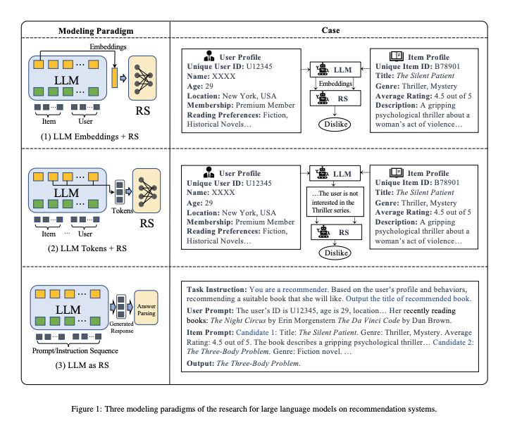

그림 2에서 볼 수 있듯이 본 논문에서는 각각 차별적 LLM과 생성적 LLM의 두 가지 주요 범주로 분류합니다. 일반적으로 판별 언어 모델은 패러다임 (1)에 포함시키는 데 적합하며, 생성 언어 모델의 응답 생성 기능은 패러다임 (2) 또는 (3)을 추가로 지원합니다.

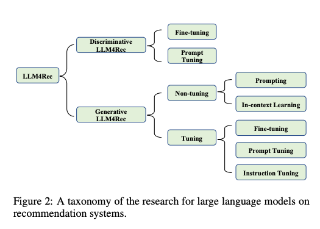

## Discriminative LLMs for Recommendation

이는 (1)의 작업에 해당하는 모델이며 LLM을 통해 추천에 적합한 임베딩을 추출하는데 목적이 있습니다. 이 모델들은 주로 사용자가 각 item을 like/dislike 할 지 분류 작업에 사용됩니다. 사용자의 요구나 아이템 설명과 같은 텍스트 데이터를 분석하여, 사용자에게 가장 관련성이 높은 아이템을 찾아 추천하는 데 초점을 맞춥니다. 실제로, 이 모델은 주로 **BERT 시리즈의 모델**을 참조합니다. 대부분의 기존 작업은 미세 조정을 통해 BERT와 같은 사전 학습된 모델의 표현을 도메인별 데이터와 정렬합니다. 또한 일부 연구에서는 프롬프트 튜닝과 같은 교육 전략을 탐구합니다. 대표적인 접근 방식과 일반적으로 사용되는 데이터 세트는 표 1 및 표 2에 나열되어 있습니다.

### 1. Fine-tuning

사전 학습된 언어 모델을 finetuning 하는 것은 추천 시스템을 포함한 다양한 자연어 처리(NLP) 작업에서 상당한 주목을 받고 있는 보편적인 기술입니다. 대규모 텍스트 데이터에서 이미 풍부한 언어 표현을 학습한 언어 모델을 가져와서 작업별 데이터에 대해 추가로 학습하여 특정 작업 또는 도메인에 맞게 조정하는 것입니다. 학습된 매개 변수를 사용하여 미리 학습된 언어 모델을 초기화한 다음, 권장 사항별 데이터 세트에서 학습하는 작업이 포함됩니다. 이 데이터 세트에는 일반적으로 **User-item interactions, textual description of items, 사용자 프로필 및 기타 관련 컨텍스트 정보**가 포함됩니다. finetuning 중에 모델의 매개변수는 작업별 데이터를 기반으로 업데이트되어 권장 작업에 맞게 조정되고 전문화될 수 있습니다.

- U-BERT (2021), UserBERT (2021), BERT4Rec (2019), RESETBERT4Rec (2022), UniSRec (2022), Tiny-NewsRec (2022), PREC (2022), MoRec (2023), OPT (2022)

요약하자면, BERT finetuning을 추천 시스템에 통합하면 강력한 외부 지식과 개인화된 사용자 선호도가 융합되며, 이는 주로 추천 정확도를 높이는 것을 목표로 하는 동시에 제한된 과거 데이터를 가진 새로운 항목에 대한 약간의 콜드 스타트 처리 기능을 확보하는 것을 목표로 합니다.

### 2. Prompt Tuning

예를 들어 Penha and Hauff (2020)은 BERT의 masked language modeling (MLM) head를 cloze-style prompts (누락된 단어나 문장 부분을 모델이 채우도록 하는 것)를 사용해서 item의 장르에 대한 이해를 시킬 수 있음을 발견하였습니다. 또한 utilized 한 Next Sentence Prediction (NSP) head를 통해서 similarity of representation이 강화되어 query-docmuent 추천의 관련성 비교를 더 강화할 수 있었습니다.

Prompt4NR(2023)은 뉴스 추천을 위한 프롬프트 학습 패더다음 적용을 개척하였습니다. 후보 뉴스에 대한 사용자 클릭을 예측하는 것을 목표로하는 cloze-style 프롬프트로 작업을 재정의하였습니다. 실험에 따르면 추천 시스템의 성능은 다중 프롬프트 앙상블링의 활용을 통해 눈에 띄게 향상되어 개별 및 연속 템플릿에서 단일 프롬프트로 달성한 결과를 능가합니다. 이는 정보에 입각한 결정을 내리기 위해 **여러 프롬프트를 결합하는 프롬프트 앙상블의 효과**를 강조합니다.

## Generative LLMs for Recommendation

이는 (2), (3)의 작업에 해당하는 모델이며, 이 모델들은 사용자의 행동이나 선호도를 기반으로 새로운 콘텐츠나 아이템을 생성할 수 있습니다. 예를 들어 사용자가 좋아할 만한 새로운 음악 플레이 리스트나 기사를 생성하는 것이 가능합니다. 판별 모델에 비해 생성 모델은 더 나은 자연어 생성 기능을 가지고 있습니다. LLM이 학습한 표현을 추천 도메인에 맞추는 대부분의 차별적 모델 기반 접근 방식과 달리, 대부분의 생성적 모델 기반 작업은 추천 작업을 자연어 작업으로 변환한 다음 컨텍스트 내 학습, 프롬프트 튜닝 및 명령어 튜닝과 같은 기술을 적용하여 LLM을 조정하여 추천 결과를 직접 생성합니다. 또한 ChatGPT가 보여준 인상적인 기능으로 인해 이러한 유형의 작업이 최근 주목을 받고 있습니다.

### 1. Non-tuning Paradigm

LLM은 보이지 않는 많은 작업에서 강력한 제로/퓨샷 능력을 보여주었습니다. 따라서 최근 일부 작업에서는 LLM이 이미 추천 능력을 가지고 있다고 가정하고, 특정 프롬프트를 도입하여 이러한 능력을 발동시키려고 시도하고 있습니다. 그들은 최근 Instruction and In-Context Learning의 관행을 사용하여 모델 매개변수를 조정하지 않고 LLM을 권장 작업에 채택합니다. 프롬프트에 데모 예가 포함되는지 여부에 따라 이 패러다임의 연구는 주로 prompting과 in-context learning의 두 가지 범주에 속합니다.

#### 1-1 Prompting

이 작업 카테고리는 LLM이 추천 작업을 더 잘 이해하고 해결할 수 있도록 보다 적합한 지침과 프롬프트를 설계하는 것을 목표로 합니다. Liu et al. (2023a)는 평점 예측, 순차 추천, 직접 추천, 설명 생성, 리뷰 요약 등 5가지 일반적인 추천 작업에 대한 ChatGPT의 성능을 체계적으로 평가했습니다. 그들은 다음과 같이 구성된 일반적인 추천 프롬프트 구성 프레임워크를 제안했습니다:

(1) 작업 설명, 추천 작업을 자연어 처리 작업에 적용

(2) LLM이 사용자 선호도와 요구 사항을 포착하는 데 도움이 되도록 사용자-항목 상호 작용을 통합하는 동작 주입

(3) 출력 형식을 제한하고 권장 결과를 보다 이해하기 쉽고 평가할 수 있도록 하는 형식 표시

마찬가지로 Dai et al. (2023)은 포인트별, 쌍별, 목록별 순위를 포함한 세 가지 일반적인 정보 검색 작업에 대한 ChatGPT의 추천 능력에 대한 실증 분석을 수행했습니다. 그들은 ChatGPT의 도메인 적응 능력을 향상시키기 위해 다양한 종류의 작업에 대해 다양한 프롬프트를 제안하고 프롬프트 시작 부분에 역할 지침(예: 당신은 지금 뉴스 추천 시스템입니다.)을 도입했습니다. 다양한 프롬프트 입력의 향상을 평가하기 위해 Sanner et al. (2023)은 실험에서 Items only, Language only(사용자의 기본 설정에 대한 설명) 및 결합된 Language+Items의 경우에 대해 세 가지 프롬프트 템플릿을 설계했습니다. 언어 모델의 성능을 분석한 후, 그들은 제로샷(zero-shot) 및 퓨샷(few-shot) 전략이 (항목 선호도를 고려하지 않고) 언어 기반 선호도만을 기반으로 추천을 하는 데 매우 효과적이라는 것을 발견했습니다. 실제로 이러한 전략은 특히 콜드 스타트에 가까운 시나리오에서 항목 기반 협업 필터링 방법과 비교할 때 매우 경쟁력이 있는 것으로 입증되었습니다.

##### Prompting Example

- Item Only
  - Zero-Shot
    - "I like the following movies: item1, item2, item3, item4, Then I would also like {item}"
  - Few-Shot
    - "User1 Movie Preferences: item1, item2, item3, item4, Additional User1 Movie Preference: item5"
    - "User2 Movie Preferences: item1, item2, item3, item4, Additional User2 Movie Preference: {item}"
- Language Only
  - Zero-Shot
    - "I describe the movies I like as follows: desc1, Then I would also like {item}"
  - Few-Shot
    - "User1 Description: desc1, Additional User1 Movie Preference: item1, item2, item3"
    - "User2 Description: desc2, Additional User2 Movie Preference: {item}"
- Language + Item
  - Zero-Shot
    - "I describe the movies I like as follows: desc, I like the following movies: item1, item2, item3, Then I would also like {item}"

---

한편, 상호작용 데이터를 기반으로 프롬프트로 사용자의 의도를 요약하기 위해 MINT[Mysore et al., 2023]는 175B 매개변수 LLM인 InstructGPT를 사용하여 합성 내러티브 쿼리를 생성했습니다. 그런 다음 이 쿼리는 더 작은 언어 모델을 사용하여 필터링되었으며 검색 모델은 가상 쿼리와 사용자 항목 모두에 대해 학습되었습니다. 그 결과 모델이 여러 강력한 기준선 모델 및 절제된 모델보다 성능이 우수하다는 것을 밝혔습니다. one-shot 설정에서 이 모델들은 내러티브 중심의 추천에 직접 사용된 175B LLM과 동등하거나 심지어 더 나은 성능을 보였습니다. 그러나 이러한 방법은 텍스트 설명에서 주제를 분해하는 것을 고려하지 않았으며, 이로 인해 시끄럽고 목표가 불분명한 프롬프트가 발생할 수 있습니다.

##### Prompting Example

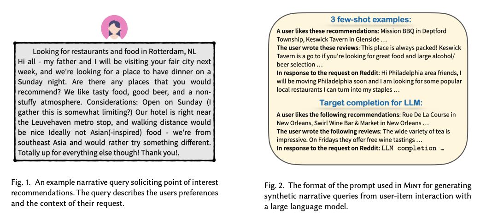

User-Item interaction dataset에서 Large LLM을 사용하여 위의 Fig 2 처럼 Narrative queries를 생성합니다. 그리고 생성한 이 Query를 dataset과 함께 더 작은 Retrieval LLM Model을 학습하는데 사용합니다.

---

일반적인 프레임워크를 제안하는 대신 일부 작업은 특정 권장 작업에 대한 효과적인 프롬프트를 설계하는 데 중점을 둡니다. Sileo et al. (2022)는 GPT-2의 사전 학습 말뭉치에서 영화 추천 프롬프트를 마이닝했습니다.

Hou et al. (2023)은 LLM의 순차적 추천 기능을 개선하기 위해 LLM이 사용자 상호작용 기록에서 순차적 정보를 인식할 수 있도록 하는 최신성 중심의 순차 프롬프트와 위치 편향 문제를 완화하기 위해 후보 항목 목록을 여러 번 섞고 순위에 대한 평균 점수를 취하는 부트스트랩이라는 두 가지 프롬프트 방법을 도입했습니다. LLM에 허용되는 입력 토큰의 수가 제한되어 있기 때문에 프롬프트에 긴 후보 목록을 입력하기가 어렵습니다. 이 문제를 해결하기 위해 Sun et al. (2023)은 매번 창에 있는 후보자의 순위를 매긴 다음 창을 첫 번째 순서로 다시 밀고 마지막으로 이 과정을 여러 번 반복하여 전체 순위 결과를 얻는 슬라이딩 윈도우 프롬프트 전략을 제안했습니다.

##### Prompting Example

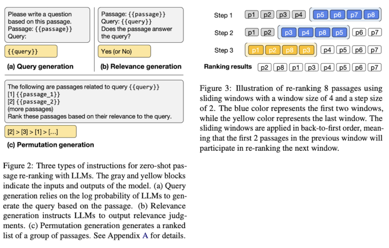

---

일부 연구에서는 LLM을 추천 시스템으로 사용하는 것 외에도 LLM을 활용하여 모델 기능을 구성하기도 합니다. GENRE [Liu et al., 2023c]는 뉴스 추천을 위한 세 가지 기능 향상 하위 작업을 수행하기 위해 LLM을 사용하는 세 가지 프롬프트를 소개했습니다. 특히 ChatGPT를 사용하여 초록에 따라 뉴스 제목을 구체화하고, 사용자 읽기 기록에서 프로필 키워드를 추출하고, 합성 뉴스를 생성하여 사용자 기록 상호 작용을 풍부하게 했습니다. LLM에 의해 구성된 이러한 기능을 통합함으로써 전통적인 뉴스 추천 모델을 크게 개선할 수 있습니다. 마찬가지로 NIR [Wang and Lim, 2023]은 영화 추천을 개선하기 위해 사용자 선호도 키워드를 생성하고 사용자 상호 작용 기록에서 대표 영화를 추출하는 두 가지 프롬프트를 설계했습니다.

##### Prompting Example

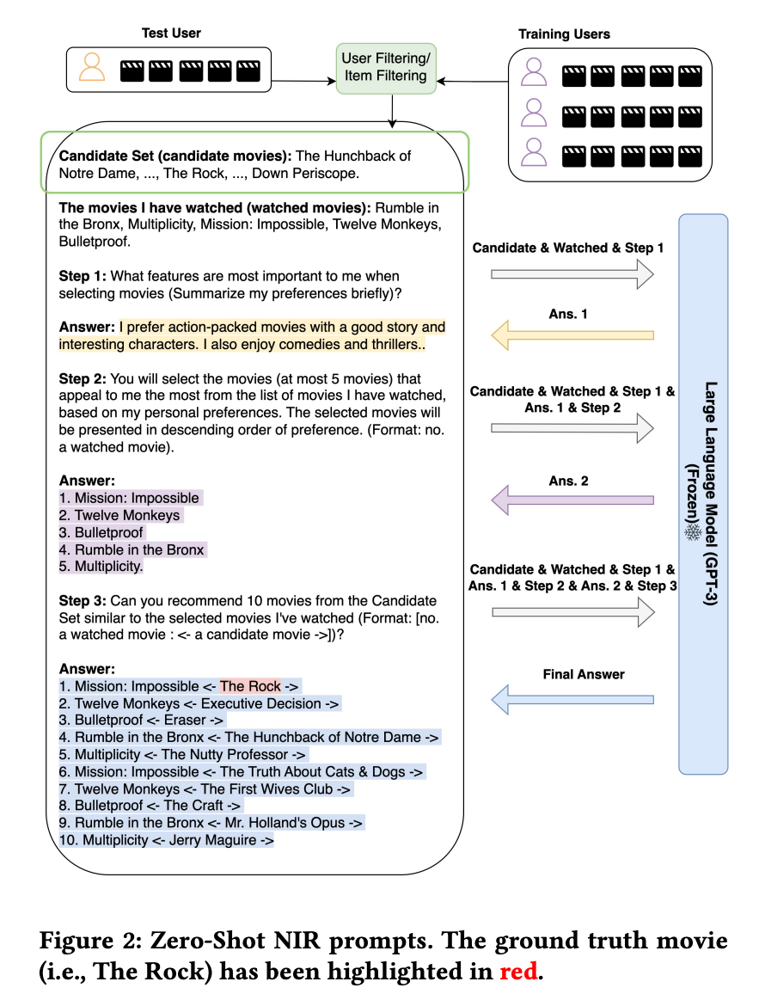

---

실제로, 순위 모델 외에도 전체 추천 시스템은 일반적으로 콘텐츠 데이터베이스, 후보 검색 모델 등과 같은 여러 가져오기 구성 요소로 구성됩니다. 따라서 LLM을 권장 사항으로 사용하는 또 다른 방법은 LLM을 전체 시스템의 컨트롤러로 사용하는 것입니다.

ChatREC [Gao et al., 2023]는 다중 턴 대화를 통해 사용자 요구 사항을 충족하고 기존 추천 시스템을 호출하여 결과를 제공하는 ChatGPT를 중심으로 대화형 추천 프레임워크를 설계했습니다. 또한 ChatGPT는 데이터베이스를 제어하여 관련 콘텐츠를 검색하여 프롬프트를 보완하고 콜드 스타트 항목 문제를 해결할 수 있습니다.

##### Prompting Example

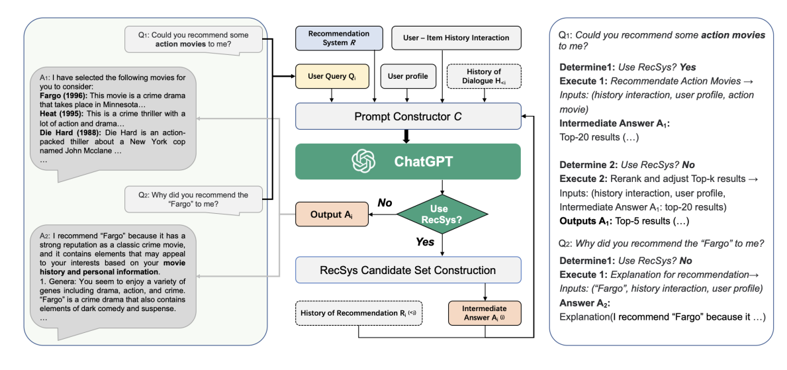

---

GeneRec[Wang et al., 2023b]은 생성적 추천 프레임워크를 제안하고 LLM을 사용하여 AIGC 모델에 의해 기존 항목을 추천하거나 새 항목을 생성하는 시기를 제어했습니다. 또한 RecAgent[Wang et al., 2023a]는 가상 추천 환경을 개발하기 위해 LLM을 지능형 시뮬레이터로 활용했습니다. 시뮬레이터는 사용자 모듈과 추천 모듈의 두 가지 기본 모듈로 구성됩니다. 사용자 모듈을 사용하면 추천 사이트를 탐색하고, 다른 사용자와 상호 작용하고, 소셜 미디어에 게시할 수 있습니다. 추천 모듈은 맞춤형 검색 및 추천 목록을 제공하여 추천을 위한 다양한 모델 설계를 지원합니다. 환경의 사용자는 LLM을 기반으로 작업을 수행하며 실제 동작을 미러링하여 유기적으로 진화할 수 있습니다. 이 프로젝트는 RL 기반 권장 사항에 대한 피드백을 시뮬레이션하고 소셜 미디어 사용자 간의 정보 전파 프로세스를 추적하는 등 여러 애플리케이션에서 잠재적인 활용도를 보여줍니다. 요약하자면, 이러한 연구는 자연어 프롬프트를 활용하여 추천 작업에서 LLM의 제로샷 기능을 활성화하여 저비용의 실용적인 솔루션을 제공합니다.

#### 1-2 In-context Learning

컨텍스트 내 학습은 GPT-3 및 기타 LLM에서 새로운 작업과 정보에 빠르게 적응하기 위해 사용하는 기술입니다. 몇 가지 데모 입력-레이블 쌍을 사용하면 추가 매개 변수 업데이트 없이 보이지 않는 입력에 대한 레이블을 예측할 수 있습니다[Dai et al., 2022]. 따라서 일부 작업에서는 LLM이 추천 작업을 더 잘 이해할 수 있도록 프롬프트에 데모 예제를 추가하려고 합니다. 순차적 추천을 위해 Hou et al. (2023)은 입력 상호 작용 시퀀스 자체를 보강하여 데모 예제를 도입했습니다. 세부적으로, 그들은 입력 상호 작용 시퀀스의 접두사와 해당 후속 단계를 예로 쌍으로 짝을 지었습니다. Liu et al. (2023a)와 Dai et al. (2023)은 다양한 추천 과제에 대한 데모 예제 템플릿을 설계했으며, 실험 결과 대부분의 과제에서 문맥 내 학습 방법이 LLM의 추천 능력을 향상시킬 수 있음을 보여주었습니다. 또한, LLM의 출력 포맷 및 내용을 제어하기 위해 적절한 데모를 사용할 수 있으며[Wang et al., 2023c], 이는 정기 평가 메트릭을 개선할 수 있습니다. 이는 안정적이고 강력한 추천 시스템을 개발하는 데 매우 중요합니다. 그러나 프롬프트와 비교했을 때, 추천 과제에서 언어 모델의 맥락 내 학습(LLM)을 사용하는 방법을 탐구한 연구는 소수에 불과합니다. 실증 예시의 선택과 실증 예시의 수가 추천 성과에 미치는 영향 등 수많은 미해결 질문이 남아 있습니다.

##### Prompting Example

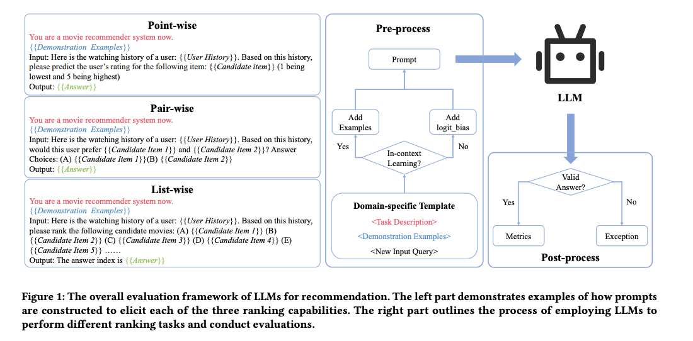

---

### 2. Tuning Paradigm

위에서 언급했듯이 LLM은 강력한 제로/퓨 샷 기능을 가지고 있으며, 적절한 프롬프트 설계를 통해 추천 성능이 무작위 추측을 크게 능가할 수 있습니다. 그러나 이러한 방식으로 구성된 추천 시스템이 특정 데이터에 대해 주어진 작업을 위해 특별히 훈련된 추천 모델의 성능을 능가하지 못하는 것은 놀라운 일이 아닙니다. 따라서 많은 연구자들은 추가적인 미세 조정 또는 신속한 학습을 통해 LLM의 추천 능력을 향상시키는 것을 목표로 합니다. 이 논문에서는 튜닝 방법의 패러다임을 각각 **finetuning, 프롬프트 튜닝 및 명령어 튜닝**의 세 가지 유형으로 분류합니다. 특히, finetuning 패러다임에서 판별 및 생성적 대규모 언어 모델의 사용 방법은 현저히 유사합니다. LLM은 주로 사용자 또는 항목의 표현을 추출하는 인코더 역할을 하며, LLM의 매개변수는 다운스트림 추천 작업의 특정 손실 함수에 따라 미세 조정됩니다. 한편, 프롬프트 튜닝 및 명령어 튜닝 패러다임에서 대형 모델의 출력은 일관되게 텍스트이며 해당 매개변수는 언어 모델링의 손실을 사용하여 학습됩니다. 프롬프트 튜닝과 명령어 튜닝 훈련 패러다임의 주요 차이점은 **프롬프트 튜닝은 주로 특정 작업(예: 등급 예측)에 초점**을 맞추는 반면, LLM은 **명령어 튜닝 패러다임 하에서 서로 다른 유형의 명령어를 사용하여 여러 작업에 대해 훈련**된다는 것입니다. 따라서 LLM은 **명령어 튜닝을 통해 더 나은 제로샷 능력**을 얻을 수 있습니다. 다음 절에서는 이 세 가지 패러다임의 대표적인 저작에 대해 자세히 알아보겠습니다.

#### 2-1 Fine-tuning

이전에 논의한 discriminative LLM과 근본적으로 유사하므로 이 섹션에서는 몇 가지 대표적인 작업만 소개하겠습니다. 예를 들어, Petrov와 Macdonald(2023)는 GPT-2 기반의 생성적 순차 추천 모델인 GPTRec을 제안했습니다. 차별적 LLM을 기반으로 하는 BERT4Rec과 달리 GPTRec은 생성형 LLM을 기반으로 하며, 메모리 효율성을 위해 SVD 토큰화를 사용하며, Next-K 세대 전략을 사용하여 보다 유연합니다. Kang et al. (2023)은 사용자 과거 상호작용을 프롬프트로 형식화하고, 각 상호작용은 항목에 대한 정보로 표현하고, 등급 예측 과제를 각각 다중 클래스 분류와 회귀라는 두 가지 다른 과제로 공식화할 것을 제안했습니다. Kang et al. (2023)은 250M에서 540B 파라미터에 이르는 다양한 크기의 다양한 LLM을 추가로 조사하고 zero-shot, few-shot, fine-tuning 시나리오에서 성능을 평가한 결과, 미세 조정이 가능한 FLAN-T5-XXL(11B) 모델이 최상의 결과를 얻을 수 있음을 발견했습니다. Li et al. (2023c)은 1,750억 개의 매개변수를 가진 GPT-3와 같은 LLM이 텍스트 기반 협업 필터링(TCF)에 미치는 영향을 연구했습니다. Li et al.은 더 강력한 LLM을 텍스트 인코더로 사용하면 추천 정확도가 높아질 수 있다는 것을 발견했습니다. 그러나 LM이 매우 크면 사용자 및 항목이 보편적으로 표현되지 않을 수 있으며, 간단한 ID 기반 공동 작업 필터링은 warm 항목 권장 사항 설정에서 여전히 경쟁이 치열한 접근 방식으로 남아 있습니다.

#### 2-2 Prompt Tuning

이 패러다임에서 LLM은 일반적으로 사용자/항목 정보를 입력으로 받아 항목에 대한 사용자 선호도(예: 좋아요 또는 싫어요, 등급)를 출력하거나 사용자가 관심을 가질 수 있는 항목을 출력합니다. 예를 들어, Bao et al. (2023)은 두 개의 튜닝 단계로 훈련되는 TALLRec을 제안했습니다. TALLRec은 먼저 Alpaca의 자체 지시 데이터를 기반으로 미세 조정됩니다[Taori et al., 2023]. 그런 다음 TALLRec은 권장 사항 조정을 통해 추가로 미세 조정되며, 여기서 입력은 사용자의 기록 시퀀스이고 출력은 "예 또는 아니오" 피드백입니다.

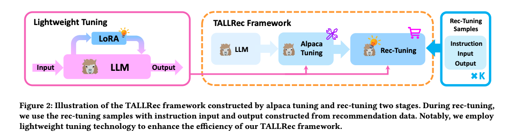

Ji et al.(2023)은 제너레이티브 LLM의 생성 능력을 활용하여 추천할 대상 아이템을 직접 생성하는 LLM 기반 생성형 추천 방법 GenRec을 제시했습니다. 구체적으로, Ji et al.은 입력 생성 기능을 사용하여 항목을 프롬프트로 변환하고, LLM을 사용하여 다음 항목을 생성할 것을 제안했습니다. PALR[Chen, 2023]은 LLM의 잠재력을 활용하여 추천을 위한 다단계 접근 방식을 제안했습니다. 특히 첸은 먼저 LLM을 활용하여 사용자의 선호도 요약을 생성할 것을 제안했습니다. 예를 들어, LLM은 사용자의 음악 및 TV 시청 기록을 분석하여 "팝 음악" 및 "판타지 영화"와 같은 요약을 생성할 수 있습니다. 그런 다음 검색 모듈을 사용하여 훨씬 더 작은 후보 풀을 가져옵니다. 마지막으로, 인터랙션 히스토리, 자연어 사용자 프로필, 검색된 후보를 활용하여 LLM에 추천을 위해 입력할 수 있는 자연어 프롬프트를 구성합니다.

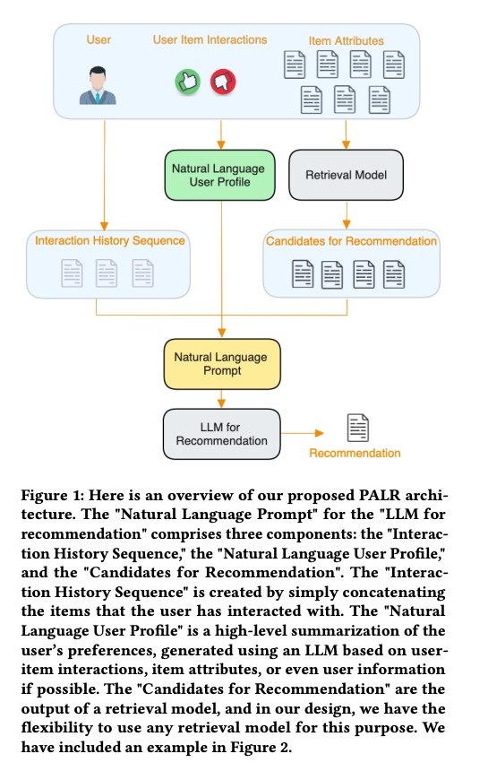

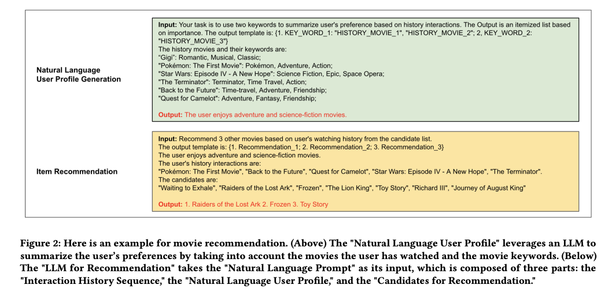

앞서 언급한 방법은 대규모 언어 모델을 사용하는 일반적인 작업에 대한 권장 사항입니다. 그러나 앞서 언급했듯이 대규모 언어 모델의 중요한 이점은 모델 매개 변수를 특정 도메인에 효율적으로 정렬할 수 있다는 것입니다. 현재 이 분야가 가장 광범위하게 탐구된 분야는 온라인 채용 시나리오입니다. 구체적으로, 직무-이력서 매칭 영역 내에서 생성적 추천 모델 GIRL[Zheng et al., 2023]은 LLM을 사용하여 잠재적인 직무 기술서(JD)를 생성하여 추천의 설명 가능성과 적절성을 향상시키는 데 앞장서고 있습니다. GLRec[Wu et al., 2023]은 LLM 추천자를 사용하여 행동 그래프를 해석하는 새로운 접근 방식인 메타 경로 프롬프트 생성자를 도입했습니다. 이 방법은 또한 프롬프트 편향을 완화하기 위해 경로 증강 모듈을 통합했습니다. 그 후, GAN(Generative Adversarial Networks)을 사용하여 짝을 이루지 않은 저품질 이력서를 고품질 이력서와 정렬하기 위해 LLM 기반 프레임워크가 도입되었습니다. 이 정렬 프로세스는 이력서 표현을 개선하여 추천 결과를 개선했습니다[Du et al., 2023].

온라인 채용 시나리오에서 위의 작업을 기대할 수 있으며, 특정 작업을 수행하기 위해 대규모 모델의 강력한 생성 기능을 활용하는 방법에 대한 몇 가지 다른 작업도 있습니다. 예를 들어, Jin et al. (2023)은 LLM의 도움을 받아 사용자가 관심을 가질 다음 제품의 제목을 생성할 것을 제안했습니다. 데이터 세트에 정의된 생성 목표를 사용하여 mT5 모델을 미세 조정합니다. 그러나 마지막 제품 제목을 결과로 사용하는 간단한 추론 방법은 미세 조정된 언어 모델의 성능을 능가합니다. Friedman et al. (2023)은 대화 관리 모듈이 포함된 RecLLM을 제안했는데, 여기에는 LLM을 사용하여 사용자와 대화하고, 랭커 모듈은 LLM을 사용하여 사용자 기본 설정에 일치하고, 제어 가능한 LLM 기반 사용자 시뮬레이터를 사용하여 시스템 모듈 튜닝을 위한 합성 대화를 생성합니다.

Li et al. (2023e)는 설계된 프롬프트에서 사용자 행동과 뉴스를 텍스트로 설명할 수 있는 PBNR을 제안했습니다. 특히, 개인화된 프롬프트는 입력 대상 템플릿을 설계하여 생성되며, 여기서 프롬프트의 관련 필드는 원시 데이터의 해당 정보로 대체됩니다. 추천 작업에서 LLM의 성능을 향상시키기 위해 PBNR은 학습 전반에 걸쳐 순위 손실과 언어 생성 손실을 통합합니다. Li et al. (2023a)는 추천 작업을 쿼리 생성 + 검색 문제로 간주할 것을 제안했습니다. 또한 LLM을 활용하여 다양하고 해석 가능한 사용자 관심사 표현, 즉 쿼리를 생성했습니다. 일부 연구에서는 LLM을 직접 미세 조정하는 것 외에도 더 나은 성능을 달성하기 위해 프롬프트 러닝을 활용할 것을 제안했습니다. 예를 들어, Wang et al. (2022)은 지식 강화 프롬프트 학습을 기반으로 UniCRS라는 통합 대화형 추천 시스템을 설계했습니다. 이 논문에서 저자는 LLM의 매개변수를 고정할 것을 제안하고, 프롬프트 학습을 통해 응답 생성 및 항목 추천을 위한 소프트 프롬프트를 훈련했습니다. Li et al. (2023b)는 LLM의 생성 능력을 기반으로 사용자가 이해할 수 있는 설명을 제공할 것을 제안했습니다. 저자들은 이산적 프롬프트 학습과 지속적인 프롬프트 학습을 모두 시도했으며, 각각 순차적 튜닝과 정규화로서의 권장 사항이라는 두 가지 학습 전략을 제안했습니다.

#### 2-3 Instruction Tuning

이 패러다임에서 LLM은 서로 다른 유형의 명령어를 사용하여 여러 작업에 맞게 미세 조정됩니다. 이러한 방식으로 LLM은 인간의 의도에 더 잘 부합하고 더 나은 제로샷 능력을 달성할 수 있습니다. 예를 들어, Geng et al. (2022)은 순차적 추천, 등급 예측, 설명 생성, 리뷰 요약 및 직접 추천의 5가지 유형의 지침에 대해 T5 모델을 미세 조정할 것을 제안했습니다. 추천 데이터 세트에 대한 멀티태스킹 명령 튜닝 후 모델은 보이지 않는 개인화된 프롬프트 및 새 항목에 대한 제로샷 일반화 기능을 달성할 수 있습니다. 마찬가지로 Cui et al. (2022)는 각각 점수 매기기 작업, 생성 작업 및 검색 작업의 세 가지 유형의 작업에 대해 M6 모델을 미세 조정할 것을 제안했습니다. Zhang et al. (2023b)은 먼저 선호도, 의도 및 과제 형태라는 세 가지 유형의 주요 측면에서 일반 교육 형식을 설계했습니다. 그런 다음 Zhang et al. (2023b)는 39개의 명령어 템플릿을 수동으로 설계하고 3B FLAN-T5-XL 모델에서 명령어 튜닝을 위한 대량의 사용자 맞춤형 명령어 데이터를 자동으로 생성했습니다. 실험 결과는 이 접근 방식이 GPT-3.5를 포함한 여러 경쟁 기준을 능가할 수 있음을 보여주었습니다.

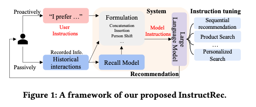
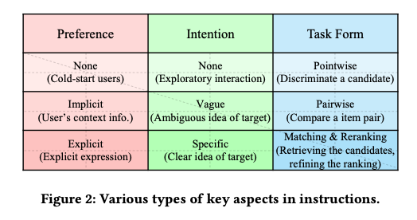

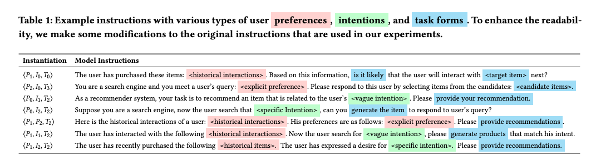

## Findings

### 1. Model Bias

#### Position Bias

추천 시스템의 생성언어 모델링 패러다임에서는 사용자 행동 순서, 추천 후보 등 다양한 정보가 텍스트 순차적 설명의 형태로 언어 모델에 입력되는데, 이는 언어 모델 자체에 내재된 위치 편향을 유발할 수 있다[Lu et al., 2021]. 예를 들어, 후보의 순서는 LLM 기반 추천 모델의 순위 결과에 영향을 미치는데, 즉, LLM은 종종 상위 순서로 항목의 우선 순위를 지정합니다. 그리고 모델은 일반적으로 시퀀스의 동작 순서를 잘 캡처할 수 없습니다. Hou et al. (2022)은 후보자의 포지션 편향을 완화하기 위해 무작위 표본추출 기반 부트스트래핑을 사용했으며, 행동 질서를 강화하기 위해 최근 상호작용된 항목을 강조했다. 그러나 이러한 솔루션은 적응력이 충분하지 않으며 향후 보다 강력한 학습 전략이 필요합니다.

#### Popularity Bias

LLM의 순위 결과는 후보자의 인기 수준에 영향을 받습니다. LLM의 사전 교육 말뭉치에서 자주 광범위하게 논의되고 언급되는 인기 있는 항목은 더 높은 순위에 오르는 경향이 있습니다. 이 문제를 해결하는 것은 사전 학습된 말뭉치의 구성과 밀접하게 관련되어 있기 때문에 어렵습니다.

#### Fairness Bias

사전 학습된 언어 모델은 특정 작업 주석에 관련된 개인의 학습 데이터 또는 인구 통계의 영향을 받는 민감한 속성[Zhang et al., 2023a]과 관련된 공정성 문제를 나타냈습니다[Ferrara, 2023]. 이러한 공정성 문제로 인해 모델이 사용자가 특정 그룹에 속한다고 가정하는 권장 사항을 만들 수 있으며, 상업적으로 배포할 때 논란의 여지가 있는 문제가 발생할 수 있습니다. 한 가지 예는 성별 또는 인종으로 인한 추천 결과의 편향입니다. 이러한 공정성 문제를 해결하는 것은 공평하고 편견 없는 추천을 보장하는 데 매우 중요합니다.

### 2. Recommendation Prompt Designing

#### User/Item Representation

실제로 추천 시스템은 일반적으로 많은 수의 개별 및 연속 기능을 활용하여 사용자와 항목을 나타냅니다. 그러나 대부분의 기존 LLM 기반 작업은 이름만 사용하여 항목을 나타내고 항목 이름 목록을 사용하여 사용자를 나타내기 때문에 사용자와 항목을 정확하게 모델링하기에는 충분하지 않습니다. 또한 선호도 모델링을 위해 사용자의 이질적인 행동 시퀀스(예: 클릭, 장바구니에 담기, 전자 상거래 도메인에서의 구매)를 자연어로 번역하는 것이 중요합니다. ID와 유사한 기능은 기존 추천 모델에서 효과적인 것으로 입증되었지만, 개인화된 추천 성능을 개선하기 위해 이를 프롬프트에 통합하는 것도 어렵습니다.

#### Limited Context Length

LLM의 컨텍스트 길이 제한은 사용자의 행동 시퀀스 길이와 후보 항목 수를 제한하여 최적화 되지 않은 성능을 초래합니다. 기존 연구에서는 이를 완화하기 위해 사용자 행동 시퀀스에서 대표항목을 선택하고 후보 목록에 대한 슬라이딩 윈도우 전략등과 같은 몇가지 기술을 제안하였습니다.

### 3. Promising Ability

#### Zero/Few-Shot Recommendation Ability

여러 도메인 데이터 세트에 대한 실험 결과는 LLM이 다양한 추천 작업에서 인상적인 제로샷/퓨샷 능력을 보유하고 있음을 나타냅니다[Hou et al., 2023; Liu 외, 2023a; Dai et al., 2023]. 컨텍스트 내 학습과 동일한 퓨샷 학습은 LLM의 매개변수를 변경하지 않는다는 점에 주목할 필요가 있습니다. 이는 LLM이 제한된 데이터로 콜드 스타트 문제를 완화할 수 있는 잠재력이 있음을 시사합니다. 그러나 퓨샷 학습에 대한 대표적이고 효과적인 시연 예제를 선택하는 데 있어 보다 명확한 지침이 필요하고 제로/퓨샷 추천 능력에 대한 결론을 추가로 뒷받침하기 위해 더 많은 영역에 걸친 실험 결과의 필요성과 같은 몇 가지 미해결 질문이 여전히 있습니다.

#### Explainable Ability

제너레이티브 LLM은 자연어 생성에 탁월한 능력을 보여줍니다. 따라서 자연적 사고는 LLM을 사용하여 텍스트 생성 방식을 통해 설명 가능한 추천을 수행합니다. Liu et al. (2023a)는 ChatGPT와 설명 생성 작업에 대한 몇 가지 기준선 간의 비교 실험을 수행합니다. 결과는 미세 조정 없이 상황별 학습 설정에서도 ChatGPT가 일부 감독 기존 방법보다 여전히 더 나은 성능을 발휘한다는 것을 보여줍니다. 또한 인간의 평가에 따르면 ChatGPT의 설명은 실측 자료보다 훨씬 더 명확하고 합리적인 것으로 간주됩니다. 이러한 흥미로운 예비 실험 결과에 힘입어 설명 가능한 권장 사항에서 미세 조정된 LLM의 성능이 유망할 것으로 예상됩니다.

### 4. Evaluation Issue

#### Generation Controlling

앞서 언급했듯이 많은 연구에서 신중하게 설계된 지침을 제공함으로써 대규모 모델을 추천 시스템으로 사용했습니다. 이러한 LLM의 경우 출력은 이진 응답(예 또는 아니오)을 제공하거나 순위 목록을 생성하는 등 주어진 명령어 형식을 엄격하게 준수해야 합니다. 그러나 실제 응용 프로그램에서는 LLM의 출력이 원하는 출력 형식에서 벗어날 수 있습니다. 예를 들어, 모델은 잘못된 형식으로 응답을 생성하거나 답변 제공을 거부할 수도 있습니다[Dai et al., 2023]. 또한 제너레이티브 모델은 학습 데이터와 자동 회귀 학습 모드로 인해 목록별 추천 작업을 잘 수행하는 데 어려움을 겪으며, 이로 인해 여러 항목의 순위 문제를 처리할 수 있는 능력이 떨어집니다. 이 문제는 실제 시나리오에서 여러 항목의 순위를 순서대로 지정할 수 있는 실측 자료가 없기 때문에 미세 조정을 통해 해결할 수 없습니다. 따라서 시퀀스를 기반으로 하는 자기회귀 학습 로직을 적용하기가 어렵습니다. PRP(Pairwise Ranking Prompting)[Qin et al., 2023]는 모든 쌍을 열거하고 전역 집계를 수행하여 각 항목에 대한 점수를 생성하는 LLM을 사용하여 목록별 작업에 대한 쌍별 순위를 제안합니다. 그러나 이 논리는 추론 프로세스에서 시간이 많이 걸립니다. 따라서 LLM의 출력을 더 잘 제어해야 하는 문제를 해결하는 것은 해결해야 할 시급한 문제입니다.

- Pairwise Ranking Prompting (PRP)은 대규모 언어 모델(Large Language Models, LLMs)을 사용하여 텍스트 순위를 매기는 새로운 기술입니다. 이 방법은 쿼리와 후보 문서들을 직접 LLM에 입력하여 문서들을 순위대로 나열하는 것을 목표로 합니다. 기존의 점수화(pointwise) 및 목록화(listwise) 순위 매기기 방식과 달리, PRP는 LLM에 부담을 크게 줄이기 위해 개발되었습니다. PRP는 두 문서 쌍을 비교하여 어느 것이 더 관련성이 높은지를 평가하고, 이를 통해 전체 문서 집합의 순위를 결정합니다. PRP는 효율성을 높이기 위한 여러 변형을 제안하며, 선형 복잡도로도 경쟁력 있는 결과를 달성할 수 있음을 보여줍니다. 또한, PRP는 생성 및 점수화 LLM API를 모두 지원하며, 입력 순서에 민감하지 않은 장점이 있습니다.

#### Evaluation Criteria

LLM이 수행하는 작업이 등급 예측 또는 항목 순위와 같은 표준 권장 작업인 경우 평가를 위해 NDCG, MSE 등과 같은 기존 평가 지표를 사용할 수 있습니다. 그러나 LLM은 강력한 생성 기능을 가지고 있어 생성적 추천 작업에 적합합니다[Wang et al., 2023b]. 생성적 추천 패러다임에 따라 LLM은 과거 데이터에 등장한 적이 없는 아이템을 생성하여 사용자에게 추천할 수 있습니다. 이 시나리오에서 LLM의 생성적 추천 기능을 평가하는 것은 여전히 미해결 과제로 남아 있습니다

#### Dataset

현재 이 분야의 대부분의 연구는 주로 MovieLens, Amazon Books 및 이와 유사한 벤치마크와 같은 데이터 세트를 사용하여 LLM의 추천 기능과 제로/퓨샷 기능을 테스트합니다. 그러나 이로 인해 다음과 같은 두 가지 잠재적인 문제가 발생할 수 있습니다. 첫째, 실제 산업 데이터셋과 비교했을 때 이러한 데이터셋은 규모가 상대적으로 작아 LLM의 추천 기능을 완전히 반영하지 못할 수 있습니다. 둘째, 영화나 책과 같은 데이터셋의 항목에는 LLM의 사전 학습 데이터에 나타난 관련 정보가 있을 수 있습니다. 이로 인해 LLM의 few-zero-shot 학습 능력을 평가하는 데 편향이 발생할 수 있습니다. 현재로서는 보다 포괄적인 평가를 수행하기 위한 적절한 벤치마크가 아직 부족합니다.

#### Others

앞서 언급한 두드러진 결과 외에도 대규모 언어 모델의 기능과 관련된 몇 가지 제한 사항도 있습니다. 예를 들어, 특정 도메인 작업을 위해 모델을 학습시키거나 모델 지식을 업데이트할 때 지식 망각의 문제가 발생할 수 있습니다[Jang et al., 2022]. 또 다른 문제는 언어 모델 매개변수의 크기가 다양하여 성능이 뚜렷하다는 것인데, 지나치게 큰 모델을 사용하면 추천 시스템의 연구 및 배포에 과도한 계산 비용이 발생할 수 있습니다[Hou et al., 2023]. 이러한 과제는 또한 현장에서 귀중한 연구 기회를 제공합니다.

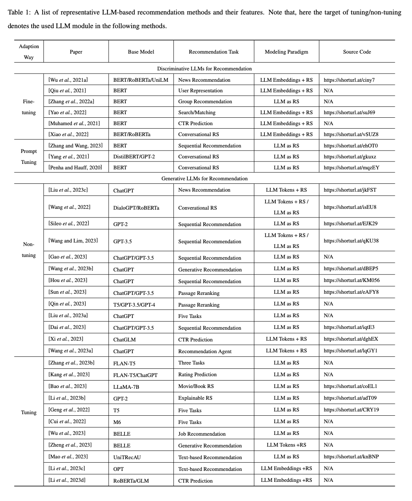

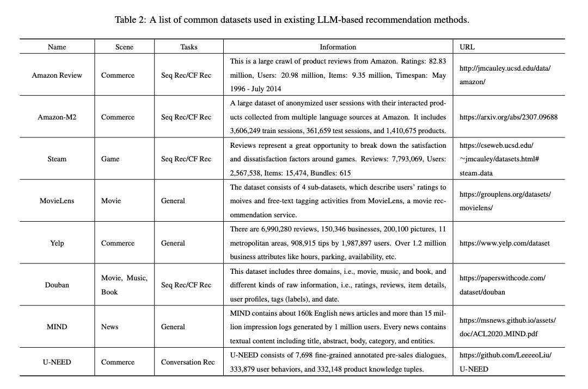
