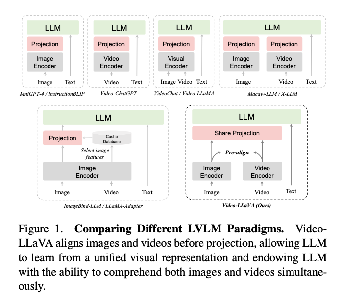
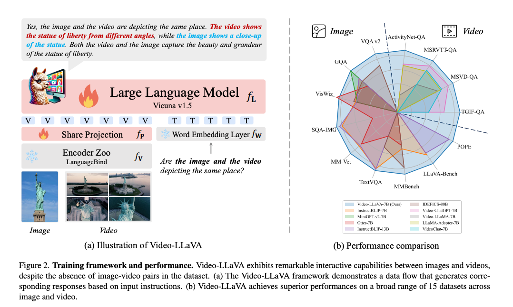
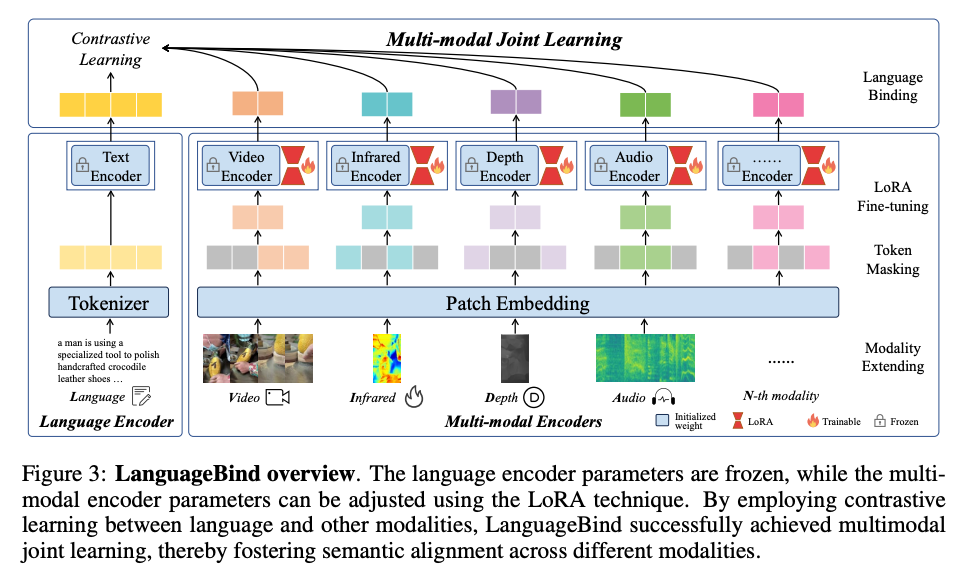
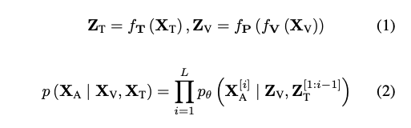
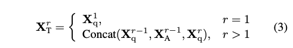
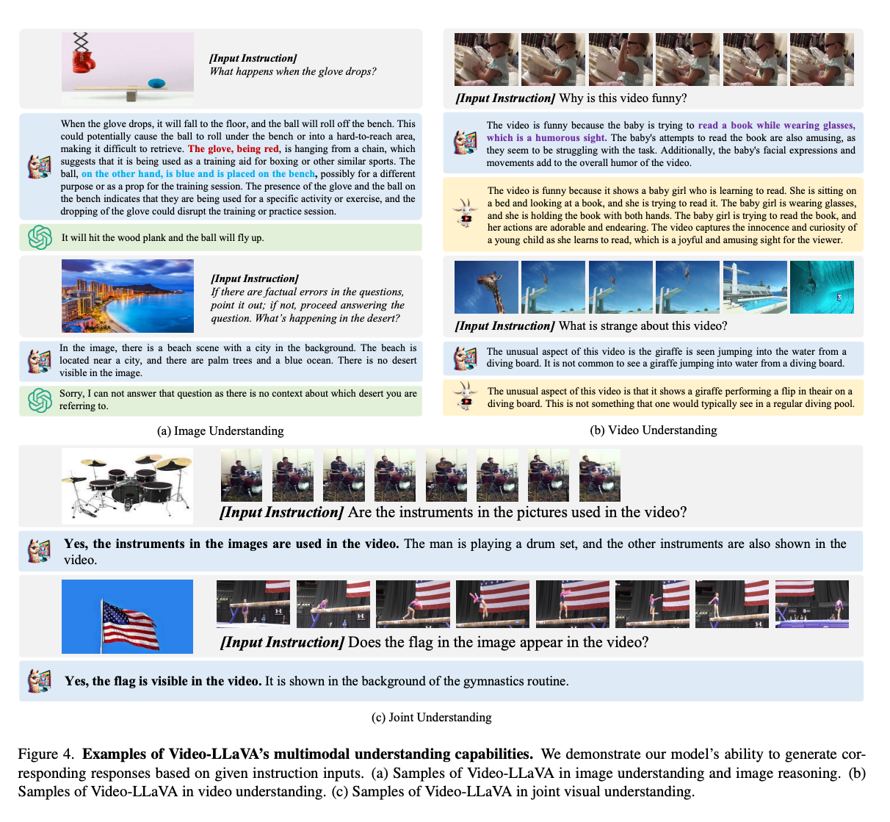

LVLM(Large Vision-Language Model)은 시각 언어 이해에서 다양한 다운스트림 작업의 성능을 향상시켰습니다. 대부분의 기존 접근 방식은 이미지와 비디오를 별도의 feature 공간으로 인코딩한 다음 대규모 언어 모델에 대한 입력으로 공급합니다. 그러나 이미지 및 비디오에 대한 통합 토큰화가 부족하기 때문에, 즉 프로젝션 전 정렬 불량으로 인해 대규모 언어 모델(LLM)이 여러 불량 프로젝션 레이어에서 다중 모드 상호 작용을 학습하는 것이 어려워집니다. 이 작업에서는 시각적 표현을 언어 기능 공간으로 통합하여 기본 LLM을 통합 LVLM으로 발전시킵니다. 그 결과, 단순하지만 강력한 LVLM 기준인 Video-LLaVA를 구축하여 이미지와 비디오의 혼합 데이터 세트에서 학습하여 서로를 강화합니다. Video-LLaVA는 5개의 이미지 질문 답변 데이터 세트와 4개의 이미지 벤치마크 툴킷에 걸쳐 광범위한 9개의 이미지 벤치마크에서 우수한 성능을 달성합니다. 또한 Video-LLaVA는 MSRVTT, MSVD, TGIF 및 ActivityNet에서 각각 5.8%, 9.9%, 18.6% 및 10.1% Video-ChatGPT를 능가합니다. 특히, 광범위한 실험을 통해 Video-LLaVA가 통합된 시각적 표현 내에서 이미지와 비디오에 상호 이익이 되며, 이미지 또는 비디오를 위해 특별히 설계된 모델보다 성능이 우수하다는 것이 입증되었습니다. 이 작업은 LLM의 멀티모달 입력에 대한 약간의 통찰력을 제공하는 것을 목표로 합니다.

[Code Link](https://github.com/PKU-YuanGroup/Video-LLaVA)
[Paper Link](https://arxiv.org/pdf/2311.10122.pdf)

## Introduction

최근 LLM은 GPT-3.5, GPT-4, PaLM, BLOOM과 같이 AI 커뮤니티에서 빠르게 인기를 얻고 있습니다. 그들은 강력한 언어 이해 능력에 의존하여 인간이 제공한 지시를 따르고 그에 상응하는 응답을 제공합니다. 일반적으로 LLM은 사용자가 제공한 텍스트 입력 내에서만 응답하는데, 이는 인간과 세계의 상호 작용이 시각 및 텍스트와 같은 여러 채널을 포함하기 때문에 충분하지 않습니다. 이를 위해 최근 작업은 이미지를 텍스트와 같은 토큰으로 매핑하여 이미지를 이해할 수 있는 능력을 갖춘 LLM을 가능하게 했습니다. 이러한 효과에도 불구하고, LLM이 비디오를 이해할 수 있도록 지원하는 것은 이미지만 이해하는 작업보다 더 어렵습니다. 그럼에도 불구하고 최근의 연구는 비디오와 언어 간의 상호작용을 가능하게 하는 데 있어 초기 진전을 이루었습니다.

그러나 대부분의 최신 LVLM은 주로 이미지 언어 또는 비디오 언어와 같은 단일 시각적 양식을 처리 할 수 있습니다. 그림 1과 같이 서로 다른 LVLM 패러다임을 비교했는데, 여기서 VideoChat과 Video-LLaMA는 공유 비주얼 인코더를 사용하여 이미지와 비디오를 모두 처리합니다. 그러나 이미지와 비디오의 미디어 유형에 내재된 차이로 인해 통일된 표현을 배우는 것은 어렵고 성능은 전문 비디오 전문가 모델인 Video-ChatGPT에 비해 크게 뒤쳐집니다. 따라서 XLLM과 Macaw-LLM은 각 모달리티에 대해 모달리티별 인코더를 할당하여 LLM이 여러 프로젝션 레이어를 통해 이미지나 비디오를 이해할 수 있도록 합니다. 그러나 그들의 성능은 Video-ChatGPT와 같은 전용 비디오 전문가 모델보다 열등합니다.

저자는 이 현상이 투영 전에 정렬이 부족하기 때문이라고 생각합니다. 이미지 feature와 비디오 feature는 자체 공간에 존재하기 때문에, LLM이 여러 불량 프로젝션 레이어로부터 상호작용을 학습하는 것은 어려운 일입니다. 융합 전 정렬과 같은 유사한 현상은 다중 모델 모델에서 ALBEF 및 ViLT에 의해 논의되었습니다. 최근에는 ImageBind-LLM이 각 모달리티를 공통 기능 공간에 미리 정렬하여 LLM이 여러 모달 입력을 동시에 처리할 수 있도록 하는 데 중점을 두고 있습니다. 대규모 이미지 언어 모델을 기반으로 하는 ImageBind-LLM은 trainingfree 이미지 캐시 데이터베이스에서 검색하여 다른 모달리티를 가장 유사한 이미지 특성으로 변환합니다. 그러나 ImageBind-LLM의 간접 정렬 방식은 성능 저하로 이어질 수 있으며 LLM은 실제 비디오 데이터에 대한 지식이 없습니다.

이 작업에서는 이미지와 비디오를 동시에 처리하는 LVLM을 위한 간단하지만 강력한 기준인 Video-LLaVA를 소개합니다. 구체적으로, Fig 1.에 도시된 바와 같이, Video-LLaVA는 초기에 이미지와 비디오의 표현을 통일된 시각적 특징 공간에 정렬합니다. 시각적 표현은 프로젝션 전에 이미 정렬되어 있기 때문에 공유 프로젝션 레이어를 사용하여 LLM에 대한 통합 시각적 표현을 매핑합니다. 연산 효율성을 높이기 위해 Video-LLaVA는 이미지와 비디오의 공동 훈련을 거쳐 1개의 훈련 Epoch로 놀라운 결과를 달성합니다.

그 결과, 제안된 Video-LLaVA는 이미지와 비디오를 동시에 이해할 수 있는 LLM의 능력을 크게 향상시킵니다. 이미지 이해의 경우, VideoLLaVA는 5개의 이미지 벤치마크에서 mPLUG-owl7B 및 InstructBLIP-7B와 같은 고급 LVLM을 능가합니다. 또한 보다 포괄적인 평가를 위해 4개의 벤치마크 툴킷을 활용하는 Video-LLaVA-7B는 MMBench에서 IDEFICS-80B를 6.4% 능가합니다. 또한 MSVD, MSRVTT, TGIF 및 ActivityNet 비디오 질의응답 데이터 세트에서 Video-LLaVA가 Video-ChatGPT를 각각 5.8%, 9.9%, 18.6% 및 10.1% 능가하는 비디오 이해에서도 유사한 추세를 관찰할 수 있습니다. 광범위한 절제 실험은 투영 전 정렬이 더 큰 이점을 제공한다는 것을 보여줍니다. 또한 이미지와 비디오의 공동 학습은 LLM 이해에서 통일된 시각적 표현을 용이하게 할 수 있습니다.

## Related Works

### Large Vision Language Models

LVLM은 두 가지 유형으로 나뉩니다:

i) LLM을 스케줄러로 취급하는 것, ii) LLM을 디코더로 취급하는 것.

스케줄러로서의 LLM 스케줄러 기반 방법에서는 다양한 시각적 모델이 플러그 앤 플레이 모듈로 처리됩니다. LLM은 빌딩 블록 조립과 같은 특정 시각적 작업 요구 사항에 따라 일정을 예약합니다. 이러한 방법 중 일부는 VisualChatGPT 및 HuggingGPT와 같은 이미지에 중점을 두는 반면 MM-REACT 및 ViperGPT도 비디오를 처리할 수 있습니다. 이러한 스케줄러 기반 LVLM의 주요 특징은 엔드 투 엔드 교육이 필요하지 않으므로 각 양식의 사전 정렬 및 공동 교육이 필요하지 않다는 것입니다.

디코더로서의 LLM LLM을 디코더로 취급하는 접근법과 관련하여, 이것이 저자의 주요 초점입니다. MiniGPT-4는 여러 선형 투영 레이어를 통해 이미지 토큰을 대규모 언어 모델의 입력에 맞춥니다. 그러나 이러한 정렬은 약하고 사람의 지시에 따른 피드백이 부족합니다. 그 후, mPLUG-Owl은 2단계 훈련 접근 방식을 채택합니다. 첫 번째 단계에서는 자동 회귀 사전 학습 스타일을 사용하여 이미지를 언어와 정렬하고, 두 번째 단계에서는 인간 명령 데이터 세트를 사용하여 명령 조정을 수행합니다. 대규모 언어 모델 백엔드의 규모가 증가함에 따라 InstructBLIP 및 LLaVA와 같은 접근 방식은 더 큰 인간 명령 데이터 세트를 수집하여 더 큰 LVLM(예: 13B 매개 변수)을 훈련합니다.

명령 데이터 세트의 각 답변은 주어진 지침을 엄격하게 따릅니다. 그런 다음 인간 명령 데이터 세트를 사용하여 엔드 투 엔드 훈련을 거쳐 시각적 추론 기능을 갖춘 LLM을 활성화합니다. 또한 Video-ChatGPT는 100k 비디오 명령 데이터 세트를 설계하여 LLM이 비디오를 이해할 수 있도록 성공적으로 지원합니다. VideoChat과 VideoLLaMA는 LLM이 이미지와 비디오를 동시에 처리할 수 있도록 공동 훈련을 수행함으로써 이를 달성합니다. LLM을 추가적인 시각적 모달리티로 확장하려면 LLaMA-Adapter 및 ImageBind-LLM에서 볼 수 있듯이 일반적으로 사전 정렬이 필요합니다. ImageBind의 모달리티 인코더를 통해 다른 모달리티를 이미지 공간에 바인딩합니다. 이러한 모델은 통합 기능 공간이 LLM의 멀티모달 추론 기능을 향상시키는 데 유리하다는 것을 보여주었습니다. 이전 작업과 달리 Video-LLaVA는 이미지 및 비디오 기능을 사전 정렬할 뿐만 아니라 이미지 및 비디오의 공동 교육을 수행하여 LLM이 통합된 시각적 표현에서 다중 모드 추론 기능을 학습할 수 있도록 합니다.

## Video-LLaVA

### 1. Model Structure

#### Framework Overview

그림 2에서 볼 수 있듯이 Video-LLaVA는 원시 시각 신호(예: 이미지 또는 비디오)에서 특징을 추출하는 LanguageBind 인코더 fV, Vicuna와 같은 대규모 언어 모델 fL, 시각적 프로젝션 레이어 fP 및 단어 임베딩 레이어 fT로 구성됩니다. 처음에는 LanguageBind 인코더를 사용하여 시각적 기능을 얻습니다. LanguageBind 인코더는 다양한 형식을 텍스트 기능 공간에 매핑할 수 있으므로 통일된 시각적 표현을 제공할 수 있습니다. 그 후, 통합된 시각적 표현은 공유 프로젝션 레이어에 의해 인코딩된 다음, 토큰화된 텍스트 쿼리와 결합되고 대규모 언어 모델에 공급되어 해당 응답을 생성합니다.

#### United Visual Representation

목표는 이미지와 비디오를 공유 기능 공간에 매핑하여 대규모 언어 모델이 통합된 시각적 표현을 통해 학습할 수 있도록 하는 것입니다. 동일한 정보가 여러 매체를 통해 전달될 수 있다고 가정합니다. 예를 들어, 달리는 개는 언어, 이미지 또는 비디오를 통해 동시에 표현될 수 있습니다. 따라서 서로 다른 양식의 정보를 공통 특성 공간으로 압축하여 모델이 조밀한 특성 공간에서 정보를 추출할 수 있도록 하여 양식 상호 작용 및 상보성을 촉진할 수 있습니다. 따라서 이미지와 비디오를 텍스트 기능 공간에 맞추는 LanguageBind의 모달리티 인코더를 선택했습니다.

##### Reference: [LanguageBind](https://arxiv.org/pdf/2310.01852.pdf)

언어 이외의 다른 양식의 경우 패치 크기가 14인 24레이어, 1024차원 비전 트랜스포머를 사용합니다. 인코더는 OpenCLIP-large(Ilharco et al., 2021)에서 초기화됩니다. 깊이와 적외선은 RGB 이미지로 처리되며, RGB 이미지에 맞추기 위해 채널 차원에서 3번 복제됩니다. ImageBind에 따라 오디오 데이터는 10초 길이(128멜 빈)의 스펙트로그램으로 변환되고 스펙트로그램을 반복하고 패딩합니다. 예를 들어, 4초 스펙트로그램을 두 번 반복한 다음 추가로 2초 동안 0으로 채웁니다. 마찬가지로 채널 차원에서도 3번 복제합니다. 지속 시간이 10초를 초과하는 경우 원본 오디오의 앞 1/3, 중간 1/3, 뒤 1/3에서 각각 3개의 10초 오디오 세그먼트를 무작위로 샘플링하고 마지막으로 함께 쌓습니다.

- Patch masking: 인코더 내 모든 토큰을 처리하는 효율성 문제를 해결하기 위해 이미지를 패치 임베딩 레이어를 통해 패치로 나눕니다. 인코더 마스크 M_e를 따라 패치의 작은 부분을 선택합니다.
- **LoRA(Low-Rank Adaptation) finetuning**: LoRA는 미리 훈련된 모델의 가중치를 고정하고, 각 레이어에 학습 가능한 저차원 분해 행렬을 삽입하는 방식을 사용하여 모델의 학습 가능한 매개변수 수를 줄이는 방식으로 작동합니다.
- Modality extending: 데이터를 토큰 시퀀스로 변환합니다. OpenCLIP에서 매개변수를 초기화합니다. 토큰 마스킹과 LoRA 미세 조정을 통해 다양한 모달리티의 인코더를 훈련합니다. 이 과정에서 언어 인코더는 고정 상태로 유지됩니다. 최종적으로 이 모달리티를 언어 특성 공간에 맞춥니다.
- Multi-modal Joint Learning: Text Encoder는 Transformer 구조를 사용하며, 텍스트 처리를 위해 BPE 토크나이저를 사용합니다. 다양한 모달리티 간의 정렬을 위해 대조 학습을 사용합니다. 각 모달리티를 언어와 직접적으로 연결함으로써 제로샷 분류와 검색 작업을 효과적으로 개선할 수 있습니다.

#### Alignment Before Projection

LanguageBind는 **OpenCLIP**에서 초기화됩니다. 이는 이미지와 언어를 자연스럽게 공유된 특성 공간에서 정렬시킵니다. 그 다음, VIDAL-10M에서 300만 개의 비디오-텍스트 쌍을 사용하여 비디오 표현을 언어 공간에 정렬시킵니다. 언어 특성 공간을 공유함으로써 이미지와 비디오 표현은 결국 통합된 시각적 특성 공간으로 수렴하게 됩니다. 이를 **이미지와 비디오의 급격한 정렬**이라고 합니다. 이로써 LLM의 입력을 사전 정렬하고 다양한 시각적 신호의 표현 간 격차를 줄입니다. 통합된 시각적 표현은 공유된 투영 레이어를 통과한 후 LLM에 입력됩니다.

### 2. Training Pipeline

전반적으로 VideoLLaVA의 응답 생성 프로세스는 대규모 언어 모델(예: GPT 시리즈)의 프로세스와 유사합니다. 텍스트 입력 X_T 및 시각 신호 X_V가 주어지면 입력 신호는 식 (1)에 따라 일련의 토큰으로 인코딩됩니다. 식 (2)에서 우도 확률을 최대화함으로써 모델은 궁극적으로 다중 모드 이해 기능을 달성합니다. 여기서 L은 생성된 시퀀스 X_A의 길이입니다. 이미지와 비디오에 대한 공동 훈련을 동적으로 수행하며, 단일 배치에는 이미지와 비디오 샘플이 동시에 포함됩니다.

학습 이해 이 단계에서 모델은 광범위한 이미지/비디오-텍스트 쌍 데이터 세트 내에서 시각적 신호를 해석하는 기능을 습득해야 합니다. 각 시각 신호는 단일 라운드의 대화 데이터(Xq, Xa)에 해당하며, 여기서 XT = Xq이고 Xa는 실측 자료입니다. 이 단계의 학습 목표는 모델이 비전을 볼 수 있는 기본 기능을 학습하는 원래 자동 회귀 손실입니다. 이 과정에서 모델의 다른 매개변수를 고정합니다.

명령어 튜닝 이 단계에서 모델은 다른 명령어에 해당하는 응답을 제공해야 합니다. 이러한 지침에는 단순히 시각적 신호를 설명하는 것이 아니라 더 복잡한 시각적 이해 작업이 포함되는 경우가 많습니다.

Conversation Data는 (Xq1, Xa1, ..., Xqn, Xan) 으로 되어 있습니다. 여기서 r은 round number를 나타냅니다. 식 (3)에서 볼 수 있듯이 > 1일 때 모든 이전 라운드의 대화를 현재 명령어를 이번 라운드의 입력으로 연결합니다. 학습 목표는 이전 단계와 동일하게 유지됩니다. 이 단계가 끝나면 모델은 다양한 지침과 요청에 따라 해당 응답을 생성하는 방법을 학습합니다. LLM은 이 단계에서 훈련에도 참여합니다.

모델 설정 Vicuna-7B v1.5를 대규모 언어 모델로 사용합니다. 비주얼 인코더는 ViT-L/14에서 초기화된 LanguageBind에서 파생됩니다. 텍스트 토크나이저는 약 32,000개의 클래스가 있는 LLaMA에서 제공됩니다. 공유 프로젝션 레이어는 2개의 완전 연결 레이어로 구성됩니다. 데이터 세부 정보 그림 3에서 볼 수 있듯이 사전 학습을 이해하는 단계에서는 CC3M에서 제공되고 Liu et al.에서 필터링된 BLIP 캡션이 있는 558K LAION-CCSBU 이미지-텍스트 쌍의 하위 집합을 사용합니다. 비디오-텍스트 쌍은 Valley에서 제공하는 하위 집합에서 파생되며 WebVid에서 시작된 총 703k 쌍 중 702k에 액세스할 수 있습니다. 명령어 튜닝 단계를 위해 LLaVA v1.5의 665k 이미지-텍스트 명령어 데이터셋과 Video-ChatGPT의 100k 비디오-텍스트 명령어 데이터셋을 포함하여 두 가지 소스에서 교육용 데이터세트를 수집했습니다

학습 단계에서 각 이미지의 크기를 조정하고 잘라 처리된 각 이미지의 크기가 224×224가 되도록 합니다. 각 비디오에서 8개의 프레임을 균일하게 샘플링하고 각 프레임은 이미지 전처리를 거칩니다. 각 배치의 데이터는 이미지와 비디오의 무작위 조합입니다. 첫 번째 단계에서는 코사인 학습률 일정과 함께 AdamW 옵티마이저를 사용하여 배치 크기가 256인 한 epoch에 대해 훈련합니다. 두 번째 단계에서는 배치 크기를 128로 줄입니다. 두 단계의 초기 학습률은 1e-3으로 설정되며, 워밍업 비율은 0.03입니다. 추가 하이퍼파라미터 설정은 부록에서 확인할 수 있습니다.

## Results

