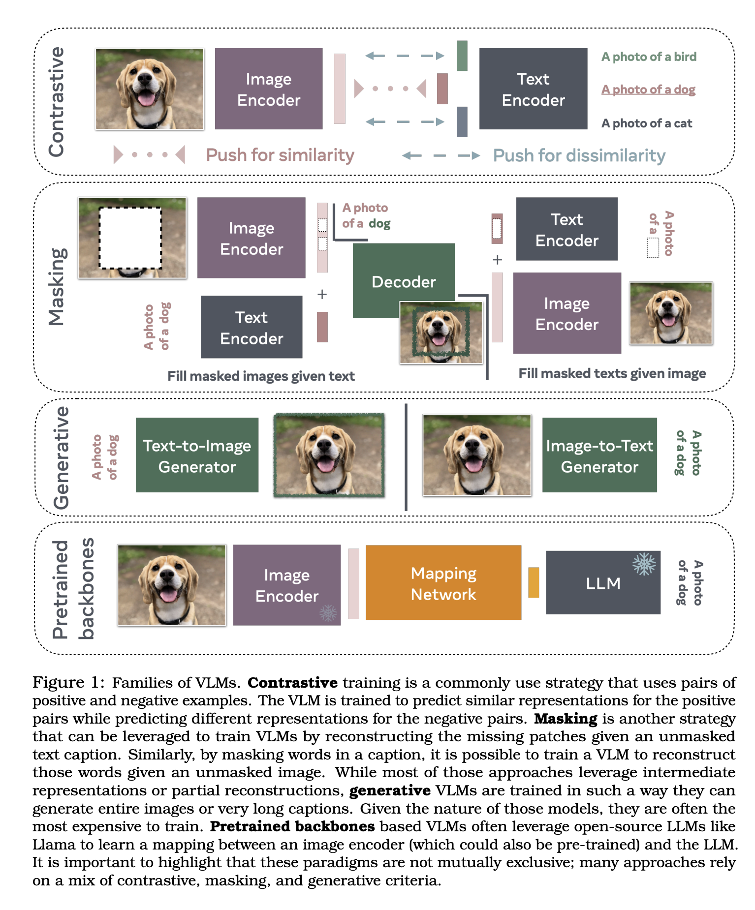
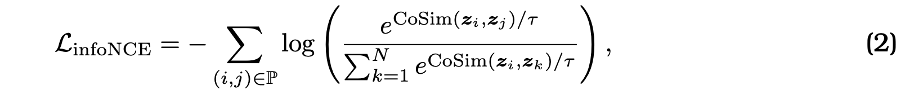
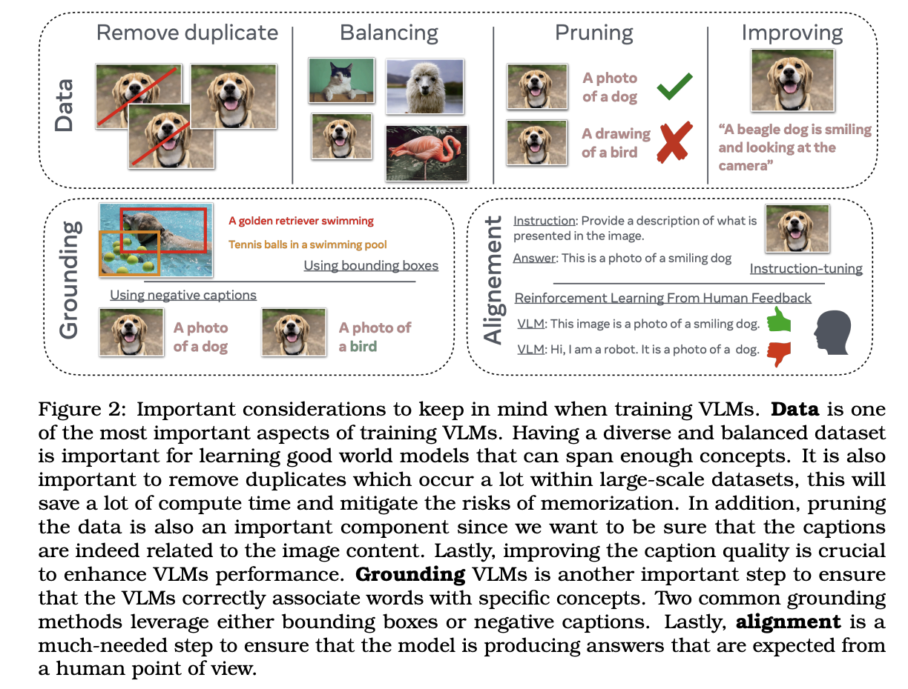
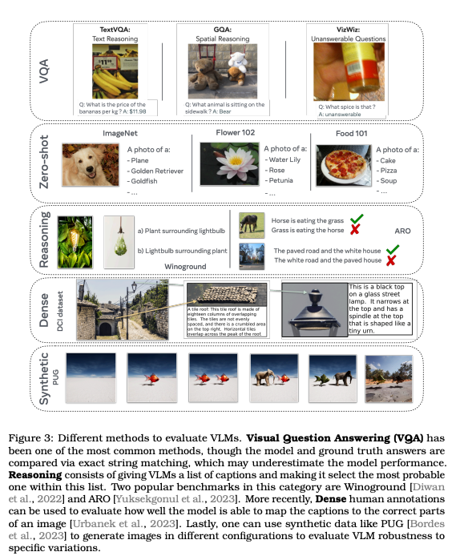

최근 LLM의 인기로 인해 이를 비전 영역으로 확장하려는 시도가 여러차례 있었습니다. 비전-언어 모델 (VLM)은 시각 정보를 텍스트와 결합하여 다양한 프로그램에서 사용될 수 있습니다.
이 논문은 VLM의 기본 개념, 훈련 방법, 평가 방법을 소개하고, 특히 이미지에서 언어로의 매핑을 중십으로 설명합니다.

[Paper Link](https://arxiv.org/pdf/2405.17247)

## Summary

### VLM의 유형

주로 네가지 훈련 패러다임으로 나눌 수 있습니다.
- Contrastive Training: Pos, Neg 예제 쌍을 사용하여 이미지-텍스트 간의 유사한 표현을 학습합니다. (ex: CLIP)
- Masking: 이미지 패치나 텍스트를 마스킹하고 이를 재구성하는 방식입니다. (ex: FLAVA, MaskVLM)
- Generative Models: 텍스트와 이미지를 생성할 수 있는 모델입니다. (ex: CoCa, CM3leon)
- Pretrained Backbones: 사전 학습된 언어모델과 이미지 인코더를 사용하여 학습을 효율화 합니다. (ex: MiniGPT)

### VLM 훈련 가이드
- 훈련 데이터: 적절한 데이터셋 선택, 합성 데이터 사용, 데이터 증강, 인간 전문가의 데이터 주석 활용 등이 포함됩니다.
- 소프트웨어: 공개 소프트웨어 저장소 활용, GPU 수, 훈련 속도 향상, 하이퍼파라미터의 중요성 등이 다룹니다.
- 모델 선택: 대조 모델, 마스킹 모델, 생성 모델, 사전 학습된 백본 모델의 사용 시기를 논의합니다. 

### 책임 있는 VLM 평가 접근법
- 평가 벤치마크: 이미지 캡셔닝, 텍스트-이미지 일관성, 시각적 질문 응답, 제로샷 이미지 분류 등 다양한 벤치마크를 통해 VLM의 능력을 평가합니다.
- 편향 및 불균형 평가: 분류 및 임베딩에서의 편향 측정, 언어 편향 평가 등이 포함됩니다.
- 환각 및 기억 측정: VLM의 환각 현상과 모델의 기억 능력을 평가합니다.

### 비디오로의 확장
VLM을 비디오 데이터로 확장하는 방법을 논의합니다. 비디오는 이미지보다 계산 비용이 더 높고 시간적 차원을 텍스트로 매핑하는 도전 과제가 있습니다.


## The Families of VLMs



### 1. Early work on VLMs based on transformers
비전-언어 모델의 초기 연구는 트랜스포머 아키텍처를 사용하여 언어 모델링을 시각 데이터로 확장하는 것을 목표로 했습니다. 
특히 BERT의 성공은 연구자들이 이를 시각 데이터 처리에 적용하도록 유도하였습니다.

- 주요 모델
  - VisualBERT
- 읻력 형식
  - 텍스트 입력: BERT 모델과 동일하게 토큰화되어 입력되어 임베딩 벡터로 변환합니다. 
    - [CLS] A cat sitting on a chair [SEP]
  - 이미지 입력
    - Faster R-CNN 같은 Object Detection 모델을 이용해서 이미지에서 객체 영역 (RoI)을 탐지하고, RoI Pooling을 통해 고정된 크기의 특징 맵을 생성합니다.
    - Object-based Positional Embedding: 각 이미지의 BBOX(cx, cy, w, h) 를 바탕으로 각 요소에 대해 positional embdding을 생성하고 이를 concat 하여 사용합니다.
    - 이 2차원 특징 벡터를 flattening 하여 1차원 임베딩 벡터로 변환하고 linear layer를 거쳐 positional embdding과 결합합니다. 
    - [CLS] [Image Feature 1] [Image Feature 2] ... [Image Feature N] 
- 훈련 목표
  - Masked Language Modeling: 문장의 일부 단어를 마스킹하고, 모델이 마스킹된 단어를 예측
  - Sentence-Image Prediction: 이미지와 문장이 주어졌을때, 해당 문장이 실제로 주어진 이미지를 설명하는지 예측하는 목표
    - Sigmoid 함수를 사용하여 이진 분류 문제로 처리

- 트랜스포머의 역할: 입력 데이터를 토큰화하여 학습하고, attention 메커니즘을 통해 단어와 이미지 간의 관계를 학습 

### 2. Contrastive-based VLMs
이미지와 텍스트 간의 관계를 학습하기 위해 대조 학습을 사용하는 모델들입니다. 이미지와 텍스트 쌍을 이용하여 관련있는 쌍은 유사한 임베딩 공간에 위치 시키고, 관련 없는 쌍은 멀리 떨어뜨리는 방식으로 학습합니다.
- 주요 모델
  - CLIP, SigLIP, Lip
- Contrastive Loss
  - InfoNCE (Noise Contrastive Estimation)
    - 
    - 모델 분포에서 샘플링 하는 대신 노이즈 분포에서 샘플링하여 모델 분포를 근사
    - 큰 배치를 사용해야 성능이 좋습니다.
    - 구현은 아래와 같습니다. 

  ```python
  logits_per_image = image_features @ text_features.T / self.temperature # cosine similarity
  logits_per_text = text_features @ image_features.T / self.temperature 
  
  labels = torch.arange(batch_size)
  
  loss_image = F.cross_entropy(logits_per_image, labels)
  loss_text = F.cross_entropy(logits_per_text, labels)
  ```
  - Binary Cross-Entropy Loss
    - 이진 분류 문제로 접근할 수 있다. 긍정 예제는 1, 부정 예제는 0
      
- CLIP (Contrastive Language-Image Pretraining)
  - 이미지와 텍스트를 각각 처리하는 두 개의 독립된 인코더를 사용
    - 이미지 인코더는 ResNet 과 같은 CNN 모델과 마지막 Flatten - Linear layer 로 구성될 수 있다. 
    - 텍스트 인코더는 BERT 가 사용 
  - InfoNCE를 사용하여 동일한 임베딩에 위치하도록 학습
  - 응용
    - Zero-Shot Image Classification
    - Image retrieval: 텍스트를 기반으로 이미지 검색
    - Text Generation: 이미지를 기반으로 텍스트 설명 생성
- SigLIP
  - CLIP과 유사하지만, BCE를 사용하여 작은 배치에서도 좋은 성능을 보입니다. 

- Llip (Latent Language Image Pretraining)
  - 이미지가 다양한 방식으로 캡션 될 수 있다는 점을 고려한 모델입니다.
  - Cross-Attention 모듈을 사용하여 캡션의 다양성을 고려하여 인코딩을 수행합니다. 


### 3. VLMs with masking objectives
마스킹 전략을 사용하여 이미지와 텍스트 간의 관계를 학습하는 모델들입니다. 이러한 모델들은 주로 입력 데이터의 일부를 마스킹하고, 마스킹된 부분을 예측하는 방식으로 학습됩니다.
이는 모델이 컨텍스트를 이해하고, 누락된 정보를 복원하는 능력을 향상시키는 데 도움을 줍니다. 

- 주요 모델 
  - FLAVA(Foundational Language And Vision Alignment), MaskVLM
  
- FLAVA
  - 아키텍처
    - 이미지 인코더: ViT를 기반으로 함
    - 텍스트 인코더: BERT를 기반으로 함 
    - Multimodal Encoder: 이미지와 텍스트의 히든 상태 벡터를 결합하고, 크로스 어텐션 메커니즘을 사용하여 상호 정보를 통합
  - 학습 목표
    - Masked Language Model(MLM): 텍스트 일부를 마스킹하고, 이르 예측
    - Masked Image Model(MIM): 이미지 패치의 일부를 마스킹하고 이를 예측 
    - Contrastive Learning: 텍스트와 이미지 임베딩 간의 유사도를 최대화 하는 대조학습

- MaskedVLM
  - FLAVA와 유사하지만, 이 모델은 텍스트와 이미지 간의 정보 흐름을 강조합니다
  - 학습 목표
    - MLM
    - MIM
    - Cross-Modality Prediction: 텍스트 정보를 사용하여 마스킹된 이미지 패치를 예측하거나, 이미지 정보를 사용하여 마스킹된 텍스트 토큰을 예측

----

#### 참조
- Vision Transformer (ViT)
  - Transformer 아키텍처를 사용하여 이미지 인식 작업을 수행하는 모델
  - 기존의 CNN과는 다른 접근 방식을 통해 이미지 데이터를 처리
  - 기본 개념 및 아키텍처
    - Image Patch Division
      - 입력 이미지를 작은 패치로 분할 
        - 224x224 -> 16x16
      - 각 패치는 독립적으로 처리, 텍스트에서 사용되는 토큰과 유사하게 다루어짐
    - Patch Embedding
      - 각 패치를 1차원 임베딩 벡터로 변환

    ```python
      class PatchEmbedding(nn.Module):
        def __init__(self, img_size, patch_size, in_channel, emb_dim):
            super(PatchEmbedding, self).__init__()
            self.patch_size = patch_size
            self.grid_size = img_size // patch_size
            self.num_patches = self.grid_size * self.grid_size
            self.projection = nn.Conv(in_channel, emb_dim, kernel_size=patch_size, stride=patch_size)
        
        def forward(self, x):
          x = self.projection(x) # [B, emb_dim, H/patch_size, W/patch_size]
          x = x.flatten(2) # [B, emb_dim, num_patches]
          x = x.transpose(0, 2, 1) # [B, num_patches, emb_dim]
          
          return x
    ```

    - Positional Embedding
      - 각 패치의 정보를 보전하기 위해 위치 정보를 추가
      - sin, cos 사용한 고정 포지셔널 임베딩 방법 사용 
      - 트랜스포머와 유사하게 패치의 순서를 인코딩하여 모델에 제공
    - Transformer Encoder
      - 텍스트 데이터를 처리할 때와용동일한 Transformer를 사용
      - Multi-Head Self-Attention과 FNN을 으로 구성
      - 입력 패치 임베딩 시퀀스를 인코더에 입력하여, 이미지의 전역적인 Contextual 한 정보를 학습 
    -  Classification Head
      - 이미지 분류 작업을 수행 
      - CE Loss 사용

----

- Information Theoretic View on VLM Objectives
  - 주요 목표는 정보 압축과 데이터 복원을 균형있게 달성하는 것입니다.
  - 모델의 불필요한 정보를 최소화하고, 중요한 정보를 최대화하여, 중요한 예측 정보를 최대화 하는데 도움을 줍니다
  - 정보 이론의 기본 개념
    - Information Entropy
      - 불확실성 또는 정보량의 척도
      - 엔트로피가 높을 수록 불확실성이 크고, 엔트로피가 낮을 수록 예측 가능성이 큽니다. 
      > H(x) = - p(x)log{p(x)}
    - Mutual Information
      - 두 변수 간의 의존성을 측정
      - 하나의 확률변수가 다른 하나의 확률변수에 대해 제공하는 정보의 양
      - 한 변수를 알면 다른 변수에 대한 정보를 얼마나 얻을 수 있는 지를 나타냅니다. 
        > I(x;y) = H(x) + H(Y) - H(x, y)  ---- (교집합 구하는 식과 비슷)
    - Rate-Distortion Theory
      - 데이터의 정보량을 줄이면서도, 원본 데이터와의 유사성을 유지하는 것을 목표로 합니다.
      - 이는 정보 압축과 데이터 복원의 균형을 맞추는 과정입니다.
      
  - VLM Objective와의 연관성
    - Masking기반 학습: Auto-Encoding 방식 처럼 마스킹된 입력데이터를 기반으로 원래 데이터로 복원하면서 중요한 부분을 유지하고, 불필요한 정보를 제거하는 효과 
    - Contrastive 학습: 유사도와 차이점을 학습하여 정보 압축을 최적화 

### 4 Generative-based VLMs
텍스트와 이미지를 생성하는 능력을 학습하는 모델들입니다. 이러한 모델들은 이미지나 텍스트를 입력 받아, 이를 바탕으로 새로운 텍스트를 생성하거나, 반대로 텍스트를 입력받아 이미지를 생성할 수 있습니다.

- 주요 모델
  - CoCa(Contrastive Captioner), CM3leon, Stable Diffusion, Imagen, Parti
- CoCa
  - 이미지 캡셔닝 
  - 주요 특징
    - Image Encoder와 단일 모달 텍스트 디코더의 con_feature, cls_token간 CLIP에서 사용된 대조 손실 사용 
    - Captioning Loss: 멀티모달 텍스트 디코더가 이미지 인코더 출력과 단일 모달 텍스트 디코더의 출력을 입력으로 받아 생성한 캡션에 대한 손실
- CM3Leon
  - Auto Regressive 모델로 텍스트와 이미지를 동시에 처리하여 다양한 작업을 수행
  - 특징:
    - `<break>` 토큰: 모달리티 간 전환을 나타내는 특별한 토큰
      - `<eos>` t1 t2 t3 `<break>` i1 i2 i3 i4 
    - 디코더 전용 트랜스포머 모델: 토크나이즈된 이미지와 텍스트를 입력으로 받아 다음 토큰을 예측
    - 모달리티 통합: 이미지와 텍스트를 동일한 토큰 기반 표현으로 변환하여 통합된 트랜스포머 아키텍처로 처리.
    - 초기 통합 전략: 모든 모달리티를 공유된 표현 공간으로 매핑하여 다양한 모달리티 간의 원활한 추론 및 생성 가능.
- Text-Image 생성 모델을 이용한 Downstream 비전-언어 작업
  - 생성 모델: Stable Diffusion, Imagen, Parti
  - 초점: 텍스트 조건부 이미지 생성

---
#### 참조 
- Stable Diffusion
  - 텍스트에서 이미지를 생성하는 모델
  - 모델 구조
    - Text Encoder: BERT, CLIP 같은 사전 훈련된 언어 모델을 사용
    - Image Denoiser: 
      - 노이즈가 있는 이미지를 입력받아 이미지를 임베딩으로 인코딩하고 time step 임베딩과 텍스트 임베딩과 결합하여 이를 점진적으로 복원하는 역할을 합니다.
      - UNet 구조를 기반으로 하여, 각 단계에서 이미지의 노이즈를 줄이는 작업을 수행합니다. 
    - Time Encoder
      - 확산 과정의 각 시간 단계를 인코딩하여 모델이 현재 단계의 정보를 인식할 수 있도록 합니다.
      - 각 시간 단계에 해당하는 임베딩 벡터를 생성합니다.
    - Cross-Attention
      - 텍스트 임베딩과 이미지 임베딩을 결합하여 정보를 통합합니다.
  - 학습 방법
    - Forward Process
      - 원본 이미지에 점진적으로 노이즈를 추가하여 노이즈 이미지를 생성합니다.
      - 각 시간 단계에서 노이즈가 추가됩니다.
    - Reverse Process
      - 노이즈가 추가된 이미지를 입력받아, 이를 점진적으로 복원하여 원본 이미지를 재구성 합니다. 
      - Image Denoiser (U-Net)가 사용되며, 각 단계에서 노이즈를 줄이는 작업을 수행합니다.
    - 손실 함수
      - 모델이 예측한 노이즈와 실제 노이즈 간의 차이를 최소화 하는 손실함수를 사용하여 학습 
      - 일반적으로 MSE Loss를 사용합니다.
    - 간단한 코드 

  ```python
  import torch
  import torch.nn as nn
  import torch.nn.functional as F
  from transformers import CLIPTextModel, CLIPTokenizer
  from torchvision.models import resnet50
  
  class TimeEncoder(nn.Module):
      def __init__(self, embed_dim):
          super(TimeEncoder, self).__init__()
          self.time_embed = nn.Embedding(1000, embed_dim)  # 최대 1000 timesteps
  
      def forward(self, t):
          return self.time_embed(t)
  
  class CrossAttentionBlock(nn.Module):
      def __init__(self, embed_dim, num_heads):
          super(CrossAttentionBlock, self).__init__()
          self.cross_attention = nn.MultiheadAttention(embed_dim, num_heads)
          self.norm = nn.LayerNorm(embed_dim)
          self.ffn = nn.Sequential(
              nn.Linear(embed_dim, embed_dim * 4),
              nn.GELU(),
              nn.Linear(embed_dim * 4, embed_dim),
          )
  
      def forward(self, x, context):
          attn_output, _ = self.cross_attention(x, context, context)
          x = self.norm(x + attn_output)
          ffn_output = self.ffn(x)
          x = self.norm(x + ffn_output)
          return x
  
  class UNet(nn.Module):
      def __init__(self, in_channels, out_channels, embed_dim, num_heads):
          super(UNet, self).__init__()
          self.encoder = resnet50(pretrained=True)
          self.fc = nn.Linear(self.encoder.fc.in_features, embed_dim)
          self.cross_attention = CrossAttentionBlock(embed_dim, num_heads)
          self.decoder = nn.ConvTranspose2d(embed_dim, out_channels, kernel_size=3, stride=1, padding=1)
  
      def forward(self, x, t_embed, text_embed):
          # 이미지 인코딩
          x = self.encoder(x)
          x = torch.flatten(x, 1)
          x = self.fc(x)  # [B, embed_dim]
  
          # 이미지 임베딩과 시간 임베딩 결합
          x = x + t_embed
  
          # 크로스 어텐션 적용 - 이미지와 텍스트간 
          x = x.unsqueeze(0)  # [1, B, embed_dim]
          text_embed = text_embed.unsqueeze(0)  # [1, B, embed_dim]
          x = self.cross_attention(x, text_embed)
          x = x.squeeze(0)  # [B, embed_dim]
  
          # 디코딩
          x = x.view(x.size(0), -1, 1, 1)
          x = self.decoder(x)
          return x
  
  class StableDiffusion(nn.Module):
      def __init__(self, text_dim, image_dim, embed_dim, num_heads):
          super(StableDiffusion, self).__init__()
          self.text_encoder = CLIPTextModel.from_pretrained("openai/clip-vit-base-patch32")
          self.tokenizer = CLIPTokenizer.from_pretrained("openai/clip-vit-base-patch32")
          self.time_encoder = TimeEncoder(embed_dim)
          self.unet = UNet(image_dim, image_dim, embed_dim, num_heads)
  
      def forward(self, images, texts, timesteps):
          # 텍스트 임베딩
          text_inputs = self.tokenizer(texts, return_tensors="pt", padding=True, truncation=True)
          text_outputs = self.text_encoder(**text_inputs)
          text_embeds = text_outputs.last_hidden_state[:, 0, :]  # [B, D]
  
          # 시간 임베딩
          t_embeds = self.time_encoder(timesteps)  # [B, D]
  
          # 이미지 디노이징
          denoised_images = self.unet(images, t_embeds, text_embeds)
  
          return denoised_images
  
  # 예시 데이터
  batch_size = 8
  image_dim = 3  # RGB 이미지
  embed_dim = 512
  num_heads = 8
  
  images = torch.randn(batch_size, image_dim, 224, 224)  # 임의의 노이즈 이미지 배치
  texts = ["a photo of a cat", "a picture of a dog", "a snapshot of a bird"] * (batch_size // 3)
  timesteps = torch.randint(0, 1000, (batch_size,))  # 임의의 timesteps
  # Stable Diffusion 모델 초기화
  stable_diffusion = StableDiffusion(text_dim=512, image_dim=image_dim, embed_dim=embed_dim, num_heads=num_heads)
  
  # 손실 함수와 옵티마이저 초기화
  criterion = nn.MSELoss()
  optimizer = optim.Adam(stable_diffusion.parameters(), lr=1e-4)
  
  # 학습 과정
  num_epochs = 10
  for epoch in range(num_epochs):
      optimizer.zero_grad()
      
      # Forward pass
      denoised_images = stable_diffusion(images, texts, timesteps)
      
      # 각 타임스텝에 맞는 손실 계산
      loss = 0
      for t in range(1000):
          mask = (timesteps == t)
          if mask.sum() == 0:
              continue
          current_images = gt_images[mask] # 각 타임 스템프 별로 디노이즈 된 이미지 
          current_denoised_images = denoised_images[mask]
          current_loss = criterion(current_denoised_images, current_images)
          loss += current_loss
      
      # 역전파 및 최적화
      loss.backward()
      optimizer.step()
      
      print(f"Epoch [{epoch+1}/{num_epochs}], Loss: {loss.item()}")
  
  print("Training completed.")

  ```
---
  
### 5. VLMs from Pretrained Backbones
Pretrained Backbone을 활용하여 텍스트와 이미지를 함께 처리하는 멀티모달 모델을 구축하는 접근 방식 입니다.
사전 훈련된 모델의 강력한 표현력을 활용하여 멀티모달 작업에서 높은 성능을 발휘할 수 있습니다.

- Pretrained Backbones의 장점
  - 학습 시간 단축
  - 성능 향상
  - 전이 학습
- 주요 모델 및 방법론 
  - Frozen: 사전 학습된 대형 언어 모델(LLM)을 활용하는 첫 번째 예시입니다. 이 모델은 비전 인코더와 고정된(가중치가 업데이트되지 않는) 언어 모델을 연결하여 작동합니다.
  - MiniGPT-4: 사전 학습된 비전 인코더와 언어 모델을 사용하여 선형 프로젝션 레이어만 학습하여 텍스트를 생성 
  - MiniGPT-5: 텍스트와 이미지를 생성할 수 있도록 학습되며, 생성적 토큰을 사용하여 Stable Diffusion 모델을 통해 이미지를 생성
  - MiniGPT-v2: 다양한 비전-언어 작업을 통합된 인터페이스를 통해 수행할 수 있도록 학습되며, 각 작업에 고유 식별자를 도입하여, 모델이 작업을 구별할 수 있게 합니다. 
  
- BlIP-2 (Bootstrapped Language-Image Pretraining)
  - 사전 학습된 모델을 활용하여 학습 시간을 크게 줄이면서도 높은 성능을 발휘 할 수 있도록 설계되었습니다.
  - 주요 구성 요소
    - 비전 인코더: 사전 학습된 CLIP 모델 사용, 가중치 고정
    - 텍스트 인코더: 사전 학습된 OPT 모델을 사용, 가중치 고정 
    - Q-Former: 상대적으로 작은 트랜스포머 모델 (100-200M 파라미터)로 구성됩니다.
      - 이미지 임베딩을 LLM 입력공간으로 매핑하기 위해 학습됩니다. 
      - 비교적 작은 파라미터 수로 학습이 빠르게 진행됩니다. 
      - 쿼리 (텍스트) 벡터는 이미지 임베딩과 크로스 어텐션을 통해 상호작용하고, 선형 레이어를 통해 맵핑 됩니다. 

## A Guide to VLM Training



이 문서는 딥 뉴럴 네트워크 성능을 향상시키기 위한 스케일링의 중요성을 논의합니다. 최근 연구들은 더 나은 모델을 학습하기 위해 계산 자원과 규모를 증가시키는 것에 중점을 두고 있습니다. 예를 들어, CLIP 모델은 4억 개의 이미지를 사용하여 고도로 높은 계산 예산으로 학습되었습니다. 그러나 최신 연구는 데이터 큐레이션 파이프라인을 사용하여 스케일링 법칙을 극복할 수 있음을 보여줍니다.

문서는 다음과 같은 주제를 다룹니다:
1. **데이터의 중요성**: VLM(Visual Language Models) 학습을 위한 데이터셋 생성 방법.
2. **효율적인 학습을 위한 소프트웨어와 도구**: VLM을 더 효율적으로 학습시키는 데 사용되는 일반적인 소프트웨어, 도구 및 요령.
3. **모델 선택 방법**: 특정 상황에서 어떤 유형의 모델을 선택할지에 대한 논의.
4. **기반 강화 기술**: 텍스트와 시각적 단서를 정확히 매핑하는 능력을 향상시키는 방법.
5. **인간 선호도와의 정렬 기술**: 정렬을 개선하는 기술 소개.
6. **OCR 기능 향상**: VLM의 OCR(Optical Character Recognition) 능력을 향상시키는 기술.
7. **파인튜닝 방법**: 일반적인 파인튜닝 방법에 대한 논의.

이 섹션은 데이터의 중요성을 강조하며, 다양한 방법과 도구를 사용하여 VLM을 더 효율적으로 학습시키는 방법을 설명합니다.

### 1. Training Data

학습 데이터의 품질과 다양성은 VLM 성능에 매우 중요합니다. 적절하게 큐레이션된 데이터는 모델이 다양한 작업을 처리할 수 있도록 도와줍니다.

####  Improving the training data with synthetic data
- 인공적 이미지와 해당 캡션을 생성하여 학습 데이터를 보강할 수 있습니다.
- 장점: 이 방법은 희귀한 시나리오에 대한 데이터를 생성하거나 실제 데이터가 부족한 경우 데이터 세트를 확대하는 데 유용합니다.
- 캡션 생성 및 필터링을 통한 학습 데이터 개선 
  - **BLIP**
    - 데이터 품질을 개선하기 위해 합성 샘플을 생성하고 노이즈 많은 캡션은 필터링 하는 과정을 거쳐, 더 일관된 캡션을 생성하도록 하였습니다.
    - 방법
      - 합성 캡션 생성: 사전 학습된 모델을 사용하여 이미지에 대한 합성 캡션을 생성합니다. 각 이미지에 대해서 다양한 캡션을 생성하여 여러 후보 캡션을 확보합니다.
      - 노이즈 캡션 필터링: 각 캡션의 설명성(Descriptiveness)를 평가하여 얼마나 이미지의 내용을 잘 설명하는 지 측정합니다. 그리고, 캡션의 일관성 검사를 위해 이미지와 캡션 사이 유사도를 측정하는 모델을 사용하거나, 캡션이 이미지의 주요 특징을 정확하게 설명하는 지 평가합니다. 
      - 캡션 선택: 가장 높은 점수를 받은 캡션을 선택하여 노이즈가 많은 캡션을 걸러냅니다. 선택한 캡션만을 학습 데이터로 사용합니다.
  - Nguyen et al. [2023]
    - 기존 데이터셋에서 이미지와 제대로 일치하지 않는 Alt-text 레이블을 식별합니다. 
    - BLIP2를 사용하여 Alt-text 레이블을 대체하는 합성 캡션을 생성합니다. 
    - 실제 캡션과 BLIP2를 통해 생성된 합성 캡션을 혼합하여 새로운 학습 데이터 셋을 만듭니다. 
- 텍스트-이미지 생성 모델을 통한 학습 데이터 생성 

#### Using Data Augmentation
- 자르기, 회전, 뒤집기, 색상 조정 등 다양한 data augmentation 기법을 학습 데이터에 적용 
- 목적: 이러한 기법은 데이터 세트의 변동성을 증가시켜 모델이 다양한 시각적 입력에 대해 더 강력해 지도록 합니다. 
- Self-Supervised Learning (SSL)과 데이터 증강을 함께 사용합니다.
- **SLIP** [Mu et al., 2022]
  - SLIP는 vision 인코더에 보조적인 자기 지도 학습(SSL) 손실 항목을 도입합니다. 이는 SimCLR과 유사하게 입력 이미지를 두 개의 증강된 이미지로 생성하여 긍정 쌍(positive pair)을 만들고, 이를 배치 내의 다른 모든 이미지와 대조하는 방식입니다.
  - 장점: 이 추가 손실 항목은 작은 오버헤드를 가지면서도 학습된 표현을 개선하는 정규화 항목을 제공합니다.
  - 한계: 그러나, 이 SSL 손실이 텍스트로부터 오는 중요한 신호를 충분히 활용하지 못한다는 점에서 한계가 있습니다.
- **CLIP-rocket** [Fini et al., 2023]
  - 크로스 모달 SSL 손실: CLIP-rocket은 SSL 손실을 크로스 모달로 변환하는 것을 제안합니다. 즉, CLIP 대조 손실을 이미지-텍스트 쌍의 여러 증강을 활용하는 방식으로 사용합니다.
  - 이미지-텍스트 쌍을 비대칭적으로 증강합니다. (하나는 Strong Augmentation 세트, 다른 하나는 Weak Augmentation 세트)
  - 프로젝터: Weak 쌍의 프로젝터는 원래의 CLIP의 linear layer를 유지하고, Strong 쌍의 프로젝터는 2개 layer의 MLP를 사용하여 더 노이즈가 많은 임베딩을 처리하도록 합니다. 서로 다른 프로젝터를 이용하여 멀티모달 임베딩 공간으로 투영합니다. 
  - 추론: 추론 시에는 Weak 하게 학습된 표현과 Strong 하게 학습된 표현을 결합하여 최종 벡터를 만듭니다. 

#### Interleaved Data Curation
이 방법은 텍스트와 이미지 데이터를 교차하여 포함시키는 것이며, 이를 통해 모델의 few-shot 성능을 향상시킬 수 있습니다.
텍스트와 이미지를 교차한다는 것은 텍스트 데이터와 이미지 데이터를 함께 사용하여 모델을 학습시키는 것을 의미합니다. 이 과정에서 텍스트와 이미지가 자연스럽게 연결된 데이터를 사용하거나, 텍스트와 이미지를 인위적으로 쌍을 이루는 방식으로 데이터를 구성할 수 있습니다. 

- **Natural Interleaved Data**
  - 정의: 웹 문서나 다른 출처에서 자연스럽게 텍스트와 이미지가 함께 등장하는 데이터를 수집하는 것입니다.
  - 예시: 뉴스 기사, 블로그 포스트, 소셜 미디어 게시물 등에서 텍스트와 함께 포함된 이미지를 사용하는 것입니다.
  - OBELICS Dataset
  - 큐레이션
    - 데이터 수집: Common Crawl에서 영어 데이터를 수집하고 중복 제거를 수행합니다.
    - HTML 문서 전처리: 유용한 DOM 노드를 식별하고 유지하며, 로고를 제거하는 이미지 필터링을 적용합니다. 이후 각 DOM 노드에 대해 텍스트와 이미지를 함께 보존합니다.
    - 문서 수준의 텍스트 필터링: 다양한 휴리스틱을 사용하여 잘못된 형식이나 일관성이 없는 텍스트를 처리합니다.
- **Synthetic Interleaved Data**
  - 정의: 기존에 텍스트만 있는 데이터에 이미지를 추가하여 인위적으로 텍스트-이미지 쌍을 만드는 것입니다.
  - 예시: 텍스트 데이터셋에 인터넷에서 수집한 이미지에 대해 CLIP 모델 등을 사용하여 적절한 이미지를 찾아서 추가하는 방식입니다.
  - MMC4 Dataset
  - 큐레이션
    - 텍스트 데이터 선택: 대규모의 기존 텍스트 데이터셋을 선택합니다.
    - 이미지 추가: 선택한 텍스트 데이터에 적합한 이미지를 찾아 텍스트와 이미지 쌍을 만듭니다. CLIP 모델을 사용하여 텍스트와 이미지 간의 유사도를 평가하고, 관련성이 높은 쌍을 생성합니다.

#### Assessing multimodal data quality
아래는 학습 데이터의 품질을 평가하는 방법에 대해 설명하고 있습니다. 
VLM의 성능을 최적화 하기 위해서는 고품질의 교차 멀티모달 데이터가 필요합니다. 그러나 데이터 품질은 주관적인 지표이기 떄문에, 사전에 어떤 데이터가 좋은지 판단하기 어렵습니다.

- 데이터 품질 평가의 측면
  - 텍스트 품질
    - 텍스트의 일관성(Consistency), 명확성(Clarity), 문법적 정확성(Grammatical Accuracy) 등을 평가
    - Consistency 평가
      - BERT, GPT 등을 사용하여 텍스트의 앞 뒤 문장이 자연스럽게 이어지는 지 평가할 수 있습니다. 
      - Perplexity를 사용하여 텍스트의 예측 가능한 정도를 측정합니다. 낮은 Perplexity는 모델이 잘 예측 할 수 있음을 의미하며, 이는 일관성이 있음을 의미합니다. 
        - > Perplexity: 2^-l ( where l is sum of log p(w) )
    - Clarity 평가
      - 텍스트의 난이도를 평가하기 위해 다양한 읽기 점수 (Flesch-Kincaid, Gunning Fog Index) 를 사용합니다. 
      - 이러한 점수는 문장의 길이, 단어의 복잡성 등을 기반으로 계산됩니다. 
      - 점수가 높을 수록 이해하기 쉬움을 의미합니다. 
  - 이미지 품질
    - 이미지 해상도, 명확성, 미적 요소 등을 평가
  - 텍스트와 이미지 간의 일치도
    - CLIP 등을 사용하여, 텍스트와 이미지가 얼마나 잘 맞아 떨어지는 지 평가 
-  한계: 텍스트, 이미지, 그리고 텍스트-이미지 일치도를 각각 평가하는 방법은 있지만, 전체적으로 멀티모달 및 교차 데이터의 품질을 평가하는 통합적인 방법은 아직 부족합니다.

#### Harnessing human expertise
- 인간 주석의 중요성: 인간의 데이터를 활용하여 모델이 복잡한 장면을 더 잘 이해하고 정확한 설명을 생성하도록 할 수 있습니다.
- 기존 데이터셋의 한계: 기존 데이터셋은 오래된 이미지 소스에 의존하기 때문에, 더 다양한 최신 이미지 소스가 필요합니다.
- 새로운 데이터셋: DCI 데이터셋과 같은 새로운 데이터셋은 더 다양한 이미지와 세밀한 주석을 포함하고 있습니다.
- 한계: 인간 주석 데이터는 비용이 많이 들고, 세밀한 주석이 포함된 이미지 수가 적기 때문에, 대규모 사전 학습보다는 평가나 미세 조정에 더 적합합니다.

### 2. Software

이 섹션에서는 VLM(Vision-Language Model)을 평가하고 학습시키기 위해 사용할 수 있는 기존 소프트웨어와 필요한 리소스에 대해 논의합니다.

#### 기존 공개 소프트웨어 리포지토리 사용
- **소프트웨어 예시**: OpenCLIP (https://github.com/mlfoundations/open_clip), transformers (https://github.com/huggingface/transformers)
- **용도**: 대부분의 VLM을 구현하고 있으며, 벤치마킹이나 다양한 모델을 비교하는 데 매우 유용합니다.
- **활용**: 사전 학습된 VLM을 특정 다운스트림 작업에서 비교하고 평가하는 데 좋은 플랫폼을 제공합니다.

#### 필요한 GPU 수
- **리소스 중요성**: 필요한 계산 자원은 모델 학습 비용을 결정하는 중요한 요소입니다.
- **예시**: CLIP과 OpenCLIP은 모델을 학습시키기 위해 500개 이상의 GPU를 사용했습니다. 이러한 리소스를 공용 클라우드에서 사용하면 수십만 달러의 비용이 소요됩니다.
- **효율적인 학습**: 고품질 데이터셋과 마스킹 전략을 사용하면, 수백만 개의 이미지를 사용하는 대조 모델을 학습시키는 데 64개 정도의 GPU가 필요합니다(약 10K USD 소요). 기존의 사전 학습된 이미지나 텍스트 인코더 또는 LLM을 활용하면 학습 비용이 훨씬 낮아질 수 있습니다.

#### 학습 속도 향상
- **최근 소프트웨어 개발**: PyTorch 팀의 torch.compile(https://pytorch.org/tutorials/intermediate/torch_compile_tutorial.html)은 모델 학습 속도를 크게 향상시킵니다.
- **xformers 라이브러리**: 효율적인 어텐션 메커니즘을 사용하여 추가적인 속도 향상을 제공합니다.
- **데이터 로딩 병목 현상**: 큰 미니배치의 이미지를 로드하는 것이 학습 속도를 크게 저하시킬 수 있습니다. 대규모 데이터셋은 tar 파일로 저장되어 압축을 풀어야 하는데, 이 과정이 학습 속도를 늦춥니다.
  - **해결책**: 가능한 한 많은 파일을 압축하지 않고 저장하고, FFCV (Fast Forward Computer Vision) 라이브러리(https://github.com/libffcv/ffcv)를 사용하여 데이터를 빠르게 로드합니다. FFCV를 사용하면 웹 데이터셋보다 학습 속도가 훨씬 빨라질 수 있습니다. 단점은 압축되지 않은 파일을 저장하는 데 더 많은 저장 공간이 필요하지만, 학습 속도 향상으로 인해 추가 저장 비용이 보상될 수 있습니다.

#### 마스킹
- **효율성 향상**: 큰 모델(수억 또는 수십억 개의 파라미터)을 사용할 때, 이미지 토큰을 무작위로 마스킹하면 학습 시간을 크게 단축하면서 모델 성능을 향상시킬 수 있습니다.
- **예시 연구**: Li et al. [2023f]의 연구는 마스킹을 통해 학습 효율성을 높이는 방법을 보여줍니다.

#### 다른 학습 파라미터의 중요성
McKinzie et al. [2024] VLM을 훈련할 때 가장 중요한 설계 선택사항을 연구하였습니다.
- 주요 하이퍼파라미터
  - 이미지 해상도
  - Visual Encoder Capacity
  - Visual Pretraining Data
  - 다양한 유형의 훈련 데이터: 텍스트 전용 데이터와 이미지-캡션 페어 데이터를 적절히 혼합하면, 제로샷 분류(zero-shot classification)와 시각적 질문 응답(visual-question answering) 작업에서 최고의 성능을 달성
- 연결 방식의 중요성
- 모달리티를 연결하는 방법은 상대적으로 모델 성능에 덜 중요한 영향을 미칩니다. 

### 3. 다양한 VLM 학습 방법

VLM을 학습하는 다양한 방법들이 존재하며, 각각의 접근법에는 장단점이 있습니다. 여기서는 대조 학습, 마스킹, 생성 모델, 그리고 사전 학습된 백본 사용의 각 상황에서의 활용 방안을 요약합니다.

#### 대조 모델 (Contrastive Models) 사용 시기
- **설명**: 대조 학습 모델인 CLIP은 텍스트와 시각적 개념을 연관시켜 동일한 표현 공간에서 텍스트와 이미지 표현을 매칭시킵니다.
- **장점**: 텍스트 인코더를 프롬프트로 사용하여 해당 텍스트 표현에 매핑되는 이미지를 검색할 수 있습니다. 데이터 큐레이션 파이프라인에서 유용하며, 특히 모델 구조 개선이나 관계 이해를 위한 추가 학습 기준을 시도하는 연구자들에게 좋습니다.
- **단점**: CLIP은 생성 모델이 아니므로 특정 이미지에 대해 캡션을 생성할 수 없습니다. 대규모 데이터셋과 큰 배치 크기를 필요로 하므로 많은 리소스가 필요합니다.

#### 마스킹 (Masking) 사용 시기
- **설명**: 마스킹 전략은 마스킹된 이미지나 텍스트 데이터를 재구성하는 것을 학습하여 그들의 분포를 공동 모델링합니다.
- **장점**: 각 예제를 개별적으로 처리할 수 있어 배치 의존성을 제거합니다. 이는 작은 미니 배치를 사용할 수 있게 하고 추가 하이퍼파라미터 조정이 필요 없게 합니다.
- **단점**: 추가 디코더를 훈련해야 하므로 효율성이 떨어질 수 있습니다.

#### 생성 모델 (Generative Models) 사용 시기
- **설명**: 생성 모델은 텍스트 프롬프트를 기반으로 포토리얼리스틱 이미지를 생성하는 능력을 가지고 있습니다. 많은 대규모 학습 노력은 이미지 생성 구성 요소를 통합하기 시작했습니다.
- **장점**: 텍스트와 이미지 간의 암묵적 공동 분포를 학습할 수 있으며, 모델이 학습한 내용을 이해하고 평가하기가 더 쉽습니다.
- **단점**: 대조 학습 모델보다 계산 비용이 더 많이 듭니다.

#### 사전 학습된 백본 (Pretrained Backbone) 사용 시기
- **설명**: 사전 학습된 텍스트나 vision 인코더를 사용하는 것은 제한된 리소스를 사용할 때 좋은 대안이 될 수 있습니다.
- **장점**: 텍스트 표현과 시각적 표현 간의 매핑만 학습하면 됩니다.
- **단점**: LLM의 잠재적인 환각이나 사전 학습된 모델의 편향에 영향을 받을 수 있습니다. 이러한 결함을 수정하는 데 추가적인 작업이 필요할 수 있습니다.

각 접근법은 특정 상황에서 장단점이 있으며, 사용자는 자신의 리소스와 목표에 따라 적절한 방법을 선택해야 합니다.

### 4. Improving Grounding
모델이 텍스트 프롬프트를 잘 이해하지 못해 일부 프롬프트를 무시하거나 잘못된 정보를 생성하는 문제를 해결하는 데 중점을 둡니다. 
그라운딩을 향상시키기 위한 몇가지 일반적인 기법을 소개합니다. 

#### Using Bounding Boxes Annotations
- X-VLM 모델: BBOX를 활용하여 비전 인코더가 객체의 위치와 텍스트 설명을 정확하게 맞추는 방식입니다. BBOX Regression과 IoU 손실을 통합하여 시각적 개념을 텍스트와 정렬합니다.
- 효과: 이미지-텍스트 검색, 시각적 추론, 시각적 그라운딩, 이미지 캡셔닝 등 다양한 비전-언어 작업에서 우수한 성능을 보입니다.

#### Negative Captioning
- 긍정 샘플과 유사한 네거티브 샘플을 사용하여 모델이 텍스트와 이미지 간의 미세한 차이를 더 잘 학습할 수 있도록 함.
  - 유사 네거티브 샘플 생성 방법
    - 모델이 텍스트와 이미지를 각각 임베딩하여 특징 벡터로 변환
    - 긍정 샘플의 특징 벡터와 유사한 특징 벡터를 가진 다른 이미지를 찾아 부정 샘플로 사용 
- ARO 벤치마크: 모델이 이미지와 캡션을 올바르게 연관시키는 능력을 평가하여, 잘못된 또는 비논리적인 쌍을 테스트하여 모델의 이해력을 검증합니다. 

### 5. Improving Alignment
- Instruction Tuning
  - 명령어 입력-원하는 응답이 포함된 감독 데이터로 비전-언어 모델을 미세 조정 
  - 데이터 크기: 사전학습 데이터에 비해 훨씬 작음
  - 모델: LLaVA, InstructBLIP, OpenFlamingo
- 인간 피드백을 통한 강화 학습(RLHF)
  - 모델 출력을 인산 선호도에 맞게 조정하기 위해 보상 모델을 학습
  - 모델: LLaVA-RLHF

#### LLLaVA 사례 연구
- LLaVA 모델
  - 시각적 명령어 튜닝을 통합하여 다중 모달 채팅 기능 향상 
  - 데이터: 15만개의 합성 시각 명령어 샘플로 미세 조정 
  - 구성 요소: 사전 학습된 Vicuna 언어 모델 인코더와 CLIP ViT-L/14 비전 인코더 사용
- LLaVA 1.5
  - 개선점: Cross modal Fully Connected MLP 레이어와 학술적 VQA 명령어 데이터를 통합 
  - 데이터: 60만 개의 이미지-텍스트 쌍으로 학습.
  - 학습 시간: 8-A100 GPU에서 하루 정도 소요.
  - 성과: 학술적 VQA 및 명령어 준수 벤치마크에서 우수한 성능.
- LLaVA-RLHF
  - 시각적 명령어 튜닝 데이터 부족 문제를 해결하기 위해 RLHF 알고리즘 사용
  - 데이터: GPT-4 생성 데이터 및 인간 작성 이미지-텍스트 쌍 사용 
- LLaVA-NeXT (v1.6)
  - 개선점: 이미지 해상도 증가, 시각적 명령어 튜닝 데이터 개선, 34B 파라미터 LLM 백본 사용.

#### Multimodal in-context learning
- Otter 모델
  - 몇가지 예제(명령어-이미지-응답 쌍)를 컨텍스트로 제공하면 추가 미세 조정 없이 텍스트 예제에서 명령어를 성공적으로 따를 수 있음
  - 학습 방법: 명령어-이미지-응답 쌍과 테스트 예제 포함.
  - 결과: OpenFlamingo를 MIMIC-IT으로 미세 조정하여 Otter 모델 생성, 강력한 명령어 준수 능력과 멀티모달 인컨텍스트 학습 능력 발휘.


### 6. Improving text-rich image understanding

텍스트 이해는 시각적 인식의 중요한 측면입니다. 텍스트가 포함된 이미지의 이해를 향상시키기 위해 다양한 접근법이 연구되고 있습니다. 

- **명령어 튜닝을 통한 세밀한 텍스트 데이터 처리: LLaVAR**
  - 목표: 이미지 내 텍스트 세부 사항 이해를 개선.
  - 방법: 텍스트가 풍부한 이미지(영화 포스터, 책 표지 등)를 포함한 시각적 명령어 튜닝을 강화.
  - 데이터
    - LAION 데이터셋에서 텍스트가 풍부한 이미지를 수집하고 OCR 도구를 사용하여 텍스트 정보를 추출합니다.
    - GPT-4를 사용하여 텍스트와 이미지 캡션을 입력하여 이미지와 관련된 풍부한 16,000개의 대화 데이터를 생성합니다.
    - 생성된 대화 데이터를 기존의 멀티모달 명령어 준수 데이터와 결합합니다.
  - 결과: 텍스트 기반 VQA 데이터셋에서 20% 정확도 향상, 자연 이미지에서도 약간의 개선.
- **고해상도 이미지의 세밀한 텍스트 처리: Monkey**
  - 목표: 높은 해상도의 입력과 세밀한 장면 이해가 필요한 복잡한 텍스트 중심 작업에서의 성능 향상.
  - 방법: 슬라이딩 윈도우 방법을 사용하여 고해상도 입력 이미지를 균일한 패치로 처리.
  - 구성:
    - 패치는 고정된 비전 인코더로 개별적으로 처리.
    - LoRA 조정 및 학습 가능한 비전 리샘플러로 강화.
    - 최대 1344×896 픽셀의 해상도 처리 가능.
    - 다중 레벨 설명 생성 방법을 사용하여 장면-객체 연관성을 풍부하게 함.
  - 결과: 세밀한 시각 정보를 포착하고, 다양한 시각적 세부 사항을 캡션 생성에 반영.
- **분리된 장면 텍스트 인식 모듈과 멀티모달 LLM: Lumos**
  - 목표: 장치 및 클라우드 컴퓨팅을 결합하여 Scene Text Recognition(STR)을 수행합니다. Lumos는 STR 모듈과 멀티모달 LLM 모듈을 결합하여 복잡한 텍스트 이해 작업에서 성능을 향상시킵니다. 
  - 방법: 분리된 장면 텍스트 인식(STR) 모듈 사용.
  - 구성:
      - STR 모듈의 네 가지 하위 구성 요소: 관심 영역(ROI) 감지, 텍스트 감지, 텍스트 인식, 읽기 순서 재구성. (장치)
        - ROI 감지는 시각적 중요한 영역을 감지하고 STR 입력으로 잘라냄.
        - 텍스트 감지는 잘린 이미지에서 단어를 감지하고 각 단어의 경계 상자 좌표를 출력.
        - 텍스트 인식은 잘린 이미지와 텍스트 감지의 단어 경계 상자 좌표를 입력으로 받아 인식된 단어를 반환.
        - 읽기 순서 재구성은 레이아웃에 따라 인식된 단어를 단락 및 읽기 순서로 정렬.
      - 멀티모달 LLM 모듈 (클라우드)
        - STR 모듈에서 인식된 텍스트와 좌표를 입력으로 받아 문맥을 이해하고 적절한 응답을 생성 
    - 장점: 고해상도 이미지를 클라우드로 전송하지 않고 장치에서 처리하여 전력 및 지연 감소.
    - 결과: 3kx4k 크기의 이미지를 처리하여 복잡한 텍스트 이해 작업에서 향상된 성능 제공.

### 7. Parameter-Efficient Fine-Tuning (PEFT)
대규모 모델의 전체 파라미터를 미세 조정하는 데 필요한 높은 계산 비용 문제를 해결하기 위해 일부 파라미터만을 학습하여 다운스트림 작업에 적용 

#### LoRA-based Methods (Low-Rank Adaptation)
- **기능**: 언어 모델과 비전-언어 모델에 적용 가능, 저랭크 행렬을 사용하여 파라미터 효율적으로 미세 조정.
- 기본 아이디어: 대규모 모델의 가중치를 두 개의 저랭크 행렬로 분해하여 학습합니다. 이렇게 학습하면, 전체 가중치를 학습하는 것 보다 훨씬 적은 수의 파라미터만을 학습할 수 있습니다. 
- 동작 방식
  - 가중치 분해
    - W = W0 + AB
    - W0: 고정된 사전 학습 가중치
    - A, B 는 학습가능한 저랭크 행렬입니다.
    - W = (dxk), A = (dxr), B = (rxk), r << d, k
  - 각 계층에 독립적인 저랭크 행렬 사용  
  - 학습 중 A, B 그레디언트만 계산하고 업데이트 됩니다. 
- **LoRA의 변형**:
  - **QLoRA(Quantized-LoRA)**: 사전 학습된 언어 모델을 4bit로 양자화 하여 저장합니다. 양자화된 모델 파라미터는 학습 중 동결되어 업데이트 되지 않습니다. 그리고 LoRA 방식을 사용합니다. 
    - W0는 양자화된 고정된 가중치이고, A,B는 양자화 되지 않은 학습 가능한 행렬입니다. 
  - **VeRA(Versatile Rank Adaptation)**: 모든 계층에서 공유되는 저랭크 행렬을 사용하고, 작은 스케일링 벡터를 학습하여 파라미터 효율성을 극대화합니다.
    - 모든 계층에 동일한 저랭크 행렬쌍을 사용하여 파라미터 수를 줄입니다.
    - 그리고 각 계층마다 독립적으로 학습 되는 작은 스케일링 벡터를 사용하여 저랭크 행렬의 출력을 조정합니다.
    - 동작 방식
      - W = W0 + s * (AB)
      - s: 각 계층마다 독립적으로 학습되는 스케일링 벡터로 학습되는 벡터입니다. 
      - A, B: 공유 되는 저랭크 행렬로 학습 중 고정됩니다. 
  - **DoRA(Decomposed Rank Adaptation)**: 사전 학습된 가중치를 크기와 방향으로 분해하여 미세 조정합니다.
    - 동작 방식
      - 사전 학습된 가중치 행렬 W를 magnitude와 direction으로 분해합니다. 이 분해된 구성 요소를 사용하여 학습을 최적화 합니다.
      - W = M D
      - M: 가중치의 크기 정보, D: 가중치의 방향 정보로 둘다 학습 가능한 파라미터로 유지됩니다ㅣ. 
    - 가중치를 크기와 방향으로 분해함으로써, 학습의 안정성을 보장 
    - Eigen Value Decomposition (EVD)
      - Av = xv (v: 고유벡터, x: 고유값)
      - (A - xI)v = 0 --> (A - xI) 가 역행렬이 존재하지 않아야 고유벡터 v가 영벡터가 아니게 된다.
      - det(A - xI) = 0 이여야 함 
      - 고유벡터, 고유값은 nxn 정방행렬 A 에 대해서만 구할 수 있음
      - 고유값은 헹랼ㅇ[ 데헤** 유한한데 비해, 고유 벡터는 여러 가지를 가질 수 있음 

#### Prompt-based Methods
- **Context Optimization (CoOp)**:
  - **기능**: CLIP과 같은 대규모 비전-언어 모델을 다운스트림 이미지 인식 작업에 적응시키기 위해 설계된 방법입니다. CoOp은 수동 프롬프트 엔지니어링의 필요성을 제거하고, 학습 가능한 벡터를 사용하여 프롬프트의 컨텍스트 단어를 최적합니다. 
  - 동작 방식
    - 기본 프롬프트 템플릿을 사용하여 학습을 시작합니다. 
      - 예: `"a photo of a [CLASS]"`
    - 학습 가능한 벡터 초기화: 프롬프트의 각 단어에 대해 학습 가능한 벡터 vi를 초기화 합니다. 
      - 예: `v1 v2 v3 v4 [CLASS]`
    - CE를 이용하여 학습 가능한 벡터 vi가 최적화 됩니다. 
    - 학습이 완료되면, 최적화된 컨텍스트 벡터를 사용하여 새로운 이미지에 대한 예측을 수행합니다.
  - **성과**: 수작업 프롬프트보다 우수한 성능, 도메인 일반화 능력 향상.
  
- **Visual Prompt Tuning (VPT)**:
  - **기능**: 트랜스포머 기반 비전 모델의 전체 파라미터를 미세 조정하지 않고, 입력 공간에 소량의 학습 가능한 파라미터를 도입하여 모델을 튜닝합니다.
  - 동작 방식
    - 학습 가능한 프롬프트 벡터를 입력 이미지에 추가합니다. 
    - 이미지 X에 프롬프트 벡터 P를 추가하여 `X'=[P;X]`와 같은 새로운 입력을 구성합니다. 프롬프트 벡터 P는 무작위로 초기화 되며 학습 과정에서 최적화 됩니다.
  - **성과**: 전체 미세 조정과 비교하여 유사하거나 우수한 정확도.

#### Adapter-based Methods
- **Adapters**:
  - **기능**: 사전 학습된 네트워크 계층 사이에 새 모듈 추가하여 기존 모델의 파라미터는 동결한 상태에서 추가적인 학습을 가능하게 합니다.
  - 효과: 새로운 정보를 학습하면서도, 원래의 사전 학습된 지식을 유지할 수 있습니다. 
  - 동작 방식
    - Adapter 구조: Bottleneck 구조로, 입력 차원을 줄여 계산 비용을 절감합니다.
    - Adapter 삽입: 트랜스포머 블록 사이에 어댑터를 추가할 수 있습니다. Adapter 이후에 Residual Connection을 통해 원래의 특징을 유지하면서, 새로운 특징을 추가합니다. 
  - **예시**:
    - **CLIP-Adapter**: 시각적 또는 언어적 브랜치에 기능 어댑터 추가, 잔차 스타일의 기능 혼합 수행.
    - **VL-adapter**: 다양한 이미지-텍스트 및 비디오-텍스트 벤치마크 작업에서 어댑터 기반 방법론 평가, 각 태스크 간 가중치를 공유하여 학습하는 어댑터를 사용하여 파라미터 수를 줄이면서 성능을 유지합니다. 
    - **LLaMA-Adapter V2**: 시각적 토큰을 LLM 계층에 조기에 융합하는 방법을 제안하여, 언어 모델이 시각적 정보를 처리하고 학습할 수 있도록 합니다.
      - 기존 어댑터 방법에서 더 나아가, 추가 학습 가능한 파라미터를 도입하여 성능을 높입니다.
        - Norm, Bias, Scale

#### Mapping-based Methods
- **Mapping Methods**:
  - **기능**: 주로 단일 모달 모듈 (비전 인코더와 언어 모델)간의 매핑을 학습하여 멀티 모달 작업에 적응시킵니다. 
  - 효과: 내부 아키텍처 구조를 수정하지 않으므로, 다양한 모델 아키텍처에 유연하게 사용가능합니다. 
  - 동작 방식
    - 사전 학습된 비전 인코더의 출력과 언어 모델의 입력을 연결하는 매핑 네트워크를 설계합니다. 이 네트워크는 비전 특징을 언어 모델이 이해할 수 있는 형식으로 변환합니다.
    - 일반적으로 선형레이어로 구성되어 있습니다.
    - 학습은 매핑 네트워크의 파라미터만 학습됩니다. 
  - **예시**:
    - **LiMBeR(Linear Mapping Between Representations)**: 비전 인코더의 출력을 언어 모델의 숨겨진 상태 차원으로 투영하는 선형 레이어를 사용합니다. 각 비전 특징 벡터를 독립적으로 투영하여, 시퀀스 길이는 비전 특징 벡터의 수와 동일합니다.
    - **MAPL(Mapping Aggregation for Pretrained Layers)**: 비전 특징 벡터를 더 작은 집합으로 집계하는 매핑 네트워크를 설계합니다. 입력 특징 벡터를 학습 가능한 쿼리 토큰 시퀀스에 투영하고, 이 쿼리 토큰의 출력을 언어 모델에 입력합니다.

## Approaches for Responsible VLM Evaluation



### 1, Benchmarking vision-linguistic abilities

Visio-Linguistic Models(VLMs)의 시각-언어적 능력을 평가하기 위한 다양한 방법을 설명합니다. 
이러한 방법들은 모델이 텍스트와 시각적 단서를 얼마나 잘 연관시키는지 평가하는 데 중점을 둡니다.

#### Image Captioning
- **COCO 캡셔닝 데이터셋 및 챌린지**:
  - **소개**: Chen et al. [2015]에 의해 소개됨.
  - **평가 방법**: 연구자들이 모델이 생성한 캡션을 외부 평가 서버에 제출하고, **BLEU** [Papineni et al., 2002]와 **ROUGE** [Lin, 2004] 같은 점수를 사용해 참조 캡션과 비교.
  - **한계**: BLEU 점수 등의 한계가 지적됨 [Mathur et al., 2020].
- **CLIPScore**:
  - **소개**: Hessel et al. [2021]에 의해 소개됨.
  - **기능**: CLIP을 사용해 캡션이 이미지와 얼마나 잘 맞는지 예측.
    - 텍스트와 이미지의 임베딩을 생성하고, 두 임베딩간의 코사인 유사도를 계산하여 일치도를 평가합니다.
  - **한계**: CLIP 모델의 성능에 의존.

#### Text-Image Consistency
- **엔드투엔드 접근법**: 단일 모델의 일관성 점수를 생성.
- **CLIPScore**: 이미지 생성 시 텍스트 프롬프트와 생성된 이미지의 일치를 측정.
- **질문 기반 접근법**:
  - **텍스트 프롬프트를 질문으로 형식화**: 텍스트 프롬프트를 질문으로 변환하여 VQA 모델로 평가 (예: “이 그림이 {text caption}을 보여줍니까?”) [Lin et al., 2024b; Li et al., 2024a].
  - **LM-생성 질문**
    - LM을 사용하여 텍스트 캡션에서 자연어 이진 및 선택형 질문을 생성합니다. 생성된 질문을 VQA 모델로 입력하고, 응답을 평가합니다. 
  - **VPEval**
    -  자연어 질문 대신 시각적 프로그램을 생성. 시각적 프로그램은 다양한 시각 모듈(예: 카운팅 모듈, VQA 모듈, OCR 모듈)로 실행 가능 [Cho et al., 2023].
  - **VQAScore**:
    - VQA 모델로 평가하는 방법입니다.
    - 텍스트 프롬프트를 yes/no 형식의 응답이 나오는 자연어 질문 형식으로 변환하여, VQA 모델에 입력하여 "yes" 확률을 계산합니다.
      - 'Does this figure shoe {TEXT CAPTION}?' - 'yes'/'no'
    
#### Visual Question Answering
VQA는 그 단순성과 일반성 때문에 VLMs를 평가하는 주요 작업 중 하나입니다. 실제로 대부분의 VLM 작업은 VQA 형태로 재구성될 수 있습니다 (예: 캡셔닝을 위한 "이미지에 무엇이 있나요?", 구문 기반 위치 지정을 위한 "이것은 어디에 있나요?" 등).

- VQA의 전통적 평가 방법
  - VQA 정확도: 모델이 생성한 후보 답변과 인간이 주석한 참조 답변 간의 문자열 일치 기반으로 평가합니다. 이 메트릭은 다중 선택 질문 및 IID(Independent and Identically Distributed) 훈련 설정에서 잘 작동해 왔습니다.
  - 한계: 생성 모델(자유 형식, 열린 답변 생성 가능) 및 OOD(Out-of-Distribution) 평가로 전환됨에 따라, 기존의 VQA 정확도 메트릭은 지나치게 엄격하며 현재 VLM 시스템의 성능을 과소평가하는 경향이 있습니다 [Agrawal et al., 2023].
- 새로운 평가 접근법
  - 출력 형식 조정: 일부 작업에서는 VLM의 출력을 참조 답변 형식에 맞추기 위해 인위적으로 제약을 가하거나 [Li et al., 2023e], 재구성 [Awal et al., 2023]하는 방법을 사용합니다. 그러나 이러한 접근법은 VLM 간의 공정한 비교를 방해할 수 있습니다.
  - LLMs를 심판으로 활용: Mañas et al. [2024]는 LLMs를 VQA의 심판으로 활용하여 보다 진실되고 공정한 평가를 제안합니다.
- 선택적 예측 (Selective Prediction)
  - 중요성: 모델이 잘못된 답변을 제공하는 대신 답변하지 않기로 선택하는 능력을 평가하는 것이 중요합니다. 이는 정확성이 중요한 응용 분야에서 특히 중요합니다.
  - 평가 프레임워크: Whitehead et al. [2022]는 커버리지(특정 위험 수준에서 답변한 질문의 비율)와 비용 기반 메트릭(잘못된 답변보다 답변하지 않음을 더 중시하는 효과적 신뢰성)을 정의합니다. 불확실성 측정치(예: 답변 확률)나 학습된 정확성 함수, 전문가 모델 간의 합의 등을 통해 결정할 수 있습니다 [Whitehead et al., 2022; Dancette et al., 2023; Si et al., 2023].
- 시각적 대화 (Visual Dialog)
  - 소개: Das et al. [2017]이 소개한 VisDial은 이미지에 대한 일련의 질문을 통해 VQA를 확장한 데이터셋 및 벤치마크입니다.
  - 목표: 에이전트가 주어진 이미지에 대해 대화를 진행할 수 있는 능력을 측정합니다.
  - 특징: 전통적인 VQA에서 독립적인 질문으로 간주되는 것과 달리, 시각적 대화 벤치마크는 대화 역사에서 문맥을 이해하는 능력 등 더 일반적인 지능 능력을 평가합니다.

#### Text-centric Visual Question Answering
이는 단순히 시각적 정보만 이해하는 것을 넘어서, 이미지 속의 텍스트를 읽고, 구조화하고, 텍스트와 다른 시각적 요소 간의 관계를 파악해야 하는 복잡한 과제입니다.
**개요:**
- **작업:** 이미지 내 텍스트 콘텐츠에 대한 자연어 질문에 응답.
- 텍스트와 시각적 콘텐츠 간의 상관관계를 이해해야 함.
- **작업들:**
  1. **텍스트 인식:** 다양한 출처에서 텍스트를 식별하고 전사.
  2. **장면 텍스트 중심 VQA:** 장면 내 텍스트를 인식하고 이에 대한 질문에 응답.
  3. **문서 중심 VQA:** 양식 및 송장과 같은 구조화된 문서 처리.
  4. **핵심 정보 추출 (KIE):** 이름, 날짜 등 핵심 정보를 문서에서 추출.
  5. **손으로 쓴 수학 표현 인식 (HMER):** 손으로 쓴 수학 표현을 인식하고 전사.

**주요 벤치마크:**
- **텍스트 인식:** IIIT5K, COCOText, SVT, IC13
- **장면 텍스트 중심 VQA:** STVQA, Text VQA, OCR VQA, EST VQA
- **문서 중심 VQA:** DocVQA, Info VQA, ChartQA
- **핵심 정보 추출 (KIE):** SROIE, FUNSD, POIE
- **손으로 쓴 수학 표현 인식 (HMER):** HME100k

**데이터셋 구성:**
- 평가 목적에 따라 다양하게 구성됨.
- 특정 유형의 텍스트(손글씨, 예술적 텍스트, 다국어 등)에 초점을 맞춤.
- 다양한 인포그래픽 및 표 형식의 표현 포함.

#### 제로샷 이미지 분류 (Zero-shot Image Classification)

**개요:**
- 모델이 명시적으로 훈련되지 않은 분류 작업을 평가.
- 몇 샷 학습과 다르게, 몇 개의 학습 데이터 샘플로 미세 조정을 필요로 하지 않음.
- 개념 이름을 포함한 사람-공학적 템플릿(예: "a photo of a {class}")을 사용한 프롬프트 엔지니어링으로 성능 향상.

**프롬프트 엔지니어링:**
- 인간이 만든 프롬프트 템플릿 사용으로 제로샷 성능 크게 향상.
- CLIP의 레이블 이름을 사용한 원래 프롬프트 템플릿 대신 자주 사용되는 동의어로 대체하여 정확도 향상 시도.

**OOD (Out-Of Distribution)작업에 대한 일반화:**
- CLIP의 훈련 데이터가 충분히 크기 때문에 ImageNet 데이터셋의 많은 개념과 클래스 레이블을 포함.
- 훈련 데이터 분포와 다른 다운스트림 작업에서는 일반화 성능 저하 가능성 있음.
- 테스트 예제의 토큰 분포를 ImageNet 데이터 분포와 정렬하여 성능 개선 가능성 있음.


#### 비전-언어 구성 추론 (Visio-linguistic Compositional Reasoning)
비전-언어 구성 추론은 시각적 데이터와 언어적 데이터를 결합하여 의미를 이해하고 추론하는 작업입니다. 이 작업은 주로 인공지능 모델이 이미지와 그에 대한 설명을 정확하게 이해하고, 이 둘 사이의 관계를 파악할 수 있는 능력을 평가하는 데 중점을 둡니다.
**개요:**
- **벤치마크:**
  1. **Winoground (Thrush et al., 2022):** 두 이미지와 두 캡션을 포함하는 데이터셋. 각 이미지가 정확히 하나의 캡션과 일치하며, 모델은 올바른 이미지-캡션 쌍을 높은 점수로 평가해야 함. 여기서 캡션은 단어 순서만 다릅니다. 
    - 예: "some plants surrounding a lightbulb"와 "a lightbulb surrounding some plants".
    - 이 작업은 단순히 단어 매칭을 넘어, 문장의 의미와 구조를 이해할 수 있어야 하기 때문에 어려운 과제입니다. 
  2. **ARO (Attribution, Relation, and Order by Yuksekgonul et al., 2023):** GQA, COCO, Flickr30k 데이터를 사용하여 관계, 속성, 순서를 변경한 부정 캡션을 생성. 모델은 부정 캡션에 낮은 확률을 부여해야 함.
    - 예: "A horse eating grass"를 "grass eating a horse"로 변경.
    - 특징: Winoground와 달리, ARO는 실제 부정 이미지를 포함하지 않지만, 다양한 부정 캡션을 생성할 수 있다는 장점이 있습니다.
  3. **SUGARCREPE 데이터셋 (Hsieh et al., 2023):** ChatGPT를 사용해 문법적으로 정확하고 더 그럴듯한 부정 캡션을 생성하여 모델의 구성 능력을 평가. 
    - 구성: ARO와 유사하게 구성하여 속성, 관계, 객체 이해 등 다양한 구성을 평가합니다.

**주의사항:**
- 많은 벤치마크가 이진 분류 문제에 의존하기 때문에 모델이 동일한 확률을 출력하는 경우가 발생할 수 있음. 이는 모델이 두 캡션을 동일한 표현 벡터로 축소할 때 발생. 해결책으로 작은 무작위 수를 추가하거나 동일한 확률이 할당되는 경우를 추적할 것을 권장.

#### Dense captioning and crop-caption matching
이미지의 세부 정보를 더 풍부하게 표현하고, 이미지의 특정 부분과 그에 해당하는 설명을 정확하게 매칭하는 작업입니다. 이는 현재 VLM(비전 언어 모델)이 짧은 텍스트 설명으로 제한되는 문제를 해결하고, 이미지의 전체적인 맥락과 세부 사항을 더 잘 이해할 수 있도록 돕습니다.

**주요 문제점:**
- **텍스트 토크나이저의 한계:** CLIP Tokenizer와 같은 현재 인기 있는 토크나이저는 최대 77개의 토큰을 생성할 수 있습니다. 이는 약 50개의 영어 단어 또는 작은 문단에 해당합니다.
- **정보 손실:** 짧은 캡션을 사용하면 이미지의 배경과 우리가 설명하고자 하는 객체의 세부 정보가 손실될 수 있습니다.

**DCI 데이터셋 (Densely Captioned Images by Urbanek et al., 2023):**
- **목적:** 이미지를 더 완전하게 설명하는 것을 목표로 함.
- **방법:** Segment Anything (Kirillov et al., 2023)을 사용하여 이미지를 구분하고, 각 구분된 부분에 대해 인간 주석자가 상세한 설명을 제공.
- **구성:** 7805개의 이미지에 대해 1000자 이상의 캡션을 작성.
- **평가 작업:** 
  - **크롭-캡션 매칭:** 각 이미지에 대해, VLM이 모든 하위 이미지 캡션 중에서 올바른 캡션을 해당 하위 이미지와 매칭하는 능력을 평가.

**세부 사항:**
- **이미지 분할:** 이미지를 여러 부분으로 나누고, 각 부분에 대해 세부 설명을 제공.
- **캡션 작성:** 각 구분된 부분에 대해 인간 주석자가 상세한 설명을 작성하여, 이미지의 모든 세부 사항을 포괄하도록 함.
- **평가 방법:** 모델이 각 세부 이미지와 그에 대응하는 캡션을 정확하게 매칭하는지 평가.

**예시:**
- 한 이미지가 여러 개의 구분된 부분으로 나누어지고, 각각의 부분에 대해 "왼쪽 구석에 있는 빨간 꽃", "중앙에 있는 나무", "오른쪽 아래에 있는 벤치"와 같은 상세한 캡션이 제공됩니다.
- 모델은 이 각각의 캡션이 어떤 이미지 부분에 해당하는지 정확하게 매칭해야 합니다.

**결론:**
밀도 높은 캡션 작성 및 크롭-캡션 매칭은 AI 모델이 이미지의 세부 사항을 더 잘 이해하고, 이미지와 텍스트 간의 정확한 연관성을 파악할 수 있도록 돕는 중요한 작업입니다. 이를 통해 모델의 시각적 이해 능력을 향상시키고, 이미지의 맥락과 세부 정보를 더 정확하게 설명할 수 있게 됩니다.


####  Synthetic data based visio-linguistic evaluations

실제 데이터는 때때로 부정 캡션과 관련된 이미지를 찾기 어렵거나, 데이터 편향으로 인해 모델이 정확한 평가를 받지 못할 수 있습니다. 합성 데이터는 이러한 문제를 해결하고, 더 정교하고 다양한 평가를 가능하게 합니다.

**주요 문제점:**
- **실제 데이터의 한계:** 실제 데이터는 부정 캡션과 관련된 이미지를 찾기 어렵고, 데이터 편향이 존재할 수 있습니다.
  - 예: "커피 컵"은 항상 테이블 위에 있는 사진으로 찍히기 때문에, 모델이 이미지 정보를 사용하지 않고 위치 편향만으로도 올바른 캡션을 예측할 수 있습니다.
- **객체 및 관계 인식 문제:** 모델이 특정 객체를 인식하지 못하는 것인지, 객체 간의 관계를 인식하지 못하는 것인지 구분하기 어려움.
- **캡션의 단순함 및 모호성:** 실제 이미지 설명은 종종 매우 단순하며, 모호하거나 편향될 수 있습니다.

**해결책: 합성 데이터 사용**
- **합성 이미지 데이터셋의 장점:** 
  - 각 장면을 정밀하게 제어 가능.
  - 세부적인 진실 데이터(ground truth labels)와 캡션 제공.
- **Photorealistic Unreal Graphics (PUG):**
  - 복잡한 장면을 단일 요소씩 추가하여 구성.
  - 모델이 배경과 올바른 캡션을 연관시킬 수 있는지 평가.
  - 특정 동물을 추가하여 모델이 해당 동물을 인식하고, 그 위치를 정확하게 파악할 수 있는지 평가.

**예시:**
1. **배경과 객체 인식:**
   - **배경:** 모델이 특정 배경에 대해 올바른 캡션을 찾을 수 있는지 평가.
   - **동물 추가:** 배경에 동물을 추가하여 모델이 이 동물을 인식할 수 있는지 평가.
   - **위치 이동:** 동물을 좌측이나 우측으로 이동하여, 모델이 여전히 올바른 캡션을 찾을 수 있는지 확인.
2. **관계 인식:**
   - **객체 간 관계:** 모델이 객체 간의 관계를 올바르게 인식하는지 평가.
   - 예: "말이 풀을 먹고 있다"를 "풀이 말을 먹고 있다"로 변경하여, 모델이 부정 캡션을 올바르게 인식하는지 평가.

**결론:**
합성 데이터 기반 비전-언어 평가는 모델의 성능을 보다 정확하게 평가하고, 실제 데이터의 한계를 극복하는 데 중요한 역할을 합니다. 이를 통해 모델이 다양한 상황에서 정확하게 작동하는지, 객체와 관계를 올바르게 인식하는지를 평가할 수 있습니다. 이러한 접근 방식은 모델 개발 및 개선에 중요한 정보를 제공하며, 더 나은 비전-언어 통합 모델을 만드는 데 기여합니다.

### 2. Benchmarking Bias and disparities in VLMs
이번 섹션에서는 VLMs(비전 언어 모델)에서의 편향을 벤치마킹하는 방법에 대해 논의합니다. 이는 모델의 분류 및 임베딩 공간을 통한 편향 분석을 포함합니다.

#### Benchmarking bias via classifications
- 편향을 벤치마킹하는 가장 일반적인 방법 중 하나는 분류 작업을 통해 이루어집니다. 
- 예를 들어, 성별, 피부색, 인종과 같은 사람과 관련된 속성에 대한 편향은 직업 및 직업 분류의 맥락에서 자주 측정됩니다.
- 또한, 유해한 연관성을 암시하는 개념과의 사람 분류도 자주 평가됩니다 
- **실제 데이터 사용**
  - CLIP 모델에서 인종, 성별, 연령 그룹에 대한 분류 비율을 분석. 
  - 결과: 유해한 연관성과 불균형 패턴 발견.
- **합성 데이터 사용**
  - 배경을 고정하고 성별 관련 정보만 편집하는 확산 모델을 사용하여 생성
  - 오프 더 셀프 이미지 생성 및 캡션 모델을 사용하여 모델의 실패 모드를 연구합니다.

####  Benchmarking bias via embeddings
- 임베딩 공간에서의 관계를 분석하여 학습된 관계를 파악하는 방법입니다.
- Grounded-WEAT와 Grounded-SEAT (Ross et al., 2020): 인간의 암묵적 연관성(implicit associations)과 유사한 편향을 측정하기 위한 테스트.
- 예시: 꽃과 같은 즐거운 개념이 유럽계 미국인의 이름과 더 많이 연관되고, 아프리카계 미국인 및 더 어두운 피부색과는 덜 연관되는 것.
- CLIP을 이용한 새로운 접근: 텍스트와 이미지 임베딩 간의 명시적 매핑을 활용.
- 발견된 편향: 인구 통계 속성(예: 성별, 피부색, 나이) 및 고정관념적인 단어(예: 테러리스트, CEO)와 관련된 이미지 매핑에서의 편향.


####  Language biases might impact your benchmark!
- 언어 편향을 고려하지 않은 멀티모달 벤치마크는 잘못된 평가를 초래할 수 있습니다.
- 예시
  - Visual Question Answering (VQA) 벤치마크 (Antol et al., 2015): "Is there a clock"로 시작하는 질문이 98%의 경우 "yes"로 대답될 수 있는 편향 존재.

#### Evaluating how specific concepts in the training data impact downstream performances
- 훈련 데이터에서 빈번하게 나타나는 개념은 해당 개념에 대한 다운스트림 성능을 향상시킵니다. 그러나 이러한 개념이 없거나 드물게 나타나는 경우, 모델의 성능은 저하됩니다.
- RAM (Zhang et al., 2023d) 등의 인식 모델을 사용하여 훈련 데이터에서 특정 개념의 존재를 감지.
  - 목적: 주어진 다운스트림 작업(예: 분류 작업)을 설명하는 개념 목록을 찾아, 해당 개념이 훈련 데이터에 얼마나 포함되어 있는지 평가.

### 3. Benchmarking hallucinations
환각은 LLMs에서 주요한 문제로, 높은 확신을 가지고 사실처럼 보이지만 실제로는 거짓인 정보를 생성하는 현상입니다.
VLMs도 사용자가 요청한 이미지와 관련 없는 텍스트나 캡션을 생성할 수 있습니다.

**1. CHAIR (Rohrbach et al., 2018):**
   - **목적:** COCO 데이터셋에서 고정된 객체 집합 내에서 객체 환각을 측정.
   - **동작 원리:** 모델이 이미지에 대해 생성한 캡션에서 고정된 객체 집합 내의 객체가 올바르게 인식되고 설명되는지 평가합니다. 예를 들어, 이미지에 있는 실제 객체가 아닌 다른 객체를 캡션에 포함시키는 경우를 탐지합니다.
   - **제한점:** 긴 문장이나 고정된 객체 집합 외부의 환각을 놓칠 수 있습니다.

**2. POPE (Li et al., 2023):**
   - **목적:** 객체 환각을 평가하기 위해 이진 투표 질문을 사용.
   - **동작 원리:** 긍정적 객체(실제 존재하는 객체)와 부정적 객체(존재하지 않는 객체)를 사용하여 모델의 응답을 평가합니다. 예를 들어, "이미지에 개가 있습니까?"와 같은 질문을 통해 실제 객체와 환각 객체를 구분합니다.

**3. 모델 기반 접근법:**
   - **GAVIE (Liu et al., 2023b):**
     - **목적:** GPT-4를 사용하여 지시 따르기 능력을 평가.
     - **동작 원리:** 모델이 주어진 지시를 얼마나 잘 따르는지 평가하여 환각을 감지합니다. 예를 들어, "이 이미지에 있는 모든 동물을 나열하세요"와 같은 지시를 통해 모델이 정확한 정보를 생성하는지 확인합니다.
   
   - **CCEval (Zhai et al., 2023a):**
     - **목적:** 캡션에서 객체 환각을 지역화.
     - **동작 원리:** 모델이 생성한 캡션에서 실제 이미지에 없는 객체를 포함하는지 평가합니다. 예를 들어, "이미지에 있는 객체를 정확히 기술하세요"라는 지시를 통해 모델의 정확성을 평가합니다.
   
   - **MMHal-Bench (Sun et al., 2023):**
     - **목적:** 환각을 목표로 하는 질문에 대한 VLM의 응답을 평가.
     - **동작 원리:** 모델이 환각을 일으킬 가능성이 높은 질문에 대해 어떻게 응답하는지 평가합니다. 예를 들어, "이미지에 있는 사람이 무엇을 하고 있습니까?"와 같은 질문을 통해 모델의 정확성을 평가합니다.

**4. 인간 평가 (Human Evaluation):**
   - **목적:** 세밀한 캡션 주석을 통해 모델의 환각을 평가.
   - **동작 원리:** 인간 주석자가 모델이 생성한 캡션을 검토하여 실제 이미지와 일치하는지 확인합니다. 예를 들어, 이미지에 대한 세밀한 설명을 작성하고 모델의 설명과 비교합니다.

### 4. Benchmarking memorization
VLMs(비전 언어 모델)의 훈련 데이터 암기는 LLMs(대규모 언어 모델) 및 확산 모델에서처럼 복잡한 문제입니다. 특히, VLMs는 디코더가 없거나 제한된 생성 기능을 가지고 있어, 모델이 학습한 내용을 디코딩하는 것이 어려운 문제가 있습니다.

**주요 연구 및 방법:**

1. **Dejavu Memorization (Jayaraman et al., 2024):**
   - **목적:** VLMs가 훈련 이미지에서 객체를 기억하는 능력을 평가.
   - **방법:**
     - K-NN Test 를 사용
        - 훈련 데이터와 유사하지만, 훈련데이터에 포함되지 않은 공개 이미지 세트를 준비
        - 목표 모델이 훈련 중에 본 특정 캡션을 선택 (목표 훈련 캡션 선택)
        - 선택한 캡션과 목표 모델의 임베딩 공간에서 가장 가까운 k개의 공개 이미지를 찾습니다. 
        - k개의 공개 이미지를 사용하여 객체를 추정합니다. 
     - 참조 모델
       - 목표 이미지-캡션 쌍을 보지 않은 새로운 모델을 훈련합니다. 
       - 참조 모델에 대해서도 동일한 k-NN Test를 수행하여 객체를 추정합니다. 
     - 암기 정도 측정
       - 목표 모델과 참조 모델간 객체 감지 정확도/재현율 점수 차이를 분석하여 모델 암기 정도를 정량화 합니다
       - 점수 차이가 클 수록 모델이 더 많이 암기한 것입니다

2. **정규화 기법:**
   - **텍스트 무작위화:** 가장 효과적인 정규화 기법으로 밝혀짐.
   - **방법:** 훈련 캡션의 일부 텍스트 토큰을 각 훈련 에포크마다 무작위로 마스킹.
   - **효과:** 텍스트 증강을 도입하여 훈련 캡션과 해당 이미지 간의 과적합을 줄임.

  
### 5. Red Teaming

레드 팀 평가(Red Teaming)는 모델의 공개 인터페이스를 악용하여 바람직하지 않은 출력을 생성하게 하는 시도를 의미합니다. 
이는 모델의 안전성과 신뢰성을 평가하기 위한 중요한 과정입니다.

**주요 내용:**

1. **레드 팀 평가의 목적:**
   - **악성 데이터셋 사용:** 악성 데이터셋을 사용하여 모델이 해로운 출력을 생성하는지 테스트합니다.
   - **참조 답변과의 비교:** 올바른 참조 답변(예: 응답 거부)과 모델의 출력을 비교하여 평가합니다.

2. **구체적인 예:**
   - **민감한 이미지와의 상호작용:** VLM이 민감한 이미지를 설명하도록 요청받을 때, 출력이 해로울 수 있습니다.
   - **예시:** "이 이미지에서 활동을 설명하세요"라는 무해한 프롬프트에 대해 그래픽한 세부 설명을 생성할 수 있습니다.

3. **고유한 레드 팀 평가 과제 (Li et al., 2024b):**
   - **정확성:** 모델이 얼마나 정확하게 정보를 전달하는지 평가.
   - **프라이버시:** 개인 정보 보호 관련 문제를 평가.
   - **안전성:** 모델의 출력이 사용자에게 해를 끼칠 가능성을 평가.
   - **공정성:** 모델의 출력이 편향되지 않고 공정한지 평가.

4. **기존 작업과의 연계:**
   - **언어 도메인:** 텍스트-텍스트 모델에 대한 레드 팀 데이터셋은 다양한 위험 요소를 노출시키기 위해 설계되었습니다.
   - **리더보드:** 언어 모델을 다양한 적대적 과제에서 벤치마킹하기 위한 리더보드가 개발되었습니다.
   - **텍스트-이미지 모델:** Lee et al. [2024]의 작업은 유사한 순위 매김 노력을 포함합니다.

5. **위험과의 연계:**
   - **위험 정의:** 레드 팀 평가 노력은 완화하려는 위험을 정의하고, 모델을 테스트하여 해당 위험을 노출시킵니다.
   - **위험 유형:** 프라이버시, 유해성, 편향 등 다양한 위험 유형이 있습니다.

6. **리스크 완화 방법:**
   - **사후 처리:** 레드 팀 평가 후 특정 위험을 완화하기 위한 사후 처리 방법 사용.
   - **모델 미세 조정:** 인간 피드백을 통한 강화 학습(RLHF) 등을 사용하여 모델을 미세 조정.


## Extending VLMs to Videos
비디오 데이터는 객체의 움직임과 동작을 이해하고, 공간과 시간 내에서 객체와 행동을 로컬라이징하는 새로운 과제를 제공합니다. 이미지보다 훨씬 많은 저장 공간과 GPU 메모리를 요구합니다(예: 24fps 비디오는 각 프레임을 이미지로 간주할 때 24배의 저장/처리가 필요).

- 비디오 기반 VLMs의 발전
  - 기술적 트레이드오프: 압축된 형식(H.264 인코딩) 사용, 이미지 인코더에서 비디오 인코더 초기화, 비디오 인코더의 공간/시간 풀링 및 마스킹 메커니즘, 프레임 대신 비디오 특징을 사용한 비엔드투엔드 모델이 아닌 접근 방식 등.
  - 초기 모델: 이미지-텍스트 모델과 유사하게 자가 지도 학습 기준으로 비주얼 및 텍스트 구성 요소를 처음부터 훈련.
  - 비디오-텍스트 모델: 초기 융합 및 시간 정렬을 선호, 더 세밀한 시간적 표현을 위해 비디오와 텍스트를 조기에 융합.

### 1.  Early work on Videos based on BERT

- **VideoBERT (Sun et al., 2019):**
  - 비디오와 텍스트를 결합하여 학습하는 초기 모델입니다
  - 데이터 수집 및 전처리
    - 비디오 데이터: Youtube에서 요리 비디오를 수집합니다. 이 비디오는 각 프레임 마다 시각 정보를 제공합니다.
    - 텍스트 데이터: ASR(Automatic Speech Recognition)을 사용하여 텍스트를 추출합니다.
  - 비디오 프레임 처리
    - 각 프레임은 고유한 visual token으로 변환됩니다. 아눈 비디오 내 각 순간을 대표하는 시각적 특징을 추출하는 과정입니다.
      - Frame 1: [V1]
      - Frame 2: [V2]
  - 텍스트 처리
    - ASR을 통해 얻은 텍스트는 텍스트 토큰으로 변환됩니다. 
      - Frame 1: [T1, T2, T3]
      - Frame 2: [T4, T5]
  - Early Fusion Approach
    - 정렬된 시각적 토큰과 텍스트 토큰은 하나의 트랜스포머 네트워크로 결합합니다.
      - [V1, T1, T2, T3, V2, T4, T5]
    - 동시에 처리하여 상호 연관성을 학습합니다. BERT 모델에서 사용하는 모델 아키텍처와 유사합니다.
  - 사전 학습 목표
    - MLM: 일부 텍스트 토큰을 마스킹하고 마스킹된 토큰 예측
    - 프레임 마스킹: 프레임의 일부를 마스킹하고, 마스킹된 프레임의 내용을 예측하도록 학습
  
- **MERLOT (Zellers et al. Multimodal Event Representation Learning Over Time, 2021):**
  - 데이터 수집 및 전처리: VideoBERT와 유사하지만, 덜 선별된 대규모 Youtube 데이터셋을 사용하여 다양한 컨텍스트 수집
  - 각 프레임에 대응하는 텍스트를 시간적으로 정렬
  - 비주얼 토큰과 텍스트 토큰 생성
  - 학습 목표
    - Contrastive Learning: 로컬 텍스트 토큰과 프레임 비주얼 토큰간의 대조 학습을 수행하여 특정 텍스트와 프레임이 잘 맞는 지 학습
    - MLM: 일부 텍스트 토큰 마스킹하고 마스킹 된 텍스트 예측
    - Temporal Reordering Objective: 비디오 프레임의 순서를 섞고, 모델이 올바른 순서를 예측하도록 학습 


### 2. Enabling text generation using an early-fusion VLM
- Early Fusion이란?
  - 비주얼과 텍스트 정보를 독립적으로 처리하지 않고, 비디오와 텍스트 정보를 단일 트랜스포머 네트워크에 입력하여 처리합니다. 그래서 이들 간의 연관성을 초기 단계에서부터 학습합니다.
- **VideoOFA**
  - 이전의 많은 비디오 VLM은 텍스트 생성을 지원하지 않거나, 비디오 인코더와 별도로 훈련된 텍스트 디코더를 결합하여 정확도가 떨어지는 문제가 있었습니다. 
  - 단계 별 학습 과정
    - 초기화
      - 이미지-텍스트 VLM: 텍스트 생성을 지원하는 VLM에서 초기화
      - 기본적인 시각-언어 표현 학습
    - 중간 Video-Text 사전 학습
      - 기존 이미지-텍스트 VLM을 비디오-텍스트 작업에 적응시키고, 시간적 추론과 같은 비디오 특화 개념을 학습
      - 학습 목표
        - Video Captioning
        - Video Text Matching
        - Frame Order Modeling

### 3. Using a pretrained LLM

이미지-언어 모델은 점차 기존의 대규모 언어 모델(LLM)의 강력한 텍스트 이해 능력을 활용하는 방향으로 발전했습니다. 이를 통해 비디오 모델에서도 비슷한 접근 방식이 사용되었으며, Video-LLaMA와 같은 모델이 등장했습니다. 이러한 모델들은 비주얼 및 오디오 신호와 텍스트 간의 강력한 정렬을 보여줍니다.

**주요 모델 및 접근법:**

- **Video-LLaMA (Zhang et al., 2023b):**
  - 기본 아키텍처
    - BLIP-2: 기본 구조로 사용됩니다
    - Video Q-former, Audio Q-former: 각각 비디오와 오디오 신호를 처리하기 위한 훈련된 모듈
    - LLaMA: 텍스트 생성을 위한 대구모 언어 모델
  - 데이터셋: Webvid-2M
  - 훈련 목표
    - Captioning Loss: 비디오와 오디오를 입력으로 받아 텍스트를 생성하도록 모델을 훈련합니다.
  - 훈련 단계
    - 비디오-텍스트 정렬 사전학습
      - Video Q-former, audio Q-former를 사용하여 정렬 
        -  video: [V1, T1, V2, T2, V3, T3], audio: [A1, T1, A2, T2, A3, T3]
      - LLaMA 모델을 사용하여 비주얼 및 오디오 신호와 텍스트 간의 관계를 학습합니다. 
    - 추가 미세 조정
      - MiniGPT-4, LLaVA, VideoChat의 시각적 지시 데이터를 사용하여 미세 조정

- **Video-LLaVA (Lin et al., 2023):**
   - Video-LLaMA와 유사한 접근 방식으로 LLM과 비디오의 정렬을 탐구
   - 기본 아키텍처
     - 비전 인코더
     - 텍스트 인코더
     - 멀티 모달 트랜스포머 
   - 데이터셋: 다양한 비디오-텍스트 데이터셋을 사용
   - 훈련 단계
     - 비디오-텍스트 정렬 사전 학습
     - self-supervised learning 
   - 훈련 목표
     - captioning loss: 비디오를 입력 받아 텍스트 설명을 생성하도록 훈련
     - frame order modeling

- **MiniGPT4-Video (Ataallah et al., 2024):**
  - MiniGPT4-Video는 MiniGPT-v2 모델을 확장하여 비디오 이해 및 텍스트 생성을 수행하는 비디오-언어 모델입니다. 이 모델은 비디오 프레임과 텍스트 데이터를 결합하여 비디오 내용을 이해하고 텍스트로 표현할 수 있도록 설계되었습니다.
  - 기본 아키텍처
    - 비전 인코더
    - Single Linear Projection Layer: 비전 인코더에서 추출한 시각적 특징을 단일 선형 투영층을 통해 텍스트 생성에 필요한 형식으로 변형
    - LLM
  - 비디오 프레임 처리
    - 인접한 4개의 비주얼 토큰을 하나로 병합하여 입력 토큰 수를 줄입니다.
      - [V1, V2, V3, V4] -> V1'

### 4. Opportunities in evaluations

**비디오 평가의 새로운 기회:**
- 비디오 벤치마크는 이미지 벤치마크와 유사하게 캡셔닝 작업을 포함하지만, 비디오 데이터는 새로운 유형의 평가 기회를 제공합니다.
- **EgoSchema (Mangalam et al., 2024):** 장시간 비디오에서 객체/행동 간의 상호작용을 이해하고 질문에 답해야 합니다. 이는 단순한 장면 설명을 넘어서서 평가를 가능하게 합니다.
- **ActivityNet-QA, MSVD-QA, MSRVTT-QA:** 적절한 질문에 답하기 위해 관련 프레임을 찾아내거나 행동을 로컬라이징 해야 합니다. 그러나 간단한 질문에는 단일 프레임만으로도 정확한 답을 제공할 수 있습니다.
  - 예: "사람들이 어떤 스포츠를 하고 있습니까?"라는 질문은 단일 프레임으로도 답할 수 있습니다. 이는 비디오의 시간적 측면이 얼마나 중요한지를 재고하게 합니다.

**비디오의 고유한 평가 기회:**
- 비디오를 통해 모델의 추론 능력이나 세계에 대한 이해를 평가할 수 있는 고유한 기회가 제공됩니다.
- **합성 데이터:** 비디오 기반 VLM의 추론 능력을 평가하는 데 매우 효과적입니다. 예를 들어, 물리 법칙을 따르거나 위반하는 비디오를 생성하고, 모델이 물리 법칙을 따르는지 묻는 방식입니다.
  - **Jassim et al. (2023):** 비디오LLaMA나 PandaGPT 같은 모델은 무작위 성능을 초과하지 못한 반면, 인간은 80% 이상의 정확도를 달성했습니다. 이는 비디오 VLM이 기본적인 추론 능력이 부족하다는 것을 시사합니다.

- 현재 비디오 VLM의 능력은 인상적이지만, 비디오의 시간적 특성 덕분에 모델의 추론 능력을 더 깊이 탐구할 기회가 여전히 존재합니다. 이를 통해 비디오 VLM의 성능을 더욱 향상시킬 수 있는 가능성이 있습니다.

### 5.  Challenges in leveraging video data
- 비디오-텍스트 사전 학습은 시간적 이해 부족, 데이터 생성의 복잡성, 컴퓨팅 자원의 부담 등 여러 과제를 안고 있습니다.
  - 기존 데이터는 장면의 내용을 설명하는 데 중점을 두며, 행동이나 움직임에 대한 설명이 부족합니다.
  - 이로 인해 비디오 모델이 시간적 이해가 부족한 이미지 모델로 전락할 위험이 있습니다.
  - 장면의 내용뿐만 아니라 시간적 측면을 포함하는 비디오-캡션 데이터를 생성하는 것은 복잡하고 비용이 많이 듭니다.
  - 비디오는 연속된 프레임 간의 중복 정보가 많아 더 효율적인 훈련 프로토콜이 필요합니다.
- 비디오 인코더의 단독 학습 및 효율적인 훈련 프로토콜 도입 등의 해결 방안이 제시됩니다.
  - 캡션의 불완전한 영향을 줄이기 위해 비디오 자체만으로 비디오 인코더를 학습. (VideoPrism 모델)
  - 마스킹과 같은 효율적인 훈련 기법을 사용하여 중복 정보를 줄이고 비용을 절감.
- 이러한 도전과 해결책은 비디오-텍스트 모델의 성능을 향상시키고, 시간적 이해를 높이는 데 중요합니다.