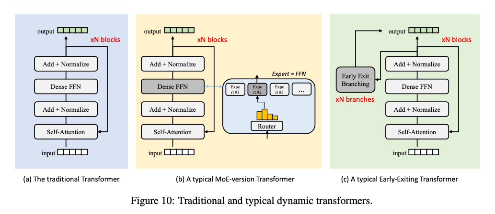
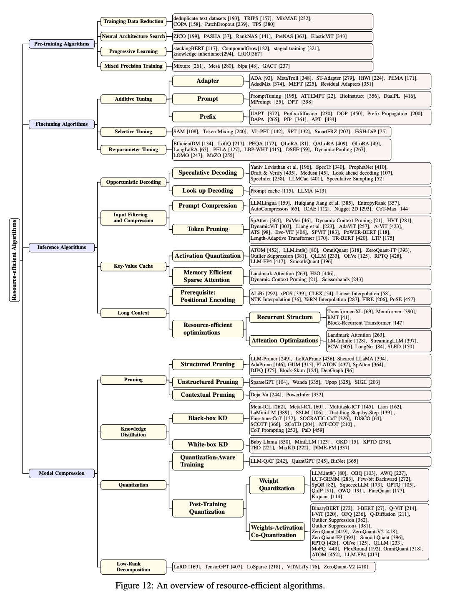
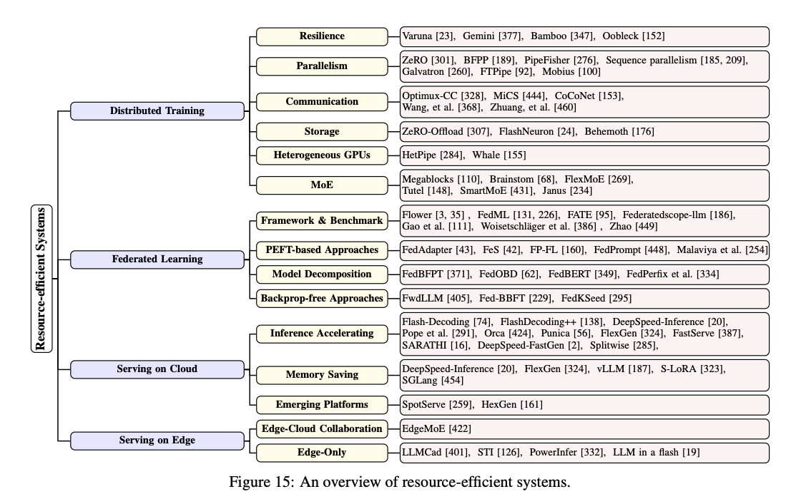

이 survey는 LLM, ViTs, Diffusion Model 및 LLM 기반다중 모델과 같은 대형 기초 모델들이 기계학습 전 과정에서 혁신을 이루고 있음을 다룹니다.
이러한 모델이 제공하는 다재다능성과 성능의 발전은 하드웨어 자원 측면에서 상당한 비용을 초래합니다.
이러한 대형 모델의 성장과 환경적으로 지속 가능한 방안을 지원하기 위해, 자원 효율적인 전략 개발에 상당한 초점이 맞춰졌습니다. 
이 연구는 이러한 연구의 중요성을 강조하며, 알고리즘적 및 시스템적 측면을 모두 검토합니다.
모델의 아키텍처, 학습, 서빙 알고리즘, 실용적 시스템 설계 및 구현에 이르는 다양한 주제를 포괄하여 귀중한 통찰력을 제공합니다.

[Paper Link](https://arxiv.org/pdf/2401.08092)  
[Code Link](https://github.com/UbiquitousLearning/Efficient_Foundation_Model_Survey)  

## Introduction

GPT 같은 대형 LLM, ViTs, Latent Diffusion Models(LDMs), CLIP 등의 모델들은 더 많은 데이터와 매개변수를 바탕으로 성능을 확장할 수 있지만, 이는 막대한 자원 소모를 동반합니다.
이런 대형 기초 모델의 자원 요구로 인해 소수의 주요 업체만이 이를 훈련하고 배포할 수 있으며, 이는 데이터 프라이버스 문제를 야기합니다. 
그래서 이를 해결하기 위해, 알고리즘 최적화, 시스템 혁신 등을 통해 기초 모델의 자원 효율성을 높이기 위한 다양한 연구가 진행중입니다. 이러한 연구는 자원 소모를 줄이면서 성능을 유지하는데 중점을 둡니다.


## FOUNDATION MODEL OVERVIEW

### 1. Language Foundation Models

#### Model Architectures
- Transformer Pipeline
	- Embedding: 입력 단어를 임베딩 레이어를 통해 고차원 벡터로 변환
	- Attention 매커니즘: 입력 벡터의 다양한 부분에 가중치를 할당하여 중요한 정보를 강조
	- Layer Norm: 활성화를 안정화하고, 표준화하여 모델의 안정성 확보
	- Feed Forward Network: 각 위치별 벡터를 비 선형적으로 변환하여 복잡한 데이터 패턴을 포착
	- Multi layer train: 여러 레이어를 통한 입력 데이터의 계층적 표현 학습
	- Final Prediction: 마지막 출력을 선형 레이어로 전달하여 최종 예측 도출

- Embedding	
	- 입력 단어를 시퀀스 토큰으로 변환합니다. 주로 사용되는 토크나이저로는 WordPiece, BPE 가 있습니다.
	- Embedding Layer: 시퀀스 토큰을 벡터 시퀀스로 변환합니다. 단어 순서는 의미에 중요하므로, 위치 인코딩을 임베딩에 추가하여 순서 정보를 포함시킵니다.

- Attention
	- 시퀀스 내 단어들간의 관계를 포착하는 데 중요한 역할을 함
	- Self-Attention: 쿼리, 키, 값 쌍이 모두 동일한 입력 시퀀스에서 유도됩. 입력의 각 위치에서 다른 부분에 집중할 수 있게 함.
	- Multi-head Attention: Self-Attention의 변형으로, 다양한 표현 하위 공간에서 정보를 동시에 주목할 수 있게함. 
	- Sparse Attention: 효율성을 위해 설계
	- Multi-Query Attention: 다양한 다운스트림 작업을 위해 설계
		- 여러 쿼리에 대해 동일한 키-값 쌍을 사용하여 메모리 사용량과 계산 복잡도를 줄일 수 있습니다. 
		- 구현 예시 

```python
class MultiQueryAttention:
	def __init__(self, d_model, n_heads):
		super(MultiQueryAttention, self).__init__()
		self.d_model = d_model
		self.n_heads = n_heads
		self.d_heads = d_model // n_heads
		
		assert d_model % n_heads == 0
	
		self.query_linear = nn.Linear(d_model, d_model)
		self.key_linear = nn.Linear(d_model, d_heads)
		self.value_linear = nn.Linear(d_model, d_heads)

		self.out_linear = nn.Linear(d_heads * n_heads, d_model)

	def forward(self, x):
		
		batch_size = x.size(0)
		Q = self.query_linear(x)  # [Batch, Seq_len, d_model]
		K = self.key_linear(x)		# [Batch, seq_len, d_heads]
		V = self.value_linear(x)	# [Batch, seq_len, d_heads]
	
		Q = Q.view(batch_size, -1, self.n_heads, self.d_heads).transpose(0, 2, 1, 3) # [batch, n_heads, seq_len, d_heads]
		K = K.unsqueeze(1).repeat(1, self.n_heads, 1, 1)
		V = V.unsqueeze(1).repeat(1, self.n_heads, 1, 1)

		scores = torch.bmm(Q, K.transpose(-2, -1)) / torch.sqrt(self.d_heads)
		attn = nn.Softmax(scores, dim=-1)
		context = torch.bmm(attn, V)
		return context
```

- Encoder-Decoder Architecture
	- Encoder
		- 셀프어텐션: 입력 시퀀스를 셀프 어텐션 매커니즘을 통해 처리하여 입력 시퀀스의 각 부분에 가중치를 할당하여 정보를 강조
		- 입력 데이터 내 복잡한 패턴과 의존성을 이해하는 데 필수적 
	- Decoder: 출력 시퀀스를 생성합니다.
		- 셀프 어텐션: 이미 생성된 출력 내 관계를 이해
		- 크로스 어텐션: 인코더 출력과, 디코더 출력간의 관련 정보를 추출
		- Auto Regressive: 출력 토큰을 순차적으로 생성하며, 각 토큰의 생성은 이전 생성된 토큰에 의존


- Auto-Regressive Decoding and KV Cache
  - Auto-Regressive Decoding
    - 디코더 함수는 입력 토큰 시퀀스 X = {x1, x2, ..., xi}를 바탕으로 새로운 토큰 x_i+1을 추론합니다.
    - 새로 추론된 x_i+1을 시퀀스 X에 추가하고, 이를 다음 추론 단계에 사용합니다. 
    - 각 토큰의 생성은 이전에 생성된 토큰에 의존하여 순차적으로 이루어집니다. 
  - Key-Value Cache
    - 어텐션 매커니즘의 중간 상태를 각 단계에서 저장하여 효율성을 높입니다. 
    - 이전 단계에서 처리된 토큰의 재계산을 방지하고 메모리 사용량을 줄입니다.


#### Representative Models and Downstream Tasks
- Encoder-Only FMs
  - BERT
    - 인코더 전용 트랜스포머 모델
    - 훈련: 양방향 마스킹 언어 모델링
  - DistillBERT
    - BERT의 축소판 (40% 작고, 60% 빠름)
    - BERT의 언어 이해 능력의 97%가 유지
  - RoBERTa:
    - BERT의 최적화
    - 더 큰 데이터 코퍼스, 더 큰 배치 사용
  - Sentence-BERT
    - 의미 있는 문장 임베딩 생성
    - 문장 임베딩을 비교하는 모델 (코사인 유사도)

- Encoder-Decoder FMs
  - T5
    - 인코더-디코더 아키텍처
    - C4데이터에서 자기지도 학습
  - BART
    - 노이징 오토인코더 
    - 텍스트에 임의의 노이즈를 추가하고 원본 텍스트를 복원하는 학습 수행

- Decoder-Only FMs
  - GPT 시리즈 
    - 디코더 전용 아키텍처
    - 비지도 학습 
    - GPT-1: 1억 1천 7백만 개의 매개변수, 인터넷 텍스트로 사전 학습
    - GPT-2: 1.5B 개의 매개변수, WebText 데이터셋 사용
    - GPT-3: 175B 개의 매개변수, 대규모 모델로 제로샷 성능 뛰어남
  - LLaMA: 사람의 피드백을 통한 지시 조정
  - GLM: 2D 위치 인코딩 추가
  - PaLM: 6144 TPU v4 칩에서 학습, 모델 규모가 소수 학습에 미치는 영향 연구

-  Speech FMs
  - Wav2Vec 2.0
    - 라벨이 없는 데이터셋에서 강력한 음성 표현 획득
  - HuBERT
    - 자기지도 학습을 위한 transformer 아키텍처
  - Whisper
    - 68만 시간의 다국어 및 다중 작업 지도 데이터로 학습
    - 모델 구조
      - CNN 기반 전처리 모듈
        - 입력 음성 데이터를 전처리하여 로그 멜 스펙트로그램으로 변환하여 시간-주파수 도메인에서의 특징을 추출
        - 이를 입력으로 받아 여러 conv 1D layer를 통해 특징 벡터를 추출합니다.
      - Transformer 인코더, 디코더 
        - 위에서 추출한 특징 벡터를 입력으로 받아 더 높은 수준의 표현을 학습하고 최종 예측을 생성 
    
#### Cost Analysis

- embedding component
  - 저장 비용: 전체 저장비용의 25%
  - 계산 비용: 추론 시에는 룩업 테이블로 작동하여 최소한의 계산 비용만 소요
- FFN (Fully Connected Feedforward Network)
  - 계산 비용: 가장 높은 계산 비용 차지. 각 FFN 블록에 두개의 Fully connected layer가 포함되어 있기 때문
  - 문제점: 계산 복잡도가 시퀀스 길이에 대해서는 선형적이지만, 모델 차원에 대해 이차적으로 증가 
  - 계산 복잡도: O(TD^2) (T: 시퀀스 길이, D: 모델의 은닉 상태 차원)
- Head
  - 분류 작업: BERT 와 같은 모델에서는 Softmax 함수를 사용한 분류 레이어
  - 생성 작업: GPT, T5 같은 모델에서 선형 레이어로 작동 
  - 크기: 어휘 크기에 비례 [hidden_size, vocab_size]
- Attention 매커니즘
  - 계산 복잡도: O(T^2D) (T: 시퀀스 길이, D: 모델의 은닉 상태 차원)
  - 문제점: 입력 시퀀스 내 모든 위치 쌍에 대해 어텐션 점수를 계산하는 데서 이차 복잡성 발생
  - 효율성: 긴 시퀀스를 처리하는 데 있어 계산 및 추론 효율성에 영향을 미침
- 디코더의 Attention 매커니즘
  - Auto-Regressive 디코딩: 각 토큰의 생성이 이전 토큰에 의존하여 계산 요구 증가
  - KV Cache: 재사용으로 계산 비용을 줄일 수 있지만, 추가 메모리 요구 발생
  - 메모리 요구량 계산: O (B × S × D × L × 2 × 4) (B: 배치 크기, S: 시퀀스 길이, D: 은닉 차원, L: 디코더 레이어 수, 2: key와 value, 4: byte size of single precision float)
    - single precision floating point
      - 32 (2^5) 비트로 실수 표현 -> 8 bit = 1 byte -> 4 byte

- 음성 처리에 대한 고려 사항
  - CNN 인코더 블록
    - 초기 CNN 레이어가 상당한 계산 능력을 요구하며, 각 입력 토큰에 대해 많은 계산 필요

	
### 2. Vision Foundation Models

#### Model Architecture
Vision Transformer(ViT)는 Transformer 모델을 활용한 컴퓨터 비전 분야의 대표적인 모델입니다. ViT는 자연어 처리 모델인 BERT에서 영감을 받았으며, BERT처럼 인코더만 사용하는 구조입니다. ViT의 주요 작동 방식을 요약하면 다음과 같습니다:

1. **이미지 분할**: 입력 이미지(RGB 이미지, 크기 3×224×224)를 고정 크기 패치(16×16 픽셀)로 분할합니다. 이 과정은 Convolutional Embedding Layer를 통해 이루어지며, 14×14 개의 패치로 분할됩니다.
   
2. **토큰화 및 임베딩**: 분할된 패치들은 토큰으로 취급되며, 각 토큰에 위치 정보를 포함하는 포지셔널 임베딩이 추가됩니다. 또한, 분류 작업을 위해 추가적인 학습 가능한 분류 토큰([CLS])이 토큰 시퀀스에 추가됩니다.

3. **Transformer 인코더**: 이 토큰들은 표준 Transformer 인코더에 입력됩니다. Transformer 인코더는 매우 계산 집약적이며, 이미지 분할 및 임베딩 과정의 연산 비용은 전체의 약 5% 미만으로 적습니다.

4. **다운스트림 작업**: Transformer 인코더에서 생성된 히든 상태는 최종적으로 분류, 탐지, 분할 등의 다양한 다운스트림 작업에 맞게 다른 헤드로 입력됩니다.

ViT의 이 과정은 이미지의 각 패치를 일종의 "단어"로 처리하여 Transformer 모델로 이미지의 특징을 학습하는 방식입니다.

#### Representative Models and Downstream Tasks

**1. 인코더-전용 모델**
- **Vision Transformer (ViT)**: BERT와 비슷한 인코더만 사용하는 구조. ImageNet-21k 데이터셋에서 대규모로 감독 및 자가 지도 학습을 수행. 높은 정확도와 확장성을 보이지만, 전통적인 CNN보다 많은 훈련 데이터가 필요.
- **DeiT**: ViT의 데이터 효율성을 높이기 위해 증류 기법을 사용한 사전 훈련.
- **BEiT**: 손상된 이미지 패치에서 원래의 비주얼 토큰을 복원하는 방식으로 자가 지도 학습을 강화.
- **MAE**: 인코더 훈련을 위해 경량 디코더를 도입하여 마스크된 패치를 재구성. 대부분의 패치를 마스킹(80%까지)하여 비용 효율적인 훈련을 가능하게 함.
- **YOLOS**: ViT 기반의 객체 탐지 모델로, 중간 크기의 ImageNet-1k에서 사전 훈련된 ViT를 COCO 객체 탐지 벤치마크에 적용.
- **ViTDet**: 계층적 구조 없이 원래 ViT 아키텍처를 객체 탐지에 맞게 미세 조정.
- **Swin Transformer**: 어텐션 메커니즘을 최적화한 계층적 ViT 모델로, 이동 창을 사용하여 표현을 계산.
- **DINOv2**: 10억 개의 파라미터를 가진 ViT 모델을 훈련하고, 이를 소형 모델 세트로 증류하여 OpenCLIP보다 뛰어난 성능을 보임.

**2. 인코더-디코더 모델**
- **DETR**: CNN 백본과 인코더-디코더 트랜스포머로 구성된 객체 탐지 모델. 객체 탐지, 인스턴스 세그멘테이션 및 파노픽 세그멘테이션을 지원.
- **SegFormer**: 트랜스포머와 경량 다층 퍼셉트론(MLP) 디코더를 결합한 의미적 세그멘테이션 모델.
- **LVM**: 이미지 시퀀스 모델링을 통해 언어 데이터 없이 순수한 비주얼 접근 방식으로 효과적인 학습을 달성.

이러한 모델들은 트랜스포머 기반의 구조를 활용하여 컴퓨터 비전 분야에서 다양한 작업(분류, 탐지, 세그멘테이션 등)을 수행하며, 각 모델은 특정한 데이터 효율성 및 성능 향상 기법을 도입하여 발전하고 있습니다.

#### Cost Analysis
- ViT의 구조는 BERT와 유사하기 때문에 자원 소비도 유사합니다.
- 언어모델 BERT와 달리 비전 모델은 일반적으로 고정 길이를 사용합니다.
- 계산 병목: ViT의 주요 병목 지점은 FFN과 어텐션 매커니즘에 있습니다. 

### 3. Multimodal Foundation Models
다중 모달리티는 텍스트, 이미지 등 여러 유형의 데이터를 결합하여, 이해, 번역 및 생성하는 기술입니다.

- 두 가지 연구 방향이 있습니다.
	- 서로 다른 모달리티의 데이터를 같은 잠재 공간에 인코딩
      - 주로 트랜스포머 인코더를 사용하여 서로 다른 모달리티 간의 거리를 최소화 함 
	- 서로 다른 모달리티의 데이터를 생성 
      - 텍스트를 기반으로 이미지를 생성
      - 주로 트랜스포머 디코더를 사용

#### Key Architectures

- 여러 인코더 사용
  - 각 모달리티에 대해 별도의 트랜스포머 인코더 사용
  - 각 데이터를 정규화된 고정 차원의 임베딩으로 인코딩하고, 모달리티간 거리를 최소화
- 텍스트 생성 및 이미지 생성
  - 텍스트 생성
    - 순수 텍스트 데이터로 훈련된 LLM 사용
    - 디코더 전용 아키텍처 채택
  - 이미지 생성
    - Diffusion Model 사용하여 고품질 이미지 생성 
    - 이미지에 노이즈를 추가하고, 추론 단계에서 노이즈를 제거하고 고품질 이미지를 생성
    - 구성: 이미지 인코더/디코더와 디노이징 네트워크
- 이미지 인코더/디코더
  - 이미지 인코더는 이미지를 잠재표현으로 압축
  - 디코더는 잠재표현을 고해상도 이미지로 복원
  - VAE 
    - 인코더와 디코더로 구성
    - 재구성 손실 및 KLD 최소화
  - VQ-VAE
    - 벡터 양자화 레이어를 사용하여 각 픽셀을 가장 가까운 코드북 벡터로 양자화합니다.
- Denoising 네트워크 
  - 이미지의 노이즈를 잠재적으로 제거
  - U-NET 구조 사용
- Fusion Decoder
  - 이미지와 연관된 텍스트 프롬프트를 결합하여 이해력 향상
  - 이미지와 텍스트 표현을 공동으로 처리 

#### Representative Models and Downstream Tasks

**다중 인코더 기반 모델**
- **CLIP, ALBEF, ALIGN**: 텍스트를 통해 이미지 표현을 학습하고자 하는 초기 연구 모델들입니다. 이 모델들은 이미지와 텍스트 인코더의 성능, 그리고 이미지-텍스트 페어 데이터의 양과 질에 의해 성능이 제한됩니다.
- **ImageBind, LanguageBind**: 다양한 중간 모달리티를 사용하여 여러 소스의 표현을 중간 모달의 특징 공간으로 매핑하는 모델들입니다. 그러나 인코더의 한계로 인해 성능에 제약이 있습니다.

**인코더-디코더 기반 모델**
1. **대형 인코더 기반 모델**:
   - **PandaGPT**: 여러 단일 모달리티 인코더를 사용하여 입력을 중간 모달리티로 정렬한 후 대형 모델로 생성합니다.
   - **BLIP-2, MiniGPT-4**: 이미지와 텍스트 모달리티를 융합하여 교차 모달 생성.
   - **mPLUG, LLaVA**: 모달리티 변환 능력을 향상시켜 더 신뢰성 있는 결과를 생성.
   - **Flamingo, LLaMA-Adapter**: 비용을 낮추면서 고품질 다중 모달 출력을 생성하도록 대형 모델 튜닝.
   - **PaLM-E, HuggingGPT**: 인공지능 에이전트를 설계하여 복잡한 작업을 수행하는 모델들.

2. **인코더-확산 기반 모델**:
   - **Stable Diffusion**: 노이즈를 점진적으로 제거하여 고품질 이미지를 생성. 텍스트-이미지 생성, 이미지 보완, 이미지 편집, 이미지 초해상도 등 다양한 작업에 사용됩니다.
   - **Consistency Models**: 빠른 단일 단계 생성이 가능하며, 이미지 보완, 색채화, 초해상도 등 다양한 작업을 수행할 수 있습니다.
   - **DALL-E**: 텍스트 설명을 기반으로 다양한 이미지를 생성.
   - **Any-to-Any 생성 모델**:
     - **CoDi**: 다양한 입력 조합으로부터 언어, 이미지, 비디오, 오디오 등의 출력 모달리티를 생성.
     - **NExT-GPT**: 텍스트, 이미지, 비디오, 오디오를 포함한 다양한 모달리티의 입력을 인식하고 출력 생성.

3. **인코더-퓨전 디코더 기반 모델**:
   - **UNITER**: 초기 다중 모달리티 설정에서 이미지와 텍스트를 융합하여 공동 특징을 얻는 모델.
   - **FLAVA, CoCa, GLIP**: 디코더를 사용하여 이미지와 텍스트 표현을 융합 및 정렬하여 다중 모달 추론을 향상.
   - **SAM**: 텍스트 프롬프트만으로 이미지를 자동으로 분할하는 모델.

이 요약은 다양한 다중 모달리티 모델과 그들이 어떻게 다른 모달리티의 데이터를 처리하고 생성하는지를 쉽게 이해할 수 있도록 돕습니다. 각 모델의 특성과 사용 사례를 간단히 설명하여 다중 모달리티 연구의 핵심을 파악할 수 있습니다.

#### Cost Analysis

**다중 인코더 모듈 (Multi-Encoder Module)**:
- **역할**: 다양한 모달리티(이미지, 텍스트, 오디오 등)를 통합된 의미 공간으로 정렬합니다.
- **주요 구성 요소**:
  - **이미지 인코더**: 가장 많은 자원을 사용 (0.63B 파라미터, 2.4G 메모리, 167.59 GFLOPs).
  - **텍스트 인코더, 오디오 인코더, IMU 인코더**: 각기 다른 모달리티를 인코딩.
- **평균 자원 소모**: 0.27B 파라미터, 1.1G 메모리, 65.9 GFLOPs.

**디코더 모듈 (Decoder Module)**:
디코더 모듈은 대형 모델(Large FMs), 확산 모델(Diffusion Module), FD (Fusion Decoder) 모듈로 구성됩니다.

1. **대형 모델 모듈 (Large FMs Module)**:
   - **역할**: 다양한 모달리티로부터 정렬된 입력을 받아 자동회귀 방식으로 데이터를 생성.
   - **자원 소모 예시**: Vicuna-7B 모델 (7B 파라미터, 14G 메모리, 312 GFLOPs).

2. **확산 모델 모듈 (Diffusion Module)**:
   - **역할**: 고품질 이미지를 생성.
   - **대표 예시**: Stable Diffusion 2.1
     - **U-Net**: 이미지 잠재 공간에서 노이즈를 예측하고 제거 (865M 파라미터, 759G FLOPs).
     - **VAE**: 이미지를 잠재 공간으로 인코딩 및 노이즈 제거된 잠재 벡터를 디코딩 (83M 파라미터, 4T FLOPs).
     - **CLIP**: 텍스트 인코딩 (289M 파라미터, 289M FLOPs).

3. **FD 모듈 (Fusion Decoder Module)**:
   - **역할**: 이미지와 텍스트 표현을 융합하여 더 나은 다중 모달리티 추론을 수행.
   - **자원 소모**: ViT와 유사한 자원 소비 및 계산 병목.

이 요약은 다중 인코더 및 디코더 모듈이 다양한 모달리티의 데이터를 어떻게 처리하고 생성하는지를 쉽게 이해할 수 있도록 설명합니다. 각 모듈의 구성 요소와 그들이 사용하는 자원에 대해 간략히 설명하여 전체적인 구조를 파악하는 데 도움이 됩니다.

## RESOURCE-EFFICIENT ARCHITECTURES

  

대형 모델의 자원 효율성을 높이기 위해 주로 다루는 요소는 Attention Mechanisms과 디코더(Decoders)입니다. 이러한 요소들은 계산 및 메모리 비용을 줄이는 것을 목표로 합니다.

### 1.  Efficient Attention

 

- 문제점: 어텐션 메커니즘은 시퀀스 길이에 따라 시간 복잡도가 기하급수적으로 증가합니다. O(T^2D)
- 목표: 이 복잡도를 선형으로 줄이거나 대안적인 방법을 찾는 것입니다.
- 종류
  - Sparse Attention
    - 그래프 희소화에서 영감을 받아 희소 주의 행렬을 구축하는 것입니다. 이는 완전한 셀프 어텐션 메커니즘의 장점을 유지하면서도 내부 곱셈의 수를 줄이는 것을 목표로 합니다.
    - 주요 접근 방식
      - Longformer, ETC, BIGBIRD: 긴 시퀀스 데이터를 처리하기 위해, 로컬 윈도우 어텐션을 도입하여 복잡도를 선형으로 줄입니다. 또한 특정 토큰에 글로벌 어텐션을 도입하여 중요한 정보가 손실 되지 않도록 합니다. 
      - HEPOS: 각 어텐션 헤드가 입력 시퀀스의 특정 부분에 집중하도록 하여 효율적인 인코더-디코더 처리를 가능하게 합니다.
      - MATE: 테이블 데이터를 효율적으로 처리하기 위해 어텐션을 다중 뷰 형식으로 변환하여 테이블의 행 또는 열을 효율적으로 처리합니다.
      - TDANet: 인간의 주의 매커니즘을 모방하여, 상위 레벨에서 전반적인 정보를 파악하고, 하위 레벨에서 세부 정보를 집중적으로 처리하는 방식입니다. 이를 통해 가장 관련성 높은 정보에 선택적으로 집중합니다.
      - ALBERT: BERT의 경량화 버전으로, 계층 간 파라미터 공유를 통해 파라미터 수를 89% 줄이면서도 정확성을 보장합니다.
  - Approximate Attention
    - 자가 주의 행렬의 저랭크 근사 및 자가 주의 메커니즘의 혁신적인 재구성을 포함합니다. 이러한 접근 방식은 N × N 행렬의 직접적인 계산을 피하여 계산 복잡도를 줄이고 효율성을 높입니다.
    - 주요 접근 방식:
      - Linformer: 입력 시퀀스를 더 작은 저랭크 공간으로 투영하여, 셀프 어텐션 계산에 필요한 메모리와 연산량을 줄입니다. 
      - Reformer: 기존의 dot-product 주의를 locality-sensitive hashing(LSH)으로 대체합니다. 입력 시퀀스를 해싱하여 유사한 해시 값을 가진 토큰끼리만 상호작용하도록 하여, 셀프 어텐션 메커니즘을 가속화 할 수 있습니다. 
      - Katharopoulos et al.: softmax dot production을 사용하는 대신 커널 함수를 사용하여 내적으로 근사하는 방법을 사용합니다. 
      - Polysketchforme: 다항 함수와 스케치 기술(대규모 데이터를 효율적으로 처리하기 위해 근사값을 사용하는 확률적 데이터 구조)을 사용하여 소프트맥스 출력을 근사화합니다.
      - Mega: 단일 헤드 게이트 주의 메커니즘에 지수 이동 평균을 통합하여 위치 의존적인 지역 종속성을 포함합니다.
      - Deformable Attention: 특정 토큰이 고정된 위치에만 주목하는 것이 아니라, 위치를 유연하게 변화시킨으로써, 전통적인 밀집 주의 방식에 비해 성능을 개선합니다.
      - CrossViT: ViT는 모든 패치가 동일한 크기를 가져야 하는 단점이 있습니다. 이를 해결하기 위해 서로 다른 크기의 패치를 사용하여 더 풍부한 정보를 추출하였습니다. 그리고 작은 패치, 큰 패치 간 선형 크로스 주의 메커니즘을 도입합니다.
  - Attention-Free Approaches
    - 전통적인 Transformer 모델의 주의(attention) 메커니즘을 대체하는 혁신적인 아키텍처를 제안하는 접근법입니다.
    - 주요 접근 방식:
      - Hyena: 암묵적으로 매개변수화된 긴 컨볼루션(long convolution)과 데이터로 제어되는 게이팅(gating)을 교차로 배치하는 아키텍처.
      - SSMs: 주의 메커니즘을 State Space Model로 대체하는 접근법으로 시스템의 상태를 시간에 따라 모델링합니다. 
      - Recurrent-Style Transformers (RMT): 주의 메커니즘을 순환 신경망(RNN)으로 대체하여 선형 복잡성을 달성하는 아키텍처.
      - RWKV: Transformer의 병렬 학습 효율성과 RNN의 효과적인 추론 능력을 결합한 모델.
      - RetNet: 다중 헤드 주의 메커니즘을 다중 스케일 유지 메커니즘(multi-scale retention mechanism)으로 대체한 아키텍처. 입력 시퀀스의 중요한 정보를 다양한 스케일에서 유지하여, attention 메커니즘 없이도 정보를 효과적으로 처리합니다. 

### 2. Dynamic Neural Network

 

#### Mixture of Expert
MoE는 대규모 파라미터 집합을 가진 모델을 효율적으로 훈련하고 배포하기 위한 sparse한 접근 방식입니다. 
모델의 특정 하위 네트워크(전문가)만 활성화하여 입력에 따라 다른 전문가를 선택하는 방식으로 학습하는 방법입니다. 이는 특히 대규모 모델에서 계산 효율성을 극대화하고 성능을 향상시키기 위해 사용됩니다. 

예를 들어, 입력 데이터가 모델에 주어지면 MoE의 gating network는 활성화할 전문가를 선택합닏. 이때 각 전문가의 가중치를 계산하는데, 이 가중치는 전문가의 출력에 대한 가중합을 결정합니다. 
특정 입력에 대해 top-k개의 전문가만 활성화 되도록 선택할 수 있습니다.

모델은 여러 전문가로 구성된 하위 네트워크가 존재합니다. 각 전문가는 독립적으로 학습된 네트워크로, 입력에 대해 고유한 출력을 생성합니다.

- Switch Transformer
	- 스위치 라우팅 알고리즘을 도입
	- 성능: 최대 1 trillion 개의 파라미터와 2048 experts를 관리할 수 있는 확장성
- GLaM (General Language Model)
- V-MoE: ViT의 sparse MoE 버전
- LIMoE
- Mistral8x7B
- MoEfication
- SparseUpcycling
- FFF(Fast Feed-Forward)
	- 입력 벡터 x를 여러개의 작은 부분으로 분할 
	- 각 분할된 입력 벡터에 해당하는 분할된 피드포워드 레이어를 활성화하고 이를 병렬로 처리하고, 출력들을 합성하여 최종 출력을 만듭니다. 

#### Early Existing

조기 종료 기법은 모델은 높은 확신도를 얻거나 자원 제약을 만났을 때 계산을 조기 종료하여 효율성을 높이는 전략입니다. 

예를들어 각 레이어마다 조기 종료 지점을 추가합니다. 각 레이어에 내부 classifier를 두어, 해당 레이어의 예측 확률을 계산합니다. 각 레이어마다 조기 종료할 확률을 설정하고, 예측 확률이 일정 threshold 이상일 때, 조기종료를 수행합니다. 
이때, 내부 classifier는 최종 예측 결과로 사용할 수 있는 레이어 입니다. 

1. **He et al. [130]**: 표준 트랜스포머 블록을 단순화하면서도 성능을 유지하는 효율적인 아키텍처를 연구했습니다. 잔여 연결, layer 정규화 및 특정 매개변수를 제거하고, MLP 하위 블록을 직렬화합니다.
2. **M4 [427]**: 다중 경로 작업 실행 프레임워크를 도입하여, 작업의 요구에 따라 최적의 경로를 선택할 수 있게 하여 효율성을 극대화합니다. 
3. **FREE [25]**: 현재 토큰의 디코딩을 이전에 처리된 조기 종료 토큰과 동기화하는 shallow-deep 모듈을 제안하며, 적응형 임계값 추정기를 사용하여 적절한 조기 종료 신뢰 수준을 결정합니다.
4. **SkipDecode [78]**: 배치 추론 및 KV 캐싱을 위해 설계되어 각 시퀀스 위치에서 배치의 각 토큰에 대해 고유한 종료 지점을 설정합니다.
5. **PABEE [455]**: 각 층에 내부 분류기를 통합하여 예측이 일정 단계 동안 안정화되면 추론 과정을 중단하여 층 사용을 줄이고 빠른 예측을 가능하게 합니다.
6. **DeeBERT [400]**: BERT의 추론 효율성을 높이기 위해 조기 종료 지점을 도입하여, 중간 층에서 종료할 수 있도록 하여 계산 요구를 줄이고 추론을 가속화합니다.
7. **Bakhtiarnia et al. [29]**: ViTs 백본에 적합한 7가지 독특한 아키텍처 디자인을 제안하여 동적 추론에 적합한 조기 종료 가지를 설계했습니다.
8. **LGViT [402]**: 다양한 종료 헤드(예: 지역 인식 및 전역 집계 헤드)를 특징으로 하는 일반 ViTs에 맞춘 조기 종료 프레임워크를 제시하여 효율성과 정확성의 균형을 맞춥니다. 이 접근법은 약 1.8배의 속도 증가와 경쟁력 있는 성능을 달성합니다.

### 3. Diffusion-specific Optimization

확산 모델을 통해 이미지를 생성하는 과정은 일반적으로 많은 디노이징 단계를 거치는 반복적인 과정을 포함합니다. 최근 연구는 디노이징 과정을 가속화하고, 이미지 생성 시 자원요구를 줄이는 데 초점을 맞추고 있으며, 이는 크게 세가지 주요 범주로 나눌 수 있습니다.
- 효율적 샘플링
- latent space 에서의 확산
- 확산 아키텍처 변형

#### Efficient Sampling

확산 모델의 디노이징 과정을 향상시키면서 샘플 품질을 유지하거나 개선하기 위해 많은 연구가 이루어졌습니다. 이 연구들은 자원과 시간 효율성을 강조합니다.

예를 들어, non-Markovian 적이고 deterministic한 샘플링 방식을 도입하여 샘플링 속도를 가속화할 수 있습니다.
forward diffusion process는 기존의 Denoising Diffusion Probabilistic Model과 동일하게 원본 데이터 x_0에서 시작하여, 각 시간 단계 t마다 노이즈를 추가하여 x_t를 생성합니다.
reverse diffusion process에서는 각 시간 단계 t에서 노이즈를 제거하여 x_t에서 x_t-1로 변환합니다. 

```text
DDPM은 확률적으로 분포에 따라 모델링 됩니다.
p(x_t-1 | x_t) = N(x_t-1; m(x_t, t), var(t)I)      --- m(x_t, t), var(t): 모델이 t단계에 예측한 평균과 분산
전형적인 마코브체인 방식으로, 각 단계는 바로 이전 단계에만 의존합니다. 

결정론적 역확산 과정은 결정론적 수식에 따라 명확하게 계산됩니다. 
x_t-1 = sqrt(a_t-1) * (x_t - sqrt(1-a_t) * noise(x_t)) / sqrt(a_t) + sqrt(1-a_t-1) * noise(x_t) --- a는 각 단계에서의 스케일링 계수 입니다. 
비 마코브적 방식으로 각 단계는 여러 단계의 상관 관계를 고려할 수 있습니다. 계산이 효율적으로, 고품질 샘플을 더 적은 단계로 생성할 수 있게 합니다. 
```

- **Nichol et al. [268]**: 전통적인 DDPM을 개선하여 자원 효율성을 높였습니다. 이 모델은 로그-가능성 경쟁에서 우위를 점할 뿐만 아니라 샘플 품질도 향상시킵니다. 이는 역확산 과정의 분산을 학습하고 하이브리드 훈련 목표를 사용하여 달성됩니다. 결과적으로, 더 적은 전방 패스를 필요로 하며 모델 용량과 계산 능력 측면에서 향상된 확장성을 보여줍니다.
  
- **DDIM [329]**: 비마코프적이고 결정론적인 샘플링 접근 방식을 도입하여 확산 모델의 지연 효율성을 크게 개선했습니다. 이 ODE(상미분방정식) 변형은 전통적인 DDPM보다 더 빠른 샘플링을 가능하게 하여 샘플 품질을 유지하면서도 생성 과정을 가속화합니다.

- **PNDM [235]**: 매니폴드 상에서의 미분 방정식을 해결하는 방식으로 확산 과정을 처리하여 DDPM의 샘플 생성 효율성을 높였습니다. 이 방법은 높은 속도의 샘플링이 필요한 시나리오에서 기존의 가속 기술, 특히 DDIM보다 우수하며 샘플의 충실도를 유지합니다.

- **DPM-Solver [245]**: 확산 모델의 샘플링 효율성을 개선하는 데 중점을 둡니다. 이 방법은 확산 ODE의 준선형 구조를 활용하는 고차 해석기를 사용하여 빠르고 고품질의 샘플 생성을 촉진합니다. DPM-Solver는 10-20회의 디노이징 단계로 이 성과를 달성하여 샘플 생성의 지연 효율성을 강조합니다.

#### Diffusion in Latent Space

전통적인 확산 모델에서는 이미지의 픽셀 공간에서 작업이 수행되지만, 이는 고해상도 이미지의 경우 상당한 계산 요구량과 메모리 요구사항으로 인해 비효율적입니다. 이러한 문제를 해결하기 위해, 연구자들은 VAE(Variational Autoencoders)를 통해 잠재 공간에서 확산 과정을 수행하는 방향으로 전환을 제안했습니다. 이는 메모리 효율성을 크게 향상시켜, 적은 계산 자원으로 고해상도 이미지를 생성할 수 있게 합니다.

예를들어 Latent Diffusion Model (LDM)의 학습 과정은 다음과 같습니다. VAE 인코더를 사용하여 원본 이미지를 Latent vector z로 변환합니다. 그리고 latent vector z를 다시 원본 이미지로 복원하는 디코더를 학습합니다.
그리고 잠재벡터 z에 점진적으로 노이즈를 추가하여, 여러 단계 t에서의 상태 z_t를 생성합니다. 
> z_t = sqrt(a_t)*z_t + sqrt(1-a_t) * noise

reverse diffusion process에서는 각 시간 단계 t에서 z_t를 z_t-1 로 변환하는 모델을 학습합니다.
텍스트에 대한 조건을 위해 text 에 대해 텍스트 인코더로 텍스트 벡터 c를 추출한 후 z_t와 c간의 크로스 어텐션 레이어를 통해 학습합니다. 
그리고 최종 잠재벡터 z_0를 얻으면 디코더를 사용하여 이미지를 생성합니다. 

#### Diffusion Architecture Variants

효율적인 모델 아키텍처를 채택하여 확산 모델의 성능을 최적화하는 방법이 연구되었습니다. 이 전략은 구조적 프레임워크를 개선하여 계산 복잡성과 자원 소비를 줄이면서 효과적인 처리 능력을 달성합니다. 주요 연구 사례는 다음과 같습니다.
예를 들어 Step Distillation 방법을 사용하여 시간을 효율적으로 줄일 수 있습니다.
기존의 디노이징 과정은 각 시간 단계에서 독립적으로 노이즈르 제거하는 방식으로 이루어집니다. 각 단계에서 계산된 결과는 다음 단계로 전달 되지만, 중간 결과를 특별히 활용하지 않습니다. step distillation은 각 단계에서 계산된 중간 결과를 메모리에 저장하고 효율적으로 활용하여 다음 단계 계산에서 중복 계산을 제거하고 최적화하는 방식을 취합니다.


1. **SnapFusion [215]**:
   - **목적**: 모바일 장치에서 텍스트-이미지 확산 모델의 최적화
   - **특징**: 자원 효율적인 네트워크 아키텍처
   - **성과**: 기존 모델의 계산 및 지연 시간 제한을 극복하며, 재설계된 네트워크 아키텍처와 향상된 단계 증류(step distillation)를 통해 512×512 고품질 이미지를 2초 이내에 생성
   - **결과**: Stable Diffusion보다 FID 및 CLIP 점수가 우수하고, 더 적은 디노이징 단계로 고품질 이미지 생성

2. **ScaleCrafter [135]**:
   - **목적**: 사전 훈련된 확산 모델을 사용하여 초고해상도 이미지 생성
   - **특징**: "재-디얼레이션(re-dilation)", "분산 합성곱(dispersed convolution)", "노이즈 감쇠 분류자-프리 가이던스(noise-damped classifier-free guidance)"와 같은 기술을 포함한 혁신적이고 자원 효율적인 네트워크 디자인
     - re-dilation: 기존의 dilated convolution을 여러단계에 걸쳐 반복 적용하여 모델의 수용 영역을 점진적으로 넓히는 방식
     - dispersed convolution: 고정된 크기의 커널대신, 다양한 크기와 형태의 커널을 사용
     - noise-damped classifier-free Guidance: 확산 모델에서 텍스트-이미지 생성 과정 중 분류자를 사용하지 않고 택스트 조건을 효율적으로 반영하기 위해, 노이즈를 감쇠시키는 방식 
     - 기존은 분류자가 텍스트 조건과 이미지의 일치성을 평가
     - 이미지 생상 과정에서 노이즈를 줄여가며 텍스트 조건을 점진적으로 반영합니다. 
   - **성과**: 추가 훈련이나 최적화 없이 초고해상도 이미지 생성 가능

3. **ERNIE-ViLG [101]**:
   - **목적**: 텍스트-이미지 확산 모델에서 세밀한 텍스트 및 시각적 지식을 통합
   - **특징**: 혼합 디노이징 전문가(mechanism of mixture-of-denoising-experts) 메커니즘과 240억 매개변수로 확장된 효율적인 네트워크 아키텍처
   - **성과**: MS-COCO에서 뛰어난 zero-shot FID-30k 점수 6.75를 기록하며, 이미지 충실도 및 텍스트 관련성 크게 향상
   - **결과**: 복잡한 텍스트 프롬프트에서 속성 혼동 문제를 능숙하게 해결

### 4. ViT-specific Optimizations

CNN과 Transformer를 결합하여 다양한 비전 작업에서 뛰어난 성능을 발휘할 수 있습니다.
예를 들어 CNN을 사용하여 초기 특징을 추출하고, 이를 Transformer에 입력하는 방식이 있습니다. 또는 이미지를 작은 패치로 분할하고, 각 패치를 CNN을 통해 임베딩 벡터로 변환하는 방식이 있습니다. 
또는 CNN과 Transformer를 병렬로 결합하여 각각의 출력을 결합하거나, CNN과 Transformer를 변갈아 사용하여 다양한 수준의 특징을 학습할 수 있습니다. 

- **LeViT**는 이미지 분류를 효율적으로 수행하기 위해 설계된 하이브리드 신경망입니다.
  - **주요 특징**:
    - **하이브리드 네트워크**: 컨볼루션 레이어와 Transformer 레이어를 결합하여 픽셀 정보를 효과적으로 처리합니다.
    - **피라미드 아키텍처**: 특징의 차원을 점진적으로 줄이면서 주의(head) 수를 늘려가는 구조입니다.
    - **학습된 주의 바이어스**: ViT의 위치 임베딩을 대체하는 per-head translation-invariant attention bias를 도입하여 성능을 향상시킵니다.
      - 각 Attention Head마다 독립적으로 학습되는 고유한 바이어스를 사용하여, 입력 시퀀스의 위치정보를 효과적으로 반영
      - Attention (Q, K, V) = Softmax( QK.T/sqrt(dim) + B)V  --- B는 학습된 Bias
  - **성과**:
    - **ImageNet top-1 정확도**: 80%
    - **속도**: EfficientNet과 비교하여 CPU에서 5배 빠름

- **PoolFormer**는 MetaFormer로 불리는 ViT의 전체적인 아키텍처 디자인의 성공을 강조합니다.
  - **주요 특징**:
    - **단순한 풀링 레이어**: CNN에서 일반적으로 사용하는 풀링 레이어를 사용하여 ViT의 성능을 개선합니다.
  - **성과**:
    - **ImageNet-1K top-1 정확도**: 82.1%

- **MobileViT**는 CNN을 사용하여 더 가벼운 Transformer 아키텍처를 구축하는 아이디어를 따릅니다.
  - **주요 특징**:
    - **MobileViT 블록**: 컨볼루션과 유사한 블록을 설계하여 경량화 및 저지연 구현을 달성합니다.
    - **메모리 액세스, 병렬 처리, 플랫폼 특정 기능 고려**: FLOPs 외에도 메모리 액세스, 병렬 처리, 플랫폼 특정 기능을 최적화합니다.

  - **성과**:
    - **ImageNet-1K top-1 정확도**: 78.4%
    - **파라미터 수**: 약 600만 개

- **EfficientFormer**는 경량 CNN-Transformer 하이브리드 아키텍처를 설계하여 효율적인 온-디바이스 추론을 달성합니다.
  - **주요 특징**:
    - **경량 아키텍처**: CNN과 Transformer를 결합하여 경량화와 성능을 최적화합니다.

  - **성과**:
    - **EfficientFormer-L1**:
      - **ImageNet-1K top-1 정확도**: 79.2%
      - **추론 지연 시간**: iPhone 12에서 1.6ms (CoreML로 컴파일)
    - **MobileNetV2×1.4와 속도 동등**: 1.6ms, 74.7% top-1 정확도

- *EfficientViT**는 비선형 주의(softmax)의 높은 오버헤드와 관련된 계산 비용을 줄이기 위해 선형 주의 메커니즘을 도입합니다.
  - **주요 특징**:
    - **선형 주의 메커니즘**: 계산 비용을 줄이기 위해 softmax 대신 선형 주의 메커니즘을 사용합니다.

  - **성과**:
    - **초해상도(super-resolution) 도메인에서**: Restormer와 비교하여 최대 6.4배 속도 향상


## Resource-Efficient Algorithms



LLM은 전통적은 DNN과 다른 특성을 가지고 있으며, 큰 매개변수 집합과 Auto-regressive 한 추론을 특징으로 합니다. 이러한 특성으로 인해, 자원 효율적인 알고리즘이 많이 등장하게 되었으며, 이는 모델의 생애 주기별로 크게 네가지로 분류됩니다. 
- pretraining 알고리즘
- finetuning 알고리즘
- inference 알고리즘
- model compression

### 1. Pre-training Algorithms 
사전 훈련은 대규모 언어 모델의 효율적인 훈련을 위해 엄청난 계산 자원이 필요합니다. 예를 들어, GPT-3-175B는 3.14 × 10^23 FLOPS를 소비하고, LLaMa-70B는 170만 GPU 시간을 필요로 합니다. 따라서 계산 자원의 효율적인 활용이 중요합니다.

#### Training Data Reduction

LLM의 사전 훈련은 수 Trillion 단위의 데이터셋이 필요합니다. 더 많은 데이터는 더 많은 자원을 필요로 하므로, 데이터 중복 제거와 이미지 패치 제거 등을 통해 자원 비용을 줄이는 방법이 연구되었습니다. 

- 텍스트 데이터 중복 제거
- 이미지 패치 제거
  - TRIPS: 패치 선택 레이어를 통해 중요한 이미지 패치를 선택
  - MixMAE: 여러 이미지를 패치레벨에서 혼합하고, 마스크 심볼을 피함으로써 훈련 데이터셋 크기 감소 (각 패치가 원본 이미지의 일부분을 나타내므로 mask 심볼 사용하지 않고도 데이터 일부를 숨길 수 있음)
  - PatchDropout" 원본 이미지 패치의 일부를 무작위로 샘플링하여 토큰 시퀀스 길이를 단축 
  - TPS(Token Pruning and Substitution): 어텐션을 기반으로 토큰을 중요도를 계산해 가지치기와 보존 세트로 분류하여 학습 
    - 보존된 토큰: [토큰1: 0.9, 토큰3: 0.7, 토큰5: 0.8]
    - 가지치기된 토큰: [토큰2: 0.3, 토큰4: 0.2]
    - 토큰2 (중요도 0.3)은 보존된 토큰3 (중요도 0.7)에 할당
    - 토큰4 (중요도 0.2)은 보존된 토큰5 (중요도 0.8)에 할당
    - 보존된 토큰의 새로운 임베딩 = 기존 토큰 임베딩 + 할당된 토큰 임베딩
    - 결과적으로 토큰 시퀀스는 [토큰1', 토큰3', 토큰5']로 단축됨 

#### Neural Architecture Search
NAS는 최적의 모델 효율성과 성능을 달성하기 위해 인간의 개입 없이 자동으로 모델 구조를 설계하는 알고리즘입니다. 
- Zero-shot NAS: 모델을 실제로 훈련시키지 않고 성능을 예측.
- ZICO: Zero-shot NAS 프록시를 사용하여 컴퓨팅 자원 소비를 줄임.
- PASHA: 동적 자원 할당을 통해 NAS 속도를 높임.
- RankNAS: NAS 문제를 순위 문제로 공식화하고 이를 이진 분류 문제로 단순화.
- PreNAS: Zero-shot NAS 프록시를 사용하여 선호 아키텍처를 식별한 후, 한 번만 훈련.
- ElasticViT: 경량 ViT 모델을 자동으로 설계하는 NAS 접근법.

#### Progressive Learning

작은 모델을 먼저 훈련한 후 점진적으로 모델 크기를 키우며 훈련을 계속하는 전략입니다. 이 접근법은 이전 단계의 계산을 재사용하여, 계산 자원 사용을 최적화 할 수 있습니다.
- StackingBERT: 작은 모델의 attention 레이어를 쌓아가며 큰 모델을 훈련.
- CompoundGrow: BERT의 깊이, 너비, 입력 길이 등 여러 차원을 성장시키는 점진적 훈련 알고리즘.
- Staged Training: 작은 모델을 먼저 사전 훈련하고 점진적으로 깊이와 너비를 키우며 훈련.
- Knowledge Inheritance: 기존의 사전 훈련된 모델을 교사 모델로 활용.
- LiGO: 작은 모델의 파라미터를 큰 모델 초기화에 사용.


#### Mixed Precision Training

Mixed precision training은 반정밀도 부동소수점(half-precision floating-point)을 사용하여 단정밀도(single precision) 대신 데이터를 표현하는 방법입니다. 이를 통해 메모리 요구량을 크게 줄일 수 있으며, 가중치(weights), 활성화(activations), 그라디언트(gradients)에 필요한 저장 공간을 약 절반으로 줄일 수 있습니다.

- Mesa: 활성화 압축 훈련과 혼합 정밀도 훈련을 결합하여 활성화 메모리 사용을 최소화.
- GACT: 그라디언트의 중요도에 따라 압축 비율을 동적으로 조정하여 계산 자원과 메모리 소비를 줄임.


### 2. Finetuning Algorithms
효율적인 미세 조정(fine-tuning) 알고리즘은 사전 훈련된 대규모 모델(FM)을 다운스트림 작업에 적응시키기 위한 작업량을 줄이는 데 중점을 둡니다. 이러한 기법들은 세 가지 그룹으로 분류됩니다:
- Additive Tuning
- Selective Tuning
- Pe-Parameter Tuning

#### Additive Tuning
새로운 작업에 적응시키기 위해 추가 파라미터를 도입하고 미세 조정을 통해 높은 성능을 저비용으로 달성할 수 있습니다.

- Adapter Tuning
  - 사전 훈련된 모델의 특정 레이어에 어댑터 모듈을 도입하여 훈련 비용을 줄이는 방법입니다. 
  - 사전훈련된 백본은 고정된 상태로 유지되고 어댑터 모듈만 작업별 지식을 획득합니다. 

- Prompt Tuning
  - 사전 훈련된 모델의 파라미터를 변경하지 않고 입력 프롬프트를 조정함으로써 다양한 다운스트림작업에 모델을 맞추는 방법입니다.
  - ATTEMPT: 각 작업에 대해 학습 가능한 임베딩 벡터로 구성된 소프트 프롬프트를 생성합니다. 다중 작업 프롬프트를 결합하여 모델에 입력합니다. 모델이 결함된 프롬프트와 입력 데이터를 처리하여 다중 작업에 대한 출력을 생성합니다. 
  
- Prefix Tuning
  - 각 레이어에 학습 가능한 작업별 prefix를 도입하는 방법입니다. 사전 훈련된 모델의 파라미터는 변경하지 않고 prefix 파라미터만 업데이트하여 학습합니다.
  - 이 prefix 벡터는 입력데이터와 결합되어 처리됩니다.

#### Selective Tuning

대규모 언어모델의 대부분을 고정시키고, 소수의 파라미터만을 선택적으로 업데이트하여 새로운 작업에 대한 높은 성능을 유지하도록 하여 훈련 비용을 낮추는 방식입니다. 
- SAM(Second-Order Approximation Method): 이차 근사법을 통해 더 적은 파라미터를 튜닝하면서도 더 나은 성능 달성.
  - square(Gradient of Loss)를 통해 이차 도함수 Hessian matrix를 나타낼 수 있으며, 이는 각 파라미터의 중요도를 나타냅니다
  - 중요도가 높은 파라미터를 선택하여 튜닝함으로써, 계산 비용과 자원 소비를 줄일 수 있습니다. 
- SmartFRZ: 적응형 레이어 고정을 통해 정확도와 훈련 속도 향상.
- FiSH-DiP: 제한된 데이터로 샘플 인식 동적 희소 튜닝을 통해 일반화 향상.
  - 각 샘플에 대해 중요도를 평가하여, 중요도가 높은 샘플에 대한 파라미터 업데이트는 낮은 샘플보다 더 빈번하게 이루어집니다. 
  - 중요도가 높은 샘플을 선택하여 일부 파라미터만 선택적으로 조정합니다. 
  - 중요도는 abs(gradient of loss)로 계산할 수 있습니다. 
- Token Mixing & VL-PET: 시각-언어 작업에서 선택적 파라미터 튜닝.
- SPT: 특정 작업에 맞춘 감도 인식 파라미터 튜닝.
  - 감도 평가는 abs(gradient of loss)를 통해서 계산할 수 있으며, 이 감도를 기반으로 파라미터 예산을 할당합니다. 예산은 튜닝할 파라미터 수 등을 의미합니다.
  - 중요도가 높은 파라미터에 더 높은 예산을 할당하여, 해당 파라미터를 우선적으로 튜닝합니다. 

#### Re-parameter Tuning
대규모 모델의 미세조정을 위해 원래의 넓은 학습 공간 대신 훨씬 작은 부분 공간을 대상으로 하는 방법입니다.
이 접근 법은 low-rank 매트릭스 파라미터를 미세 조정함으로써 전체 학습 비용을 효과적으로 줄입니다. 

LoRA는 기존 파라미터 행렬을 두개의 저랭크 행렬의 곱으로 분해하여 모델의 파라미터 수를 줄입니다.
> W = AxB 

모델의 원래 파라미터는 고정된 상태로 유지되고 A,B 만을 학습합니다. 
입력 x에 대해 Wx를 계산하는 대신 ABx를 계산합니다. 

- 추가로 저랭크 행렬 업데이트시 Sparse-Aware를 적용하여, 중요하지 않는 요소는 0으로 설정하여 업데이트를 생략함으로써 계산 비용을 줄일 수 있습니다.

### 3. Inference Algorithms

#### Opportunistic Decoding

대규모 언어 모델(FMs)의 효율적인 추론을 위해 다양한 디코딩 방법이 개발되었습니다. 이들 방법은 주로 autoregressive decoding을 대체하거나 보완하여 추론 속도를 높이는 데 초점을 맞추고 있습니다.

##### **1. Speculative Decoding (추론 디코딩)**:
- **개념**: 작은 모델을 사용해 비용 효율적으로 시퀀스를 생성한 후, 큰 모델로 각 토큰을 병렬로 검증.
- **과정**: 
  1. 작은 모델 ` M_q `와 큰 모델 ` M_p `를 사용.
  2. ` M_q `로 autoregressive 방식으로 gamma개의 토큰을 디코딩.
  3. 이 토큰들을 prefix sigma에 추가하고 ` M_p `로 포워드 패스를 실행.
  4. ` M_q `와 ` M_p `의 각 토큰 위치에서 로그잇(logit)을 비교해 토큰을 수락하거나 거부.
- **효과**: 최종 디코딩 결과는 ` M_p `만 사용한 결과와 동일한 정확도를 보장.
- **성과**: T5X 모델에서 2-3배 속도 향상, 70B Chinchilla 모델에서도 유사한 속도 향상.
- **Draft & Verify**
  - **개념**: 추가 모델 없이 중간 레이어를 선택적으로 생략하여 디코딩 속도를 높임.
  - **과정**
    - Draft: 일부 레이어를 생략하여 계산량을 줄이고, 입력 시퀀스의 일부를 기반으로 초안 시퀀스를 빠르게 생성합니다. 
    - Verify: 모든 레이어를 사용하여, 초안을 세밀하게 검토하고 최종 시퀀스를 생성합니다. 
  - **성과**: Llama-2 테스트에서 1.73배 속도 향상.
- **Medusa**
   - **개념**: 비자회귀적(non-autoregressive) 디코딩 아키텍처로, 추가 모델 없이 여러 토큰을 동시에 예측.
   - **과정**
     - 모델은 여러 예측 헤드를 사전훈련하는데, 각 헤드는 시퀀스의 특정 시간 단계에 대해 독립적으로 예측할 수 있도록 훈련됩니다.
     - 입력 시퀀스를 받아 여러 헤드가 동시에 여러 토큰을 예측합니다. 각 헤드는 각 시간 단계의 예측을 담당합니다. 
   - **방법**: 여러 헤드를 사전 훈련하여 다양한 시간 단계의 토큰을 예측하고 동시에 검증.
- **Look-ahead Decoding**:
   - **개념**: 드래프트 모델이나 데이터 저장소 없이 대규모 언어 모델의 추론을 가속화.
   - **과정**
     - 미래의 토큰을 미리 예측함으로써 디코딩 단계를 줄입니다. 
     - 이를 사용하여 다음 토큰을 예측합니다. 
   - **효과**: 디코딩 단계 수를 로그(FLOPs)에 비례하여 선형적으로 감소시킴.

#### **2. Look-up Decoding**
- **개념**: autoregressive 생성 대신 텍스트 코퍼스에서 패턴을 검색하여 디코딩.
- **방법**: 자주 발생하는 텍스트 세그먼트의 attention 상태를 사전에 계산하여 저장하고, 필요한 경우 재사용.
- **예**: Prompt Cache는 GPU 기반 추론에서 8배, CPU 기반 추론에서 60배의 성능 향상을 보임.
- **LLMA(Look-up Language Model Augmentation)**
   - **개념**: 외부 텍스트를 사용하여 잠재적인 추론 결과를 검증하고 디코딩 시점과 참조 시점을 결정.
   - **과정**
     - 대규모 텍스트 코퍼스를 사전에 구축하여, 자주 발생하는 문구나 패턴을 저장합니다. 이는 모델이 디코딩 중 참조할 수 있는 외부 텍스트로 사용됩니다.
     - 디코딩 중 외부 텍스트 데이터 베이스를 참조하여 현재 시퀀스와 유사한 패턴을 검색합니다.
     - 모델은 언제 디코딩을 계속할지, 외부 텍스트를 참조할 지 결정합니다. 모델이 충분히 확실하지 않을 때는 참조하여 예측을 보강할 수 있습니다. 
     - 각 후보 토큰에 대해 외부 텍스트 데이터베이스를 병렬로 검색하고 검증합니다. 
     - 입력 후보를 여러 부분으로 나누어 병렬로 디코딩 합니다. 
   - **효과**: 계산 병렬성을 증가시켜 대규모 언어 모델에서 2배 이상의 속도 향상.
- **Skeleton-of-Thoughts**
   - **개념**: 인간의 사고와 글쓰기 과정을 모방하여 답변의 골격을 먼저 생성한 후, 골격의 각 포인트에 대해 병렬로 세부 정보를 채웁니다.

#### Input Filtering and Compression

##### 1. Prompt Compression
모델의 프롬프트를 압축하여 계산량을 효과적으로 줄이는 방법입니다. 이 접근법은 프롬프트의 의미를 유지하면서도 높은 압축 비율을 달성합니다.
예를 들어 LLMLingua는 Budget controller를 사용하여 프롬프트의 각 부분에 할당된 정보량을 평가합니다. 덜 중요한 정보를 제거하여 거친 수준의 압축을 수행합니다.
반복 과정을 통해 프롬프트를 압축합니다. 압축된 프롬프트가 원래 프론프트와 동일한 의미적 분포를 유지하도록 재 조정합니다. instruction tuning을 통해  압축된 프롬프트가 원래 프롬프트와 동일한 명령을 인식하도록 조정합니다. 
- "Explain the advantages and disadvantages of AI in healthcare" -> "Explain AI advantages disadvantages healthcare" -> "AI healthcare pros cons"

또다른 예시로 AutoCompressors 는 대규모 언어 모델을 사용해 자연어를 압축된 요약 벡터로 변환합니다. 

##### 2. Token Pruning
입력 시퀀스에서 덜 중요한 토큰을 제거하여 트랜스포머 모델의 효율성을 높이는 방법입니다. 이는 추론 중 불필요한 토큰을 점진적으로 제거하는 방식입니다.
토큰이 중요도는 주로 어텐션 가중치를 기반으로 합니다. 중요도가 낮은 토큰을 점진적으로 제거하고 남은 토큰들로 모델 추론을 수행합니다. 
예를들어 PoWER-BERT와 DynamicViT가 있습니다. 

#### Key-Value Cache

이는 autoregressive 디코더 기반 모델 추론 과정에서 중요한 역할을 합니다. 

##### 1. Quantizing KV Cache as activation
KV 캐시를 활성화로 간주하고, 양자화 기술을 적용합니다.

##### 2. Memory efficient sparse attention
메모리 효율적 희소 어텐션 매커니즘을 활용합니다. 대부분의 sparse attention 설계는 계산 복잡도를 줄이는 데 초점을 맞추기 때문에, 메모리 소비를 줄이지는 않았습니다.
그래서 이를 해결하기 위해 덜 중요한 KV 캐시 토큰을 선택하여 제거하거나, 더큰 용량의 느린 메모리에 저장하여 메모리 요구량을 줄일 수 있습니다.

##### 3. Block-wise KV cache management
운영체제 페이지 메모리 개념을 도입하여 블록 단위로 KV 캐시를 관리합니다. 

#### Long Context
Transformer는 긴 시퀀스를 효과적으로 처리하고 장거리 정보를 캡처하기 위해 위치 인코딩을 조정해야 합니다. 
주의 메커니즘과 관련된 2차 계산 비용을 해결하기 위해 다양한 최적화가 제안되었습니다.

##### 1. Recurrent structure
- Transformer-XL
  - 입력 시퀀스를 세그먼트로 나누고, 각 세그먼트 끝에서 나온 hidden state를 다음 state 의 초기 상태로 사용하여 긴 컨텍스트의 정보를 유지합니다.
  - 이러한 메커니즘을 통해, 시간적 일관성을 유지하면서, 입력 텍스트가 길어짐에 따라 발생하는 정보 손실을 최소화합니다. 
- Recurrent Memory Transformer
  - 입력 또는 출력 시퀀스에 메모리 토큰을 추가하여, 시퀀스 간의 정보를 저장하고 통합하여 긴 컨텍스트 정보를 효율적으로 관리
  - RMT 메모리 토큰은 반복적인 갱신과정을 거칩니다. 각 시퀀스의 출력 단계에서 메모리 토큰은 최신 정보를 반영하도록 갱신되며, 이 갱신된 정보는 다음 시퀀스의 입력 단계에 다시 사용됩니다. 

##### 2. Attention optimizations
- StreamingLLM
  - 유한한 길이의 Attention 창을 사용하여 무한 스트림 디코딩으로 일반화 합니다.
  - 각 창의 끝에서 나온 hidden state와 attention 출력을 다음 창의 초기 상태로 하여, 연속적인 정보 흐름을 유지합니다. 
- PCW (Position-Aware Chunked Windows)
  - 긴 컨텍스트를 여러 청크 또는 윈도우로 나누어 처리합니다. 각 윈도우 내에서만 Attention 윈도우가 작동하도록 제한하여, 계산 복잡도를 줄이고 효율성을 높입니다. 
  - 각 윈도우간 위치 임베딩을 재사용하여 위치 정보를 효율적으로 유지하고 계산 자원을 절약
- LongNet
  - Dilated Attention을 사용
  - 거리가 멀어질수록, attention 필드를 기하급수적으로 확장
- SLED (Sliding-Encoder Decoder)
  - 슬라이딩 윈도우 접근법을 사용하여, 짧은 텍스트에 대해 사전 훈련된 언어 모델을 사용하여 긴 텍스트를 슬라이딩 윈도우 방식으로 처리합니다. 

### 4. Model Compression

#### Pruning
- Structured Pruning
  - 전체 구조적 구성요소 (채널, 가중치 블록 등)을 제거하여 모델을 압축 
  - LLM-Pruner: 작은 데이터로 구조적 가중치의 중요도를 평가하고, 비 필수적인 모델 구조 제거 후 LoRA 사용해 정확도 회복 
  - LoRAPrune: LoRA의 가중치와 기울기를 활용하여 중요도를 추정하고, 과잉 채널 및 Attention Head 제거 
- Unstructured Pruning
  - 모델의 고유 구조를 고려하지 않고, 특정 기준에 따라 뉴런을 개별적으로 제거
  - SparseGPT: 재훈련 없이 단일 단계에서 가지치기
  - Wanda: 가중치 크기와 대응하는 입력 활성화 값을 곱하여 가지치기
- Contextual Pruning
  - 각 층의 희소 상태를 동적으로 선택하여 하드웨어에 최적화
  - DejaVU: 이전층의 활성화 값을 사용하여 다음 층의 희소성을 예측, 예측을 비동기적으로 수행하여 계산의 오버헤드를 줄입니다. attention을 사용하여 중요도를 판단. 
  - PowerInfer: Hot 뉴런은 중요도가 높으므로, GPU에서 계산, Cold 뉴런은 중요도가 낮아 CPU에서 계산 

#### Knowledge Distillation
복잡하고 무거운 교사 모델의 지식을 더 간단한 모델 학생 모델로 전달하여 모델을 압축하는 기술입니다. KD를 적용하는 방법은 교사 모델의 내부 구조를 고려하는지 여부에 따라 두 가지로 나뉩니다. 

- Black-box Knowledge Distillation
  - 교사 모델의 내부 구조가 보이지 않는 상황에서 학생 모델을 미세 조정하는 방식입니다.
  - 대형 언어모델의 API를 사용하여 생성된 프롬프트-응답 쌍을 통해 학생 모델이 교사 모델의 능력을 갖추도록 합니다. 
- White-box Knowledge Distillation
  - 교사 모델의 출력 결과 뿐만 아니라 구조와 중간 결과에도 접근할 수 있어, 이를 통해 교사 모델의 능력을 더욱 잘 학습하도록 합니다.

#### Quantization
모델 압축의 한 방법으로, 모델의 저장 및 계산 요구를 줄이는데 효과적입니다. 이 방법은 고정밀 부동 소수점 형식으로 표현된 가중치와 활성화를 저비트 고정밀 또는 정수 표현으로 변환합니다. 

- Post-Training Quantization
  - 모델을 추가로 훈련하지 않고 양자화하는 방식으로, 모델의 가중치와 활성화를 압축합니다. 
  - 주요 방법
    - 가중치만 양자화
      - 대형 모델의 가중치만 양자화 하는 방법
      - 특정 가중치에 대해 높은 정밀도 유지 중요한 가중치를 고정밀도로 하고, 나머지를 양자화합니다.
      - Loss의 헤시안 정보를 사용하여 양자화 민감 가중치를 식별합니다. 
      - 적응형 반올림 과정을 통해 양자화 오류를 최소화합니다.
    - 가중치-활성화 동시 양자화
      - 모델의 가중치와 활성화를 모두 양자화합니다.
      - 각 채널의 활성화 값이 다를 수 있기 때문에, 채널별로 스케일링을 적용하여 양자화 오류를 줄이는 방법
      - 각 채널의 활성화 값 분포를 분석하여, 이상치 값을 식별하고, 이를 조정하고 최적의 채널 구성으로 재조립 

- Quantization-Aware Training
  - 모델을 훈련하는 동안 양자화를 고려하여, 모델이 양자화 후에도 높은 성능을 유지할 수 있도록 하는 방법입니다. 이는 단순히 PTQ보다 더 높은 정확도를 제공합니다.
  - 양자화된 값으로 Forward pass, Backward pass를 수행
  - 훈련이 완료되면, 최종적으로 모델의 가중치와 활성화를 양자화
  - BitNet: 1 비트 가중치와 활성화 값으로 언어 모델을 훈련합니다. 

#### Low-Rank Decomposition (LoRD)
대형 언어 모델의 가중치 행렬을 두 개 이상의 더 작은 행렬로 분해하여 근사하는 방법입니다. 
파라미터 수와 계산 오버헤드를 크게 줄일 수 있습니다.
- LoRD
  - 가중치 행렬 W (mxn)을 두개의 더 작은 행렬 U(mxk)과 V(kxn)으로 분해합니다. K << m, n
  - W = UV
  - 예시
    - LoRA(Low Rank Adaptation): 저차원 분해를 통해 모델을 압축하고 성능 영향을 최소화합니다
    - TensorGPT: Tensor-Train Decomposition은 각 고차원 토큰 임베딩을 여러개의 저차원 행렬로 분해하여 근사합니다. 이를 통해 저장공간을 절약하고, 계산 효율성을 높일 수 있습니다. 
    - LoSparse: 반복 훈련을 통해 열 뉴런의 중요도를 평가합니다. 중요하지 않은 요소를 저차원 행렬로 근사하거나, 가지치기하여 모델을 압축합니다. 

## Resource-Efficient Systems



대형 언어 모델을 실용적으로 사용하기 위해서는 훈련 및 서비스 시스템이 중요합니다. 자원 효율적인 대형 모델을 구현하기 위해 시스템 연구를 네가지 측면에서 조사합니다.

- 분산 훈련
- 연합 학습
- 클라우드에서 서비스
- 엣지에서 서비스

### 1. Distributed Training

대규모 언어 모델을 효과적으로 훈련하고 서비스하기 위해서 분산 훈련 시스템이 필수적입니다. 
- Resilience (탄력성)
  - 훈련 도중 발생할 수 있는 실패를 대비하여, 훈련을 중단 없이 지속하는 방법들입니다. 
  - Checkpointing: 주기적으로 모델의 상태를 저장하여 실패시 다시 시작할 수 있게 합니다.
  - Redundant Computation: 하나의 노드가 자신과 이웃의 계산을 동시에 수행하여 실패 시 복구 대신 중복계산을 사용합니다. 
  - Activation Checkpointing: 활성화 결과를 저장하지 않고 필요할 때 재계산합니다.
  - 부분 레이어 복구: 실패시 전체 체크포인트 대신 부분 레이어를 사용하여 복구합니다. 
- Parallelism
  - 대규모 모델의 훈련 속도를 높이기 위해 병렬 처리를 사용하는 방법들입니다.
  - Data Parallel: 동일한 모델 복사본을 여러 장치에 바치하고, 서로 다른 데이터 배치를 병렬로 처리합니다. 각 장업이 장치에서 독립적으로 수행 된 후 결과를 집계합니다.
  - Model Parallelism: 하나의 모델을 여러 장치에 분할하여 병렬로 수행합니다. 모델의 서로 다른 부분을 각각 다른 장치에서 실행하여 큰 모델을 처리할 수 있습니다. 
    - Tensor Parallelism: 텐서 연산을 여러장치로 분할하여 병렬로 처리합니다. 대형 행렬 곱셈과 같은 연산을 장치간에 분할하여 계산 속도를 높입니다. 
    - Pipeline Parallelism: 연속적인 레이어를 여러 장치에 분할하고, 미니 배치로 쪼개진 데이터가 순차적으로 처리됩니다. 같은 순간 서로 다른 장치에서 다른 데이터를 처리할 수 있습니다. 
  - Sequence Parallelism: 긴 시퀀스 훈련을 위해 시퀀스를 여러 작업자에게 나누어 처리합니다. 
- Communication 최적화
  - 대규모 모델 훈련에서 발생하는 통신 오버헤드를 줄이는 방법들입니다.
  - Heterogeneity-aware Traffic Reduction: 통신과 계산을 겹치게 하여 오버헤드를 줄입니다.
  - Novel Pipelining Schedule: 새로운 파이프라이닝 스케줄을 설계하여 통신을 최적화합니다.
  - Unified Abstraction: 계산과 통신의 추상화를 통합하여 효율성을 높입니다.
- Storage 최적화
  - 필요한 저장 자원을 효율적으로 관리하는 방법들입니다.
  - Offloading: GPU 메모리의 부답을 줄이기 위해 데이터를 다른 저장소로 옮깁니다. 예를들어 SSD, CPU 등 사용 
- Heterogeneous GPUs
  - 서로 다른 성능의 GPU를 사용하는 환경에서 대규모 모델을 훈련하는 방법입니다.
  - 하드웨어 인식 로드밸런싱 알고리즘을 도입하여 훈련 속도를 높입니다.
- Mixture of Experts
  - 매우 큰 모델을 효율적으로 훈련하기 위한 방법으로, 전문가 혼합 기법을 사용합니다.
  - 동적 라우팅, 부하 불균현 처리


### 2. Federated Learning
대형 언어 모델을 훈련하는데 있어 연합학습은 여러 소스 데이터를 사용하여 데이터 프라이버시를 보장하면서 모델을 훈련하는 방법입니다.

- Frameworks & Benchmarks
  - 연합 학습을 위한 프레임워크와 벤치마크는 주로 오픈 소스 형태로 제공 
  - 다양한 연합학습 알고리즘을 지원하는 API를 포함
- PEFT 기반 
  - 대형 모델을 특정 작업에 맞게 조정하기 위해 모델의 일부 파라미터만 업데이트하는 방법입니다. 
- Model Decomposition
  - 대형 모델을 여러 하위 모델로 분해하여 연합 학습을 실용적으로 만드는 방법
  - 일부 레이어만 클라이언트 측에서 훈련하고, 점진적으로 레이어수를 증가시킴
- Backprop-free approaches
  - 역전파 대신 zeroth-order optimization을 사용하여 대형 언어모델을 최적화하는 방법
  - 미분값을 사용하지 않고 함수 값을 통해 최적 해를 찾습니다. 
    - Evolution Algorithm: 진화 알고리즘 
    - Random Search: 무작위 선택전에서 함수 값 평가하여 최적점 찾기
    - Powell's Metohd: 방향 설정과 1차원 검색을 반복하여 최적점을 찾음 

### 3. Serving on Cloud
대규모 언어 모델(LLM)을 실시간으로 서비스하는 시스템은 효율성을 극대화하여 사용자 요구를 만족시키는 것이 중요합니다. 이 섹션에서는 FM(특히 LLM)을 효율적으로 서비스하기 위한 다양한 최적화 기법을 세 가지 범주로 분류하여 설명합니다.

#### 1. 추론 가속화 (Inference Accelerating)
추론 과정에서 계산 속도를 높이기 위한 다양한 방법들입니다.

#### 커널 최적화 (Kernel Optimization)
- **FlashAttention & FlashAttention-2**: FM 훈련을 가속화하는 커널을 사용하여 prefill 단계를 가속화합니다.
- **Flash-Decoding & FlashDecoding++**: NVIDIA CUDA 커널을 사용하여 디코딩 단계를 가속화하고, 추가적으로 AMD GPU 지원을 제공합니다.
- **DeepSpeed-Inference, ByteTransformer, Google’s PaLM**: 소규모 배치 처리 시나리오에 최적화된 GPU/TPU 최적화 기술을 적용합니다.

##### 병렬 처리 전략 (Parallelism Strategies)
- 데이터 병렬 처리, 파이프라인 병렬 처리, 텐서 병렬 처리, 전문가 병렬 처리 등의 전략을 결합하여 다수의 GPU/TPU에서 효율적으로 FM 추론을 수행합니다.

##### 요청 배치 및 스케줄링 (Request Batching and Scheduling)
- **Orca**: 요청 길이에 따라 선택적으로 배치를 구성하고, 반복 단위 스케줄링을 통해 배치 크기를 극대화합니다.
- **Punica**: 다양한 LoRA 모델을 대상으로 그룹화된 GEMM 커널을 사용하여 요청을 배치합니다.
- **FlexGen**: 오프로드의 영향을 줄이기 위한 요청 스케줄링 알고리즘을 제안합니다.
- **FastServe**: 반복 단위 사전 예약 스케줄링 및 적극적인 KV 캐시 스와핑을 사용하여 분산 FM 서비스의 성능을 최적화합니다.
- **SARATHI, DeepSpeed-FastGen**: prefill 단계를 작은 청크로 분할하여 디코딩 단계와 함께 스케줄링하여 성능에 미치는 영향을 줄입니다.
- **Splitwise**: prefill 단계와 디코딩 단계를 서로 다른 기계에 분할하여 각각의 계산 및 메모리 요구 사항에 맞게 배치합니다.

#### 2. 메모리 절약 (Memory Saving)
FM 서비스 과정에서 메모리 소비를 줄이기 위한 다양한 기술들입니다.

##### 파라미터 및 활성화 데이터 오프로드 (Parameter and Activation Offloading)
- **DeepSpeed-Inference, FlexGen**: 활성화 데이터 또는 모델 파라미터를 GPU 메모리가 부족할 때 DRAM 또는 NVMe 메모리로 오프로드합니다.

##### KV 캐시 메모리 최적화 (KV Cache Memory Optimization)
- 중복 계산을 줄이기 위해 FM의 중간 상태를 캐시합니다. 구체적으로, 주의(attention) 레이어의 키-값 쌍을 캐시합니다.
  - 프리필 단계(Prefill Phase): 요청의 모든 입력 토큰을 처리하고 중간 상태를 KV 캐시에 저장합니다.
  - 디코딩 단계(Decoding Phase): 새로 생성된 토큰과 관련된 계산만 처리하고 KV 캐시를 업데이트합니다.
- **vLLM**: 블록 수준의 온디맨드 메모리 할당 메커니즘을 사용하여 필요할 때만 중간 상태에 메모리를 할당합니다.
- **Paged Attention**: 이 메모리 할당 메커니즘을 지원하기 위한 새로운 연산자를 제안합니다.
- **S-LoRA**: 여러 LoRA 어댑터를 동시에 관리하기 위해 Unified Paging을 확장합니다.
- **SGLang**: RadixAttention을 사용하여 모든 요청 간의 KV 캐시 관리에서 프롬프트 프로그래밍 기본 요소를 사용자에게 제공합니다.

#### 3. 신흥 플랫폼 (Emerging Platforms)
기존의 고성능 서버 외에 다양한 배포 플랫폼을 대상으로 하는 FM 서비스 시스템들입니다.

##### 스팟 인스턴스 (Spot Instances)
- **SpotServe**: 저비용이지만 신뢰할 수 없는 클라우드 인스턴스에서 FM을 서비스하며, 스팟 인스턴스 선점의 영향을 수용하기 위해 병렬 처리 전략을 동적으로 조정합니다.

##### 이종 GPU (Heterogeneous GPUs)
- **HexGen**: 이종 GPU에서 높은 성능의 FM 배치 및 병렬 처리 전략을 탐색하기 위해 진화 알고리즘을 사용합니다.

이러한 최적화 기법들은 대규모 언어 모델을 실시간으로 서비스하는 시스템의 효율성을 높이고, 사용자 요구를 만족시키는 데 중요한 역할을 합니다.

#### 4. Serving on Edge

- Edge-Cloud Collaboration
  - Query and Adaptation
    - 엣지 디바이스에서 입력된 요청을 클라우드 서버로 보내 대형 언어 모델을 실행
    - 대형 언어모델의 결과를 엣지 디바이스의 작은 모델로 전속
    - 엣지 디바이스틑 이를 바탕으로 엣지 모델을 동적으로 조정하여, 다음번 요청에 더 빠르게 대응

- Edge-Only
  - 직접 모바일 디바이스에서 추론을 최적화하는 방법들입니다.

### 1. 에지-클라우드 협업 (Edge-Cloud Collaboration)
- **EdgeFM**: 대형 FM을 특정 에지 모델로 쿼리 및 적응시켜 맞춤형 지식과 아키텍처를 통해 동적 에지 모델이 낮은 지연 시간과 높은 정확도를 유지할 수 있도록 합니다.

### 2. 에지-온리 (Edge-Only)
직접 모바일 디바이스에서 추론을 최적화하는 방법들입니다.

#### On-device MoE (Mixture of Experts)
- **EdgeMoe**: 추론 중 전문가(expert)를 메모리에 동적으로 로드하는 문제를 해결하기 위해 전문가 별 비트 너비 적응을 제안합니다. 이를 통해 전문가 파라미터의 크기를 줄여 로딩 시간을 단축하고, I/O 오버헤드를 줄입니다.
- **PC-MoE**: 전문가 활성화가 시간적 지역성에 따른다는 관찰을 기반으로, 중요한 전문가의 하위 집합을 유지하여 자원 소비를 줄이는 Parameter Committee를 제안합니다.

#### 메모리 최적화 (Memory Optimization)
- **LLMCad**: 추측적 디코딩(speculative decoding)을 사용하여 대부분의 작업을 작은 메모리에 상주하는 드래프트 모델로 오프로드합니다. 토큰 트리 생성 및 검증, 자기 적응적 백업 전략, 추측 생성 파이프라인을 제안하여 검증 시간을 줄이고, 유휴 프로세서를 활용하여 생성 속도를 높입니다.
- **PowerInfer**: 런타임 희소성(sparsity)을 활용하여 일관되게 활성화되는 핫 뉴런(hot neurons)을 GPU에 미리 로드하고, 콜드 뉴런(cold neurons)은 CPU에서 계산하여 GPU 메모리 수요와 CPU-GPU 간 데이터 전송을 줄입니다.

#### I/O 최적화 (I/O Optimization)
- **STI**: 파라미터 로딩 시간이 계산 시간보다 훨씬 길다는 점을 식별하고, 로딩 절차 동안 파라미터 중요도에 따라 동적으로 비트 너비를 조정하여 최대 추론 정확도를 유지하면서 로딩 오버헤드를 최소화합니다.
- **Large FMs in a flash**: 플래시 스토리지의 세밀한 관리를 통해 플래시에서 메모리로 전송되는 데이터 양을 줄이고, 더 크고 연속적인 청크로 데이터를 읽어옵니다.

#### 커널 최적화 (Kernel Optimization)
- **32-bit Integer-Based Edge Kernel**: 비전 트랜스포머를 위한 32비트 정수 기반 에지 커널을 구현하고, 사후 훈련 정수 전용 양자화를 통해 추론 속도를 높입니다. 활성화 및 정규화 연산자에 대해 데이터 범위와 추론 정확도 간의 균형을 맞추기 위한 범위 제한 양자화 기법을 도입합니다.
