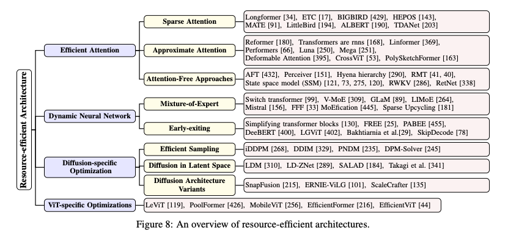
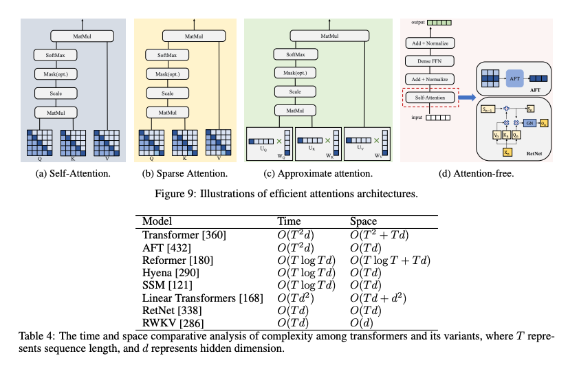

이 survey는 LLM, ViTs, Diffusion Model 및 LLM 기반다중 모델과 같은 대형 기초 모델들이 기계학습 전 과정에서 혁신을 이루고 있음을 다룹니다.
이러한 모델이 제공하는 다재다능성과 성능의 발전은 하드우ㅐ어 자원 측면에서 상당한 비용을 초래합니다.
이러한 대형 모델의 성장과 환경적으로 지속 가능한 방안을 지원하기 위해, 자원 효율적인 전략 개발에 상당한 초점이 맞춰졌습니다. 
이 연구는 이러한 연구의 중요성을 강조하며, 알고리즘적 및 시스템적 측면을 모두 검토합니다.
모델의 아키텍처, 학습, 서빙 알고리즘, 실용적 시스템 설계 및 구현에 이르는 다양한 주제를 포괄하여 귀중한 통찰력을 제공합니다.

[Paper Link](https://arxiv.org/pdf/2401.08092)  
[Code Link](https://github.com/UbiquitousLearning/Efficient_Foundation_Model_Survey)  

## Introduction

GPT 같은 대형 LLM, ViTs, Latent Diffusion Models(LDMs), CLIP 등의 모델들은 더 많은 데이터와 매개변수를 바탕으로 성능을 확장할 수 있지만, 이는 막대한 자원 소모를 동반합니다.
이런 대형 기초 모델의 자원 요구로 인해 소수의 주요 업체만이 이를 훈련하고 배포할 수 있으며, 이는 데이터 프라이버스 문제를 야기합니다. 
그래서 이를 해결하기 위해, 알고리즘 최적화, 시스템 혁신 등을 통해 기초 모델의 자원 효율성을 높이기 위한 다양한 연구가 진행중입니다. 이러한 연구는 자원 소모를 줄이면서 성능으 ㄹ유지하는데 중점을 둡니다.


## FOUNDATION MODEL OVERVIEW

### 1. Language Foundation Models

#### Model Architectures
- Transformer Pipeline
	- Embedding: 입력 단어를 임베딩 레이어를 통해 고차원 벡터로 변환
	- Attention 매커니즘: 입력 벡터의 다양한 부분에 가중치를 할당하여 중요한 정보를 강조
	- Layer Norm: 활성화를 안정화하고, 표준화하여 모델의 안정성 확보
	- Feed Forward Network: 각 위치별 벡터를 비 선형적으로 변환하여 복잡한 데이터 패턴을 포착
	- Multi layer train: 여러 레이어를 통한 입력 데이터의 계층적 표현 학습
	- Final Prediction: 마지막 출력을 선형 레이어로 전달하여 최종 예측 도출

- Embedding	
	- 입력 단어를 시퀀스 토큰으로 변환합니다. 주로 사용되는 토크나이저로는 WordPiece, BPE 가 있습니다.
	- Embedding Layer: 시퀀스 토큰을 벡터 시퀀스로 변환합니다. 단어 순서는 의미에 중요하므로, 위치 인코딩을 임베딩에 추가하여 순서 정보를 포함시킵니다.

- Attention
	- 시퀀스 내 단어들간의 관계를 포착하는 데 중요한 역할을 함
	- Self-Attention: 쿼리, 키, 값 쌍이 모두 동일한 입력 시퀀스에서 유도됩. 입력의 각 위치에서 다른 부분에 집중할 수 있게 함.
	- Multi-head Attention: Self-Attention의 변형으로, 다양한 표현 하위 공간에서 정보를 동시에 주목할 수 있게함. 
	- Sparse Attention: 효율성을 위해 설계
	- Multi-Query Attention: 다양한 다운스트림 작업을 위해 설계
		- 여러 쿼리에 대해 동일한 키-값 쌍을 사용하여 메모리 사용량과 계산 복잡도를 줄일 수 있습니다. 
		- 구현 예시 

```python
class MultiQueryAttention:
	def __init__(self, d_model, n_heads):
		super(MultiQueryAttention, self).__init__()
		self.d_model = d_model
		self.n_heads = n_heads
		self.d_heads = d_model // n_heads
		
		assert d_model % n_heads == 0
	
		self.query_linear = nn.Linear(d_model, d_model)
		self.key_linear = nn.Linear(d_model, d_heads)
		self.value_linear = nn.Linear(d_model, d_heads)

		self.out_linear = nn.Linear(d_heads * n_heads, d_model)

	def forward(self, x):
		
		batch_size = x.size(0)
		Q = self.query_linear(x)  # [Batch, Seq_len, d_model]
		K = self.key_linear(x)		# [Batch, seq_len, d_heads]
		V = self.value_linear(x)	# [Batch, seq_len, d_heads]
	
		Q = Q.view(batch_size, -1, self.n_heads, self.d_heads).transpose(0, 2, 1, 3) # [batch, n_heads, seq_len, d_heads]
		K = K.unsqueeze(1).repeat(1, self.n_heads, 1, 1)
		V = V.unsqueeze(1).repeat(1, self.n_heads, 1, 1)

		scores = torch.bmm(Q, K.transpose(-2, -1)) / torch.sqrt(self.d_heads)
		attn = nn.Softmax(scores, dim=-1)
		context = torch.bmm(attn, V)
		return context
```

- Encoder-Decoder Architecture
	- Encoder
		- 셀프어텐션: 입력 시퀀스를 셀프 어텐션 매커니즘을 통해 처리하여 입력 시퀀스의 각 부분에 가중치를 할당하여 정보를 강조
		- 입력 데이터 내 복잡한 패턴과 의존성을 이해하는 데 필수적 
	- Decoder: 출력 시퀀스를 생성합니다.
		- 셀프 어텐션: 이미 생성된 출력 내 관계를 이해
		- 크로스 어텐션: 인코더 출력과, 디코더 출력간의 관련 정보를 추출
		- Auto Regressive: 출력 토큰을 순차적으로 생성하며, 각 토큰의 생성은 이전 생성된 토큰에 의존


- Auto-Regressive Decoding and KV Cache
  - Auto-Regressive Decoding
    - 디코더 함수는 입력 토큰 시퀀스 X = {x1, x2, ..., xi}를 바탕으로 새로운 토큰 x_i+1을 추론합니다.
    - 새로 추론된 x_i+1을 시퀀스 X에 추가하고, 이를 다음 추론 단계에 사용합니다. 
    - 각 토큰의 생성은 이전에 생성된 토큰에 의존하여 순차적으로 이루어집니다. 
  - Key-Value Cache
    - 어텐션 매커니즘의 중간 상태를 각 단계에서 저장하여 효율성을 높입니다. 
    - 이전 단계에서 처리된 토큰의 재계산을 방지하고 메모리 사용량을 줄입니다.


#### Representative Models and Downstream Tasks
- Encoder-Only FMs
  - BERT
    - 인코더 전용 트랜스포머 모델
    - 훈련: 양방향 마스킹 언어 모델링
  - DistillBERT
    - BERT의 축소판 (40% 작고, 60% 빠름)
    - BERT의 언어 이해 능력의 97%가 유지
  - RoBERTa:
    - BERT의 최적화
    - 더 큰 데이터 코퍼스, 더 큰 배치 사용
  - Sentence-BERT
    - 의미 있는 문장 임베딩 생성
    - 문장 임베딩을 비교하는 모델 (코사인 유사도)

- Encoder-Decoder FMs
  - T5
    - 인코더-디코더 아키텍처
    - C4데이터에서 자기지도 학습
  - BART
    - 노이징 오토인코더 
    - 텍스트에 임의의 노이즈를 추가하고 원본 텍스트를 복원하는 학습 수행

- Decoder-Only FMs
  - GPT 시리즈 
    - 디코더 전용 아키텍처
    - 비지도 학습 
    - GPT-1: 1억 1천 7백만 개의 매개변수, 인터넷 텍스트로 사전 학습
    - GPT-2: 1.5B 개의 매개변수, WebText 데이터셋 사용
    - GPT-3: 175B 개의 매개변수, 대규모 모델로 제로샷 성능 뛰어남
  - LLaMA: 사람의 피드백을 통한 지시 조정
  - GLM: 2D 위치 인코딩 추가
  - PaLM: 6144 TPU v4 칩에서 학습, 모델 규모가 소수 학습에 미치는 영향 연구

-  Speech FMs
  - Wav2Vec 2.0
    - 라벨이 없는 데이터셋에서 강력한 음성 표현 획득
  - HuBERT
    - 자기지도 학습을 위한 transformer 아키텍처
  - Whisper
    - 68만 시간의 다국어 및 다중 작업 지도 데이터로 학습
    - 모델 구조
      - CNN 기반 전처리 모듈
        - 입력 음성 데이터를 전처리하여 로그 멜 스펙트로그램으로 변환하여 시간-주파수 도메인에서의 특징을 추출
        - 이를 입력으로 받아 여러 conv 1D layer를 통해 특징 벡터를 추출합니다.
      - Transformer 인코더, 디코더 
        - 위에서 추출한 특징 벡터를 입력으로 받아 더 높은 수준의 표현을 학습하고 최종 예측을 생성 
    
#### Cost Analysis

- embedding component
  - 저장 비용: 전체 저장비용의 25%
  - 계산 비용: 추론 시에는 룩업 테이블로 작동하여 최소한의 계산 비용만 소요
- FFN (Fully Connected Feedforward Network)
  - 계산 비용: 가장 높은 계산 비용 차지. 각 FFN 블록에 두개의 Fully connected layer가 포함되어 있기 때문
  - 문제점: 계산 복잡도가 시퀀스 길이에 대해서는 선형적이지만, 모델 차원에 대해 이차적으로 증가 
  - 계산 복잡도: O(TD^2) (T: 시퀀스 길이, D: 모델의 은닉 상태 차원)
- Head
  - 분류 작업: BERT 와 같은 모델에서는 Softmax 함수를 사용한 분류 레이어
  - 생성 작업: GPT, T5 같은 모델에서 선형 레이어로 작동 
  - 크기: 어휘 크기에 비례 [hidden_size, vocab_size]
- Attention 매커니즘
  - 계산 복잡도: O(T^2D) (T: 시퀀스 길이, D: 모델의 은닉 상태 차원)
  - 문제점: 입력 시퀀스 내 모든 위치 쌍에 대해 어텐션 점수를 계산하는 데서 이차 복잡성 발생
  - 효율성: 긴 시퀀스를 처리하는 데 있어 계산 및 추론 효율성에 영향을 미침
- 디코더의 Attention 매커니즘
  - Auto-Regressive 디코딩: 각 토큰의 생성이 이전 토큰에 의존하여 계산 요구 증가
  - KV Cache: 재사용으로 계산 비용을 줄일 수 있지만, 추가 메모리 요구 발생
  - 메모리 요구량 계산: O (B × S × D × L × 2 × 4) (B: 배치 크기, S: 시퀀스 길이, D: 은닉 차원, L: 디코더 레이어 수, 2: key와 value, 4: byte size of single precision float)
    - single precision floating point
      - 32 (2^5) 비트로 실수 표현 -> 8 bit = 1 byte -> 4 byte

- 음성 처리에 대한 고려 사항
  - CNN 인코더 블록
    - 초기 CNN 레이어가 상당한 계산 능력을 요구하며, 각 입력 토큰에 대해 많은 계산 필요

	
### 2. Vision Foundation Models

#### Model Architecture
Vision Transformer(ViT)는 Transformer 모델을 활용한 컴퓨터 비전 분야의 대표적인 모델입니다. ViT는 자연어 처리 모델인 BERT에서 영감을 받았으며, BERT처럼 인코더만 사용하는 구조입니다. ViT의 주요 작동 방식을 요약하면 다음과 같습니다:

1. **이미지 분할**: 입력 이미지(RGB 이미지, 크기 3×224×224)를 고정 크기 패치(16×16 픽셀)로 분할합니다. 이 과정은 Convolutional Embedding Layer를 통해 이루어지며, 14×14 개의 패치로 분할됩니다.
   
2. **토큰화 및 임베딩**: 분할된 패치들은 토큰으로 취급되며, 각 토큰에 위치 정보를 포함하는 포지셔널 임베딩이 추가됩니다. 또한, 분류 작업을 위해 추가적인 학습 가능한 분류 토큰([CLS])이 토큰 시퀀스에 추가됩니다.

3. **Transformer 인코더**: 이 토큰들은 표준 Transformer 인코더에 입력됩니다. Transformer 인코더는 매우 계산 집약적이며, 이미지 분할 및 임베딩 과정의 연산 비용은 전체의 약 5% 미만으로 적습니다.

4. **다운스트림 작업**: Transformer 인코더에서 생성된 히든 상태는 최종적으로 분류, 탐지, 분할 등의 다양한 다운스트림 작업에 맞게 다른 헤드로 입력됩니다.

ViT의 이 과정은 이미지의 각 패치를 일종의 "단어"로 처리하여 Transformer 모델로 이미지의 특징을 학습하는 방식입니다.

#### Representative Models and Downstream Tasks

**1. 인코더-전용 모델**
- **Vision Transformer (ViT)**: BERT와 비슷한 인코더만 사용하는 구조. ImageNet-21k 데이터셋에서 대규모로 감독 및 자가 지도 학습을 수행. 높은 정확도와 확장성을 보이지만, 전통적인 CNN보다 많은 훈련 데이터가 필요.
- **DeiT**: ViT의 데이터 효율성을 높이기 위해 증류 기법을 사용한 사전 훈련.
- **BEiT**: 손상된 이미지 패치에서 원래의 비주얼 토큰을 복원하는 방식으로 자가 지도 학습을 강화.
- **MAE**: 인코더 훈련을 위해 경량 디코더를 도입하여 마스크된 패치를 재구성. 대부분의 패치를 마스킹(80%까지)하여 비용 효율적인 훈련을 가능하게 함.
- **YOLOS**: ViT 기반의 객체 탐지 모델로, 중간 크기의 ImageNet-1k에서 사전 훈련된 ViT를 COCO 객체 탐지 벤치마크에 적용.
- **ViTDet**: 계층적 구조 없이 원래 ViT 아키텍처를 객체 탐지에 맞게 미세 조정.
- **Swin Transformer**: 어텐션 메커니즘을 최적화한 계층적 ViT 모델로, 이동 창을 사용하여 표현을 계산.
- **DINOv2**: 10억 개의 파라미터를 가진 ViT 모델을 훈련하고, 이를 소형 모델 세트로 증류하여 OpenCLIP보다 뛰어난 성능을 보임.

**2. 인코더-디코더 모델**
- **DETR**: CNN 백본과 인코더-디코더 트랜스포머로 구성된 객체 탐지 모델. 객체 탐지, 인스턴스 세그멘테이션 및 파노픽 세그멘테이션을 지원.
- **SegFormer**: 트랜스포머와 경량 다층 퍼셉트론(MLP) 디코더를 결합한 의미적 세그멘테이션 모델.
- **LVM**: 이미지 시퀀스 모델링을 통해 언어 데이터 없이 순수한 비주얼 접근 방식으로 효과적인 학습을 달성.

이러한 모델들은 트랜스포머 기반의 구조를 활용하여 컴퓨터 비전 분야에서 다양한 작업(분류, 탐지, 세그멘테이션 등)을 수행하며, 각 모델은 특정한 데이터 효율성 및 성능 향상 기법을 도입하여 발전하고 있습니다.

#### Cost Analysis
- ViT의 구조는 BERT와 유사하기 때문에 자원 소비도 유사합니다.
- 언어모델 BERT와 달리 비전 모델은 일반적으로 고정 길이를 사용합니다.
- 계산 병목: ViT의 주요 병목 지점은 FFN과 어텐션 매커니즘에 있습니다. 

### 3. Multimodal Foundation Models
다중 모달리티는 텍스트, 이미지 등 여러 유형의 데이터를 결합하여, 이해, 번역 및 생성하는 기술입니다.

- 두 가지 연구 방향이 있습니다.
	- 서로 다른 모달리티의 데이터를 같은 잠재 공간에 인코딩
      - 주로 트랜스포머 인코더를 사용하여 서로 다른 모달리티 간의 거리를 최소화 함 
	- 서로 다른 모달리티의 데이터를 생성 
      - 텍스트를 기반으로 이미지를 생성
      - 주로 트랜스포머 디코더를 사용

#### Key Architectures

- 여러 인코더 사용
  - 각 모달리티에 대해 별도의 트랜스포머 인코더 사용
  - 각 데이터를 정규화된 고정 차원의 임베딩으로 인코딩하고, 모달리티간 거리를 최소화
- 텍스트 생성 및 이미지 생성
  - 텍스트 생성
    - 순수 텍스트 데이터로 훈련된 LLM 사용
    - 디코더 전용 아키텍처 채택
  - 이미지 생성
    - Diffusion Model 사용하여 고품질 이미지 생성 
    - 이미지에 노이즈를 추가하고, 추론 단계에서 노이즈를 제거하고 고품질 이미지를 생성
    - 구성: 이미지 인코더/디코더와 디노이징 네트워크
- 이미지 인코더/디코더
  - 이미지 인코더는 이미지를 잠재표현으로 압축
  - 디코더는 잠재표현을 고해상도 이미지로 복원
  - VAE 
    - 인코더와 디코더로 구성
    - 재구성 손실 및 KLD 최소화
  - VQ-VAE
    - 벡터 양자화 레이어를 사용하여 각 픽셀을 가장 가까운 코드북 벡터로 양자화합니다.
- Denoising 네트워크 
  - 이미지의 노이즈를 잠재적으로 제거
  - U-NET 구조 사용
- Fusion Decoder
  - 이미지와 연관된 텍스트 프롬프트를 결합하여 이해력 향상
  - 이미지와 텍스트 표현을 공동으로 처리 

#### Representative Models and Downstream Tasks

**다중 인코더 기반 모델**
- **CLIP, ALBEF, ALIGN**: 텍스트를 통해 이미지 표현을 학습하고자 하는 초기 연구 모델들입니다. 이 모델들은 이미지와 텍스트 인코더의 성능, 그리고 이미지-텍스트 페어 데이터의 양과 질에 의해 성능이 제한됩니다.
- **ImageBind, LanguageBind**: 다양한 중간 모달리티를 사용하여 여러 소스의 표현을 중간 모달의 특징 공간으로 매핑하는 모델들입니다. 그러나 인코더의 한계로 인해 성능에 제약이 있습니다.

**인코더-디코더 기반 모델**
1. **대형 인코더 기반 모델**:
   - **PandaGPT**: 여러 단일 모달리티 인코더를 사용하여 입력을 중간 모달리티로 정렬한 후 대형 모델로 생성합니다.
   - **BLIP-2, MiniGPT-4**: 이미지와 텍스트 모달리티를 융합하여 교차 모달 생성.
   - **mPLUG, LLaVA**: 모달리티 변환 능력을 향상시켜 더 신뢰성 있는 결과를 생성.
   - **Flamingo, LLaMA-Adapter**: 비용을 낮추면서 고품질 다중 모달 출력을 생성하도록 대형 모델 튜닝.
   - **PaLM-E, HuggingGPT**: 인공지능 에이전트를 설계하여 복잡한 작업을 수행하는 모델들.

2. **인코더-확산 기반 모델**:
   - **Stable Diffusion**: 노이즈를 점진적으로 제거하여 고품질 이미지를 생성. 텍스트-이미지 생성, 이미지 보완, 이미지 편집, 이미지 초해상도 등 다양한 작업에 사용됩니다.
   - **Consistency Models**: 빠른 단일 단계 생성이 가능하며, 이미지 보완, 색채화, 초해상도 등 다양한 작업을 수행할 수 있습니다.
   - **DALL-E**: 텍스트 설명을 기반으로 다양한 이미지를 생성.
   - **Any-to-Any 생성 모델**:
     - **CoDi**: 다양한 입력 조합으로부터 언어, 이미지, 비디오, 오디오 등의 출력 모달리티를 생성.
     - **NExT-GPT**: 텍스트, 이미지, 비디오, 오디오를 포함한 다양한 모달리티의 입력을 인식하고 출력 생성.

3. **인코더-퓨전 디코더 기반 모델**:
   - **UNITER**: 초기 다중 모달리티 설정에서 이미지와 텍스트를 융합하여 공동 특징을 얻는 모델.
   - **FLAVA, CoCa, GLIP**: 디코더를 사용하여 이미지와 텍스트 표현을 융합 및 정렬하여 다중 모달 추론을 향상.
   - **SAM**: 텍스트 프롬프트만으로 이미지를 자동으로 분할하는 모델.

이 요약은 다양한 다중 모달리티 모델과 그들이 어떻게 다른 모달리티의 데이터를 처리하고 생성하는지를 쉽게 이해할 수 있도록 돕습니다. 각 모델의 특성과 사용 사례를 간단히 설명하여 다중 모달리티 연구의 핵심을 파악할 수 있습니다.

#### Cost Analysis

**다중 인코더 모듈 (Multi-Encoder Module)**:
- **역할**: 다양한 모달리티(이미지, 텍스트, 오디오 등)를 통합된 의미 공간으로 정렬합니다.
- **주요 구성 요소**:
  - **이미지 인코더**: 가장 많은 자원을 사용 (0.63B 파라미터, 2.4G 메모리, 167.59 GFLOPs).
  - **텍스트 인코더, 오디오 인코더, IMU 인코더**: 각기 다른 모달리티를 인코딩.
- **평균 자원 소모**: 0.27B 파라미터, 1.1G 메모리, 65.9 GFLOPs.

**디코더 모듈 (Decoder Module)**:
디코더 모듈은 대형 모델(Large FMs), 확산 모델(Diffusion Module), FD (Fusion Decoder) 모듈로 구성됩니다.

1. **대형 모델 모듈 (Large FMs Module)**:
   - **역할**: 다양한 모달리티로부터 정렬된 입력을 받아 자동회귀 방식으로 데이터를 생성.
   - **자원 소모 예시**: Vicuna-7B 모델 (7B 파라미터, 14G 메모리, 312 GFLOPs).

2. **확산 모델 모듈 (Diffusion Module)**:
   - **역할**: 고품질 이미지를 생성.
   - **대표 예시**: Stable Diffusion 2.1
     - **U-Net**: 이미지 잠재 공간에서 노이즈를 예측하고 제거 (865M 파라미터, 759G FLOPs).
     - **VAE**: 이미지를 잠재 공간으로 인코딩 및 노이즈 제거된 잠재 벡터를 디코딩 (83M 파라미터, 4T FLOPs).
     - **CLIP**: 텍스트 인코딩 (289M 파라미터, 289M FLOPs).

3. **FD 모듈 (Fusion Decoder Module)**:
   - **역할**: 이미지와 텍스트 표현을 융합하여 더 나은 다중 모달리티 추론을 수행.
   - **자원 소모**: ViT와 유사한 자원 소비 및 계산 병목.

이 요약은 다중 인코더 및 디코더 모듈이 다양한 모달리티의 데이터를 어떻게 처리하고 생성하는지를 쉽게 이해할 수 있도록 설명합니다. 각 모듈의 구성 요소와 그들이 사용하는 자원에 대해 간략히 설명하여 전체적인 구조를 파악하는 데 도움이 됩니다.

## RESOURCE-EFFICIENT ARCHITECTURES

  

대형 모델의 자원 효율성을 높이기 위해 주로 다루는 요소는 Attention Mechanisms과 디코더(Decoders)입니다. 이러한 요소들은 계산 및 메모리 비용을 줄이는 것을 목표로 합니다.

### 1.  Efficient Attention

 

- 문제점: 어텐션 메커니즘은 시퀀스 길이에 따라 시간 복잡도가 기하급수적으로 증가합니다. O(T^2D)
- 목표: 이 복잡도를 선형으로 줄이거나 대안적인 방법을 찾는 것입니다.
- 종류
  - Sparse Attention
    - 그래프 희소화에서 영감을 받아 희소 주의 행렬을 구축하는 것입니다. 이는 완전한 셀프 어텐션 메커니즘의 장점을 유지하면서도 내부 곱셈의 수를 줄이는 것을 목표로 합니다.
    - 주요 접근 방식
      - Longformer, ETC, BIGBIRD: 긴 시퀀스 데이터를 처리하기 위해, 로컬 윈도우 어텐션을 도입하여 복잡도를 선형으로 줄입니다. 또한 특정 토큰에 글로벌 어텐션을 도입하여 중요한 정보가 손실 되지 않도록 합니다. 
      - HEPOS: 각 어텐션 헤드가 입력 시퀀스의 특정 부분에 집중하도록 하여 효율적인 인코더-디코더 처리를 가능하게 합니다.
      - MATE: 테이블 데이터를 효율적으로 처리하기 위해 어텐션을 다중 뷰 형식으로 변환하여 테이블의 행 또는 열을 효율적으로 처리합니다.
      - TDANet: 인간의 주의 매커니즘을 모방하여, 상위 레벨에서 전반적인 정보를 파악하고, 하위 레벨에서 세부 정보를 집중적으로 처리하는 방식입니다. 이를 통해 가장 관련성 높은 정보에 선택적으로 집중합니다.
      - ALBERT: BERT의 경량화 버전으로, 계층 간 파라미터 공유를 통해 파라미터 수를 89% 줄이면서도 정확성을 보장합니다.
  - Approximate Attention
    - 자가 주의 행렬의 저랭크 근사 및 자가 주의 메커니즘의 혁신적인 재구성을 포함합니다. 이러한 접근 방식은 N × N 행렬의 직접적인 계산을 피하여 계산 복잡도를 줄이고 효율성을 높입니다.
    - 주요 접근 방식:
      - Linformer: 입력 시퀀스를 더 작은 저랭크 공간으로 투영하여, 셀프 어텐션 계산에 필요한 메모리와 연산량을 줄입니다. 
      - Reformer: 기존의 dot-product 주의를 locality-sensitive hashing(LSH)으로 대체합니다. 입력 시퀀스를 해싱하여 유사한 해시 값을 가진 토큰끼리만 상호작용하도록 하여, 셀프 어텐션 메커니즘을 가속화 할 수 있습니다. 
      - Katharopoulos et al.: softmax dot production을 사용하는 대신 커널 함수를 사용하여 내적으로 근사하는 방법을 사용합니다. 
      - Polysketchforme: 다항 함수와 스케치 기술(대규모 데이터를 효율적으로 처리하기 위해 근사값을 사용하는 확률적 데이터 구조)을 사용하여 소프트맥스 출력을 근사화합니다.
      - Mega: 단일 헤드 게이트 주의 메커니즘에 지수 이동 평균을 통합하여 위치 의존적인 지역 종속성을 포함합니다.
      - Deformable Attention: 특정 토큰이 고정된 위치에만 주목하는 것이 아니라, 위치를 유연하게 변화시킨으로써, 전통적인 밀집 주의 방식에 비해 성능을 개선합니다.
      - CrossViT: ViT는 모든 패치가 동일한 크기를 가져야 하는 단점이 있습니다. 이를 해결하기 위해 서로 다른 크기의 패치를 사용하여 더 풍부한 정보를 추출하였습니다. 그리고 작은 패치, 큰 패치 간 선형 크로스 주의 메커니즘을 도입합니다.
  - Attention-Free Approaches
    - 전통적인 Transformer 모델의 주의(attention) 메커니즘을 대체하는 혁신적인 아키텍처를 제안하는 접근법입니다.
    - 주요 접근 방식:
      - Hyena: 암묵적으로 매개변수화된 긴 컨볼루션(long convolution)과 데이터로 제어되는 게이팅(gating)을 교차로 배치하는 아키텍처.
      - SSMs: 주의 메커니즘을 State Space Model로 대체하는 접근법으로 시스템의 상태를 시간에 따라 모델링합니다. 
      - Recurrent-Style Transformers (RMT): 주의 메커니즘을 순환 신경망(RNN)으로 대체하여 선형 복잡성을 달성하는 아키텍처.
      - RWKV: Transformer의 병렬 학습 효율성과 RNN의 효과적인 추론 능력을 결합한 모델.
      - RetNet: 다중 헤드 주의 메커니즘을 다중 스케일 유지 메커니즘(multi-scale retention mechanism)으로 대체한 아키텍처. 입력 시퀀스의 중요한 정보를 다양한 스케일에서 유지하여, attention 메커니즘 없이도 정보를 효과적으로 처리합니다. 

### 2. Dynamic Neural Network

#### Mixture of Expert
MoE는 대규모 파라미터 집합을 가진 모델을 효율적으로 훈련하고 배포하기 위한 sparse한 접근 방식입니다. 
추론시 라우팅된 sparse parameter를 사용하여 계산 및 통신 비용을 줄이고 효율성을 높입니다. 

각 전문가 (개별 신경망 또는 피드포워드 네트워크)는 특정 입력에 대해 전문화된 기능을 가지고 있으며, 게이트 모듈을 통해서 입력에 기반하여, 특정 전문가의 가중치만을 활성화 합니다. 

- Switch Transformer
	- 스위치 라우팅 알고리즘을 도입
	- 성능: 최대 1 trillion 개의 파라미터와 2048 experts를 관리할 수 있는 확장성
- GLaM (General Language Model)
- V-MoE: ViT의 sparse MoE 버전
- LIMoE
- Mistral8x7B
- MoEfication
- SparseUpcycling
- FFF(Fast Feed-Forward)
	- 입력 벡터 x를 여러개의 작은 부분으로 분할 
	- 각 분할된 입력 벡터에 해당하는 분할된 피드포워드 레이어를 활성화하고 이를 병렬로 처리하고, 출력들을 합성하여 최종 출력을 만듭니다. 


