이 논문에서 저자는 가장 유명한 llm family(GPT, LLaMA, PaLM)에 대해 리뷰하고, 그들의 특징, 기여, 그리고 한계에 대해서 논의한다. 또한 저자는 LLM 모델을 빌드하고, 증강하기 위한 테크닉들을 overview 한다. 그리고 유명한 llm 학습, 파인튜닝, 평가에 필요한 데이터셋을 조사하고, 평가 메트릭과 대표적인 벤치마크 셋에서의 llm의 성능을 비교할 것이다. 그리고 마지막으로 open challenge와 미래의 연구 방향에 대해서 논의 할 것이다. 

[Paper Link](https://arxiv.org/pdf/2402.06196)

## Large Language Models

이 섹션에서는 pre-trained neural language model에 대해서 리뷰하고, 대표적인 llm 패밀리인 GPT, LLaMA, PaLM에 대해서 논의할 것입니다. 

### A. Early Pre-trained Neural Language Models

처음 NLM(Neural Language Model)은 recurrent neural network를 사용하거나, varient인 Long shor term memory (LSTM)과 Gated recurrent unit (GRU)을  사용하여 기계번역이나, 텍스트 생성, 텍스트 분류 분야에서 널리 사용되었습니다.

그리고, Transformer 아키텍처의 발견은 NLM 발전의 또다른 마일스톤을 만들었습니다. 
self-attention을 도입함으로써, 시퀀스 내에 있는 모든 단어에 대해서 병렬 프로세싱을 가능하게 함으로써 각 단어들이 서로에게 영향을 줄 수 있도록 모델링이 가능해졌습니다. 
Transformer는 RNN 보다 병렬화되어 있고, 큰 모델을 더 많은 데이터에 대해서 GPU를 사용하여 효율적으로 pre-train을 할 수 있게 되었습니다. 이 pre-trained language model (PLMs)은 많은 downstream 테스크들에 대해 finetune 될 수 있습니다. 

저자는 early popular transformer-based PLMs을 그들의 아키텍처를 기반으로 세가지 메인 카테고리로 분류하였습니다.
- encoder only
- decoder only
- encoder-decoder models

#### 1) Encoder-Only PLMs
이 모델은 language understanding 작업 (text classification)을 위해 원래 개발되었습니다. 대표적인 모델은 BERT와 같은 모델을 포함합니다. (RoBERTa, ALBERT, DeBERTa, XLM, XLNet, UNILM)
BERT(Bidirectional Encoder Representation from Transformers)은 가장 널리 사용되는 모델입니다. BERT는 대표적으로 세가지 모듈로 구성되어 있습니다.
- Embedding module: Text -> Embedding vectors
- Stack of Transformer Encoder: embedding vectors -> contextual representation vectors 
- Fully connected layer: representation vectors -> one-hot vectors

BERT는 두가지의 oejective로 사전학습됩니다.
- Masked Language modeling (MLM)
- Next sentence prediction

pre-trained 모델은 추가적인 classifier layer를 사용하여 파인튜닝함으로써 language understanding, classification, question anserting 등에 사용할 수 있습니다. 

- RoBERT는 BERT에서 robustness를 개선시킨 모델로, 몇가지의 key hyperparameter를 수정한 모델이다. 훨씬 더 방대한 양의 텍스트 데이터를 학습하였으며, 더 긴 기간동안 학습을 진행하여 일반화 능력을 높였습니다. 또한 학습 목표에서 next-sentence prediction을 없애고 고정된 방식이 아니라 동적인 방식으로 마스킹 패턴을 변경하여 다양한 문맥을 학습할 수 있도록 하였습니다. 그리고 학습 과정에서 학습률을 조정하여 최적의 성능을 달성하였습니다. 

    -  NSP: 두 문장이 연속되는지 여부를 예측하는 이진 분류 작업. 모델 성능 향상에 크게 기여하지 않으며, 오히려 불필요한 복잡성을 추가할 수 있다는 연구 결과에 기반하여 제거 

- ALBERT(A Lite BERT)는 두개의 parameter reduction 테크닉을 사용하여 메모리 소비량을 줄이고, 학습 속도를 높였습니다. 
    - factorized embedding parameters
        - BERT에서는 입력 토큰 임베딩의 크기(E)와 히든 레이어의 크기(H)가 동일하게 설정되었으나, ALBERT에서는 E를 H보다 작게 설정하여서, 어휘 크기 (V)와 E의 행렬 VxE를 생성한 후 H로 투영 (ExH)하는 방식을 사용하여, 파라미터수를 효과적으로 감소 
    - Cross Layer Parameter Sharing 
        - 트랜스포머의 각 레이어에서 동일한 파라미터를 공유하도록 설계되어, 모델의 크기를 줄이고 메모리 사용량을 감소시킵니다. 이는 모델의 안정성에도 긍정적 영향을 미칩니다.
    - Sentence Order Prediction (SOP)
        - 문장간의 일관성을 더 정확하게 학습하기 위해 SOP 과제를 도입라였습니다. 연속된 두문장을 올바른 순서로 배열한 경우를 긍정예시, 순서를 뒤바꾼 예시를 부정 예시로 사용하여 모델이 순서의 일관성을 학습하도록 합니다. 

- DeVERTa(Decoding-Enhanced BERT with disentangled attention)는 BERT와 RoBERT의 성능을 향상시키기 위해 다음과 같은 주요 방법론을 도입하였습니다.
    - Disentangled Attention Mechanism: 기존 모델들은 단어의 content와 position 정보를 하나의 벡터로 합산하여 표현하였습니다. 이러한 방식은 단어 간의 상호작용을 정확하게 포착하는데 한계가 있을 수 있습니다. 반면 DeBERT는 각 단어를 내용과 상대적 위치를 각각 인코딩하는 두개의 벡터로 표현합니다. 그리고 분리된 표현을 통해 어텐션 가중치를 따로 계산한 후 결과를 결합하여 최종 어텐션 가중치를 산출함으로써, 단어간 의미적 위치적 관계를 더욱 정교하게 모델링합니다.
    - Enhanced Mask Decoder: 마스킹된 단어를 예측하기 위해, 디코딩 레이어에 절대적 위치 정보를 통합하여, 문장 내 단어의 구문론적 역할을 더 정확하게 파악할 수 있도록 합니다. 
    - Virtual adversarial Training: 모델의 일반화 성능을 향상시키기 위해 파인튜닝 단계에 적대적 학습방법을 도입하였습니다. 
        - 임베딩 곤간에서의 작은 크기의 노이즈를 추가하고 원래 입력에 대한 출력 분포와 노이즈가 추가된 입력에 대한 출력 분포 간의 차이를 최소화하는 방향으로 모델을 학습시킵니다. 이를 통해 모델은 입력 변형에 대한 민감도를 줄이고 일반화 능력을 향상 시킵니다. 

- ELECTRA는 MLM모다 훨씬 sample-efficient가 좋다고 밝혀진 replaced token detection (RTD)을 사용한 방법입니다. 
    - RTD는 작은 generator를 통해 유사하지만 잘못된 토큰으로 대채하고, 이렇게 대체된 문장을 입력으로 받아 각 토큰이 원래의 것인지 아니면 대체된 것인지를 예측하는 이진 분류 작업을 수행합니다. 
    - MLM은 전체 입력 중 일부 (15%)만을 마스킹하여 학습 신호를 제공하는데 반면, RTD 는 모든 토큰에 대해 학습 신호를 제공하므로, 동일한 데이터와 계산 자원으로 더 많은 학습을 수행할 수 있습니다. 
    - 또한 RTD는 실제 단어를 대체하여 학습하므로, `[MASK]`와 같은 실제 응용하지 않는 토큰없이 불일치를 줄일 수 있습니다. 

- XLMs는 BERT를 cross-lingual language model로 확장한 모델입니다. 
    - Shared sub-word vocabulary: BPE(Byte pair encoding) 기법을 사용하여 여러 언어에서 공통적으로 사용할 수 있는 서브워드 단위를 생성. 이를 통해 다양한 언어의 단어를 동일한 어휘 집합으로 표현하여 모델이 여러 언어를 효과적으로 학습할 수 있도록 함 
    - Masked Language Modeling (MLM)
    - Translation Language Modeling (TLM): 병렬 문장 쌍 (영어-한국어)을 입력으로 사용하여, 두 언어의 문장을 연결한 후 일부 토큰을 마스킹하고, 이를 예측하도록 모델을 학습시킵니다. 두 언어 간의 상호 연관성을 학습하고 번역 작업에서의 성능을 향상시킵니다. 

    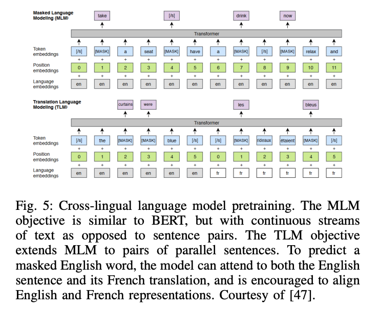

- XLNet, UNILM 등과 같은 모델들은 auto-regressive (decoder) 모댈의 장점을 활용하기도 합니다. 

- XLNet
    - Permutation Language Modeling: 기존의 autoregressive 모델은 단방향으로 문맥을 학습하는 반면, XLNet은 단어 순서를 무작위로 섞어 expected likelihood를 최대화 하는 방향으로 학습 함으로써 다양한 순서의 문맥을 학습함으로써 양방향 문맥정보를 효과적으로 활용할 수 있습니다.
    - Transformer-XL: 트랜스포머-XL의 메모리 메커니즘을 도입하여 긴 문맥정보를 처리할 수 있습니다.
        - Segment-Level Recurrence Mechanism: 기존 트랜스포머는 고정 길이의 문맥만을 처리할 수 있었지만, Transformer-XL은 이전 세그먼트의 hidden state를 현재 세그먼트로 전달하여, 이전 문맥정보를 재사용함으로써 더 긴 범위의 의존성을 학습할 수 있습니다. 
        - Relative Positional Encoding: 기존 절대적 위치 인코딩은 문장 길이가 길어질 수록 위치 정보 일반화에 어려움이 있었지만, 상대적 거리를 인코딩함으로써 위치 정보 일반화 능력을 향상시켰습니다. 
    - Two-Stream Self Attention: permutation 모델링 과정에서 발생할 수 있는 예측 대상의 모호성을 해결하기 위해 현재 예측하려는 단어의 위치 정보만을 기반으로 예측하는 query stream, 각 단어의 실제 내용을 활용하여 예측하는 content stream의 협업을 통해 위치와 내용을 효과적으로 분리하여 학습 

- UNILM(Unified pre-trained language model)
    - 세 가지 타입의 언어 모델링 과제를 통합하여 학습 
        - Unidirectional LM: 이전 단어들을 기반으로 다음 단어 예측
        - Bidirectional LM: 문장내 모든 단어를 고려하여 마스킹된 단어를 예측
        - Sequence to Sequence LM: 입력 시퀀스를 기반으로 출력 시퀀스를 생성 
    - Self - Attention Mask를 사용하여 각 언어 모델링 과제를 단일 트랜스포머 네트워크에서 학습함으로써 다양한 문맥정보를 효과적으로 학습 

    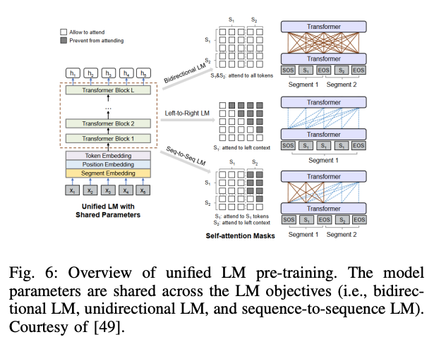

#### 2) Decoder-Only PLMs
가장 널리 사용되는 Decoder only plm은 GPT-1, GPT-2 입니다. 이러한 모델들은 GPT-3, GPT-4 등의 LLM의 강력한 파운데이션 모델로 자리잡고 있습니다. 

- GPT-1 decoder only transformer 모델로서 라벨링 되지 않은 다양한 코프스 데이터에 대해 self-supervised 한 방식 (next token prediction)으로 학습되어 다양한 분야에서 좋은 성능을 낸 첫 모델입니다. 
이는 서로 다른 다운스트림 테스크들에 대해서 더 적은 샘플들로 파인튜닝을 진행하여 좋은 성능을 내었습니다. 

- GPT-2는 language moidel이 large webText 데이터에 대해 학습될 때, 어떠한 명시적인 supervision 없이도 특정 nlp 테스크를 잘 수행할 수 있음을 보였습니다. GPT-2는 GPT-1의 디자인을 몇가지 수정하였습니다.
    - Layer normalization을 sub-block의 input으로 옮겼습니다. 그리고 마지막 self-attention block의 뒷부분에 추가적인 layer normalization을 추가하였습니다. 
    - residual path에서 누적효과를 고려하여 초기화 방식을 수정하였습니다. 
    - residual layer의 가중치를 스케일링하여 그레디언트 폭주와 소실을 방지하여 안정적 학습을 도모하였습니다.
    - vocabulary size도 50,257개로 확장시키고, context size도 512에서 1024 토큰으로 증가시켜 더 긴 문맥을 처리할 수 있게 하였습니다. 

    - GPT-2의 모델 구조는 아래와 같습니다. 

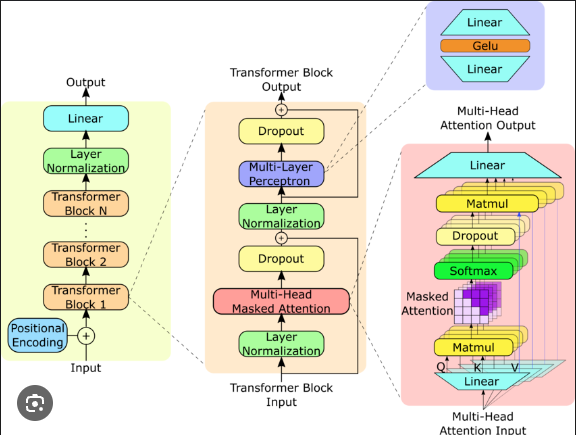

#### 3) Encoder-Decoder PLMs

거의 대부분의 NLP 테스크들은 sequence-to-sequence generation task로 캐스팅 될 수 있습니다. 그래서 encoder-decoder language model은 모든 자연어 understanding 과 생성 테스크를 수행할 수 있습니다. 대표적인 encoder-decoder 모델로는 T5, mT5, MASS, BART 등이 있습니다.

- T5는 Text-to-Text Transfer Transformer (T5) 로 구글에서 개발하였으며 모든 자연어 처리 작업을 텍스트 입력과 텍스트 출력의 형태로 통일하여 처리하는 것을 목표로 합니다.
    - Text-to-Text generation framework 

- mT5 모델은 T5의 multilingual varient 모델입니다. 101 가지 언어로 구성된 새로운 common crawl-based dataset 에서 사전학습되었습니다. 

- MASS (Masked Sequence to Sequence pre-training)은 시퀀스의 일부를 입력으로 받아서 문장을 재건하는 방식을 차용합니다. encoder는 랜덤하게 마스킹된 (연속적인 토큰) 문장을 입력으로 받고, decoder는 이 mask fragment를 예측합니다. MASS는 language embedding과 generation을 위해 jointly 하게 학습됩니다. 

- BART는 페이스북 연구팀이 개발한 모델로 BERT와 GPT의 장점을 결합한 일반적인 sequence-to-sequence translation model 아키텍처를 따릅니다. 임의로 노이즈를 주입하는 function을 통해 corrupting text를 original text로 재건하는 방식으로 사전학습 됩니다. 
여기서 노이즈는 토큰 마스킹, 토큰 삭제, 텍스트 채우기, 문장 순서 변경 등 다양한 유형을 포함합니다. 

### B. Large Language Model Families
LLM은 주로 transformer 기반의 PLM 모델로 10~100 billions 개 파라미터를 가졌습니다. LLM음 모델 사이즈가 클 뿐만아니라 understanding, generation, emergent abilities 에 모두 훌륭한 성능을 보입니다. 아래에서는 LLM 의 대표 가족인 GPT, LLaMA, PaLM 에 대해서 리뷰하겠습니다.

#### 1) The GPT Family
gpt는 open ai 에서 개발한 decoder only transformer 기반 모델입니다. 패밀리로는 GPT-1, GPT-2, GPT-3, InstructGPT, chatGPT, GPT-4, CODEX, WebGPT 등이 있습니다. 초창기 gpt 1, 2는 오픈 소스 모델이지만, 요즘의 모델 gpt 3, 4 등은 close-source 모델로 오직 API를 통해서만 접근할 수 있습니다. 

- GPT-3 모델은 autoregressive language model로 175B 파라미터를 가졌습니다. 이는 이전의 PLM 들보다 가장 커지고 emergent 능력이 뛰어난 쳣번째 모델로 여겨집니다. GPT-3는 in-context learning 에 아주 효과적이었습니다. 이 말은 어떠한 다운스트림 테스크에도 추가적인 학습 없이도 적용될 수 있다는 의미입니다. 오직 few-shot demonstration 만으로도 훌륭한 성능을 내었습니다. 

- CODEX는 2023/3 에 공개된 일반적인 프로그래밍 목적에 맞는 모델입니다.  이는 프로그래밍을 위해 깃허브의 코드로 파인튜닝된 모델입니다. (Microsoft Copilot)

- WebGPT는 GPT-3의 또다른 모델로 텍스트 기반의 웹브라우저에 사용되는 open-ended question의 답변에 사용되기 위해 파인튜닝된 모델입니다. 이는 세가지 스텝으로 학습되었습니다. 
    - human demonstration data를 통해 사람의 브라우징 행동을 모방합니다. 
    - reward function은 사람의 선호도를 예측하며 학습됩니다.
    - webGPT는 강화학습과 rejection sampling을 통해서 reward function을 최적화 하며 학습됩니다. 
        
- InstructGPT는 모델이 사람이 기대하는 지시를 잘 따르게 하기 위해, 사용자의 의도에 맞게 human feedback과 함께 파인튜닝한 모델입니다. 라벨러가 작성한 프롬프트를 openAI API를 통해 제출합니다. 그리고 desired model behavior를 모아 데이터를 생성합니다. 그리고 이를 가지고 모델을 파인튜닝합니다. 
그리고 초기 학습된 모델이 생성한 여러 출력에 대해 인간 평가자가 선호도를 평가합니다. 수집된 인간 피드백을 기반으로 보상 모델을 학습합니다. 학습된 보상 모델을 통해 AI 모델을 강화학습 기법으로 미세조정합나디. 이 방법은 Reinforcement Learning from Human Feedback (RLHF)이라고 불립니다. 

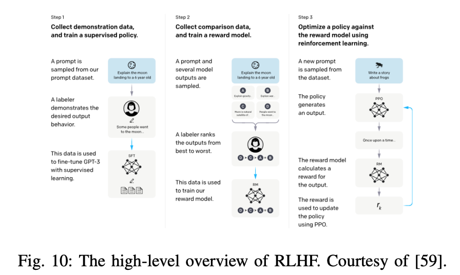

가장 큰 마일스톤인 ChatGPT는 InstructGPT의 자매 모델로 GPT-3.5, GPT-4 모델로 구동됩니다.

GPT-4는 최근의 가장 강력한 llm 모델로 텍스트 뿐만 아니라 이미지도 입력으로 받아 텍스트를 생성하는 멀티모달 모델입니다. 하지만 여전히 몇몇 도메인에서는 인간의 능력을 뛰어넘지는 못하기 때문에 실제 사용 시나리오에는 많은 도전과제들이 있습니다. 그럼에도 GPT-4는 학문 뿐만 아니라 여러 프로페셔널 도메인에서 인간 레벨을 뛰어넙고 있습니다. 
GPT-4는 이전의 GPT 모델들 처럼 처음으로 대규모 코퍼스 데이터에서 next token prediction으로 사전학습되었으며 RLHF 을 바탕으로 파인튜닝된 모델입니다.

#### 2) LLaMA Family
LLaMA는  Meta 에서 공개한 파운데이션 모델로 GPT 모델과 다르게 open-source 이고 noncommercial license를 가지고 있습니다.
LLaMA family는 많은 연구 그룹에서 사용되면서 더 좋은 open-source llm을 만들기 위해 혹은 task-specific llm을 개발하기 위해 빠르게 성장해왔습니다. 

첫 LLaMA 모델은 2023/2 에 공개되었으며 파라미터는 7B~65B 까지 있습니다. 이 모델은 trillion(수조) 토큰에 사전학습 되었으며, 공개적으로 접근 가능한 데이터에서 학습되었습니다. LLaMA는 GPT-3의 트랜스포머 아키텍처에서 약간의 구조 변경을 하여 개발되었습니다. 
- ReLU 대신 SwiGLU activation function 사용 
    - Swish 함수와 GLU를 결합한 형태의 활성화 함수로 Swish 의 부드러운 비선형성과 GLU의 게이팅 매커니즘을 결합하여 모델의 표현력과 학습 성능을 향상 
        - Swish : x*sigmoid(x)
            - ReLU와 달리 모든 입력에 대해 미분 가능하며, 음수 입력에 대해서도 0이 아닌 출력을 생성
        - GLU: (xW+b)*sigmoid(xV+c)
            - 입력 x에 대해 두개의 선형 변환을 수행하고 두번째 선형 변환에 대해 시그모이드 함수를 적용하여 게이트를 생성 
            - 정보의 흐름을 조절하여 학습 효율성 향상 
- absolute positional embedding 대신 rotary positional embedding 사용 
    - absolute positional embedding 
        - 각각의 token x에 position vector p를 더하는 형태
        - trainable vector를 사용하거나 Sinusoid function 을 사용 
    - relative positional embedding
        - position n과 m 사이에 relative distance 를 정의 
        - r = clip(m-n, r_min, r_max) or clip(m-n, r_min, log(m-n))
        - key, query, value에 대해서 trainable position embedding 을 정의 

        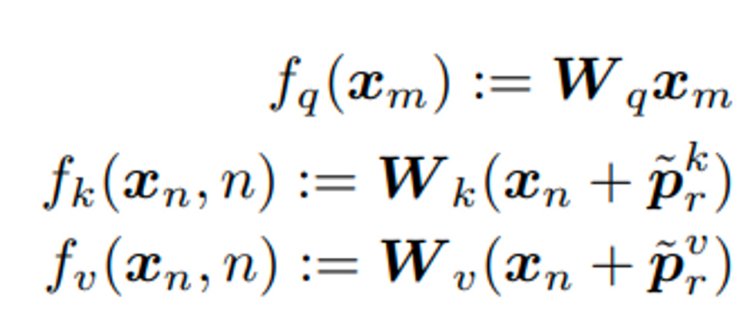

    - rotary positional embedding (RoPE)
        - 2 dim 마다 일정한 angle m을 회전시켜 position information 정보를 담음 (affine transformed word embedding vector)
        - 회전 행렬의 세타값은 sinusoid 와 같은 매핑 함수를 사용 
        - relative 방식과 다르게 더해진 형태가 아니라 곱해지는 형태를 가짐 

        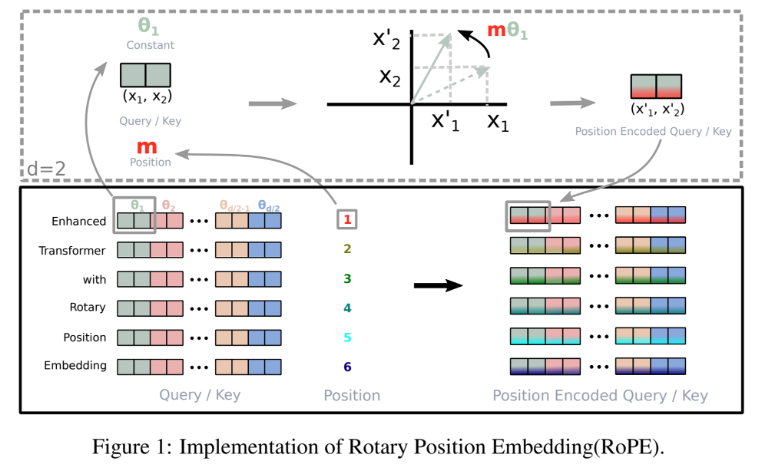

- 일반적인 layer norm대신 root-mean-squared layer norm사용 

오픈소스 LLaMA-13B 모델은 GPT-3(175B) 모델의 성능을 대부분의 벤치마크에서 뛰어 넘었으며 많은 리서치에 좋은 베이스라인이 되었습니다. 

2023년 7월, meta는 microsoft와 파트너쉽을 맺고, LLaMA-2 collection을 공개하였습니다. LLaMA-2 Chat 모델은 많은 공개 벤치마크에서 다른 오픈소스 모델에 비해 뛰어난 성능을 보였습니다. 학습은 아래와 같은 프로세스로 진행되었습니다.

- 공개적으로 사용가능한 온라인 데이터를 사용하여 pre-training
- supevised fine-tuing
- RLHF, rejection sampling, proximal policy optimization을 통해서 점진적으로 최적화
- RLHF에서 가장 중요한것은 사람의 피드백을 축적하여 reward 모델을 수정하는데, rewawrd 모델이 너무 많이 변하는 것을 방지하여 모델 학습이 안정적으로 진행되도록 함

Alpaca는 LLaMA-7B 모델을 GPT-3.5 를사용하여 self-instruct 스타일의 52k개의 instruction-following 데모를 만들어 fine-tune 한 모델입니다. 이는 매우 cost-effective 하며, 특히나 아카데믹 분야에서 두드러집니다. self-instruct evaluation set에서 Alphaca는 매우 적은 파라미터 수에도 불구하고 GPT3.5와 비슷한 성능을 보입니다.

Vicuna team은 shareGPT의 user-shared 대화 모음에서 LLaMA를 파인튜닝한 13B chat model인 Vicuna13B를  개발하였습니다. 성능은 ChatGPT-4 의  92% 성능을 낼 수 있으며, 이는 $300 밖에 되지 않는 학습 비용으로 달성하였습니다. 

Guanaco 모델 역시 LLaMA 모델을 instruction-following data로 파인튜닝한 모델입니다. 하지만 파인튜닝은 QLoRA를사용하여 매우 효율적으로 이루어졌습니다. 이는 65B 모델을 48GB의 gpu 1개에서 개발할 수 있는 효율성입니다. QLoRA는 back-propagate를 고정된 4-bit 로 quantized 된 pre-trained 모델에 LoRA를 사용하였습니다.  이 모델은 Vicuna 벤치마크에서 ChatGPT의 99.3%의 성능을 낼 수 있었습니다. 중요한건 오로지 single gpu로 24시간만을 파인튜닝하였습니다.

Koala도 LLaMA를 파인튜닝한 모델인데, 사용자 input과 ChatGPT 같은 closed-source 모델의 응답간 interation data에 집중했다는 것이 다릅니다. Koala-13B 모델은 SOTA chat 모델과 경쟁력있는 퍼포먼스를 내었습니다.

Mistral-7B 모델은 뛰어난 퍼포먼스와 효율성을 위해 engineered 된 모델입니다. 이 모델은 모든 평가 벤치마크에서 best open-source 13B 모델(LLaMA-2-13B)를 능가하였습니다. 

이모델은 grouped-query attention을 사용하여 더 빠른 inference를 가능하게 하였으며, sliding window attention을 사용하여 임의 길이에 대해서 inference cost를 줄이며 효율적으로 처리할 수 있었습니다. 

- GQA (Grouped Query Attention): Multi-Head Attention(MHA)과 Multi-Query Attention(MQA)의 장점을 결합하여 모델 성능을 유지하면서 추론 속도를 향상시키는 것을 목표로 함
    - MHA: 여러개의 q, k, v 헤드를 사용하여 다양한 표현 공간에서 정보를 추출. 표현력을 높일 수 있지만, 높은 계산 비용과 메모리 사용량
    - MQA: 여러 q 헤드에 대해 단일 k,v 헤드를 공유하여 추론 속도를 높이고 메모리 사용량을 줄임. but 모델의 성능 저하
    - GQA: 여러 쿼리헤드를 여러 그룹으로 나누고, 각 그룹이 하나의 키와 값 헤드를 공유하는 방식으로 MHA와 MQA의 중간 지점을 찾아 성능과 효율성 간의 균형을 맞춤

또다른 LLaMA Family: Code LLaMA, Gorilla, Giraffe, Vigogne, Tulu 65B, Long LLaMA, Stable Beluga2

#### 3) The PaLM Family

Pathways Language Model 패밀리는 Google에 의해 개발되었습니다. 첫번째 PaLM 모델은 2022/4 에 발표되었으며, 2023/3 까지 private 였습니다. 540B 파라미터를 가진 트랜스포머기반의 LLM 모델입니다. 이는 6144 TPU v4 chips 로 Pathway 시스템에서 학습되었습니다.  

U-PaLM 모델은 다양한 디노이징 목표를 혼합하는 UL2 기법을 사용하여 학습 시킨 모델입니다. 이는 2배 이상 계산 비용을 세이브할 수 있었습니다.

Flan-PaLM은 더많은 테스크에서 instruction finetuning이 수행되었으며, 더큰 모델, CoT 데이터를 사용하였습니다. 

PaLM-2는 multilingual, reasoning 능력에서 더 좋은 계산 비용으로 더 나은 성능을 보였습니다. 이는 PaLM-2 는 다양한 목적함수로 학습되었다. 

Med-PaLM은 domain-specific PaLM 이고, 매디컬 도메인에 특화된 모델입니다.

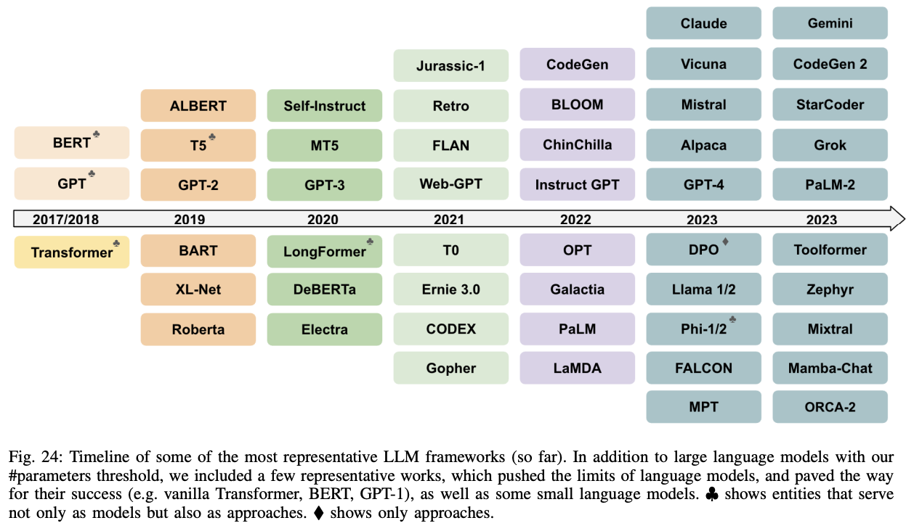

## How LLMs Are Built

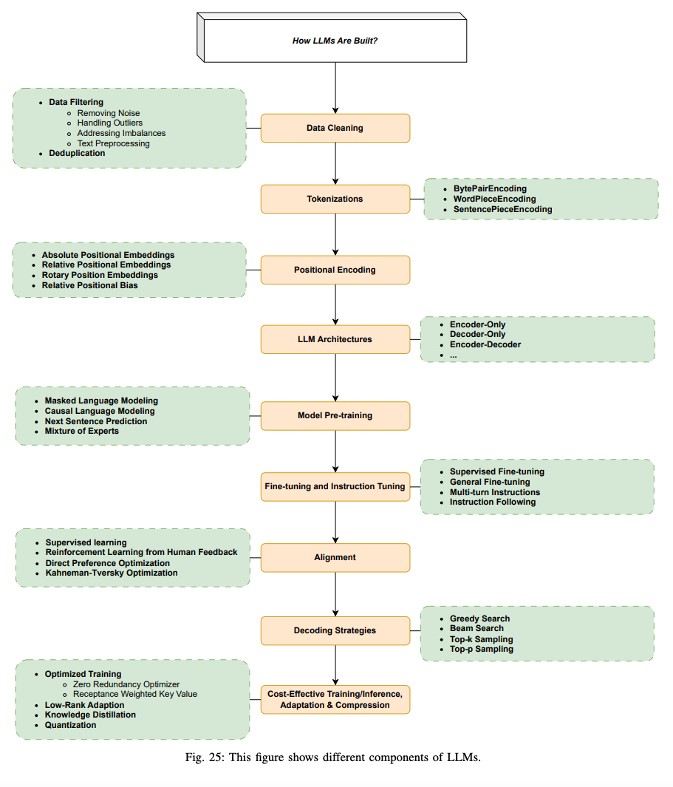

이번 섹션에서 유명한 LLM 아키텍처를 먼저 리뷰하고, 데이터와 모델링 테크닉 (데이터 준비, 토큰화, 사전 학습, intruction tuning, alignment) 등에 대해서 논의할 것입니다. 

### A. Dominant LLM Architecture

LLM 구조에서 가장 많이 쓰이는 구조는 encoder-only, decoder-only, encoder-decoder 구조입니다. 대부분은 Transformer를 빌딩 블록으로 사용하고 있습니다.

#### 1) Transformer
이 구조는 GPU를 사용하여 효율적으로 병렬프로세싱을 가능하게 하기위해 디자인 되었습니다. 핵심 구조는 (self-) Attention 매커니즘으로, long-term contextual information을 GPU를 사용하여 기존의 recurrence 나 convolution 매커니즘보다 훨씬 효율적으로 포착할 수 있습니다. 

트랜스포머 모델은 원래 encoder와 decoder로 이루어진 기계번역을 위해 제안되었습니다. 인코더는 transformer layer를 6개 쌓았으며, 각각의 레이어는 두개의 sub layer를 가지고 있습니다. 첫번째 것은 multi-head self-attention 레이어, 다른 하나는 간단한 position-wise fully connected feed-forward network 입니다. 디코더는 5개의 레이어를 쌓았으며, 디코더는 encoder 레이어 대비 추가로 세번째 서브 레이어인  multi-head attention으로 encoder stack의 출력을 사용합니다.

Attention 매커니즘은 입력 시퀀스에서 중요한 부분에 집중하여 모델의 성능을 향상시키는 기법입니다. 
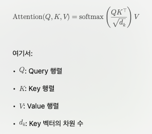

Query, Key 간의 내적을 통해 유사도를 계산하고 이를 스키일링 한 후 Softmax를 적용하여 가중치를 얻습니다. 마지막으로 이 가중치를 Value에 곱하여 최종 어텐션을 출력합니다. encoder-decoder attention의 경우에는 쿼리를 디코더의 현 시점의 은닉상태, key, value는 인코더의 출력을 사용합니다.  

이때 쿼리, 키, 값은 각각의 학습 가능한 가중치 행렬로 선형 변환되어 구해집니다. 

#### 2) Encoder-Only
어텐션 레이어는 문장의 모든 단어에 접근할수 있습니다. 사전 학습을 위해서 주어진 문장에서 랜덤하게 마스킹하여, 원래 문장을 재건하는 방식으로 학습됩니다. encoder 모델은 전체 문장을 이해하는 테스크에 좋은 성능을 보입니다. (classification, entity recognition, extractive question answering)
가장 유명한 모델은 BERT 입니다.

#### 3) Decoder-Only
어텐션 레이어는 오직 현재 단어의 이전 단어들의 정보에만 접근하여 학습될 수 있습니다. 이 모델은 auto-regressive 모델이라고도 불립니다.
모델의 사전학습은 대게 다음 토큰을 예측하는 방식으로 학습됩니다. 이 모델은 text generation 테스크에 적합합니다. GPT가 가장 유명한 모델입니다.

#### 4) Encoder-Decoder
이 모델은 때로 sequence-to-sequence 모델이라고 불립니다. 인코더의 어텐션 레이어는 모든 단어에 대해 접근 가능하지만 디코더 레이어의 어텐션레이어는 오직 이전 단어들에만 접근이 가능합니다. 이 모델은 인코더, 디코더 모델의 목적 함수를 가지고 학습하지만, 대게 더 복잡합니다. 예를들어 어떤 모델은 텍스트의 일정 스팬을 랜덤하게 교체하고, 이 텍스트가 교체된 것인지 예측하는 방향으로도 학습됩니다. 이 모델은 주어진 입력에 대해새 새로운 문장을 생성하고나, 요약, 번역, 생성적 question answering 등에 사용됩니다.

### B. Data Cleaning

language model의 성능에 가장 큰영향을 끼치는 것은 데이터의 질입니다. Data cleaning 테크닉 (filtering, deduplication) 등은 매우 중요합니다.
예를들어 Falcon40B 모델은 적당히 필터링되고 웹데이터에서 중복을 없애서 파워풀한 모델을 만들 수 있음을 보여주었습니다. 강력한 필터링에도 불구하고 CommonCrawl 데이터에서 5조개의 토큰을 여전히 얻을 수 있었습니다.

#### 1) Data Filtering
- Removing Noise: 관련 없거나 노이지한 데이터를 제거함으로써, 모델이 더 일반화할 수 있도록 돕는 작업입니다. 예를들어 틀린 정보를 지움으로써 모델이 틀린 응답을 생성할 기회를 줄이는 것과 같습니다. quality filtering의 메인 스트림은 다음과 같이 두가지 프레임 워크로 나눠집니다.
    - Classifier-based framwork
    - Heuristic-based framework

- Handling Outlierts: 아웃라이어를 찾고 처리함으로써 모델에 불균형한 영향을 끼치지 않도록 합니다. 
- Addressing Imbalances: 데이터의 클래스, 카테고리에 대한 분포를 균형시킴으로써, 바이어스를 피하고, fair한 표현력을 가능하게 합니다. 
- Text Preprocessing: stop words, punctuation 등을 지우는 등 Cleaning, Standardizing을 함으로써 불필요한 요소가 모델의 학습에 기여하지 않도록 합니다.
- Dealing with Ambiguities: 모델의 훈련 중 혼란을 줄수 있는 모호하거나 모순적인 데이터를 제거하여 신뢰성 있는 답변을 생성하도록 할 수 있습니다. 

#### 2) Deduplication
중복되는 instance를 지우거나 반복되어 등장하는 같은 데이터를 지우는 과정을 뜻합니다. 중복되는 데이터는 모델에 바이어스를 줄 수 있고, 다양성을 해칠 수 있습니다. 결국에는 특정한 instance에 overfitting 하게 할 수 있습니다. 몇가지 작업들은 de-duplication이 모델의 일반화 성능을 개선할 수 있음을 보입니다. 

중복은 의도하지 않게 특정 패턴의 중요도를 부풀릴수 있습니다. 이는 특히나 다양하고 표현력 있는 학습데이터가 중요한 NLP 테스크와 연관있습니다.

중복을 제거하기 위한 방법은 모델이 요구하는 것에 따라서 달라질 수 있습니다. 전체의 데이터 포인트나 특정한 특징을 비교하여 제거하는 방법이 될 수 있습니다. document level 에서는 overlap ratio 는 일반적으로 n-gram overlap과 같은 high-level feature 애 의존합니다. 

### C. Tokenizations

토큰화는 문장의 텍스트를 더 작은 파트인 토큰으로 변환하는 작업을 뜻합니다. 가장 간단한 토큰화 툴은 단순히 space 에 따라서 나누는 것입니다. 이는 word dictionary에 의존합니다. 하지만 Out-of-vocabulary(OOV)라는 문제가 생길 수 있습니다. 왜냐하면 오직 dictionary에 있는 단어만을 토큰화할 수 있기 때문입니다. dictionaries의 커버리지를 증가시키기 위한 가장 유명한 토크나이저는 sub-words 기반 방식입니다. 다음은 가장 많이 쓰이는 토크나이저에 대한 설명입니다.

#### 1) BytePairEncoding
원래 데이터 압축을 위해 개발된 알고리즘으로, 자주 등장하는 문자 패턴을 결합하여 데이터를 효율적으로 표현합니다. 특징은 아래와 같습니다.
- 자주 등장하는 단어는 원래 형태를 유지하여 어휘 집합의 크기를 효율적으로 관리
- 빈도가 낮은 단어는 더 작은 단위로 표현함으로써 새로운 단어에 대한 처리를 용이하게 함
- 어휘 집합의 크기를 적절하게 유지하면서, 다양한 표현을 가능하게 함

#### 2) WordPieceEncoding
이 알고리즘은 훈련 데이이터에 등장하는 모든 문자를 초기 어휘로 설정합니다. 자주 등장하는 문자 쌍을 결합하여 새로운 토큰을 생성하고, 이를 어휘에 추가함으로써 어휘를 확장합니다. 빈도가 낮은 단어는 더 작은 단위로 분해하여 표현하여 새로운 단어에 처리를 용이하게 합니다. 

#### 3) SentencePieceEncofing
위에서 언급한 BPE, WPE는 모두 항상 공백으로 구분된다는 가정을 기반으로 설계되었습니다. 그러나 이런 가정은 모든 언어에 적용되지 않습니다. 한국어, 중국어, 일본어 같은 언어에서는 단어 사이 명확한 공백이 없거나, 불필요한 공백이나 새로운 단어가 포함될 수 있습니다. 이러한 문제를 해결하기 위해 개발된 토크나이저입니다. 여기서는 공백조차도 하나의 문자로 간주합니다. 

BPE나 unigram 모델을 활용하여 빈도가 높은 문자 또는 서브워드를 병합하여 어휘를 구성합니다. 

입력 텍스트를 단순히 연속된 문자들의 나열로 간주하고 처리하기 때문에 특정 언어에 대한 사전 작업이 필요 없습니다. 

### D. Positional Encoding
#### 1) Absolute Positional Embeddings
이 방법은 오리지널 트랜스포머 모델에서 사용된 방식으로 원래 시퀀스 순서 정보를 보존하기 위해 사용되어져 왔습니다. 그래서 이러한 포지션 정보가 input embedding에 encoder과 decoder의 밑 스택에서 더해졌습니다. 학습 가능하게 하거나 고정되게 하거나 등 다양한 옵션이 있습니다. 가장 간단한 트랜스포머에서는 sine, cosine 함수를 사용합니다. 이 방법의 가장 큰 단점은 특정한 토큰수로 제한된다는 것입니다. 게다가 이 방법은 토큰간의 상대적 거리를 고려하지 못합니다.

#### 2) Relative Positional Embeddings (RPE)
이 방법은 단어간의 상대적인 거리 정보를 반영하기 위한 기법입니다. 문장을 완전 연결 그래프로 보고 각 단어를 노드로, 단어간의 관계를 간선으로 표현합니다. 간선은 방향성과 레이블을 가질 수 있으며 레이블이 상대적 거리 정보를 나타냅니다. 
이 정보는 어텐션의 keys, values에 추가됩니다. 이를 통해 훈련 데이터에 없는 시퀀스 길이에도 합리적인 예측을 수행할 수 있습니다. Clipping distance k를 사용하여 너무 먼 거리에 있는 단어 간의 상호작용을 무시할 수 있도록 할 수 있습니다. 

#### 3) Rotary Positional Embedding (RoPE)
기존 위치 임베딩 방식이 가진 한계를 극복하기 위해 설계된 기법으로 단어의 절대적 위치 정보와 상대적 위치 정보등을 동시에 효과적으로 인코딩하기 위한 방식입니다. 이방법은 특히 긴 문장과 다양한 길이의 문장에 더 유연하게 동작합니다. 
회전행렬을 사용하여 단어의 위치 정보를 인코딩 합니다. 
이는 단어 임베딩에 rotation transformation을 적용하여 위치 정보를 추가합니다. 각 단어의 위치에 따라 벡터 공간에서 다른 방향으로 회전시킵니다. 회전변환은 단어간의 상대적 위치를 내포하므로 상대적 거리 정보가 어텐션 연산에서 자동으로 반영됩니다. 
회전행렬의 각도는 절대적 위치 표현과 마찬가지로 pos/10000^(2i/d) 를 사용합니다. 
각 쿼리와 키에 대해서 회전 변환을 수행한 후 어텐션 점수를 계산합니다. 
GPT-NeoX-20B, PaLM, CODGEN, LLaMA 등의 모델이 이 방법을 사용하였습니다. 

#### 4) Relative Positional Bias

입력 토큰간의 상대적 거리정보를 어텐션 점수에 반영하는 방법입니다. 이는 특히 ALiBi(Attention with Linear Biases) 개념을 기반으로 설계되어 학습시 보지 못했던 더 긴 시퀀스에도 일반화 성능을 보입니다. 

구체적으로 쿼리와 키의 유사도를 계산할 때 상대적인 거리값에 따라 추가적인 패널티 또는 보너스를 부여합니다. 

Score(Q, K) = QK.T + a*(-|i-j|)

이 연산은 매우 간단하여 기존 연산에 대해 큰 오버헤드가 없습니다. BLOOM 모델이 이방법을 사용하였습니다.

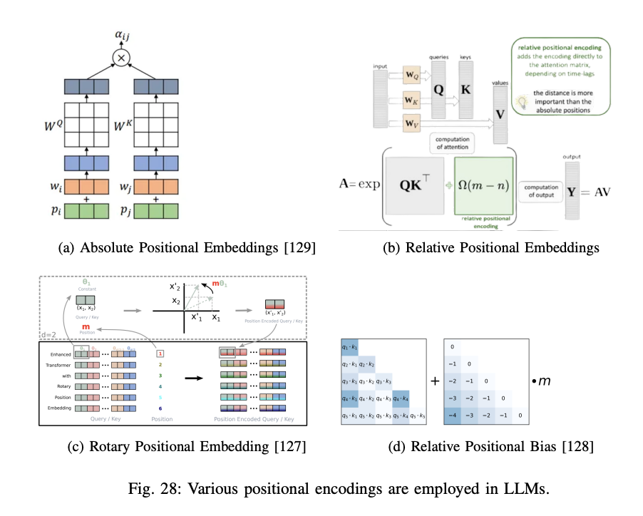

### E. Model Pre-training
LLM 학습 파이프라인의 첫 스텝으로 fundamental한 language understanding 능력을 갖게 해줍니다. 사전 학습 단계에서 LLM은 매우 방대한 양의 unlabeled 텍스트로 학습이되고 보통 self-supervised(라벨이 없는 데이터에서 특정한 목표를 설정하여 모델을 학습시키는 방식으로, 데이터 자체에서 학습에 필요한 신호를 만들어냅니다) 방식으로 학습됩니다. 

next sentence prediction, two most common ones include, next token prediction, maked language modeling 등과 같은 서로다른 방식들이 있습니다. 

- Autoregressive Language Modeling 프레임워크에서 가장 유명한 loss function은 log-likelihood를 사용하는 것입니다. 이 방법은 주로 decoder-only 모델에 더 적합합니다.

- Masked Language Modeling은 시퀀스의 일부 단어들을 마스킹하고 이 마스킹된 단어를 주변 컨텍스트를 이용해 예측하는 것입니다. 몇몇 사람들은 이 방법을 denoising autoenconfing 이라고도 부릅니다. 

- Mixture of Experts (MoE)는 모델을 더 작은 컴퓨팅 자원으로 사전학습할 수 있게 합니다. 이 뜻은 우리는 똑같은 컴퓨팅 자원 budget으로 더큰 모델로 또는 더큰 데이터셋으로 dense model처럼 키울 수 있다는 말입니다. MoE에는 두가지 메인 요소가 있습니다.
    - Sparse MoE Layers: feed forward network 레이어를 사용하는 대신 특정 수의 experts를 갖습니다. 이 experts는 단순 FFN 보다 복잡한 neural network 입니다.
    - A gate network or router: 토큰들이 어떤 expert로 보내질지 결정하는 역할을 합니다. 한개 이상의 expert로 보낼수 있습니다. 라우터는 학습된 파라미터로 구성되어 있으며, 다른 네트워크들과 함께 학습됩니다. 

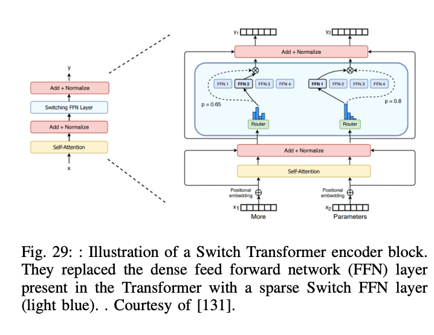

### F. Fine-tuning and Instruction Tuning

잘 사전학습되었더라도 특정한 테스크에는 잘 작동하지 않을 수 있습니다. 그래서 이를 위해 labeled data에다가 fine-tuned을 진행하게 됩니다. 이를 Supervised Fine-tuning (SFT) 라고 부릅니다. 하지만 최근 LLM의 경우에는 이런 추가 파인튜닝 없이도 매우 좋은 결과를 낼 수 있게 되었지만 domain-specific 테스크에 대해서는 더 작은 모델을 finetune 한것이 더 큰모델 보다 성능이 더 좋음이 밝혀졌습니다.

fine-tuning이 중요한 이유는 응답을 사람의 기대에 맞게 align 할 수 있기 때문입니다. instruction tuning이 그중 하나입니다. instruction은 llm이 달성해야하는 특정 작업을 지시하는 prompt입니다. intruction tuning dataset (Natural instructions)은 task definition을 포함해야할 뿐만 아니라 positive/negative 예시 또한 포함하고 있어야 합니다. 

Self-Instruct 방법은 모델 자체 생성 능력을 활용하여 지시문과 그에 따른 입력/출력을 생성하고 이를 통해 모델을 미세조정하는 과정을 포함합니다.
주요 단계는 초기에는 소수의 인간이 작성한 지시문을 사용하여 프롬프트 하여 지시문을 생성하고, 이에 대해 모델은 입력과 예상 출력을 생성합니다. 그리고 생성된 지시문, 입력, 출력 중 유효하지 않거나 중복되는 것을 제거하고 해당 데이터로 미세조정합니다. 

### G. Alignment
Alignment는 LLM을 인간의 목적과 선호, 원칙에 맞게끔 조정하는 프로세스입니다. word prediction으로 LLM을 사전훈련 시킬 경우 종종 의도하지 않은 행동을 만들어 낼 수 있습니다. 

위에서 언급한 instruction tuning 같은 경우에는 LLM을 더 align 하는 역할을 하지만, 많은 경우에 더 많은 스텝을 사용하여 모델을 더 alignment 해야합니다. 

RLHF (Reinforcement Learning from Human feedback), RLAIF(reinforcement learning from AI Feedback)은 가장 유명한 접근 방법입니다.
RLHF은 보상모델을 사용하여 인간의 피드백을 학습하고, 서로다른 출력에 대해서 다른 점수를 줄 수 있게 됩니다. 보상 모델은 original 모델에게 피드백을 주고 LLM은 이 피드백을 이용하여 학습합니다. RLAIF는 직접적으로 사전학습되고 더 크고 잘 align된 모델을 LLM에 연결하여 학습합니다. 

또다른 최근 방법인 DPO 에서는 RLHF가 종종 너무 복잡하고, 안정적으로 학습할 수 없음을 해결하기 위한 새로운 방법입니다. 

Direct Preference Optimization (DPO)은 보상함수와 최적 정책사이의 수학적 관계를 이용하여 인간의 선호 데이터를 기반으로 모델을 직접 최적화합니다. 기존의 RLHF는 보상모델을 학습하고, 이를 이용해 언어모델을 강화학습하는 두단계를 거쳤습니다. 하지만 DPO는 이러한 과정을 단일 단계의 분류 문제로 변환하여 인간 선호 데이터를 직접 활용합니다. 

DPO의 주요 특징

- 인간 선호 데이터 수집: 모델이 생성한 두개의 응답을 사람에게 보여주고 더 나은 응답을 선택하도록 합니다. (pairwise)
- 주어진 쌍의 데이터에서 더 나은 응답을 분류하는 문제로 변환 
- 더 나은 응답을 선택하는 정책을 최적화하는데 이는 CrossEngropy Loss를 사용하여 효율적으로 수행될 수 있습니다. 

최근에는 Kahneman-Tversky Optimization (KTO) 접근 법이 나왔습니다. 이는 기존 방법들과 달리 쌍 형태의 선호도 데이터 없이도 모델을 효과적으로 조정할 수 있습니다.

KTO는 입력과 출력에 대해 해당 출력이 바람직한지 여부만을 필요로 합니다. (Good or Bad) 따라서 Logistic Loss만을 사용하여 학습될 수 있습니다. 데이터 수집비용이 DPO에 비해서 더 낮고 효율적인 방식입니다. 

### H. Decoding Strategies

language model은 token ID를 input과 예측으로 사용합니다. 모델은 logits를 생성하고 이는 softmax function을 사용하여 확률로 표현이 됩니다. 여러가지 서로다른 디코딩 전략들이 제안되어 왔습니다.

#### 1) Greedy Search
각 스텝에서 가장 확률이 높은 토큰을 선택합니다. 이는 모든 가능한 모든 path의 potential option을 무시하는 방법입니다. 이는 매우 간단하지만, temporal consistency, coherency를 잃을 수 있는 방법이기도 합니다. 

#### 2) Beam Search
greedy search와 다르게 다음 N개의 가장 probable token을 고려합니다. 이 프로세스는 미리 정의된 최대 길이나 EOS 에 도달할때까지 반복됩니다. 토큰들의 시퀀스는 가장 높은 점수를 가진 것만 선택이됩니다. 
예를들어 beam size가 2, max length가 5라면 beam search는 2^5 = 32 개의 가능한 시퀀스를 트랙킹합니다. 

#### 3) Top-k sampling 
이는 llm으로부터 생성된 확률 분포를 이용하는 방법입니다. k most option으로부터 랜덥하게 토큰을 선택합니다.
예를들어 우리는 6개의 토큰 (a,b,c,d,e,f)가 있다고 하고 k=2 일때 p(a)=30%, p(b)=20%, p(c)=p(d)=p(e)=p(f)=12.5% 일 경우 c,d,e,f는 무시되고, a가 60%, b가 40%로 출력됩니다. 이 방법은 가장 가능한 토큰을 우선순위에 두면서 여전히 randomness를 selection process에 소개할 수 있습니다.

이러한 Randomness는 종종 temperature 컨셉을 통해 소개됩니다. temperature T는 0-1 사이의 값을 가지며, softmax 함수로부터 생성되는 확률에 영향을 미칩니다. 이는 가장 확률이 높은 토큰의 영향력을 조절합니다. 

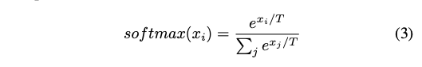

낮은 온도 설정은 확률 분포를 크게 변경하며 (이는 창의성 설정으로 사용됩니다.), 높은 온도 설정은 가장 높은 확률의 토큰에 우선순위를 둡니다. Top-k는 샘플링의 창의적인 방법이며, 빔 서치와 함께 사용될 수 있습니다. 시퀀스는 top-k sampling 으로 선택됩니다. 기억해야할 것은 highest score 이 항상 진짜같고 의미있는 시퀀스를 생성하지는 않는 다는 것입니다.

#### 4) Top-P sampling

이는 Nucleus sampling 이라고도 알려져 있는 방법으로 top-k 와는 약간 다릅니다. 이 방법은 선택된 토큰의 확률값이 p 를 초과하도록 컷오프 p 값을 설정합니다. 이는 다음의 토큰을 무작으로 생성할 수 있는 핵을 생성합니다. 다른 말로하면, 토큰들의 확률을 descending order로 나열하고 확률값의 합이 p 를 넘을 때까지 토큰 후보로 추가합니다. 이 방법은 top-k의 토큰의 확률 질량이 너무 크지 않을때 좋습니다. top-k 와 다르게 토큰의 갯수는 고정되지 않습니다. 그래서 더 다양하고 창의적인 결과를 생성할 수 있습니다.  

### I. Cost-Effective Training/Inference/Adaptation/Compression

#### 1) Optimized Training

- ZeRo(Zero Redundancy Optimizaer): 대규모 언어모델의 효율적 훈련을 위해 메모리 사용을 최적화하는 기술입니다. 기존의 데이터 병렬화와 모델 병렬화 방식에는 메모리 중복이 발생하여 대규모 모델 훈련에는 제약이 있었습니다. 
    - 주요 특징: 모델의 상태 (파라미터, 그래디언트, 옵티마이저 상태)를 데이터 병렬 프로세스간에 분할하여 메모리 사용을 최적화합니다. 또한 all-reduce, all-gather 등 통신 패턴을 최적화하여 통신 오버헤드를 최소화하여 높은 계산 효율성을 유지합니다. 장치 수에 비례하여 모델크기를 확장할 수 있어 대규모 모델 훈련이 가능해집니다. 

- RWKV(Receptance Weighted Key Value): 트랜스포머의 병렬 학습 효율성과 RNN의 추론 효율성을 결합한 새로운 모델 아키텍처입니다. 이 모델은 선형 어텐션 메커니즘을 활용하여 학습시에는 트랜스포머처럼 병렬처리가 가능하고, 추론시에는 RNN 처럼 효율적인 연산을 수행합니다.
    - 선형 어텐션이란? 기존 어텐션 메커니즘은 입력 시퀀스가 길어질수록 계산량이 급격이 증가하는 이차 복잡도를 가지지만, 선형 어텐션은 이를 선형 복잡도로 개선하여 긴 시퀀스 처리에 효율적입니다. 쿼리와 키를 특정 함수로 변환한 후, 이 변환된 값들을 이용하여 어텐션을 계산합니다. 

    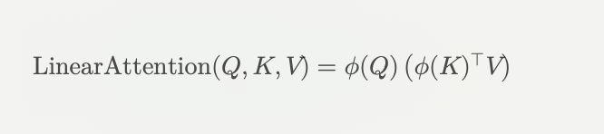
    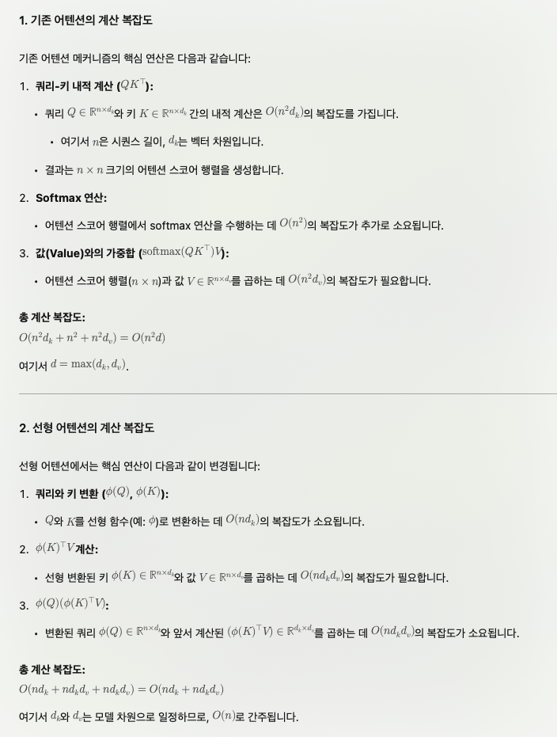

    - RNN이 inference 시 효율적인 이유: 시간축을 따라 한단계씩 처리하기 때문에, 이미 처리한 부분은 재계산하지 않아도 됩니다. 또한 hidden state만 유지되면 되므로, 이전 시퀀스들의 모든 데이터를 계속 저장할 필요 없습니다. 
    - RNN구조에 Linear Attention 을 성공적으로 통합하여 Gradient vanishing 문제를 해결하고 긴 시퀀스에서 메모리 효율성을 가져감 

#### 2) Low-Rank Adaption (LoRA)
이 방법은 학습 파라미터수를 크게 감소시킬수 있는 유명한 lightweight 학습 방법입니다. 이 방법은 모델이 모든 가중치를 업데이트하는 대신 사전 학습된 모델의 가중치는 고정하고 각 레이어에 학습가능한 low-rank 행렬을 추가하여 필요한 파라미터수를 크게 줄입니다. 핵심 아이디어는 미세 조정된 가중치와 초기 사전학습된 가중치간의 차이가 intrinsic rank를 가진다는 점입니다. 즉 이차이는 두개의 작은 행렬 곱으로 근사할 수 있습니다. 전체 가중치를 업데이트하는 대신 이 두 작은 행렬만 학습함으로써 계산 효율성을 높일 수 있습니다. 

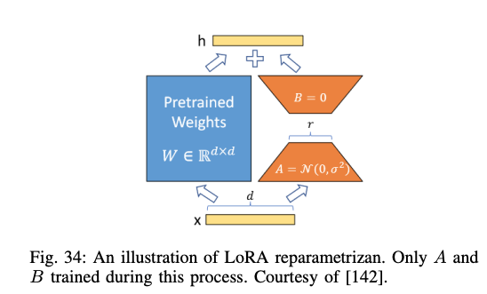

사전학습된 모델의 가중치는 `W0 (dxk)`를 가진다고 가정했을때 LoRA는 `W0 + delta W = W0 + BA`, `B (dxr), A (rxk), r << min (d, k)` 로 표현할 수 있습니다. 
보통 A에 대해서는 Random Gaussian init 을 수행하고, B에 대해서는 Zero init을 수행합니다. 그래서 학습 처음에 `BA` 값은 0으로 시작할 수 있습니다. 이는 어떠한 matrices 서브셋에도 적용할 수 있습니다. 예를들어 트랜스포머는 Wk, Wv, Wq 등 어켄션 모듈의 메트릭이 있고, 두개의 MLP 모듈이 있습니다. 대부분은 LoRA는 attention 에 적용하는 것에 집중해왔습니다. 

#### 3) Knowledge Distillation
대규모 Teacher model 의 지식을 소규모의 Student 모델로 이전하여 작은 모델이 큰 모델의 성능을 모방하도록 학습시키는 방법입니다. 이방법은 복잡하고 계산 비용이 높은 모델을 경랼화 하여 모바일 장치와 같은 자원 제한적인 환경에서도 효율적으로 활용할 수 있게 합니다. 여기서 핵심은 Teacher model이 예측한 Soft target을 모델의 학습에 활용하는 것입니다. 여기서 지식은 다양한 형태로 전해질 수 있습니다. 

- response distillation: teacher model의 출력 결과만을 전달
- feature distillation: last layer 뿐만 아니라, intermediate layer 도 함께사용 
- API distillation: LLM provider의 결과를 사용하여 학습데이터를 만듦

#### 4) Quantization
모델의 weight의 precision을 줄임으로써 모델 사이즈를 줄일 뿐만 아니라 속도를 늘릴 수 있습니다. 예를 들어 Float-32 는 Int8 대비 더 느립니다. 이러한 프로세스를 quantization이라고 부릅니다. 이는 서로다른 phase 에 적용될수 있습니다. 주요 접근 방법은 두가지로 나눠집니다.
- post training quantization: 학습된 모델에 양자화를 적용하는 방법으로 추가적 학습 없이 모델을 정수로 변환합니다. 정확도 저하가 발생할 수 있습니다. 
    - Dynamic: quantization range를 runtime에 계산함으로 static 보다 속도가 느립니다.
    - Static: 대표적인 데이터셋을 사용하여 양자화 범위를 사전에 계산합니다. 추론 속도가 빠르지만, 추가적인 데이터가 필요합니다. 
- quantization-aware training: 학습중에 quantization 기준을 넣는 것입니다. 이 방법은 모델이 학습 후에 quntized 된 상태에도 좋은 성능을 보장할 수 있습니다. 

부동소수점 수는 컴퓨터에서 실수를 표현하기 위해 사용되며, 일반적으로 부호 비트, 지수부, 가수부로 구성됩니다. 각각의 부동소수점 형식은 이러한 구성 요소에 할당된 비트 수에 따라 표현 범위와 정밀도가 결정됩니다. 아래는 FP32, FP16, FP8, FP4, bFP16과 같은 자료형의 지수부와 가수부 비트 수에 대한 설명입니다:

| 자료형	| 총 비트 수 |	부호 비트	| 지수부 비트 수(exponent)	| 가수부 비트 수 (mantissa) |
| ---- | ---- | ---- | ---- | ---- |
| FP32	| 32 | 	1 | 	8	| 23 |
| FP16	| 16 |	1 |	5 |	10 |
| FP8	| 8 |	1 |	4 또는 5 |	3 또는 2 |
| FP4	| 4	| 1	| 2	| 1 |
| bFP16	| 16 |	1	| 8	| 7 |

- FP8은 E4M3, E5M2 변형이 있습니다. 
- bFP16은 FP32와 동일한 지수부를 가지며, FP16보다 넓은 표현 범위를 제공합니다.

### IV. How LLMs Are Used and Augmented

#### A. LLM Limitations
- 상태/기억 부재: 이전 프롬프트의 정보를 자체적으로 기억하지 못하므로 연속적인 맥락이 필요한 작업에는 제한적입니다.
- 확률적 특성: 동일한 프롬프트에 여러번 요청하면 다른 응답이 나올 수 있습니다.
- 정보의 최신성 부족: 최신 정보나 현재 시점의 데이터를 자체적으로 접근할 수 없습니다.
- 모댈 크기와 비용: 매우 크기때문에 학습과 서비스 제공에 많은 GPU 자원이 필요합니다. 
- 환각(Hallucination): 진실애 대한 개념이 없으며 신뢰할 수 없는 정보를 생성할 수 있습니다. LLM에서 환각은 아래와 같은 두가지 카테고리로 분류 될 수 있습니다
    - Intrinsic Hallucination
    - Extrinsic Hallucination