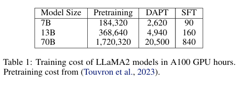

ChipNeMo는 LLM을 chip design 산업에 적용하기 위한 탐구를 목표로 합니다. 상용 또는 오픈 소스 llm을 직접 배포하는 대신, 다음과 같은 domain adaption 테크닉을 적용하였습니다. 
- domain-adaptive tokenization
- domain-adaptive continued pretraining
- model alignment with domain-specific instruction
- domain-adapted retrieval models

저자는 선택한 세가지 llm 어플리케이션에 칩디자인을 위한 위의 방법들을 평가하였습니다. 
- engineering assistant chatbot
- EDA script generation
- bug summarization and analysis 

저자의 평가는 Domain-adaptive pretraining이 도메인과 관련된 다운스트림 테스크에서 LLaMA2 베이스모델에 비해 매우 뛰어난 결과를 낼 수 있음을 서술합니다. 특히 저자의 largest model인 chipNeMo-70B 모델은 GPT-4 모델에 비해서 두가지 케이스(engineering assistant chatbot, EDA scripts generation)에 대해 매우 뛰어는 성능을 보이며, 나머지 bug summarization&analysis 에 대해서도 경쟁력 있는 성능을 보였습니다. 
이러한 결과는 특수 응용 프로그램에서 대규모 언어 모델의 효율성을 향상시키기 위한 domain-specific customization의 잠재력을 강조합니다.

[Paper Link](https://arxiv.org/pdf/2311.00176)

## Introduction

몇십년 동안, electronic Design Automation (EDA) 알고리즘과 툴은 칩 디자인의 생상성을 크게 향상시켜왔습니다. 무어의 법칙(트랜지스터의 밀도가 약 18~24개월마다 두배로 증가)에 의해 제공되는 트랜지스터 밀도의 기하급수적인 증가와 함께 EDA는 수십억개의 트랜지스터로 기능이 풍부한 SoC (System on chip) 설계를 개발할 수 있게 되었습니다. 

최근에 연구자들은 칩 디자인 생성성 향상을 위해 AI를 EDA 알고리즘과 칩 디자인 프로세스에 적용하는 방법을 탐구해 왔습니다. 하지만, natural language 나 programing language 와의 인터페이스를 포함하는 많은 시간 소모적인 칩 설계 작업은 여전히 완전 자동화되지 않았습니다. 

최근의 상업적 모델이나 오픈 소스 LLM 모델들은 언어와 관련된 칩 디자인 테스크들을 자동화 하기 위한 전례없는 기회를 제공하였습니다. 초기 학술 연구에 따르면 LLM을 활용해 간단한 작업을 수행하는 소규모 설계 모듈의 Register Transfer Level (RTL: 하드웨어 설계의 논리적 동작을 기술하는 수준의 코드) 코드를 생성하는 것과, EDA 도구에서 사용할 수 있는 스크립트를 생성하는 것을 탐구하였습니다. 

저자는 LLM이 생성형 AI를 사용하여 코드생성, 자연어 인터페이스를 통한 엔지니어링 질문에 대한 응답, 분석 및 보고서 생성, 버그 분류 같은 많은 언어 관련 칩 설계를 자동화함으로써 칩 디자인의 생산성을 높일 수 있다고 믿고 있습니다. 
그래서 이 연구에서는 세 가지 특정 응용 분야에 초점을 맞추고 있습니다. 
- GPU ASIC, 아키텍처 설계 엔지니어를 위한 엔지니어링 어시스턴트 챗봇
    - 내부 하드웨어 설계를 이해하고, 복잡한 설계 주제를 설명할 수 있음
- EDA 스크립트 생성
    - Python, Tcl 기반의 두 가지 특정 도구를 위한 스크립트 생성
    - 영어로 명시된 VLSI(초대규모 집적회로) 타이밍 분석 작업을 자동화하는데 사용
- 버그 요약 및 분석 
    - 내부 버그 및 이슈 추적 시스템에서 버그를 요약하고 분석하는 역할 

비록 일반적 목적의 LLM은 거대한양의 인터넷 데이터로 학습되어 다양한 도메인의 generative AI 테스크에서 비범한 능력을 보여주었지만, BloombergGPT, BiMedLLM 과 같은 domain-specific LLM 모델이 일반적 목적의 모델 비해 특정 도메인 테스크에 대해 뛰어난 성능을 보여줌을 증명하였습니다. 하드웨어 디자인 도메인에서 오픈소스 모델을 Verilog data에 추가적으로 fine-tuned 되었을때 SOTA OpenAI GPT-3.5 모델 보다 뛰어난 성능을 보였습니다. 이러한 방식으로 커스터마이징한 LLM을 사용할 경우 칩 디자인 데이터를 LLM third party 에게 API를 통해 보낼 위험을 피할 수 있습니다.
하지만, 모든 도메인에 대해 도메인별 모델을 처음부터 훈련하려면 수백만 시간의 GPU 훈련 시간이 필요한 경우가 많기 때문에 엄청나게 비쌉니다.

비용 효율적으로 domain-specific 모델을 학습하기 위해, 저자는 아래와 같은 테크닉들을 결합한 방법을 제안합니다.
- Domain Adaptive Pre-Training (DAPT) with domain-adapted tokenizer
- Model Alignment using general and domain-specific instructions
- Retrieval-Augmented Generation(RAG) with a trained domain-adapted retrieval model


위 그림에서 보이듯이, 저자의 접근 방법은 foundation model로부터 시작합니다. 그리고 DAPT 를 적용하고 모델 정렬을 수행합니다. DAPT는 또한 in-domain 데이터로 continued pretraining 이라고도 알려져 있습니다. 이는 biomedical, computer science publication, news, reviews 등과 같은 영역에 효과적입니다. 우리의 케이스에서, 져쟈는 독점 하드웨어 관련 코드(예: 소프트웨어, RTL, 검증 테스트벤치 등) 및 자연어 데이터 세트(예: 하드웨어 사양, 문서 등) 모음에서 도메인별 사전 학습 데이터 세트를 구성하였습니다.
저자는 raw data를 깨끗히 하고, preprocess를 한다음 foundation 모델을 대상으로 continued-pretrain을 domain-specific data에 진행하였습니다. 그리고 이 결과 모델을 ChipNeMo Foundation model이라고 부릅니다. DAPT 는 사전학습에 사용되는 토큰의 일부에서 수행되며, 훨씬 저렴하여 사전 학습 컴퓨팅의 약 1.5%만 필요합니다.  

LLM tokenizer는 학습과 inference를 위해 text를 token들의 sequence로 변환합니다. domain-adapted tokenizer는 RTL 에서 자주 발견되는 키워드 패턴이나 규칙을 조정하여 토큰화 효율성을 입증합니다. DAPT를 위해서 새로은 domain-specific tokenizer를 처음부터 학습할 수는 없습니다. 왜냐하면 그럴 경우 foundation model을 쓸모없게 만들어 버리기 때문입니다. ChipNeMO를 foubndation 모델에서 사용하는 사전 훈련된 범용 토크나이저로 제한하는 대신, 사전 훈련된 토크나이저를 칩 설계 데이터 세트에 맞게 조정하고 도메인별  용어에 대한 새 토큰만 추가합니다. 

또한, 모델을 chat에 맞게 alignment 해야합니다. 이를 위해서 공개적으로 사용가능한 일반적 목적의 chat instruction dataset을 여러번 작은 양의 domain-specific instruction 데이터와 함께 사용하였습니다. 
이러한 방식이 적합하다는 것을 관찰하였습니다. 저자는 소량의 작업별 지시 데이터를 추가하였는데, 이는 정렬을 더욱 증명합니다. ChipNeMo는 LLaMa2 모델의 변형을 기반으로하여 학습되었습니다. 

엔지니어링 보조 챗봇의 성능을 개선하기 위해 RAG(Retrieval Augmented Generation)도 활용합니다. RAG는 LLM 사용자 쿼리에 대한 정확한 컨텍스트를 제공하기 위한 오픈북 접근방식입니다. 데이터 저장소에서 in-domain 정보를 검색하여, 사용자 쿼리에 대한 응답 생성을 강화합니다. 결정적으로 도메인 데이터로 사전 훈련된 retrieval 모델을 사용하였을 때 검색 적중률이 크게 향상되는 것을 관찰하였습니다. 이로인해 모델 품질이 더욱 향상되었습니다. 

저자의 결과는 Domain adaptive pretraining이 도메인별 작업에서 향상된 성능을 주도하는 주요 기술임을 보여줍니다. 저자는 LLM을 칩설계 도메인에 적용하기 위한 다음과 같은 기여와 지침을 강조합니다. 

- **엔지니어링 어시스턴트 챗봇**: 전문가 평가에서 7점 만점 중 **6.0** 점을 기록.
   - **EDA 도구 스크립트 생성**: 간단한 스크립트 생성의 **70% 이상 정확도** 달성.
   - **버그 요약 및 작업 할당 분석**: 전문가 평가에서 7점 만점 중 **5.0 이상** 점수 획득.

- **ChipNeMo 모델의 성능**:
   - 도메인에 특화된 **ChipNeMo** 모델은 기존의 일반적인 LLM보다 **자동 평가(AutoEval)** 및 **인간 평가** 모두에서 월등한 성능을 발휘.

- **SteerLM 정렬 방식(SteerLM Alignment Method)**:
   - 기존의 **SFT(Supervised Fine-Tuning)** 방법에 비해 챗봇의 인간 평가 점수를 **0.62점** 상승시킴.

- **SFT 개선**:
   - 추가적인 1,400개의 도메인 특화 지침을 사용한 SFT가 **EDA 도구 스크립트 정확도를 18%** 향상.

- **도메인 적응 토크나이제이션**:
   - 도메인 데이터를 효율적으로 압축하여 토큰 수를 **최대 3.3% 감소**시키면서도 성능에는 영향을 미치지 않음.

- **ChipNeMo 검색 모델 성능**:
   - 도메인 특화 데이터를 활용한 **파인튜닝**으로 검색 모델의 히트율을 **30% 향상**, 이를 통해 **RAG(Response-Answer Generation)** 응답의 전반적인 품질도 개선.

## ChipNeMo Domain Adaptation Methods

ChipNeMo는 다양한 domain adaptation 테크닉을 LLM에 적용하였습니다.

### 1. Domain-Adaptive Tokenization

LLaMa2는 SentencePiece 기반의 BPE(Byte Pair Encoding) 토크나이저를 사용하고 있습니다. 
- SentencePiece: Google에서 개발한 토크나이저로 텍스트 전처리를 간소화하기 위해 설계됨. 공백, 특수 문자등 모든 텍스트를 하나의 문자열로 처리
- BPE: 초기에 모든 단어를 char 단위로 나누고 반복적으로 자주 나타나는 char pair를 제한 횟수까지 병합하여 서브워드를 생성하는 알고리즘

주요 목표는 general dataset에서의 language model의 성능을 유지하면서 재학습/파인튜닝에 드는 노력을 최소화하면서도 domain-specific 데이터에서 tokenization 효율성을 개선하는 것입니다. 
이를 위해 다음과 같은 접근 방식을 사용하였습니다.

1. domain-specific 데이터에 토크나이저를 처음부터 학습
2. 새로운 토크나이저의 vocabulary로 부터, general-purpose 토크나이저에 없고 거의 발견되지 않는 토큰을 식별합니다.
    - 새로운 도메인에서 기존 범용 모델에 없는 전문용어, 약어, 기호 등이 많이 나타날 수 있습니다. 이를 기존 토크나이저에 추가하면 모델의 도메인 적응 능력을 높일 수 있습니다. 
3. Step 2에서 식별된 토큰들을 general-purpose 토크나이저에 추가합니다.
    - 예를 들어 "RTL_reg"라는 토큰이 기존 토크나이저에서는 여러 소 단위 토큰으로 분리될 수 있지만, 새롭게 추가하면 하나의 토큰으로 처리됩니다. 
4. 범용 토크나이저를 사용하여 새 토큰의 모델 임베딩을 초기화합니다. 기존의 범용 모델의 정보를 활용하면 학습 속도를 높이고 성능도 더 안정적으로 유지할 수 있습니다. 
    - 임베딩 행렬 E의 크기는 `[vocab_size, embedding_dim]` 에서  `[vocab_size + new tokens, embedding_dim]`으로 확장됩니다. 기존 임베딩은 그대로 유지하고 새로운 토큰에 대한 임베딩 벡터는 초기화가 필요합니다.  
        - 새로운 토큰 ("RTL_reg")을 기존의 범용 토크나이저로 다시 분해합니다: `"RTL_reg" -> ["RTL","_","reg"]`
        - 분해된 각 토큰의 임베딩 벡터를 가져옵니다
        : `embedding("RTL"), embedding("_"), embedding("reg")`
        - 분해된 토큰들의 임베딩 벡터를 평균화하여 새로운 토큰의 초기 임베딩을 만듦니다.
        : `embedding("RTL_reg") = mean([embedding("RTL"), embedding("_"), embedding("reg")])`
    - LLM의 출력층에서 W_out의 크기는 `[hidden_dim, vocab_size]` 에서 `[hidden_dim, vocab_size + new_tokens]` 로 확장됩니다. 따라서 새 토큰에 대한 가중치는 0으로 초기화 합니다
    : `W_out = [기존 단어의 가중치 | 새 토큰 가중치(0으로 초기화)]`


### 2. Domain Adaptive Pretraining

DAPT는 사전 학습된 언어모델을 특정 도메인에 맞게 추가로 학습시켜 해당 분야의 특성을 더 잘 반영하도록 하는 기법입니다. 

이 연구에서 저자는 DAPT를 pretrained foundation base model(LLaMA2 7B/13B/70B)을 대상으로 적용하였습니다. 각 DAPT 모델은 각 파운데이션 모델의 사전학습된 가중치로 초기화되었습니다. 저자는 이 domain-adapted model을 ChipNeMo라고 명명합니다. 위의 Section 1 에서 설명한 tokenizer augmentation을 적용하여 embedding weight을 초기화하였습니다. 그리고 저자는 표준 augo-regressive 언어 모델링 목표를 사용하여 domain-specific data에 대한 추가 사전교육을 수행합니다. 모든 모델 훈련 절차를 NVIDIA NeMo 프레임워크를 사용하여 수행되며, 효율성 향상을 위해 **Tensor Parallelism** 및 **Flash Attention**과 같은 기술을 통합합니다. 

이모델은 유사한 구성으로 일관된 훈련 요법을 거칩니다. 작은 학습률 5*10^-6 이 사용되며 학습률 스케줄러를 사용하지 않고 Adam 옵티마이저를 사용하여 훈련을 촉진합니다. Global Batch Size는 256으로 설정되고 4096 토큰을 context window로 적용되어 Effective Batch Size(한번의 매개변수 업데이트에서 실제로 사용하는 전체 토큰 수=global_batch_size x Context_window_size)는 약 1M 토큰입니다. 총 학습 단계수는 23,200개로 설정되며 이는 데이터 blend의 약 1 epoch 입니다. 


위 그래프는 지정된 하이퍼 매개 변수에서의 훈련 손실을 보여줍니다. 그리고 훈련 손실이 급증하는 것을 관찰합니다. 이러한 불규칙성이 동일한 모델에 대한 유사한 훈련 단계에서, 심지어 다른 모델 크기에서도 일관되게 발생하는 것처럼 보이기 때문에 이러한 급증이 "잘못된 데이터"에 기인할 수 있다고 가정합니다. 이상 현상이 후속 학습 단계를 크게 방해하지 않는 것으로 보였기 때문에 이 문제를 해결하지 않기로 결정했습니다. 

#### A.2 Data Collection Process

- 데이터 소스: 수집된 데이터는 다음과 같은 다양한 소스파일로 구성되어 있습니다
    - 하드웨어 설계관련 파일
        - Verilog, VHDL: 하드웨어 설명언어(HDL)로 작성된 RTL(Register Transfer Level) 코드 및 네트리스트
        - c++, Spice, Tcl, 기타 스크립트 언어 
        - 빌드와 관련돤 구성 파일 (configration files)
    - 내부 웹 서비스 데이터
        - REST API 호출 및 크롤링을 통해 HTML 형식의 데이터를 수집
        - Python BeautifulSoup 라이브러리를 통해 HTML 형식을 제거
        - 코드 예제 손실 방지를 우선시 하면서, 불필요 요소가 포함될 가능성을 감수 
    - 문서 포맷 데이터
        - 일반 문서 형식 `pdf, pptx, docx`도 포함
        - 이를 처리하기 위해 Python 변환 라이브러리와 오픈소스 도구를 사용 

- 데이터 품질 관리: 내부 데이터는 고품질로 간주되어 최소한의 필터링만 적용
    - 라인 수 필터링: 지나치게 크거나 작은 파일은 제외
    - manually written과 tool-generated 된 데이터로 분류 

#### A.3 Training Data 

- 데이터 구성 과정
    - 칩 설계 데이터셋 (내부 데이터셋): 최종적으로 정제된 내부 데이터는 약 231억 토큰을 구성. 데이터는 특정 활용 사례에 제한되지 않았으며, 추가적인 도메인 지식을 포함하여 성능 향상을 목표로 함
    - 공개 데이터셋: wikipedia 데이터를 사용하여 고품질의 자연어 데이터를 확보하고, github 데이터를 사용하여 내부 데이터와 겹치는 프로그래밍언어에 초점을 맞츰. 전체 훈련 토큰의 9.2%를 공개 데이터에서 샘플링.

- Data Blending
    - 내부 데이터는 주로 주석이 없는 코드로 구성
    - 모델의 도메인 지식 이해도를 높이기 위해 코드 데이터의 다운샘플링과 설계문서(자연어 데이터)의 업샘플링을 수행. 이를 2~4개의 훈련 epoch 동안 반복 
    - EDA 도구 스크립트와 같은 사람이 작성한 데이터의 비율을 증가시켜 다운 스트림 작업에 더 적합하게 만듦

- 도메인 특화 instruction dataset
    - 설계 지식 (302개 샘플)
    - EDA 스크립트 생성 (480개 샘플)
    - 버그 요약 및 분석(648개 샘플)
    - 총 1430개 샘플
    - 도메인 전문가가 작성한 단일 질문-답변 형태의 데이터
    - 전체 Generative 데이터에 비해 크기가 작음 

- 훈련 전략
    - 도메인 데이터를 중심으로 하되, 공개 데이터도 학습 데이터의 균형을 위해 1 epoch 동안 포함
    - 도메인 관련성이 높은 데이터(설계 문서, 사람 작성 스크립트)를 강조하기 위해 특정 데이터를 비율적으로 조정

#### A.6 Domain Adaptive Pretrining

##### **1. DAPT의 하이퍼파라미터 설정**
- 주요 하이퍼파라미터:

- SteerLM 및 SFT에는 약간 다른 값이 사용됨 (괄호 참조).

##### **2. 도메인 적응 토크나이저**
- **결과**:
  - 초기 학습 시 도메인 적응 토크나이저는 추가된 토큰 때문에 손실이 더 높음.
  - 그러나 1 에포크 후에는 기본 토크나이저와 유사한 손실 수준에 도달.
  - 도메인 적응 토크나이저는 **토큰화 효율성과 학습 효율성을 향상**시키며, 성능 저하 없이 작동.

##### **3. 공개 데이터 혼합 (Public Data Mix-In)**
- **결과**:
  - Wikipedia와 같은 공개 데이터를 혼합하면 모델의 일반 자연어 처리 능력이 소폭 개선.
  - 성능 개선 폭은 작지만 긍정적인 영향을 미침.

##### **4. 학습률 실험**
- **큰 학습률**을 사용한 경우:
  - 초기 훈련 단계에서 손실 스파이크가 발생.
  - 최종적으로 손실은 개선되었지만, **일반 벤치마크와 도메인 작업 성능은 저하**.
  - **작은 학습률**은 도메인 지식을 안정적으로 학습하고 기본 모델 성능을 유지하는 데 더 적합.

##### **5. Parameter Efficient Fine-Tuning (PEFT)**
- **LoRA (Low-Rank Adaptation)**:
  - 트랜스포머의 셀프 어텐션 레이어에 작은 어댑터를 추가.
  - 두 가지 설정으로 실험:
    - 작은 모델(Small): 26.4M 파라미터.
    - 큰 모델(Large): 211.2M 파라미터.
- **결과**:
  - LoRA 모델은 풀 파라미터 학습보다 성능이 낮음.
  - 그러나 비-DAPT 모델보다 도메인 작업 성능이 개선됨.

##### **6. 자동 평가 결과**
- 평가 기준:
  - **Chip**: 설계, 스크립팅, 버그, 회로 작업.
  - **MMLU**: 다양한 주제를 포함한 벤치마크.
  - **Reasoning**: 상식 추론 벤치마크(Winogrande, HellaSwag 등).
  - **Code**: 코딩 작업(HumanEval, VerilogEval 등).
- **결과**:
  - DAPT는 도메인 벤치마크에서 성능을 크게 개선.
  - 일반 벤치마크에서는 성능 차이가 거의 없음.


### 3. Model Alignment
DAPT를 수행한 다음, model alignment를 수행하였습니다. 특별히 두가지의 테크닉을 사용하였습니다. 
- supervised fine-tuning(SFT): 사람이 작성한 데이터(예: 질문-답변 쌍)를 사용하여 모델을 지도 학습 방식으로 미세 조정.
- SteerLM: 이 방법은 기존의 강화 학습 기반 접근법(RLHF)의 복잡성을 줄이고, 추론 시점에서 모델 출력을 동적으로 제어할 수 있게 합니다. SteerLM은 다음과 같은 주요 단계로 구성됩니다:

1. **속성 예측 모델 훈련**:
   - 사람이 주석을 단 데이터셋을 활용하여, 응답의 품질을 '도움됨', '유머', '창의성' 등의 다양한 속성으로 평가하는 모델을 훈련합니다. 

2. **데이터셋 주석 달기**:
   - 1단계에서 훈련된 모델을 사용하여 다양한 데이터셋에 속성 점수를 예측하고 주석을 추가합니다. 이를 통해 모델이 학습할 수 있는 데이터의 다양성을 강화합니다. 

3. **속성 조건부 감독 미세 조정(SFT)**:
   - 지정된 속성 조합에 따라 조건부 응답을 생성하도록 LLM을 훈련합니다. 이를 통해 모델이 특정 속성에 맞는 출력을 생성할 수 있도록 조정합니다. 

4. **속성 조정 데이터 증강**:
    - 학습된 모델을 사용하여 다양한 속성 조건에 맞는 응답을 생성(샘플링)
    - 생성된 데이터를 속성 평가 모델로 다시 평가하여 품질이 높은 데이터를 추가 학습에 사용.
    - 이 과정을 반복(부트스트랩)하여 모델의 정렬 품질을 점진적으로 개선.

저자는 DAPT에서 모든 모델에 사용한 같은 하이퍼파라미터 셋팅을 사용하였습니다. 단, global batch size만 128로 줄였습니다. autoregressive optimization objective를 도입하였으며, 시스템과 사용자 프롬프트로부터 온 토큰에대한 loss는 마스킹처리하는 전략을 취하였습니다. 이 접근 방식은 역전파 과정이 오직 answer 토큰에만 직접적으로 포커싱하여 최적화하도록 합니다. 

저자는 1.4K 샘플로 구성된 domain alignment 데이터셋을 더 큰 일반적 chat dataset에 합쳤습니다. SFT를 위해 domain instructional data를 128k 의 상업적으로 이용가능한 chat data 와 블랜딩하였으며, 1 epoch 동안 랜덤 샘플링하여 파인튜닝을 진행하였습니다. 그리고 두개이상 epoch에 대해 domain-specific SFT 데이터 세트의 증강과 관련된 실험을 수행하였습니다. 하지만, 도메인 내 쿼리가 제시되었을때 모델이 빠르게 과적합 징후를 보였으며, 종종 SFT 데이터 세트에서 관련 없는 답변을 반복하는 것이 분명해졌습니다.

SteerLM의 경우 해당 페이퍼에 설명된 단계를 철저히 따랐습니다. 먼저 HelpSteer 및 OASSTdataset에서 LLaMA2-13B 모델로 인스턴스화된 attribute 모델을 훈련시켰습니다. 그런 다음 attribute 모델을 사용하여 OASST 데이터의 모든 속성과 구조적 데이터의 도메인에 레이블을 지정하였습니다. 마지막으로 속성 조건화 파인튜닝을 진행하고, 속성 레이블을 마스킹하고 2 epoch 동안 chipNeMO 모델을 훈련하였습니다. 

또한 LLaMA2-Chat 모델과 같은 chat 정렬 모델에서 직접 DAPT를 실험했습니다. 저자는 DAPT가 모델의 정렬을 크게 저하시켜 결과 모델을 다운스트림 작업에 쓸모없게 만듦을 발견하였습니다. 

#### A.4 Alignment Data

##### **1. Supervised Fine-Tuning (SFT)**
- **사용한 데이터셋**:
  - 주로 **공개 데이터셋**(상업적 사용 가능)으로 구성:
    - **OASST**, **FLAN**, **P3** 등.
    - 다양한 일반 자연어 작업(아이디어 브레인스토밍, 질문 답변, 요약 등)을 포함.
  - **도메인 특화 데이터**는 포함되지 않음.
- **데이터 규모**:
  - 총 **128,000개 학습 샘플**로 구성.
- **목적**:
  - 일반적인 자연어 처리 작업에서 모델의 성능을 개선.

##### **2. SteerLM**
- **사용한 데이터**:
  - **HelpSteer**와 **OASST** 같은 공개 데이터셋에서 수집.
  - 속성 기반 학습(Attribute-Conditioned Fine-Tuning)을 위해 OASST 데이터(56,000개 샘플)를 사용.
- **목적**:
  - 모델이 특정 속성(예: 유용성, 창의성 등)에 맞는 응답을 생성하도록 조정.

##### **3. 도메인 특화 지침 데이터**
- **구성**:
  - 칩 설계와 같은 특화 작업에 모델을 정렬하기 위해 생성.
  - 전문가들이 작성한 단일 질문-답변 형태의 데이터로 구성.
  - 총 학습 샘플 수는 **소량**(Table 4 참조).
- **특징**:
  - 생성형 채팅 지침 데이터(일반 SFT 데이터)에 비해 규모가 작음.
  - 도메인 작업 정렬에 초점.

#### A.7

##### **1. 지도 학습(Supervised Fine-Tuning, SFT)**
- **SFT 템플릿 구조**:
  - 학습 데이터는 아래와 같은 구조로 구성:
    ```
    <extra_id_0>System\n{system}
    <extra_id_1>User\n{user_utterance}
    <extra_id_2>Assistant\n{chipnemo_response}
    ```
- **학습 데이터**:
  - **일반 대화 데이터**(56k 샘플).
  - **도메인 특화 데이터**(1.4k 샘플).

##### **2. SteerLM을 활용한 속성 기반 학습**
###### **학습 과정**
1. **속성 점수 모델 훈련**:
   - LLaMA2-13B를 초기화로 사용.
   - 공개 데이터(HelpSteer, OASST)로 학습.
   - 속성 예: 독성(toxicity), 유머(humor), 창의성(creativity), 정확성(correctness) 등.

2. **도메인 데이터에 속성 점수 부여**:
   - 속성 점수 모델을 사용해 1.4k 도메인 데이터에 점수를 부여.

3. **속성 점수 기반 데이터 혼합**:
   - **OASST 데이터(56k 샘플)**와 도메인 데이터(1.4k 샘플)를 혼합해 2 에포크 동안 학습.

4. **속성 조건부 미세 조정(Attribute-Conditioned Fine-Tuning)**:
   - ChipNeMo 모델에 속성 점수 데이터를 사용해 SteerLM 방식으로 학습.

##### **3. 속성 점수 모델의 성능**
- 속성 모델은 대부분의 속성(유머, 창의성 등)에서 도메인 데이터에 대해 잘 일반화.
- 하지만, **품질(quality)**, **도움 됨(helpfulness)**, **정확성(correctness)**에서 점수가 다소 낮음.
- 향후 개선:
  - **ChipNeMo 모델**을 초기화로 사용.
  - 속성 점수 라벨이 추가된 도메인 데이터를 활용.

##### **4. ChipNeMo 모델 유형**
- **ChipNeMo-SFTG**: 일반 대화 데이터로 SFT 수행.
- **ChipNeMo-SFT**: 일반 대화 데이터와 도메인 데이터로 SFT 수행.
- **ChipNeMo-SteerG**: 일반 대화 데이터로 SteerLM 수행.
- **ChipNeMo-Steer**: 일반 대화 데이터와 도메인 데이터로 SteerLM 수행.

### 4. Domain-Adapted Retrieval Model

잘 알다시피 LLM은 hallucination이라고 불리는 정확하지 않은 텍스트를 생성할 수 있습니다. 비록 이런 현상이 완전히 이해가능하지 않지만, 여전히 우리는 이러한 환각을 제한해야하는데, 특히 엔지니어링 보조 챗봇에 환각은 큰 문제가 되기 때문입니다.

저자의 목적은 Retrieval Augmented Generation (RAG) 방법을 이용하여 이러한 문제를 완화하는 것입니다. RAG는 데이터베이스에서 관련있는 데이터를 찾아서 prompt에 포함시켜 LLM이 더 정확한 답변을 하도록 만듦니다. RAG를 위해서 domain adapted langague model을 사용하는 것이 응답의 퀄리티를 훨씬 증가시킴을 발견하였습니다. 또한 적당한 양의 도메인별 훈련 데이터를 사용하여 unsupervised pre-trained dense retrieval model을 미세조정하면 재검색 정확도가 크게 향상됨을 발견하였습니다. 

저자는 e5_small_unsupervised 모델을 3000 개의 domain specific auto-generated sample을 사용하여 Tevatron 프레임워크를 사용하여 파인튜닝하였습니다. 

사실 retrieval은 문서내 구절에 직접 매핑되지 않거나 구절에 없는 더많은 컨텍스트를 필요로 하는 쿼리로 인해 여전히 어려움을 겪고 있습니다. 불행히도 이러한 쿼리는 실제 엔지니어가 묻는 쿼리를 더 대표합니다. Domain-adapted 언어 모델과 검색을 결합하는 것이 이 문제를 해결하는 한가지 방법입니다. 

#### A.8

##### Dataset Sampling Procedure
figure 15는 샘플을 생성하기 위한 과정을 나타냅니다. 


- 문서 코퍼스에서 임의로 패시지를 선택.
- 선택된 패시지에서 쿼리를 생성하기 위해 Vicuna 언어 모델 사용.
- 이미 존재하는 검색 모델인 Sentence Transformer로 쿼리에 대한 상위-N 패시지를 검색(Hard Negative 포함).
- 같은 LLM을 사용하여 검색된 패시지 중 양성 패시지를 필터링.
- 부족한 음성 패시지를 코퍼스에서 무작위로 보충.

단 여기서 아래와 같이 모델을 대체할 수 있습니다.
- Vicuna → LLaMA2.
- Sentence Transformer → BM25.

##### Hit Quality Comparision

**Hit Passage 품질 비교(Hit Quality Comparison)**를 통해 검색 시스템의 성능을  보여줍니다. **Hit Passage**는 쿼리에 대한 검색된 텍스트이며, 답변 품질의 차이를 예제로 설명합니다.

- 핵심 개념
    - **Hit Passage**: 검색 시스템이 쿼리에 대해 반환한 패시지 중 하나로, 답변의 품질을 평가하는 데 사용.
    - **Hit 품질 평가**:
    - Hit Passage가 쿼리에 대해 얼마나 명확하고 완전한 답변을 제공하는지 평가.
    - 일부 패시지는 쿼리를 명확히 답변하지만, 다른 패시지는 추가적인 문맥 정보가 필요할 수 있음.

- 예시 분석
- (1) Spec Example: 고품질 Hit Passage**
    - **쿼리**:
    - "YYY에서 XXX 버퍼의 용도는 무엇인가?"
    - **검색된 패시지(Hit Passage)**:
    ```
    YYY는 읽기 응답의 순서를 보장하기 위해 읽기 반환 재정렬 버퍼(XXX)를 사용합니다.
    ```
    - **답변**:
    - "읽기 응답을 재정렬하는 데 사용."
    - **특징**:
    - Hit Passage가 쿼리에 대해 **명확하고 완전한 답변**을 제공.
    - 추가적인 문맥이나 정보가 필요하지 않음.
    - **고품질 Hit**로 평가.

- (2) Build Example: 저품질 Hit Passage
    - **쿼리**:
    - "XXX 빌드 문제에 대한 지원 DL은 무엇인가?"
    - **검색된 패시지(Hit Passage)**:
    ```
    Arch-Build-Hotseat-XXX - XXX 빌드에 대한 Hotseat 지원.
    ```
    - **답변**:
    - 쿼리의 일부를 다루지만, 충분히 명확하지 않음.
    - 추가 정보 필요:
        - "DL이 무엇인지?"
        - "Arch-Build-Hotseat-XXX가 DL인지?"
    - **특징**:
    - Hit Passage는 일부 정보를 포함하지만, 쿼리를 **완전히 응답하지 못함**.
    - 추가적인 문맥이 필요하므로 **저품질 Hit**로 평가.


- **고품질 Hit Passage**:
  - 쿼리에 대해 명확하고 완전한 답변 제공.
  - 검색 시스템 성능이 우수하다고 평가.
- **저품질 Hit Passage**:
  - 쿼리의 일부만 다루거나, 추가 문맥이 필요한 경우.
  - 검색 모델이 더 정교한 학습 및 개선 필요.


## Evaluation

### 1. Domain-Adaptive Tokenization
조정된 토크나이저는 다양한 데이터세트에서 토큰화 효율성을 1.6%~3.3%까지 향상시킬 수 있습니다. 공개 데이터에 대한 토크나이저 효율성 변화는 크게 관찰되지 않았습니다. 중요한것은 공개 벤치마크에서 LLM의 정확도가 크게 감소하는 것을 관찰하지 못했다는 것입니다. 

여기서 토큰화 효율성은 생성되는 토큰의 수를 줄이는 정도를 의미합니다. 효율성은 특정 텍스트를 처리할 때, 더 적은 토큰 수로 동일한 정보를 표현할 수 있는지를 평가하는 방식으로 계산됩니다. 적은 토큰 수를 사용하면 모델의 입력 길이가 줄어들어 메모리 사용량과 계산량 감소시킬 수 있습니다. 

### 2. Domain Adaptive Pretraining


- DAPT는 도메인 자체 내의 작업에 상당히 긍정적인 영향을 미칩니다. 내부 설계 지식 뿐만아니라 일반 회로 설계 지식의 상당한 향상으로 나타납니다. 하지만 오픈 도메인 학술 벤치마크에서 성능이 약간 저하됩니다. 
- 더크고 성능이 뛰어난 기본 모델을 사용하면 도메인별 작업에서 더 나은 제로샷 결과를 얻을 수 있습니다. 또한 뛰어난 베이스 모델을 사용하면 DAPT 이후 도메인 모델이 향상되어 도메인 작업의 성능이 향상됩니다. 
- 도메인 내 작업에 대한 DAPT 개선 사항은 모델 크기와 양의 상관 관계를 나타내며, 더 큰 모델은 더 뚜렷한 향상을 보여줍니다. 

### 3. Training Ablation Studies

- 토크나이저 관련 실험
    - **도메인 적응 토크나이저(augmented tokenizer)**와 **기존 토크나이저(original tokenizer)**의 학습 결과를 비교한 결과:
        - 두 토크나이저 간의 성능 차이는 거의 없음.
        - 따라서, 학문적 벤치마크 성능 저하의 원인을 도메인 데이터로 귀속.
        - **공개 데이터 제거 실험**:
            - 공개 데이터셋(Wikipedia 등)을 제거했을 때, 대부분의 작업(학문적 벤치마크 포함)에서 성능 저하는 미미함.

- 학습률 관련 실험
    - **큰 학습률(large learning rate)** 사용 실험:
    - **CodeLLaMA**에서 사용된 방식에 영감을 받아 더 큰 학습률을 적용.
        - 초기 훈련 단계에서 **훈련 손실(training loss)이 급격히 증가**하는 스파이크 발생.
        - 최종적으로 훈련 손실과 검증 손실은 개선되었으나:
            - **도메인 작업**과 **학문적 벤치마크**에서 전반적인 성능 저하 발생.
            - **코딩 작업**에서만 성능 향상.
    - **작은 학습률(small learning rate)**의 장점:
        - 도메인 지식 학습(DAPT)을 안정적으로 지원.
        - 기본 모델의 언어 능력을 유지하며 균형 잡힌 학습을 가능하게 함.

- 파라미터 효율적인 파인튜닝(PEFT)
    - **LoRA adapters**를 사용한 파라미터 효율적 파인튜닝(PEFT)을 DAPT에 적용:
    - 두 가지 설정으로 실험:
        - **작은 모델(Small):** 26.4M 추가 파라미터.
        - **큰 모델(Large):** 211.2M 추가 파라미터.
    - **결과**:
        - **풀 파라미터 DAPT(full-parameter DAPT)**에 비해 도메인 작업 정확도에서 큰 격차 발생.
        - 큰 모델이 작은 모델보다 약간 나은 성능을 보였으나, 차이는 미미함.

### 4. Training Cost

모든 모델은 128 A100 GPU로 학습되었습니다. 예측 비용은 아래 표에 정리되어 있습니다. DAPT가 모델을 처음부터 pretraining 하는 것에 비해 1.5% 미만을 차지한다는 점은 주목할 만한 가치가 있습니다. 



### 5. RAG and Engineering Assistant Chatbot

이 내용은 **ChipNeMo 모델**과 **RAG(Retrieval-Augmented Generation)** 방법을 사용하여 **디자인 채팅 지원 성능**을 평가한 실험과 결과를 설명합니다.

- 평가 벤치마크 구성
    - **목적**: 설계 관련 문서를 기반으로 하는 질문에 대한 응답 품질을 평가.
    - **벤치마크 구성**:
    - **질문 수**: 총 88개, 3가지 카테고리로 분류:
        1. **Specs**: 설계/검증 사양 관련 질문.
        2. **Testbench**: 테스트벤치 및 회귀 문서 관련 질문.
        3. **Build**: 빌드 인프라 문서 관련 질문.
    - **답변 기준**:
        - 각 질문에는 정답(golden answer)과 관련된 지식이 포함된 문서의 문단을 지정.
    - **데이터 소스**:
        - 약 1,800개의 문서를 67,000개의 패시지로 세분화(각 패시지는 약 512자).

- 검색 모델 비교
    - **도메인 적응 검색 모델**과 기존 모델(SentenceTransformer, e5-small unsupervised)을 비교.
    - **평가 방법**:
    - 각 모델은 질문에 대해 상위 8개의 패시지를 검색.
    - **결과**:
        - 도메인 적응 모델은 e5-small 모델보다 2배 더 나은 성능.
        - SentenceTransformer 대비 30% 성능 향상.

    - **카테고리별 차이**:
        - **Specs 카테고리**:
            - 질문과 답변이 설계 문서에서 직접적으로 파생되어 검색 품질이 높음.
        - **Testbench 및 Build 카테고리**:
            - 질문이 문서에서 직접적으로 파생되지 않아, 검색된 패시지로부터 답변 도출이 어려움.
            - 더 많은 문맥 정보 필요.

- RAG와 모델 성능 평가
    - **ChipNeMo와 LLaMA2** 모델을 RAG 방식으로 평가.
    - **평가 방법**:
    - RAG(검색-생성) 적용 여부에 따라 모델 성능을 평가.
    - 인간 평가자가 7점 Likert 척도로 점수화.

    - **결과**:
    1. **ChipNeMo-70B-Steer**:
        - 모든 카테고리에서 **GPT-4**를 능가.
        - 유사한 크기의 **LLaMA2-70B-Chat** 대비:
        - **모델 단독 성능**에서 3.31점 우위.
        - **RAG 적용 성능**에서 1.81점 우위.
    2. **RAG의 효과**:
        - RAG는 모든 모델에서 인간 점수를 향상.
        - ChipNeMo-70B-Steer: 0.56점 증가.
        - GPT-4: 1.68점 증가.
        - LLaMA2-70B-Chat: 2.05점 증가.
        - RAG 검색이 실패했더라도, 도메인 관련 문맥 제공으로 인해 성능이 전반적으로 개선됨.
    3. **SteerLM 효과**:
        - **SteerLM** 기법을 적용한 ChipNeMo는 추가적인 성능 향상을 기록.
        - 전통적인 지도 학습(SFT)만으로도 GPT-4를 큰 차이로 능가.

### 6. EDA Script Generation

- EDA 스크립트 생성 평가 벤치마크
    - **평가 과제 구성**
    1. **간단한 과제(Easy)와 중간 난이도 과제(Medium)**:
    - 답변이 간단(1~4줄)하며, **자동화된 방식**으로 평가 가능.
    - 평가 방법:
        - **정답(golden response)**과 비교.
        - 생성된 코드 실행 후 결과 비교.

    2. **어려운 과제(Hard)**:
    - 실제 사용 사례에서 나온 복잡한 작업.
    - 특징:
        - 여러 API 호출 필요.
        - VLSI 객체 간 관계를 이해해야 함.
    - 평가 방법:
        - **자동 평가가 어려움**.
        - 엔지니어가 직접 코드의 정확성을 **0~10 점 척도로 평가**.

    - **벤치마크의 구성**
    - **툴 종류**:
    1. **Python 기반 내부 도구**: 자체 개발된 툴.
    2. **Tcl 기반 EDA 도구**: 제한된 공개 데이터로 구성된 툴.

- 모델 성능 평가
    #### **평가 결과 요약**
    - *(Easy/Medium 과제**:
    - 정확한 코드 생성 여부를 자동으로 평가.
    - **ChipNeMo-70B-Steer**는 **GPT-4**와 **LLaMA2-70B-Chat**을 크게 능가.
    - GPT-4와 LLaMA2-70B-Chat 모델은 **Python 기반 툴**에서 거의 0%의 정확도.

    - **Hard 과제**:
    - 코드의 **부분적 정확성**을 인간 평가자가 0~10 점 척도로 평가.
    - **ChipNeMo-70B-Steer**는 다른 모델보다 현저히 높은 점수 기록.

    #### **툴별 성능 차이**
    - **Python 기반 도구**:
    - **ChipNeMo**는 도메인 데이터와 Python API 지식 덕분에 높은 성능을 기록.
    - 일반 LLM(GPT-4, LLaMA2)은 API 지식 부족으로 성능 저조.
    - **Tcl 기반 도구**:
    - 일반 모델(GPT-4, LLaMA2)이 Python 도구보다 더 나은 성능을 보임.
    - **ChipNeMo**는 Tcl 도구에서도 우수한 성능을 보였지만, Python 도구에서의 성능이 더 두드러짐.


- DAPT(도메인 적응 사전 학습)의 중요성
    1. **DAPT의 효과**:
    - 도메인 데이터와 API 지식을 학습한 ChipNeMo는, 일반 LLM이 다루기 어려운 **전용 도구**에서도 우수한 성능을 보임.
    - **DAPT 없이는**:
        - 도구의 API에 대한 이해가 부족해, 자동 및 인간 평가 벤치마크 모두에서 성능이 낮음.

    2. **도메인 지식의 중요성**:
    - DAPT는 **소량 데이터**나 **전용 프로그래밍 언어** 작업에서 특히 중요.
    - 도메인 데이터가 모델 성능을 크게 향상.


- 도메인 지침 데이터와 모델 정렬
    - **도메인 지침 데이터(domain instructional data)**:
    - DAPT 후, 도메인 지침 데이터를 사용하여 모델 정렬(Alignment)을 수행.
    - 효과:
        - 최종 스크립트를 더 유용한 방식으로 표현하도록 모델을 유도.
    - 결과:
        - DAPT에 더해 정렬 과정을 통해 성능이 추가로 개선.

    - **결론**:
    - DAPT와 도메인 지침 데이터의 조합이 모델 성능 개선에 필수적.

### 7. Bug Summarization and Analysis

- 평가 과제
    - **버그 데이터**: 긴 댓글 기록 등으로 요약이 어려운 30개의 버그 데이터 사용.
    - **작업 세분화**:
    1. **기술적 요약**: 버그의 기술적 세부사항 요약.
    2. **관리적 요약**: 버그의 관리적 세부사항 요약.
    3. **작업 추천**: 요약 후 적절한 작업 할당 추천.

- 평가 방법
    - **계층적 요약(hierarchical summarization)**: 긴 데이터를 처리하기 위해 단계적으로 요약.
    - **평가 기준**: 각 작업을 7점 Likert 척도로 평가.

- 결과
    - **GPT-4**: 모든 작업에서 최고의 성능을 기록.
    - **ChipNeMo-70B-Steer**:
    - LLaMA2-70B-Chat보다 성능이 개선되었으나, GPT-4에는 미치지 못함.
    - **도메인 적응의 효과**:
    - 요약 작업은 도메인 특화 지식의 필요성이 낮아, 다른 사용 사례에 비해 도메인 적응 효과가 상대적으로 적음.

## Related Works

### **1. 도메인 특화 LLM 학습 방법**
- **도메인 특화 모델 학습**:
  - **BloombergGPT**, **BioMedLLM**, **Galactica** 등은 특정 도메인(금융, 생물의학, 과학)을 위해 **100B 이상의 도메인 데이터**로 처음부터 학습.
- **Domain-Adaptive Pretraining (DAPT)**:
  - 사전 학습된 LLM을 도메인 데이터로 추가 학습하여 도메인 작업 성능을 약간 개선.
  - 예: 기술 콘텐츠 데이터셋으로 학습해 수리적 추론 작업에서 성능 향상.

### **2. RAG(Retrieval-Augmented Generation)**
- **RAG의 효과**:
  - 검색된 문서를 기반으로 더 정확한 정보와 최신 지식을 생성.
  - 작은 모델이 RAG를 사용할 경우, RAG가 없는 큰 모델보다 성능이 우수할 수 있음.
- **검색 방법**:
  - **Sparse 검색(TF-IDF, BM25)**: 단어 통계를 기반으로 매칭.
  - **Dense 검색(Dense Retrieval)**: 임베딩 공간에서 문서 매칭.
  - 검색 모델은 독립적으로 또는 LLM과 함께 학습 가능.
- **RAG의 활용**:
  - 코드 생성 작업에서도 RAG가 성능을 개선.

### **3. 모델 정렬(Model Alignment)**
- **정렬 방법**:
  - **Instruction Fine-Tuning**: 명령어 데이터셋으로 모델 추가 학습.
  - **RLHF**: 인간 피드백으로 보상 모델 학습 후 강화 학습 적용.
  - **간소화된 정렬 방법**: DPO, SteerLM 등으로 RLHF의 복잡성을 줄임.

### **4. 칩 설계 문제에서 LLM 활용**
- **버전별 연구**:
  - GPT-2 기반 초기 연구: 영어로 Verilog 코드 생성 시도.
  - Verilog 데이터로 세분화된 학습 모델(CodeGen 등): 오픈AI 모델보다 Verilog 질문에서 우수한 성능.
  - LLaMA2-70B 모델: EDA 툴 스크립트 생성에서 GPT-4를 능가.
- **결과 및 한계**:
  - GPT-4는 높은 품질의 코드를 생성했지만, 오류 이해 및 수정에서 부족.
  - 도메인 특화 학습 및 지도 학습이 칩 설계 관련 성능을 개선.

## Conclusions
ChipNeMo 모델(7B, 13B, 70B)은 칩 설계 작업에서 도메인 적응 학습(DAPT)을 통해 LLaMA2 기반 모델보다 유사하거나 더 나은 성능을 달성했으며, 추가 학습 비용은 1.5%에 불과했습니다. 특히 **ChipNeMo-70B**는 **GPT-4**보다 **엔지니어링 어시스턴트 채팅**과 **EDA 스크립트 생성** 작업에서 우수한 성능을 보였고, **버그 요약 및 분석**에서도 경쟁력을 입증했습니다. 앞으로는 생산 환경에서 모델과 방법을 더욱 개선하는 데 주력할 예정입니다.

