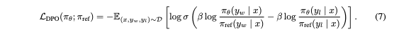
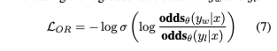
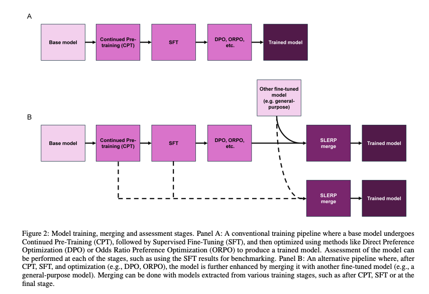
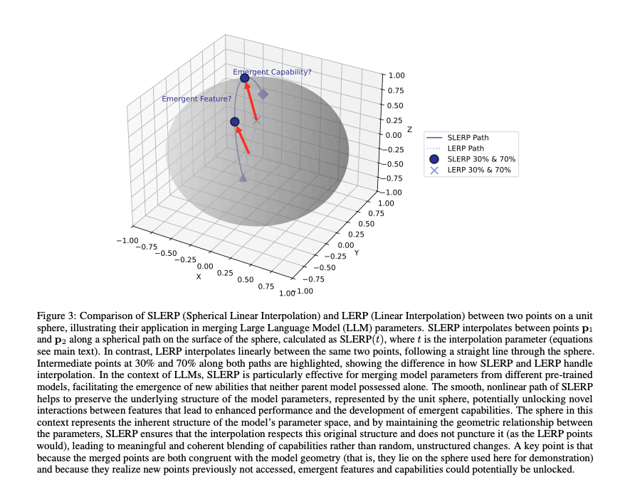

# (FINE-TUNING LARGE LANGUAGE MODELS FOR DOMAIN ADAPTATION) EXPLORATION OF TRAINING STRATEGIES, SCALING, MODEL MERGING AND SYNERGISTIC CAPABILITIES Projection 

이 논문은 LLM을 특정 도메인에 적응시키기위한 fine-tuning 전략과 병합 기술을 다룹니다. 주요 내용은 다음과 같습니다.
- Fine-tuning 전략
    - Continued Pretrining (CPT), Supervised Fine-Tuning (SFT)
    - 선호도 기반 최적화
        - Directed Preference Optimization (DPO)
        - Odds Ratio Preference Optimization (ORPO)
- 모델 병합 전략
    - 두 개 이상의 파인튜닝된 모델을 병합하여 개별 모델의 성능을 뛰어 넘는 새로운 Emergent capabilities 발현
    - 병합 과정이 단순 파라미터 합산이 아닌, 비선형적 상호작용을 통해 새로운 기능을 창출할 수 있음을 강조
    - 모델 병합에서 부모 모델의 다양성과 훈련 방식이 성능에 중대한 영향을 미침

위 방법을  LLama, Mistral 모델에서 테스트한 결과 모델 병합은 개별 부모 모델의 성능을 뛰어넘는 성과를 보여주었습니다. 

[Paper Link](https://arxiv.org/pdf/2409.03444)

## Introduction

LLM은 일반적 응용에서 강력한 도구로 자리잡았으며, 현재는 재료공학, 생물학적 재료 설계와 같은 전문적인 도메인으로 그 응용 가능성을 확장하고 있습니다. 하지만 특정 도메인에서는 일반적인 LLM은 지식과 성능이 한계에 부딪히는 경우가 많습니다. 전문 분야에서는 특수한 데이터와 작업 요구 사항에 대한 이해가 필요하며, 이를 위한 추가적인 조정이 필수적입니다. 특정 도메인에 모델을 적응시키는 과정은 단순히 기존 데이터를 추가로 학습시키는 것을 넘어서는 복잡한 과정입니다.
- 훈련 비용: LLM을 처음부터 훈련시키는 것은 비용이 많이 들며, 데이터세트가 공개되지 않은 경우가 많아 제약이 큼
- 데이터 부족: 특정 도메인에서는 학습 데이터의 가용이 제한적
- 기존 지식 유지: 새로운 지식을 학습하면서, 기존에 학습된 범용적인 능력을 유지하는 것이 도전 과제

이전 연구에서는 LoRA 등과 같은 방법을 사용하여 작은 학습 비용으로 새로운 지식을 학습시키려는 시도를 하였습니다. 하지만 이는 다음과 같은 한계가 있습니다.
- 새롭고 복잡한 작업에서의 제한
    - LoRA는 기존의 능력을 약간 확장하는 데는 효과적이지만, 완전히 새로운 능력을 부여하기에는 충분하지 않을 수 있습니다. 
- 도메인 특화 작업의 새로운 요구사항
    - 전문 도메인의 작업은 모델이 기존 훈련과정에서 접하지 못한 다른 유형의 데이터나 문제를 다뤄야할 수 있습니다. 이경우 기존 모델이 지식이 부족하여 LoRA가 추가적인 기능을 학습 시킬 여지가 제한됩니다.
- 학습 되지 않은 기능의 부재
    - 기존 모델 지식을 보강하는데 초점이 있으므로, 새로운 개념이나 기능을 학습시키는데는 적합하지 않습니다. 

이 논문의 연구 목표는 LLM의 성능을 효율적으로 확장하고, 새로운 능력을 부여하는 데 있습니다. 

- CPT: Continued Pretrining
- SFT: Supervised Fine-Tuning
- DPO: Directed Preference Optimization
- ORPO: Odds Ratio Preference Optimization
- SLERP Model Merging 

이 연구는 기존 연구와 달리 시스템적이고 체계적인 실험을 통해 다양한 훈련 및 최적화 전략의 효과를 비교합니다. 특히 모델 병합을 통해 비선형적 상호작용으로 새로운 능력을 창출하고 성능을 향상시키는 방법론을 제안합니다. 

## Related Works
### [DPO: Direct Preference Optimization](https://arxiv.org/pdf/2305.18290)
LLM을 인간의 선호도에 맞게 조정하는 방법입니다.
이는 인간의 선호도 데이터를 사용하여 모델을 직접 최적화합니다. RLHF과 같이 별도의 보상 모델이 필요하지 않고 단일 단계로 선호되는 출력과 선호되지 않은 출력 사이의 차이를 최적화합니다.

DPO를 적용하기 전의 초기 모델을 참조 모델로 사용하여, 참조 모델로부터의 편차를 페널티로 부과하는 KL 발산 제약을 사용하여, 기존의 정보를 잊어버리지 않도록 조절합니다. 

### [ORPO: Odds Ratio Preference Optimization](https://arxiv.org/pdf/2403.07691)

이 방법은 선택된응답과 거부된 응답간의 로그 Odds ratio를 활용하여 모델을 미세조정합니다. 거부된 응답에 대해 약간 패널티를 부여하고, 선택된 응답에 대해 강한 적응 신호를 제공하여 모델을 인간선호에 맞게 조정합니다. 

여기서 odd ratio는 확률 이론과 통계에서 두 사건간의 상관관계를 나타내는 척도입니다.
즉 어떤 사건이 발생할 확률과 발생하지 않을 확률의 비율입니다.

odds = p(y|x)/(1-p(y|x))

- y_w: chosen response
- y_l: rejected response

## Results and Discussion

기존 훈련 파이프라인은 Continued Pretraining을 거친 뒤 Supervised Fine-tuning을 통해 도메인 데이터를 학습합니다. 그리고 선호도 기반 최적화 (DPO, ORPO)를 적용하여 모델의 출력을 개선하는 방식으로 모델을 파인튜닝하였습니다. 

대안 파이프라인은 CPT, SFT, DPO, ORPO 등의 최적화를 마친 후, 다른 파인튜닝 모델과 병합하여 성능을 더욱 향상시키는 방법입니다. 병합은 CPT, SFT, 선호도 최적화 이후 어느 단계에서도 적용가능합니다.

모델 병합시 SLERP(Spherical Linear Interpolation)을 활용합니다.
이 기법은 모델 파라미터를 구면 공간에서 부드럽게 Interpolation하는 기법입니다. 구면 공강의 구조를 유지하며 파라미터를 조정함으로써, 단순한 선형 병합보다 더 유의미한 결과를 생성할 수 있습니다. 이를 통해 새로운 기능이 발현될 가능성을 높일 수 있습니다.

선형 병합인 LERP는 단순히 파라미터를 선형적으로 결합하여, 모델 구조를 왜곡하거나, 비효율적인 결과를 초래할 수 있습니다. SLERP는 비선형 경로를 따라 병합하여 모델 파라미터의 상호작용을 최적화하고, 새로운 성능을 끌어낼 수 있습니다. 

실험은 크게 LLaMA-3.1-8B 모델과 Mistral-7B-v0.3 모델을 각각 Base, Instruct 모델 변형을 사용하였습니다.
- Llama: 훈련 전략은 CPT, CPT-SFT, CPT-SFT-DPO, CPT-SFT-ORPO 등 다양한 방식으로 훈련 및 병합 실험을 수행하였습니다. SLERP를 사용한 병합이 특히 높은 성능을 보였으며 병합하지 않은 모델 중에서는 Instruct-CPT-SFPT-DPO 전략이 가장 우수한 성능을 보였습니다.
- Mistral: SLERP 병합은 이 모델에서도 최고 성능을 기록하였으며, 병합 없이 가장 좋은 성능을 보인 전략은 Base-CPT-SFT 였습니다.

CPT 단계에서 훈련 Epoch 수가 성능에 미치는 영향을 분석하였습니다.
- Instruct 모델: Epoch가 진행될수록 성능이 꾸준히 향상되며, 5Epoch 에서 최고 성능을 달성하였습니다.
- Base 모델: Epoch 초기에는 높은 성능을 보였지만, 추가 훈련에서는 큰 개선 없이 정체하거나 오히려 감소하였습니다.

Instruct 모델이 추가 훈련으로 성능이 크게 개선될 가능성이 높이 도메인 특화 작업에 적합합니다.

### Detailed analysis of key factors in model merging

기존의 선형 병합은 단순히 두 모델의 가중치를 선형적으로 결합하여, 종종 높은 손실을 초래하거나, 비선형적인 상호작용 효과를 놓치는 한계가 있었습니다. SLERP는 모델 병합시 구면 선형보간을 사용하여, 비선형 시너지를 활용합니다.

위와 같은 방식으로 모델을 병합하였을때, 더 부드럽고 일반화 가능한 파라미터 조합을 생성할 수 있습니다. SLERP 병합의 성능은 실제 성능(Pmerged)과 예상 성능(E(P1, P2)=(P1+P2)/2) 간의 차이로 분석하였습니다. SLERP 병합 모델의 성능은 예상 성능을 초과했으며, 이는 비선형 시너지 효과에 기인하였습니다.
특히, Llama 모델에서는 Instruct 모델 기반 병합이, Mistral 모델에서는 Base 모델 기반 병합이 최상의 성능을 나타내었습니다. 

SLERP는 서로 다른 훈련 이력을 가진 모델 간의 다양성을 활용해 앙상블 효과를 극대화 할 수 있습니다.

## Conclusion
- CPT, SFT 는 모든 모델에서 기본적인 성능 향상을 제공하였습니다
- DPO, ORPO는 Llama, Mistral과 같은 대규모 모델에서 성능 개선에 중요한 역할을 하며, 도메인 지식의 정밀도와 모델의 응답 스타일을 개선할 수 있습니다.
- SLERP 병합 기법은 개별 모델의 강점을 보전하면서 새로운 기능을 활성화할 수 있습니다. 그러나 작은 LM에서는 오히려 성능 저하를 보였습니다.
- 데이터 크기의 증가가 항상 성능 향상으로는 이어지지 않았습니다. 품질이 낮은 데이터는 모델 성능 저하를 초래하기 때문에 데이터 품질 개선이 가장 중요함을 발견하였습니다. 

[MergeKit](https://arxiv.org/abs/2403.13257)을 사용하여 모델을 머지하는데 사용하였습니다. 