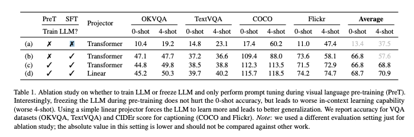

이 논문은 LM의 지속적인 도메인 적응 사전학습(continual domain-adaptive pre-training, DAP-training)에 관한 논문입니다. 
기존 모델의 성능을 도메인에 맞게 향상시키는 Domain Adaptive Pretraining(DAPT)의 효과는 이미 입증되어 왔습니다. 기존 DAPT는 특정 도메인의 코퍼스를 사용하여 이미 사전학습된 언어 모델을 도메인에 맞게 추가학습하면, 해당 도메인에서 다운스트립 작업 성능이 개선되었습니다.
현실에서는 하나의 도메인에만 국한되지 않고 여러 도메인 데이터를 순차적으로 학습해야하는 경우가 많습니다. 기존 모델의 문제는 Catastrophic forgetting에 취양하다는 것입니다. 이는 이전 도메인 또는 기본지식이 새로운 도메인 학습과정에서 잊혀지는 현상을 말합니다. 그래서 저자는 새로운 도메인 지식을 학습하면서도 이전 도메인의 지식과 기본 사전 학습 모델의 지식을 잃지 않는 방법을 연구하였습니다. 이 논문에서는 "Soft-masking"과 Knowledge Integration 메커니즘을 통해 DAPT를 제안합니다. 이 방법은 catastrophic forgetting 문제를 극복하면서도, 새로운 도메인에서의 성능을 효과적으로 향상시켰습니다. 

[Paper Link](https://arxiv.org/pdf/2302.03241)

## Related Work

### DAPT (Domain-Adaptive Pre-Training)
- 기존의 DAPT 방법
    - 직접 언어 모델을 업데이트: 전체 모델 파라미터를 업데이트해 도메인 지식을 학습
    - 추가 모듈만 학습: Adapter 또는 Prompt만 학습하여 도메인에 적응.  이 방법은 효과적일 수 있지만, 추가 모듈간의 transfer knowledge가 어렵거나 부정확할 수 있습니다.
- DAS(Continual DA-pretraining of LMs with Soft-Masking) 접근법은 기존의 모델 전체를 업데이트하는 방식에 속하며, Continual Learning 환경에 적용합니다.

### Continual Learning
- Catastrophic Forgetting (CF) 문제: 새로운 작업 학습시 이전 작업에 대한 지식이 손실되는 문제
- 이를 해결하기 위한 기존 접근법 
    - Regularization Methods
        - 이전 작업의 중요 파라미터를 계산하고, 변경을 억제하는 방식 (EWC: Elastic Weight Consolidation)
        - DAS와의 차이점
            - EWS는 모든 파라미터를 제어하지만, DAS는 뉴런 단위에서 중요도를 계산하여 보다 세밀하게 조정 
            - DAS는 역전파 시 뉴런 단위로 기울기 흐름을 제어하여 더 효과적임을 실험적으로 입증
    - Replay Methods
        - 이전 작업 데이터를 저장하거나 생성하여 새로운 학습시 사용
    - Parameter-isolation Methods
        - 작업별로 별도의 파라미터를 할당하고, 학습 시 특정 파라미터를 사용
        - 단점은 일반 지식을 활용하지 못하며, 최종 작업 성능이 저하

#### EWC (Elastic Weight Consolidation)

Continual Learning(연속 학습)에서 사용되는 EWC(Elastic Weight Consolidation) 방법은 인공 신경망이 새로운 작업을 학습하면서 이전에 학습한 작업의 성능을 유지하는 데 도움을 주는 중요한 기술입니다.

1. **중요도 평가**: 각 매개변수의 중요도를 이전 작업에 대해 평가합니다.
2. **선택적 제약**: 중요한 매개변수에 대해서는 변화를 제한하고, 덜 중요한 매개변수는 새로운 작업을 위해 자유롭게 조정할 수 있도록 합니다.

#### CPT (Continual Post-Training)
기존의 사전 학습된 언어 모델을 기반으로 새로운 도메인의 데이터를 순차적으로 학습하면서도 기존의 도메인의 지식을 유지할 수 있게 설계되었습니다. 

- CL-Plugin: Transformer Layer 내부에 삽입되는 모듈로 각 도메인마다 중요한 뉴런을 식별하고 보호하는 역할
    - 주요 입력
        - Hidden States: Transformer Layer의 출력값 
        - Task ID: 각 도메인 또는 테스크를 구분하기 위한 식별자
    
- Task Mask(TMs): 중요한 뉴런을 식별하여 특정 뉴런의 활성화 및 비활성화를 조정 
    - task ID를 임베딩 벡터로 변환하여 Task Mask 생성의 기초값으로 사용. 이를 Sigmoid에 통과시켜 소프트 바이너리 마스크를 생성 
    - 이미 학습된 뉴런은 Mask를 통해 gradient가 업데이트 되지 않도록 차단

- Sequential vs. Parallel Adapter: Parallel Adapter 방식이 더 나은 성능을 보임 
    - Sequential Adapter: 기존의 Layer 뒤에 추가하는 방식으로, transformer 출력값을 수정하거나 보강하는 역할을 수행. transformer 가 잘못된 표현을 생성하면 Adapter가 이를 수정하기 어려움. 
    - Parallel Adapter: 기존의 Layer에 병렬적으로 삽입됩니다. 입력 데이터는 병렬로 통과후 출력을 Skip-Connection 합니다. 기존 Layer의 표현력을 유지하면서 Adapter에서 새로운 정보를 추가합니다. 더 유연한 학습이 가능하며, 도메인간 지식 공유가 용이합니다. 

#### ELLE (Efficient Lifelong Pre-training for Emerging Data)

ELLE 프레임워크는 기존 사전 학습 언어 모델(PLM)의 **효율적인 지속 학습(lifelong learning)**을 가능하게 하며, 실시간 스트리밍 데이터로 모델을 적응시키는 데 중점을 둡니다. 방법론은 크게 두 가지 주요 구성 요소로 나뉩니다: **기능 보존 모델 확장(Function Preserved Model Expansion)**과 **도메인 프롬프트 기반 학습(Pre-trained Domain Prompts)**입니다.

##### 1. **기능 보존 모델 확장 (Function Preserved Model Expansion)**

기능 보존 모델 확장은 PLM의 **너비**와 **깊이**를 확장하여 지식을 효율적으로 축적하도록 설계되었습니다. 이 방법은 새로운 데이터 도메인에 모델을 적응시킬 때 기존 모델의 기능을 유지하면서 학습 효율성을 개선합니다.

###### (1) 너비 확장 (Width Expansion)
- **개념**: Transformer 모델의 내부 매트릭스를 더 큰 크기로 확장합니다.
- **방법**:
  - 기존 매트릭스를 복제하여 확장된 매트릭스를 구성합니다.
  - 확장된 매트릭스는 원래 매트릭스의 값을 반복적으로 사용하거나, 새로운 값을 추가하여 초기화됩니다.
  - 예: 기존 매트릭스의 크기가 o x x1 라면, 이를 o/2 x x1로 나눠 새로운 매트릭스 크기로 병합합니다.
  
###### (2) 깊이 확장 (Depth Expansion)
- **개념**: 기존 PLM에 새로운 Transformer 계층(layer)을 추가합니다.
- **효과**:
  - 모델의 용량이 증가하여 학습 효율성이 높아집니다.
  - 새로운 계층은 이전 계층의 학습 내용을 보존하기 위해 초기화됩니다.

###### (3) 기능 복원 과정 (Function Recovery Warmup)
- 확장된 모델이 기존 기능을 보존하도록 사전 훈련된 모델의 지식을 복원합니다.
- 모델 확장 후, 새로운 데이터에 적응하기 전에 복원 과정을 통해 모델의 안정성을 유지합니다.

##### 2. **도메인 프롬프트 기반 학습 (Pre-trained Domain Prompts)**

###### (1) 도메인 프롬프트란?
- 도메인 프롬프트는 특정 도메인의 지식을 학습하도록 PLM에 심어놓은 지침 역할을 합니다.
- 도메인별 학습 데이터를 통해 학습되는 동안 모델은 특정 도메인 지식을 분리(disentangle)하여 저장합니다.

###### (2) 학습 중 역할
- **지식 분리 (Knowledge Disentangling)**:
  - 여러 도메인에서 학습된 지식을 명확히 분리하여 저장합니다.
  - 각 도메인별로 적합한 프롬프트를 통해 필요한 정보를 활성화합니다.
- **적합한 지식 자극 (Knowledge Stimulation)**:
  - 프롬프트는 특정 다운스트림 작업에서 관련 지식을 적절히 활용하도록 모델을 안내합니다.

###### (3) 다운스트림 작업에서의 활용
- 학습된 도메인 프롬프트를 사용해 모델이 필요한 도메인 지식을 정확히 활용하도록 유도합니다.
- 예를 들어, 특정 뉴스 데이터 도메인에서 학습된 프롬프트는 그와 관련된 다운스트림 작업에서 활성화됩니다.

##### 3. **메모리 재생 (Memory Replay)**

- **문제 해결**: 지속 학습의 일반적인 문제인 **망각(catastrophic forgetting)** 방지.
- **방법**:
  - 이전 도메인의 일부 데이터를 메모리에 저장하여 지속 학습 과정에서 반복적으로 사용합니다.
  - 새로운 데이터와 이전 데이터를 동시에 활용해 학습 안정성을 높입니다.

##### 4. **학습 프로세스**

1. **초기 상태**:
   - 초기 모델 M_{i-1}은 이전 도메인 데이터 D_{i-1}로 학습된 상태입니다.
   
2. **모델 확장**:
   - 모델의 너비와 깊이를 확장하여 새롭게 수집된 데이터 D_i를 학습할 수 있도록 용량을 증가시킵니다.

3. **복원 학습**:
   - 확장된 모델 M_{i-1}의 기존 기능을 유지하도록 복원 학습 수행.

4. **지속 학습**:
   - 확장된 모델에 새로운 데이터를 학습시키고, 메모리 재생을 통해 이전 데이터의 지식도 유지합니다.

5. **다운스트림 작업 적용**:
   - 학습된 도메인 프롬프트를 사용하여 특정 작업에서 적절한 지식을 활용합니다.

#### Neural Network Pruning

신경망의 많은 매개변수가 중복되거나 불필요하기 때문에 제거(pruning)할 수 있습니다. 이를 통해 모델의 크기를 줄이고 효율성을 향상시킬 수 있습니다.

- 기존 방법:
  - 작은 절대값의 매개변수 제거 (Han et al., 2015; Guo et al., 2016)
  - 누적된 그래디언트를 기준으로 매개변수 제거 (Michel et al., 2019)
  - 로터리 티켓 가설(Lottery Ticket Hypothesis) 기반 가지치기 (Brix et al., 2020)
- 문제점:
  - 위 방법들은 일반적으로 모델의 전체 지식을 압축하는 데 초점을 맞추지만, 이 방법론에서는 도메인별 지식과 일반 지식을 보존해야 합니다.

- 제안된 접근 방식:
  - 일반 지식 보존: 일반 지식은 프리트레이닝 데이터를 활용할 수 없으므로 **대리 메트릭(proxy metric)**으로 **모델의 강건성(robustness)**을 기반으로 보존합니다.
- 도메인 지식 보존:
  - 기존 가지치기 기법을 활용하되, 매개변수의 중요도를 기준으로 **소프트 마스크(soft-mask)**를 적용합니다.
  - 목적은 모델을 압축하는 것이 아니라, 새로운 지식을 **축적(accumulate)**하는 것입니다.

#### Contrastive Learning (대조 학습)

대조 학습은 **좋은 표현(embedding)**을 학습하기 위해 **양성 쌍(positive pairs)**의 유사도를 극대화하고, **음성 쌍(negative pairs)**의 유사도를 최소화하는 방법입니다.

- DAS (제안된 대조 학습 방식): 이전 도메인의 학습된 지식과 프리트레이닝된 언어 모델(일반 지식)을 대조.
이전 도메인과 현재 도메인 지식을 모두 포함한 전체 지식과 비교하여 상호 보완적인 효과를 얻음.

## Proposed DAS Technique

1. **목표**:
   - 일반 언어 모델(LM)의 중요한 일반 지식(General Knowledge)과 이전 도메인에서 학습된 지식을 보존하며, 새로운 도메인 지식을 통합.
   - **모델의 지속적 학습(Continual Learning)** 중 발생하는 **망각 문제(Catastrophic Forgetting)**를 완화.
   - **교차 작업 지식 전달(Cross-task Knowledge Transfer)**과 **지식 통합(Knowledge Integration)**을 촉진.

2. **구성 요소**:
   - **초기화(Initialization)**:
     - 모델의 각 유닛(뉴런, 어텐션 헤드 등)의 중요도를 계산하여 **일반 지식**에 대한 중요도를 학습.
   - **지속적 학습(Continual Learning)**:
     - 새로운 도메인 데이터를 학습하면서 기존 도메인 및 일반 지식 보존을 고려.

### INITIALIZATION: COMPUTING IMPORTANCE OF UNITS TO THE GENERAL KNOWLEDGE

- **목적**: Transformer 모델 내 각 유닛(Attention Heads, Intermediate Neurons 등)이 **일반 지식**에 얼마나 중요한지를 평가.
- **방법**:
  1. **가상 파라미터 \( g_l \)**:
     - 각 유닛의 중요도를 계산하기 위해 **가상 파라미터 \( g_l \)**을 도입.
     - \( g_l \)은 학습하지 않으며, 오직 그래디언트 정보만 사용해 유닛 중요도를 계산.
     - \( o_l = g_l * o_l \): 레이어 \( l \)의 출력에 \( g_l \)을 곱해 중요도를 반영.

  2. **그래디언트 기반 중요도 계산**:
     - 주어진 데이터 \( D = \{(x_n, y_n)\}\)에서 \( g_l \)의 평균 그래디언트를 계산해 중요도 I_l를 측정:

  3. **문제점**:
     - 프리트레이닝 데이터가 없기 때문에 기존 방식은 **일반 지식** 중요도를 계산하기 어려움.
     - 레이블 없이 도메인 데이터를 사용할 수 있는 방법이 필요.

  4. **Proxy KL-divergence Loss**:
     - 모델의 강건성(Robustness)을 중요도의 Proxy로 사용.
     - 동일한 입력 x_sub 를 두 번 Transformer에 통과시키고, 각기 다른 드롭아웃(dropout) 마스크를 적용해 출력 f_1(x_sub), f_2(x_sub)를 얻음.
     - 두 출력 간의 KL-divergence를 계산: `L_impt = KL(f1 || f2)`
     - 높은 중요도를 가진 유닛은 모델의 출력에 큰 영향을 미침 → **중요한 유닛**.
     - 낮은 중요도를 가진 유닛은 모델 출력에 적은 영향을 미침 → **덜 중요한 유닛**.
     - `I = mean(grad(L_impt))`

### TRAINING: LEARNING A NEW DOMAIN VIA SOFT-MASKING AND CONTRASTIVE LOSS

- 주요 목표
  - 기존 지식 보존:
    - 기존 학습된 일반 지식과 도메인별 지식을 유지하기 위해 **소프트 마스크(soft-masking)**를 적용.
  - 새로운 지식 통합:
    - 새로운 도메인 지식을 기존 지식과 **보완적(complementary)**으로 학습하기 위해 **대조 학습(contrastive learning)**을 사용.

- 주요 구성 요소 
  - 기존 지식의 중요도 축적
    - 기존 작업에서 계산된 중요도 I_(t-1)을 새로운 작업 학습에 사용
    - 중요도를 축적하기 위해 Element-wise Max (EMax)를 사용
    - `I_(t-1) = EMax(I_(t-2), I(t-1))`
      - [0, 1] 범위의 실수
  - Soft Masking
    - 축적된 I_(t-1)을 기반으로 그래디언트 흐름을 제어
    - 각 레이어의 그래디언트를 다음과 같이 조정
      - grad = (1-I_(t-1))*grad

  - 대조 학습을 통한 지식 통합: 기존 지식을 보호하면서  새로운 지식이 기존 지식과 겹치지 않도록 유도
    - O_full: 중요도 없이 모델의 전체 출력 (anchor)
      - 현재 도메인 t에서의 입력 데이터를 모델에 넣었을 때 얻는 결과
    - O_prev: 축적된 중요도를 반영한 기존 지식만 포함한 출력 (negative pair)
      - 이전 도메인 (t-1)의 중요도를 반영한 출력 
      - O_prev = I_(t-1) * O
    - O_full+: O_full에 서로다른 드롭아웃을 적용하여 Positive pair를 생성 (positive pair)
    - `L_contrast = exp(sim(o_full, o_full+))/sum(sim(...))`
- 최종 손실 함수
  - L_DAP = L_MLM + a*L_contrast

### COMPUTE IMPORTANCE OF UNITS TO THE CURRENT DOMAIN
새로운/현재 도메인 \( t \)의 학습 후, 해당 도메인에 대해 gradient을 적용하여 유닛의 중요도를 학습합니다. 여기서 L_impt를 계산하기 위한 proxy가 필요하지 않습니다. 왜냐하면 현재 도메인 데이터를 직접 사용할 수 있기 때문입니다. 

구체적으로, 현재 도메인 데이터의 일부를 무작위로 샘플링합니다(이때 샘플링 비율은 하이퍼파라미터로 설정). Masked Language Model(MLM) 방식의 자기 지도 학습 손실을 L_impt에 대입하여 I_t를 계산할 수 있습니다. 이는 이전 축적된 중요도와 함께 EMax로 축적되고 학습 과정에서 소프트마스킹에 사용됩니다.

## EXPERIMENTS
