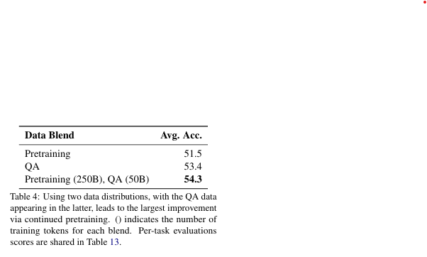
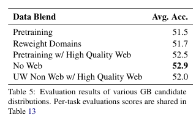
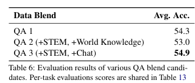
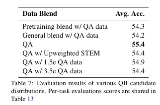

대규모 언어 모델은 매개변수의 수와 사전 학습 데이터 세트 크기가 계속 증가하고 있습니다.
이러한 증가로 인해 학습 비용이 매우 커져, 리소스가 풍부한 팀이 아니면 감당하기 어렵습니다.
따라서, 모델을 처음부터 다시 학습하지 않고, 이미 학습된 모델을 추가적으로 학습하여 성능을 개선하는 방법이 중요합니다.
언어 모델을 효율적으로 재사용하기 위한 **데이터 분포 설계(data distribution design)**와 **학습률 스케줄링(learning rate schedules)**에 관한 가이드라인을 제시합니다.
이러한 가이드라인을 바탕으로 후속 학습(continued pretraining)을 실행하면, 동일한 모델에서 성능 향상을 도모할 수 있음을 보여줍니다.
15B(150억) 매개변수의 언어 모델에 대해 후속 학습을 적용했습니다.
새로운 데이터 분포 설계와 학습률 스케줄링 전략을 사용하여 성능을 비교했습니다.
후속 학습 데이터를 이전 사전 학습 데이터와 동일하게 사용하는 대신, 새로운 방법론을 적용한 데이터 설계로 진행했습니다. 후속 학습을 통해 모델 정확도가 평균 9% 개선되었습니다.
이는 기존의 사전 학습 데이터만 사용한 학습(base continued pretraining) 대비 상당한 성능 향상입니다.
이 연구에서 제안된 레시피(recipe)는 새로운 모델을 처음부터 학습하는 대신, 기존 모델을 재사용하여 성능을 개선할 수 있는 실용적인 시작점을 제공합니다.

[Paper Link](https://arxiv.org/pdf/2407.07263)

## Experimental Setup

### Data Sources
이 내용은 언어 모델을 사전 학습(pretraining)하기 위해 사용된 데이터 소스와 그 구성에 대해 설명하는 부분입니다. 사전 학습은 모델이 광범위한 데이터를 학습해 언어의 기본 구조와 패턴을 이해하도록 돕는 단계입니다. 주요 내용을 요약하면 다음과 같습니다:

#### Pretraining

##### **사전 학습 데이터 구성**
- 사전 학습 데이터는 세 가지 주요 도메인으로 나뉩니다:
  1. **영어 자연어 데이터 (English natural language data)**:
     - **웹 크롤링(Web Crawl)**: Common Crawl(CC) 스냅샷에서 수집된 데이터.
     - **기타 데이터(Miscellaneous)**: BigScience ROOTS, Reddit, Pile-Stories와 같은 고품질 데이터셋 포함.
     - **백과사전 데이터(Encyclopedia)**: Wikipedia 및 Stack Exchange 포함.
     - **과학 논문(Scientific Papers)**: ArXiv 및 PubMed에서 수집된 데이터.
  2. **다국어 자연어 데이터 (Multilingual natural language data)**:
     - **53개 언어**로 구성.
     - 대부분 Common Crawl(CC) 스냅샷에서 수집.
     - 일부는 기계 번역 병렬 코퍼스에서 수집된 데이터 포함 (예: Schwenk et al., 2019; El-Kishky et al., 2019).
  3. **소스 코드 데이터 (Source Code Data)**:
     - 43개 이상의 프로그래밍 언어에서 수집된 소스 코드.
     - GitHub의 허가된(permissively licensed) 저장소에서 수집.

##### **사전 학습 규모**
- 총 **8조(T, Trillion)** 토큰의 데이터를 사용하여 모델을 학습.
- 현재 최첨단 언어 모델은 수십 조에서 수백 조의 토큰으로 학습되므로, 이 모델도 해당 레벨의 모델 위에서 추가 실험을 진행할 계획.

##### **목적**
- 이 데이터 및 학습 과정은 대규모 언어 모델이 학습에 사용하는 대표적인 데이터 구성 방식을 바탕으로, 이후 **추가 학습(continued pretraining)** 실험에 적합한 모델을 준비하려는 의도를 가지고 있습니다.

즉, 다양한 고품질 데이터를 활용해 언어 모델을 학습시켰으며, 이 모델은 이후의 실험과 최적화를 위한 기초로 사용됩니다.

#### Continued Pretraining
추가 학습은 기존 사전 학습 데이터셋을 기반으로 새로운 데이터를 추가해 모델을 더 정교하게 학습시키는 과정입니다.
대부분의 데이터는 **기존 사전 학습 데이터(pretraining set)**에서 가져옵니다. 
추가된 데이터는 질문과 답변(QA), 정렬(alignment) 스타일 예제:
이 데이터는 언어 모델이 저장된 지식을 더 효과적으로 추출하도록 돕는 데 유용합니다. 총 28억(2.8B) 토큰으로 구성된 QA 데이터를 사용하였으며 5가지 주요 카테고리가 있습니다.
- World Knowledge (세계 지식): 11.3억(1.13B) 토큰
- Reasoning (추론): 9.2억(0.92B) 토큰
- STEM (과학, 기술, 공학, 수학): 3.1억(0.31B) 토큰
- Chat (대화): 2.6억(0.26B) 토큰
- Code (소스 코드): 1.9억(0.19B) 토큰

#### Model Architecture and Hyperparameters
이 내용은 언어 모델의 **추가 학습(continued pretraining)** 과정과 **모델 아키텍처 및 하이퍼파라미터**에 대해 설명하고 있습니다. 각각의 주요 내용을 요약하면 다음과 같습니다.

- **모델 구조**:
  - 150억(15B) 파라미터를 가진 **디코더 기반 Transformer** 모델.
  - **Causal Attention Masks**: 순차적인 데이터 흐름을 유지.
  - **3.2억(3.2B) 임베딩 파라미터** 포함.
  - 추가 사양:
    - **32개의 Transformer 레이어**.
    - **Hidden Size**: 6144.
    - **48 Attention Heads**.
    - **Rotary Position Embeddings (RoPE)**: 위치 정보를 처리하는 방식.
    - **Squared ReLU 활성화 함수**: MLP 레이어에 사용.
    - **SentencePiece 토크나이저**: 256k 크기의 어휘 집합.
    - **Bias 없음**, **입력-출력 임베딩 분리(untied)**.
    - **Grouped Query Attention (GQA)**: 8개의 KV 헤드 사용.

- **학습 설정**:
  - **Sequence Length**: 4,096 토큰.
  - **Batch Size**:
    - 학습 초반 5% 동안 배치 크기를 점진적으로 늘림.
    - 초기 크기 384 → 최종 크기 1,152.
  - **학습률(Learning Rate) 스케줄**:
    - **코사인 학습률 스케줄** 사용.
    - Warmup: 16억(16B) 토큰 동안 학습률 상승.
    - 최대 학습률(ηmax): 4.5e-4 → 최소 학습률(ηmin): 4.5e-5로 감소.
  - **Optimizer**:
    - **AdamW** 최적화 알고리즘 사용.
    - 파라미터:
      - β₁ = 0.9
      - β₂ = 0.95
      - 가중치 감소(weight decay): 0.1.
  - **추가 학습 중 변경된 하이퍼파라미터**:
    - **학습률 스케줄**만 조정.

## Continued Training Recipe

### 1. **데이터 분포의 설계**
- **초기 데이터 분포**:
  - **사전 학습 데이터(pretraining set)**와 유사한 데이터 분포로 시작.
  - 고품질(high-quality) 데이터 소스에 더 높은 가중치(weight)를 부여.
- **2단계 데이터 분포로 전환**:
  - QA 데이터를 추가하고, 모델의 약점이 드러나는 영역에 해당하는 데이터 소스의 가중치를 증가시킴.

---

### 2. **학습률 스케줄(Learning Rate Schedule)**
- **초기 학습률 설정**:
  - 사전 학습 모델에서 사용한 최소 학습률(l_min)에서 시작.
- **학습률 감소**:
  - **코사인 감소(Cosine Annealing)** 방식을 사용.
    - 학습률을 코사인 함수의 곡선을 따라 변화시키는 방식
    - 학습 초반에는 학습률이 크고 l_max', 학습이 진행될수록 점진적으로 줄어듭니다. 최종 l_min'에 도달할때까지 감소하도록 설게하였습니다. 
  - 최종 학습률은 l_min ÷ 100까지 감소.

### 3. **데이터 분포 전환 시점**
- 데이터 분포를 변경하는 시점은 학습률 스케줄에서 **최대 학습률(l_max)의 1/5** 지점에서 이루어짐.

## 추가 학습(continued pretraining) 실험
이 내용은 **사전 학습된 언어 모델**에 대한 실험 및 **추가 학습(continued pretraining)**에서의 데이터 분포와 전략에 대해 논의합니다. 주요 내용을 요약하면 다음과 같습니다:

## Experiments

### Data Distribution
- 사전 학습 모델 평가:
    - 기본 모델의 평균 정확도는 **48.9%**이며, STEM 관련 작업에서 성능이 약점.
- 추가 학습 전략:
    - 새로운 데이터(QA 데이터)를 언제, 어떻게 포함할지 실험:
        - 초기 포함: 빠른 정보 학습 가능.
        - 후반 포함: 학습 안정성 증가.
        - 혼합 전략: 단계적으로 전환.
- QA 데이터 비중:
    - 사전 학습 데이터 분포에 10% 비중으로 포함.

- 학습 전략:
- 초반: 사전 학습 데이터와 유사한 GB로 학습.
- 후반: QA 데이터를 포함한 QB로 전환.
- GB 설계:
    - 고품질 데이터 강조, 웹 크롤 데이터를 선별적으로 사용.
- QB 설계:
    - STEM과 Chat 데이터를 강화한 QA 데이터를 포함.
    - QA 데이터를 공격적으로 가중치 부여.
- 최종 성과:
    - 13%의 정확도 개선, 평균 정확도 55.4% 달성.

### Learning Rate Schedule

#### **1. 학습률 스케줄의 중요성**
- 학습률 스케줄은 학습 동작과 효과에 큰 영향을 미침.
- 추가 학습에서는 **코사인 감소(Cosine Annealing)** 방식으로 학습률이 감소:
  - 최대 학습률 l_max: 4.5x10^-5
  - 최소 학습률 l_min: 실험에 따라 다르게 설정

---

#### **2. 최소 학습률 실험**
- 실험 조건:
  - l_min = 0: 학습률이 완전히 0으로 감소.
  - l_min = l_max/10 : 적당히 낮은 값.
  - l_min = l_max/100: 중간 수준 값.
- 결과:
  - l_min = l_max/100 이 **가장 높은 정확도(55.7%)**를 기록.
  - l_min = 0: 학습률의 크기가 너무 작아져 QA 데이터를 제대로 활용하지 못함.
  - l_min = l_max/10: 학습률 감소가 덜 급격해 성능이 낮음.

---

#### **3. 최적 학습률 스케줄**
- 최적 값:
  - l_min = l_max/100 = 4.5x10^-7\
- 이유:
  - QA 데이터가 사용되는 후반 학습에서 학습률 감소가 적절히 이루어져 새로운 데이터를 효과적으로 학습 가능.
  - 학습률의 크기도 일정 수준 유지되어 안정적으로 학습 가능.

---

#### **4. 기타 실험**
- **Warmup 및 최대 학습률 조정 실험**:
  - 학습 초반에 학습률을 천천히 증가시키는 방식(warmup)이나 l_max 값 변경 실험.
  - 결과:
    - 기존 스케줄보다 정확도가 떨어짐.
- **다른 학습률 감소 스케줄(WSD)**:
  - WSD(Warmup-Steady-Decay) 방식을 사용한 실험.
  - 결과:
    - 코사인 감소 방식보다 성능이 낮아 채택되지 않음.

---

### Switch of Data Distributions

이 내용은 **GB(General Blend)**에서 **QB(QA Blend)**로 데이터 분포를 전환하는 최적 시점과 관련된 실험 및 결과를 설명합니다. 주요 내용을 요약하면 다음과 같습니다:

---

#### **1. 데이터 분포 전환의 기존 방식**
- 이전까지는 300B(3000억) 토큰 중 **250B 토큰** 동안 GB를 사용하고, 이후 **50B 토큰** 동안 QB로 전환.
- 문제점:
  - 고정된 토큰 수로 전환 시점을 정하면, 학습 토큰 총량이 다른 경우 일반화가 어려움.
  - 학습률(Learning Rate, LR) 스케줄과 조화를 이루지 못할 가능성.

---

#### **2. 학습률(Learning Rate) 기반 전환**
- 가설: 데이터 분포 전환 시점은 학습률 스케줄에 따라 달라져야 함.
  - 전환 시점을 LR 곡선의 특정 지점의 분수에 설정.
- 실험:
  - LR 곡선에서의 전환 시점을 아래와 같이 다르게 설정:
    1. l_max / 2
    2. l_max / 5
    3. l_max / 10
    4. l_max / 50
- **전환 시점**에 따라 QB에 할당되는 토큰 수와 LR 감소 경사가 다르게 작용

---

#### **3. 실험 결과**
  - l_max/5 에서 GB → QB 전환 시 정확도가 가장 높음 (**56.1%**).
  - LR 크기와 감소 경사 간 적절한 균형을 유지해 데이터 전환 시 학습 안정성과 효율성을 모두 제공.

#### **4. 추가 검증**
- 학습 토큰 총량이 **100B 토큰**으로 줄어든 경우에도 동일한 실험을 수행.
- 결과:
  - l_max / 5에서 여전히 최적의 성능을 보여 전환 시점의 일반화를 확인.

## Ablations

이 내용은 **추가 학습(continued pretraining)**의 효과를 다양한 토큰 학습량에 대해 실험하고, **문서 마이닝(document mining)** 기법을 도입해 성능을 개선하는 방법을 다룹니다. 주요 내용을 요약하면 다음과 같습니다:

### Varying Token Horizons (학습 토큰 수에 따른 성능 실험)**

#### **1. 실험 목표**
- 학습 토큰 수(token horizons)에 따른 최적화된 추가 학습 레시피의 성능 평가.

#### **2. 결과 (Table 10)**
- 학습 토큰 수가 증가할수록 평균 정확도가 꾸준히 개선:
  - **100B 토큰**: 평균 정확도 **55.0%** (MMLU **59.3%**).
  - **300B 토큰**: 평균 정확도 **56.1%** (MMLU **63.0%**).
  - **1T 토큰**: 평균 정확도 **56.8%** (MMLU **65.3%**).
- **16% 성능 향상**:
  - 사전 학습 모델(0B 토큰)의 평균 정확도 **48.9%**와 비교해, **1T 토큰** 학습 시 정확도 **56.8%**로 16% 개선.

#### **3. 추가 분석**
- **300B → 1T 토큰** 사이의 성능 향상 속도가 **100B → 300B 토큰**보다 낮음.
- 가설:
  - 같은 데이터를 여러 번 반복(epoching) 학습하면 **점진적 유용성 감소(diminishing marginal utility)** 발생.

### **6.2 Document Mining (문서 마이닝)**

#### **1. 도입 배경**
- 긴 학습 기간 동안 반복되는 데이터에서 더 높은 성능을 얻기 위해 **특정 문서 집합을 추출**하여 사용.
- QA 데이터가 성능을 크게 개선하므로, QA 데이터와 유사한 문서를 선택하면 유용성을 극대화할 수 있을 것으로 가정.

#### **2. 문서 마이닝 방법**
- **텍스트 임베딩 모델**: E5-large-v2 (Wang et al., 2022)를 사용해 QA 및 사전 학습 데이터셋의 임베딩 생성.
- **유사 문서 검색**:
  - **Faiss 라이브러리**를 활용해, QA 데이터와 가장 유사한 50개의 비-QA 문서(nearest neighbors)를 검색.
  - 총 **60B 토큰**의 데이터로 구성된 문서 집합 생성.

#### **3. 결과**
- 기존 데이터와 비교:
  - **CT1T (1T 토큰 학습)**:
    - 평균 정확도 **56.8%**, MMLU **65.3%**.
  - **CT1T + Mined Docs (문서 마이닝 적용)**:
    - 평균 정확도 **57.9%**, MMLU **66.6%**.
- **추가 성능 향상**:
  - 문서 마이닝으로 QA와 유사한 데이터를 포함하면 정확도 약 **1% 향상**.

## Limitations
- 연구는 데이터 분포와 하이퍼파라미터 조정에만 초점, 학습 알고리즘 등은 포함하지 않음.
- 특정 환경에서의 결과로, 다른 설정에 대한 일반화가 어려울 수 있음.
- 일반 목적 모델 향상에 중점을 두었으며, 도메인 특화나 새로운 지식 추가와 같은 측면은 배제됨.