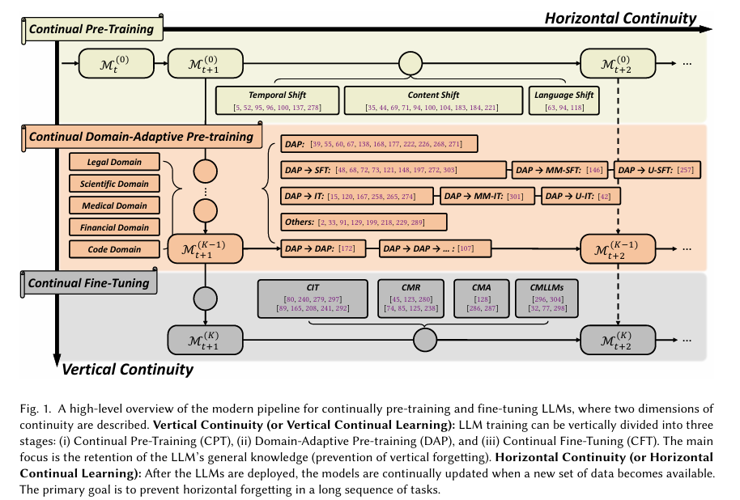
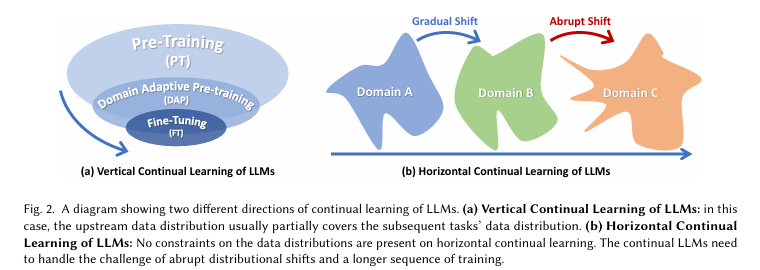
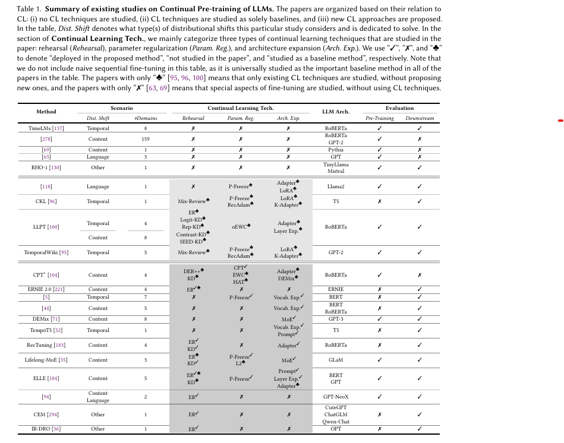

특정 요구사항에 맞게 조정된 경우 사전 훈련된 LLM은 이전 지식 영역에서 심각한 성능 저하를 겪는 경우가 많이며, 이러한 현상을 "Catastrophic forgetting"이라고 합니다. 이 문제는 CL(Continual Learning) 커뮤니티에서 광범위하게 연구되었지만, LLM의 맥락에서 새로운 과제를 제시합니다. 이 조사는 CL에서 LLM에 대한 현재 연구 진행상황에 대한 포괄적인 개요와 자세한 논의를 제공합니다. 
이 논문은 4개의 주요 섹션으로 구성되어 있습니다. 
- 지속 학습의 두가지 방향 분류
    - Vertical Continuity: 일반적 기능에서 특정 기능으로의 지속적 적응
    - Horizontal Continuity: 시간과 도메인에 걸친 지속적 적응
- LLM의 지속학습 과정
    - continual pretraining (CPT): LLM의 사전 학습을 지속적으로 업데이트
    - Domain-Adaptive Pre-training (DAP): 특정 도메인에 맞춘 사전학습
    - Continual Fine-Tuining(CFT): 세부적인 응용을 위한 지속적 미세조정 
- 평가 및 데이터 소스: 성능 평가하기 위한 프로토콜과 현재 사용가능한 데이터 소스 
- 주요 질문 및 연구 방향: 해결해야할 중요 문제와 연구 방향 논의 

[Code Link](https://github.com/Wang-ML-Lab/llm-continual-learning-survey)  

[Paper Link](https://arxiv.org/pdf/2404.16789)

## BACKGROUN AND RELATEDWORK

### 1. Large Language Models
LLM은 주로 Transformer 구조를 기반으로하며, 대규모 텍스트 데이터에 대한 사전 학습을 통해 언어 이해와 생성능력을 갖춘 모델입니다.

#### Pre-Training
LLM의 사전학습은 크게 두가지 방식으로 나뉩니다.
- Decoder-only: GPT 계열, Gemini, Llama
    - Auto-regressive Language Modeling을 사용
    - 주어진 이전 토큰들을 기반으로 다음 토큰을 예측하며 학습합니다.
    - Negative Log-likelihood 최소화
- Encoder-only: BERT 계열
    - Masked Language Modeling을 사용
    - 입력 텍스트의 일부를 [MASK]로 대체하고, 마스크되지 않은 부분을 기반으로 마스크 된 부분을 예측하도록 학습
    - [MASK] 토큰의 Negative Log-likelihood 최소화
- Encoder-Decoder: T5 
    - Sequence-to-Sequence MLM 작업을 사용
    - 마스킹된 문장을 인코더에 입력하고, 디코더를 통해 마스킹된 토큰을 순차적으로 예측

#### Adaptation
사전 학습된 LLM은 기본적으로 텍스트 생성을 목표로 하지만 아래와 같은 한계를 가지고 있습니다.
- 사람의 가치관, 선호, 실용적 요구와 불일치
- 사전 학습 데이터가 오래되어 지식이 outdated

이를 해결하기 위해 다양한 적응 기법이 사용됩니다.

- Instruction Tuning (IT)
    - LLM이 지시문을 더 잘 이해하고 따르도록 조정
    - 기존 지식을 활용해 특정 작업 성능 향상
    - 인간과의 상호작용을 더 자연스럽게 만듦
    - (Instruction, output) 쌍으로 구성된 데이터셋을 사용하여 추가로 학습 
- Model Refinement (MR)
    - 모델이 특정 오류를 수정하며 기존 성능을 유지
    - 적은 컴퓨팅 자원으로 수정 가능
    - 부정확한 번역 또는 오래된 정보 개선
    - 각 데이터에 대해 모델의 잘못된 출력과 올바른 정답이 주어집니다. 
- Model Alignment (MA)
    - IT와 유사한 문제 정의를 사용합니다. 단, IT는 일반적인 작업 성능을 목표로 하는 반면, MA는 윤리적 지침 또는 특정 결과를 따르도록 모델 출력을 조정합니다. 
    - AI 시스템의 행동과 출력이 인간의 가치, 윤리, 선호와 일치하도록 조정
    - 강화학습 기반, 지도학습 기반을 사용
    - 데이터셋은 입력, 모델의 초기 출력, 정렬된 출력으로 구성됩니다. 

### 2. Continual Learning

인간은 다양한 작업을 배우면서 이전 작업의 성능이 저하되지 않는 반면, 머신러닝 모델은 새로운 작업을 학습할 때 이전 작업의 성능이 떨어지는 "Catastrophic Forgetting(파국적 망각)" 문제를 겪습니다. 지속 학습은 이 문제를 해결하기 위해, 과거 데이터를 거의 또는 전혀 보관하지 않고도 연속적인 작업 학습이 가능하도록 모델을 설계하는 분야입니다.

지속 학습 시나리오는 다음 세 가지로 나뉩니다.

- Task-Incremental Learning (TIL): 작업간 명확한 구분이 있는 경우
- Domain-Incremental Learning (DIL): 동일한 작업에 대해 도메인별 데이터를 학습
- Class-Incremental Learning (CIL): 학습 중 새로운 데이터 클래스를 추가적으로 학습

지속 학습 기술은 다음 세가지로 분류됩니다.
- Replay-based Methods
    - 이전 데이터를 일부 저장하고 이를 학습 중 재사용 
    - 간단하고 안정적이며 높은 성능 가능
    - 메모리 제약이 있을 수 있음
- Regularization-based Methods
    - 모델 파라미터 변화량을 제한하는 규제 항을 추가
    - 중요한 파라미터를 식별하여 변화를 억제하여 과거 지식을 유지
    - 과거 지식과 새로운 지식간 균형 유지
    - 계산 비용 발생
- Architecture-based Methods
    - 새로운 작업을 학습할 때 네트워크 구조를 동적으로 확장
    - 특정 조건에서 zero-forgetting 달성 가능
    - 작업 ID를 추론해야하는 경우 적용 어려움 
    - PEFT, LoRA를 사용하여 특정 작업에 맞춤화

지속 학습의 평가 지표
- Overall Performance (OP)
    - 현재까지 학습한 모든 작업의 평균 성능
    - 지속학습의 주요 목표
- forgetting (F)
    - 학습 과정에서 이전 작업의 성능이 얼마나 떨어졌는지 측정
- backward Transfer (BWT)
    - 새로운 작업 학습이 이전 작업의 성능을 얼마나 향상시키는 지 측정 
    - negative forgetting이 발생하면 긍정적인 결과 
- forward transfer (FWT)
    - 모델이 학습하지 않은 미래 작업에 대한 일반화 능력 측정 

## Continual Learning Meets Large Language Models: An Overview

LLM은 대규모 모델 파라미터, 데이터, 컴퓨팅 자원, 팀, 개발 주기를 요구하며, 환경 변화에 신속히 적응하기 어렵습니다.

예를들어, 2023년 하루에 5억 건 이상의 트윗이 생성되지만, 이를 학습하기엔 데이터와 비용 측면에서 부담이 큽니다.

### 1. Vertical Continual Learning

**수직적 지속성(Vertical Continual Learning)**은 모델 학습 과정이 계층적으로 진행되는 구조를 말합니다.

단계는 아래와 같습니다. 
- Pre-training
    - 다양한 도메인의 대규모 데이터로 일반적 LLM 학습
    - 많은 자원 필요
- Domain-Adaptive Pre-training
    - 특정 도메인의 데이터를 사용해 모델을 맞춤화 
    - 사전 학습의 데이터보다는 작지만, 하위 작업 데이터보다는 큰 데이터 사용 
- Fine-tuning
    - 하위 작업에 필요한 데이터를 기반으로 모델을 세부 조정 
    - 주로 라벨링된 데이터를 활용

도전 과제는 아래와 같습니다.
- Vertical Forgetting
    - 새로운 작업을 학습하면서 기존의 일반적 지식이 성능 저하를 겪는 현상
- Task Heterogeneity
    - 상위 작업과 하위 작업간의 구조 및 학습 방식 차이
    - 해결책: 공유 파라미터를 freeze하거나, 하위 작업을 상위 작업 구조에 맞게 재구성 
- Inaccessible Upstream Data
    - 데이터 기밀성 문제로 상위 학습 데이터가 하위 단계에서 접근 불가
    - 해결책: 공개 데이터 활용, Pseudo Data 생성으로 대체 학습

### 2. Horizontal Continual Learning

**수평적 지속성(Horizontal Continuity)**은 시간적 변화와 도메인 변화에 따라 지속적으로 적응하는 학습 방식입니다. 데이터 분포가 시간이 지남에 따라 변화하기 때문에, LLM은 새롭게 등장하는 데이터를 점진적으로 학습해야 합니다. 그렇지 않으면 재학습 비용이 너무 크고 비효율적이므로 지속 학습이 필수적입니다.

도전 과제는 아래와 같습니다.
- Long Task Sequence
    - 많은 단계에 걸친 점진적 학습이 요구됩니다.
    - 업데이트가 누적될수록 이전 작업에 대한 망각이 발생합니다.
    - 해결책: Continual Model Ensemble - 여러 모델을 결합
- Abrupt Distribution Shift
    - 데이터 분포가 갑작스럽게 변할 수 있습니다.
    - vertical continuity와 달리 변화가 예측되지 않음
- Horizontal Forgetting
    - 새로운 작업을 학습하면서 이전의 작업 성능이 저하되는 현상

기존 연구와 해결방안은 다음과 같습니다.
- Replay Technique
    - 과거 데이터를 일부 보관해 재사용하면 망각을 줄일 수 있습니다.
    - 대규모 기관에서는 모든 데이터를 저장할 수 있어 메모리 제약이 문제가 되지 않을 수 있습니다.
    - 예: Sparse replay

과거 데이터를 모두 보관하지 않는 경우, 단순한 솔루션보다 지속 학습 기술이 더 나은 성능을 보입니다. 

## Learning Stages of Continual Large Language Models

### 1. Continual Pre-Training (CPT)

CPT란 새로운 데이터와 기존 데이터를 기반으로 지속적으로 LLM을 사전학습하는 단계를 뜻합니다. 목적은 하위 작업에서 더 나은 성능을 발휘하는 것을 목표로 합니다. 

CPT의 목적은 모델의 일반적 표현 능력을 지속적으로 업데이트하고 새로운 데이터를 반영하는 것입니다. 데이터는 연속적이고 다양한 데이터이며, 도메인에 제한되지 않습니다. 그래서 모델은 다양한 데이터에서 점진적으로 개선하며, 모든 도메인에서 사용할 수 있도록 유지됩니다. 

CPT는 하위 작업 성능을 향상 시킬 수 있습니다. 
- 조건
    - 데이터 분포 변화가 점진적이거나 상관관계가 있을 떄 효과적
    - 새로운 데이터를 학습하여 미지의 데이터에 대한 일반화 능력을 개선
- 효율성
    - 대규모 데이터를 다루는 현실적인 제약 때문에 효율적인 학습이 중요합니다.
    - 예시: ELLE (모델 구조를 확장하면서 기존 기능을 보존), 데이터 샘플링 (새로운 데이터에서 다양성과 참신성에 때라 일부만 선택해 학습), 최근 연구에서는 데이터 양보다 질이 모델 일반화에 더 중요하다는 것이 밝혀짐

아래 테이블은 CPT에 대한 현존하는 연구들을 요약한 것입니다. CPT 연구의 주요 관찰점은 3단계로 나누어 볼 수 있습니다. 

1. 기법 개발 초기 단계
    - CPT 만을 위한 고급 기술 개발이 아직 초기 단계 
    - 일부 연구는 기존 지속학습 기술을 단순히 적용하거나 적응 효과만 실험
2. 기술 다양성 한계
    - 대부분 연구는 모델 구조 확장에 집중
    - 데이터 재사용과 파라미터 규제는 일부 연구에서만 활용
3. 실제 환경과의 차이
    - 실제 생산 환경과 연구 간 간극이 존재
    - 연구는 8단계 이내의 짧은 사전 학습만 실헙하였지만, 현실에서는 CL이 몇달, 몇년에 걸쳐 진행됩니다. 
    - 작업 경계가 없는 환경에 대한 연구가 부족 

CPT에서 발생하는 분포 변화 유형은 크게 세 가지로 구분됩니다.
- **Language Shift**: 모델이 영어 -> 한국어처럼 다른 언어를 순차적으로 학습할 때 발생.
    - 새로운 언어를 배우면서 이전 언어에 대한 망각이 발생
    - LLM의 크기가 커져도 망각 문제는 해결되지 않음
    - 해결책: 파라미터 고정, LoRA 같은 기술을 사용해 망각 완화
    - 새로운 언어 학습에 있어 forward transfer은 긍정적 효과를 보임 
- **Content Shift**: 모델이 화학 -> 생물학 처럼 다른 분야 데이터를 순차적으로 학습할 때 발생
    - 간단한 Replay이 콘텐츠 변화에서는 비효율적일 수 있음 (Overfitting 문제 발생)
    - 해결책: 학습률 재조정 및 적절한 데이터 샘플링으로 성능 유지
    - DEMix(Domain Expert Mixture), Lifelong-MoE: 새로운 도메인 전문가를 점진적으로 추가하고, 이전 전문가의 파라미터는 고정하여 지식 보존
        - DeMix: 새로운 도메인을 학습할 때마다 새로운 전문가를 훈련하고 모델에 통합합니다. 이러한 전문가들을 DeMix Layer 이라고 불립니다. 매개변수가 없는 가중 앙상블을 사용합니다. 
- **Temporal Shif**t: 데이터가 시간에 따라 변하는 경우 (2021뉴스 -> 2024년 뉴스)
    - 기존 지식 업데이트와 새로운 지식 습득간 균형 유지 필요
    - 예: "메시가 바르셀로나 소속"은 2021년까지 사실이지만, 2024년에는 "인터 마이애미 소속"이 사실.
    - 해결책: 
        - TemporalWiki, CKL(Continual Knowledge Learning): 오래된 지식 보존, 새로운 지식 습득, 잘못된 지식 업데이트를 동시에 달성.
            - TemporalWiki: 연속된 두 개의 wiki 스냅샷 간의 변경된 문장과 새롭게 추가된 문장만 추출하여 훈련 데이터로 활용. (문장을 비교해 변경된 부분만 필터링) 이전 데이터 일부를 혼합하거나, 기존 파라미터를 고정하고 adapter를 추가해 학습한 경우 망각 문제를 완화하며 좋은 성능을 보임
            - CKL: Time-Invariant World Knowledge를 유지하면서 outdated knowledge를 갱신하고 new world knowledge를 효과적으로 습득하는 것이 목표. parameter expension 기법이 가장 효과적. regularization, Rehearsal 기법은 일부 한계를 보임 
        - Temporal Language Models (TLMs): 시간 정보를 모델에 통합(예: 프롬프트에 연도 prefix를 추가). 시간 정보를 사용하는 모델은 새로운 데이터가 도착했을 때 처음부터 다시 학습하지 않아도 됨. Salient Span Masking(SSM: 명명된 엔티티, 날짜 등을 마스킹하여 예측하도록 함) 학습 방법을 사용하여 모델이 텍스트에서 의미적으로 중요한 부분을 집중적으로 학습하도록 유도합니다. 

CPT에서의 주요 연구 및 결과 
- 지속적 사전 학습의 효과
    - 여러 분야에서 지속적 사전 학습은 전통적 "전체 재학습" 방식보다 더 효율적 
    - 데이터 품질(특히 고손실 데이터)에 초점을 맞춘 학습 방식이 효과적.
    - 예: Recyclable Tuning, LLPT
        - [Recyclable Tuning](https://arxiv.org/pdf/2305.08702): 이전 모델의 출력을 teacher model로 활용
- CPT의 실제 적용: 
    - 산업적 사례: 트윗 데이터를 기반으로 BERT 모델을 지속적으로 업데이트해 하위 작업 성능 향상.
    - 환경적 고려: CO2 배출 감소와 같은 이유로 CPT를 지속적 적응 방식으로 선호.
- 새로운 기술
    - [CEM(continue evolving from mistakes)](https://arxiv.org/pdf/2404.08707): 모델이 특정 작업에서 오류를 범한 사례를 식별하고, 오류를 수정한 정답쌍을 생성하거나 기존 데이터에서 유사한 사례를 찾아 데이터를 보강하고 이를 활용하여 모델을 지속적으로 학습시키는 방법 
    - [RHO-1](https://arxiv.org/pdf/2404.07965): 선택적 언어 모델링(SLM)이라는 새로운 접근법을 제안합니다. 토큰마다 학습에 기여하는 정도가 다름을 확인하고, 참조 모델을 사용하여 각 토큰의 중요도를 점수화하여, 점수가 높은 토큰에만 손실함수를 적용하여 모델을 학습 
    - [IR-DRO](https://arxiv.org/pdf/2402.14270): 중간 난이도 샘플에 집중하여 모델의 일반화 성능을 향상시키는 접근법으로, 모델의 손실 값에 따라 샘플링한 후 중간 정도의 손실값을 가진 샘플을 선택하여 학습에 활용합니다. 샘플에 동적으로 가중치를 부여합니다. 

### 2. Domain-Adaptive Pre-Training (DAP)

DAP는 알반적으로 사전학습된 대규모 언어 모델(LLM)을 특정 도메인 데이터에 적응시키기 위한 지속적인 사전 학습 기법을 의미합니다. 
이를 통해 일반적인 언어 모델이 도메인 특화 데이터를 학습하여 다운스트림 작업에 더 효과적으로 적응할 수 있도록 합니다.

즉, DAP는 도메인 특화 표현을 학습하는 데 중점을 두고, 주로 사전 학습 이후의 준비 단계로 사용됩니다. 정적이고 대규모의 도메인 데이터에 의존하며, 특정 도메인에 특화된 지식을 학습합니다.

다양한 명칭으로 불리던 개념들을 통합하여 "Domain Adaptive Pre-training (DAP)"으로 정의하였습니다.
- 지속적 사전 학습 (Continual/Continuous Pre-training)
- 추가 사전 학습 (Further Pre-training)
- 도메인 튜닝 (Domain Tuning)
- 지식 강화 사전 학습 (Knowledge Enhancement Pre-training)
- 지식 주입 학습 (Knowledge Injection Training)

초기 연구 (DAPT)는 LLM을 특정 도메인 데이터에 대해 추가로 학습한 후 다운스트림 작업에 맞게 세부 조정(fine-tuning)했습니다. 이 방식은 다양한 작업에서 성능이 개선됨을 입증했습니다. 추가적인 도메인 특화 데이터를 활용한 DAP는 다운스트림 작업에서 성능을 개선하는 일반적으로 인정받는 방법으로 자리 잡았습니다. 그래서 많은 현대 LLM들이 이 기법을 채택하고 있습니다.

지속 학습의 기법은 크게 3가지로 정리됩니다
- 복습(Rehearsal): 이전에 학습한 데이터를 재사용하여 모델이 과거 지식을 잊지 않도록 함.
- 파라미터 정규화(Parameter Regularization): 학습 중 파라미터 변경을 제어하여 모델의 안정성을 유지.
- 아키텍처 확장(Architecture Expansion): 모델 구조를 확장하여 새로운 지식을 추가.

평가 메트릭은 크게 2가지를 사용합니다
- backward transfer: 과거 지식이 유지되는 정도 평가
- forward transfer: 다운스트림 데이터에 대한 적응 성능 평가 

#### General Observations on DAP

- 대부분의 DAP는 단일 단계로 이루어짐
    - 일반적으로 DAP는 한번의 학습 단계로 수행됩니다: PT -> DAP -> FT
    (예외적으로 CodeLlama는 두 단계의 DAP 사용)
    - 단일 단계의 DAP만 수행하는 연구들은 기술적으로 CPT으로 간주될 수 있지만, general-purpose LLM을 특정 도메인에 적응시키는 목적을 가지므로 DAP의 범주로 포함합니다. 

- DAP와 CL
    - 많은 연구에서 의도적으로 또는 암묵적으로 DAP는 CL의 관점에서 해석합니다. 
    - Vertical Forgetting: 특정 도메인에 적응하는 과정에서 기존의 도메인 지식을 잃는 현상

- CL 기술의 필요성과 제한
    - 전반적인 vertical continual learning을 위해 정교한 CL 연구가 필요
    - 현재 사용되는 CL 기술은 제한적이며, 주로 두 자기로 구성
        - replay
        - parameter expansion
    
도메인별 접근법은 아래와 같습니다. 
- Legal Domain
    - 모델 종류
        - SaulLM: Wikipedia, StackExchange, GitHub 데이터를 전체 데이터의 2%로 포함하여 망각 방지.
        - Lawyer Llama: 일반 도메인 데이터를 학습에 포함(비율은 비공개)
    - 데이터 재사용 및 혼합 기법 사용

- Medical Domain
    - 모델 종류
        - BioMedGPT: 인간 언어와 생물학적 언어(분자, 유전자 등)를 통합한 다중모드 의료 모델. - Llama2-Chat을 초기화 모델로 사용하여 DAP 수행.
        - PMC-Llama: 의료 논문과 교과서를 사용해 지식을 주입. RedPajama 데이터(일반 언어 코퍼스) 5%를 포함.
        - MeLlama: 일반 도메인 데이터를 25% 포함하여 임상 기록과 생물 의학 문서에 대해 학습, MMLU에서 긍정적 백워드 전이 달성.
        - HuatuoGPT-II: DAP와 SFT 단계를 하나로 통합해 데이터 이질성 문제를 해결
    - LoRA 및 어댑터 기반 접근
    - 데이터 혼합 전략
    - DAP와 SFT를 하나의 단계로 통합

- Financial Domain
    - 모델 종류
        - BBT-Fin: 일반 마스킹(Masked Language Modeling) 외에도 트리플 마스킹, 스팬 마스킹 사용. 중국 금융 보고서, 애널리스트 보고서, 소셜 미디어, 금융 뉴스에서 800억 개의 토큰 수집.
        - CFGPT: QLoRA를 사용해 과적합 방지 및 일반 응답 능력과 도메인 특화 능력 간 균형 유지. 금융 데이터를 수집하여 DAP와 SFT 수행.
    - 유사한 데이터 분포를 샘플링하여 사용 
    - 새로운 코퍼스 구성
    - 다양한 마스킹 기법 사용 (트리플 마스킹, 스팬 마스킹)
    - DAP와 SFT를 결합 

- Science Domain
    - 모델 종류
        - **OceanGPT**: 해양 과학 분야 최초의 LLM. 최신 연구 및 역사적으로 중요한 연구를 우선시하여 DAP 수행.
        - **K2**: 지구과학(LLM) 모델로, 오픈 액세스 지구과학 문헌과 관련 Wikipedia 데이터를 활용. LoRA를 사용해 멀티태스킹 지시 튜닝 수행.
        - **AstroLlama**: 천문학 분야 LLM으로 arXiv 논문 초록을 활용해 사전 학습. 학문적 천문학에서 perplexity 개선 관찰.
        - **MarineGPT**: 해양 도메인을 위한 멀티모달 LLM으로 500만 개의 이미지-텍스트 쌍을 활용해 도메인 지식을 학습.
        - **GeoGalactica**: 지구과학 데이터를 포함해 일반 데이터와 혼합 비율(8:1:1)로 학습, 코딩 데이터를 추가해 추론 능력 향상.
        - **Llemma**: 수학 도메인 데이터와 일반 데이터를 19:1 비율로 혼합해 학습.
    - Multi-Modal learning: Q-Former
    - 데이터 혼합 
    - LoRA + 멀티 태스킹 지시 튜닝 

- Code Domain
    - 모델 종류
        - 코드는 자연어와 달리 엄격한 문법을 가지며, 기존의 자연어 기반 학습 목표를 그대로 적용하면 비효율적일 수 있음.
        - DAP는 코드 완성, 디버깅, 생성 등에서 성능 향상을 목표로 함.
        - **CodeLlama**: 일반 데이터를 재사용(pseudo-replay)하여 자연어 이해 능력을 유지하면서 코드 학습 수행.
        - **StarCoder**: 다양한 프로그래밍 언어 데이터를 기반으로 학습한 후, 추가적으로 350억 개의 Python 코드 데이터를 활용해 성능 개선.
        - **IRCoder**: 컴파일러 중간 표현(Intermediate Representations)을 활용해 다국어 코드 이해와 강건성을 향상.
        - **Llama Pro**: Llama2 아키텍처에 새로운 트랜스포머 블록을 동적으로 추가하여 DAP 성능 향상 및 수직적 망각 방지.
    - Pseudo-Replay 및 데이터 혼합 
    - 구조적 확장 

- Others
    - **EcomGPT-CT**: 이커머스 데이터를 노드와 엣지로 변환하여 학습 데이터로 활용. 일반 도메인 데이터와 2:1 비율로 혼합.
    - **CALM**: 개념 중심의 일반 상식 추론을 강화하기 위해 데이터 효율적인 DAP 접근법 사용.
    - **AdaptLLM**: 원시 코퍼스를 (텍스트, 질문, 답변) 형식으로 변환하여 독해력을 강화하고 망각 최소화.

### 3. Continual Fine-Tuning (CFT)

CFT는 변화하는 데이터 분포에서 동질적인 연속 작업을 학습하는 과정으로, LLM의 세로적 연속성에서 가장 하위 계층에 위치합니다. 
이는 모델이 추가적인 다운스트림 작업에 적응할 필요 없이 더 나은 적응력과 망각 최소화라는 단순화된 최적화 목표를 가집니다.

즉, 특정 작업(task) 또는 연속적인 데이터 흐름(stream)을 학습하여 실제 다운스트림 작업에서 모델을 개선하고 적응성을 높이는 데 중점을 둡니다. 동적이고 연속적인 작업이나 데이터 흐름을 처리하며, 모델이 새로운 작업에 빠르게 적응하고 이전 지식을 유지하는 데 초점이 맞춰집니다.

CFT의 주요 연구 주제:

- Continual Instruction Tuning (CIT): 지속적으로 명령 기반 학습을 수행.
- Continual Model Refinement (CMR): 모델의 성능을 지속적으로 개선.
- Continual Model Alignment (CMA): 모델 간의 일관성과 조정을 유지.
- Continual Learning for Multimodal Language Models (CMLLMs): 다중 모달 LLM에서의 지속적 학습.

CFT와 관련된 몇 가지 주요 관찰 사항이 있습니다:
- 연구 초점의 변화 (CIL → TIL, DIL)
    - CIL (Class-Incremental Learning): CIL은 모델이 작업의 **컨텍스트 라벨(context label)**과 **라벨 내의 세부 라벨(within-context label)**을 동시에 예측해야 하므로 가장 어려운 CL 시나리오로 간주됩니다.
    - 그러나 요즘 35개의 논문 중 CIL을 다룬 논문은 단 3개에 불과합니다.
    - 이는 실세계 응용에서 **TIL(Task-Incremental Learning)**과 **DIL(Domain-Incremental Learning)**의 중요성이 커지고 있음을 나타냅니다.

- CFT에서 CL 기술의 광범위한 채택
    - CFT는 **CPT(지속적 사전 학습)**와 **DAP(도메인 적응 사전 학습)**에 비해 지속 학습(CL) 기술의 활용이 더 광범위하며, 명시적으로 탐구됩니다.
    - 새로운 기술
        - SAPT(Shared attentive learning framework): 새로운 작업이 도착하면, 현재 작업과 이전 작업의 파라미터 효율적 튜닝(PET) 블록을 가중치 합으로 결합하여 새로운 작업의 학습에 활용합니다. 가장 적합한 PET 블록의 조합을 선택합니다. 
        - Larimar: Larimar는 외부 에피소드 메모리 컨트롤러를 LLM에 통합하여, 새로운 사실이나 지식을 빠르게 기록하고 업데이트할 수 있습니다. 선택적 망각 및 정보 유출 방지와 같은 추가적인 기능을 제공합니다.
        - AMA: 사전 학습된 모델과 RLHF 후의 모델 가중치를 단순히 보간하는 모델 평균화 기법이 정렬 성능과 기존 능력 유지 간의 균형을 가장 효과적으로 달성함을 발견했습니다. 트랜스포머의 각 계층을 다르게 평균화하여 정렬 성능을 최적화하고 정렬 세금을 최소화하는 이질적 모델 평균화(HMA) 방법을 제안했습니다.

CFT가 중요한 이유는 특정 작업에 최적화되어 있어 다운스트림 적응을 추가로 고려할 필요가 없습니다. 다양한 지속 학습 기술을 실험하고 새로운 방법론을 개발할 기회를 제공합니다.

- General CFT
    - 연구자들은 사전 학습된 LLM이 다운스트림 작업에 미세 조정될 때 망각 저항성에 대해 오랫동안 연구해 왔습니다. 일부 연구에서는 모델이 이전에 학습한 내용을 잘 유지한다고 하지만, 다른 연구에서는 반대로 특정 작업 세부사항을 잊어버릴 수 있다고 지적합니다. 이는 모델이 표현 수준에서는 지식을 유지하지만, 의사 결정 계층에서는 망각이 발생할 수 있음을 의미합니다.
    - 주요 접근법:
        - 학습률 조정: **LRADJUST**는 학습률을 동적으로 조정하여 새로운 언어 지식이 기존 언어 지식을 덮어쓰는 것을 방지합니다.
        - 모델의 내재적 망각 저항성 활용: **SEQ***는 대형 언어 모델을 연속적인 분류 작업에 미세 조정할 때, 모델과 이전 분류기의 파라미터를 고정하거나 미래의 분류기를 미리 할당하는 전략을 제안합니다.
        - 표현 수준의 제약 도입: **NeiAttn**은 분류 작업을 마스킹 언어 모델링으로 변환하고, 이웃 주의 메커니즘을 통해 부정적인 표현 이동을 방지합니다.
        - 입출력 형식 및 네트워크 아키텍처 개선: 
            - **CTR**은 작업별 지식을 습득하는 **작업별 모듈(TSM)**과 이전에 학습한 유사한 지식을 선택적으로 전이하는 **지식 공유 모듈(KSM)**을 도입합니다.
            - **CIRCLE**은 다양한 버그 코드를 위한 프롬프트 템플릿을 설계하고, 이를 클로즈(cloze) 작업으로 통합하여 지속적인 프로그램 수정을 향상시킵니다.
            - **LFPT5**는 시퀀스 라벨링, 텍스트 분류, 텍스트 생성 등을 텍스트-투-텍스트 생성 작업으로 통합하여 평생 학습을 지원합니다.
            - **C3**은 PEFT(파라미터 효율적 미세 조정)와 인-컨텍스트 학습(ICL)을 결합하여 교사-학생 프레임워크를 구축합니다.

- Continual Instruction Tuning 
    - 지시 튜닝 데이터가 스트림 형태로 제공될 때, 이전에 학습한 지시사항을 잊지 않도록 해야 합니다.
    - **CT0**은 최초의 CIT 연구로, 기본 T0 모델에 리플레이 방법을 적용하여 이전 지시사항의 망각을 방지합니다.
    - 리플레이 방법 개선:
        - 마스크된 부분의 **핵심 정보 이득(KPIG)**을 계산하여 동적으로 리플레이 데이터를 선택하고, 지시사항을 반만 듣는("half-listening") 문제를 해결합니다.
        - **SSR**은 LLM을 사용하여 합성 데이터를 생성하고 리플레이에 활용하여 비용 효율적으로 성능을 향상시킵니다.
    - 다양한 CL 기술 도입:
        - **DynaInst**는 파라미터 정규화와 동적 리플레이를 결합하여 선택적으로 인스턴스와 작업을 저장하고 재학습합니다.
        - **InstructionSpeak**은 부정적 학습과 리플레이 지시를 통해 전방 및 후방 전이를 개선합니다.
        - **O-LoRA**는 이전 작업의 LoRA 파라미터를 보존하면서 직교 하위 공간에서 새로운 작업을 학습합니다.
        - **SAPT**는 공유 주의 학습 및 선택 모듈을 통해 망각과 지식 전이를 동시에 처리합니다.

-  Continual Model Refinement (CMR)
    - 모델 수정 (Model Editing): 모델이 학습한 특정 지식을 선택적으로 수정하거나 업데이트하는 기술.
        - Gradient Descent Editor: 모델 수정에서 신뢰성, 국소성, 효율성을 달성하기 위해 제안된 초기 기법
        - Gradient Decomposition: BERT, GPT-J-6B, T5-XXL 같은 대형 모델에서 특정 입력의 레이블을 수정하기 위해 일부 파라미터만 업데이트.
        - Memory-based Models: 모델의 내부 파라미터를 수정하지 않고 **검색 메커니즘(Retrieval Mechanism)**을 통해 필요한 정보를 동적으로 업데이트.

    - 지속적인 모델 정제 (Continual Model Refinement, CMR): 스트리밍 형태로 입력되는 데이터를 통해 모델을 지속적으로 학습 및 업데이트.
        - Dynamic Sampling Algorithm: 다양한 지속적 학습(CL) 방법론을 평가하며 동적 샘플링을 활용한 학습.
        - Retrieval Mechanism 기반 업데이트: 입력 데이터와 유사한 샘플을 찾기 위해 숨겨진 활성화값(hidden activations)을 키(key)로 활용.
        - LoRA (Low-Rank Adaptation): 파라미터 효율성을 높이기 위해 통합된 기법.
        - Subset Parameter Update: “toxicity buildup” 문제 해결을 위해 일부 파라미터만 업데이트.
        - 기존 단일 편집 기법(ROME)을 CL 환경으로 확장.
        - 신뢰성, 국소성, 일반화라는 불가능 삼각형(impossible triangle) 문제를 해결하기 위해 **지식 샤딩(Sharding)**과 **병합(Merging)**을 도입.

    - 대형 언어 모델(LLMs)에서의 도전 과제
        - 수정 위치와 저장 위치 불일치 문제: 지식을 저장하는 최적의 위치와 수정하는 최적의 위치가 다를 수 있음.
            - 기존 “locate and edit” 접근법의 한계로 작용.
        - 메모리 및 계산 효율성 문제: 대형 언어 모델은 방대한 파라미터와 복잡한 구조로 인해 메모리와 계산 자원을 효율적으로 사용하는 방법이 필요.
        - LLMs에 특화된 새로운 접근법 필요: 지속적 정제(CMR) 기법이 대형 언어 모델의 구조적 특징과 활용 시나리오에 적합한지에 대한 추가 연구가 요구됨.

- Continual Model Alignment (CMA)
    - 대형 언어 모델(LLMs)은 인간의 가치, 윤리, 데이터와 계속 정렬되도록 업데이트가 필요.
    - 정렬 과정에서 기존 지식을 잃는 “Alignment Tax” 문제가 발생:
    - 기존 지식의 **수직적 망각(Vertical Forgetting)**이 나타남.
    - 학습 데이터 분포의 좁은 부분에 맞춰 모델의 성능이 제한됨.

    - CMA 프레임워크 유형
        - 강화학습(RL)-기반 CMA:
            - Adaptive Model Averaging (AMA): 모델 계층 조합 비율을 적응적으로 최적화하여 보상을 극대화하고 Alignment Tax를 최소화.
            - Continual Proximal Policy Optimization (CPPO): 샘플에 따라 정책 강화와 지식 보존 사이의 가중치를 조정해 Alignment Tax를 완화.
        - 지도학습(SL)-기반 CMA:
            - Continual Optimal Policy Fitting (COPF): 기존 Direct Policy Optimization (DPO)을 개선하여 비최적 정책 문제를 해결.

- 지속적인 멀티모달 대형 언어 모델 (CMLLMs)
    - 문제점
        - 멀티모달 학습 시 **파국적 망각(Catastrophic Forgetting)**과 부정적 전방 전이(Negative Forward Transfer) 발생:
        - 수직적 망각: 사전 학습된 작업 성능이 하락.
        - 수평적 망각: 새로운 작업 학습 후 이전 작업 성능이 저하.
        - 부정적 전방 전이: 새로운 작업 학습이 미지 작업 성능에 부정적 영향을 미침.

    - 원인
        - 입력 임베딩 간 불균형.
        - 소수 클래스 비율의 불균형으로 인한 Minority Collapse 현상.
        - 특정 작업의 미세 조정 후 Hallucination 문제로 성능 저하.

    - 해결 방법
        - 부분 계층 미세 조정: 새로운 작업에 적응할 때 특정 계층만 미세 조정해 계산 비용을 줄임
        - 재구성 기반 접근법 (RebQ): 누락된 모달리티 정보를 사전 학습된 멀티모달 지식을 활용해 복원.
        - Fwd-Prompt: 프롬프트 튜닝 기법으로 기존 지식 재활용 및 작업 간 간섭 최소화.
        - 모델 확장 및 가중치 조정: 
            - EProj: 각 작업별 투영 계층 확장 및 유사성 기반 정규화.
            - MoELoRA: 전문가 혼합(MoE) 구조를 활용하여 작업 간 독립적 학습.

## Evaluation

1. 지속적 LLM 평가 프로토콜 (Continual LLMs’ Evaluation Protocols)

1.1 주요 평가 방법
- LAMA (Language Model Analysis): 세계 지식을 평가하기 위한 프레임워크.
    - 각 사실을 **클로즈 문장(cloze statement)**으로 변환하여 LLM이 정답을 예측하도록 테스트.
    - 시간적 변화(temporal shifts)에 따른 모델의 성능 평가에 자주 사용([95], [96]).
- FUAR (Forgotten / (Updated + Acquired) Ratio):
    - 지속적 학습 과정에서 지식 망각과 획득 간의 비율을 나타내는 지표.
    - FUAR = 1: 지식 망각과 학습이 균형.
    - FUAR < 1: 높은 학습 효율성을 의미.
- TRACE (“X-Delta” Metrics):
    - 지속적 명령어 튜닝(CPT)을 평가하기 위해 제안된 확장된 지표.
    - LM의 특정 능력에 대한 **전방 전이(Forward Transfer)**를 정량화.
    - 평가 항목:
        1.	일반적인 능력.
        2.	명령어 수행 능력.
        3.	안전성(Safety).

2. 데이터셋 (Datasets)

2.1 데이터셋 리뷰
- 지속적 학습에 사용되는 데이터셋의 종류, 분포 변화, 의미적 도메인, 소스 및 응용을 종합적으로 검토.
- 배제된 데이터셋:
    - 법률, 의료, 금융 등 **수직적 도메인(domain-specific)**에 사용되는 일반 도메인 적응 데이터셋.
    - 기존의 지속적 미세 조정(Continual Fine-Tuning) 연구에서 이미 광범위하게 사용된 데이터셋.

2.2 데이터셋 목적
    - 지속적 학습에서의 성능 평가 및 벤치마크를 위해 설계된 데이터셋 활용.
    - 특정 도메인 및 분포적 변화(Distributional Shifts)를 반영한 데이터셋 중심.

## Discussion

6.1 대형 언어 모델(LLMs)에서 발견되는 흥미로운 속성
- 파국적 망각(Catastrophic Forgetting): 사전 학습된 LLM은 다운스트림 모델보다 망각에 더 강함
- “예측적 복원(Anticipatory Recovering)” 현상: 문서를 순차적 및 주기적으로 미세 조정하면, 문서를 다시 학습하기 전에 이미 잊었던 정보를 회복.
- 이는 LLM이 순차적 기억 능력을 가지고 있음을 시사하며, 더 복잡한 학습 환경 연구에 활용 가능.

6.2 점진적 학습의 전통적 유형
	1.	클래스-증분 학습(CIL):
    - 기존에는 중요한 관심을 받았지만, LLM의 지속적 학습에서는 상대적으로 중요성이 낮아짐.
    - 어휘 확장, MoE 시스템의 경로 학습과 같은 기법으로 확장 가능.
	2.	태스크-증분 학습(TIL):
    - 명령어 튜닝에서 중요 역할.
    - 자연어로 인코딩된 작업 지시를 태스크 인덱스로 간주.
	3.	도메인-증분 학습(DIL):
    - 지속적 사전 학습(CPT)과 도메인 적응 학습(DAP)에서 중요.
    - LLM은 보이지 않는 지시어에 대해 도메인 정보를 추론하는 능력으로 TIL과 DIL의 경계가 모호해짐.

6.3 지속적 LLM에서 메모리의 역할
- 완화된 메모리 제약 시나리오:
    - 데이터 저장 비용이 낮아지면서 초점이 저장 효율성에서 계산 효율성으로 전환.
- 중요한 과제:
    - 새로운 데이터에 대한 효율적 적응.
    - 효과적인 리플레이 데이터 선택.
- 강화된 메모리 제약 시나리오:
    - 데이터 프라이버시 문제로 데이터 저장이 금지될 경우, 온라인 지속 학습이 필수.
    - 대체 데이터 소스, 생성된 가짜 샘플, 파라미터 정규화를 활용한 리플레이 전략.

6.4 전망 및 미래 연구 방향
	1.	지속적 LLM 이론:
    - CL의 이론적 기반이 부족하며, LLM의 망각 행동에 대한 이론적 이해 필요.
    - 다중 태스크 일반화 경계를 포함한 새로운 이론적 프레임워크 필요.
	2.	효율적 리플레이:
    - 기존 데이터를 리플레이할 때 업데이트 비효율성을 최소화하는 새로운 기법 필요.
    - 예: KPIG, 잊음 예측 기반 선택적 리플레이.
	3.	제어 가능한 메모리:
    - LLM에 외부 메모리를 통합해 해석 가능하고 조작 가능한 메모리 제공.
    - 예: Larimar의 에피소드 메모리, Hopfield Networks.
	4.	사용자 맞춤 LLM:
    - 사용자 선호에 맞춘 도메인 전문성, 윤리, 표현 톤을 조정하는 효율적 기법 연구.
    - 초기 연구: IBCL, 사용자 선호를 반영한 파레토 최적 모델 생성.
