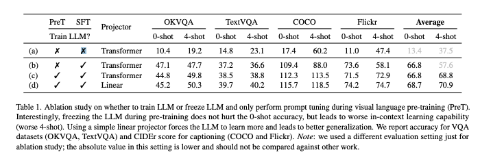
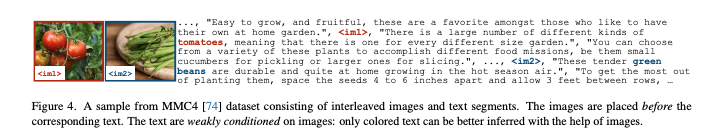
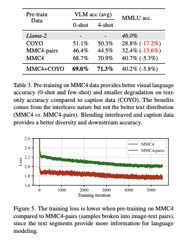
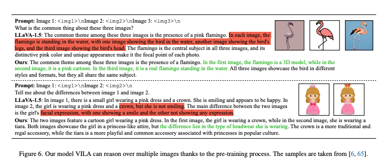
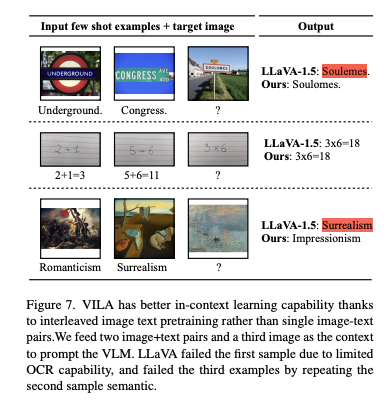

최근 LLM의 성공으로 인해 Visual Instruction Tuning이 할발히 진행되고 있습니다. 기존 연구는 LLM에 시각적인 입력을 추가하는 데 초점이 맞추어져 있었지만, VLM pre-training과정에 대한 심층적인 연구는 부족한 상태입니다.
이 연구는 LLM을 VLM으로 확장하는 사전 학습 과정의 다양한 설계 옵션을 체계적으로 비교하고 최적의 방법을 제안합니다.

주요 발견은 3가지로 요약할 수 있습니다. 
- LLM Freezing: 사전 학습 시 LLM을 freeze하면 zero-shot performance는 괜찮지만, in-context learning의 성능이 부족해집니다. 문맥학습을 가능하게 하려면 freeze를 해제하야합니다.
- 학습 데이터 설계: 단순히 image-text 쌍만 사용하는 것은 최적의 성능을 내지 못합니다. 대신 interleaved pre-training data가 더 유익합니다.
- re-blending: 이미지-텍스트 데이터를 사용하는 instruction fine-tuning 과정에서 텍스트 전용 데이터를 다시 혼합하면, text-only task의 성능 저하를 방지하고, vlm의 task 정확도를 높이는데 효과적입니다.

이 연구를 통해 새로운 사전 학습 방식을 적용하여 VILA(Visual Language Model Family)라는 모델을 개발하였습니다. 이 모델은 LLaVA 1.5 보다 주요 벤치마크에서 일관되게 더 나은 성능을 보였습니다. 또한 추가적인 기법이나 복잡한 조정을 하지 않고도 높은 성능을 발휘하였습니다. 

VILA의 주요 장점은 multi-image reasoning 능력, 향상된 in-context learning 성능, 더 나은 세계 지식이 있습니다. 이 모델은 jetson orion 같은 on-device 장치에서 실행가능합니다.

[Paper Link](https://arxiv.org/pdf/2312.07533)
[Code Link](https://github.com/NVlabs/VILA)

## Background

### Model Architecture
멀티모달 LLM은 일반적으로 두 가지 방식으로 분류됩니다.
- cross attention based: 이미지와 텍스트 간의 상호작용을 어텐션 메커니즘으로 처리
- auto-regressive based
    - 이미지 데이터를 visual token으로 변환하고 텍스트 토큰과 결합하여 모델에 입력
    - 시각적 입력을 외국어처럼 취급하여 기존 텍스트 전용 llm을 확장
    - 이미지-텍스트 입력이 임의의 순서로 섞여 있어도 처리 가능 
    - 유연성과 인기로 인해 이 연구는 이 기반 VLM의 사전학습에 초점을 맞춤니다.

#### Auto Regressive VLM의 구성 요소
- Visual Encoder: 이미지를 embedding으로 변환
- LLM: 텍스트를 생성
- Projector
    - 두 모달리티 간의 연결 역할
    - 단순 linear layer 또는 더 강력한 transformer block
    - 이 연구에서는 projector의 효과를 실험적으로 비교합니다.
- 입력과 출력
    - 입력: 시각적 데이터와 텍스트
    - 출력: 텍스트

#### Training Stages
- Projector 초기화
    - LLM, ViT는 각각 사전학습된 상태에서 시작됩니다.
    - Projector는 랜덤 가중칠고 초기화되며, 먼저 이미지-캡션 데이터를 사용하여 Projector만 학습합니다.
    - 이 과정에서 LLM, ViT는 Freeze 한 상태입니다.
- VLM Pre-training 
    - LLM과 Projector를 함께 학습합니다.
    - 데이터
        - Interleaved Image-Text Corpus (MMC4)
        - Image-Text Pairs (COYO, LAION)
    - 시각적 언어 alignment를 달성하는 과정으로 비용이 많이 들고 중요한 단계 입니다.
- Visual Instruction-Tuning
    - 사전 학습된 모델을 시각 언어 지시 데이터셋으로 튜닝
    - FLAN 스타일(데이터셋 별로 프롬프트 제공)로 기존 시각 언어 데이터셋을 변환하여 학습 

## On Pre-training for Visual Language Models

### 1. Updating LLM is Essential

> Fine-Tuning vs Prompt tuning

실험 결과 LLM의 업데이트가 중요하며 특히 in-context learning과 같은 LLM의 고유 특성을 유지하려면 fine-tuning이 필요하다는 것을 밝혔습니다. 
Fine-tuining이 유리한 이유는 visual embedding과 textual embedding의 분포를 깊은 레이어에서 alignment 시키기 때문입니다.
이 정렬은 두 모달리티의 상호작용을 원활하게 하고, LLM의 문맥 학습 능력을 시각 언어 작업에 적용할 수 있게 합니다. 실제로 fine-tuning 할 때 더 깊은 레이어의 유사도가 증가함을 확인하였습니다. 
또한 Transformer 기반 프로젝터보다 단순 선형 프로젝터를 사용할 때 더 나은 일반화 성능을 보였습니다. 

### 2. Interleaved Visual Language Corpus Helps Pre-training
LLM을 시각적 입력을 지원하도록 확장하면서도, 텍스트 전용 LLM의 성능을 유지하는 것이 목표입니다. 이를 위해 데이터 블렌딩이 중요한 역할을 합니다. 

- 이미지-텍스트 쌍 (Image-Text Pairs)
    - COYO의 경우 텍스트가 매우 짧고 간결하며, 텍스트 전용 LLM이 학습한 데이터 분포와 다름.
    - `<im1><txt2>, <im2><txt4>`
- Interleaved 데이터 (Interleaved Image-Text Datasets):
    - 텍스트와 이미지가 교차(interleaved)된 구조(예: MMC4, M3W).
    - 텍스트 전용 LLM 학습 데이터 분포와 더 유사.
    - `<txt1><im1><txt2><txt3><im2><txt4>`

    

실험 결과 Interleaved 데이터가 학습에 더 효과적임을 발견하였습니다. 여기에 MMc4 데이터를 단순히 이미지-텍스트 쌍 데이터로 변환하여 실험했더니, 성능이 똑같이 좋아지지 않았습니다. 즉, 텍스트의 분포보다 Interleaved 구조가 핵심입니다. 
이 경우 데이터의 다양성이 더 증가하고, 텍스트 전용 성능 저하를 완화하고, 시각적 언어 작업의 성능을 추가로 개선할 수 있습니다. 

### 3. Recover LLM Degradation with Joint SFT

Interleaved 데이터를 사용하면 텍스트 전용 성능이 크게 감소하지는 않지만 약 5%의 성능 저하가 발생합니다. 텍스트 전용 데이터를 추가로 사용하는 것이 성능 회복에 도움이 될 수 있지만, 텍스트 전용 데이터는 대부분 독점적이고 공개되지 않는 경우가 많습니다. 시각 언어 데이터의 규모에 맞게 데이터를 샘플링하는 방법도 명확하지 않습니다. 
사실 텍스트 전용 능력은 사라진 것이 아니라 일시적으로 감추어진겁니다. SFT 단계에서 소규모 텍스트 전용 데이터를 추가하면, 텍스트 전용 성능을 회복하고, 시각 언어 작업 성능도 동시에 향상시킬 수 있습니다.

기존의 SFT 방식은 일반적으로 VQA 과 같은 캡션 스타일 데이터로 미세 조정을 하였습니다. 그러나 이 방식만으로는 텍스트 전용 성능을 완전히 회복하지 못합니다. Joint SFT는 텍스트 전용 instruction data를 시각 언어 데이터와 함께 혼합하여 SFT를 진행합니다. 
이 실험에서는 FLAN 스타일로 샘플링된 텍스트 전용 데이터 100만개를 사용하였습니다. 
joint SFT르르 통해서 텍스트 전용 성능이 완전히 회복되고 Llama-2 모델과 동등한 수준의 성능을 달성하였습니다.
Instruction-Following capability를 향상시키며, 시각 언어 작업에도 중요하게 작용을 하였습니다. 또한 짧은 캡션 데이터로 인해 발생한 텍스트 전용 성능 저하를 방지하며, 시각적 다양성의 이점을 극대화하였습니다. 

## Experiments

•	높은 해상도의 이미지 사용: 기존에는 OpenAI의 CLIP-L 모델을 사용하여 224×224 해상도의 이미지를 처리했으나, 이제 336×336 해상도의 이미지를 사용하여 더 풍부한 시각적 세부 정보를 모델에 제공함으로써, 세부 정보가 중요한 작업(예: TextVQA)에서의 성능 향상을 도모합니다.
•	더 큰 규모의 LLM 적용: 기본적으로 Llama-2 7B 모델을 사용하여 실험을 진행했으나, 더 큰 규모의 LLM 백본(예: Llama-2 13B)을 적용하여 성능을 향상시킵니다.
•	사전 학습 데이터의 다양화: Interleaved 이미지-텍스트 데이터와 이미지-텍스트 쌍 데이터를 약 1:1 비율로 혼합하여 총 5,000만 개의 이미지를 포함하는 사전 학습 코퍼스를 구성합니다. 이는 기존의 수십억 규모의 사전 학습 데이터보다 적지만, 다운스트림 작업에서 인상적인 성능 향상을 보여줍니다.
•	SFT 데이터 개선: LLaVA-1.5에서 제공하는 더 다양하고 고품질의 프롬프트를 포함하는 SFT 데이터 블렌드를 추가하여, 다운스트림 평가 지표를 크게 향상시킵니다.
•	제한사항: 계산 자원의 한계로 인해 사전 학습 코퍼스의 규모를 수십억 개로 확장하지는 못했으나, 5,000만 개의 이미지로도 상당한 성능 향상을 달성했습니다.

•	시각 언어 작업 성능: 12개의 시각 언어 벤치마크에서 최첨단 모델들과 비교한 결과, 대부분의 데이터셋에서 일관된 성능 향상을 보였습니다. 특히, 7B 모델이 VisWiz와 TextVQA에서 LLaVA-1.5 13B 모델을 크게 능가하였으며, 영어로 된 시각-언어 지시 데이터로 학습되었음에도 불구하고 MMBench-Chinese 벤치마크에서 LLaVA-1.5를 능가하는 다국어 처리 능력을 보여주었습니다.
•	텍스트 전용 작업 성능: 모델이 시각적 입력을 지원하도록 확장되었지만, 텍스트 전용 작업에서도 성능을 유지하는 것이 중요합니다. MMLU, BBH, DROP의 세 가지 벤치마크에서 평가한 결과, 동일한 텍스트 SFT 데이터를 사용하여 미세 조정된 Llama-2 모델과 유사한 성능을 보였습니다. 7B 모델의 경우 약간 낮은 성능을 보였으나, 13B 모델은 더 높은 성능을 나타냈습니다. 이는 작은 모델이 사전 학습 중 텍스트 성능 저하를 더 많이 겪을 수 있다는 이전 연구의 관찰과 일치합니다.

모델은 사전 학습을 통해 여러 이미지에 대한 추론이 가능해졌습니다. 이는 지도 학습(SFT) 데이터가 단일 이미지 샘플로 구성되었음에도 불구하고 달성된 결과입니다. 예시로:
- 첫 번째 예시: 세 이미지에서 공통된 객체(플라밍고)와 각기 다른 예술 스타일을 식별하였습니다. 반면, LLaVA 모델은 이러한 정보를 구분하지 못하고 환각(hallucination)을 보였습니다.
- 두 번째 예시: 두 이미지 간의 차이점 중 하나인 머리 장식을 찾아냈습니다.

LLM의 중요한 특징인 맥락 내 학습을 통해, 몇 가지 예시를 제공하여 새로운 작업을 수행할 수 있습니다. LLaVA-1.5 모델도 어느 정도 이러한 능력을 보였으나, 이는 기본 LLM의 텍스트 전용 사전 학습에서 비롯된 것으로 보입니다. 그러나:
- 첫 번째 예시: LLaVA-1.5는 제한된 OCR 기능으로 인해 실패하였습니다.
- 세 번째 예시: 의미를 반복하여 실패하였습니다.

반면, 우리의 모델은 이러한 예시들에서 더 나은 성능을 보였습니다.

모델은 시각적 입력에 대해 단계별 추론을 수행할 수 있습니다. 프롬프트 끝에 “단계별로 생각해보세요”를 추가하면, VILA는 복잡한 CoT 추론을 수행합니다. 이러한 CoT 능력은 텍스트 전용 SFT에서 비롯된 것으로 보이며, 시각 언어 지시 데이터에는 이러한 샘플이 포함되어 있지 않습니다.

대규모 코퍼스에서 사전 학습을 통해, 모델은 세계 지식에 대한 이해도가 향상되었습니다. 유명한 랜드마크의 위치를 인식하는 사례 연구에서, VILA는 4개의 샘플 중 4개를 정확하게 인식한 반면, LLaVA-1.5는 2개만 맞췄습니다. 이는 사전 학습의 효과를 보여줍니다.

### Other Learnings
#### 이미지 해상도와 토큰 수의 관계
•	해상도 336×336 사용 이유:
•	기존의 224×224 해상도보다 더 세부적인 시각 정보를 제공.
•	TextVQA와 같은 세밀한 정보가 필요한 작업에서 정확도가 41.6% → 49.8%로 향상.
•	문제점:
•	더 높은 해상도는 이미지당 토큰 수가 증가(224: 196 tokens → 336: 576 tokens)하여 계산 비용이 커지고, 문맥 내 학습(in-context learning) 시 예제 수가 제한됨.
•	해결책: 토큰 압축(Dimensionality Reduction):
•	“다운샘플” 프로젝터를 사용하여 2×2 토큰을 하나로 병합하고 선형 계층으로 정보 융합.
•	336 해상도에서도 토큰 수를 144로 줄임(224 해상도보다 적음).
•	TextVQA 정확도:
•	336+linear: 49.8%
•	336+다운샘플: 46.0%
•	224+linear: 41.6%
•	결과: 이미지 토큰에 큰 중복성이 존재하며, 압축 방식이 성능 저하 없이 효율성을 높일 가능성을 시사.
#### Frozen LLM vs. Fine-tuning LLM
•	Frozen LLM:
•	LLM을 동결하고 **시각적 전문가(Visual Expert)**를 추가로 사용하여 시각 토큰 처리.
•	장점: 텍스트 전용 입력 기능 완전히 유지.
•	단점:
•	모델 크기가 약 2배 증가하여 엣지 디바이스에서의 배포가 어려움.
•	문맥 학습(in-context learning) 성능이 Fine-tuning 방식보다 낮음.
•	Fine-tuning LLM:
•	LLM을 직접 미세 조정하여 시각 언어 사전 학습 진행.
•	결과:
•	문맥 학습 성능 및 정확도에서 우수(Fine-tuning: 71.0% vs. Visual Expert: 67.0%).
•	더 작은 모델 크기로 효율적 배포 가능.
•	결론: Fine-tuning 방식이 더 나은 성능과 효율성을 제공.

#### PEFT/LoRA
•	LoRA (Low-Rank Adaptation):
•	모델 크기를 최소화하면서 미세 조정을 수행.
•	그러나 VQA, GQA, VisWiz 등 다양한 데이터셋에서 Fine-tuning보다 일관되게 낮은 성능을 보임.
•	예: VQAv2에서 LoRA 69.4% vs. Fine-tuning 79.9%.
•	결론: Fine-tuning이 LoRA보다 더 높은 성능을 제공.

#### Interleaved 데이터 구조의 중요성
•	데이터 구조 변경 실험:
•	 구조 대신  형식으로 MMC4 데이터를 재구성.
•	결과:
•	제로샷(0-shot) 정확도: 4.4% 감소.
•	4-shot 정확도: 37.5% 감소.
•	이유: 이미지와 텍스트가 섞여(interleaved) 있지 않으면, 문맥 학습 능력이 크게 저하됨.
•	결론: Interleaved 데이터 구조는 문맥 학습과 모델 성능에 매우 중요.

