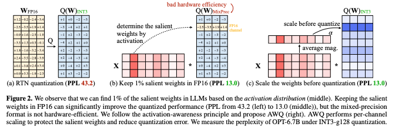

이 논문은 LLM을 엣지 디바이스에서 실행하기 위해 activation-aware weight quantization 이라는 방법을 제안합니다.

엣지 디바이스 환경은 클라우드 컴퓨팅 비용 절감과 사용자 프라이버시 보호 측면에서 중요성이 커지고 있습니다. LLM은 거대한 모델 크기와 엣지 디바이스의 제한된 하드웨어 자원은 배포에 큰 도전 과제입니다. 
AWQ의 핵심 아이디어는 아래와 같습니다.
- LLM은 모든 가중치가 동일하게 중요한 것은 아닙니다.
- 가장 중요한 1%의 가중치만 보호해도 양자화의 오류를 크게 줄일 수 있습니다
- 중요 가중치 채널을 식별하려면 가중치 자체가 아니라 활성화 분포를 참조해야합니다. 
이 방법은 혼합 정밀도 양자화를 피하기 위해, 중요한 가중치 채널을 scaling 하면 양자화 오류를 줄일 수 있음을 수학적으로 도출하였습니다. 스케일링 값은 활성화 통계 데이터를 오프라인으로 수집하여 결정합니다.

역전파나 복원을 요구하지않고, 도메인과 모달리티에 구애받지 않고 일반화 할수 있으며, 캘리브레이션 데이터셋에 오버피팅되지 않으므로 이 방법은 범용적입니다. 

다양한 언어 모델링과 도메인별 벤치마크에서 기존 양자화 대비 우수한 성능을 달성하였습니다. 
TinyChat은 4-bit LLM/VLM을 위한 효율적인 추론 프레임워크 입니다. 커녈 퓨전 및 플랙폼 맞춤형 weight packing을 적용하여 데스크탑 및 모바일 gpu에서 HF FP16 대비 3배 이상 속도 향상을 달성하였습니다. 또한 70B Llama-2 모델을 모바일 gpu에서 배포에 성공하였습니다. 

[Code Link](https://github.com/mit-han-lab/llm-awq)  
[Paper Link](https://arxiv.org/pdf/2306.00978)

## Related Work
### Model quantization methods
딥러닝 모델의 비트 정밀도를 낮춤으로써 모델 크기를 줄이고 추론 속도를 높이는 기술입니다.
양자화 기법은 두 가지 주요 범주가 있습니다.
- Quantization-Aware Training (QAT): 역전파(backpropagation)를 통해 양자화된 가중치를 업데이트. 대규모 언어 모델(LLM)처럼 큰 모델에는 확장성이 부족.

- Post-Training Quantization (PTQ): 학습이 필요 없는 방법으로, 모델 학습 후 양자화를 적용. LLM 양자화에 적합.

## AWQ: ACTIVATION-AWARE WEIGHT QUANTIZATION
양자화는 부동소수점(floating-point) 숫자를 저비트 정수(lower-bit integers)로 변환하는 방법으로 모델 크기를 줄이고 LLM 추론 비용을 줄이는데 효과적입니다.

하지만 양자화 과정에서 발생하는 성능 저하기 주요 이슈였습니다. 중요한 가중치가 손실되면 모델 성능이 크게 저하될 수 있습니다.

### 1. Improving LLM Quantization by Preserving 1% Salient Weights

양자화 시, 중요한 가중치를 제외하면 성능 저하를 줄일 수 있습니다. 실험 결과, 가중치 채널의 **0.1%-1%**만 FP16으로 유지해도 양자화 성능이 크게 향상됨을 발견했습니다.

중요한 가중치를 식별하는 방법은 기존에는 가중치의 크기나 l2-norm을 기준으로 중요한 가중치를 선택하였지만, 이 방법은 성능 향상에 큰 기여를 하지 않았습니다.
그래서 새로운 방법은 activation의 크기를 기준으로 중요한 가중치를 선택합니다. input feature의 크기가 클수록 모델 성능에 더 중요한 역할을 할 가능성이 더 높기 때문입니다. 
중요한 가중치 채널을 FP16으로 유지하면, 양자화로 인한 성능 저하를 효과적으로 줄일 수 있었습니다. 

하지만, 이런 혼합 정밀도 데이터 타입은 시스템 구현을 복잡하게 만듧니다. 그래서 중요한 가중치를 보호하면서도 FP16 데이터 타입을 사용하지 않는 방법 개발이 필요하였습니다. 이를 위해 Scaling기반의 보호 방법을 제안합니다.

### 2. Protecting Salient Weights by Activation-aware Scaling

양자화는 가중치 w를 저비트 정수로 변환하여 모델의 크기를 줄이지만, 이 과정에서 오류를 발생시킵니다. 
`y=wx, 양자화 형태 y=Q(w)x, Q(w)=Rouns(w/S)*S`
- S: 최대 절대값에 의해 결정되는 양자화 스케일러 `S=max(|w|)/2^(N-1)`
- N: the number of quantization bits

특정 가중치 w를 스케일 s > 1로 확대하고, 입력 x를 반대로 스케일링하면 오류를 줄일 수 있습니다.

`Q(w*s)x/s=S*Round(w*s/S)x/s`

s>1 스케일링으로 중요한 가중치 채널의 상대적 오류를 줄일 수 있습니다. 
하지만 너무 큰 s(s=4)는 비 중요한 채널의 오류를 확대해서 오히려 성능 저하를 초래할 수 있습니다.

그래서 우리의 목표는 양자화 후 출력 차이를 최소화 하는 스케일링 펙터를 찾는 것 입니다. 

이는 최적화 문제로 정의할 수 있습니다.  

`s'=argmin_s L(s), L(s)=|Q(W*diag(s))(diag(s)^-1*X) - WX|`
- W: FP16 weight, X: input, Q: quantization Function
- s: 입력 채널별 스케일링 팩터 

이는 입력 활성화의 평균 크기 s_x를 기반으로 간단한 검색공간을 정의하여 찾을 수 있습니다. 

`s=s_x^a, a'=argmin_a L(s_x^a)`

- a: 중요한 채널 보호와 비중요 채널 오류의 균형을 조정하는 하이퍼파라미터로 [0, 1] 사이에서 빠른 그리드 검색으로 최적화 가능

추가적으로 weight clipping 을 적용하여 오류를 최소화 하였습니다. AWQ 는 기존의 방법대비 일관된 성능 향상을 보였으며 FP16 혼합 정밀도와 유사한 성능을 유지하면서도 더 하드웨어 친화적인 방식입니다.

## TINYCHAT: MAPPING AWQ ONTO EDGE PLATFORMS

- AWQ 모델 추론을 최적화하기 위해 TinyChat을 도입.
- PyTorch 프런트엔드와 장치별 명령어 집합(CUDA/PTX, Neon, AVX 등)을 활용한 백엔드 제공.

- 성능 병목 분석 
    - 메모리 바운드:
        •	계산 처리량 대비 메모리 접근 속도가 병목.
        •	FLOPs(모델의 계산량)는 고정되어 있으므로, 메모리 트래픽을 줄이는 것이 성능 개선의 유일한 방법.
    - 메모리 트래픽 분석:
        •	가중치 접근이 메모리 트래픽의 대부분을 차지.
        •	활성화보다 가중치의 비트 수를 줄이는 것이 성능 향상에 더 효과적

- GPU에서의 구현:
    •	주로 핵심 컴포넌트(예: Attention, Layer Normalization, Linear Projection)만 구현하여 효율성 극대화.
    •	유연한 프런트엔드:
    •	새로운 모델에 대한 빠른 커스터마이징 및 지원 가능.
    •	성능:
    •	4비트 AWQ를 사용하는 TinyChat은 Huggingface FP16 구현 대비 3배 이상의 속도 향상을 달성.
- CPU에서의 구현:
    •	전체 계산 그래프를 C++로 변환하여 오버헤드 최소화.

### Deploy AWQ with TinyChat

a. On-the-fly 가중치 디양자화

	•	문제:
        •	하드웨어에서 INT4와 FP16 간의 곱셈 연산을 지원하지 않음.
        •	따라서, 행렬 연산 전 **INT4를 FP16으로 디양자화(dequantize)**해야 함.
        •	디양자화된 가중치를 DRAM에 기록하면 성능 저하 발생.
	•	해결책:
        •	디양자화 커널과 행렬 곱셈 커널을 융합(kernel fusion):
        •	디양자화를 메모리 외부에서 처리.
        •	행렬-행렬(Matrix-Matrix) 및 행렬-벡터(Matrix-Vector) 연산 모두 적용.

b. SIMD 기반 가중치 패킹

	•	문제:
        •	4비트 가중치 디양자화는 단일 가중치당 1번의 Shift, Bitwise AND, FMA(Fused Multiply-Add) 연산이 필요.
        •	디양자화 과정이 실제 연산보다 더 큰 비용을 유발할 수 있음.
        •	특히 CPU의 SIMD(Vectorized) 아키텍처에서는 벡터 연산을 선호하므로 비효율성이 두드러짐.
	•	해결책:
        •	플랫폼에 맞는 가중치 패킹(weight packing):
        •	ARM CPU 예시:
        •	128비트 SIMD 레지스터는 32개의 4비트 가중치를 저장 가능.
	•	기존 방식:  w_0, w_1, …, w_{31} .
	•	제안된 방식:  w_0, w_{16}, w_1, w_{17}, …, w_{15}, w_{31} .
	    •	제안된 패킹은 모든 32개의 가중치를 3개의 SIMD 명령으로 언패킹 가능(기존에는 가중치당 3개의 명령 필요).
	•	성능:
        •	최대 1.2배 속도 향상.
        •	GPU 예시:
            •	8개의 가중치를  w_0, w_2, w_4, w_6, w_1, w_3, w_5, w_7  형태로 패킹.
            •	벡터 연산 최적화(Kim et al., 2022).

c. 커널 융합(Kernel Fusion)

    •	효과:
        •	연산 커널 호출 수를 줄여 직접적인 속도 향상.
        •	구체적인 최적화:
        •	Layer Normalization:
        •	곱셈, 나눗셈, 제곱근 등을 단일 커널로 통합.
        •	Attention Layers:
        •	QKV 프로젝션 연산을 하나의 커널로 통합.
        •	위치 임베딩 계산(on-the-fly positional embedding)을 실시간으로 수행.
        •	KV 캐시를 사전 할당하고, 캐시 업데이트를 Attention 커널 내부에서 처리.
    •	장점:
        •	특정 모델(Falcon, StarCoder 등)에서 비효율적인 전방 패스(forward pass) 성능을 개선.
        •	RTX 4090 GPU 기준, 단일 FP16 커널 연산 시간 ≈ 0.01ms.
        •	커널 호출 오버헤드와 동일한 수준.
        •	커널 호출 수 감소 → 성능 개선.