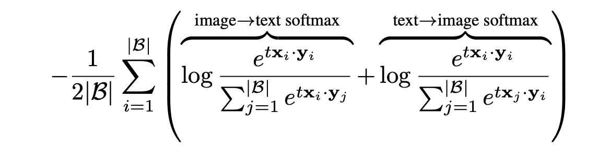
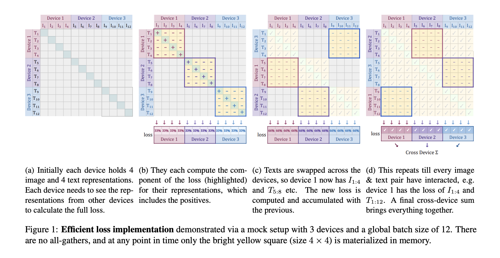
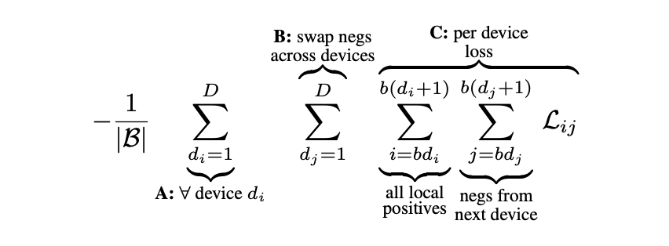

Sigmoid Loss 기반의 SigLIP는 기존 contrastive learning의 한계를 극복하고, 효율성과 성능을 동시에 향상시킬 수 있는 새로운 접근법을 제시합니다. 소규모 리소스로도 강력한 성능을 달성하며, 배치 크기와 손실의 독립성 덕분에 다양한 실험과 최적화가 용이합니다.

[Paper Link](https://arxiv.org/pdf/2303.15343)
[Code Link](https://github.com/google-research/big_vision)

## Related Work

### Sigmoid 기반 Contrastive Learning
이전 비지도 차원축소 작업에서 sigmoid를 사용하였습니다 (오토인코더의 잠재공간 활성화함수). classification 작업에서는 이미 softmax loss보다 효과적이고 강건함이 입증되었습니다 (multi-label classification). 
대조 학습에서는 대다수 연구가 softmax 기반 InfoNCELoss를 사용하고 있습니다. sigmoid loss는 이에 비해 전역적인 normalization을 요구하지 않아 효율적입니다.

- InfoNCELoss(Information Noise-Contrastive Estimation): 이 손실 함수는 양의 쌍(positive pairs)과 음의 쌍(negative pairs) 간의 유사도를 조정하여 모델이 의미 있는 표현을 학습하도록 유도합니다.
    - 양의 쌍(Positive Pairs): 의미적으로 관련이 있는 데이터 쌍으로, 예를 들어 동일한 이미지의 서로 다른 증강 버전이나 연속적인 비디오 프레임 등이 해당합니다
    - 음의 쌍(Negative Pairs): 의미적으로 관련이 없는 데이터 쌍으로, 무작위로 선택된 서로 다른 이미지나 비디오 프레임 등이 이에 속합니다.
    - InfoNCE 손실 함수는 주어진 앵커(anchor)와 양의 예시(positive example) 간의 유사도를 최대화하고, 앵커와 음의 예시(negative examples) 간의 유사도를 최소화하는 방식으로 작동합니다. 이를 통해 모델은 의미 있는 표현을 학습하게 됩니다.
    - 유사도를 측정하는 함수로, 일반적으로 코사인 유사도가 사용됩니다.

### Softmax 기반 language-image pretraining
제로샷 transfer 작업에서 뛰어난 성능을 보입니다 (CLIP). 후속 연구들은 이들 모델이 finetuning, linear regression, object detection, semantic segmentation, video tasks 등에서 좋은 표현을 생성함을 입증하였습니다. 

### Generative language-image pre-training
Softmax 기반 대조 학습 외에도, 생성적(pretraining generative) 접근법이 제안되었습니다.
주요 모델은 GIT, SimVLM, LEMON 등과 같은 텍스트 디코더를 사용한 사전학습 모델이 있습니다.

### Efficient language-image pre-training
Softmax는 대조학습에서 널리 사용되어 강력한 성능을 입증하였지만, 배치 크기와 유사도 정규화에 민감합니다.
Sigmoid는 로컬 정규화로 효율성을 높이고, 특히 큰 배치와 작은 배치 모두에서 우수한 성능을 보여줍니다.

## Method

대조학습의 목적은 일치하는 이미지-텍스트 쌍의 임베딩은 가깝게, 일치하지 않는 쌍의 임베딩은 멀어지도록 학습하는 것입니다. 여기서 가정은 한 이미지의 택스트는 다른 이미지와 관련이 없다고 가정합니다.(완벽하지 않고 노이즈가 있을 수 있습니다. )

### SoftMax Loss for LVLM pre-training
Softmax loss는 이미지->텍스트, 텍스트->이미지 방향에서 각각 독립적으로 정규화를 수행합니다. 

위 함수는 전역 정규화가 필요합니다. 전체 배치의 모든 쌍을 고려하여 정규화하여야 하기 때문에, 배치 크기가 커질 수록 계산 비용이 증가합니다. 

### Sigmoid Loss for LVLM pre-training
Sigmoid Loss는 각 이미지-텍스트 쌍을 독립적으로 처리하여 이진 분류(binary classification) 문제로 변환하였습니다.                                                        

- b: 학습 가능한 바이어스 항으로 초기값을 -10으로 설정해 불균형 문제 완화.
- t: 학습 가능한 온도 매개변수로 초기값을 log10으로 설정
- z: 레이블 (일치 1, 불일치 -1)

전역 정규화 없이 각 이미지-텍스트 쌍에 대해 개별적으로 계산하고, 전역 유사도 행렬 계산을 피할 수 있어 효율적입니다. 초기에 negative pair이 많아 초기 손실이 크지만, 바이어스 항으로 이를 완화할 수 있습니다. 

### Efficient "Chunked" implementation
데이터를 여러 장치( D )에 병렬 처리하는 방식에서 손실을 계산하려면, 모든 장치에서 생성된 임베딩을 모아야 합니다. 모든 임베딩을 모으는 all-gather 연산은 계산 비용이 크고, 배치 크기가 |B| 이면 모든 쌍의 유사도를 저장하려면 |B|x|B| 크기의 메모리 집약적인 행렬이 필요합니다.

Sigmoid Loss의 특성을 활용한 청크 방식은 계산을 메모리 효율적이고 빠르게 수행할 수 있습니다. 
전체 배치 크기 |B|를 D개의 장치로 나누면 각 장치의 배치 크기는 b=|B|/D 입니다. 
각 장치에서 독립적으로 로컬 배치의 양의 쌍 손실을 계산하고, 각 장치는 인접한 장치로부터 음의쌍 데이터를 가져와 b-1 개의 음의 쌍 손실을 계산합니다. 음의 예시 데이터를 장치간 순환적으로 교환하기 때문에, D번의 데이터 교환만으로도 모든 음의 쌍을 포함할 수 있습니다.
각 장치는 자신의 로컬 배치에 대한 손실 계산을 독립적으로 수행합니다. 그리고 로컬 손실의 결과를 최종적으로 합산하여 전체 손실을 계산합니다. 

이를 통해 각 장치당 b^2 크기의 유사도 행렬만 필요하여 메모리 절약이 되고, 배치 크기가 증가할 때 추가 장치만 사용하면 계산량을 효과적으로 분산 가능합니다. 이러한 청크 방식을 통해서 배치크기를 100만개 이상으로 확장 가능할 뿐만 아니라 상대적으로 적은 수의 장치로도 대규모 학습을 수행할 수 있습니다. 

