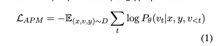
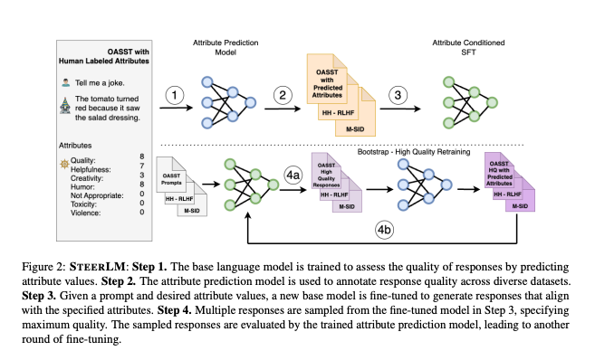
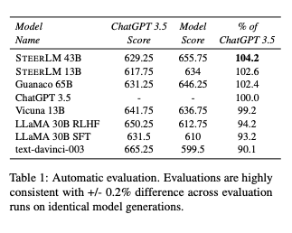

기존의 RLHF은 복잡한 훈련과정과 단일 차원의 피드백에 의존한다는 문제가 있었습니다. 그래서 저자는 SteerLM을 소개합니다. 이는 SFT를 활용하여 사용자에게 명시적이고 다차원적인 속성을 설정할 수 있도록 지원하고, AI 가 생성하는 응답을 사용작가 조건에 따라 조정(Steer) 가능하게 합니다. 이 방법은 RLHF 보다 훈련이 간단하면서도 고품질 응답을 생성할 수 있습니다. 실험결과 오픈 데이터셋으로 훈련된 SteerLM 은 최신 RLHF 기반 모델보다 사람과 자동평가에게 둘다 선호됨을 확인하였습니다. 

[Paper Link](https://arxiv.org/pdf/2310.05344)  
[Code Link](https://huggingface.co/nvidia/SteerLM-llama2-13B)

## Related Work
### SFT 기반 정렬 
- 장점
    - 여러 작업에 대한 언어 모델의 지도 미세 조정을 통해 다양한 유형의 지침을 따를 수 있고, 훈련되지 않은 작업도 수행 가능
    - 인간 데모 데이터로 훈련 시 고품질의 인간과 유사한 응답 생성 가능
- 단점
    - 학문적 데이터셋으로 훈련된 모델은 짧고 로봇 같은 응답을 생성.
    - RLHF(강화 학습 기반 정렬)에 비해 상용 모델에 성능이 미치지 못하는 경우 있음.

### RLHF
모델 응답의 바람직함을 기준으로 보상을 주어 모델의 지침 준수 능력을 개선하는 방법으로 질문-응답 및 요약 같은 하위 작업에서 성과를 보였습니다. 
- 단점
    - 훈련 과정이 복잡
    - 보상함수가 단일 차원으로 설계되어 인간의 다차원적인 선호를 제대로 반영하지 못함
    - 다차원 속성을 고려하지 않으면 다양한 응답 생성에 한계가 있음

### Attribute Grounged Generation
- 기존 연구
    - 감정 기반 대화 생성
    - 대화 스타일 기반 대화 생성
    - 개인 속성 기반 대화 생성
    - 특정 게임 내 플레이어 스킬 기반 대화 생성
- 한계점
    - 기존 연구는 특정 속성에만 초점을 맞추어 좁은 범위의 작업에 적용

## SteerLM
### Step 1. Attribute Prediction Model
- 역할 
    - 인간 선호도를 예측하여 모델 응답의 품질을 향상
    - RLHF의 단일 보상 신호 대신, 품질, 독성, 유머, 창의성 등 다양한 속성을 예측
- 방법 
    - Open Assistant(OASST) 데이터셋 사용: 각 샘플에는 프롬프트 x, 응답 y, 속성 v 이 포함되어 있습니다. 
    - 속성 v를 0~9 사이의 정수로 변환 후 선형화 하여 학습합니다.
    - `V = {quality:6, toxicity:0, humor:9, creativity:0}`
    - 모델이 x, y를 조건으로 v를 예측하도록 학습됩니다. 

### Step 2. Annotating Datasets using Attribute Prediction Model
- 목적
    - 속성 예측 모델을 활용해 다양한 데이터셋에 속성 정보를 주석(annotation) 추가.
    - HH-RLHF 데이터셋에 속성 주석 추가하여 훈련 데이터 다양성 증가.
- 필요성
    - 사람 주석 데이터의 문제점: 잘못된 해석, 주석자의 전문성 부족, 언어 이해력 제한. 주석자 간 점수 기준 불일치.

- 방법
    - 속성 예측 모델을 사용해 노이즈를 줄이고 점수를 보정(calibration).
    - 주어진 프롬프트와 응답 쌍(x, y)에 대해 속성(v)을 **탐욕적으로 디코딩(greedy decoding)**하여 속성 주석 데이터셋  D'  생성.

### Step 3. Attribute Conditioned SFT
- 속성(conditioned attributes)을 활용하여 지도 학습(SFT)을 확장한 방법.
- RLHF(강화 학습)처럼 고품질 및 저품질 응답을 모두 학습하지만, 오프라인 주석 데이터셋만 사용하여 RLHF보다 훈련 과정이 단순.
- 장점
    - 온라인 샘플링 및 평가가 필요하지 않아 RLHF의 복잡한 설정(온라인 데이터 생성/평가)과 메모리 대역폭 문제를 피할 수 있음.
    - Step 2에서 생성된 속성 주석 데이터셋 D'를 사용.
- 훈련 방법
    - 입력 x (프롬프트)와 속성 v (조건부 속성), 목표 응답 y를 기반으로 모델 학습.
    - 모델은 v, x, 그리고 이전 응답 `y_{<t}`를 조건으로 y_t를 예측.

### Step 4. Bootstrapping with High-Quality Samples
Attribute Conditioned SFT와 Attribute Prediction Model을 활용해 모델의 응답 품질을 점진적으로 향상합니다.

a. 고품질 응답 생픔 생성
- 속성 조합 필터링: 주석 데이터셋에서 가능한 모든 속성 조합을 나열. 속성 중 **품질(quality)**이 최고 값(9)을 가지는 조합만 선택해 고품질 속성 집합 V 생성.

- 응답 샘플링: 
    - V에서 속성 v'를 균일하게 샘플링하고, 이를 기존 프롬프트와 결합. 
    - Top-k 샘플링(k=50)을 사용해 다양한 응답 y' 생성. 
    - 결과적으로 다양한 고품질 응답 샘플이 포함된 데이터셋 D'' = {x, y'} 생성.

- 응답 평가
    - 속성 예측모델을활용하여 생성된 응답 y'에 대해 속성 v''를 예측 
    - 최종적으로 D'''={x, y', v''} 데이터셋을 생성 

b. Attribute Conditioned SFT 2
- D''' 데이터셋을 사용하여 모델 성능을 추가로 향상
- 모델이 자신의 응답을 기반으로 더 정교하게 학습

## Experiments
STEERLM은 다양한 오픈소스 데이터셋을 사용하며, RLHF에 비해 데이터 수집 비용이 적게 듭니다. 주요 데이터셋은 다음과 같습니다:

- OASST (Open Assistant Dataset):
    - 사용 목적: Attribute Prediction Model 학습 및 Attribute Conditioned SFT에 활용.
    - 구성: 13개의 인간 라벨 속성(점수 0~1) 포함.
    - 사용된 속성: 품질, 독성, 폭력성, 유용성, 창의성, 유머, 부적절성.
    - 제외된 속성: 항상 “False”로 유지해야 하는 증오 발언, 언어 불일치, 개인정보(PII).
    - 특징: 긍정 및 부정 응답 모두 학습에 활용하며, 전체 48.8K 대화 샘플 사용.

- HH-RLHF (Helpful and Harmless - Reinforcement Learning from Human Feedback):
    - 사용 목적: Attribute Prediction Model을 사용해 응답에 속성을 주석(annotation).
    - 구성: 348.6K 대화 샘플 사용.
    - 특징: 다양한 프롬프트와 응답을 제공하여 데이터 다양성 증가.
- M-SID (Model Self-Identification Dataset):
    - 구성: 모델 정체성과 관련된 질문(“누가 당신을 만들었나요?” 등)에 대한 910개의 프롬프트-응답 쌍.
    - 사용 목적: Attribute Conditioned SFT 훈련에 포함.

사용한 베이스 모델은 다음과 같습니다.

- STEERLM 43B
    - 다국어 데이터(웹 크롤링, 뉴스, 서적, arXiv 논문, 코드 저장소 등)로 학습. 1.1조 토큰으로 학습되었으며, LLaMA 30B 및 65B 모델과 유사한 성능.
    - 목적: Attribute Prediction 및 Attribute Conditioned SFT의 백본 모델.

- STEERLM 13B
    - Llama 2 13B 베이스 모델을 기반으로 STEERLM 방법론 적용.

훈련 세부 사항은 다음과 같습니다.
- 하드웨어: 16개의 A100-DGX 노드 사용 (각 노드에 A100-80GB GPU 8개 포함).
- 전역 배치 크기 128.
- 학습 에폭: 5.
- 최대 시퀀스 길이: 4096 토큰.
- 옵티마이저: Adam.
- 가중치 감쇠(weight decay): 1e-2

- Attribute Prediction Model: 검증 세트에서 가장 낮은 손실을 기록한 체크포인트 선택.
- Attribute Conditioned SFT Model: 검증 세트에서 가장 높은 품질을 기록한 체크포인트 선택.

## Ablation studies
- 속성 라벨 추가
    - 속성 라벨(특히 품질 속성)이 성능 향상에 중요한 역할.
    - 성능 16.5% 증가.

- 고품질 데이터만으로 미세 조정
    -  OASST 데이터셋에서 최고 품질(quality=최대값)을 가진 3400개의 샘플만 사용해 성능 1.9% 증가.
    - 대량의 저품질 데이터보다 소량의 고품질 데이터로 학습하는 것이 더 효과적.

- 속성 예측 모델 활용
    - 인간 주석을 사용하는 경우 대비 4.6% 성능 증가.
    - 속성 예측 모델이 주석 과정의 노이즈를 줄이고 데이터 품질을 보정.
    - 여러 샘플에서 일관된 품질 보정 가능.

- 고품질 샘플로 부트스트래핑
    - 데이터 증강 및 응답 공간 탐색을 통해 고품질 데이터로 데이터셋을 강화.
    - 성능 0.5% 증가.

