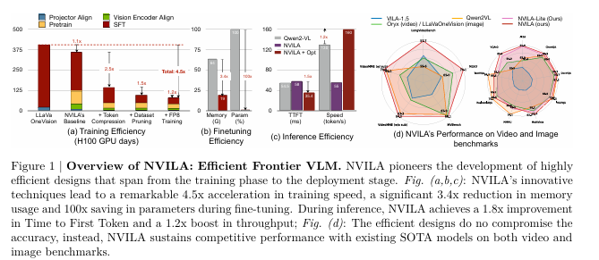
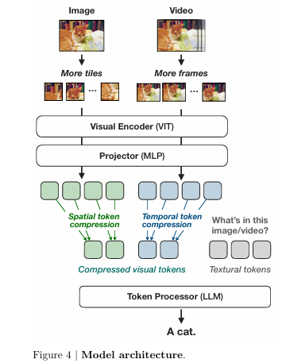
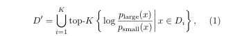

위 논문은 **NVILA**라는 새로운 Visual Language Model(VLM) 가족을 소개하며, 정확도와 효율성을 동시에 최적화하는 데 중점을 둔 모델입니다. 기존의 **VILA** 모델을 기반으로, NVILA는 모델 구조를 개선하여 공간적 및 시간적 해상도를 확장한 후, 시각적 토큰을 압축하는 **"확장 후 압축(scale-then-compress)"** 접근 방식을 사용합니다. 이를 통해 고해상도 이미지와 긴 영상을 효율적으로 처리할 수 있습니다.

또한, NVILA는 학습, 미세 조정, 배포까지 모델의 전체 라이프사이클에서 효율성을 향상시키기 위한 체계적인 조사를 수행했습니다. 그 결과, NVILA는 주요 공개 및 상용 VLM들과 비교해 다양한 이미지 및 영상 벤치마크에서 동등하거나 우수한 정확도를 보이며, 다음과 같은 효율성을 달성했습니다:

- **학습 비용**: 4.5배 절감  
- **미세 조정 시 메모리 사용량**: 3.4배 절감  
- **사전 작업(latency)**: 1.6-2.2배 감소  
- **디코딩 지연 시간**: 1.2-2.8배 감소  

[Paper Link](https://arxiv.org/pdf/2412.04468)
[Code Link](https://github.com/NVlabs/VILA)

## Approach

### 1. Efficient Model Architecture

- NVILA는 VILA 모델을 기반으로 구축되었습니다.
- NVILA는 세 가지 주요 구성 요소로 이루어져 있습니다
    - 시각 인코더(SigLIP): 이미지 및 영상 입력에서 특징을 추출.
    - 프로젝터(2-layer MLP): 시각적 특징과 언어 특징을 정렬.
    - 토큰 프로세서(Qwen2): 시각적 및 언어적 토큰을 입력받아 언어 토큰을 출력.

- 기존 VILA의 한계
    - 공간 및 시간 해상도에서 제한이 있었습니다
        - 이미지를 448×448로 고정 리사이즈.
        - 영상에서 최대 14 프레임 샘플링
    - 이러한 제한으로 인해 정보 손실이 발생하여 큰 이미지나 긴 영상 처리에서 성능이 저하되었습니다.
    - 텍스트가 많은 이미지나 긴 영상 벤치마크에서 VILA가 다른 VLM들보다 성능이 떨어짐

#### Spatial “Scale-Then-Compress”

1. **해상도 확장**:
   - 더 높은 해상도(예: 448, 896, 1344)와 긴 영상을 처리 가능하게 함.
   - 단, 해상도 확장 시 시각적 토큰 수가 증가하며, 이로 인해 학습 및 추론 비용이 자원적으로 크게 증가(self-attention mechenism의 비용은 토큰 수에 따라 제곱으로 증가).

2. [**S2 (Scaling on Scales)**](https://arxiv.org/pdf/2403.13043):
- 다중 스케일 이미지 생성: 입력 이미지를 다양한 해상도로 보간하여 여러 스케일의 이미지를 생성합니다. 예를 들어, 기본 해상도가 224×224인 이미지를 448×448, 672×672 등으로 확대합니다.
- 서브-이미지로 분할: 확대된 각 이미지를 원래 모델이 처리할 수 있는 크기(예: 224×224)로 분할합니다. 예를 들어, 448×448 이미지는 224×224 크기의 4개 서브-이미지로 나눕니다.
- 특징 추출: 각 서브-이미지를 사전 학습된 동일한 비전 모델에 입력하여 특징 맵을 추출합니다.

- 특징 맵 병합 및 평균 풀링: 추출된 서브-이미지의 특징 맵을 결합하여 원래 이미지의 전체 특징 맵을 구성합니다. 그런 다음, 이 특징 맵을 원래 해상도로 평균 풀링합니다.
    - 예를들어 모델로부터 224x224 입력 이미지로 16x16 특징맵이 생성된다고 하면, 448x448 이미지의 경우 4개의 16x16 특징맵이 생성됩니다. 
    - 이 4개의 2x2 특징 맵을 공간적으로 결합하여 32x32 전체 특징맵으로 결합합니다. 
    - 이를 원래의 16x16 특징맵으로 다운샘플링합니다. 이 과정은 average pooling을 통해 이루어집니다. 

- 다중 스케일 특징 맵 결합: 각 스케일에서 얻은 특징 맵을 채널 차원에서 연결하여 최종 다중 스케일 특징 표현을 생성합니다.
    - 위의 과정을 통해 다양한 해상도별 16x16 특징맵 모음을 얻습니다. 
    - 특징 맵의 크기는 같지만, 채널의 내용은 각 스케일에 대한 정보를 담고 있습니다.
    - 이 특징맵들을 채널 차원에서 concatenation 합니다. 

3. **Dynamic-S2**:
- Dynamic-S2는 기존 S2 방식의 한계를 개선하여, 이미지의 원본 **종횡비(Aspect Ratio)**를 더 잘 보존하는 방식으로 발전시킨 접근법입니다.
-  이미지 왜곡 문제를 줄이고, 다양한 비율의 이미지를 효과적으로 처리할 수 있도록 설계되었습니다.
- S2 방식에서는 이미지의 원본 종횡비와 상관없이 이미지를 정사각형(square)으로 리사이징합니다. 이로 인해, 세로로 길거나(긴 직사각형), 가로로 넓은 이미지(짧은 직사각형)의 경우 왜곡이 발생할 수 있습니다.
- Dynamic-S2는 가장 큰 스케일의 이미지를 처리할 때, 정사각형으로 리사이징하지 않고 원본 종횡비를 유지하는 크기로 조정합니다.
- 단, 조정된 크기는 448x448 타일로 나누어떨어지는 크기로 변경합니다. 이는 모델의 효율적인 타일 분할과 처리를 위해 필요합니다.
    - 예를 들어 800x2000 이미지는 896x1792로 리사이징됩니다. 
- 이미지를 여러 스케일에서 처리한 후, **모든 스케일의 피처 맵(feature maps)**을 가장 큰 스케일의 크기로 **보간(interpolation)**하여 맞춥니다.
    - 예를들어 896x1792 이미지는 2x3의 타일로 나누어지고 448x448 이미지의 피처맵 크기가 16x16이라면, 32x48 크기의 피처맵을 생성합니다. 그리고 이는 가장 큰 크기의 피처맵으로 interpolation 됩니다. 
- 이후, 이 피처 맵들을 **연결(concatenation)**하여 모델의 입력으로 사용합니다.
- 이 과정은 원본 이미지의 정보 손실을 최소화하면서 다양한 해상도의 피처 정보를 통합할 수 있도록 합니다.

- 이 방식은 이미지의 고해상도 정보를 활용하여 텍스트가 많이 포함된 데이터셋(예: 문서 기반 질문 응답 시스템)에서 최대 30%의 정확도 향상을 달성합니다.

4. **Spatial Token Compression**
- 이미지를 처리할 때 spatial token은 연산량과 메모리 사용량에 큰 영향을 미칩니다. 이를 줄이는 것이 효율적인 연산에 핵심입니다.
- 2x2 Spatial-to-Channel(STC) Reshape
    - 이미지 2x2 패치를 하나의 채널로 reshape 하여 토큰 수를 4분의 1로 줄입니다.
    - 이 간단한 방식은 정확도를 희생하지 않고 연산 효율성을 크게 향상시킵니다. 
- 3x3 STC Reshape
    - 3x3 패치를 병합하여 토큰 수를 더욱 줄이는 방식
    - 토큰 수를 더 과감히 줄일 수록 정확도가 더 크게 감소 
    - projector를 학습시키기 어려워짐

- 정확도 손실 문제를 해결하기 위해 visual encoder pre-training stage 를 도입합니다.
    - vision encoder 와 projector를 동시에 학습하도록 설계합니다. 
    - 공간 토큰을 더욱 압축하면서도 정확도를 대부분 회복할 수 있습니다.
    - 훈련 속도와 추론 속도가 2.4배 빨라짐

#### Temporal “Scale-Then-Compress”
 비디오 데이터를 효율적으로 처리하고, 정확도를 높이는 방법에 대해 설명하고 있습니다. 

 - 비디오 데이터의 시간적 스케일 확장
    - 방법: 입력 비디오에서 추출하는 프레임 수를 증가시킵니다.
    - 예를 들어, 이전에는 8개의 프레임을 사용했다면, 이를 32개의 프레임으로 확장합니다.
    -  효과: 더 많은 프레임을 처리하면, 시간적 맥락과 정보를 더 잘 반영할 수 있으므로 모델 정확도가 증가합니다.
    - 예: Video-MME 데이터셋에서 8개 프레임에서 32개 프레임으로 확장했을 때, 정확도가 5% 이상 향상

- 프레임 수가 증가하면 **비주얼 토큰(Visual Tokens)**의 수도 증가합니다.
    - 예: 프레임 수가 4배 증가하면 비주얼 토큰 수도 4배 증가.
    - 이는 연산량과 메모리 사용량의 급격한 증가를 초래합니다.

- Temporal Compression: 시간적 토큰 압축
    - Temporal Averaging: 연속된 프레임 간의 **시간적 연속성(Temporal Continuity)**을 이용하여, 프레임 그룹 내에서 토큰을 평균화(pooling) 합니다.
    - 과정
        - 연속된 프레임을 그룹으로 나눕니다.
        - 각 그룹에서 비주얼 토큰을 평균화(Temporal Pooling)하여 중복 정보를 제거합니다.
    - 연속된 프레임은 비슷한 정보를 포함하므로, 중복된 데이터를 줄이고 중요한 시공간(spatiotemporal) 정보를 유지합니다.
    - 결과
        - 비주얼 토큰 수를 4배 줄였을 때, 성능 저하가 허용 가능한 수준으로 감소.
        - 동일한 토큰 수를 사용하는 기본 방법과 비교했을 때, 더 높은 정확도를 달성.

- Video-Supervised Fine-Tuning (SFT)
    - 비디오 데이터를 활용한 추가 학습을 통해 모델이 더 많은 프레임을 처리할 수 있도록 확장.
    - 이는 Temporal Scaling과 Compression 단계를 통해 얻은 데이터를 더 효과적으로 사용할 수 있도록 모델의 학습 능력을 강화합니다.

### 2. Efficient Training
최신 VLM은 뛰어난 성능을 보이지만, 훈련에 드는 비용과 계산량이 매우 큽니다. 이를 해결하기 위해, 시스템 및 알고리즘 수준에서 효율성을 개선하는 접근법을 논의합니다.

효율화의 두 가지 축
- Dataset Pruning (데이터셋 축소): 훈련 데이터를 효율적으로 줄여 데이터의 품질과 크기를 최적화.
- FP8 Mixed Precision (FP8 혼합 정밀도): 숫자 표현 방식을 최적화하여 계산 속도를 가속화.

####  Dataset Pruning 
기존 연구에서는 고품질의 SFT(Supervised Fine-Tuning) 데이터셋을 다양한 출처에서 가져와 훈련 성능을 개선하였습니다. 

그러나, 데이터가 지속적으로 증가하면:
- 중복 데이터가 많아짐.
- 모든 데이터가 모델 학습에 동일한 기여를 하지 않음.
- 비효율적인 훈련이 발생.

NVILA의 접근법은 Scale-Then-Compress을 사용합니다.
- 먼저 SFT 데이터셋의 규모를 확장하고, 이후 이를 압축합니다.
- 데이터셋에서 고품질의 데이터를 선택하는 것은 매우 어려운 과제 입니다.
    - 이미지-텍스트 혼합 입력을 다루는 VLM에서는 특히 까다롭습니다.
    - 1억개 이상의 데이터로 훈련되므로 데이터셋을 줄이는 작업이 필수적입니다.

Delta Loss 기반 데이터셋 축소 방법을 사용합니다. delta loss는 데이터셋에서 "너무 쉽거나 너무 어려운 데이터"를 제거하기 위한 새로운 데이터셋 축소 기준입니다. 

- p_large: 대형 모델의 예측 확률
- p_small: 소형 모델의 예측 확률
- D_i: 전체 데이터셋에서의 i-th 서브셋
- D': 축소된 데이터셋 

1. 두 모델이 모두 정답 또는 모두 오답으로 매우 쉽거나 어려운 샘플로 학습에 거의 기여하지 않는 데이터입니다. 
`log P_large/p_small = 0`

2. 소형 모델은 정답, 대형 모델은 오답일 경우 이러한 데이터는 학습을 방해할 가능성이 높습니다. 
`log P_large/p_small < 0`

3. 소형 모델은 오답, 대형 모델은 정답일 경우 대형 모델에게 유용한 학습 데이터를 제공할 수 있습니다. 
`log P_large/p_small > 0`

이 Delta Loss를 이용하여 각 서브 데이터셋을 평가하고, 중요한 데이터를 남기면서 데이터셋을 줄였습니다. 데이터셋 축소 비율은 10%, 30%, 50% 등으로 설정하여 실험하였습니다.

- Delta Loss 기반 축소는 GQA, DocVQA 등 주요 작업에서 성능 유지.
- 50% 데이터 축소 시에도 평균 점수 유지 및 훈련 속도 2배 증가.

#### FP8 Training

1. **FP8 정밀도 소개**:
   - NVIDIA Hopper 및 Blackwell 아키텍처(H100, B200)에서 지원.
   - 기존 FP16/BF16 대비 **더 높은 계산 및 메모리 효율성** 제공.

2. **적용 효과**:
   - **훈련 가속화**: 
     - FP8로 배치 크기를 4에서 16으로 증가 → 훈련 속도 2배 향상.
   - **메모리 최적화**:
     - 가중치, 그래디언트, 활성화값을 FP8로 양자화하여 메모리 사용량 감소.

3. **VLM 훈련 특화**:
   - 샘플 길이가 다양(예: 비디오, 이미지, 텍스트)하여 배치 크기 증가로 큰 이점.
   - Gradient Checkpointing 활성화 시에도 FP8 적용으로 **BF16 대비 1.2배 빠른 속도** 달성.

4. **주요 도구**:
   - **NVIDIA Transformer Engine**: FP8 기반 행렬 곱셈(GEMM) 가속화.
   - **COAT**에서 구현된 FP8 활용.

### 3. Efficient Fine-Tuning
VLM 파인튜닝 방법에 대한 연구는 아직 초기 단계.
NVILA에서의 주요 발견:
- 학습률(Learning Rate) 조정:
    - Vision Encoder(ViT)와 LLM의 학습률은 별도로 설정해야 함.
    - ViT의 학습률은 LLM의 학습률보다 5-50배 더 작아야 안정적인 학습 가능.
- 작업별 선택적 튜닝:
    - 파인튜닝할 부분(모듈)을 작업에 따라 독립적으로 선택해야 최적의 성능 달성.
- 효율적인 Fine-Tuning 방법:
    - Vision Encoder 튜닝 시:
        - LayerNorm 방식은 LoRA와 유사한 성능을 제공.
            - 전체 파라미터를 튜닝하지 않고, LayerNorm 파라미터만을 학습 
        - LayerNorm 방식은 더 효율적이며, 훈련 시간을 25% 단축 가능.
        - 메모리 효율성: 24GB 메모리로 다양한 다운스트림 작업에 대해 빠르게 파인튜닝 가능.

### 4. Efficient Deployment
NVILA를 컴퓨팅 자원이 제한된 엣지 환경(예: 로봇)에 효율적으로 배포하기 위해, 특화된 추론 엔진과 양자화 기술을 도입하여 성능을 최적화.

- Vision Tower가 주요 병목현상으로, 전체 지연 시간의 90% 이상 차지.
    - W8A8 Quantization: Vision Tower를 8비트 가중치(W8)와 8비트 활성화값(A8)으로 양자화. 이를 통해 **Time-To-First-Token(TTFT)**을 단축.

- Decoding 단계 (메모리-집약적 단계)
    - **AWQ(AWareness Quantization)**를 활용해 LLM 백본을 W4A16 Quantization으로 양자화.
    - 커널 속도 1.7배 향상 및 정확도 유지.

## Experments

### **NVILA 훈련 실험: Implementation Details 요약**

#### **훈련 파이프라인**
NVILA 훈련은 5단계로 이루어진다:
1. **Projector Initialization**:
   - Projector 초기화.
2. **Visual Encoder Pre-training**:
   - 공간 토큰 압축으로 인한 정확도 손실을 회복하기 위한 추가 단계
3. **Token Processor Pre-training**:
   - 토큰 처리기 사전 학습.
4. **Image Instruction Tuning**:
   - 이미지 기반 지시 학습.
5. **Video Instruction Tuning**:
   - 모델의 장시간 비디오 이해 능력을 확장하기 위한 추가 단계.

#### **기술 스택**
- **프레임워크**:
  - PyTorch 2.3.0, Transformers 4.46.0.
  - DeepSpeed 0.9.5로 대규모 모델을 장치 간 분산(sharding).
  - Gradient Checkpointing으로 메모리 사용량 감소.
- **훈련 최적화**:
  - FlashAttention-2로 LLM 및 Visual Encoder 훈련 가속화.
  - **동적 시퀀스 패킹(on-the-fly sequence packing)**:
    - 샘플 길이가 다른 데이터를 결합해 약 **30% 속도 향상**.
- **훈련 환경**:
  - **128 NVIDIA H100 GPUs** 사용.
  - **글로벌 배치 크기**: 2048.

#### **최적화 설정**
- **Optimizer**:
  - AdamW (weight decay 없음).
- **학습률 스케줄**:
  - **Cosine Decay** 스케줄, 초기 3%는 **Linear Warmup**.

### Accuracy Results

#### **1. Image Benchmarks**
- **평가**:
  - 다양한 이미지 벤치마크에서 성능 평가: AI2D, ChartQA, DocVQA, InfographicVQA, MathVista, MMMU, RealworldQA, SEED-Bench, TextVQA, VQAv2.
- **주요 결과**:
  - NVILA-8B와 NVILA-15B는 오픈소스 및 상용 모델(Qwen2-VL, InternVL, Pixtral, GPT-4o, Gemini)과 비교해 **경쟁력 있는 성능** 또는 **더 나은 성능** 달성.
  - 과학 관련 벤치마크(AI2D):
    - NVILA-8B는 오픈소스 모델 중 **최고의 성능**.
    - NVILA-15B는 상용 모델과도 **경쟁력 있는 성능**.
  - Reasoning 및 Knowledge Benchmarks(MMMU, RealworldQA, MathVista):
    - 모델 크기가 증가할수록 성능 향상.
  - OCR 관련 작업(TextVQA, AI2D, ChartQA, DocVQA, InfographicVQA):
    - NVILA-8B도 탁월한 성능 발휘.
  - 추가적으로 **OCR, 추론, 다중 이미지 처리 능력**을 질적으로 입증(Figures 2-3 참고).

---

#### **2. Video Benchmarks**
- **평가**:
  - 짧은 비디오부터 최대 1시간 길이의 비디오를 처리하는 다양한 비디오 이해 벤치마크에서 평가.
- **주요 결과**:
  - **긴 문맥 처리 능력**:
    - NVILA는 최대 **256 프레임**을 처리 가능.
  - **Scale-then-Compress 디자인**:
    - NVILA-8B는 **최신 성능(SOTA)**을 기록하며, GPT-4o mini(상용 모델)와 **비슷한 성능**.
    - 일부 대형 모델을 능가하는 결과. 

#### **3. Efficiency Results **

- **1. 성능 및 효율성**
    - NVILA는 이미지와 비디오 벤치마크에서 **경쟁력 있는 성능**을 유지하면서도 효율성을 극대화.
    - **Scale-Then-Compress 구조**:
    - 원본 해상도로 확장(1–12배 타일 증가)한 뒤, 토큰을 2.4배 압축.
    - **이전 솔루션보다 적은 토큰 수**로 더 높은 정확도 달성.

- **2. 데이터셋 최적화**
    - **Delta Loss 기반 데이터 압축**:
    - 1천만 개 샘플에서 고품질 500만 개 샘플로 축소.
    - 800만 개 이상의 데이터로 훈련된 LlaVa-OneVision보다 일관되게 **더 나은 성능**.

- **3. 하드웨어 최적화**
    - **FP8 정밀도 통합**:
    - 훈련 가속화 및 리소스 효율성 향상.
    - **W8A8 형식**:
    - 레이턴시 감소 및 처리량 증가.

- **4. 추론 성능 비교**
    - **Qwen2-VL와 비교**:
    - 동일한 환경(64프레임 샘플링, NVIDIA RTX 4090 GPU)에서 실험.
    - **Qwen2-VL**:
        - W4A16로 양자화, vLLM 엔진 사용.
    - **NVILA**:
        - LLM 백본: W4A16 양자화.
        - Vision Tower: W8A8 양자화.
    - **결과**:
        - **Prefilling 단계**에서 최대 2.2배 속도 향상.
        - **Decoding 단계**에서 최대 2.8배 처리량 증가.

---

### **핵심 요약**
- **NVILA는 고성능을 유지하면서도 효율성을 극대화**:
  - 데이터셋 축소와 하드웨어 최적화를 통해 **메모리 사용량 감소, 속도 향상, 리소스 절약**.
  - Qwen2-VL 대비 추론 속도와 처리량에서 **크게 우세**.