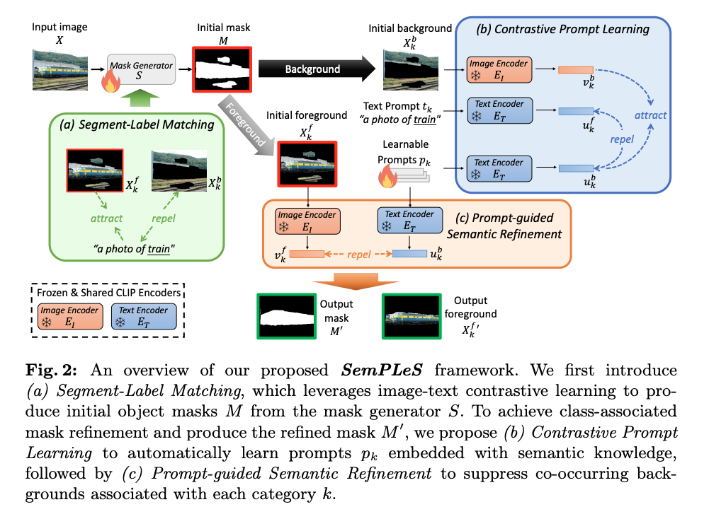
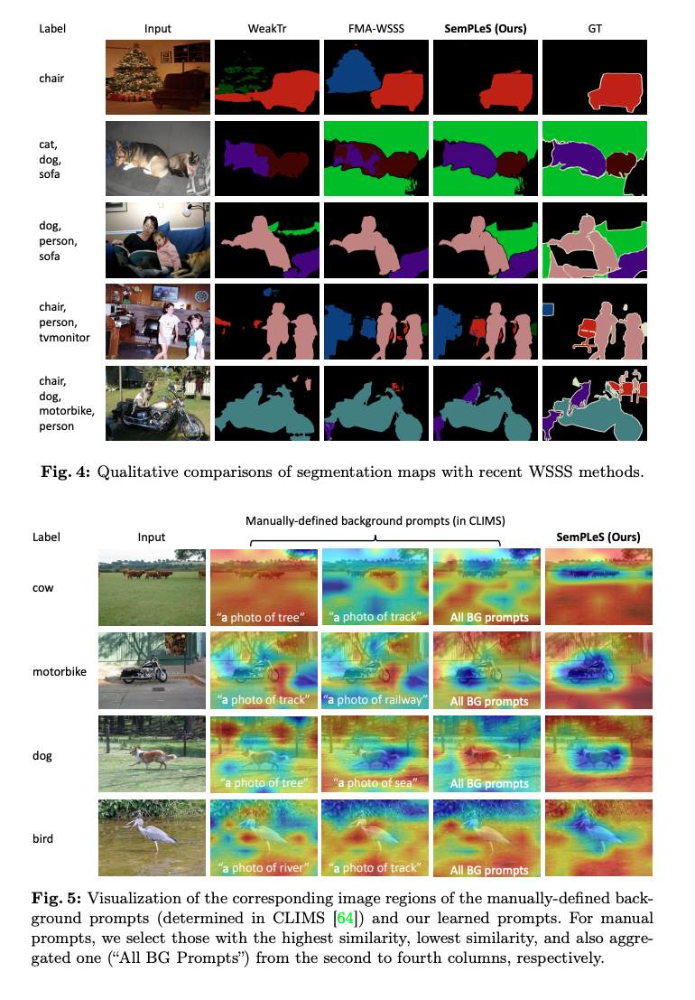
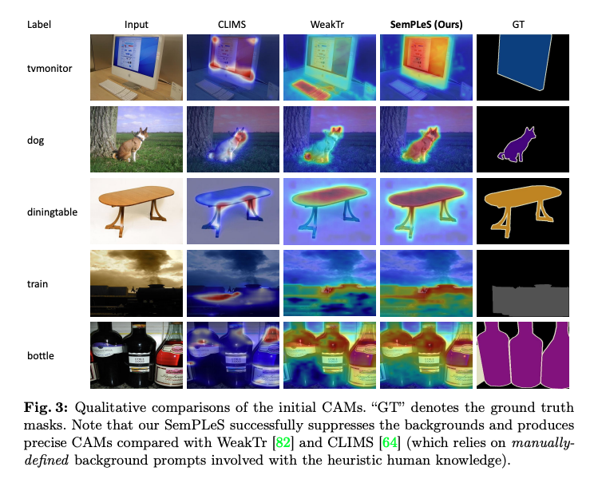

이 논문은 Weakly-Supervised Semantic Segmentation (WSSS) 문제를 다룹니다. WSSS는 이미지 수준의 레이블만으로 세그멘테이션 모델을 학습시키는 것을 목표로 하며, 정확한 픽셀 수준의 주석 데이터가 부족한 상황에서 사용할 수 있는 접근법을 제시합니다.

1. WSSS의 기존 한계
- CAM (Class Activation Map) 기반 접근법:
- 기존 WSSS 방법은 주로 CAM과 같은 히트맵을 사용하여 객체 영역을 추출한 뒤 이를 기반으로 **pseudo mask (의사 마스크)**를 생성합니다.
- 하지만 이런 히트맵은 **객체의 판별적인 부분 (discriminative regions)**만 캡처하거나, **공존하는 배경 (co-occurring backgrounds)**을 포함하는 경우가 많습니다.
- 결과적으로, 생성된 pseudo mask가 불완전하거나 부정확해지는 문제가 발생합니다.

2. 제안된 방법: Semantic Prompt Learning for WSSS (SemPLeS)

SemPLeS는 CLIP (Contrastive Language–Image Pretraining) 모델의 잠재 공간(latent space)을 활용하여, **객체 영역과 대상 클래스 간의 의미적 정렬(sequential alignment)**을 강화하는 프레임워크입니다.

주요 아이디어:
	1.	CLIP의 잠재 공간에 프롬프트(prompt)를 학습적으로 삽입하여, 객체와 클래스 간의 의미적 연결을 강화합니다.
	2.	대상 객체와 배경을 더 효과적으로 구분할 수 있도록 설계되었습니다.

3. 핵심 기법
	1.	Contrastive Prompt Learning (대조 프롬프트 학습):
- 대상 객체(category-specific regions)와 배경(co-occurring background)을 구분하는 프롬프트를 학습합니다.
- CLIP 모델의 잠재 공간에서 **대조 학습(contrastive learning)**을 통해 객체와 배경의 표현(representations)을 명확히 구별합니다.
	2.	Prompt-guided Semantic Refinement (프롬프트 기반 의미적 정제):
- 프롬프트를 활용하여 CLIP 잠재 공간에서 더 정교한 히트맵을 생성합니다.
- 이를 통해 기존 CAM 기반 히트맵이 가진 배경 혼재 문제를 완화하고, 대상 객체에 더 정확히 맞춰진 pseudo mask를 생성합니다.

4. 결과
- 성능 향상:
- SemPLeS는 PASCAL VOC와 MS COCO 데이터셋에서 SOTA (State-of-the-Art) 성능을 달성했습니다.
- 제안된 방법은 기존 WSSS 방법과도 호환 가능하며, 이를 결합하여 성능을 더욱 향상시킬 수 있습니다.
- 의사 마스크 품질 개선:
- 객체 영역과 대상 클래스 간의 의미적 정렬(sequential alignment)을 강화함으로써, pseudo mask의 품질이 대폭 개선되었습니다.

[Paper Review](https://arxiv.org/pdf/2401.11791)

## Related Work

### 1. 기존 WSSS 방법론

WSSS는 이미지 수준 레이블만을 이용하여 픽셀 수준의 세그멘테이션 모델을 학습하는 방법입니다. 대부분의 WSSS 방법은 3단계 학습 과정을 따릅니다:
	1.	초기 CAM 생성:
- 클래스 활성화 맵(Class Activation Map, CAM)을 생성하기 위해 이미지 수준의 레이블을 사용합니다.
- 대표적인 CAM 생성 방법들이 제안되었습니다.
- CAM의 방법 
    - Feature Map 생성: 입력 이미지를 CNN을 통해 공간적 정보를 보존하는 마지막 Convolution 층의 feature map을 생성 (batch, channels, height, width)
    - Global Average Pooling: 각 feature map에 대해 GAP 하여 벡터로 변환 (batch, channels, 1, 1)
    - Fully Connected Layer: GAP 결과를 입력으로 받아 클래스별 예측을 수행. 이 과정에서. 각 클래스별 가중치 W가 할당됨 (batch, num_class)
    - 가종치와 Feature Map의 결합: 위에서 구한 W를 feature map의 Feature Map의 각 채널에 곱한 후 합산 (batch, num_class, height, width)
	2.	CAM 정제:
- Dense CRF(Conditional Random Field)나 픽셀 간의 관계(affinity) 기반 방법을 사용해 CAM을 **pseudo mask(의사 마스크)**로 정제합니다.
- Dense CRG (Conditional Random Field) 방법
    - 특정 픽셀 i의 라벨과 주변 픽셀 j의 라벨이 주건부 확률로 표현된다는 가정에 기반
    - 픽셀간 유사성과 CAM으로부터 얻은 초기 정보를 조합하여 최적의 라벨 분포를 추정
    - minimize E(x) = CAM(i) + GaussianKernel(i, j)
    - 이를 통해 CAM에서 생성한 불필요한 활성화 영역을 제거. 세밀한 마스크 생성 

	3.	세그멘테이션 모델 학습:
- 정제된 pseudo mask를 사용해 최종 세그멘테이션 모델을 학습합니다.

한계점:
- CAM이 객체의 판별적인 영역만을 포함하거나, 공존하는 배경을 포함하는 문제가 있습니다.
- 일부 연구는 Vision Transformer의 패치 단위(attention 기반)로 세밀한 CAM을 생성하지만, 여전히 성능의 한계가 존재합니다.
- **끝단 학습 방식(end-to-end WSSS)**도 제안되었으나, 전통적인 3단계 방식보다 성능이 낮습니다.
- 대부분의 방법은 텍스트 클래스 레이블의 의미적 정보를 활용하지 않고, 단순히 객체 분류에 초점을 맞춥니다.

2. CLIP 기반 WSSS와 세그멘테이션

CLIP의 역할
- CLIP (Contrastive Language-Image Pretraining)은 대규모 이미지-텍스트 쌍을 학습하여 일반화된 지식을 제공합니다.
- 이를 활용하면 기존 WSSS 방법이 처리하지 못했던 **의미적 연관성(semantic alignment)**을 강화할 수 있습니다.

CLIP 기반 기존 접근법
	1.	Zero-shot/Open Vocabulary Segmentation:
- 학습 중 보지 못한 클래스까지 세그멘테이션할 수 있지만, 여전히 마스크 주석(annotation)이 필요합니다.
	2.	Unsupervised Methods:
- 마스크 주석 없이 CLIP을 활용하지만, 성능이 제한적입니다.
	3.	Prompt 설계:
- CLIP의 텍스트 인코더에 입력할 텍스트 프롬프트를 설계하여 성능을 향상시켰습니다.
- 그러나 기존 방법은:
- **객체 클래스(foreground class)**만 고려하거나,
- **배경 클래스(background class)**를 수동 정의(manual effort)하여, CLIP의 잠재 공간을 충분히 활용하지 못했습니다.

3. 제안된 SemPLeS (Semantic Prompt Learning for WSSS)

SemPLeS는 **프롬프트 학습(prompt learning)**을 통해 CLIP의 잠재 공간에서 객체와 클래스 간의 의미적 연관성을 자동으로 학습하는 방법을 제안합니다.

SemPLeS의 차별점
	1.	수동 노력 필요 없음:
- 기존의 수작업으로 정의된 프롬프트 대신, CLIP의 잠재 공간에서 자동으로 프롬프트를 학습합니다.
	2.	클래스 연관 정보 활용:
- CLIP의 **클래스-연관된 의미적 지식(class-associated semantic knowledge)**을 활용하여, 정확하고 풍부한 CAM을 생성합니다.

4. Prompt Learning 개념

Prompting이란?
- 텍스트 기반 입력(예: “a photo of [class]”)을 통해 원하는 출력을 얻는 과정입니다.
- CLIP과 같은 비전-언어 모델에서 프롬프트를 설계하여 지식을 추출합니다.

기존 Prompt Engineering의 한계
- 텍스트 템플릿(예: “a photo of”)을 설계하려면 전문 지식과 시간이 필요합니다.
- 자동화된 Prompt Learning은 수작업 템플릿 대신 학습 가능한 벡터를 통해 텍스트 입력을 생성합니다.

SemPLeS의 독창성
- SemPLeS는 일반적인 텍스트 템플릿(“a photo of”)을 대체하는 것이 아니라, 세그멘테이션에 특화된 클래스 연관 프롬프트를 학습합니다.

5. 결론
- SemPLeS는 CLIP 기반 프롬프트 학습을 통해 WSSS의 CAM 품질을 향상시키는 새로운 접근법입니다.
- 기존의 수작업 프롬프트와 달리, CLIP의 잠재 공간에서 자동으로 객체와 클래스 간의 의미적 연관성을 학습하여 WSSS 성능을 극대화합니다.
- 추가 주석이나 수동 노력이 필요하지 않으면서도 고품질의 pseudo mask를 생성하는 데 성공했습니다.

## Proposed Method

이 논문은 Weakly-Supervised Semantic Segmentation (WSSS) 문제를 해결하기 위해 CLIP 모델을 활용한 새로운 프레임워크인 SemPLeS를 제안합니다. SemPLeS는 이미지-텍스트 일치 학습과 대조 프롬프트 학습을 통해 기존의 WSSS 방법의 한계를 해결하고, 더 정확한 **의사 마스크(pseudo mask)**를 생성합니다.

### 1. 문제 정의
- WSSS 문제: 픽셀 단위의 주석 없이 이미지 수준의 레이블만으로 세그멘테이션 모델을 학습합니다.
- 입력 데이터:
    - 이미지 : X (HxWx3) RGB 이미지
    - 레이블 : y (다중-핫 벡터 {0, 1}, k 클래스의 존재 여부 표시)
- 목표: 이미지의 객체 영역과 클래스 레이블 간의 의미적 정렬(semantic alignment)을 강화하여 정확한 객체 마스크를 생성.

### 2. SemPLeS의 주요 구성 요소

(1) Segment-Label Matching
- 목적: 이미지와 텍스트 간의 의미적 일치를 학습해 초기 객체 마스크 M 생성.
- 작동 방식:
	1.	입력 이미지X 에서 마스크 생성기 S를 사용하여 초기 마스크 생성. M=S(X)
	2.	마스크을 이용해 **전경(foreground)**과 **배경(background)**을 나눔:
        - `X_k_f = M_k * X`: 전경 영역.
        - `X_k_b = (1-M_k) * X`: 배경 영역.
	3.	텍스트 입력 t_k: `“a photo of [클래스 이름]”` 형태로 구성.
	4.	CLIP의 이미지 인코더 E_I와 텍스트 인코더 E_T를 사용해 이미지-텍스트 간 유사도를 학습:
        - 전경과 텍스트 유사도: 최대화.
        - 배경과 텍스트 유사도: 최소화.
	5.	학습 손실 함수 (L_match):
        - `L_match = sim(X_k_f, t_k) - lambda * sim(X_k_b, t_k)` 
        - 여기서 sim 은 코사인 유사도, lambda 는 배경 억제 가중치.
        - 문제점: 초기 마스크는 여전히 배경 영역이 활성화되거나 불완전할 수 있음.

(2) Contrastive Prompt Learning
- 목적: 수작업 없이 각 클래스의 배경 정보를 학습해 마스크 품질 향상.
- 작동 방식:
	1.	텍스트 인코더 E_T에 입력할 **프롬프트  p_k**를 학습 가능한 벡터로 설계.
	2.	배경 `X_k_b`와 프롬프트 `p_k`간의 유사도를 최대화:
        - `L_I_prompt = sim(p_k, X_k_b)`
	3.	반대로, 프롬프트가 전경 `X_k_f`를 설명하지 않도록 유사도를 최소화:
        - `L_T_prompt = -sim(p_k, X_k_f)`
	4.	최종 손실 함수:
       - `L_prompt = L_I_prompt + lambda * L_T_prompt`
- 장점:
    - 수작업으로 프롬프트를 설계할 필요 없음.
    - CLIP의 잠재 공간(latent space)을 더 효과적으로 활용.

(3) Prompt-guided Semantic Refinement
- 목적: 학습한 프롬프트를 이용해 마스크 M을 정제하여 정확한 객체 영역 생성.
- 작동 방식:
	1.	프롬프트 P_k를 사용해 마스크 M의 배경 정보를 억제.
	2.	정제된 마스크 M'생성:
       - `L_refine = minimize activation of M using P_k`
    3.	최종 손실 함수:
        - `L_total = L_match + lambda * L_refine`
- 결과:
    - 배경 억제 및 전경 강화.
    - 최종적으로 정확하고 완전한 pseudo mask M' 생성.

3. SemPLeS의 장점
	1.	CLIP 활용:
- 이미지-텍스트 간의 의미적 연결을 학습하여 기존 WSSS의 한계 극복.
	2.	자동화된 프롬프트 학습:
- 수작업 프롬프트 없이 각 클래스의 배경 정보를 학습 가능.
	3.	정교한 마스크 생성:
- 배경 억제 및 전경 강화로 더 정확한 마스크 생성.
	4.	효율성:
- CLIP의 학습된 인코더를 고정(freeze)하여 계산 효율성 확보.

## Experiments
### 실험 및 결과: SemPLeS 프레임워크 평가

이 섹션에서는 제안된 SemPLeS 프레임워크가 WSSS에서 어떻게 성능을 발휘하는지, 다양한 데이터셋과 비교 실험을 통해 설명합니다.

1 데이터셋 및 평가 지표
- 사용한 데이터셋:
	1.	PASCAL VOC 2012:
- 20개 객체 클래스 + 1개 배경 클래스.
- 학습 세트: 10,582개 이미지 (확장 데이터셋 사용).
- 검증 세트: 1,449개 이미지.
- 테스트 세트: 1,456개 이미지 (공식 평가 웹사이트 사용).
	2.	MS COCO 2014:
- 80개 객체 클래스.
- 학습 세트: 82,081개 이미지.
- 검증 세트: 40,137개 이미지.
- 평가 지표:
- mIoU (mean Intersection over Union): 세그멘테이션 품질을 평가하는 지표. 높은 mIoU 값이 더 나은 세그멘테이션 성능을 의미합니다.

2 구현 세부 사항
- 네트워크 구성:
- 마스크 생성기 : Transformer 기반 백본 모델 사용.
- CLIP 모델: ViT-B/32 이미지 인코더.
- 학습 가능한 프롬프트:
- 길이 , 임베딩 차원 .
- 하이퍼파라미터:
- 손실 가중치 :
- PASCAL VOC: .
- MS COCO: .
- 학습률:  (PASCAL VOC),  (MS COCO).
- Optimizer: AdamW + 코사인 스케줄러.
- 배치 크기: 64.
- 학습 기간: PASCAL VOC 60 에포크, MS COCO 60 에포크.
- 환경: PyTorch 구현, NVIDIA V100 GPU 사용.

3 정량적 평가

(1) CAM 및 Pseudo Mask 성능 비교
- 초기 CAM(Seed) 및 최종 Pseudo Mask(Mask)의 mIoU 비교 결과 (PASCAL VOC)
- SemPLeS는 최고 성능을 달성:
- 초기 CAM에서 68.7% mIoU.
- 최종 Pseudo Mask에서 78.4% mIoU.

(2) 최종 세그멘테이션 성능
- PASCAL VOC 및 MS COCO에서 최종 세그멘테이션 성능 비교:
- PASCAL VOC 검증 세트: 83.4% mIoU.
- PASCAL VOC 테스트 세트: 82.9% mIoU.
- MS COCO: 56.1% mIoU.
- FMA-WSSS (기존 SOTA):
- 검증 세트보다 0.8% 향상.
- 테스트 세트보다 1.3% 향상.

4 정성적 평가
- 시각적 비교:
- SemPLeS는 더 정확한 객체 경계와 더 완전한 객체 활성화 맵을 생성.
- 예: CLIMS, WeakTr 등 기존 방법보다 뛰어난 세그멘테이션 성능.
- 학습된 프롬프트의 효과:
- SemPLeS에서 학습된 프롬프트는 클래스와 연관된 배경 영역을 효과적으로 강조.
- 기존 수작업 기반 프롬프트(예: CLIMS)보다 높은 유연성과 정확성을 보임.

5 기존 방법들과의 비교
	1.	CLIP 기반 방법:
- 기존 방법들은:
- 주로 전경 프롬프트만 고려.
- 배경 프롬프트는 수작업으로 설계.
- SemPLeS:
- 자동 학습 프롬프트를 통해 CLIP의 잠재 공간을 최대한 활용.
- 수작업 설계 없이 더 나은 성능 달성.
	2.	SAM 기반 방법:
- SAM은 클래스 비의존적(class-agnostic) 마스크 생성기로 높은 일반화 성능을 가짐.
- 기존 SAM 기반 방법은 추가적인 모델과 결합(BLIP-2, Grounding-DINO 등)이 필요.
- SemPLeS:
- 추가 모델 없이 SAM 기반 SOTA인 FMA-WSSS를 초과하는 성능.

6 호환성 평가
- SemPLeS는 CNN 기반, Transformer 기반, SAM 기반 WSSS 방법 모두에서 성능 향상을 제공.
- Fully-Supervised (FS) 상한선에 근접한 성능:
- FS 대비 검증 세트에서 2.6%, 테스트 세트에서 3.2% 차이.

결론
- SemPLeS는 WSSS의 새로운 SOTA를 달성:
- CLIP의 잠재 공간과 학습된 프롬프트를 효과적으로 활용.
- 다양한 데이터셋과 모델 아키텍처에 적용 가능.
- 기존 방법들과 비교하여 정확도, 유연성, 호환성 모두에서 우수성을 입증.
    

