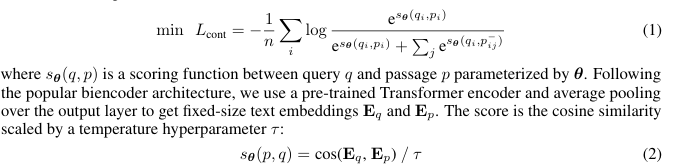
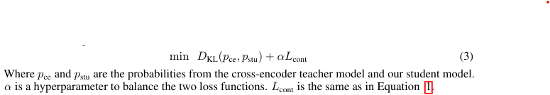

이 논문은 **E5(EmbEmbeddings from bidirEctional Encoder Representations)**라는 새로운 텍스트 임베딩 모델에 대해 설명하며, 이 모델이 다양한 작업에서 뛰어난 성능을 보여준다고 강조합니다. 

**1. E5의 정의와 목표**
- **E5**는 텍스트를 벡터로 변환하는 **최첨단 임베딩 모델**입니다.
- 이 모델은 텍스트 검색, 군집화, 분류와 같은 **단일 벡터 표현(single-vector representation)**을 필요로 하는 작업에 쉽게 적용할 수 있습니다.
- 특히, **zero-shot** (사전 학습된 모델을 추가 학습 없이 사용하는 상황)과 **fine-tuned** (추가 학습을 수행하는 상황) 모두에서 뛰어난 성능을 보여줍니다.

**2. 주요 특징**
- 1. **대규모 약한 지도 학습 (Weak Supervision)**:
   - E5는 자체적으로 구축한 **대규모 텍스트 쌍 데이터셋(CCPairs)**을 사용하여 훈련되었습니다.
   - **대조 학습(contrastive learning)** 방식으로 텍스트 쌍의 유사성과 차이를 학습합니다.
   - 이 데이터셋은 다양한 텍스트 작업에서 사용될 수 있는 범용적인 임베딩을 생성하도록 설계되었습니다.

- 2. **제로샷 성능**:
   - E5는 추가적인 학습 데이터 없이도 BEIR(Benchmark for Information Retrieval)에서 강력한 성능을 보여줍니다.
   - 특히, 기존의 강력한 BM25 (정보 검색에서 자주 사용하는 전통적 방법)를 초과하는 최초의 모델입니다.

- 3. **파라미터 효율성**:
   - E5는 다른 임베딩 모델보다 **40배 적은 파라미터**를 사용하면서도 MTEB(Massive Text Embedding Benchmark)에서 최고의 성능을 기록합니다.
   - 이는 모델의 효율성과 실용성을 높이는 데 기여합니다.

[Paper Link](https://arxiv.org/pdf/2212.03533)

[Code Link](https://github.com/microsoft/unilm)

## Instroduction

### **1. 배경: 텍스트 임베딩이란 무엇인가?**
- **텍스트 임베딩(Text Embeddings)**:
  - 텍스트를 **저차원 벡터(vector)**로 변환하는 방법.
  - NLP(자연어 처리) 작업, 특히 대규모 검색(retrieval)에서 중요한 역할을 합니다.
  - 기존의 **TF-IDF**처럼 고차원적이고 희소한 표현(sparse representations) 대신, 임베딩은 더 효율적이고 유연합니다.
  - 예: 검색, 텍스트 매칭, 군집화 등에 활용.

- 기존의 한계:
  - BERT, GPT와 같은 언어 모델은 텍스트 표현을 생성할 수 있지만, 검색 및 텍스트 매칭과 같은 작업에서는 효율적이지 않음.
  - 단일 벡터(single-vector)가 아닌 복잡한 표현을 생성하기 때문에 활용이 어려움.

### **2. E5: 새로운 접근 방식**
- **E5**는 **단일 벡터(single-vector) 임베딩**을 목표로 설계된 모델입니다.
- 다양한 작업에서 **제로샷(zero-shot)** 및 **파인튜닝(fine-tuned)** 상황에서 강력한 성능을 제공합니다.
- E5의 이름: **EmbEddings from bidirEctional Encoder rEpresentations**.

### **3. E5의 특징**
1. **대규모 고품질 데이터(CCPairs)**:
   - 기존의 방식은 라벨이 부족하거나 품질이 낮은 합성 데이터(예: 랜덤 크롭핑, 텍스트 스팬)로 인해 성능이 제한적.
   - E5는 다양한 출처(CommunityQA, Common Crawl, Scientific Papers)에서 수집한 **CCPairs**라는 데이터셋을 사용.
   - **일관성 기반 필터링(consistency-based filtering)**을 적용해 데이터 품질을 크게 개선.

2. **대조 학습(Contrastive Learning)**:
   - 텍스트 쌍 사이의 의미적 유사성과 차이를 학습.
   - 대규모 배치(batch)에서 **인배치 부정 샘플(in-batch negatives)**을 활용해 효율성을 높임.

3. **범용성(General-Purpose)**:
   - **검색**, **문서 분류**, **텍스트 군집화**와 같은 작업에 바로 활용 가능.
   - 추가 학습 없이도 강력한 성능(제로샷), 추가 학습 시 더 나은 성능(파인튜닝)을 제공.

### **4. E5의 성능**
- **BEIR 벤치마크**:
  - 검색 성능을 평가하는 벤치마크에서 **BM25**(전통적 검색 알고리즘)를 처음으로 초과.
  - 이는 라벨이 없는 데이터로 학습한 상태에서도 가능.

- **MTEB 벤치마크**:
  - 다양한 NLP 작업에서의 성능을 평가.
  - E5는 GTR-XXL 및 Sentence-T5-XXL과 유사한 성능을 보여주며, 이 모델들보다 **40배 적은 파라미터**를 사용.

## Related Work

### **1. 텍스트 임베딩이란?**
- **텍스트 임베딩(Text Embedding)**: 텍스트(문장, 문서 등)를 저차원의 밀집 벡터(dense embedding)로 변환하는 방법.
- 초기에 사용된 방법:
  - **LSA(Latent Semantic Indexing)**: 단어-문서 행렬을 분해해 문서 임베딩 생성.
  - **LDA(Latent Dirichlet Allocation)**: 주제를 학습하는 확률 모델.
  - **단어 벡터 평균**: 단어 임베딩의 가중 평균을 계산해 문장 벡터 생성.
  
### **2. 현대적인 텍스트 임베딩 접근법**
1. **사전 학습 언어 모델 기반**:
   - BERT, GPT와 같은 언어 모델을 파인튜닝해 임베딩을 생성.
   - 주요 모델:
     - **Sentence-BERT**, **SimCSE**, **Sentence-T5**: 문장 단위의 텍스트 임베딩에 초점.
     - **SGPT**: 대규모 언어 모델 기반으로 임베딩 생성.
   - 주로 짧은 텍스트(문장)를 대상으로 하며, 긴 문서에서 고정 길이 벡터로 모든 정보를 담는 것은 여전히 어려운 문제.

2. **대조 학습(Contrastive Learning)**:
   - 대조 학습은 **SimCLR**로부터 대중화된 방식으로, 임베딩 품질을 높이는 데 효과적.
   - **라벨 데이터** 대신 쌍(pair)으로 된 텍스트를 사용해 학습.
   - 예: **LaBSE**, **LASER**는 다국어 텍스트를, **CLIP**은 이미지-텍스트 쌍을 학습.

3. **자기 지도 학습(Self-Supervised Pre-training)**:
   - **Inverse Cloze Task(ICT)**: 문서의 일부 문장을 질의로 사용하고 나머지를 긍정 샘플로 간주해 학습.
   - **Contriever**: ICT 대신 랜덤 크롭핑(임의 문장을 질의로 설정하고 나머지를 positive sample로 간주)과 데이터 증강(문장 순서 변경, 치환, 삭제, 추가)이 더 효과적임을 입증.
   - **OpenAI Text Embeddings**: 인접 텍스트를 긍정 샘플로 사용하며 모델 크기를 확장.
   - **SPAR**: BM25(전통적 검색 알고리즘)을 교사 모델로 활용해 밀집 검색기를 학습.
   
- BM25 (Best Matching 25)
    - 정보 검색에서 가장 널리 사용되는 랭킹 알고리즘 중 하나로, TF-IDF의 확장 버전으로 검색 결과를 보다 정교하게 랭킹하기 위해 설계됨
    - 주요 요소
        - TF(Term Frequency): 문서 내에서 특정 단어가 얼마나 자주 등장하는 지 
        - IDF(Inverse Document Frequency): 특정 단어가 전체 문서에서 얼마나 드물게 등장하는 지 
    - `BM25(D, Q) = sum_t{ IDF(t)*(TF(t, D)(k+1))/(TF(t, D) + k*(1-b+b*|D|/avgdl))}`
        - Q: query
        - D: document
        - t: query term
        - |D|: 문서 D의 총 단어 수
        - avgdl: 전체 문서의 평균 문서 길이
        - k: TF 스케일링을 조절하는 하이퍼파라미터 (1~2)
            - 단어의 빈도에 따른 점수 민감도를 조절
        - b: 문서 길이의 영향을 조절하는 하이퍼파라미터 (0.75)
            - 길이가 긴 문서는 단어를 많이 포함할 확률이 높아 유리할 수 있으므로 영향을 조정 
    - 장점
        - 단순하고 강력
        - 문서 길이 정규화
        - 설명 가능성 
    - 단점
        - 동의어를 인식 못함
        - 단어간 순서나 문맥 정보를 고려하지 않음
        - 하이퍼파라미터 민감 

4. **합성 데이터의 한계**:
   - 자동으로 생성한 텍스트 쌍은 데이터가 많지만 품질이 낮은 경우가 많음.
   - 예: BEIR 벤치마크에서는 이러한 방식이 추가 학습 없이는 BM25를 초과하지 못함.

### **3. 텍스트 임베딩의 평가**
1. **평가 기준**:
   - 일반적으로 임베딩 품질은 다운스트림 작업의 성능을 통해 측정.
   - 주요 벤치마크:
     - **SentEval**: 선형 탐색(linear probing)과 텍스트 유사성(STS) 데이터셋을 사용.
     - **BEIR**: 제로샷 정보 검색 시나리오에 초점.
     - **MTEB**: 56개 데이터셋, 8가지 작업, 112개 언어를 포함해 다양한 작업 성능 평가.

2. **현재의 한계**:
   - 모든 작업에서 최상의 성능을 내는 모델은 아직 없음.
   - SentEval은 최적화 하이퍼파라미터에 따라 결과가 달라지므로 논문에서는 사용하지 않음.

## CCPairs: A Large Collection of Text Pair Dataset

### **1. 배경**
- **텍스트 임베딩 모델의 학습에는 데이터 품질과 다양성이 매우 중요**:
  - 기존의 데이터셋은 주로 다음과 같은 한계를 가짐:
    - **작은 규모의 라벨 데이터**:
      - 예: NLI(Natural Language Inference)나 MS-MARCO는 사람의 라벨링이 필요하지만, 이는 비용이 많이 들고 데이터 양이 제한적.
    - **대규모 데이터지만 품질이 낮음**:
      - 예: 랜덤 크롭핑과 같은 방식으로 생성된 데이터는 노이즈가 많아 성능 저하를 유발.

- **CCPairs의 목표**:
  - 고품질과 다양성을 모두 갖춘 대규모 텍스트 쌍 데이터셋을 생성.
  - 이를 통해 다양한 작업에 잘 일반화되는 범용 임베딩 모델을 학습.

### **2. CCPairs 데이터셋 생성 과정**
1. **반구조적 데이터 소스에서 텍스트 쌍 추출**:
   - **다양한 출처에서 텍스트 쌍 생성**:
     - Reddit: 게시글과 댓글 쌍 (post, comment pairs).
     - StackExchange: 질문과 좋아요 받은 답변 쌍 (question, upvoted answer pairs).
     - Wikipedia: 엔티티 이름 + 섹션 제목과 본문 쌍 (entity name + section title, passage pairs).
     - 과학 논문: 제목과 초록 쌍, 또는 인용 쌍 (title, abstract pairs).
     - Common Crawl(웹 크롤링): 제목과 본문 쌍 (title, passage pairs).
   - 텍스트 쌍의 길이는 다양하며, 문장, 단락, 문서 형태로 존재.

2. **초기 필터링**:
   - 데이터 품질을 높이기 위한 간단한 규칙 적용:
     - Reddit: 너무 긴 댓글(4096자 이상) 또는 점수가 낮은 댓글(1 미만)은 제거.
     - Common Crawl: 퍼플렉시티(perplexity)가 높은 웹 페이지 제거(언어 모델이 "혼란스러워" 하는 비정상적 텍스트 제거).
   - 이 과정 후 약 **13억 개의 텍스트 쌍** 확보.

### **3. 일관성 기반 필터링 (Consistency-based Filtering)**
- **데이터 품질 개선**:
  - 노이즈가 포함된 데이터를 줄이고 학습 비용을 줄이기 위해 추가적인 필터링 기법을 적용.

- **필터링 방법**:
  1. 13억 개의 텍스트 쌍으로 먼저 임베딩 모델을 학습.
  2. 학습된 모델을 사용해 각 텍스트 쌍을 100만 개의 랜덤 문서와 비교하여 순위를 매김.
  3. 상위 **k개(여기서는 k=2)**에 포함되는 텍스트 쌍만 남김.
     - 모델이 "좋은 데이터"라고 판단하는 텍스트 쌍만 남기므로, 데이터 품질이 높아짐.

- **결과**:
  - 약 **2억 7천만 개의 고품질 텍스트 쌍**으로 축소.
  - 이렇게 줄어든 데이터로 대조 학습(contrastive pre-training)을 수행.

### **4. 일관성 기반 필터링의 직관적 이해**
- **신경망의 학습 특징을 활용**:
  - 신경망은 데이터가 노이즈가 있어도 먼저 "깨끗한 라벨(clean labels)"을 학습한 후, 점차 "노이즈 라벨"로 과적합(overfit)되는 경향이 있음.
  - 이를 이용해 모델이 신뢰할 수 있는 데이터만 선택.
  - 이와 유사한 기법은 여러 데이터 정제 작업에서 성공적으로 사용됨.

- **반복적으로 적용 가능**:
  - 데이터 품질을 더 높이기 위해 여러 번 반복하여 필터링할 수도 있지만, 이번 연구에서는 단일 단계로 제한.

## Method

### **1. 텍스트 임베딩 학습의 두 단계**
텍스트 임베딩 모델은 **대조 학습(contrastive learning)**과 **라벨 데이터로 추가 학습(fine-tuning)**의 두 단계를 거쳐 학습됩니다.

#### **1.1 대조 학습(Contrastive Pre-training)**
- **목적**:
  - 주어진 텍스트 쌍에서 긍정 샘플(관련 있는 텍스트)과 부정 샘플(관련 없는 텍스트)을 구별하도록 학습.
  
- **방법**:
  1. **InfoNCE Loss** 사용:
     - 모델이 긍정 쌍의 점수를 높이고, 부정 쌍의 점수를 낮추도록 학습.
     - 공식:
       

  2. **Bi-encoder 아키텍처**:
     - 동일한 Transformer 인코더를 사용해 질의와 패시지를 각각 임베딩으로 변환.
     - 코사인 유사도를 기반으로 점수 계산.

  3. **부정 샘플 선택**:
     - **In-batch Negatives**:
       - 배치 내의 다른 쌍들을 부정 샘플로 사용.
       - 단순하지만 안정적인 학습을 가능하게 하고, MoCo 같은 복잡한 방법보다 성능이 좋음.

  4. **비대칭 설계**:
     - 입력 텍스트에 "query:"와 "passage:" 같은 식별자를 추가해 질의와 패시지를 구분.

#### **1.2 라벨 데이터로 추가 학습(Fine-tuning)**
- 라벨 데이터로 추가 학습의 필요성 
    - CCPairs는 라벨이 없는 텍스트쌍 데이터로, 인간의 전문 지식을 직접 반영하기는 어렵다는 한계가 있음 
- 사용 데이터셋
    - NLI(Natural Language Inference): 문장의 논리 관계를 학습
        - "premise", "hypothesis", "label: 문장의 관계"
    - MS-MARCO(Microsoft Machine Reading Comprehension): 검색 작업을 위한 질의-패시지 랭킹 데이터셋. Dense Retrieval 작업에 최적화된 라벨 데이터를 제공  
        - "Query", "Passage", "Label: 관련 여부"
    - NQ (Natural Questions): 구글 검색 데이터 기반의 질의 응답 데이터셋
        - "Query", "Passage", "Label: 관련 여부"
- 학습 방법
    - Mined Hard Negatives
        - 질의와 비슷하지만 관련이 없는 텍스트쌍
        - 모델이 더 정교한 판단을 내릴 수 있도록 학습 과정에서 중요함
        - 샘플링 방식
            - MS-MARCO, NQ 데이터셋에서는 Teacher model (Cross-Encoder)를 사용하여 추출
            - NLI 데이터셋에서는 Contradiction (모순 관계)를 하드 네거티브로 간주 
    - 손실 함수 설계
        - 대조 손실과 KL 발산 손실을 조합하여 사용 
        
        - 교사 모델과 teacher model(cross-encoder) 간의 예측 확률을 최소화 

### **2. 학습된 텍스트 임베딩의 응용**
학습된 텍스트 임베딩은 다양한 작업에 활용될 수 있습니다.

#### **2.1 제로샷 검색(Zero-shot Retrieval)**
- **작동 방식**:
  1. 모든 문서의 임베딩을 미리 계산해 인덱싱.
  2. 질의(Query)의 임베딩을 계산하고, 코사인 유사도를 기반으로 상위 k개의 문서 반환.
- **특징**:
  - 라벨 데이터 없이도 다양한 검색 작업에 활용 가능.

#### **2.2 소량 학습 텍스트 분류(Few-shot Text Classification)**
- **작동 방식**:
  1. 학습된 임베딩 위에 선형 분류기(linear classifier)를 소량의 라벨 데이터로 학습.
  2. 새로운 작업에서는 분류기의 파라미터만 추가로 학습.
- **특징**:
  - 효율적이고 빠르게 학습 가능.

#### **2.3 제로샷 텍스트 분류(Zero-shot Text Classification)**
- **작동 방식**:
  1. 입력 텍스트와 라벨을 프롬프트로 변환해 임베딩 공간에서 가장 가까운 라벨 선택.
  2. 예: "I enjoy watching it" → "movie review: I enjoy watching it".
- **특징**:
  - 프롬프트 템플릿만으로 라벨 데이터 없이 분류 가능.

#### **2.4 의미적 텍스트 유사성(Semantic Textual Similarity)**
- **작동 방식**:
  - 두 텍스트 임베딩의 코사인 유사도를 계산해 유사성 평가.
- **특징**:
  - 유사성 순위를 측정하는 데 적합.

#### **2.5 텍스트 군집화(Text Clustering)**
- **작동 방식**:
  - k-means와 같은 표준 군집화 알고리즘 사용.
  - 같은 카테고리에 속하는 텍스트는 임베딩 공간에서 가깝게 분포.

## Experiments

### **1. 사전 학습(Pre-training)**
- **모델 크기**:
  - **E5small**, **E5base**, **E5large** 세 가지 크기로 학습.
  - 각각 MiniLM, bert-base-uncased, bert-large-uncased를 초기화 모델로 사용.

- **학습 구성**:
  - **데이터셋**: CCPairs (13억 쌍의 텍스트 페어 데이터).
  - **배치 크기**: 32,768 (더 많은 부정 샘플 제공).
  - **학습률**:
    - Small: \(3 \times 10^{-4}\)
    - Base: \(2 \times 10^{-4}\)
    - Large: \(1 \times 10^{-4}\).
  - **최적화 알고리즘**: AdamW.
  - **학습 단계**: 총 20,000 스텝 (2.5 에포크).
  - **GPU 및 시간**:
    - Small: 16 V100 GPU, 1일.
    - Base: 32 V100 GPU, 1일.
    - Large: 64 V100 GPU, 2일.
  - **효율 개선**: 혼합 정밀도 학습(mixed precision training)과 그래디언트 체크포인팅 사용.

### **2. 파인튜닝(Fine-tuning)**
- **사용 데이터셋**:
  - **MS-MARCO**: 검색 및 패시지 랭킹.
  - **NQ (Natural Questions)**: 질의 응답.
  - **NLI (Natural Language Inference)**: 텍스트 간 관계 학습 (Entailment, Neutral, Contradiction).

- **구성**:
  - **배치 크기**: 256.
  - **학습률**:
    - Small: \(3 \times 10^{-5}\)
    - Base: \(2 \times 10^{-5}\)
    - Large: \(1 \times 10^{-5}\).
  - **하드 네거티브**:
    - MS-MARCO, NQ: 7개의 하드 네거티브 사용.
    - NLI: 1개의 하드 네거티브 + 6개는 랜덤 샘플링.
  - **에포크**: 3.
  - **GPU 사용**: 8개.

### **3. 평가 데이터셋**
1. **BEIR Benchmark**:
   - 19개의 정보 검색 데이터셋으로 구성.
   - 공개된 15개 데이터셋에서 평가.
   - 주요 지표: **nDCG@10** (Normalized Discounted Cumulative Gain at 10).
   - 작업: 웹 검색, 질문 응답, 사실 검증 등.

2. **MTEB Benchmark**:
   - 56개 데이터셋으로 구성된 대규모 텍스트 임베딩 벤치마크.
   - 평가 범주: 분류(Classification), 군집화(Clustering), 텍스트 유사성(STS), 검색(Retrieval) 등.
   - 주요 지표: 정확도, MAP, nDCG@10, Spearman 상관계수 등.

### **4. 결과 요약**
#### **4.1 BEIR Benchmark 결과**
- **비지도 학습(unsupervised pre-training)**:
  - **E5-PTbase**는 BEIR에서 평균적으로 **BM25를 1.2점 초과**.
  - **E5-PTlarge**는 성능이 추가로 향상(42.9 → 44.2).
  - 데이터 품질 개선이 성능 향상에 중요함을 입증.

- **지도 학습(supervised fine-tuning)**:
  - **E5base**는 nDCG@10 평균 **48.7점** 기록.
  - 파라미터 수가 많은 모델(GTRlarge)보다 높은 성능.
  - 일부 데이터셋(FiQA, SciDocs 등)에서는 성능 개선이 미비:
    - 이는 파인튜닝 데이터셋의 도메인 다양성이 부족하기 때문.

#### **4.2 MTEB Benchmark 결과**
- **E5large**:
  - GTRxxl, Sentence-T5xxl(4.8B 파라미터)와 유사한 성능.
  - E5large는 300M 파라미터로, 훨씬 더 효율적.
- **대조 학습의 중요성**:
  - BERT-FTbase (파인튜닝만 수행한 모델)와 비교:
    - E5base는 대조 학습 덕분에 전반적으로 더 나은 성능.

### **5. 분석**
#### **5.1 배치 크기의 영향**
- 배치 크기가 클수록 더 많은 부정 샘플을 포함하여 임베딩 품질 향상.

#### **5.2 데이터셋 다양성**
- MS-MARCO + NQ:
  - 검색 작업에서 성능 우수.
- NLI:
  - STS와 선형 분류 작업에 유용.
- 모든 데이터셋 결합 시 전체 성능 최적화.

#### **5.3 데이터 필터링**
- 필터링된 데이터는 노이즈 데이터를 포함한 데이터보다 성능이 더 좋음.
- 데이터 필터링은 효율성과 품질 모두 개선.

#### **5.4 부정 샘플링**
- **In-batch negatives**:
  - 간단하면서도 높은 성능.
- **MoCo**:
  - 더 많은 튜닝이 필요하지만 적절히 조정하면 좋은 결과 가능.

### **6. 결론**
- **BM25와 비교**:
  - Dense Retrieval 모델은 특정 작업에서 BM25를 초과하지만, BM25는 여전히 단순성, 효율성, 해석 가능성 면에서 장점이 있음.
  - 롱테일 도메인이나 긴 문서 검색 작업에서는 BM25가 여전히 강력한 베이스라인.

- **E5 모델의 강점**:
  - 대조 학습과 파인튜닝의 결합으로 효율적이고 범용적인 텍스트 임베딩 제공.
  - 작은 파라미터로도 대규모 모델과 경쟁 가능한 성능 달성.
