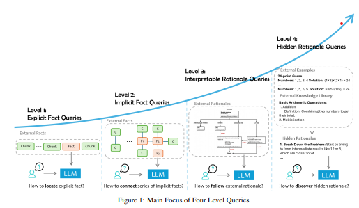
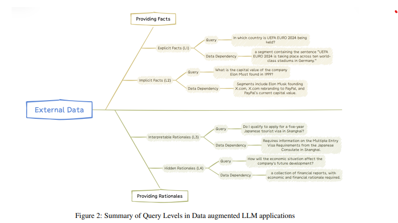
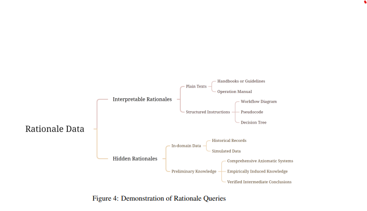
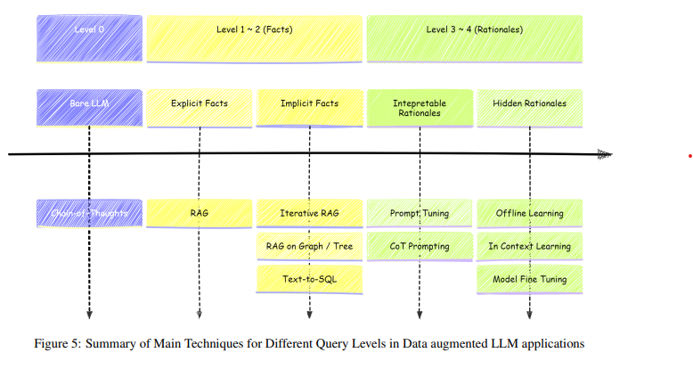
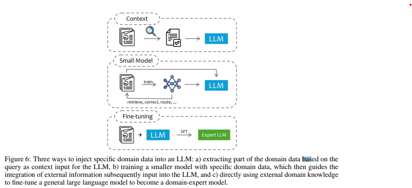

이 논문은 대규모 언어 모델(LLM)을 외부 데이터로 보강하여 실제 문제 해결 능력을 향상시키는 방법과 이를 위한 기술 및 도전 과제에 대해 다룹니다. 

1.	LLM + 외부 데이터의 장점:
- 도메인 전문성 강화: 특정 분야의 지식을 더 정확히 반영.
- 시대적 적합성 개선: 최신 데이터를 반영하여 더 관련성 높은 결과 생성.
- 환각(Hallucination) 감소: 잘못된 정보를 생성하는 빈도 줄임.
- 결과의 제어 가능성 및 해석력 향상.
2.	외부 데이터를 LLM에 통합하는 방법:
- RAG (Retrieval-Augmented Generation): 필요한 데이터를 검색해 모델에 제공.
- 파인튜닝(Fine-Tuning): 모델 자체를 특정 데이터로 학습시킴.
3.	실제 적용의 어려움:
- 사용자 의도를 정확히 파악하지 못하는 문제.
- 복잡한 작업에 필요한 모델의 추론 능력을 완전히 활용하지 못함.
- 작업이 여러 능력을 요구할 경우, 이를 효과적으로 분리하고 해결하는 데 어려움.
4.	작업 분류 체계:
LLM이 처리해야 할 사용자 질문 유형을 4가지 수준으로 나눔:
- 명시적 사실 질문: 정답이 명확한 데이터 기반 질문 (예: 특정 날짜에 무슨 일이 있었나요?).
- 암시적 사실 질문: 데이터 해석이 필요한 질문 (예: A의 영향력이 B보다 큰 이유는?).
- 해석 가능한 논리 질문: 결과를 도출하기 위해 명확한 논리가 필요한 질문 (예: 수학 문제 풀이).
- 숨겨진 논리 질문: 사용자가 요청하지 않은 복잡한 이유나 논리가 필요한 질문.
5.	통합 방식 3가지:
외부 데이터를 LLM에 통합하는 방법에는 다음이 있음:
- 컨텍스트 제공: 질문과 함께 외부 데이터를 입력으로 넣음.
    - 장점: 간단하고 빠르게 적용 가능.
    - 한계: 외부 데이터가 길면 모델 처리 능력에 제한.
- 작은 모델 활용: 외부 데이터를 처리할 별도 모델 생성.
    - 장점: 효율적이고 유연함.
    - 한계: 별도 시스템 개발 필요.
- 파인튜닝(Fine-Tuning): 외부 데이터를 활용해 LLM 자체를 훈련.
    - 장점: 모델이 데이터에 최적화됨.
    - 한계: 시간이 오래 걸리고 비용이 많이 듦.
6.	제안하는 가이드:
- 작업의 핵심 초점을 파악하고, 필요한 데이터를 분석 및 분류.
- 각 도전 과제에 적합한 기술을 적용.
- 특정 문제를 해결하기 위한 맞춤형 접근 방식 개발.

[Paper Link](https://arxiv.org/pdf/2409.14924)

## Problem Definition

### 1. 데이터 증강 LLM의 기본 구조:
- 정의: 사용자의 질문(Q)에 대해 외부 데이터(D)를 기반으로 답변(A)을 생성하는 시스템.
- 표현식: `Q + D -> A`
- 기존 LLM은 학습된 지식만을 활용하지만, 데이터 증강 LLM은 **외부 데이터(D)**를 통해 더 정확하고 최신의 답변을 제공.

### 2. 질문 유형의 4단계 분류:

질문의 복잡성과 데이터 활용 깊이에 따라 4단계로 나뉨:
1.	Level 1: 명시적 사실(Explicit Facts)
- 특징: 외부 데이터에 명확히 나타난 정보를 단순히 추출.
- 예시: “2024년 여름 올림픽은 어디서 열리나요?”
- 도전 과제: 필요한 정보를 정확히 찾아내는 능력.
2.	Level 2: 암시적 사실(Implicit Facts)
- 특징: 여러 데이터를 조합하거나 간단한 추론이 필요한 질문.
- 예시: “캔버라가 있는 나라의 현재 여당은 무엇인가요?” → 캔버라가 호주에 있다는 정보 + 호주의 현재 여당 정보 결합.
- 도전 과제: 데이터를 연결하고 추론하는 능력.
3.	Level 3: 해석 가능한 근거(Interpretable Rationales)
- 특징: 도메인 지식이나 절차적 규칙을 이해하고 이를 적용해야 하는 질문.
- 예시: “FDA 지침에 따르면 이 약물 신청이 규제를 준수하나요?”, “급성 흉통 환자 관리 기준에 따라 진단을 내리세요.”
- 도전 과제: 규칙과 지침을 이해하고 이를 상황에 맞게 활용.
4.	Level 4: 숨겨진 근거(Hidden Rationales)
- 특징: 명시적으로 기록되지 않은 패턴과 논리를 외부 데이터에서 추론.
- 예시: "클라우드 운영팀의 과거 사건 데이터에서 문제 해결 전략 도출", "데이터의 패턴을 기반으로 암묵적인 의사결정 과정을 추론"
- 도전 과제: 비구조화된 데이터에서 통찰을 추출하고 논리적 근거를 발견.

### 3. 분류의 목적:
- 질문 유형을 명확히 정의해 각 단계의 도전 과제를 이해.
- 단계별로 요구되는 LLM의 역량과 이를 지원하는 맞춤형 솔루션 탐색.

### 4. 문제 해결을 위한 접근법:
- 단순 정보 검색(Level 1, 2): 정확한 정보 추출 및 결합.
- 고급 논리와 추론(Level 3, 4): 도메인 전문가 수준의 추론과 규칙 적용.

## Explicit Fact Queries (L1)
외부 데이터를 활용한 질문 유형 중 가장 단순한 형태로, 특정 데이터 세그먼트에서 직접적으로 답을 추출할 수 있는 질문.

### 1. Overview
1. 특징:
- 답변이 외부 데이터(D)에서 직접적으로 검색 가능.
- 최소한의 추론 또는 단순한 논리로 답변 생성.
- 질문은 명확한 외부 데이터 의존성을 가짐.

2. 데이터 의존성(Data Dependency):
- 데이터 세트 D는 여러 문서 세그먼트로 구성됨: `D={D1, D2, D3}`
- 각 질문 q에 대해 필요한 데이터 세그먼트만 사용:
- 필요한 세그먼트 정의: `Dep(q) = {d in D and need(q, d)=1}`

3. 정의:
명시적 사실 질문(Q1)은 특정 데이터 세그먼트에서 직접 답을 검색하고 생성하는 질문으로 정의됨.
- 구성 요소:
    1.	데이터 검색 컴포넌트 `r_D`:
    - 질문 q와 관련된 데이터 세그먼트(r_D(q))를 식별.
    - r_D(q)는 Dep(q)와 유사하거나 일치해야 함.
    2.	응답 생성 컴포넌트 `theta`:
    - 검색된 데이터 세그먼트 r_D(q)를 바탕으로 답변 a를 생성.
    - theta(r_D(q)) = a: 답변은 명확한 데이터를 기반으로 생성됨.

4. 예시:
- 학술 논문:
    - “논문 X에서 문제 Y를 해결하기 위해 사용된 방법은 무엇인가?”
    (주어진 논문 데이터 세트에서 직접 정보 검색)
- 기업 전략:
    - “회사 X의 AI 전략은 무엇인가?”
    (최신 뉴스 및 기사에서 관련 정보 검색)

Explicit Fact Queries는 명확한 데이터 세그먼트를 기반으로 답을 제공하며, 복잡한 추론이 필요하지 않은 가장 기본적인 질문 유형입니다. 이를 효과적으로 처리하려면 **관련 데이터 검색(r_D)**과 **응답 생성(theta)**이 정확히 작동해야 합니다.

### 2. Challenges and Solutions

1. Explicit Fact Queries와 RAG:
- RAG (Retrieval-Augmented Generation): Explicit Fact Queries를 처리하기 위한 가장 널리 사용되는 기술.
- 장점: 효과적이고 유연하며 비용 효율적.

2. RAG 시스템의 주요 도전 과제:
    1.	데이터 처리 문제:
        - 외부 데이터가 비구조적이고 다중 모드(표, 이미지, 비디오 등)로 구성되어 있음.
        - 데이터를 “세그먼트(청킹)“로 나눌 때 문맥과 의미를 유지하기 어렵다.
    2.	데이터 검색 문제:
        - 대규모 비구조적 데이터에서 관련 세그먼트를 검색하는 것은 계산 집약적이고 오류 발생 가능성이 높음.
        - 효율적이고 정확한 검색 메커니즘 개발이 필요.
    3.	성능 평가 문제:
        - RAG 시스템의 성능을 구성 요소 수준에서 평가하는 것은 복잡함.
        - 데이터 검색 및 응답 생성 품질을 정확히 평가하기 위한 강력한 평가 지표 필요.

3. 현재 연구와 해결 방안:
- RAG 시스템 개선:
    - 다양한 연구와 도구가 RAG의 주요 한계를 해결하기 위해 개발됨.
- 대안 기술:
    - RAG 외에도 Explicit Fact Queries를 처리할 수 있는 기술적 대안을 탐구.

### 3. Retrieval-augmented Generation (RAG)

**Retrieval-Augmented Generation (RAG)**은 언어 모델이 외부 데이터베이스나 문서에서 필요한 정보를 **검색**하여 답변 생성 과정에서 활용하는 방법입니다. **정보 검색**과 **자연어 생성**을 결합하여 더 정확하고 풍부한 결과를 제공합니다. RAG는 크게 **데이터 처리, 검색, 응답 생성**의 세 단계로 나뉩니다.

#### **3.1. 데이터 처리 향상**
1. **문서 파싱**  
   - 텍스트, 표, 그림 등의 정보를 구조적으로 추출해 검색에 적합한 형태로 변환합니다.

2. **멀티모달 문서 처리**  
   - **텍스트로 변환**: 표나 시각 자료를 설명 형태로 바꿔 처리 (예: Table-to-Text 방법).  
   - **멀티모달 임베딩**: 시각 및 텍스트 데이터를 임베딩 벡터로 변환해 언어 모델에 입력하는 방식.

3. **청킹(Chunking) 최적화**  
   - 긴 문서를 작은 단위로 나누는 과정입니다.  
     - **방법**: 고정 크기 청킹, 슬라이딩 윈도우, 문단 기반 청킹, 의미 기반 청킹 등.  
     - **세부 조정**: 쿼리에 필요한 세부 수준에 맞는 청크 선택 또는 원본 문서 구조를 유지하며 시각 모델로 나누기.

#### **3.2. 데이터 검색 향상**
1. **인덱싱**  
   검색을 위해 문서의 특정 부분을 인덱스로 설정하는 과정으로, 세 가지 방식이 있습니다:  
   - **희소(Sparse) 검색**: 키워드 기반 (예: TF-IDF, BM25). 간단하지만 동의어를 잘 처리하지 못함.  
   - **밀집(Dense) 검색**: 문서를 벡터 공간에 매핑 (예: BERT 기반 DPR, SimCSE, LLM2Vec).  
   - **혼합(Hybrid) 검색**: 희소와 밀집 검색을 결합해 문서의 주제와 의미를 동시에 고려.

2. **쿼리-문서 정렬**  
   검색 쿼리와 문서의 텍스트 청크를 가장 잘 맞는 형태로 정렬합니다.  
   - **전통적 정렬**: 쿼리와 문서를 같은 벡터 공간에 매핑.  
   - **문서 도메인 정렬**: 쿼리에서 가상의 답변을 생성하고 관련 데이터를 검색.  
   - **쿼리 도메인 정렬**: 텍스트에서 생성된 가상의 질문 세트를 기반으로 가장 유사한 질문과 텍스트를 검색.

3. **재정렬 및 필터링**  
   검색된 상위 k개의 문서 청크를 **점수화**하여 순서를 재조정하고, 불필요하거나 부정확한 데이터를 제거합니다.  
   - **방법**: LLM을 활용한 신뢰도 평가, 퍼플렉서티(혼란도) 점수 사용 등.

4. **재귀적 검색**  
   한 번의 검색으로 충분하지 않을 경우 **반복 검색**을 통해 점진적으로 답변에 필요한 데이터를 보완합니다.  
   - 예: 트리 구조 검색 방법, K-means를 이용한 계층적 검색.

#### **3.3. 응답 생성 향상**
1. **정보 충족도 평가**  
   검색된 정보가 충분한지 확인하고, 부족하다면 추가 데이터를 다시 검색합니다.

2. **노이즈 처리**  
   검색된 데이터에 불필요한 정보(노이즈)가 있을 경우, 모델이 잘못된 응답을 생성하지 않도록 학습 데이터를 설계하여 대응합니다.  
   - **방법**: 미세 조정(fine-tuning), 학습 과정에서 노이즈 인식 능력 강화.

3. **공동 학습**  
   검색기와 생성기를 함께 훈련하여 두 시스템이 일관성 있게 성능을 발휘하도록 개선합니다.  

## Implicit Fact Queries (L2)

### 1. Overview

**Level-2 Queries (Q2)**는 단순히 하나의 데이터 청크(조각)에서 답변을 찾는 것이 아니라, 여러 데이터 청크에서 정보를 수집하고 **상식적 추론**이나 간단한 논리적 결합이 필요한 질의입니다.

#### **핵심 특징**
1. **정보의 분산**  
   - 답변에 필요한 정보가 여러 문서나 데이터 청크에 흩어져 있습니다.  
   - 한 번의 검색(retrieval)으로 해결되지 않고 **여러 번의 검색**과 결과 결합이 필요합니다.

2. **논리적 추론 필요**  
   - 답변이 명확히 명시되어 있지 않고, 여러 정보를 **조합하고 상식적 추론**을 적용해야 답을 도출할 수 있습니다.  

3. **질의 유형**  
   - **통계적 질의**: 예) "1000개 이상 샘플을 가진 실험이 몇 개나 되는가?"  
   - **기술적 분석**: 예) "가장 많이 언급된 증상 상위 3개는 무엇인가?"  
   - **비교 분석**: 예) "X와 Y 기업의 AI 전략의 차이점은 무엇인가?"

#### **Q2 질의 처리 과정**
1. **복잡한 질의 분해**  
   - 원래의 질의(Q2)를 더 단순한 **명시적 사실 질의(Q1)**로 나눕니다.  
   - 예:  
     Q2: **"가장 많이 언급된 증상 상위 3개는?"**  
     → Q1-1: **"증상 A가 몇 번 언급되었는가?"**  
     → Q1-2: **"증상 B가 몇 번 언급되었는가?"**  

2. **정보 검색 및 결합**  
   - 나뉜 Q1 질의에 해당하는 데이터 청크를 검색하여 필요한 정보를 가져옵니다.  
   - 이후, 해당 정보를 결합하고 상식적 논리를 적용해 Q2에 대한 최종 답변을 생성합니다.

3. **응답 생성**  
   - 대규모 언어 모델(LLM)을 사용하여 검색된 데이터를 조합하고 추론을 통해 답변을 생성합니다.  

#### **예시**
1. **통계적 질문**: "샘플 크기가 1000개 이상인 실험이 몇 개나 되는가?"  
   - 데이터를 검색하고 각 실험의 샘플 크기를 확인해 **조건에 맞는 실험 수를 카운트**합니다.

2. **최빈값 분석**: "가장 많이 언급된 증상 상위 3개는 무엇인가?"  
   - 증상별 언급 횟수를 집계하고 **상위 3개를 선택**합니다.

3. **비교 질문**: "기업 X와 Y의 AI 전략 차이점은?"  
   - 두 기업의 AI 전략에 대한 최신 기사와 데이터를 비교 분석하여 **차이점을 요약**합니다.

### **2 Challenges and Solutions**  
**Level-2 질의의 특징**은 명확하게 하나의 문서에 답이 있는 것이 아니라, **여러 문서에서 정보를 결합**하고 **상식적 추론**을 통해 결론을 도출해야 한다는 점입니다. 이 과정에서 발생하는 **주요 도전과제**와 **해결책**은 다음과 같습니다:

1. **적응형 검색 볼륨 (Adaptive Retrieval Volumes)**  
   - 질의마다 필요한 검색 범위가 다릅니다.  
   - 고정된 검색량을 사용하면 **불필요한 정보 노이즈**나 **정보 부족**이 발생할 수 있습니다.  

2. **추론과 검색의 조화**  
   - **추론(Reasoning)**은 어떤 정보를 검색해야 할지 가이드를 제공하지만,  
     **검색된 정보**는 다시 추론 전략을 정교하게 조정하는 데 사용됩니다.  
   - 이 두 과정을 **지능적으로 통합**하고 **선택적으로 활용**하는 것이 중요합니다.  

#### **해결책**  
Level-2 질의의 문제를 해결하기 위한 방법은 다음과 같습니다:  
1. **Iterative RAG** (반복 검색 기반 RAG)  
2. **Graph/Tree 기반 RAG**  
3. **SQL 기반 RAG**  

### **3 Iterative RAG**  
**Iterative RAG**는 복잡한 질의를 여러 단계에 걸쳐 **반복적으로 검색**하고 정보를 보완해 나가는 방식입니다. 이를 통해 처음에 놓쳤던 정보나 부족한 부분을 수정하면서 최종적으로 정확한 답변에 도달합니다.  

#### **방법론**  
1. **계획 기반 방법 (Planning-based)**  
   - **단계별 검색 계획**을 생성하거나 검색 과정 중 동적으로 조정합니다.  
   - 예시:  
     - **ReAct**: 각 단계에서 목표를 지속적으로 업데이트하여 필요한 지식의 공백을 줄입니다.  
     - **IRCoT** & **RAT**: **Chain of Thought**(단계별 추론)를 사용해 이전에 검색된 정보를 바탕으로 다음 검색 목표를 결정합니다.  
     - **GenGround**:  
       1. **간단한 단일 단계 질문**을 생성하고 바로 답변합니다.  
       2. 이후, 이 질문-답변 쌍을 검색된 문서와 비교하여 잘못된 부분을 확인하고 수정합니다.  
       - 이러한 반복 과정을 통해 신뢰도 높은 답변을 제공합니다.  

2. **정보 격차 채우기 기반 (Information Gap Filling Based)**  
   - 검색과 답변 생성을 반복하면서 모르는 부분을 점진적으로 채워갑니다.  
   - 예시:  
     - **ITRG**:  
       - 기존 지식으로 답변을 생성한 뒤, 답변에서 부족한 부분을 추가적으로 검색하고 보완합니다.  
     - **FLARE**:  
       - 각 반복 단계에서 **신뢰도가 낮은 단어(토큰)**를 수정하고 보완합니다.  
     - **Self-RAG**:  
       - 대규모 언어 모델(LLM)을 미세 조정해, **검색을 계속할지, 답변을 시작할지**를 스스로 판단하게 만듭니다.

### **4. Graph/Tree Question Answering**
그래프와 트리를 활용한 질문 응답 시스템은 여러 참조 정보에서 관계를 파악하고 이를 종합적으로 활용해야 하는 “암묵적 사실 쿼리”를 해결하기 위해 사용됩니다.

1. 전통적인 지식 그래프 (Knowledge Graph, KG)
- 구조: 지식 그래프는 각 노드가 “엔티티”를 나타내고, 노드 간의 연결(엣지)은 엔티티 간의 “관계”를 나타냅니다.
- 활용 방안:
	1.	KG 강화 LLM (KG-enhanced LLM):
    - 대규모 언어 모델(LLM)이 학습이나 추론 중에 지식 그래프를 활용하여 더 깊은 이해를 얻도록 돕습니다.
	2.	LLM 강화 KG (LLM-enhanced KG):
    - LLM이 그래프 임베딩, 그래프 보완, 그래프 생성, 질문 응답 등에 활용됩니다.
	3.	협력적 LLM+KG 접근법:
    - LLM과 KG가 서로 보완하며, 양방향 추론을 통해 성능을 강화합니다.
- 예시:
    - Rigel-KQGA 모델: 질문을 기반으로 필요한 그래프 노드를 예측하고 LLM과 결합해 답을 도출.
    - Think-on-Graph: 질문에 포함된 엔티티를 추출하고 그래프에서 BFS 탐색을 반복하며 최적의 답을 찾음.
    - R3 모델: LLM이 질문에 대해 필요한 상식적 추론(axiom)을 도출하고, 필요한 정보를 그래프에서 순차적으로 검색해 답을 완성.

2. 데이터 청크 그래프/트리
- 구조: 텍스트를 세부적인 엔티티로 나누는 대신, 텍스트 청크(작은 의미 단위)를 노드로 사용합니다. 노드 간 관계는 의미적 유사성이나 구조적 연관성을 기반으로 연결됩니다.
- 활용 방안:
	1.	질문 유형에 따른 그래프 생성 (Knowledge-Graph-Prompting):
    - 연결 질문(Bridging Questions): 순차적 추론이 필요.
    - 비교 질문(Comparing Questions): 여러 텍스트를 병렬적으로 비교.
    - 구조적 질문(Structural Questions): 문서 구조를 탐색하며 답을 찾음.
	2.	그래프 및 트리 기반 기술:
    - MoGG: 문장을 의미적 단위로 나누고, 유사성에 따라 노드 간 연결을 형성.
    - RAPTOR: 텍스트 블록을 계층적으로 클러스터링해 추상적 정보 요약.
    - GraphRAG: 텍스트 블록을 먼저 연결한 후, 커뮤니티 탐지를 통해 관련 정보를 그룹화.

### **5. Natural Language to SQL Queries**
자연어를 SQL로 변환하는 기술(NL2SQL)은 구조화된 데이터를 다룰 때 매우 유용합니다. 

1. NL2SQL이란?
- 정의: 사용자의 자연어 질문을 SQL 쿼리로 변환해 데이터베이스에서 원하는 정보를 가져오는 기술.
- 예시:
    - 사용자 질문: “2023년에 가장 많이 팔린 제품은?”
    - 변환된 SQL: `SELECT product_name FROM sales WHERE year = 2023 ORDER BY quantity_sold DESC LIMIT 1;`

2. 주요 도구와 발전
- Chat2DB 같은 도구:
    - 자연어를 SQL로 변환하는 과정을 자동화해 데이터베이스와 쉽게 상호작용하도록 돕는 도구.
- 대규모 언어 모델(LLM)과의 결합:
    - 최근의 발전으로 LLM이 NL2SQL 기술을 활용해 구조화된 데이터에 접근할 수 있게 됨.

3. LLM과 NL2SQL 통합의 이점
	1.	정확한 데이터 기반 응답 생성:
    - LLM이 구조화된 데이터베이스에서 정보를 검색하고 이를 바탕으로 더 정확하고 맥락에 맞는 답변을 제공.
	2.	응용 범위 확장:
    - 단순 텍스트 생성뿐 아니라 데이터베이스를 해석하고 복잡한 작업 수행 가능.
	3.	생성된 콘텐츠의 품질 향상:
    - 데이터에 기반한 깊이 있는 내용과 정교한 답변 제공.

4. 적용 사례
- 비즈니스 인텔리전스: 매출 데이터 분석, 고객 행동 파악.
- 헬스케어: 환자 기록 분석 및 통계 추출.
- 교육: 학생 성적 데이터를 바탕으로 학습 경향 분석.

### **6. Discussion on Fact Queries**

사실(Fact) 기반 질문 처리에 대한 논의는 정확한 정보를 제공하기 위해 중요한 두 가지 측면을 다룹니다. 

1. 파인튜닝(Fine-tuning)을 사용할 것인가?
- 문제점:
	1.	성능 저하 가능성:
    - 대규모 언어 모델(LLM)을 새로운 사실 데이터로 파인튜닝하면 기존의 정확도가 떨어질 수 있음.
	2.	환각(hallucination) 증가:
    - 잘못된 정보를 생성하는 비율이 높아질 수 있음.
	3.	기계적 암기:
    - 파인튜닝된 모델은 새로운 사실을 “암기”하는 경향이 있음.
    - 문장의 표현만 살짝 바뀌어도 학습한 내용을 제대로 활용하지 못함.
- 결론: 현재의 파인튜닝 방식은 모델이 사실을 깊이 이해하고 통합하는 데 한계가 있음. 더 정교한 통합 방법이 필요.

2. 질문의 수준(Explicit/Implicit Fact Queries) 구분
- 질문 유형:
	1.	명시적 사실 질문(Explicit Fact Queries):
    - 간단한 데이터 조각으로 답변할 수 있는 질문.
    - 예: “한국의 수도는 어디인가?”
	2.	암묵적 사실 질문(Implicit Fact Queries):
    - 맥락에 따라 여러 정보를 종합해야 답변할 수 있는 질문.
    - 예: “한국의 수도가 경제적으로 중요한 이유는?”
- 오분류의 문제:
	1.	명시적 질문을 암묵적 질문으로 착각:
    - 불필요한 많은 정보를 가져와 계산 리소스 낭비.
	2.	암묵적 질문을 명시적 질문으로 착각:
    - 충분한 외부 데이터를 가져오지 않아 부정확한 답변 생성.
- 효과적인 접근법:
    - 질문 구분: 질문의 성격을 먼저 분석하여 적절한 방법을 선택.
    - 자율 평가(Self-RAG):
        - 모델이 스스로 가져온 정보가 충분한지 판단하도록 훈련.

## Interpretable Rationale Queries (L3)

### **1. Overview**

 이 섹션에서는 외부 데이터를 활용해 복잡한 질문에 대한 근거를 제공하는 두 가지 유형의 질문을 다룹니다.

1. 질문 유형

- 질문은 “근거(rationale)“의 성격에 따라 두 가지로 나눌 수 있습니다:
	1.	해석 가능한 근거(Interpretable Rationale):
    - 근거가 명확히 설명되어 있어 이해하기 쉬운 질문.
    - 예: 공식 문서나 가이드에 따라 특정 상황에 대한 해결책을 제공하는 질문.
	2.	숨겨진 근거(Hidden Rationale):
    - 다음 섹션에서 다룸. 근거가 직접적으로 드러나지 않아 더 복잡한 분석이 필요한 경우.

2. 해석 가능한 근거란?
- 외부 데이터에서 명확하고 구조화된 설명을 제공하여 문제를 해결할 수 있는 질문 유형.

(1) 일반 텍스트 (Plain Texts):
- 형태: 명확한 설명이 담긴 텍스트 자료.
- 예: 매뉴얼, 가이드라인, 공식 문서 등.
- 예시:
    - FDA(미국 식품의약국) 지침을 참조해 제약 공장의 문제를 해결.
    - 의사가 환자의 증상을 진단하고 치료하는 데 필요한 약물 안내서.
- 장점: 전문가의 사고 과정을 문서로 표현해 복잡한 상황에서도 의사 결정을 지원.

(2) 구조화된 지침 (Structured Instructions):
- 형태: 상태 전환을 기반으로 한 의사 결정 프로세스.
    - Moore 머신: 현재 상태만으로 다음 행동을 결정.
    - Mealy 머신: 현재 상태와 입력값을 함께 고려해 행동 결정.
- 예시 포맷: 워크플로우, 의사 결정 트리, 의사 코드.
- 활용 사례:
    - 고객 서비스: “환불 요청 처리”를 워크플로우를 통해 단계별로 대응.
    - 의료: 환자의 증상과 지침서를 바탕으로 진단과 치료를 결정.

3. 해석 가능한 근거를 활용한 질문 예시
- 예 1: 환자가 가슴 통증을 호소하는 경우, 특정 증상을 기반으로 진단 및 치료 방법은? (가슴 통증 관리 지침 제공)
- 예 2: 고객이 제품 교환이나 환불을 요청할 때 어떻게 대응해야 하는가? (고객 서비스 워크플로우 제공)

### **2. Challenges and Solutions**

해석 가능한 근거(Interpretable Rationale) 질문을 처리할 때, 도메인 특화 근거를 LLM에 효과적으로 통합하는 데에는 여러 도전 과제가 있습니다.

1. 주요 도전 과제
	1.	프롬프트 최적화 비용 (Prompt Optimization Costs)
    - 문제점:
        - 각 질문마다 적절한 배경 지식과 의사결정 기준이 필요해 다양한 예제를 설계해야 함.
        - 수작업으로 프롬프트를 설계하는 과정은 시간과 노동이 많이 소요됨.
        - 모델이 질문 유형에 따라 맞춤형 프롬프트를 자동 생성하도록 학습하려면 많은 계산 자원이 필요.
    - 결과: 최적의 프롬프트를 찾는 데 드는 비용이 높아짐.
	2.	해석 가능성 부족 (Limited Interpretability)
    - 문제점:
        - 프롬프트가 LLM의 응답에 미치는 영향을 투명하게 이해하기 어려움.
        - LLM의 내부 매개변수에 접근할 수 없는 경우가 많아, 특정 프롬프트가 응답에 미치는 영향을 분석하기 어려움.
        - 이로 인해 모델의 응답을 일관되게 이해하거나 검증하기 어려움.
    - 결과: LLM의 응답이 왜 특정 방식으로 생성되었는지 확인할 수 없으므로 신뢰성이 저하됨.

2. 해결 방안
	1.	프롬프트 최적화 문제 해결:
    - 자동화 도구 활용: 프롬프트를 자동으로 생성하거나 개선하는 도구(예: Prompt Engineering Toolkits) 활용.
    - 프롬프트 재사용: 비슷한 유형의 질문에서는 이미 최적화된 프롬프트를 재활용하여 시간과 자원 절약.
    - 모듈화된 설계: 프롬프트를 작은 구성 요소로 나누어 다양한 질문에 쉽게 조합 가능하도록 설계.
	2.	해석 가능성 개선:
    - 프롬프트 영향 분석 도구: 특정 프롬프트가 응답에 미치는 영향을 시각화하거나 분석하는 기술 활용.
    - 모델 출력 검증: 다양한 프롬프트를 테스트하고 응답을 비교하여 더 투명한 결과를 확인.
    - LLM Fine-tuning 대체: 프롬프트 중심 접근 대신 외부 시스템(예: 그래프나 워크플로우)과의 통합으로 해석 가능성을 보완.

### **3. Prompt Tuning**

**프롬프트 튜닝(Prompt Tuning)**은 외부 데이터에서 제공되는 **근거(rationale)**를 LLM에 효과적으로 통합하고, 모델이 이를 정확히 따라가며 반응하도록 만드는 핵심 기술입니다.

1. 프롬프트 튜닝의 필요성
- 단순히 자연어로 작성된 근거를 LLM에 제공하는 것만으로는 최적의 성능을 보장할 수 없습니다.
- 수작업으로 프롬프트를 설계하는 과정은 시간이 많이 소요되고, 자동화를 통해 효율성과 성능 향상이 필요합니다.

2. 주요 접근법과 사례

(1) 외부 데이터와 근거 활용
	1.	Text2MDT:
    - 의료 지침서와 교재에서 자동으로 의사결정 트리(Decision Tree)를 생성.
    - 복잡한 의료 텍스트의 논리적 체계를 명확히 정리.
	2.	MedDM:
    - **임상 지침 트리(CGT)**를 설계하고 이를 실행 가능한 형태로 변환.
    - 환자와 LLM 간 다중 턴 대화를 지원하는 프레임워크 제공.
	3.	InstructRec:
    - 추천 시스템에서 사용자 선호도, 의도, 작업 형식, 맥락을 자연어로 설명하는 보편적 포맷 개발.
    - 언어 기반 추천 시스템 구현.

(2) 강화 학습 기반 프롬프트 튜닝
- TEMPERA Framework:
    - 제한된 지침, 예제, 키워드를 활용해 강화 학습으로 프롬프트를 설계.
    - 모델의 정확도를 보상으로 설정하여 최적의 프롬프트 구성 발견.
- RLprompt:
    - 작은 언어 모델(LLM)도 강화 학습을 통해 피드백 기반으로 최적의 프롬프트 생성.
- Directional Stimulus Prompting:
    - 모델의 작업 성능을 보상으로 설정.
    - 특정 인스턴스에 맞춘 키워드나 힌트를 프롬프트로 활용해 예상 결과에 더 가깝게 정렬.

(3) 편집 기반 방법
- GrIPS:
    - 데이터셋의 작은 샘플을 활용해 다양한 프롬프트 수정(삭제, 교환, 의역, 추가)을 실험.
    - 가장 효과적인 프롬프트 구성을 빠르게 찾아냄.

(4) LLM을 활용한 프롬프트 최적화
- OPRO:
    - LLM이 과거 데이터와 성능 지표를 분석해 새로운 프롬프트 솔루션 생성.
    - 자체적으로 프롬프트를 평가하며 최적화를 간소화.
- Reflexion Framework:
    - LLM이 과거 출력에 대한 언어적 피드백을 기록해 저장.
    - 이 “에피소드 메모리”를 활용해 의사결정을 개선하고, 미래 상호작용에 활용.

### **4. CoT Prompting**
복잡한 근거(Complex Rationales)를 처리하기 위해 LLM이 체계적이고 연속적인 추론 과정을 수행하는 방법을 다룬 내용입니다. 

1. 복잡한 근거를 처리하기 위한 접근법

(1) Chain of Thoughts (CoT)
- 개념: LLM이 단계별로 추론 과정을 진행하도록 유도하는 방법.
- 확장: Tree of Thoughts(ToT)와 Graph of Thoughts(GoT)는 CoT의 확장 형태로, 각각 나무 구조나 그래프 구조를 활용해 더 복잡한 논리적 관계를 표현.

(2) CoT 프롬프트 설계
- 수작업 설계: 특정 문제(예: 의료 기록 오류 분석)에 대해 맞춤형 CoT 프롬프트를 설계.
- 예시: Wu et al.은 의료 기록에서 오류를 자동으로 탐지하고 수정하기 위해 개입, 진단, 관리 오류에 초점을 맞춘 CoT 프롬프트를 개발.
- 문제점: 효과적이지만, 많은 시간과 자원이 필요.

(3) 자동화된 CoT 생성
- Automate-CoT: 최소한의 라벨 데이터로 CoT 체인을 자동 생성하고, 각 체인의 중요도를 평가해 최적의 프롬프트 조합을 선택.
- 장점: 비용 절감 및 효율성 향상.

2. 에이전트 기반 시스템 (Agent Workflows)
- 개념: LLM을 중심으로 여러 모듈(프로파일링, 메모리, 계획, 실행)을 설계해 다양한 실제 문제를 해결하는 시스템.
- 특징:
    - 환경 적응성: 인간의 피드백이나 상황 변화에 따라 시스템이 스스로 조정 가능.
- 사례: Wang et al.은 이러한 시스템이 의료, 고객 서비스, 소프트웨어 개발 등에서 효과적으로 사용된다고 설명.

3. 주요 응용 사례
	1.	AutoML 기반 CoML
    - AutoML 지식을 LLM 프롬프트로 활용.
    - 실험 기록에서 유용한 정보를 동적으로 검색해 새로운 머신러닝 솔루션 개발.
	2.	MetaGPT
    - 소프트웨어 개발을 위한 멀티 에이전트 시스템.
    - 프로젝트 내 각 역할(개발자, 디자이너 등)을 에이전트로 설정해 협업.
    - 현실적인 워크플로우를 따라 소프트웨어 개발 작업을 효과적으로 완료.
	3.	의료 및 고객 서비스
    - 의료: 복잡한 사용자 질문에 정확한 정보를 제공.
    - 고객 서비스: 구체적인 사용자 요청을 이해하고 대응.

## Hidden Rationale Quries (L4)

### **1. Overview**
숨겨진 근거(Hidden Rationale) 질문은 답변을 위해 명확한 지침이 제공되지 않는, 가장 복잡한 유형의 질문입니다. 이 유형의 질문은 특정 도메인에 특화된 암묵적 지식을 요구하며, 이를 처리하기 위해 고급 분석 기술이 필요합니다. 이해하기 쉽게 정리하겠습니다.

1. 숨겨진 근거 질문이란?
- 특징:
    - 필요한 논리적 근거가 명시적으로 설명되지 않음.
    - 근거가 많고 다양하며, 일반적인 컨텍스트(문맥) 범위를 초과하는 경우가 많음.
    - 도메인 전문 지식이 암묵적으로 데이터에 포함되어 있어 이를 해석하고 활용하는 것이 어려움.
- 예시 질문:
	1.	경제와 회사의 미래: “경제 상황이 회사의 미래 발전에 어떤 영향을 미칠까?”
    - 재무 보고서를 분석하고 경제적, 재무적 논리를 이해해야 함.
	2.	24점 게임: “숫자 5, 5, 5, 1을 사용해 24점을 만드는 방법은?”
    - 과거 24점 게임 사례를 기반으로 논리를 추론.
	3.	시민권 법: “아프가니스탄에서는 부모가 해외에서 태어난 자녀에게 시민권을 부여할 수 있는가?”
    - 전 세계 시민권법 데이터셋을 바탕으로 판단.

2. 숨겨진 근거의 주요 데이터 유형
	1.	도메인 내 데이터 (In-domain Data):
    - 특징: 같은 도메인에서 나온 기록이나 생성된 데이터.
    - 예시:
        - 파이썬 프로그래밍 문제 해결 시 과거 문제와 알고리즘을 활용해 현재 문제를 해결.
        - 역사적인 질문-답변 데이터가 현재 질문 해결에 도움을 줄 수 있음.
	2.	기초 지식 (Preliminary Knowledge):
    - 특징: 다양한 상황에서 적용 가능한 포괄적인 기초 지식.
    - 예시:
        - 법률: 지역 법률 코드 전체가 판결의 기반.
        - 수학: 수학적 증명을 단순화하는 중간 결론.
        - 경험적 지식: 사람들의 경험과 실질적인 요약에서 도출된 복잡한 축적 데이터.

3. 도전 과제
- 암묵적 정보 해석: 숨겨진 근거는 데이터에 내재된 논리를 해석하고 활용해야 하므로 어려움이 큼.
- 데이터의 분산: 필요한 정보가 다양한 소스에 흩어져 있어 이를 통합적으로 분석해야 함.
- RAG 시스템의 한계: 기존의 “Retrieve-then-Generate” 시스템은 암묵적 정보 활용이 제한적.

4. 해결 방향
	1.	고급 분석 기술:
    - 데이터 내의 암묵적 논리를 해독하는 알고리즘과 모델 필요.
    - 예: 머신러닝 기반의 의미 추론 시스템.
	2.	효율적인 데이터 통합:
    - 분산된 데이터를 통합적으로 검색하고 분석하는 기술 필요.
    - 예: RAG 시스템 개선 및 강화.
	3.	학습 모델의 적응성 강화:
    - 모델이 다양한 도메인 데이터를 효과적으로 학습하고 적용할 수 있도록 설계.

### **2. Challenges and Solutions**

1. 주요 도전 과제
(1) 논리적 검색 (Logical Retrieval)
- 문제점:
    - 숨겨진 근거 질문은 단순히 단어 수준의 유사성이나 개체(entity) 기반 검색으로는 충분하지 않음.
    - 논리적 일치나 주제적 정렬이 필요한데, 기존 검색 방법은 이러한 심층적인 논리를 잘 파악하지 못함.
- 예:
    - 질문: “어떤 경제적 요인이 회사의 미래에 영향을 미칠까?”
    - 기존 검색은 단순히 “경제적 요인”이라는 키워드와 일치하는 데이터만 가져옴. 하지만 질문에 대한 답은 경제 데이터의 논리적 맥락을 포함해야 함.

(2) 데이터 부족 (Data Insufficiency)
- 문제점:
    - 외부 데이터가 현재 질문에 대한 명확한 지침이나 답변을 제공하지 않을 수 있음.
    - 필요한 정보는 자주 흩어져 있거나 간접적으로 표현되며, 이를 분석하고 조합하는 것이 어려움.
- 예:
    - 질문: “아프가니스탄에서 부모가 해외에서 태어난 자녀에게 시민권을 부여할 수 있는가?”
    - 답변을 위해 전 세계 시민권법 데이터의 단편적인 조항들을 결합하고 분석해야 함.

2. 해결 방안

(1) 논리적 검색 개선
- 새로운 검색 알고리즘 개발:
    - 표면적인 텍스트 유사성을 넘어 논리적 구조를 이해하고 검색하는 알고리즘 필요.
- 예:
    - 그래프 기반 검색: 데이터 간 논리적 관계를 그래프 형태로 표현해 더 정확한 검색 결과 제공.
    - 의미적 추론(search with inference): 질문의 숨겨진 논리를 파악해 더 관련성 높은 데이터를 선택.
- 주요 기술:
    - 지식 그래프(Knowledge Graph): 논리적 관계를 명시적으로 모델링.
    - 증강 검색(Augmented Retrieval): 기본 검색 결과에 추가 논리적 맥락을 결합.

(2) 데이터 해석 및 통합
- 강력한 데이터 통합 시스템:
    - 분산된 정보나 간접적으로 표현된 데이터에서 의미를 추출해 일관된 답변을 생성.
- 예:
    습: 과거 유사 문제의 사례를 활용해 현재 문제를 해결.
- 텍스트 요약 및 추론: 흩어진 데이터를 요약하고 논리적으로 조합.
- LLM의 향상된 추론 능력:
    - 단편적인 데이터에서 유의미한 결론을 도출할 수 있는 강화된 모델 필요.
- 멀티 모달 데이터 활용: 텍스트 외에도 표, 그래프, 이미지 데이터를 활용해 답변 정확도 향상.

### **3. Offline Learning**
**오프라인 학습(Offline Learning)**은 숨겨진 근거(Hidden Rationale) 질문을 처리하기 위해 데이터에서 규칙과 지침을 추출하고 이를 활용하는 접근 방식입니다. 

1. 오프라인 학습의 개념
- 목표:
    - 데이터에서 규칙, 원칙, 경험, 사고 체계(Thought Templates)를 사전에 학습.
    - 학습된 지식을 저장하고, 나중에 적절한 질문에 맞춰 검색 및 활용.
- 핵심 아이디어:
    - 규칙과 지침을 통해 복잡한 추론 과정을 단순화하고 효율성을 높임.

2. 주요 기법과 사례

(1) 자기 생성 근거 활용
- STaR:
    - 작은 데이터셋에서 시작해 점차적으로 예제를 확장하는 반복적 Few-Shot 학습 기법 사용.
- LXS:
    - 두 역할을 설정:
        1.	Learner 모델: 설명을 생성.
        2.	Critic 모델: 생성된 설명을 검증해 품질 보장.

(2) 실수 기반 학습
- GL:
    - 학습 중 발생한 오류를 분석해 미래 작업을 위한 지침으로 일반화.
- LEAP:
    - 의도적으로 실수를 생성해 이를 통해 저수준/고수준 원칙을 도출.
    - 원칙을 프롬프트에 통합해 최종 추론에 사용.
- RICP:
    - 훈련 데이터에서 발생한 오류를 분석하고, 오류 유형을 계층적으로 군집화해 질문별 원칙 생성.

(3) 체계적 사고 체계 활용
- Buffer-of-Thought:
    - 다양한 추론 작업에서 공통된 메타 수준의 사고 체계를 추출해 문제 해결에 활용.
- MedPrompt:
    - GPT-4를 활용해 학습 예제의 사고 체인(CoT)을 생성하고, 이를 KNN 기반 학습 접근법과 결합.

(4) 통합적 방법
- Agent Hospital:
    - 데이터를 기반으로 사고 체인을 생성하고, 이를 기록 검색 및 경험 검색과 결합해 활용.

3. 활용되는 주요 요소
	1.	학습 데이터의 오류:
    - 데이터에서 발생한 실수를 분석해 유용한 원칙과 근거를 도출.
    - 예: GL, RICP, Agent Hospital.
	2.	자기 생성 근거:
    - 모델이 스스로 사고 체인을 생성하고 이를 학습.
    - 예: MedPrompt, Buffer-of-Thought.
	3.	동적 및 정적 활용:
    - 정적 원칙: 모든 작업에 공통적으로 적용 (예: Agent Hospital, RICP).
    - 동적 원칙: 특정 질문에 따라 검색 및 활용 (예: MedPrompt, Buffer-of-Thought).

### **4. In Context Learning(ICL)**
**In-context Learning (ICL)**은 숨겨진 근거(Hidden Rationale)를 발견하고, LLM이 다양한 작업에서 더 나은 추론 능력을 발휘하도록 돕는 강력한 방법입니다. 

1. In-context Learning (ICL)의 개념
- ICL이란?
    - LLM이 프롬프트 내에 제공된 **예제(examples)**를 기반으로 학습하여 새로운 문제를 해결하는 능력.
    - 주어진 프롬프트에서 몇 가지 예시를 제공하면, 모델이 이를 바탕으로 패턴을 파악하고 유사한 작업을 수행.

2. ICL의 주요 기술 및 사례

(1) 예제 기반 학습의 효과
- 장점:
    - 대규모 모델의 Few-shot Learning 능력을 활용.
    - 적절한 예제를 포함하면 모델이 더 정확한 답변을 생성.
- 문제점:
    - 불필요한 정보 포함 시 문제 발생:
    - 프롬프트에 관련 없는 정보가 포함되면 LLM이 혼란을 겪고 부정확한 응답을 생성.

(2) 예제 검색 및 구성 방법
	1.	OpenICL (Wu et al.):
    - 다양한 전통적 방법(예: 유사도 기반 검색)을 활용해 예제를 검색하고 이를 통해 ICL의 효과를 분석.
	2.	Vote-k (Su et al.):
    - 그래프 기반 무감독 선택(annotation) 방법.
    - 다양한 예제를 포함한 데이터베이스를 구성해 실질적인 문제 해결 능력 강화.
	3.	Auto-CoT (Zhang et al.):
    - 예제를 다양한 유형으로 클러스터링하여 대표적인 예제를 생성.
    - 샘플 문제를 다양하게 설정하고 추론 체인을 생성해 학습 지원.

(3) 도메인 외 추론 능력 확장
	1.	다양한 경로 샘플링 및 최적화 (Wang et al.):
    - 여러 추론 경로를 샘플링하고, 일관성 있는 답변을 선택해 정확도 향상.
	2.	Reinforced & Unsupervised ICL (Agarwal et al.):
    - 사람이 생성한 예제를 대체할 수 있는 방법론 개발로, 사용 가능한 예제 풀(pool) 확장.
	3.	Task 분해 접근법 (DIN-SQL):
    - 작업을 더 단순한 하위 작업으로 나누고 이를 프롬프트로 사용하여 성능 개선.
    - 예: 텍스트에서 SQL 생성.

(4) 수학 문제 해결 및 한계
- DUP (Zhang et al.):
    - 수학 문제에서 발생하는 세 가지 주요 문제 해결:
        1.	의미적 오해(Semantic Misunderstandings)
        2.	계산 오류
        3.	단계 누락
- 핵심: 의미적 오해를 해결하고 문제의 본질을 깊이 이해하도록 유도.

3. ICL의 활용 분야
- 수학: 복잡한 계산 문제를 체계적으로 해결.
- 법률: 법적 판례와 조항을 바탕으로 정확한 해석 제공.
- 의료: 의학적 데이터를 기반으로 진단 및 치료 계획 수립.
- 금융: 재무 보고서 및 경제 데이터를 활용한 분석.

### **5. Fine-tuning**
Fine-tuning은 대규모 언어 모델(LLM)의 **새로운 도메인 근거(rationale)**를 빠르게 학습하도록 도와주는 강력한 방법입니다. 특히 복잡하고 전문적인 작업을 처리하는 데 중요한 역할을 합니다.

1. Fine-tuning의 필요성
- 기존 한계:
    - LLM은 강력한 학습 능력을 갖추고 있지만, 복잡하거나 긴 논리적 체인을 정확히 파악하는 데 어려움이 있음.
    - 방대한 외부 데이터를 제공할 경우, 추론 능력이 오히려 혼란스러워질 수 있음.
- Fine-tuning의 장점:
    - LLM의 사전 학습된 지식을 활용하면서 새로운 도메인 근거를 빠르게 학습.
    - 특화된 작업에서 모델의 적응성과 효과를 크게 향상.

2. Instruction Tuning

Fine-tuning의 한 방법으로, (instruction, output) 쌍을 사용해 모델에 새로운 능력을 추가.

Instruction 데이터셋 생성 방법:
	1.	기존 데이터셋 활용:
    - 이미 존재하는 데이터셋에서 지침과 출력을 도출.
	2.	수작업 생성:
    - 사람의 지식을 활용해 맞춤형 지침을 작성.
	3.	합성 데이터 생성:
    - 강력한 LLM을 사용해 새로운 지침 데이터를 자동 생성.

데이터 최적화:
    - 데이터 분포를 최적화해 Fine-tuning 효과를 극대화하는 연구도 진행됨.

3. Fine-tuning 비용 절감 기술

Fine-tuning은 높은 계산 비용과 시간이 필요하지만, 이를 줄이기 위한 다양한 방법이 개발됨.

(1) Adapter Tuning
- LLM의 매개변수는 **동결(freeze)**하고, 작은 어댑터 모델만 학습.
- 효과: 비용 감소 및 효율적인 Fine-tuning.

(2) Prefix Tuning & Prompt Tuning
- 입력 앞에 학습 가능한 벡터를 추가해 성능 향상.
- LLM의 기존 구조를 크게 변경하지 않고도 Fine-tuning 가능.

(3) Low-Rank Adaptation (LoRA)
- Dense Layer에 저랭크(low-rank) 제약을 적용해, 학습해야 할 매개변수의 수를 줄임.
- 효과: 효율적으로 다운스트림 작업에 적응.

4. Fine-tuning의 실제 적용 사례

(1) 수학적 추론
- MAmmoTH:
    - Chain of Thought와 Program of Thought를 결합한 수학 데이터셋으로 LLM 학습.
    - 다양한 수학적 문제를 해결할 수 있는 일반적인 추론 능력 강화.
- ReFT:
    - 동일 문제의 여러 추론 경로를 학습해, 보상 신호를 생성.

(2) 도메인 특화 모델
- ChatDoctor:
    - 10만 개의 의사-환자 대화 데이터를 사용해 Fine-tuning.
    - 의료 상담에서 환자 이해 및 추천 능력 향상.
- FinGPT:
    - 금융 데이터를 기반으로 Open-Source LLM Fine-tuning.
    - 자동화된 데이터 큐레이션 및 LoRA를 활용.

(3) 법률 및 기타 도메인
- DISC-LawLLM:
    - 중국 법률 도메인을 위한 Fine-tuning.
    - 다양한 법적 시나리오에서 법률 추론 능력 강화.
- ChatTimeLlama:
    - 시간 추론 및 미래 사건 예측을 위한 Fine-tuning.

## Conclusion

이 논문에서는 데이터를 증강한 LLM 애플리케이션을 질문의 초점에 따라 4가지 카테고리로 분류하고, 각 카테고리가 직면하는 문제와 이에 적합한 해결 방법을 제시합니다. 

1. 질문 카테고리와 적합한 접근법

(1) 정적 일반 지식 관련 질문
- 특징: 일반적이고 정적인 사실에 기반.
- 해결 방법:
- Chain of Thought (CoT): 단계별 추론을 통해 답변.
- 예시: “지구의 평균 온도는 얼마인가?”

(2) 명시적 사실 질문 (Explicit Fact Queries)
- 특징: 데이터베이스 내 특정 위치의 사실을 직접 검색.
- 해결 방법:
- 기본 RAG (Retrieve-and-Generate): 데이터베이스에서 정확한 정보를 검색.
- 예시: “2020년 특정 회사의 매출은 얼마인가?”

(3) 암묵적 사실 질문 (Implicit Fact Queries)
- 특징: 여러 관련 사실을 결합해야 함.
- 해결 방법:
- 반복적 RAG 및 그래프/트리 기반 RAG: 다수의 데이터 포인트를 동시에 검색하고 연결.
- 예시: “이 회사의 매출 증가는 어떤 요인에 의해 발생했는가?”

(4) 해석 가능한 근거 질문 (Interpretable Rationale Queries)
- 특징: 외부 지침과 명확한 논리를 따름.
- 해결 방법:
- Prompt Tuning 및 CoT: 프롬프트를 최적화하여 외부 지침과의 일관성 강화.
- 예시: “가슴 통증에 대한 치료 지침은?”

(5) 숨겨진 근거 질문 (Hidden Rationale Queries)
- 특징: 문제 해결을 위해 방대한 데이터에서 자율적으로 추론해야 함.
- 해결 방법:
- 오프라인 학습, In-context Learning, Fine-tuning.
- 예시: “현재 경제 상황이 특정 기업에 미칠 영향은?”

2. LLM에 지식을 주입하는 방법

(1) 컨텍스트 기반 주입
- 설명: 질문에 따라 도메인 데이터를 일부 추출해 LLM에 입력.
- 장점:
- 해석 가능성과 안정성이 높음.
- 단점:
- 컨텍스트 창의 크기 제한으로 정보 손실 가능.
- 적합한 상황: 짧은 텍스트로 설명 가능한 데이터.

(2) 소형 모델 기반 접근
- 설명: 특정 도메인 데이터를 학습한 소형 모델을 활용해 정보를 통합.
- 장점:
- 훈련 시간이 짧고 대량의 데이터 학습 가능.
- 단점:
- 모델의 성능에 따라 복잡한 작업에서는 한계가 있음.
- 적합한 상황: 중간 복잡도의 작업.

(3) Fine-tuning
- 설명: 도메인별 데이터로 LLM을 직접 학습.
- 장점:
- LLM의 큰 용량을 최대한 활용.
- 단점:
- 잘못된 데이터로 학습하면 오류 발생 가능.
- 기존 지식 손실 위험.
- 적합한 상황: 도메인에 특화된 데이터가 많은 경우.

3. 실제 적용에서의 추가 고려 사항
- 혼합형 파이프라인 필요:
- 대부분의 실제 응용은 여러 유형의 질문을 포함.
- 이를 해결하기 위해 여러 접근법을 결합한 라우팅 파이프라인 설계 필요.
- 적절한 데이터 주입 전략 선택:
- 데이터 출처와 특성을 철저히 이해한 뒤, 상황에 맞는 전략을 선택해야 함.

