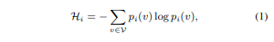

위 내용은 **Dynamic Retrieval Augmented Generation (RAG)**라는 개념과 이를 개선한 **DRAGIN**이라는 새로운 프레임워크를 설명한 논문 내용입니다. 

- **목적**: LLM(대규모 언어 모델)의 텍스트 생성 과정에서 **동적으로 필요한 정보를 검색**하여 활용하는 방법론.
- **핵심 요소**:
1. **언제 정보를 검색할지 결정** (When to retrieve)
2. **어떤 정보를 검색할지 결정** (What to retrieve)
- **문제점**:
1. **"언제 검색할지"**에 대한 결정이 **정적 규칙**에 의존함.
2. **"어떤 정보를 검색할지"**에 대해 최근 생성된 문장이나 토큰 몇 개만 활용하여, 문맥 전체에 걸친 정보 요구를 반영하지 못함.
- **개선된 프레임워크 DRAGIN**: 
- LLM의 **정보 요구(needs)**를 기반으로 **언제**와 **어떤 정보를** 검색할지 동적으로 결정.
- LLM의 텍스트 생성 과정 중 **정보 요구를 실시간으로 분석**하여 검색 시점과 내용을 정교하게 조정.

- **특징**:
1. **"언제 검색할지"**: 정보가 필요한 순간을 LLM의 요구를 통해 판단.
2. **"어떤 정보를 검색할지"**: 문맥 전체를 고려하여 검색 쿼리를 생성.

- **실험 및 성과**
- **평가**: 4개의 지식 집약적 텍스트 생성 데이터셋에서 DRAGIN과 기존 방법을 비교 평가.
- **결과**: DRAGIN이 모든 과제에서 기존 방법 대비 **우수한 성능**을 기록하며, 새로운 프레임워크의 효과성을 입증.


[Paper Link](https://arxiv.org/pdf/2403.10081)

## 1. Introduction

### **배경**
- **LLMs의 문제점**:
  - 자연어 처리(NLP)에서 뛰어난 성능을 보이나, 종종 **사실과 다른(hallucination)** 텍스트를 생성함.
- **RAG(Retrieval-Augmented Generation)**:
  - 외부 데이터베이스에서 정보를 검색해 LLM 입력에 통합, LLM의 성능을 향상시키는 방법.
  - 기존 RAG 방식은 주로 **단일 검색(single-round retrieval)**을 활용하여 단순 작업에는 효과적이나, **복잡한 다단계 작업** 및 **장문 생성**에는 한계가 있음.
  
### **Dynamic RAG (동적 RAG)**
- **특징**:
  - 텍스트 생성 도중 여러 번 검색 수행.
  - **언제 검색할지**(when to retrieve)와 **어떤 정보를 검색할지**(what to retrieve)를 결정.
- **한계**:
  1. **언제 검색할지**:
     - **정적 규칙**에 의존해 필요성이나 리스크를 충분히 고려하지 못함.
     - 불필요한 검색으로 인해 잡음 데이터를 포함하거나 시간/자원을 낭비할 가능성이 있음.
  2. **어떤 정보를 검색할지**:
     - 최근 생성된 문장 또는 몇 개의 토큰에만 의존하여, 문맥 전체의 정보 요구를 제대로 반영하지 못함.

### **DRAGIN (Dynamic Retrieval Augmented Generation based on Information Needs)**
- **개선된 프레임워크**:
  - **LLM의 실시간 정보 요구**를 기반으로 **언제**와 **어떤 정보를** 검색할지 동적으로 최적화.
- **핵심 기법**:
  1. **RIND** (Real-time Information Needs Detection):
     - 검색 시점 판단을 위해 LLM의 불확실성, 각 토큰의 중요도, 후속 토큰에 미치는 영향을 평가.
  2. **QFS** (Query Formulation based on Self-attention):
     - LLM의 **자기 주의 메커니즘(Self-attention)**을 활용하여 문맥 전체를 반영한 검색 쿼리를 생성.
- **장점**:
  - Transformer 기반 LLM에 간단히 통합 가능.
  - 별도의 추가 학습, 미세 조정, 프롬프트 엔지니어링이 필요하지 않음.

### **실험 결과**
- **평가**:
  - 4개의 지식 집약적 생성 데이터셋과 3가지 다른 LLM에서 DRAGIN을 기존 방법과 비교 평가.
- **성과**:
  - DRAGIN이 모든 데이터셋에서 **최신 성능(SOTA)** 달성.
  - **RIND**와 **QFS** 전략이 기존 방식보다 일관되게 우수한 성능을 보임.

## 2. Related Work

### **2.1 단일 라운드 검색 (Single-round Retrieval-Augmented LLM)**
- **개념**:
  - **초기 입력**을 기반으로 외부 데이터베이스에서 정보를 검색.
  - 검색된 지식을 LLM 입력에 통합하여 성능을 향상시킴.
- **장점**:
  - 간단하고 명확한 작업이나 **단순한 정보 요구**에 적합.
- **예시 연구**:
  1. **REPLUG (Shi et al., 2023)**:
     - LLM을 블랙박스로 간주하고, 검색 모델 학습을 위한 데이터 생성에 활용.
  2. **UniWeb (Li et al., 2023d)**:
     - LLM이 검색 보강이 필요한지 스스로 평가할 수 있는 **적응형 검색 학습** 방법 제안.
- **한계**:
  - 단일 입력만 사용하므로, 복잡한 작업이나 다단계 정보 요구에는 충분하지 않음.

### **2.2 다중 라운드 검색 (Multi-round Retrieval-Augmented LLM)**
- **개념**:
  - 복잡한 작업이나 긴 텍스트 생성 시 **여러 단계에 걸쳐 반복적으로 정보 검색**.
  - 예: 긴 질문 답변(Long-form QA), 다단계 추론(Multi-hop reasoning), 체인 오브 띠시트(Chain-of-thought reasoning) 등.
- **방법**:
  - 주어진 입력뿐 아니라 생성 과정 중 여러 시점에서 정보를 검색.
- **예시 연구**:
  1. **RETRO (Borgeaud et al., 2022)** & **ICRALM (Ram et al., 2023)**:
     - 4~32개의 토큰마다 검색 모듈 실행.
  2. **IRCot (Trivedi et al., 2022)**:
     - 매 문장마다 검색 수행.
  3. **FLARE (Jiang et al., 2023)**:
     - 생성된 텍스트에서 **확률이 낮은 불확실한 토큰**을 만날 때 검색을 활성화.
- **장점**:
  - 복잡한 작업이나 긴 텍스트에서 필요한 정보를 반복적으로 검색 가능.
- **한계**:
  - **고정된 간격**으로 검색하는 방식은 LLM의 **실제 정보 요구**를 반영하지 못해 비효율적일 수 있음.

### **결론**
- 단일 라운드 검색은 간단한 작업에 적합하지만, 복잡한 작업에는 한계가 있음.
- 다중 라운드 검색은 반복적이고 동적인 검색을 통해 더 나은 결과를 제공하지만, **LLM의 정보 요구**를 정교하게 반영하지 못하는 경우가 많음.
- 이를 해결하기 위해 동적인 정보 검색 방법론(예: DRAGIN)이 필요.

## 3. Methodology


### 3.1 Real-time Information Need Detection

#### **1. 기존 문제**
- 기존 **동적 RAG 프레임워크**들은 검색을 활성화하는 시점을 **정적인 규칙**(예: 일정 토큰 수 후 검색)에 의존.
- 예외적으로 **FLARE**(Jiang et al., 2023)는 LLM의 생성 확률(토큰에 대한 확률값)이 낮을 때 검색을 활성화.
- 하지만, **검색 필요성**은 단순히 확률만이 아니라 다음 요소들에 따라 결정됨:
  1. **토큰의 중요성**: 문맥에서 중요한 단어인지.
  2. **토큰의 의미**: 의미적으로 중요한지.
  3. **토큰이 후속 문맥에 미치는 영향**.

#### **2. RIND의 개선된 접근 방식**
- **RIND**는 LLM의 **정보 요구**를 다각적으로 평가하여 검색 시점을 결정.
- 3가지 주요 요소를 활용:
  1. **불확실성**: 토큰 생성 확률의 엔트로피(uncertainty).
  2. **후속 문맥에 미치는 영향**: 토큰이 이후 문맥에 얼마나 큰 영향을 미치는지.
  3. **의미적 중요성**: 의미적으로 중요한 단어인지 판단.


#### **3. RIND의 세부 구현**
1. **불확실성 평가**:
   - 토큰 생성 시, **확률 분포의 엔트로피**를 계산하여 해당 토큰의 불확실성을 측정.
   - 엔트로피 공식:
    - output sequence T = {t1, t2, ..., tn}
    - pi(v): vocabulary V의 토큰 v가 position i 에서 생성될 확률 
    - 

2. **후속 문맥에 미치는 영향 평가**:
   - Transformer의 **Self-attention 메커니즘**을 활용하여 토큰이 이후 문맥에 미치는 영향을 측정.
   - Attention 행렬 A를 계산:
    - 
     - Q: 쿼리 행렬.
     - K: 키(key) 행렬.
     - d_k: 키 벡터의 차원.
     - mask: 마스킹 함수를 통해서, 모델이 이전 위치의 토큰만 참조하도록 제어 
   - 특정 토큰 t_i 에 대해 이후 모든 토큰에서 t_i로의 **최대 Attention 값** 계산:
    - 

3. **의미적 중요성 평가**:
   - 불필요한 **불용어(stopword)**를 제외하여 의미적으로 중요한 단어만 평가.
   - binary 지표 s_i를 사용하여 불용어 여부를 확인
    - s_i = 0 if t_i in 불용어 집합 S
    - s_i = 1 otherwise

4. **종합 점수 계산**:
   - 위 3가지 요소를 결합하여 각 토큰의 **RIND 점수**를 계산:
   - `S_RIND(t_i) = H_i * a_max(i) * s_i`

5. **검색 활성화 조건**:
   - 모든 생성된 토큰 T={t1, t2, ..., tn}에 대해 RIND 점수를 계산  
   - 특정 토큰 t_i의 RIND 점수가 미리 설정된 임계값 theta를 초과하면 검색 모듈이 활성화됨.

### 3.2 Query Formulation based on Self-attention

#### **QFS(Query Formulation based on Self-Attention)란?**
- **목적**: 검색이 필요한 위치에서, 외부 데이터베이스로부터 필요한 정보를 효과적으로 가져오기 위해 **적절한 검색 쿼리(query)**를 생성.
- **기존 방법의 한계**:
  - 기존 동적 RAG는 주로 **가장 최근 문장**이나 **마지막 몇 개의 토큰**에만 초점을 맞춰 쿼리를 생성.
  - 이 방법은 모델의 **전체 문맥 정보 요구**를 제대로 반영하지 못함.
- **QFS의 새로운 접근**:
  - LLM의 **Self-Attention 메커니즘**을 활용하여 모델이 문맥에서 중요하게 여기는 토큰을 기반으로 쿼리를 생성.

#### **QFS의 작동 방식**
1. **시작점**:
   - RIND 모듈이 특정 토큰 t_i에서 외부 정보가 필요하다고 판단하고 검색을 활성화.

2. **Self-Attention 활용**:
   - 해당 토큰 t_i가 생성될 때, 이전 문맥 토큰 {t_i-1, t_i-2, ..., t1}에 대한 Self-Attention 가중치 사용.
   - **Self-Attention 가중치**는 모델이 각 이전 토큰을 얼마나 중요하게 생각하는지를 보여줌.

3. **쿼리 생성 과정**:
   1. **Attention 가중치 추출**:
      - t_i를 생성한 마지막 Transformer 레이어의 Attention 가중치 A_i를 가져옴.
      - `A_i = {a_{i,1}, a_{i,2}, ..., a_{i,i-1}}`
        - a_{i, j}: t_i에서 t_j에 배정된 attention score를 나타냄 
   2. **가중치 정렬**:
      - A_i를 내림차순으로 정렬하여 가장 높은 Attention 값을 가진 상위 n개의 토큰을 선택.
   3. **원래 텍스트와 연결**:
      - 선택된 n개의 토큰을 어휘에서 찾아 원래 텍스트 순서대로 배열.
   4. **쿼리 구성**:
      - 상위 n개의 토큰으로 쿼리 Q_i를 생성.

#### **QFS의 장점**
1. **문맥 전체 반영**:
   - LLM이 문맥에서 중요하다고 판단한 토큰만을 쿼리에 포함, 정보 요구를 더 정확히 반영.
2. **효율적인 쿼리**:
   - 모델의 Self-Attention 메커니즘을 활용하여 불필요한 정보를 제외하고, 의미 있는 단어들로 구성된 쿼리를 생성.
3. **자동화**:
   - LLM의 자체 메커니즘(Self-Attention)을 활용하므로 별도의 수작업 없이도 동적이고 최적화된 쿼리 생성 가능.


### 3.3 Continue Generation after Retrieval

1. **검색 위치 감지 및 정보 검색**:
   - **RIND**가 외부 정보가 필요한 위치 i를 감지.
   - **QFS**가 검색 쿼리를 생성하여 외부 데이터베이스에서 관련 문서(예: D_{i1}, D_{i2}, D_{i3})를 검색.

2. **LLM 출력 수정 (Truncate)**:
   - 검색이 필요한 위치 i까지 생성된 LLM의 출력 T를 잘라서 새로운 출력 T'생성:
     T' = truncate(T, t_i)
     - T: LLM이 원래 생성한 전체 시퀀스.
     - T': 검색이 필요한 위치 t_i까지만 포함한 시퀀스.

3. **검색된 정보 통합**:
   - 검색된 외부 문서 D_{i1}, D_{i2}, D_{i3}를 **특별한 프롬프트 템플릿**에 포함:
   - 이 프롬프트를 통해 LLM은 외부 정보와 T'을 기반으로 추가 내용을 생성.

```text
Below are the external knowledge references:
[1] Di1
[2] Di2
[3] Di3
Please answer the question based on the
external knowledge:
Question: xxx
Answer: T'
```

4. **출력 생성 재개**:
   - LLM은 외부 정보를 반영하여 중단된 t_i이후의 시퀀스를 계속 생성.
   - 이렇게 하면 **이전 생성에서 감지된 지식 격차**를 메우고, 보다 **정확하고 정보가 풍부한 출력** 생성 가능.

#### **다중 검색 및 생성 과정**
- **새로운 검색 위치 감지**:
  - 만약 이후 생성 과정에서 또 다른 검색 위치 j가 감지되면:
    1. **QFS**가 새로운 쿼리를 생성.
    2. 새로운 문서 D_{j1}, D_{j2}, D_{j3} 검색.
    3. 기존 문서 D_{i1}, D_{i2}, D_{i3}를 교체하고 동일한 방식으로 생성 재개.

## 4. Experimental Setup

### **4.1 데이터셋**
다양한 과제를 통해 DRAGIN의 성능을 평가:
1. **2WikiMultihopQA**:
   - 복잡한 다단계(multihop) 질문 응답 능력을 평가.
2. **HotpotQA**:
   - 다단계 추론이 필요한 질문 응답 능력을 평가.
3. **StrategyQA**:
   - 상식 추론 능력을 평가.
   - 예/아니오 답변 생성.
4. **IIRC**:
   - 읽기 이해 능력을 평가.

### **4.2 데이터셋 별 설정**
- **2WikiMultihopQA** & **HotpotQA**:
  - **Chain-of-Thought(CoT)** 추론 과정과 최종 답변 생성.
  - 패턴 매칭으로 최종 답변을 추출해 정확도(Exact Match), F1 점수, 정밀도(Precision)로 평가.
- **StrategyQA**:
  - CoT와 예/아니오 답변 생성.
  - 정확도(Exact Match)로 평가.
- **IIRC**:
  - 최종 답변 생성.
  - 평가 방식은 2WikiMultihopQA와 동일.

### **4.3 비교 기준 (Baselines)**
DRAGIN과 비교하기 위해 다양한 RAG 프레임워크를 설정:
1. **wo-RAG**:
   - RAG 없이 LLM이 직접 질문에 답변.
2. **SR-RAG (Single-round RAG)**:
   - 초기 질문만으로 관련 문서를 검색.
3. **FL-RAG (Fixed-Length RAG)**:
   - 일정 토큰 수 마다 검색 실행, 마지막 생성된 토큰을 쿼리로 사용.
4. **FS-RAG (Fixed-Sentence RAG)**:
   - 문장이 끝날 때마다 검색 실행, 마지막 생성된 문장을 쿼리로 사용.
5. **FLARE**:
   - 불확실한 토큰을 만날 때 검색 실행, 마지막 생성된 문장에서 불확실한 토큰 제외 후 쿼리 생성.
6. **DRAGIN**:
   - **토큰의 중요도와 불확실성**을 기반으로 검색 실행, LLM의 **전체 문맥**에서 쿼리 생성.

#### **차이점 요약 (Table 1의 비교)**
- **검색 시점**: DRAGIN은 토큰의 중요도와 불확실성에 따라 검색을 동적으로 실행.
- **쿼리 생성**: DRAGIN은 문맥 전체를 기반으로 Self-Attention을 활용해 쿼리 생성.

### **4.4 실험에 사용된 LLM**
- **LLaMA-2-Chat**:
  - 대화 응용에 최적화된 LLM (7B, 13B 모델 사용).
- **Vicuna-13B-v1.5**:
  - LLaMA를 기반으로 사용자의 대화 데이터를 Fine-tuning한 오픈 소스 챗봇.

### **4.5 구현 세부사항**
1. **검색 모델**:
   - **BM25**:
     - 외부 데이터베이스 검색에 사용.
     - Dense Retrieval 모델보다 성능이 뛰어난 것으로 보고됨.
   - **SGPT**:
     - 최신 Dense Retrieval 모델로도 실험 진행 (결과는 Section 5.5에 설명).
2. **불용어 처리**:
   - **Spacy** 라이브러리의 `en_core_web_sm` 모델 사용.
3. **외부 지식 데이터**:
   - **Wikipedia**:
     - 100 토큰 단위로 문서를 나눠 사용.
4. **LLM 설정**:
   - Hugging Face에서 모델 파라미터를 다운로드.
   - **Greedy Decoding** 사용해 실험 결과 재현성을 보장.
   - 실제 응용에서는 각 모델의 공식 디폴트 설정 사용 권장.

## 5. Experimental Results

### **5.1 DRAGIN과 Baseline 비교**
1. **RAG의 효과**:
   - 단일 라운드(single-round) RAG도 LLM의 성능을 향상시키는 데 효과적.
2. **고정 규칙 기반 방법의 한계**:
   - FL-RAG(고정 길이)와 FS-RAG(고정 문장)가 항상 단일 라운드보다 뛰어나지는 않음.
   - 잘못된 시점에서 검색이 활성화되면 성능이 저하될 수 있음.
3. **FLARE의 한계**:
   - 쿼리 생성 방식은 우수하지만 검색 활성화 시점(timing)이 최적화되지 않아 일관된 성능을 보이지 못함.
4. **DRAGIN의 성과**:
   - 모든 데이터셋과 LLM에서 **우수한 성능**.
   - 특히 **2WikiMultihopQA**와 **HotpotQA**처럼 다단계 추론(Multihop Reasoning)이 필요한 과제에서 뛰어난 결과.
   - 상식 추론(StrategyQA)에서는 상대적으로 덜 두드러짐.

### **5.2 효율성**
- 검색 호출 횟수 기준 효율성 평가:
  1. **FLARE**: 가장 적은 검색 호출, 효율적.
  2. **DRAGIN**: FLARE 다음으로 적은 검색 호출.
  3. **FS-RAG, FL-RAG**: 검색 호출이 더 많아 효율성이 낮음.
- **DRAGIN**은 성능과 효율성 사이에서 **균형**을 유지.

### **5.3 검색 타이밍의 중요성**
1. **타이밍 고정 후 비교**:
   - 동일한 쿼리 생성 방법을 사용해 검색 타이밍만 조정하여 IIRC 데이터셋에서 평가.
   - DRAGIN이 FLARE, FL-RAG, FS-RAG를 능가하며, **최적의 검색 타이밍**을 제공.
2. **RIND의 임계값(threshold)**:
   - 임계값 변화에 따라 검색 빈도와 성능 평가:
     - 임계값이 높을수록 검색 빈도는 감소, 효율성 증가.
     - 성능은 안정적으로 유지, **낮은 민감도**를 보임.
### **5.4 쿼리 생성의 효과**
1. **쿼리 생성 방법 비교**:
   - DRAGIN(QFS 방식)이 모든 방법 중 가장 우수.
   - FLARE는 두 번째로 효과적, FS-RAG와 FL-RAG는 상대적으로 성능이 낮음.
2. **전체 문맥 활용**:
   - 전체 문맥을 쿼리로 활용한 경우 성능 저하:
     - **불필요한 정보(중복성)**로 인해 최적의 결과를 내지 못함.
   - DRAGIN의 QFS 방식이 **실시간 정보 요구**를 반영해 가장 적합한 쿼리를 생성.


### **5.5 검색 모델 비교**
#### **1. 검색 모델의 종류**
- **Lexical Matching**(어휘 기반 검색):
  - 대표적으로 **BM25**가 있음.
  - 단순하지만 효과적이고 널리 사용됨.
- **Dense Retrieval**(밀집 검색):
  - 최신 기술인 **SGPT**와 같은 모델이 포함됨.
  - 일반적인 정보 검색 과제에서 뛰어난 성능을 보임.
#### **2. 실험 결과**
- **BM25 vs SGPT**:
  - BM25가 SGPT보다 **동적 RAG 과제에서 일관되게 더 나은 성능**을 보임.
  - 이는 RAG에서 BM25가 여전히 강력한 **기본 검색 모델**임을 보여줌.
  - SGPT는 정보 검색에서 우수하지만, RAG에 적합한 성능을 보이지 않음.

#### **3. 결론**
- **BM25의 강점**:
  - 단순하면서도 RAG 작업에서 효과적.
  - 최신 Dense Retrieval 기술의 발전에도 불구하고, BM25는 여전히 **RAG에서 신뢰할 수 있는 선택**.
- **SGPT**:
  - 최신 기술이지만, RAG 작업에서는 BM25에 비해 효율성과 성능이 낮음.
