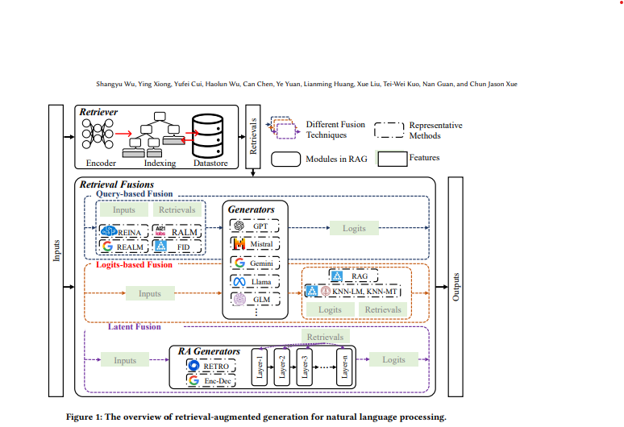
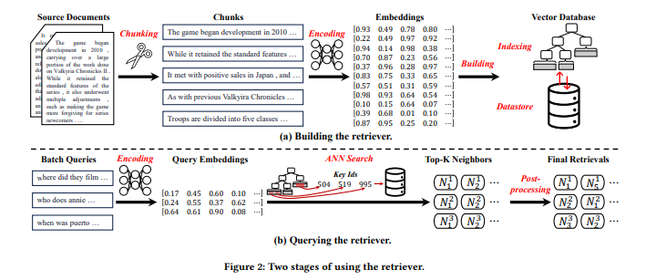
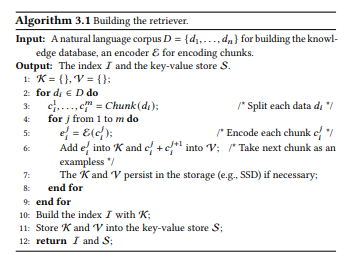
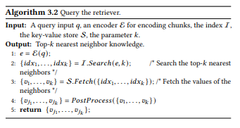
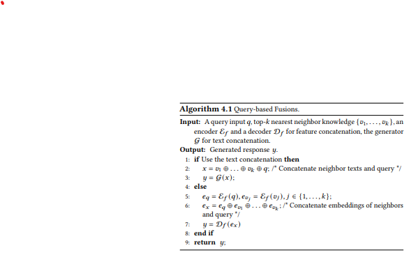
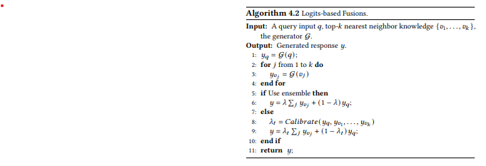
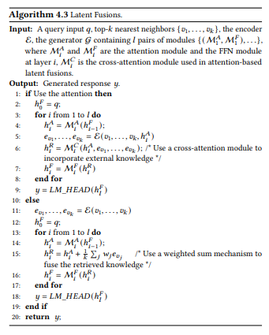
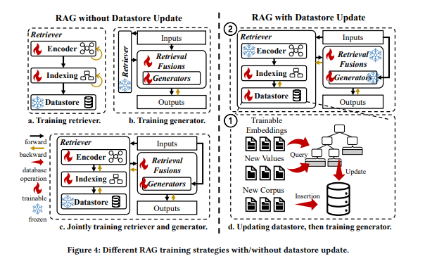

이 논문의 주요 내용은 아래와 같이 정리할 수 있습니다.

1. 대규모 언어 모델(LLMs)의 한계
- LLM이 다양한 분야에서 성공을 거두었지만, 다음과 같은 주요 문제점이 있음:
  - **환각 문제**: 부정확하거나 비논리적인 정보를 생성.
  - **지식 업데이트 문제**: 최신 정보를 통합하는 데 어려움.
  - **도메인 특화 지식 부족**: 특정 전문 지식이 필요한 경우 한계가 있음.

2. RAG의 역할
- 외부 지식 데이터베이스를 활용해 LLM의 한계를 보완.
- 외부 정보를 통합하여 정확하고 최신 정보를 제공함으로써 LLM을 강화.

3. 논문의 주요 초점
    3.1 RAG의 핵심 기술
    - **Retriever**: 외부 데이터베이스에서 관련 정보를 검색하는 기술.
    - **Retrieval Fusion**: 검색된 정보를 LLM에 효과적으로 통합하는 방법.

    3.2 RAG 학습
    - 데이터 저장소(datastore) 업데이트 여부에 따른 학습 방식.

    3.3 RAG의 응용
    - 자연어 처리(NLP) 작업과 산업적 응용 사례 소개.

    3.4 향후 과제와 발전 방향
    - RAG의 개발을 촉진하기 위한 도전과 과제 논의.

[Paper Link](https://arxiv.org/pdf/2407.13193)

## OVERVIEW OF RETRIEVAL-AUGMENTED GENERATION

### RAG의 구성과 NLP 응용 개요

RAG는 **Retriever**, **Generator**, 그리고 **Retrieval Fusion**이라는 세 가지 모듈로 구성됩니다.

#### 1. Retriever 모듈
- **구성 요소**:
  1. **인코더**: 입력 데이터를 임베딩으로 변환.
  2. **효율적인 인덱싱**: 근사 최근접 검색(ANN)을 지원하여 빠르게 관련 데이터를 찾음.
  3. **데이터 저장소(datastore)**: 키-값 쌍 형태로 외부 지식을 저장.

- **주요 과제**:
  - **검색 효율성**: 정보를 얼마나 빠르게 검색할 수 있는지 (예: 인코딩 가속화, 효율적 인덱싱, 배치 쿼리 처리).
  - **검색 품질**: 얼마나 관련성 높은 정보를 검색할 수 있는지 (예: 청크 표현 학습, 고급 ANN 알고리즘).

#### 2. Retrieval Fusion
- 검색된 정보를 생성 과정에 통합하는 기술.
- **세 가지 주요 유형**:
  1. **Query-based Fusion**: 검색된 정보를 입력에 추가한 후 생성기에 전달.
  2. **Logits-based Fusion**: 생성기의 출력 로짓(logits)에 검색 로짓을 결합하여 더 강건한 출력 생성.
  3. **Latent Fusion**: 검색된 정보를 생성기의 잠재 표현(latent representation)에 통합하여 성능 향상.

#### 3. Generator 모듈
- **분류**:
  1. **기본 생성기(Default Generators)**:
     - GPT 시리즈, Mistral 모델, Gemini 모델과 같은 일반적인 사전 학습/미세 조정 모델.
  2. **검색 기반 생성기(RA Generators)**:
     - 검색 결합 모듈을 포함한 생성기 (예: RETRO, EncDec).

- **역할**:
  - 검색된 정보와 입력을 기반으로 응답 생성 또는 예측 수행.

#### 4. RAG의 워크플로우
1. **정보 검색**: 주어진 입력을 바탕으로 외부 데이터베이스에서 관련 정보를 검색.
2. **정보 결합**: 검색된 정보를 입력 또는 중간 상태에 결합 (Fusion 기술 사용).
3. **결과 생성**: 입력과 검색된 정보를 기반으로 생성기가 예측 또는 응답 생성.

## Retriever 

### 1. Building the Retriever

Retriever를 구축하기 위해 대규모 자연어 코퍼스(corpus)를 사용하는 과정을 설명합니다. **Figure 2 (a)**에 나타난 것처럼, Retriever 구축은 다음 3단계로 이루어집니다:

1. **코퍼스 나누기 (Chunking Corpus)**  
2. **텍스트 청크 인코딩 (Encoding Chunks)**  
3. **벡터 데이터베이스 구축 (Building the Vector Database)**  
   - ANN(Approximate Nearest Neighbor) 인덱스 생성  
   - 키-값 쌍으로 데이터 저장  

#### 1.1 Chunking Corpus

Chunking은 대규모 문서를 작은 텍스트 조각으로 나누는 작업을 의미합니다.  
이 과정은 Retriever 구축의 필수 단계이며 다음과 같은 이유로 중요합니다:

- **의미적 독립성**: 인덱싱에 사용되는 텍스트 또는 임베딩은 하나의 핵심 아이디어를 포함해야 하며, 짧은 텍스트는 중의성이 클 수 있음.  
  예: "apple"은 과일 또는 회사를 나타낼 수 있음.  
- **리소스 최적화**: 긴 문서를 인코딩할 경우 Transformer 기반 모델에서 많은 리소스가 소모되므로, 짧은 텍스트 청크로 나누면 속도가 빨라지고 메모리 비용이 감소.  

청크 크기를 결정할 때는 다음 3가지 주요 포인트를 고려해야 함:

1. **작업 특성 (Task’s Property)**  
   - 작업 종류에 따라 적합한 청크 크기가 다를 수 있음.  
     예: 질문-응답 작업(QA)은 짧은 구문을 선호하지만, 요약 작업은 긴 문서를 선호.

2. **인코더 모델 특성 (Encoder’s Property)**  
   - 인코더 모델마다 텍스트 길이에 대한 처리 능력이 다름.  
     예: `sentence-transformer`는 단일 문장에서 성능이 좋고, `text-embedding-ada-002`는 긴 텍스트에 적합.

3. **쿼리 특성 (Query’s Property)**  
   - 사용자 쿼리의 길이가 청크 크기와 일치하도록 조정해야 함.  
     이는 쿼리와 청크 간의 문맥 정보량을 정렬해 검색 관련성을 높임.

##### 청크 크기 결정
- 청크 크기를 결정하는 **황금률(golden rule)**은 없으며, 특정 RAG(Retrieval-Augmented Generation) 시나리오에 따라 다름.

##### 청크 방식
1. **고정 길이 청크 (Chunking with Fixed Length)**  
   - 길이 하이퍼파라미터를 사용해 문서를 순차적으로 나눔.

2. **의미 기반 청크 (Semantic Chunking)**  
   - 문장의 끝을 나타내는 마침표, 줄바꿈 등의 문법적 구분에 따라 문서를 분리.  
   - NLTK, spaCy와 같은 도구로 쉽게 구현 가능.

3. **내용 기반 청크 (Content-Based Chunking)**  
   - 전자 의료 기록(EMR)의 섹션이나 프로그래밍 코드의 함수 블록과 같은 구조적 특성을 기준으로 문서를 분리.

#### 1.2  Encoding Chunks

텍스트 청크를 벡터 표현(임베딩)으로 변환하는 과정을 인코딩(Encoding)이라고 합니다. 이 임베딩은 청크의 의미를 포착하며, Retriever가 단순한 키워드 매칭이 아닌 내용의 관련성을 기반으로 유사성 검색을 수행할 수 있도록 합니다.

인코딩 방식의 종류는 아래와 같습니다. 

1. 희소 인코딩 (Sparse Encoding)
- 희소 인코딩은 대부분의 요소가 0인 고차원 벡터로 텍스트를 표현하는 방식입니다.
- 주요 방식
    1. **원-핫 인코딩 (One-Hot Encoding)**  
    - 단어를 고차원 벡터로 표현하며, 해당 단어의 위치에만 1을 표시.  
    - 벡터 크기는 전체 단어 집합의 크기와 동일.  
    - 제한된 의미 표현력.

    2. **단어 빈도 기반 인코딩 (Bag of Words, BoW)**  
    - 원-핫 인코딩을 개선하여 단어 빈도(frequency)를 사용.  
    - 문서의 문법과 단어 순서를 무시하며 통계적 정보에 집중.  
    - 제한적인 의미 표현.

    3. **TF-IDF (Term Frequency-Inverse Document Frequency)**  
    - 단어의 빈도를 계산하면서 문서 전체에서 얼마나 일반적인 단어인지 반영.  
    - 문서의 내용을 더 잘 설명하는 단어에 가중치를 부여.  
- 희소 인코딩은 효율적이지만, 깊은 의미적 정보는 포착하지 못함.

2. 밀집 인코딩 (Dense Encoding)
- 밀집 인코딩은 대부분의 요소가 0이 아닌 부동소수점으로 이루어진 벡터를 생성합니다. 이 방식은 깊은 의미적 특징을 포착하며, 주로 DNN 모델을 통해 생성됩니다.
- 주요 방식
    1. **BERT 및 변형 모델**  
    - BERT (Bidirectional Encoder Representation from Transformers)는 문맥 정보를 포함하는 밀집 임베딩을 생성.  
    - 변형 모델: RoBERTa, DistilBERT, ELECTRA 등.

    2. **Siamese Encoders**  
    - 입력 간 유사성을 학습하기 위해 설계된 신경망.  
    - 대조 학습(contrastive learning)을 통해 훈련.  
    - 대표 모델: DPR, SimCSE.

    3. **LLM-based Encoders**  
    - 대규모 언어 모델(LLM)의 강력한 표현 능력을 활용.  
    - LLM은 수십억 개의 매개변수를 가지고 방대한 데이터로 사전 훈련되어 있어 고급 언어 이해 능력을 보유.  
    - 대표 모델: text-embedding-ada-002, bge-embedding, mxbai-embedding.
- 밀집 인코딩은 희소 인코딩보다 더 넓은 언어적, 의미적 정보를 포착.
- 현재 대부분의 의미 표현 시나리오에서 널리 사용됨.

#### 1.3 Building the Index

- Building the Index
벡터 데이터베이스에서 인덱싱은 고차원 쿼리 임베딩과 유사한 데이터를 빠르게 검색할 수 있도록 설계된 과정입니다. 일반적인 데이터베이스의 삽입, 삭제, 갱신과 같은 작업보다는 **효율적인 근사 최근접 이웃(ANN) 검색**을 지원하는 데 초점을 맞춥니다. 이 과정에서 검색 품질과 효율성 간의 적절한 균형을 맞추는 것이 핵심 과제입니다.

- Choice of Similarity Metrics
    - 유사도 측정은 쿼리 임베딩과 청크 임베딩 간의 관련성을 측정하는 기본 구성 요소로, 검색 품질에 영향을 미칩니다.  
    - 대표적인 유사도 측정 방법:
        - **Cosine Similarity**: 두 벡터의 방향(각도)을 기반으로 유사도를 측정.
        - **Euclidean Similarity**: 두 점 사이의 직선 거리로 유사도를 측정.
        - **Manhattan Distance**: 축을 따라 이동한 거리로 유사도를 측정.
        - **Jaccard Similarity**: 집합 간의 교집합과 합집합의 비율로 유사도를 측정.

- Dimension Reduction on Embeddings
    - 임베딩의 차원을 줄이면 검색 효율성을 향상시킬 수 있으나, 의미 표현 손실 위험이 있습니다.
    1. **주성분 분석(PCA)**  
    - 데이터를 새로운 좌표계로 변환하면서 가장 중요한 특징을 유지.  
    - 간단하지만 효과적인 통계적 기법.
    2. **국소 민감 해싱(Locality-Sensitive Hashing, LSH)**  
    - 데이터를 버킷으로 매핑해 차원을 줄임.  
    - 입력 데이터의 유사성을 유지하며 효율적 검색 가능.
    3. **제품 양자화(Product Quantization, PQ)**  
    - 고차원 공간을 작은 하위 공간으로 나눠 각각 독립적으로 양자화.  
    - 하위 공간에서 코드를 생성하여 저장 공간과 검색 속도를 최적화.
    4. **AutoCompressor**  
    - 컨텍스트를 압축해 의미를 유지하면서도 더 짧은 임베딩으로 변환.

- Advanced ANN Indexing
1. **IVFPQ (Inverted File System with Product Quantization)**  
   - **코스 클러스터링(IVF)**: 데이터를 대략적으로 클러스터링해 검색 공간 축소.
    - 저장된 데이터를 여러 클러스터로 나누코, 각 클러스터는 Centroid를 가짐.
    - 데이터 벡터는 centroid와 가장 가까운 클러스터에 할당됩니다.   
   - **세부 양자화(PQ)**: 고차원 데이터를 여러 **하위 공간(subspace)**으로 나눕니다. 각 하위 공간에서 데이터를 압축해 **코드북(codebook)**으로 표현합니다.
    - 벡터 분할: [1.2, 3.4, 5.6, 7.8] 
        - 첫 번째 하위 공간: [1.2, 3.4]
        - 두 번째 하위 공간: [5.6, 7.8]
    - 하위 공간의 값 양자화: 각 하위 공간에서 값을 특정 "코드"로 매핑합니다.
        - 각 하위 공간에 대해 **4개의 클러스터(코드)**를 미리 정의합니다.
            - 첫 번째 하위 공간 코드북: {[1.0, 3.0], [1.5, 3.5], [2.0, 4.0], [2.5, 4.5]}
            - 두 번째 하위 공간 코드북: {[5.0, 7.0], [5.5, 7.5], [6.0, 8.0], [6.5, 8.5]}
        - 벡터의 값과 가장 가까운 클러스터를 선택해 매핑합니다:
            - [1.2, 3.4] → 첫 번째 하위 공간에서 코드 1 ([1.0, 3.0])
            - [5.6, 7.8] → 두 번째 하위 공간에서 코드 2 ([5.5, 7.5])
        - 최종 압축된 코드 (1, 2)
    - 쿼리 벡터와 가장 가까운 코드로 매칭하여 유사성을 계산.

2. **HNSW (Hierarchical Navigable SmallWorld)**  
    - 계층적 그래프 구조를 사용해 고차원 공간에서 ANN 검색을 수행.  
    - 상위 층일수록 노드가 적고, 대략적인 탐색이 가능
    - 하위 층으로 갈수록 정밀한 탐색이 가능
    - 각 노드는 자신의 **가장 가까운 이웃(nearest neighbors)**와 연결됩니다.
    - 노드 간 연결은 Small World Property를 따릅니다:
        - 가까운 노드와 강하게 연결.
        - 먼 노드와는 약하게 연결 (전역 탐색 가능).
    - 벡터를 노드로 처리하고 가장 가까운 이웃과 연결.  

3. **트리 기반 인덱싱 (Tree-based Indexing)**  
   - 고차원 벡터를 트리 구조로 구성.  
   - 대표적인 방식: 
     - **KD-Trees**
     - **Ball Trees**
     - **VP-Trees**  
   - 예: **Annoy (Approximate Nearest Neighbors Oh Yeah)**  
     - 랜덤 투영 기반으로 벡터 공간을 여러 초평면으로 분리해 검색 효율성 향상.

#### 1.4 Building the Datastore with Key-Value Pairs

벡터 데이터베이스에서 데이터스토어는 **키-값 쌍(key-value pair)** 형태로 데이터를 저장하고 관리하는 특수한 데이터베이스입니다.
- **키(Key)**: 고차원 임베딩을 고유하게 식별하는 값.
    - 주로 **고차원 임베딩**을 기반으로 생성.
- **값(Value)**: 특정 도메인의 정보를 저장.
    - 값은 검색 시 모델이 학습 또는 생성을 위한 **demonstration**로 사용할 수 있음.
- 데이터스토어는 대규모 데이터를 효율적으로 검색하고 유지하기 위해 설계됩니다.

대규모 데이터를 저장하려면 효율적인 검색과 데이터 영속성을 지원하는 저장 엔진이 필요합니다.
- **LMDB (Lightning Memory-Mapped Database)**: 고속 키-값 데이터 저장 지원.
- **RocksDB**: 대규모 데이터를 효율적으로 처리하고 유지할 수 있는 저장 엔진.

ANN 검색을 위한 데이터스토어의 핵심
- **값(Value)**에 어떤 데이터를 저장할지 결정하는 것이 중요.
- 이를 통해 검색된 데이터를 모델의 입력 프롬프트에 활용 가능.

최신 벡터 데이터베이스 솔루션
- 최근 다양한 **벡터 데이터베이스**가 ANN 검색 및 데이터스토어 기능을 제공합니다:
1. **Milvus**  
   - 대규모 벡터 데이터를 효율적으로 관리하고 검색 가능.
2. **FAISS (Facebook AI Similarity Search)**  
   - 고성능 벡터 검색과 임베딩 관리에 특화.
3. **LlamaIndex**  
   - 키-값 쌍의 저장과 검색을 통합하여 강력한 데이터 연결 지원.

#### 1.5 Code Demonstrations

Algorithm 3.1은 **자연어 코퍼스**를 기반으로 **Retriever**를 구축하는 단계별 절차를 제공합니다.  
입력으로 주어진 데이터를 처리하여 **인덱스(index)**와 **키-값 저장소(key-value store)**를 생성합니다.

1. **입력 및 출력**
- **입력**
    - **자연어 코퍼스(𝐷)**: 여러 문서로 구성된 데이터셋 `{𝑑1, 𝑑2, ..., 𝑑𝑛}`.  
    - 이 데이터는 추후 검색할 지식을 포함.
    - **인코더(𝐸)**: 텍스트 청크를 임베딩으로 변환하는 모델.  
    - 예: BERT, RoBERTa 등.
- **출력**
    - **인덱스(I)**: 효율적인 검색을 위해 생성된 데이터 구조.
    - **키-값 저장소(S)**: 청크 임베딩(키)와 텍스트 데이터(값)를 저장.

2. **알고리즘의 단계별 설명**
- **1단계: 초기화**
    - `K = { }`, `V = { }`:  
        - **K**: 임베딩(키)의 집합.  
        - **V**: 텍스트 청크(값)의 집합.
- **2단계: 문서 분할**
    - 각 문서 𝑑𝑖를 여러 텍스트 **청크(chunk)**로 나눕니다.  
    - 예: 문장 단위, 문단 단위 또는 특정 기준에 따라 나눌 수 있음.
    - 함수 `𝐶ℎ𝑢𝑛𝑘(𝑑𝑖)`는 문서 𝑑𝑖를 청크 `{𝑐1, 𝑐2, ..., 𝑐𝑚}`로 변환.

- **3단계: 청크 인코딩 (Line 4-5)**
    - 각 청크 𝑐𝑗를 인코더 𝐸를 통해 **임베딩 𝑒𝑗**으로 변환.  
    - 임베딩은 고차원 벡터로, 텍스트의 의미를 포착.  

- **4단계: 키-값 생성 및 저장 (Line 6-7)**
    - **키(K)**:
        - 각 청크의 임베딩 𝑒𝑗를 키로 추가.  
    - **값(V)**:
        - 현재 청크(𝑐𝑗)와 다음 청크(𝑐𝑗+1)를 연결한 텍스트를 값으로 추가.  
        - 예: 청크 `["AI is a branch", "of computer science"]` → 값: `"AI is a branch of computer science"`.
    - **데이터 영속성**:
        - 메모리 초과 문제를 방지하기 위해 필요시 키와 값을 저장소(e.g., SSD)에 저장.

- **5단계: 인덱스 생성 및 저장**
    - **인덱스(I)**:  
        - 키(임베딩)로부터 효율적으로 검색할 수 있는 데이터 구조 생성.  
        - 예: IVFPQ 또는 HNSW를 활용해 인덱스 구성.
    - **키-값 저장소(S)**:  
        - 최종적으로 모든 키와 값을 저장소에 저장.

- **6단계: 출력**
    - 인덱스(I)와 키-값 저장소(S)를 반환.

3. **알고리즘의 핵심**
    1. **문서 분할**: 문서를 청크로 나누어 처리 단위를 작게 만들어 효율성 향상.  
    2. **임베딩 생성**: 인코더를 통해 청크를 의미 기반의 벡터로 변환.  
    3. **키-값 구조**: 현재 청크와 다음 청크를 연결한 텍스트를 값으로 사용해 데이터 연속성 보장.  
    4. **저장 최적화**: 필요시 SSD 등 외부 저장소에 데이터 저장으로 메모리 초과 문제 해결.  

### 2. Querying the Retriever
Retriever에서 쿼리를 수행하는 과정은 다음 세 단계로 구성됩니다:
1. **쿼리 인코딩 (Encoding Queries)**  
2. **근사 최근접 이웃(ANN) 검색 (ANN Search)**  
3. **후처리 (Post-Processing)**  

#### **2.1 쿼리 인코딩과 ANN 검색**

- **1. 쿼리 인코딩**
    - **역할**: 사전에 구축된 임베딩 공간과 쿼리를 정렬(alignment)하기 위해 동일한 인코더를 사용하여 쿼리를 인코딩.  
    - 입력 텍스트 → 임베딩 벡터 변환.
    - **사용 도구**: Retriever 구축 시 사용된 것과 동일한 인코더(예: BERT, RoBERTa 등).

- **2. ANN 검색**
    - **(1) 인덱스 검색**
        - **목적**: 사전 구축된 인덱스를 검색하여 쿼리와 가장 가까운 `k`개의 이웃(nearest neighbors)을 찾음.
        - **과정**:
            1. **클러스터 비교**: 쿼리 임베딩과 클러스터 임베딩 비교 → 후보 클러스터 선정.
            2. **세부 검색**: 선정된 클러스터 내에서 쿼리 임베딩에 대해 **제품 양자화(Product Quantization)**를 수행하여 상위 `k`개의 최근접 이웃(top-k nearest neighbors)을 찾음.
            3. **결과 정렬**: 모든 후보를 통합하고 다시 정렬하여 최종 `k`개의 최근접 이웃 반환.

    - **(2) 데이터스토어에서 값 검색**
        - **역할**: 최근접 이웃의 고유 식별자(Key Identifier)를 기반으로 해당 값(Value)을 데이터스토어에서 가져옴.  
        - 예: 질문 임베딩(Key)을 통해 질문-답변(Value) 쌍을 반환.

#### 2.2 Post-Processing**
- 초기 검색 결과를 **세부적으로 조정, 개선, 또는 작업(task)-특화** 방식으로 적응.

- **대표적인 후처리 기법**
    - **재정렬 (Reranking)**
        - **목적**: 초기 검색된 결과를 특정 작업 목표에 따라 재배열.
        - 초기 검색은 일반적인 거리 측정 기준(예: 유클리드 거리)을 기반으로 수행되므로, 특정 작업에 적합하지 않을 수 있음.
        - 예: 질문-답변 작업에서는 문맥의 중요도를 기준으로 재정렬 필요.

#### 2.3 Code Demonstrations: Querying the Retriever

Algorithm 3.2는 Retriever에서 **Top-𝑘 최근접 이웃 지식**을 검색하는 코드를 보여줍니다. 이 과정은 다음 단계로 구성됩니다:

**1. 쿼리 인코딩**
- **역할**: 쿼리를 임베딩 벡터로 변환.
  - `𝑒 = E(𝑞)`
- **사용 도구**: Retriever 구축에 사용된 인코더와 동일한 모델.

**2. ANN 검색**
- **역할**: 인덱스(I)를 사용해 Top-𝑘 최근접 이웃의 식별자(IDs)를 검색.
  - `{𝑖𝑑𝑥1, ..., 𝑖𝑑𝑥𝑘} = I.Search(𝑒, 𝑘)`
- **과정**:
  1. 쿼리 임베딩과 사전 구축된 인덱스를 비교.
  2. 가장 가까운 Top-𝑘 이웃을 식별.

**3. 값 조회**
- **역할**: 최근접 이웃의 IDs를 기반으로 데이터스토어(S)에서 값(Value)을 가져오기.
  - `{𝑣1, ..., 𝑣𝑘} = S.Fetch({𝑖𝑑𝑥1, ..., 𝑖𝑑𝑥𝑘})`
- **결과**: 검색된 값(지식) 반환.

**4. 후처리**
- **역할**: 검색된 값을 작업(Task)-특화 방식으로 재정렬하거나 개선.
  - `{𝑣𝑗1, ..., 𝑣𝑗𝑘} = PostProcess({𝑣1, ..., 𝑣𝑘})`

**5. 결과 반환**
- 최종적으로 정제된 Top-𝑘 값을 반환:
  - `return {𝑣𝑗1, ..., 𝑣𝑗𝑘}`

## RETRIEVAL FUSIONS

Retrieval Fusion은 **검색된 지식**을 활용해 생성기(Generator)의 성능을 향상시키는 방법입니다.  

기본적으로 **Query-based Fusion, Logits-based Fusion, Latent Fusion**의 세 가지 유형이 있습니다.  

### **1. Query-based Fusion**

Query-based Fusion은 검색된 정보를 쿼리 입력에 통합하여 응답을 생성하는 가장 단순하고 직접적인 방식입니다.  
이 방법은 다시 **Text Concatenation**과 **Feature Concatenation**으로 나눌 수 있습니다.

#### **1.1 Text Concatenation**

- **정의**: 
  - 검색된 텍스트(Top-𝑘 문장/문서)를 입력 쿼리와 **텍스트 형태로 결합**하여 생성기에 전달.  
  - 주로 GPT-4와 같은 대규모 언어 모델(LLMs)에서 사용.

- **특징**:
  - 대규모 언어 모델이 블랙박스 시스템으로 작동하므로, 텍스트 기반 결합이 적합.
  - 사용자와의 상호작용이 제한된 API를 통해 구현.

- **방법**:
  - 단순한 텍스트 결합: 입력과 검색된 텍스트를 직접 연결.  
    - 예: `Input + Top-𝑘 Retrieved Texts` → 생성기.  
  - **Prompt 설계**:
    - In-context learning을 극대화하기 위해, 검색된 정보와 입력을 통합하는 효과적인 템플릿 설계.  
  - **중요도 기반 필터링**:
    - 검색된 지식 요소에 중요도 가중치를 할당하여 덜 관련 있는 정보를 필터링.
    - 긴 입력으로 인해 언어 모델의 입력 제한을 초과하지 않도록 조정.

- **장점**:
  - 구현이 간단하며 현대적인 LLM과 호환 가능.

#### **1.2 Feature Concatenation**

- **정의**: 
  - 검색된 텍스트를 **임베딩(특징)**으로 변환하여 입력 특징과 결합.  
  - 생성기 입력으로 사용.

- **방법**:
  - 검색된 텍스트를 전용 Encoder를 사용하여 Sparse/Dense 표현으로 변환.
  - 입력 특징과 검색된 특징을 연결하여 생성기로 전달.
    - 예: `Input Features + Retrieved Features` → 생성기.
  - **FID (Fusion-in-Decoder)**:
    - FID는 검색된 문서를 전용 Encoder로 인코딩한 후, 생성기의 입력으로 사용하는 간단하고 효과적인 방식.
    - FID의 최신 연구는 검색기(Retriever)와 FID 인코더를 공동으로 튜닝하여 성능을 향상.
  - **프롬프트 학습**:
    - 관련된 지식의 표현을 결합해 프롬프트 학습의 데모로 사용하여 일반화 성능 개선.

- **특징**:
  - 높은 메모리 비용 발생 (긴 시퀀스 길이 때문).

### **2. Logits-based Fusion**
Logits-based Fusion은 **검색된 지식(retrieved knowledge)**을 모델의 **출력 계층(logits)**에 통합하여 예측을 향상시키는 기법입니다.  
Generator를 사용해 검색된 텍스트들에 대해 logits을 계산하고, 쿼리 텍스트에 대해서도 동일한 Generator를 사용하여 Logit을 계산하고 검색된 logits과 쿼리 logit을 통합하여 최종 예측을 수행합니다. 
이 방식은 크게 **Ensemble-based Fusion**과 **Calibration-based Fusion** 두 가지로 나뉩니다.
 
#### **2.1 Ensemble-based Fusion**

- **정의**: 
  - 검색된 지식에서 얻은 **Logits**을 모델의 예측 결과와 결합하여 **앙상블** 방식으로 최종 출력을 생성.
  - 예: 각 이웃의 예측 결과를 통합하여 더 강건한 예측 제공.

- **주요 방법**:
  1. **kNN-LM** (k-Nearest Neighbor Language Model):
     - 검색된 Top-𝑘 이웃의 타겟 logits을 결합하여 최종 예측에 인터폴레이션.
     - 일반화와 강건성을 크게 향상.
  2. **kNN-MT** (k-Nearest Neighbor Machine Translation):
     - 검색된 logits을 활용해 기계 번역을 개선.

- **장점**:
  - 모델의 **일반화 성능**과 **강건성**을 크게 개선.

#### **2.2 Calibration-based Fusion**

- **정의**: 
  - 검색된 지식에서 얻은 **Logits**을 모델의 예측 결과를 **보정(calibration)**하는 데 사용.
  - Confidence-aware 방식으로 검색된 정보의 영향을 동적으로 조정.
  - 쿼리와 검색된 정보 간의 관련성을 기반으로 가중치를 조정하여 더 신뢰할 수 있는 최종 출력을 생성.
  - 𝜆 (Lambda): 검색된 정보와 쿼리의 logits을 결합하기 위한 가중치.
    - 𝜆 값은 동적으로 계산되며, 신뢰도가 높은 logits에 더 높은 비중을 할당.
    - 𝜆 계산 방식:
        - Confidence-based Weighting:
            - 각 logits의 확률 분포에서 신뢰도(confidence)를 계산.
            - 예: Softmax(𝑦𝑣𝑗)를 통해 각 logits의 확률 분포를 얻고, 가장 높은 확률 값을 신뢰도로 사용.
        - Relevance-based Weighting:
            - 쿼리와 검색된 logits 간의 유사도를 기반으로 가중치 설정.
            - 예: 코사인 유사도 또는 dot-product를 사용.

- **주요 방법**:
  1. **Confidence-enhanced kNN-MT**:
     - Neural Machine Translation(NMT)에서 검색된 logits의 분포를 신뢰도 기반으로 보정.
  2. **Source-context Calibration**:
     - 원본 문맥 정보를 활용해 검색된 logits을 기반으로 예측 보정.

- **장점**:
  - 예측 정확도를 개선하고, 검색된 정보의 중요도를 동적으로 조정.

### **3. Latent Fusion**
Latent Fusions는 **검색된 지식**을 생성기의 **숨겨진 상태(hidden states)**에 통합하여 최종 응답을 생성합니다.  

이 알고리즘은 크게 두 가지 방식으로 나뉩니다:
1. **Attention-based Latent Fusion**
2. **Weighted-Addition Latent Fusion**

#### **3.1 Attention-based Fusion**
- 검색된 지식을 생성기의 각 레이어에서 **크로스-어텐션(cross-attention)** 메커니즘으로 숨겨진 상태에 통합.
- 어텐션 메커니즘은 검색된 정보의 **중요도를 계산**하여 필요한 정보만 효과적으로 결합.

1. **초기화**:
   - 입력 쿼리 `𝑞`를 생성기의 초기 숨겨진 상태 `ℎ𝐹₀`로 설정합니다.

2. **레이어별 처리**:
   - 생성기는 여러 레이어(layer)로 구성되어 있으며, 각 레이어에서 검색된 지식과 입력 쿼리를 결합합니다.
   - 각 레이어에서 다음을 수행합니다:
     1. **ℎ𝐴ᵢ = M𝐴ᵢ(ℎ𝐹ᵢ₋₁)**:
        - 이전 레이어의 출력(`ℎ𝐹ᵢ₋₁`)을 어텐션 모듈(`M𝐴ᵢ`)로 처리하여 현재 레이어의 어텐션 상태(`ℎ𝐴ᵢ`)를 계산합니다.
     2. **𝑒𝑣₁, ..., 𝑒𝑣ₖ = E(𝑣₁, ..., 𝑣ₖ, ℎ𝐴ᵢ)**:
        - 검색된 지식(𝑣₁, ..., 𝑣ₖ)과 ℎ𝐴ᵢ를 사용해 임베딩(𝑒𝑣₁, ..., 𝑒𝑣ₖ)을 계산합니다.
     3. **ℎ𝑅ᵢ = M𝐶ᵢ(ℎ𝐴ᵢ, 𝑒𝑣₁, ..., 𝑒𝑣ₖ)**:
        - 크로스-어텐션 모듈(`M𝐶ᵢ`)을 사용해 ℎ𝐴ᵢ와 검색된 임베딩을 결합하여 레이어의 통합된 상태(`ℎ𝑅ᵢ`)를 생성합니다.
     4. **ℎ𝐹ᵢ = M𝐹ᵢ(ℎ𝑅ᵢ)**:
        - FFN(Feed Forward Network) 모듈(`M𝐹ᵢ`)을 사용해 숨겨진 상태를 업데이트.

3. **최종 출력**:
   - 마지막 레이어의 숨겨진 상태 `ℎ𝐹ₗ`을 출력 헤드(`𝐿𝑀_𝐻𝐸𝐴𝐷`)로 전달하여 최종 응답 `𝑦`를 생성합니다.

#### **3.2 Weighted-Addition Fusion**
- 검색된 지식을 크로스-어텐션 없이 **가중합(weighted addition)**으로 숨겨진 상태에 통합.
- 어텐션 기반 접근보다 계산이 가볍고 효율적.

1. **검색된 지식 임베딩 계산**:
   - 검색된 지식(𝑣₁, ..., 𝑣ₖ)을 인코더(`E`)로 변환하여 임베딩(𝑒𝑣₁, ..., 𝑒𝑣ₖ)을 생성합니다.
   - 이 작업은 오프라인에서 사전 수행할 수 있어 효율적입니다.

2. **초기화**:
   - 입력 쿼리 `𝑞`를 생성기의 초기 숨겨진 상태 `ℎ𝐹₀`로 설정합니다.

3. **레이어별 처리**:
   - 각 레이어에서 다음을 수행합니다:
     1. **ℎ𝐴ᵢ = M𝐴ᵢ(ℎ𝐹ᵢ₋₁)**:
        - 이전 레이어의 출력(`ℎ𝐹ᵢ₋₁`)을 어텐션 모듈(`M𝐴ᵢ`)로 처리하여 현재 레이어의 어텐션 상태(`ℎ𝐴ᵢ`)를 계산합니다.
     2. **ℎ𝑅ᵢ = ℎ𝐴ᵢ + (1/𝑘) Σ 𝑗 𝑤𝑗 𝑒𝑣𝑗**:
        - 검색된 임베딩(𝑒𝑣₁, ..., 𝑒𝑣ₖ)을 가중합으로 계산하여 ℎ𝐴ᵢ에 추가.
        - 𝑤𝑗는 학습된 가중치로, 검색된 정보의 중요도를 나타냅니다.
     3. **ℎ𝐹ᵢ = M𝐹ᵢ(ℎ𝑅ᵢ)**:
        - FFN(Feed Forward Network) 모듈(`M𝐹ᵢ`)을 사용해 숨겨진 상태를 업데이트.

4. **최종 출력**:
   - 마지막 레이어의 숨겨진 상태 `ℎ𝐹ₗ`을 출력 헤드(`𝐿𝑀_𝐻𝐸𝐴𝐷`)로 전달하여 최종 응답 `𝑦`를 생성합니다.

## GENERATORS
이 섹션에서는 **일반 생성기(Generators)**와 **검색 기반 생성기(Retrieval-Augmented Generators)**를 소개합니다. 두 유형의 생성기는 일반적으로 **대규모 데이터셋**에서 사전 학습됩니다.

### **특징**
- 대부분 **Transformer 기반 아키텍처**를 채택하거나 수정.
- 대규모 언어 모델(LLM)이 대표적.

### **주요 모델**
1. **Llama 시리즈**:
   - Meta에서 개발한 대규모 언어 모델.
2. **GPT 시리즈**:
   - OpenAI에서 개발한 Generative Pre-trained Transformer 모델.
   - 예: GPT-3, GPT-4.
3. **Gemini 시리즈**:
   - 고성능 언어 모델로, 생성 작업에 최적화.

### **구조적 특징**
- **Decoder-only 아키텍처**:
  - Encoder 모듈 제거.
  - Decoder는 어텐션 모듈과 FFN(Feed Forward Network)으로 구성.
- **고급 기술 적용**:
  - **Root Mean Square Layer Normalization**: 모델 안정성과 성능 개선.
  - **Rotary Position Embedding**: 위치 정보를 효율적으로 처리.
  - **Group Query Attention Mechanisms**: 효율적인 어텐션 계산.

## RAG TRAINING

### 1. RAG without Datastore Update
**RAG (Retrieval-Augmented Generation)**에서 **Datastore Update 없이 훈련**하는 경우, **데이터스토어의 지식은 고정된 상태**로 유지되며, RAG의 각 모듈(검색기와 생성기)의 **학습 가능한 파라미터만 업데이트**됩니다.  
이 방법은 생성기의 단기 메모리(short-term memory)에 저장된 지식을 기존 데이터스토어를 기반으로 업데이트하는 데 초점을 맞춥니다.

#### **1.1 검색기 훈련 (Training Retriever)**
- 검색기의 **인코더(encoder)**와 **인덱스(index)**를 훈련하여 검색 품질 향상.
- 데이터스토어의 내용은 고정된 상태로 유지.

1. **의미적 표현 개선**:
   - 검색기의 임베딩(embedding)이 더 나은 의미를 표현하도록 학습.
2. **인코딩 속도 향상**:
   - 더 효율적인 인코더로 교체해 속도 최적화.
3. **도메인 특화 표현 학습**:
   - 특정 도메인(예: 의료, 법률 등)의 데이터를 더 잘 표현하도록 학습.

- **훈련 방법**
1. **더 강력하거나 작은 인코더로 교체**:
   - **DistilBERT**: 경량화된 BERT로 인코딩 속도와 효율성을 높임.
   - **TinyBERT**: 더 작은 모델로 메모리 사용량 감소.

2. **대조 학습(Contrastive Learning)**:
   - 도메인 특화 데이터를 활용해 검색기가 쿼리와 문서 간의 의미적 유사성을 학습.
   - 결과: 특정 도메인에 적합한 임베딩 생성.

3. **인덱스 재구성**:
   - 검색기 인코더를 훈련한 후, 새로운 임베딩을 사용하여 **벡터 데이터베이스의 인덱스**를 다시 구축.
   - **변경 사항**:
     - 인코더가 변경되었을 경우: 새로운 임베딩 생성 후 재구성.
     - 인코더가 동일한 경우: ANN 검색 알고리즘을 새롭게 적용하거나 하이퍼파라미터 조정.

- **1.4 훈련 후 결과**
    - 훈련된 검색기는 데이터스토어를 변경하지 않고도 RAG에 바로 통합 가능.
    - 생성기(Generator)는 별도의 업데이트 없이도 개선된 검색 결과를 활용.

#### **1.2 Training Generator**
- 생성기의 파라미터 또는 **Retrieval Fusion Module**의 파라미터를 업데이트하여 성능 향상.
- 생성기는 일반적으로 **대규모 언어 모델(LLM)**이며, 이를 훈련하는 데 많은 자원과 시간이 필요.

1. **LLM 파라미터 효율적 미세 조정 (Fine-Tuning)**:
   - **LoRA (Low-Rank Adaptation)**:
     - 대규모 언어 모델을 효율적으로 미세 조정할 수 있는 기법.
     - 모델 전체가 아닌 **일부 파라미터만 업데이트**하여 자원 절약.

2. **Retrieval Fusion Module만 조정**:
   - Retrieval Fusion Module의 파라미터는 생성기 전체보다 적지만, 단독으로 조정하면 다음과 같은 문제가 발생할 수 있음:
     - **낮은 수렴률 (Low Convergence)**: 학습 속도가 느림.
     - **과적합 (Overfitting)**: 데이터에 너무 민감하게 학습.

3. **생성기와 Retrieval Fusion Module 동시 조정**:
   - 충분한 리소스가 있는 경우, **생성기와 Retrieval Fusion Module**을 함께 조정하는 것이 가장 효과적.
   - 더 나은 성능과 안정적인 학습을 보장.

#### **1.3 Jointly Training Retriever and Generator**
- 검색기와 생성기를 **동시에 훈련**하여 다운스트림 작업의 성능을 최적화.
- 검색된 정보와 생성 결과 간의 **더 나은 조정**과 **맥락적 이해력 향상** 가능.

1. **엔드 투 엔드 최적화 (End-to-End Optimization)**:
   - 입력에서 출력까지의 **미분 가능성(differentiability)**을 보장하여 모델을 공동 학습.

2. **복잡한 인덱스 사용 제한**:
   - FAISS와 같은 복잡한 인덱스는 미분 불가능하고, 훈련 중 실시간으로 업데이트하기 어렵기 때문에 미세 조정 단계에서 부적합.
   - 대신, 다음과 같은 방식 사용:
     1. **Pre-selection of Candidates**:
        - 복잡한 인덱스를 사용해 후보군(Top-N Neighbors)을 사전 선택.
        - 사전 후보군 선택으로 복잡한 검색 과정을 훈련 단계에서 제외.
     2. **최종 후보군 결정**:
        - 후보군 내에서 행렬 곱(Matrix Multiplication)을 통해 Top-𝑘 이웃 선택.
        - 이 방식은 미분 가능하므로 엔드 투 엔드 학습이 가능.

### 2. RAG with Datastore Update

이 섹션에서는 **RAG (Retrieval-Augmented Generation)**에서 **지식 데이터베이스(Knowledge Database)**를 업데이트하는 방법과 그 후 **검색기(Retriever)** 및 **생성기(Generator)**를 훈련하는 과정을 설명합니다.  
지식 데이터베이스를 최신 정보로 업데이트하여 검색과 생성의 정확도를 향상시키는 데 초점이 맞춰져 있습니다.

1. **1단계**: 지식 데이터베이스 업데이트.
2. **2단계**: 검색기와 생성기 훈련(선택 사항).

지식 데이터베이스를 업데이트한 후, 검색기와 생성기를 훈련하는 방식은 **RAG without datastore update**와 유사합니다.  
다만, **생성 모델(LLM)의 인-컨텍스트 학습 능력** 덕분에, 항상 훈련이 필요한 것은 아닙니다.

#### **2.1 지식 데이터베이스 업데이트 방법**

지식 데이터베이스 업데이트는 아래 세 가지 방식 중 하나로 이루어질 수 있습니다:

1. **Trainable Embeddings 업데이트**:
   - 값(values)이 **학습 가능한 임베딩(Trainable Embeddings)**으로 구성.
   - **RAG의 파라미터**와 동기 또는 비동기 방식으로 **동시에 업데이트**.
   - 예: 학습 과정에서 임베딩 값을 점진적으로 개선.

2. **새로운 값(New Values) 추가**:
   - 기존 키(key)에 해당하는 값(value)을 최신 정보로 업데이트.
   - 예: 질문-답변 데이터에서 **기존 질문의 답변**만 변경.
   - **프로세스**:
     1. 기존 키-값 쌍을 쿼리.
     2. 기존 값에 대한 **제자리(in-place) 업데이트** 수행.

3. **새로운 데이터(Corpus) 추가**:
   - 새로운 질문-답변 데이터와 같은 **새로운 키-값 쌍** 추가.
   - 예: 새로운 질문과 답변 데이터셋 추가.
   - **프로세스**:
     1. 데이터스토어에 새로운 키-값 쌍 삽입.
     2. 새로운 키에 대한 인덱스 재구축 또는 업데이트.

#### **2.2 데이터베이스 업데이트 후 훈련**

- 데이터베이스를 업데이트한 후, 검색기와 생성기를 다시 훈련하여 업데이트된 정보를 활용 가능.
- 훈련 과정은 **RAG without datastore update**와 동일:
  1. **검색기 훈련**:
     - 새롭게 업데이트된 데이터에 적합하도록 검색기 인코더와 인덱스를 조정.
  2. **생성기 훈련**:
     - 생성기의 파라미터를 조정하여 업데이트된 정보를 더 잘 생성하도록 학습.
  3. **검색기-생성기 동시 훈련**:
     - 입력에서 출력까지 엔드 투 엔드로 최적화.

- 항상 훈련이 필요한 것은 아님.
- 최신 대규모 언어 모델(LLM)은 **인-컨텍스트 학습 능력** 덕분에 추가 훈련 없이도 업데이트된 정보를 적절히 활용 가능.

## APPLICATIONS
RAG의 활용 사례는 **LLM 기반 자율 에이전트**와 **프레임워크** 두 가지 주요 영역으로 나뉩니다.  
이 섹션에서는 각각의 응용 사례를 이해하기 쉽게 정리합니다.

### **1. LLM-based Autonomous Agents**

- LLM 기반 자율 에이전트는 **대규모 언어 모델(LLM)**을 뇌 또는 컨트롤러처럼 활용하여 작업을 수행.
- **RAG**를 통해 외부 지식 데이터베이스(외부 메모리)와 통합하여 더 나은 의사 결정 및 문제 해결 능력 제공.

#### **외부 메모리에서 정보 검색**
- **외부 메모리**는 RAG의 **지식 데이터스토어** 역할을 하며, 에이전트가 검색하여 정보를 활용할 수 있는 기반 제공.
- **과정**:
  1. 에이전트가 쿼리 또는 작업을 수행할 때, RAG를 사용해 외부 메모리에서 관련 정보를 검색.
  2. 검색된 정보를 LLM의 생성 과정에 통합.
  3. 결과적으로 더 정확하고 맥락에 맞는 응답 생성.

- **장점**:
  - 에이전트가 지속적으로 학습하고 새로운 정보에 적응 가능.
  - 더 넓은 지식을 활용해 성능 향상.

#### **웹 검색 및 최신 정보 통합**
- 에이전트는 **웹 검색 도구**를 사용해 최신 정보를 수집하고, 이를 RAG를 통해 통합.
- **과정**:
  1. 에이전트가 웹에서 최신 데이터를 검색.
  2. 검색된 데이터를 RAG를 통해 LLM의 생성 과정에 반영.
  3. 최신 정보와 맥락을 반영한 정확한 응답 생성.

- **활용 사례**:
  - **뉴스 요약**: 실시간 뉴스 데이터를 기반으로 요약 생성.
  - **시장 분석**: 최신 시장 데이터를 분석하고 응답 제공.
  - **빠르게 변화하는 상황 대처**: 긴급 상황에서 최신 정보를 활용한 대응.

#### **RAG의 역할**
- 외부 메모리 또는 웹 데이터를 활용해 에이전트의 정보 범위를 확장.
- 더 나은 의사 결정 및 문제 해결 성능 제공.

### **2. 프레임워크 (Frameworks)**
- RAG의 실제 구현을 지원하는 대표적인 프레임워크:
  - **Langchain**
  - **LLaMAindex**
- 두 프레임워크는 RAG의 검색 및 생성 과정을 더욱 효율적이고 강력하게 만들어줌.

#### **Langchain**
- LLM과 **외부 지식 소스/데이터베이스**를 통합하는 미들웨어 역할.
- **언어 모델과 데이터 검색 시스템 간의 상호작용**을 조율하여, 더 정확하고 맥락에 맞는 응답 생성.

1. **정보 흐름 관리**:
   - 외부 데이터베이스에서 검색된 정보를 언어 모델의 생성 과정으로 전달.
2. **업데이트된 정보 활용**:
   - 초기 학습 데이터에 포함되지 않은 세부 정보나 최신 데이터를 활용.

- 외부 데이터에 의존하는 복잡한 작업(예: 실시간 데이터 요약, 특정 도메인 분석 등)을 수행하는 데 유용.

#### **LLaMAindex**
- 대규모 데이터를 구성하고 인덱싱하여 **효율적인 검색**을 지원하는 프레임워크.
- LLM의 **검색 속도와 정확성**을 향상.

1. **효율적인 쿼리 처리**:
   - 대량의 데이터를 빠르게 검색 가능.
2. **다양한 데이터 유형 지원**:
   - 텍스트 문서뿐만 아니라 구조화된 데이터베이스 등 다양한 데이터를 처리.
3. **확장 가능성**:
   - 대규모 데이터 환경에서도 안정적으로 작동.

#### **활용 사례**
- 간단한 사실 검색에서 복잡한 분석 작업에 이르기까지 다양한 응용 가능.

## DISCUSSION AND FUTURE DIRECTION

RAG (Retrieval-Augmented Generation)는 NLP에서 성공적인 결과를 보였지만, 여전히 개선해야 할 여러 과제가 존재합니다.  
이 섹션에서는 RAG의 주요 **과제**와 **미래 연구 방향**을 논의합니다.

### **1 Retrieval Quality (검색 품질)**

검색 품질은 RAG에서 검색된 정보의 **관련성**을 개선하는 것을 목표로 하며, 다음 네 가지 핵심 요소로 구성됩니다:

#### **1. 적절한 Key 설계**
- **과제**:
  - 벡터 데이터베이스에서 사용할 최적의 Key를 설계.
  - Key 설계는 주관적인 의사결정을 포함하며, 인간의 노력이 필요.
- **접근 방법**:
  - 주어진 작업을 QA 문제로 간주하여 적절한 입력 데이터를 선택.

#### **2. 임베딩 모델 선택**
- **과제**:
  - 텍스트를 벡터로 변환할 임베딩 모델(BERT, RoBERTa 등) 선택.
  - 데이터의 뉘앙스와 맥락적 의미를 잘 캡처해야 함.
- **접근 방법**:
  - 도메인 특화 코퍼스에서 모델을 훈련하여 데이터와 쿼리에 적합한 임베딩 생성.

#### **3. 효과적인 유사도 메트릭 설계**
- **과제**:
  - 쿼리와 검색된 정보 간의 관련성을 측정할 메트릭 설계.
  - 고전적 메트릭(코사인 유사도, 유클리드 거리) 외에도, 특정 작업에 맞춘 복잡한 메트릭(최적 전송 거리 등)을 활용.
- **접근 방법**:
  - 작업별 요구사항에 적합한 유사도 메트릭 개발.

#### **4. 근사 최근접 탐색 (ANN)**
- **과제**:
  - 효율적인 검색 속도와 높은 품질 간의 균형 유지.
- **접근 방법**:
  - 적합한 ANN 알고리즘(예: Product Quantization, HNSW)을 선택하여 성능 최적화.

### **2 RAG Efficiency (효율성)**

#### **1. RAG 효율성의 중요성**
- RAG의 효율성은 대규모 NLP 응용에서 중요하며, 검색 가능한 데이터의 양에 직접적인 영향을 미침.
- 간단한 해결 방법:
  - 데이터 양 축소 → 검색 품질 저하 가능성.
  - 컴퓨팅 리소스 추가 → 높은 비용 발생.

#### **2. 검색기 효율성**
검색기 효율성은 정보 검색에 소요되는 시간을 줄이는 데 초점을 맞추며, 다음 세 가지로 나뉩니다:

**2.1 인코딩 시간 (Encoding Time)**
- **과제**:
  - 작은 데이터베이스(< 1백만 항목)에서는 인코딩 시간이 주요 병목.
- **해결 방법**:
  - 모델 양자화, 디스틸레이션, 모델 축소를 통해 인코딩 속도 향상.

**2.2 ANN 검색 시간**
- **과제**:
  - 대규모 데이터베이스에서는 검색 시간 증가가 문제.
- **해결 방법**:
  - 효율적인 ANN 알고리즘(HNSW, Product Quantization) 적용.
  - 시스템 레벨 최적화(예: 데이터 스트럭처 개선).

**2.3 데이터 페칭 시간**
- **과제**:
  - 데이터스토어에서 정보 검색 시 발생하는 I/O 오버헤드.
- **해결 방법**:
  - 시스템 최적화 및 데이터 캐싱 전략 활용.

#### **3. 검색 융합 효율성 (Retrieval Fusion Efficiency)**
- **과제**:
  - 검색된 정보를 통합하는 과정에서 계산 비용이 과다 발생.
  - 예: Query-based Fusion의 긴 시퀀스 길이로 인해 오버헤드 증가.
- **해결 방법**:
  - 경량화된 융합 방법 적용(예: Fid-light, ReFusion).
  - 계산량을 줄이면서 검색된 정보를 효과적으로 통합.

### **3. Choices of Fusions (융합 방식의 선택)**

#### **1. 융합 방식의 종류**
1. **Query-Based Fusion**:
   - **방법**: 검색된 텍스트나 임베딩을 입력에 연결.
   - **장점**: 해석 가능성이 높고, API 기반의 LLM에도 쉽게 적용 가능.
   - **단점**: 입력 시퀀스가 길어져 계산 비용 증가 및 입력이 잘리는 문제 발생.
   - **개선 방향**:
     - 계산량 감소를 위한 효율적인 융합 방법 연구(Fid-light 등).
     - 긴 입력 길이를 처리하기 위한 모델 최적화.

2. **Latent-Based Fusion**:
   - **방법**: 검색된 정보를 모델의 숨겨진 상태에서 결합하여 더 추상적인 관계를 학습.
   - **장점**: 쿼리와 검색된 정보 간의 미묘한 관계를 더 잘 포착.
   - **단점**: 해석 가능성이 낮고, 사전 학습 또는 미세 조정이 필요.
   - **개선 방향**:
     - Latent Fusion의 해석 가능성을 높이는 연구.

3. **Logits-Based Fusion**:
   - **방법**: 검색된 정보의 logits을 생성기의 최종 출력 logits에 결합.
   - **장점**: 다양한 데이터 소스를 유연하게 통합 가능.
   - **단점**: 검색된 정보를 단순화해 풍부한 맥락을 잃을 수 있음.
   - **개선 방향**:
     - 효율적인 추론을 위한 방법 개발.

#### **2. 융합 방식의 결합**
- **접근 방법**:
  - Query, Latent, Logits Fusion을 결합하여 입력, 숨겨진 상태, 출력 단계에서 보강.
  - 생성 과정에서 "언제" 검색된 정보를 융합할지에 대한 연구.

### **4. RAG Training**
#### **1. RAG without Datastore Update**
- **과제**:
  - 검색기와 생성기의 모든 파라미터를 공동 최적화.
  - 다중 목표를 가진 손실 함수 설계.
- **개선 방향**:
  - 효율적인 튜닝 전략(예: LoRA)을 활용한 학습.

#### **2. RAG with Datastore Update**
- **과제**:
  - 검색 표현과 생성기 표현 간의 정렬.
  - 새로운 코퍼스 추가 시 생성기를 재훈련할 시점 결정.
- **개선 방향**:
  - 비동기 업데이트를 통해 표현 정렬 문제 해결.
    - 데이터 변화가 크거나 모델 성능에 큰 영향을 미칠 경우 → 생성기 재훈련.
    - 데이터 변화가 작거나 생성기의 인-컨텍스트 학습 능력이 충분할 경우 → 재훈련 생략.
  - 최신 효율적 학습 전략(LoRA, Adapters)을 활용해 미세 조정 가속화.

### **5. Cross-Modality Retrieval (교차 모달리티 검색)**
- **정의**:
  - 텍스트, 이미지, 비디오, 오디오 등 다양한 모달리티 정보를 통합하여 검색 및 생성.
- **이점**:
  - 텍스트만으로 모호한 의미를 이미지나 비디오로 보완.
  - 다양한 모달리티 간 정보를 결합해 더 풍부한 컨텍스트 제공.

1. **모호성 해소**:
   - "bank"와 같은 단어의 다중 의미를 시각적 맥락으로 구별.
2. **자율 주행**:
   - 교통 표지판과 주변 환경 데이터를 함께 처리해 더 나은 의사 결정.
3. **자연스러운 인간-컴퓨터 상호작용**:
   - 제스처, 표정, 음성 톤을 포함한 다중 모달 데이터를 처리하여 자연스러운 상호작용 제공.

- **다중 모달 데이터**를 학습한 모델은 일반화 능력과 강건성이 증가.
- 현실 세계의 다양한 시나리오에서 높은 성능을 발휘.
