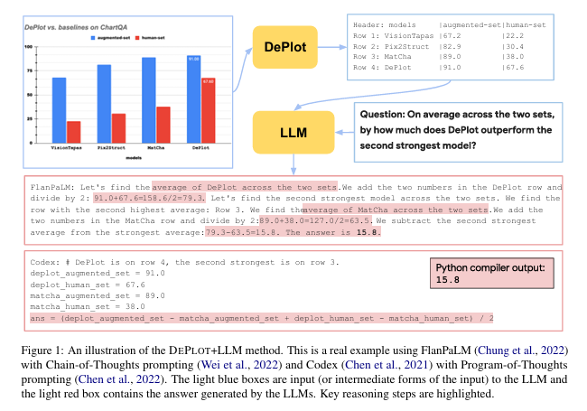
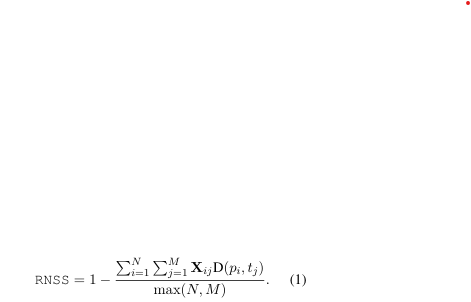
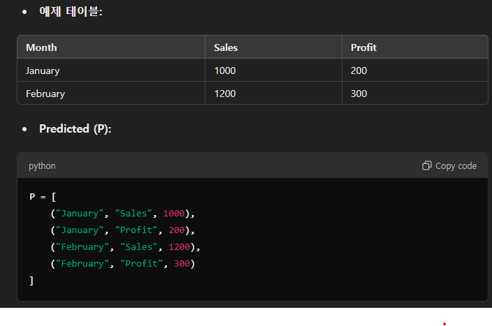
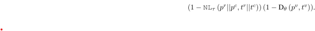
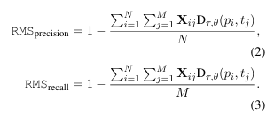

위 논문은 차트나 플롯과 같은 시각적 언어 데이터를 이해하는 데 필요한 새로운 방법을 제안한 연구입니다. 

1. **문제 정의**:  
   기존 최첨단(State-of-the-Art, SOTA) 모델들은 차트나 플롯과 같은 시각적 언어 데이터를 이해하기 위해 수만 개의 학습 예제가 필요하며, 특히 사람이 작성한 복잡한 질의에 대한 추론 능력은 여전히 제한적입니다.

2. **제안된 접근법**:  
   이 연구는 시각적 언어 추론 문제를 두 단계로 나눠 해결합니다:
   - **1단계: 플롯을 텍스트로 변환** (Plot-to-Text Translation)  
     차트 이미지를 선형화된 표 형태로 변환하는 모듈인 **DEPLOT**을 개발합니다.
   - **2단계: 변환된 텍스트를 기반으로 추론**  
     변환된 텍스트를 사전 학습된 대규모 언어 모델(LLM)에 입력하여 질의에 대한 답변을 생성합니다.

3. **DEPLOT의 역할**:  
   DEPLOT은 이미지 데이터를 표 형태로 변환하는 모듈로, 통합된 작업 형식과 평가 지표를 기반으로 학습됩니다. 이 모듈은 한 번 학습된 이후 **LLM과 플러그 앤 플레이 방식**으로 사용 가능하며, 대규모 언어 모델의 강력한 추론 능력을 활용할 수 있습니다.

4. **성과**:  
   DEPLOT과 LLM을 결합한 방법은 **단 한 번의 샘플 학습(one-shot prompting)** 만으로도 기존 수천 개의 데이터를 학습한 SOTA 모델에 비해 **29.4% 성능 향상**을 기록했습니다. 특히, 사람이 작성한 복잡한 질의에 대한 차트 QA(task of chart QA)에서 뛰어난 성과를 보였습니다.

5. **의의**:  
   DEPLOT을 통해 차트 이미지를 텍스트로 변환함으로써, 시각적 언어 데이터를 효율적으로 처리할 수 있는 새로운 가능성을 열었습니다. 이 방법은 적은 학습 데이터로도 강력한 추론 능력을 발휘하며, 실질적인 응용 가능성을 보여줍니다.

[Paper Link](https://arxiv.org/pdf/2212.10505)  

## Background

최근 몇 년간 **CLIP**(Radford et al., 2021)과 같은 **크로스모달(Cross-modal)** 작업을 위한 대규모 사전학습 모델이나, **GPT-3** 및 **PaLM**과 같은 **단일 모달(Single-modal)** 작업 모델이 등장하면서, 이들 모델의 강력한 **제로샷/소수샷 추론(Zero/Few-shot inference)** 능력이 복잡한 멀티모달(multimodal) 작업에 창의적인 해결책을 제공해 왔습니다.

### 주요 연구와 응용 사례:
- **Socratic Models (Zeng et al., 2023)**: 멀티모달 프롬프트(multimodal prompts)를 사용해 멀티모달 대화, 로봇 인식 및 계획과 같은 작업을 수행.
- **Minds’ Eyes (Liu et al., 2023b)**: 물리적 추론 질문을 코드로 변환해 물리 엔진에서 실행 가능하도록 설계.
- **MAGIC (Su et al., 2022)**: CLIP을 텍스트 생성 모델에 통합하여 **비지도 이미지 캡셔닝(unsupervised image captioning)**을 구현.
- **Yang et al. (2022)**: 자연 이미지를 텍스트로 변환한 후 **GPT-3**을 활용해 지식 기반 질의응답(VQA)을 수행.

### 기존 접근법의 한계:
대부분의 기존 방법은 **자연 이미지(Natural Images)**에 초점을 맞추며, 단순한 객체의 종류와 같은 기본적인 시각 정보만을 요구하는 작업에 주로 사용됩니다. 하지만, **시각-언어 추론(Visual Language Reasoning)**은 더 높은 수준의 난제를 포함합니다.

1. **정확하고 상세한 정보 추출(Information Extraction, IE)**: 복잡한 시각-언어 데이터(예: 그래프와 차트)에서 정보를 추출해야 함.
2. **강력한 수치적 추론(Numerical Reasoning)**: 추출된 정보를 바탕으로 질의에 답변할 수 있는 고급 수리적 사고가 필요.

### DEPlot 모델의 차별성:
- DEPlot은 위 두 가지 핵심 과제를 해결하기 위해, 각각의 작업에 뛰어난 사전학습 모델을 결합하여 사용합니다.
- 이를 통해, **복잡한 인간 작성 질문**에 답변할 때 **감독 학습(Supervised Learning)의 최신 성과(SOTA)**를 29.4% 초과하는 성능을 달성했습니다.
- 핵심 접근법은 작업을 **세분화(Decomposition)**하여 각 작업에 특화된 사전학습 모델의 강점을 극대화하는 것입니다.

### **테이블에 대한 제로샷 및 소수샷 추론**
- 전통적으로 **테이블 추론** 작업은 테이블에 특화된 구조를 가진 end-to-end 신경망 모델이 주도해왔습니다.  
  예) Herzig et al. (2020), Yin et al. (2020), Andrejczuk et al. (2022).  
- 최근에는 **대규모 언어 모델(LLMs)**을 사용해 테이블 데이터를 처리하는 방식이 늘어나고 있으며, 대표적으로:
  - **Chen (2023)**: GPT-3가 단 1개의 예제를 활용한 **제로샷 학습**만으로도 테이블 QA 데이터셋에서 최신 성능(SOTA)에 가까운 결과를 보임.
  - **Binder, Program of Thoughts, Program-Aided Language Models**: LLM을 **컴파일러/프로그램 실행기**와 결합하여 테이블 추론 작업에서 최고 성능 달성.

- **DEPLOT의 강점**:
  - **순수 LLM** 또는 **신경-심볼릭(neural-symbolic) 접근법**과 결합 가능.
  - 플러그앤플레이(plug-and-play) 방식으로 통합 가능.

### **플롯 및 차트에서 정보 추출**
- 기존의 플롯/차트 정보 추출(IE)은 주로 **파이프라인 기반**:
  - **OCR**(광학 문자 인식), 객체 탐지/세분화 시스템, 수작업 규칙 기반으로 구성.
  - 특정 그래프 유형에 맞게 설계됨.  
    예) **Kato et al. (2022)**: 선 그래프, **Rane et al. (2021)**: 막대 그래프.

- 대표적인 기존 연구:
  - **Chart-BERT**(Akhtar et al., 2023): OCR을 활용해 차트에서 텍스트를 추출한 뒤 추가 신경망 방법으로 처리.
  - **ChartOCR**(Luo et al., 2021): 모든 유형의 차트 입력을 처리하는 하이브리드 시스템.  
    - 차트 QA(Masry et al., 2022)와 요약(Kantharaj et al., 2022) 작업에 사용됨.

- **DEPLOT의 성능**:
  - 플롯에서 테이블로 변환하는 작업에서 **ChartOCR 대비 월등히 높은 성능**을 기록.

### **평가 및 새로운 접근법**
- 기존의 플롯 데이터 추출 평가 방식:
  - 그래프 유형별로 **서로 다른 평가 지표** 사용.  
    예) 좌표, 경계 상자(bounding boxes), 그래프 객체의 키포인트.
  - 이는 데이터 추출 과정의 중간 단계만 측정하며, **최종 데이터 추출 품질**은 평가하지 못함.

- DEPLOT의 접근법:
  - 플롯 데이터 추출 작업을 **플롯-테이블 변환(plot-to-table translation)** 작업으로 정의.
  - 목표: 차트의 기본 데이터 테이블을 정확히 얻는 것.
  - 기존 연구(Masry et al., 2022)와 차별화:
    - Masry et al.의 지표는 **숫자 집합 일치**만 고려해 테이블 구조를 무시.
    - DEPLOT은 **테이블 구조**까지 포함한 개선된 평가 지표를 제안하며 이를 논의

## Standardizing the Plot-to-table Task



### 1. Task Definition

#### DEPLOT의 **시각-언어 추론(Visual Language Reasoning)** 접근법
1. **문제 해결 방식**:  
   - 시각-언어 추론 작업을 두 단계로 나눕니다:
     1. **플롯(Plot)을 텍스트(Linearized Table)로 변환**: DEPLOT 모델을 사용.
     2. **변환된 텍스트를 LLM에 입력**: 추론 작업 수행.

2. **핵심 포인트**:  
   - **플롯-테이블 변환**은 추론 작업의 정확도를 높이기 위해 매우 중요합니다.
   - 이 작업은 단독으로도 중요한 응용(예: 자동 보고서 생성, 문서 디지털화)에 활용될 수 있습니다.

3. **새로운 제안**:  
   - 플롯-테이블 변환 작업을 표준화.
   - **새로운 평가 지표**를 도입하여 변환 품질을 평가.
   - DEPLOT 모델과 훈련 절차 소개

#### **기존 평가 지표(RNSS: Relative Number Set Similarity)**  
1. **RNSS 방식**:
   - 모델이 예측한 숫자 집합 P와 정답 숫자 집합 T 간의 **상대 거리(relative distance)**를 계산.
   - 최소 비용 매칭을 통해 두 집합 간의 유사도를 측정.

2. **계산 방법**:
   - 상대 거리: `D(p, t) = min(1, |p-t|/|t|)`
    - P = {p} N개의 예측된 테이블 숫자 
    - T = {t} M개의 실제 테이블 숫자자
   - 최종 RNSS 점수:
   
    - X: binary NxM 의 p와 t 간의 minimal cost matching matrix
        - X[i][j] = 1 : p와 t가 매칭됨
        - X[i][j] = 0 : P와 t가 매칭되지 않음 
    
3. **한계**:
   - **숫자 위치 정보**를 고려하지 않음.
   - **비숫자 콘텐츠**를 무시.
   - **큰 상대 오차**에도 점수를 부여.
   - **정확도(Precision)**와 **재현율(Recall)** 손실을 구별하지 않음.

#### **새로운 평가 지표(RMS: Relative Mapping Similarity)**  
1. **필요 조건(Desiderata)**:  
   새로운 지표는 다음 조건을 충족해야 함:
   - **행과 열의 전치(transpositions)** 및 **순서 변경(permutations)**에 불변.
   - 숫자나 텍스트 값의 **작은 오류는 허용하되 페널티 적용**.
   - **정확도와 재현율 손실**을 명확히 반영.

2. **RMS의 목표**:
   - 테이블의 구조를 더 잘 반영하며, 숫자뿐만 아니라 텍스트 정보도 포함.
   - 단순 숫자 일치 이상의 정교한 평가를 가능하게 함.

RMS는 테이블 유사성을 평가하기 위해 **숫자**와 **텍스트** 모두를 고려하며, 테이블을 단순한 숫자 집합이 아닌 **매핑(mappings)**의 집합으로 봅니다.

테이블의 각 항목을 `(row header, column header, value)`의 형태로 표현합니다:
- `p_i = (p_r, p_c, p_v)`: 예측 테이블 항목.
- `t_j = (t_r, t_c, t_v)`: 실제 정답 테이블 항목.



두 항목 간 유사성을 측정하기 위해 **헤더와 값의 거리**를 각각 계산합니다:

#### (1) **텍스트 거리 (헤더 간 거리)**:
- **Normalized Levenshtein Distance (NL)**: 두 문자열 간 유사도를 측정하는 방법.
- NL의 값을 tau로 제한:
  - tau 이상의 차이는 최대 거리(1)로 간주해 지나치게 다른 경우 부분 점수를 주지 않음.
- NL_tau: 텍스트 거리 계산.  
  예) NL_tau(p_r || p_c, t_r || t_c) → 행과 열 헤더의 결합 텍스트 간 거리.

#### (2) **값의 거리 (숫자 간 거리)**:
- **상대 거리(Relative Distance)**: 숫자 간 차이를 theta로 제한.
  - D_theta(p_v, t_v) = min(1, |p_v - t_v|/|t_v|)

#### (3) **전체 유사도 (헤더 + 값)**:
헤더와 값의 유사도를 결합하여 계산: 
    Dτ,θ(p,t)=
- 헤더와 값 모두 비슷하면 D값이 **1에 가까움**.
- 둘 중 하나라도 다르면 D값이 **0에 가까움**.

#### **매칭 (Matching)**:
- 유사도 D_{tau, theta}를 사용해 P와 T간 최소 비용 매칭 계산.
- 이진 행렬 X: 예측과 실제 테이블 항목 간의 매칭 정보.

#### **정확도 (Precision) & 재현율 (Recall)**:
- 매칭된 항목의 총 유사도를 기반으로 계산:



#### **테이블 전치 고려**:
- 테이블과 전치된 테이블(행과 열이 바뀐 버전) 모두 평가.
- RMS F1 점수가 더 높은 쪽을 최종 점수로 선택.

#### **RMS의 특징**
1. **행과 열의 순서 변경**에도 불변: 매핑 단위로 비교하기 때문.
2. **작은 오차를 허용하되 패널티 적용**: 텍스트와 숫자 모두 평가.
3. **정확도와 재현율을 명확히 반영**: 단순 매칭 이상의 정밀한 평가 가능.


### 2. Training Plot-to-table Conversion Models

DEPLOT은 기존의 복잡한 방법(규칙 기반, OCR 시스템, 객체/키포인트 탐지 등) 대신 **종단 간(end-to-end) 접근 방식**으로 플롯 데이터를 추출합니다.

#### **DEPLOT의 특징**
1. **간단한 설계**:  
   - DEPLOT은 모든 유형의 차트(line, dot, bar, pie 등)에서 작동하며, 차트 유형별로 다른 엔지니어링이나 하이브리드 구성 요소가 필요하지 않음.

2. **사용된 모델**:  
   - **MATCHA 모델**: 최신 시각-언어 모델(SOTA) MATCHA(Liu et al., 2023a)의 아키텍처와 가중치를 기반으로 초기화.
    - MATCHA는 플롯 데이터를 테이블로 변환하는 작업을 사전 학습에 포함했으나, DEPLOT은 **이 작업에만 초점을 맞춰 추가 학습**을 수행.
    - **긴 시퀀스 처리**를 위해 입력 길이를 192에서 512로 늘림.
   - **파인튜닝 작업**: 플롯 이미지를 해당 데이터 테이블로 매핑하는 작업으로 MATCHA를 추가 학습.

3. **출력 형식**:  
   - **테이블을 텍스트 시퀀스 형태로 변환**:  
     - **Markdown 형식**으로 출력.  
       - 셀 구분: `|`  
       - 행 구분: `\n`  
     - 예) `Year|Sales\n2020|1000\n2021|1200`

4. **학습 방식**:  
   - 모델은 왼쪽에서 오른쪽으로 **순차적(autoregressive)**으로 테이블을 생성.

#### **학습 데이터**
DEPLOT의 학습 데이터는 **플롯-테이블 쌍**으로 구성되며, **세 가지 출처**를 사용:
1. **Liu et al. (2023a) 생성 데이터**:  
   - MATCHA 모델에서도 사용된 **합성 데이터**.
2. **Methani et al. (2020) 생성 데이터**:  
   - PlotQA 데이터셋에서도 사용된 **합성 데이터**.
3. **Masry et al. (2022) 수집 실제 데이터**:  
   - 다음 웹사이트에서 크롤링된 **실제 플롯 데이터**:
     - statista.com
     - pewresearch.com
     - ourworldindata.org
     - oecd.org

##### **데이터 결합 비율**:
- 세 데이터셋의 비율은 **1:1:1**로 동일하게 섞어 사용.

##### **데이터 누출 방지**:
- 모델 성능 평가 시 데이터 누출(data leakage)을 방지하기 위해, 학습 데이터셋에서 테스트 데이터셋을 엄격히 분리.

### 3. Human Eval of Plot-to-table Metrics

RMS_F1이 기존의 RNSS보다 더 민감하고 신뢰할 수 있는 지표임을 확인하기 위해, 연구팀은 **인간 평가**와 **지표 평가**를 비교하는 실험을 수행했습니다.

#### (1) **데이터 준비**:
- **50개의 플롯-테이블 쌍** 샘플 사용:
  - 각 테이블은 플롯-테이블 변환 모델이 생성한 예측값.

#### (2) **평가 방법**:
1. RNSS와 RMS_F1 점수를 각각 계산.
2. 6명의 인간 평가자(모두 정보 추출 분야의 석사 이상의 연구자)가 테이블 품질을 평가:
   - 플롯(그래프)와 모델이 예측한 테이블을 제공.
   - 세 가지 질문을 바탕으로 1~5점 척도로 평가.

#### (3) **인간 평가 질문**:
1. **과잉 생성/누락 여부**:
   - 모델이 과도하게 행/열을 생성하거나 일부를 누락했는가?
2. **레이블 정확성**:
   - x축, y축 레이블/인덱스 이름 및 제목이 정확한가?
3. **숫자 값의 정확성**:
   - 숫자가 실제 값과 유사하며, 올바른 행/열 레이블과 연관되어 있는가?

#### (4) **평가 결과**:
- 각 테이블의 최종 점수는 **모든 평가자의 세 가지 질문 점수 평균**으로 계산.

#### (5) **상관 관계 계산**:
- RNSS와 RMS_F1 점수 각각에 대해 인간 평가 점수와의 상관 관계를 계산:
  - **Pearson’s r**: 선형 상관성.
  - **Spearman’s ρ**: 순위 상관성.

**사람의 판단과 메트릭간의 상관계수**
| **Metric** | **Pearson’s r** | **Spearman’s ρ** |
|------------|-----------------|------------------|
| RNSS       | 0.46            | 0.84             |
| RMS_F1      | **0.87**        | **0.96**         |


#### **결론**
- **RMSF1의 우수성**:
  - RMS_F1은 인간 평가와의 상관성이 RNSS보다 훨씬 높음.
  - 테이블 품질 평가에서 **민감도**와 **정보 전달력**이 더 뛰어남.

- **평가자 신뢰성**:
  - 평가자 모두 정보 추출 분야의 전문 연구자. 따라서 인간 평가 결과의 신뢰도가 높음.

## Prompting LLMs for Reasoning

### **DEPLOT을 활용한 질문 답변(QA) 시스템 구축**
DEPLOT은 **차트**나 **플롯**을 **텍스트 형태**(선형화된 테이블)로 변환할 수 있습니다. 이를 통해 **QA**(질문 응답) 작업을 위한 **텍스트 프롬프트**를 구성할 수 있습니다. 이 과정에서 **인-컨텍스트 학습(in-context learning)** 방식이 사용됩니다.

### **1. 텍스트 프롬프트 구성**
- **선형화된 테이블**과 **질문**을 **연결(concatenate)**하여 프롬프트를 만듭니다.
- 질문 응답에 대해 **하나의 예시**(one-shot example)를 프롬프트의 앞부분에 추가하여 모델이 예시를 학습하도록 돕습니다.

### **2. Chain-of-Thoughts (CoT) 및 Program-of-Thoughts (PoT)**
- **CoT**: **생각의 흐름**을 따르는 프롬프트 방식으로, 문제를 해결하는 과정도 함께 설명합니다. (Wei et al., 2022)
- **PoT**: **프로그램처럼 생각하는 방식**으로, 논리적이고 단계적인 사고 과정을 제공합니다. (Chen et al., 2022)
    - 추론 작업에서 계산과 추론을 분리하여 문제를 해결하는 방식으로, 문제 해결 과정을 프로그래밍 언어로 표현하고, 실제계산은 외부 컴퓨터가 수행하도록 합니다.
- 이 두 가지 방법을 사용하여 테이블 데이터를 바탕으로 한 추론을 평가합니다.

### **3. Self-Consistency (SC)**
- **SC 기법**(Wang et al., 2023)은 다양한 추론 경로를 탐색하고, 그 중 가장 일관된 답변을 선택함으로써 복잡한 문제에 대한 정확도를 향상시킬 수 있습니다.
    - 모델이 같은 문제에 대해 여러번 추론을 수행하여 다양한 답변을 생성합니다. 
    - 생성된 답변 중 가장 빈도가 높은 답변을 선택합니다. 
- 기존 CoT 방식은 하나의 **최고의 답을 선택**하는 방식인데, SC는 여러 번의 추론을 거쳐 더 정확한 답을 도출하려고 합니다.

### **4. 파이썬 코드 생성**
- **산술 연산**을 더 쉽게 처리하기 위해, 모델에 **파이썬 코드**를 생성하도록 요청하는 방법도 시도되었습니다. 이를 통해 모델이 계산을 자동으로 수행할 수 있습니다.
- 이를 위해 **Chen et al. (2022)**와 **Gao et al. (2022)**의 방식을 테이블 QA 문제에 맞게 조정하여 적용했습니다.

### **5. 향후 발전 방향**
- 향후에는 **세밀하게 학습된 테이블 QA 모델**(예: Herzig et al., 2020)을 사용할 수 있으며, **SQL 프로그램을 생성하는 LLM**(예: Cheng et al., 2023)을 활용할 수 있습니다. 이 모델들은 다양한 작업을 수행하기 위해 여러 번의 LLM 호출이 필요할 수 있습니다.

## Experiments

DEPLOT의 성능을 평가하기 위해 플롯-테이블 변환과 질문 응답(QA) 작업에 대해 실험을 진행했습니다. 주요 실험 설정과 결과는 다음과 같습니다.

### **1. 실험 설정**

#### **(1) 모델 훈련 및 추론**
- DEPLOT 훈련:
  - **훈련 스텝**: 10,000 스텝.
  - **최대 시퀀스 길이**: 512.
  - **하이퍼파라미터**: MATCHA 모델 사전 훈련과 동일.
- 추론 시:
  - DEPLOT의 **온도(Temperature)**: 0 (결과가 결정적).
  - LLM 프롬프팅 온도: 0.4.

#### **(2) 데이터셋**
- **ChartQA**:
  - **Human 세트**: 사람이 작성한 복잡한 질문 포함.
  - **Augmented 세트**: 합성적으로 생성된 템플릿 기반 질문.
- **PlotQA**:
  - **v1**: 추출 기반 질문.
  - **v2**: 수치적 추론 질문.

#### **(3) 평가 지표**
- **플롯-테이블 변환**:
  - **RNSS**와 **RMS_F1** 사용.
- **질문 응답**:
  - 수치 오차 허용 범위 5% 내에서 정확도(Exact Match Accuracy) 평가.

#### **(4) 하드웨어 및 모델 크기**
- 하드웨어: 64 GCP-TPUv3.
- DEPLOT: 282M 파라미터.
- LLM: Codex, GPT-3(175B), FlanPaLM(540B).

### **2. 주요 결과**

#### **(1) 플롯-테이블 변환**
- **비교 모델**:
  - **ChartOCR**: OCR 및 규칙 기반 시스템.
  - **PaLI**: 입력 해상도에 따라 224, 588 버전으로 나뉨.
  - **MATCHA**: DEPLOT이 초기화에 사용한 SOTA 모델.
- **결과**:
  | 모델               | RNSS  | RMSF1 |
  |--------------------|--------|--------|
  | ChartOCR           | 81.0   | 60.1   |
  | PaLI (res. 224)    | 77.2   | 24.8   |
  | PaLI (res. 588)    | 90.5   | 74.9   |
  | MATCHA             | 95.4   | 92.3   |
  | **DEPLOT**         | **97.1** | **94.2** |

- **해석**:
  - DEPLOT은 **ChartOCR**보다 훨씬 높은 점수를 기록.
  - PaLI와 MATCHA를 상회하며 플롯-테이블 변환에서 최고 성능을 달성.

#### **(2) 질문 응답(QA) 작업**
- **DEPLOT + LLM** 조합:
  - CoT(Chain-of-Thoughts).
  - PoT(Program-of-Thoughts).
  - Self-Consistency(SC).

- **결과**:
  - **ChartQA Human 세트**에서 DEPLOT+LLM이 SOTA를 29.4% 상회.
    - 이전 SOTA(MATCHA): 38.2%.
    - DEPLOT+LLM: 67.6%.
  - **PlotQA v1/v2**에서는 SOTA보다 성능이 낮음.

#### **(3) 추가 실험**
- **Zero-/Few-Shot**:
  - Zero-shot에서는 실패.
  - Few-shot은 One-shot과 비슷한 성능.
- **RLHF 기반 모델(ChatGPT, GPT-4)**:
  - DEPLOT+LLM 조합에서 Zero-shot 학습이 가능하며 성능 개선 가능.

### **3. 결론**
1. **플롯-테이블 변환**:
   - DEPLOT은 기존 SOTA 모델보다 높은 변환 정확도를 보여줌.
   - 특히, RMSF1에서 DEPLOT의 강점이 뚜렷함.

2. **질문 응답**:
   - 인간 작성 질문에서 DEPLOT+LLM이 뛰어난 성능.
   - 합성 데이터에서는 기존 SOTA가 더 강력.

3. **의의**:
   - DEPLOT+LLM은 최소한의 학습 데이터로 복잡한 QA 작업에서 우수한 성능을 발휘.
   - 인간 작성 질문에서의 강력한 성능은 실제 문제 해결 능력을 보여줌.

## Analyses and Discussions
DEPLOT의 강점과 약점을 구체적으로 이해하기 위해 **사례 연구(case study)**와 **오류 분석(error analysis)**을 수행했습니다. 또한, 분포 외(out-of-distribution) 차트에서의 성능도 평가했습니다.

### **사례 연구 및 오류 분석**

#### **(1) 성공 사례: 강력한 수치 추론**
- **질문**: 인도네시아와 아일랜드의 점유율 합에서 모리타니아의 점유율을 뺀 값은 얼마인가요?
- **결과**:
  - **MATCHA**: 0.07 (잘못된 답변)
  - **DEPLOT+FlanPaLM(CoT)**:
    - 계산 과정: ` 2.88 + 2.33 = 5.21, 5.21 - 4.15 = 1.06 `
    - 최종 답변: 1.06 (정확)
  - **DEPLOT+Codex(PoT)**:
    - Python 코드 생성:
    ```python
    indonesia = 2.88
    ireland = 2.33
    mauritania = 4.15
    ans = (indonesia + ireland) - mauritania
    ```
    - 컴파일러 출력: 1.06 (정확)

- **해석**:
  - DEPLOT+LLM 조합은 **CoT**와 **PoT**를 통해 강력한 수치적 추론 능력을 보여줌.
  - LLM이 논리적 사고를 통해 문제를 해결하거나 코드를 생성하여 정확한 답변 도출.

#### **(2) 실패 사례: 시각적 속성의 손실**
- **질문**: "Identity theft"의 모든 막대의 평균이 회색 막대의 최대값보다 큰가요?
- **결과**:
  - **MATCHA**: No (잘못된 답변)
  - **DEPLOT+FlanPaLM(CoT)**:
    - 계산 과정:
      - "Identity theft"의 평균: ` (66 + 17 + 16) / 3 = 33 `
      - 회색 막대의 최대값: 26.
    - 답변: Yes (올바른 이유가 아님).
  - **DEPLOT+Codex(PoT)**:
    - Python 코드 생성:
      ```python
      # Identity theft corresponds to row 5
      # Numbers on row 5 are [66, 17, 16]
      # Highest value of the gray bar is 79
      ans = 66 > 79
      ```
    - 컴파일러 출력: No (잘못된 답변).

- **해석**:
  - DEPLOT+LLM은 시각적 속성(예: 색상) 정보를 잃어버림.
  - 테이블로 변환하면서 색상과 같은 정보가 손실되어 추론 오류 발생.

### **PlotQA와 ChartQA 비교**
- **ChartQA**:
  - DEPLOT+LLM은 인간이 작성한 복잡한 질문(ChartQA Human Set)에서 SOTA를 크게 초과.
  - **DEPLOT+LLM (FlanPaLM + Codex + SC)**: 67.6% (기존 38.2%에서 29.4% 향상).
- **PlotQA**:
  - DEPLOT+LLM은 SOTA(MATCHA)보다 낮은 성능.
  - **MATCHA 성능**: 91.5% (인간 한계 80.5% 초과).
  - **DEPLOT+LLM 성능**: 66.6%.

#### **PlotQA에서 성능 저하 이유**
1. **템플릿화된 합성 질문**:
   - PlotQA의 합성 질문은 제한된 유형의 질문만 포함.
   - SOTA 모델(MATCHA)은 수천 개의 학습 예제를 통해 이 패턴을 학습함.
   - DEPLOT+LLM은 one-shot 학습 방식으로 이러한 패턴을 학습하기 어려움.

2. **플롯-테이블 변환 과정에서 정보 손실**:
   - 색상, 모양, 방향 등의 시각적 속성이 테이블 변환 시 손실.
   - 이러한 속성을 활용한 질문에 대해 모델이 오답을 냄.

### **분포 외(out-of-distribution) 분석**

DEPLOT의 일반화 능력을 평가하기 위해, 학습 데이터와 다른 도메인 및 스타일의 차트에서 성능을 테스트했습니다.

#### **1. 배경 및 필요성**
- **평가 한계**:
  - DEPLOT은 **ChartQA**와 **PlotQA** 데이터셋으로 평가됨.
  - 이 데이터셋은 DEPLOT의 훈련 데이터와 동일한 도메인에서 생성된 차트를 포함, 일반화 능력을 확인하기 어렵다.
- **목적**:
  - DEPLOT이 **다른 도메인**(웹사이트나 새로운 툴에서 생성된 차트)에서도 잘 작동하는지 평가.

#### **2. 실험 설정**
- **데이터셋**: 
  - 최근 공개된 **TaTa 데이터셋**(Gehrmann et al., 2022)에서 10개의 차트를 수집.
  - **제외 항목**:
    - Choropleth 지도(훈련 데이터에서 본 적 없음).
- **평가 지표**:
  - **RMS_F1**로 차트에서 테이블을 복원하는 정확도 측정.

#### **3. 결과**
- DEPLOT의 평균 **RMSF1 점수**: **78%**.
- **관찰된 한계**:
  1. **주변 텍스트 방해**:
     - 차트 옆에 있는 참고 자료나 설명 텍스트에 모델이 영향을 받음.
     - 사전에 차트를 잘라내어(cropping) 성능이 향상됨.
  2. **화살표로 연결된 레이블 처리 어려움**:
     - 막대나 파이 섹션에 화살표로 연결된 레이블과 값을 제대로 이해하지 못함.

#### **4. 한계 원인**
- DEPLOT의 한계는 **훈련 데이터의 특성** 때문:
  1. 훈련 데이터가 주로 **잘 정리된 차트**와 테이블로 구성.
  2. 주변 텍스트와 화살표 같은 시각적 요소를 다룰 데이터 부족.

#### **5. 향후 계획**
1. **합성 데이터 개선**:
   - 훈련 데이터 생성 파이프라인을 강화하여 주변 텍스트나 화살표와 같은 시각적 속성을 포함.
2. **더 다양한 데이터 학습**:
   - 여러 스타일과 도메인의 차트를 포함하는 데이터셋 구축.

