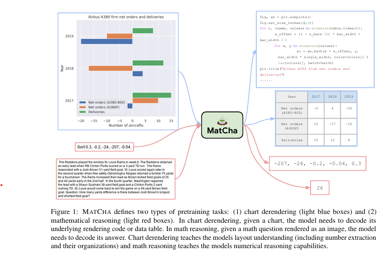

위 논문은 시각적 언어 데이터(예: 그래프, 차트, 인포그래픽)가 인간 사회에서 널리 사용되지만, 최신 비전-언어 모델이 이러한 데이터에서 잘 작동하지 못한다는 문제를 다룹니다. 이를 해결하기 위해 **MATCHA (Math reasoning and Chart derendering pretraining)**라는 새로운 접근 방식을 제안합니다. 논문의 주요 내용은 다음과 같습니다:

1. **MATCHA의 목표**  
   MATCHA는 그래프 및 차트와 같은 시각적 데이터를 언어 데이터와 함께 모델링하는 능력을 강화하기 위해 설계되었습니다. 특히, 플롯(차트) 해체(plot deconstruction)와 수치적 추론(numerical reasoning)을 포함한 몇 가지 사전 학습 과제를 제안합니다. 이는 시각적 언어 모델링에서 중요한 능력입니다.

2. **모델 기반**  
   MATCHA는 최근 제안된 이미지-텍스트 기반 비전-언어 모델인 **Pix2Struct**에서 출발하여 사전 학습을 수행합니다.

3. **성과**  
   - **PlotQA**와 **ChartQA**와 같은 표준 벤치마크에서 MATCHA는 기존 최첨단 방법론(state-of-the-art)보다 최대 **20%** 향상된 성능을 보였습니다.
   - 또한 MATCHA 사전 학습이 스크린샷, 교과서 다이어그램, 문서 내 그림 등 다양한 도메인으로도 잘 전이되며, 전반적인 성능 향상을 확인했습니다. 이는 MATCHA의 사전 학습이 더 넓은 시각적 언어 작업에 유용함을 입증합니다.

결론적으로 MATCHA는 그래프 및 차트를 포함한 시각적 언어 데이터를 더 잘 이해할 수 있도록 사전 학습 과제를 설계하여 최신 모델의 성능을 크게 향상시켰음을 보여줍니다.

[Paper Link](https://arxiv.org/pdf/2212.09662)

## Related Work

이 논문에서는 **시각적 언어(Visual Language)**와 관련된 기존 연구의 한계 및 이를 극복하기 위한 접근 방식을 다룹니다.

### **1. 기존 비전-언어 연구의 한계**
- **자연 이미지 중심**:  
  기존 비전-언어 연구는 자연 이미지와 관련된 데이터셋(예: NLVR2, MaRVL)을 중심으로 진행되었습니다.
- **합성 데이터셋의 단순함**:  
  SHAPES, NLVR, CLEVR 같은 합성 데이터셋은 시각적 언어 도메인에 속하지만, 실제 세계의 차트나 플롯에 비해 매우 단순합니다.
  - 합성 데이터셋은 패턴 인식과 추론 과정이 간단하여 정보 추출과 질의 응답이 쉽습니다.
  - 반면, 실제 시각적 언어 데이터는 정보 추출과 복잡한 논리적 추론이 필요합니다.
- 결과적으로, 기존 모델은 합성 데이터셋에서는 좋은 성능을 보이지만, 실제 세계의 시각적 언어 데이터셋에서는 성능이 저조합니다.

### **2. 기존 접근 방식**
1. **OCR 기반 모델**:  
   LayoutLM, ChartBERT 같은 모델은 OCR 시스템을 활용하여 텍스트를 추출하고 이를 Transformer 모델에 통합합니다.
   - **장점**: 텍스트 추출이 정확.
   - **한계**:
     - 실행 비용이 높음.
     - 차트나 플롯처럼 명시적인 텍스트가 없는 데이터는 처리하기 어려움.
2. **엔드투엔드 모델**:  
   Donut, Dessurt, Pix2Struct 같은 모델은 OCR을 사용하지 않고 문서나 시각적 언어를 직접 이해합니다.
   - Pix2Struct는 모든 시각적 언어 작업을 위한 일반적인 사전 학습 모델을 제공합니다.

### **3. MATCHA의 차별점**
MATCHA는 Pix2Struct를 기반으로 새로운 사전 학습 과제를 추가하여 모델의 추론 능력을 강화합니다.

#### **MATCHA의 핵심 과제**
1. **차트 데이터를 데이터 또는 코드로 변환**:  
   차트 이미지를 주고, 이를 데이터 테이블 또는 렌더링 코드로 변환.
2. **수학적 추론 학습**:  
   수학적 추론 데이터셋(MATH, DROP)을 활용하여 텍스트 기반 수학 문제를 풀도록 학습.

### **4. 기존 연구와의 관련성**
- 기존 연구들은 언어 모델의 추론 능력을 강화하기 위해 추가적인 학습 데이터를 생성하거나 프로그램 실행 결과를 학습에 활용.
- MATCHA는 이미지-텍스트 모델에 대해:
  - 차트를 데이터 및 코드로 변환하도록 학습.
  - 수학적 추론 데이터셋을 활용해 텍스트 기반 수학 문제 풀이를 학습.

## Method

### 1. Chart Derendering

위 내용은 **차트 디렌더링(Chart Derendering)**이라는 사전 학습 과제에 대해 설명합니다. 이를 간단히 정리하면 다음과 같습니다:

#### **차트 디렌더링이란?**
- **차트 디렌더링**은 차트나 플롯을 분석하여 이를 생성한 **데이터 테이블**과 **렌더링 코드**를 추출하는 작업입니다.
- 이 과정은 차트를 이해하는 데 필요한 모든 능력(시각적 패턴 발견, 정보 그룹화 및 추출 등)을 포함하기 때문에, 비전-언어 모델을 학습시키는 완벽한 사전 학습 과제가 될 수 있습니다.

#### **차트 디렌더링의 필요성**
- 차트나 플롯은 다음 두 가지 요소로 생성됩니다:
  1. **데이터 테이블**: 숫자 데이터와 그룹화된 정보.
  2. **렌더링 코드**: 차트의 레이아웃(유형, 방향, 색상, 모양 등)을 결정.
- 이러한 데이터와 코드는 렌더링 엔진(예: matplotlib, seaborn)을 통해 최종 이미지(차트)를 만듭니다.
- **디렌더링**은 이 과정을 반대로 수행하여 차트를 데이터와 코드로 변환합니다.

#### **학습 데이터 생성 방법**
차트, 데이터 테이블, 코드 세트를 한꺼번에 얻는 것은 어렵기 때문에, 데이터는 두 가지 방식으로 수집됩니다.

**(1)차트-코드(chart-code) 페어 수집**:
- GitHub의 IPython 노트북에서 차트와 직전 코드 블록을 크롤링하여 데이터 생성.
- 예: matplotlib, seaborn 등의 차트를 포함하는 코드 블록을 저장.

**(2)차트-테이블(chart-table) 페어 수집**:
- **직접 생성**: Wikipedia의 표 데이터를 웹 크롤링 후, 이를 차트로 변환.
  - 다양한 플롯 유형(막대, 선, 원형 차트)과 스타일(색상, 글꼴, 크기 등)을 랜덤하게 조합.
- **기존 데이터 활용**:
  - PlotQA에서 제공하는 차트-테이블 데이터를 추가하여 다양성을 확보.
  - Statista, Pew, Our World in Data, OECD 등의 웹사이트에서 제공하는 차트-테이블 데이터를 사용.

#### **데이터 활용과 성능 보장**
- **데이터 다양성**: 다양한 소스에서 수집한 차트-테이블 페어를 사용하면 모델 성능이 향상됨.
- **합성 데이터의 효과**: 합성 데이터만으로도 이미 성능이 크게 개선되며, 이는 차트 디렌더링 개념이 실제 차트로도 잘 전이될 수 있음을 보여줌.
- **테스트 정보 유출 방지**: 학습 데이터는 테스트 세트와 엄격히 분리하여 테스트 데이터가 사전에 노출되지 않도록 관리.

#### **차트 디렌더링의 장점**
- 시각적 패턴 분석과 데이터 추출 능력을 학습하는 데 효과적.
- 합성 데이터와 실제 데이터 모두에서 높은 전이 가능성을 보임.
- 다양한 차트 및 플롯 도메인에서도 성능 향상을 보장.

### 2. Math Reasoning 
위 내용은 **MATCHA** 모델의 사전 학습 과제 중 하나인 **수학적 추론(Math Reasoning)**에 대해 설명합니다. 이를 간단히 정리하면 다음과 같습니다:

- **수학적 추론이 필요한 이유**   
    - **시각적 언어 추론**에는 두 가지가 필요합니다:
        1. **시각적 요소의 인식과 그룹화**:  
            차트 디렌더링(Chart Derendering)으로 해결.
        2. **수학적 연산 적용**:  
            (예: 정렬, 최소값/최대값 찾기, 평균 계산 등)  
            이는 기존 사전 학습으로는 부족했기 때문에, 이를 보완하기 위해 **수학적 추론 학습**이 추가됩니다.

- **학습 데이터**
#### (1) **MATH 데이터셋**  
- **특징**:  
  - 합성적으로 생성된 수학 데이터셋.  
  - 약 **200만 개의 훈련 데이터**를 포함.
  - 문제 유형(모듈)별로 분류되어 있어, 필요한 수학 연산을 모델에 명확히 주입할 수 있음.
- **예시 문제 유형**:  
  정렬, 사칙연산, 기하 문제 등.

#### (2) **DROP 데이터셋**  
- **특징**:  
  - 읽기 이해(Reading Comprehension) 스타일의 QA 데이터셋.  
  - 약 **96,000개의 질문-답변 쌍**을 포함.  
  - 질문에 답하기 위해 문단(컨텍스트)을 읽고, 관련 숫자를 추출하여 계산을 수행해야 함.
- **형식**:  
  문단과 질문이 제공되며, 모델은 필요한 정보를 추출하고 계산해 답을 생성.

#### **학습 방법**
- **이미지 변환**:  
  MATH와 DROP 데이터셋의 입력(문제와 질문)을 이미지로 변환.  
  - 예: DROP의 경우 문단과 질문을 하나로 연결해 이미지를 생성.
- **이미지-텍스트 모델 학습**:  
  변환된 이미지를 입력으로 주고, 텍스트로 답을 디코딩하도록 학습.

#### **기존 학습 전략 유지**
- **Pix2Struct의 기존 학습 과제 추가 유지**:
  - 웹사이트 스크린샷 파싱: 스크린샷에서 숨겨진 HTML 코드를 예측.
  - **목적**: 새로운 학습 과제를 추가하면서도, 기존 학습 내용이 망각되지 않도록 방지(=catastrophic forgetting 방지).

#### **최종 사전 학습 과제**
- 차트 디렌더링.
- 수학적 추론(MATH + DROP 데이터셋 학습).
- 스크린샷 파싱.
- 이 모든 과제를 혼합하여 학습.

## Experiment

### 1. Experimental Setups

MATCHA는 세 가지 주요 사전 학습 과제를 사용하며, 각각의 비중은 다음과 같습니다:
- **수학적 추론(Math Reasoning)**: 40%  
  - MATH 데이터셋과 DROP 데이터셋을 각각 20%씩 사용.
- **차트 디렌더링(Chart Derendering)**: 40%  
  - 4가지 소스에서 데이터를 수집:  
    1. 자체 생성된 차트-테이블 데이터.  
    2. ChartQA에서 수집된 데이터.  
    3. PlotQA에서 생성된 데이터.  
    4. 차트-코드 데이터(비중: 4%, 데이터가 더 복잡하고 노이즈가 많기 때문).
- **스크린샷 파싱(Screenshot Parsing)**: 20%  
  - Pix2Struct에서 사용된 학습 과제 그대로 유지.

MATCHA는 다양한 데이터셋에서 성능을 평가합니다.
#### (1) **차트 도메인 데이터셋**
- **ChartQA**: 차트 이미지를 기반으로 질문에 답변하는 QA 데이터셋.  
  - **Augmented Set**: 기계 생성된 데이터, 주로 간단한 정보 추출.  
  - **Human Set**: 사람이 작성한 데이터, 더 복잡한 추론 필요.
- **PlotQA**: 차트 이미지를 기반으로 질문에 답변하는 QA 데이터셋.  
  - **v1**: 정보 추출 중심.  
  - **v2**: 수학적 계산과 추론이 더 중요.
- **Chart-to-Text Summarization**: 차트를 텍스트로 요약.  
  - **Pew**: 자동 생성된 요약 데이터.  
  - **Statista**: 사람이 작성한 요약 데이터.

#### (2) **추가 평가 데이터셋**
- **Pix2Struct에서 사용된 데이터셋**:  
  예: 문서 분석, UI 캡션 생성, 자연 이미지 이해 등.  
  - Pix2Struct 실험과 동일한 설정을 사용.

#### **평가 지표**
- **ChartQA와 PlotQA**: 정답 문자열의 5% 오차를 허용한 정확도(Relaxed Correctness).  
- **Chart-to-Text**: BLEU-4 점수.  
- **Pix2Struct 실험**: 원 논문에서 사용한 지표와 동일.

#### **학습 및 추론 세부 정보**
- **사전 학습**:
  - 배치 크기: 512.
  - 최대 시퀀스 길이: 192.
  - 학습 단계: 10만 스텝. (최종 체크포인트는 9만 스텝에서 선택)
- **다운스트림 과제 미세 조정**:
  - ChartQA, Chart-to-Text: 10,000 스텝.
  - PlotQA: 20,000 스텝. (데이터 크기가 더 크기 때문)
  - 배치 크기: 256, 시퀀스 길이: 128.
- **하드웨어**:  
  - MATCHA와 Pix2Struct: 64 TPUv3.  
  - PaLI(비교 모델): 128 TPUv4.

#### **기타 특징**
- **텍스트 입력 방식**: MATCHA는 이미지-텍스트 모델로 텍스트 입력이 없기 때문에, 텍스트(예: 질문)는 이미지로 렌더링되어 모델에 입력됩니다.  
  - 예: 질문을 차트 상단에 헤더로 추가한 후 이미지로 변환해 입력.

### 2. Main Results

MATCHA는 **ChartQA**, **PlotQA**, **Chart-to-Text Summarization** 세 가지 차트 플롯 도메인 벤치마크에서 우수한 성능을 보였습니다.

#### (1) **ChartQA**
- **MATCHA의 성능**:
  - 기존 SOTA 모델 **Pix2Struct**보다 **8.2%** 향상.
  - 심지어 **골드 데이터 테이블(차트의 원본 데이터)**을 사용하는 모델들보다도 **3~5%** 더 나은 성능.
- **다른 모델과 비교**:
  - **VisionTaPas**: 테이블 모델링을 위한 전문 모듈을 가지고 있지만, MATCHA보다 **2.4% 낮은 성능**.

#### (2) **PlotQA**
- **MATCHA의 성능**:
  - **v1 데이터셋**: VL-T5 모델(골드 테이블 사용)이 MATCHA보다 약 **4%** 더 높은 성능을 보였으나, 이는 PlotQA가 합성 데이터셋이고 v1이 단순한 정보 추출 질의를 포함하기 때문.
  - **v2 데이터셋**: 숫자 추론과 복잡한 질문을 포함하며, MATCHA가 모든 모델(골드 테이블 사용 모델 포함)을 능가.
  
#### (3) **Chart-to-Text Summarization**
- **MATCHA의 성능**:
  - **Pew 데이터셋**: 기존 SOTA 모델 Pix2Struct보다 성능이 향상되며 새로운 SOTA 달성.
  - **Statista 데이터셋**: PaLI-17B 모델에 비해 성능이 약간 낮음.
- **PaLI 모델 비교**:
  - PaLI는 자연 이미지 기반의 멀티모달 작업에서 우수하지만, 차트-텍스트 생성에서는 MATCHA보다 불리한 결과.

#### MATCHA의 전반적인 성능

- **SOTA 또는 경쟁력 있는 성능**:
  - 모든 설정과 작업에서 SOTA 성능을 기록하거나 매우 경쟁력 있는 결과를 보여줌.
- **Pix2Struct와 비교**:
  - 골드 테이블 없이 작업하는 강력한 비교 모델 Pix2Struct보다 평균적으로 약 **10% 더 높은 성능**.
- **PaLI와의 차이**:
  - **PaLI 모델(17B 파라미터)**는 MATCHA(300M 파라미터)에 비해 훨씬 큰 모델이지만, ChartQA 및 PlotQA에서 MATCHA보다 크게 뒤처짐.
  - 이는 차트/플롯 데이터의 시각적 언어가 자연 이미지 데이터와 본질적으로 다르기 때문.

#### **PaLI 모델의 성능 분석**
- **강점**:
  - Chart-to-Text 요약 작업에서 상대적으로 강세.  
  - BLEU4 점수는 텍스트의 유창함에 더 민감하고 사실성에는 덜 민감하기 때문.
- **약점**:
  - QA 작업에서는 차트/플롯 데이터의 복잡성과 논리적 추론이 중요하며, PaLI는 이러한 특성에 적합하지 않음.
  - 고해상도 입력 사용으로 성능 향상이 있지만, 메모리 및 계산 비용이 급격히 증가.

### 3. Results on Pix2Struct Task

MATCHA 모델은 차트/플롯 도메인 외에도 다양한 시각적 언어 데이터셋에서 성능을 평가하였으며, 

- **Pix2Struct 작업에서의 성능**:
  - MATCHA는 **Pix2Struct 모델** 대비 평균 **2.3% 더 나은 성능**을 기록.
  - ChartQA를 제외하더라도 평균 **1.6% 개선**.

#### **평가된 데이터셋**
MATCHA는 차트/플롯 외의 다양한 시각적 언어 데이터셋에서 평가되었습니다:
- **AI2D**: 교과서 다이어그램 기반 QA.
- **Widget Captioning**: 스크린샷 내 위젯을 인식하고 캡션 생성.
- **DocVQA**: 스캔된 문서에서 질문-답변 수행.
- **그 외 다양한 Pix2Struct 작업**.

- MATCHA의 사전 학습에서 습득한 지식은 **차트/플롯 도메인 외의 시각적 언어 데이터**로도 전이 가능.
- 다양한 시각적 언어 작업에서 Pix2Struct를 능가하는 성능을 보여줌으로써, MATCHA의 범용성과 효과성을 입증.

## Ablation Study

- 사전 학습의 주요 구성 요소를 제거하거나 특정 데이터셋을 제외한 경우 성능 변화를 분석.
#### **핵심 결과**:
1. **구성 요소별 중요성**
   - **차트 디렌더링 제거**: 성능 평균 **4% 감소** (가장 큰 영향).
   - **수학적 추론 제거**: 성능 평균 **2.4% 감소** (특히 Human Set에서 큰 영향).
   - **스크린샷 파싱 제거**: 성능 평균 **1.6% 감소**.
2. **데이터셋별 중요성**:
   - DROP 데이터셋 제거: 성능 **1.7% 감소** (더 큰 영향).
   - MATH 데이터셋 제거: 성능 **0.5% 감소**.
   - **실제 데이터(chart-table pairs)** 제거: Human Set에서 성능 **3% 감소**.

- **세분화 및 오류 분석 (Fine-grained and Error Analysis)**
    - ChartQA 테스트 세트를 기반으로 모델 성능과 오류를 세 가지 카테고리로 분석:
    1. **데이터 추출**: 복잡한 질의나 숫자 읽기 관련.
    2. **수학적 추론**: 계산(min/max/average 등) 필요.
    3. **플롯 속성**: 색상, 위치, 형태와 같은 시각적 속성 관련.
    - **결과**:
        - **MATCHA의 성능**:
            - 데이터 추출 및 수학적 추론에서 **Pix2Struct**와 **PaLI**보다 우수.
            - 플롯 속성 질문에서는 **PaLI**에 약간 뒤처짐 (전체 질문의 10% 미만).
            - **오류 분류**:
                - **48.3%**: 수학적 추론에서 발생.
                - **43.4%**: 데이터 추출에서 발생.
                - **8.0%**: 플롯 속성 관련 오류.

- MATCHA의 성공 사례와 실패 사례를 비교:
  1. **성공 사례**:
     - 평균 계산 또는 복잡한 참조 해석이 필요한 질문에서 MATCHA는 다른 모델을 능가.
  2. **실패 사례**:
     - 매우 정확한 숫자 계산이 필요한 질문에서는 여전히 오류 발생.

- MATCHA의 사전 학습 효과
    - **MATCHA 사전 학습 구성 요소**는 Pix2Struct의 기존 목표만 사용한 추가 학습보다 성능을 크게 향상.
    - ChartQA에서 **56.0 → 64.2**로 개선.
    - Pix2Struct의 기존 학습만 연장했을 경우, 성능이 **56.0 → 57.0**으로 미미하게 개선.
